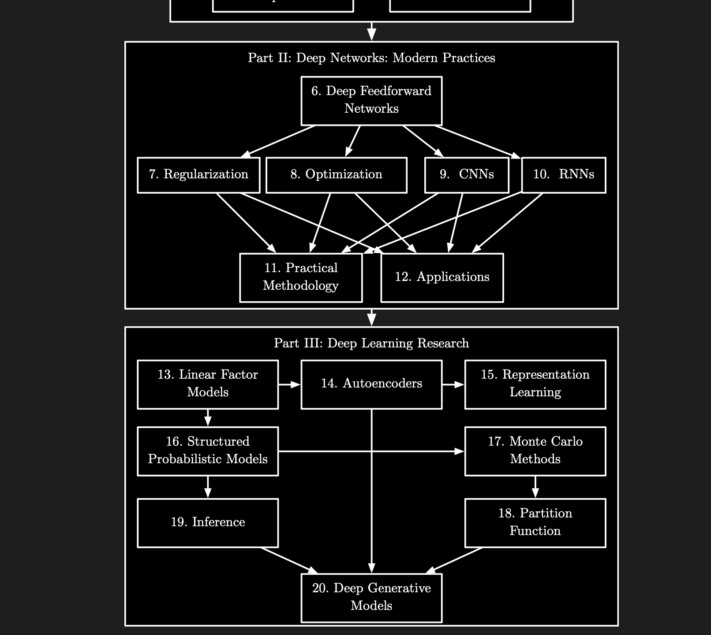

# 6.7960  
  
##   
## Readings  
  
  
Readings labeled [Vision] are from *++[Foundations of Computer Vision](https://visionbook.mit.edu/)++* by Antonio Torralba, Phillip Isola, and William T. Freeman. (MIT Press, 2024. ISBN: 9780262048972.) The book is available ++[online](https://visionbook.mit.edu/)++ under a CC BY-NC-ND license.  
**Session 1: Introduction to Deep Learning**  
**Required readings:**  
* ++[Notation for this course](https://ocw.mit.edu/courses/6-7960-deep-learning-fall-2024/resources/mit6_7950_f24_notation_pdf/)++  
* [Vision] ++[Chapter 12: Neural Networks.](https://visionbook.mit.edu/neural_nets.html)++  
**Optional readings:**  
* [Vision] ++[Chapter 13: Neural Networks as Distribution Transformers](https://visionbook.mit.edu/neural_nets_as_distribution_transformers.html)++  
**Session 2: How to Train a Neural Net**  
**Required readings:**  
* [Vision] ++[Chapter 10: Gradient-Based Learning Algorithms](https://visionbook.mit.edu/gradient_descent.html)++  
* [Vision] ++[Chapter 14: Backpropagation](https://visionbook.mit.edu/backpropagation.html)++  
**Session 3: Approximation Theory**  
No required readings.  
**Optional readings:**  
* ++[Deep learning theory lecture notes](https://mjt.cs.illinois.edu/dlt/)++ sections 2 and 5  
**Session 4: Architectures: Grids**  
**Required readings:**  
* [Vision] ++[Chapter 24: Convolutional Neural Nets](https://visionbook.mit.edu/convolutional_neural_nets.html)++  
**Session 5: Architectures: Graphs**  
**Required readings:**  
* Hamilton, William. *++[Graph Representation Learning](https://www.cs.mcgill.ca/~wlh/grl_book/)++*, chapter 5 (mainly focus on the content in section 5.1)   
**Optional readings:**  
* Xu, Keyulu, Weihua Hu, et al. “++[How Powerful Are Graph Neural Networks?](https://arxiv.org/abs/1810.00826)++” arXiv preprint arXiv:1810.00826 (2018).  
* Sanchez-Lengeling, Benjamin, Emily Reif, et al. “++[A Gentle Introduction to Graph Neural Networks](https://distill.pub/2021/gnn-intro/)++.” Distill, 2021.  
**Session 6: Generalization Theory**  
No required readings.  
**Optional readings:**  
* Zhang, Chiyuan, Samy Bengio, et al. “++[Understanding Deep Learning Requires Rethinking Generalization](https://arxiv.org/abs/1611.03530)++.” *arXiv preprint arXiv:1611.03530* (2016).  
* Belkin, Mikhail, Daniel Hsu, et al. “++[Reconciling Modern Machine-Learning Practice and the Classical Bias–Variance Trade-Off](https://www.pnas.org/doi/full/10.1073/pnas.1903070116)++.” *Proceedings of the National Academy of Sciences* 116, no. 32 (2019): 15849–15854.  
**Session 7: Scaling Rules for Optimization**  
**Required readings:**  
* ++[13.7 General Steepest Descent](https://kenndanielso.github.io/mlrefined/blog_posts/13_Multilayer_perceptrons/13_7_General_steepest_descent.html)++  
**Session 8: Architectures: Transformers**  
**Required readings:**  
* [Vision] ++[Chapter 26: Transformers](https://visionbook.mit.edu/transformers.html)++ (Note that this reading focuses on examples from vision, but you can apply the same architecture to any kind of data.)  
**Session 9: Hacker’s Guide to Deep Learning**  
**Optional readings:**  
* ++[A Recipe for Training Neural Networks](https://karpathy.github.io/2019/04/25/recipe/)++  
* ++[Rules of Machine Learning: Best Practices for ML Engineering (PDF)](https://martin.zinkevich.org/rules_of_ml/rules_of_ml.pdf)++  
**Session 10: Architectures: Memory**  
**Required readings:**  
* [Vision] ++[Chapter 25: Recurrent Neural Networks](https://visionbook.mit.edu/recurrent_neural_nets.html)++  
**Optional readings:**  
* ++[Deep Learning Recurrent Networks: Stability Analysis and LSTMs (PDF)](https://deeplearning.cs.cmu.edu/S22/document/slides/lec14.recurrent.pdf)++  
**Session 11: Representation Learning: Reconstruction-Based**  
**Required readings:**  
* [Vision] ++[Chapter 30: Representation Learning](https://visionbook.mit.edu/representation_learning.html)++  
**Optional readings:**  
* Bengio, Yoshua, Aaron Courville, and Pascal Vincent. “++[Representation Learning: A Review and New Perspectives](https://arxiv.org/abs/1206.5538)++.” *IEEE Transactions on Pattern Analysis and Machine Intelligence* 35, no. 8 (2013): 1798–1828.  
**Session 12: Representation Learning: Similarity-Based**  
**Required readings:**  
* Continue with session 11 readings  
**Optional readings:**  
* Wang, Tongzhou, and Phillip Isola. “++[Understanding Contrastive Representation Learning Through Alignment and Uniformity on the Hypersphere](https://arxiv.org/abs/2005.10242)++.” In *International Conference on Machine Learning*, pp. 9929–9939. PMLR, 2020.  
**Session 13: Representation Learning: Theory**  
No required readings.  
**Optional readings:**  
* Cho, Youngmin, and Lawrence Saul. “++[Kernel Methods for Deep Learning](https://papers.nips.cc/paper_files/paper/2009/hash/5751ec3e9a4feab575962e78e006250d-Abstract.html)++.” *Advances in Neural Information Processing Systems* 22 (2009).  
* Lee, Jaehoon, Yasaman Bahri, et al. “++[Deep Neural Networks as Gaussian Processes](https://arxiv.org/abs/1711.00165)++.” *arXiv preprint arXiv:1711.00165* (2017).  
**Session 14: Generative Models: Basics**  
**Required readings:**  
* [Vision] ++[Chapter 32: Generative Models](https://visionbook.mit.edu/generative_models.html)++  
**Session 15: Generative Models: Representation Learning Meets Generative Modeling**  
**Required readings:**  
* [Vision] ++[Chapter 33: Generative Modeling Meets Representation Learning](https://visionbook.mit.edu/generative_modeling_and_rep_learning.html)++  
**Optional readings:**  
* Kingma, Diederik P., and Max Welling. “++[Auto-Encoding Variational Bayes](https://arxiv.org/abs/1312.6114)++.” *arXiv preprint arXiv:1312.6114* (2013).  
**Session 16: Generative Models: Conditional Models**  
No required readings.  
**Optional readings:**  
* [Vision] ++[Chapter 34: Conditional Generative Models](https://visionbook.mit.edu/conditional_generative_models.html)++  
**Session 17: Generalization: Out-of-Distribution (OOD)**  
**Required readings:**  
* Mądry, Aleksander, and Ludwig Schmidt. “++[A Brief Introduction to Adversarial Examples](https://gradientscience.org/intro_adversarial/)++.” gradient science, July 6, 2018.   
* Mądry, Aleksander, Ludwig Schmidt, and Dimitris Tsipras. “++[Training Robust Classifiers (Part 1)](https://gradientscience.org/robust_opt_pt1/)++.” gradient science, July 11, 2018.  
**Optional readings:**  
* Koh, Pang Wei, Shiori Sagawa, et al. “++[Wilds: A Benchmark of In-the-Wild Distribution Shifts](https://arxiv.org/abs/2012.07421)++.” In *International Conference on Machine Learning*, pp. 5637–5664. PMLR, 2021.  
* Geirhos, Robert, Jörn-Henrik Jacobsen, et al. “++[Shortcut Learning in Deep Neural Networks](https://arxiv.org/abs/2004.07780)++.” *Nature Machine Intelligence* 2, no. 11 (2020): 665–673.  
* Tsipras, Dimitris, Shibani Santurkar, et al. “++[From Imagenet to Image Classification: Contextualizing Progress on Benchmarks](https://arxiv.org/abs/2005.11295)++.” In *International Conference on Machine Learning*, pp. 9625–9635. PMLR, 2020.  
* Xiao, Kai, Logan Engstrom, et al. “++[Noise or Signal: The Role of Image Backgrounds in Object Recognition](https://arxiv.org/abs/2006.09994)++.” *arXiv preprint arXiv:2006.09994* (2020).  
* Xu, Keyulu, Mozhi Zhang, et al. “++[How Neural Networks Extrapolate: From Feedforward to Graph Neural Networks](https://arxiv.org/abs/2009.11848)++.” *arXiv preprint arXiv:2009.11848* (2020).  
**Session 18: Transfer Learning: Models**  
**Required readings:**  
* [Vision] ++[Chapter 37: Transfer Learning and Adaptation](https://visionbook.mit.edu/transfer_learning.html)++  
**Optional readings:**  
* Farahani, Abolfazl, Sahar Voghoei, et al. “++[A Brief Review of Domain Adaptation](https://arxiv.org/abs/2010.03978)++.” *Advances in Data Science and Information Engineering: Proceedings from ICDATA 2020 and IKE 2020* (2021): 877–894.  
* Kay, Justin, Timm Haucke, et al. “++[Align and Distill: Unifying and Improving Domain Adaptive Object Detection](https://arxiv.org/abs/2403.12029)++.” *arXiv preprint arXiv:2403.12029* (2024).  
**Session 19: Transfer Learning: Data**  
**Required readings:**  
* Continue with session 19 readings.  
**Session 20: Scaling Laws**  
**Required readings:**  
* Kaplan, Jared, Sam McCandlish, et al. “++[Scaling Laws for Neural Language Models](https://arxiv.org/abs/2001.08361)++.” *arXiv preprint arXiv:2001.08361* (2020).  
**Optional readings:**  
* Hoffmann, Jordan, Sebastian Borgeaud, et al. “++[Training Compute-Optimal Large Language Models](https://arxiv.org/abs/2203.15556)++.” *arXiv preprint arXiv:2203.15556* (2022).  
* Sharma, Utkarsh, and Jared Kaplan. “++[A Neural Scaling Law from the Dimension of the Data Manifold](https://arxiv.org/abs/2004.10802)++.” *arXiv preprint arXiv:2004.10802* (2020).  
* Sorscher, Ben, Robert Geirhos, et al. “++[Beyond Neural Scaling Laws: Beating Power Law Scaling via Data Pruning](https://arxiv.org/abs/2206.14486)++.” *Advances in Neural Information Processing Systems* 35 (2022): 19523–19536.  
* McCandlish, Sam, Jared Kaplan, et al. “++[An Empirical Model of Large-Batch Training](https://arxiv.org/abs/1812.06162)++.” *arXiv preprint arXiv:1812.06162* (2018).  
**Session 21: Large Language Models**  
No required readings.  
**Optional readings:**  
* Kojima, Takeshi, Shixiang Shane Gu, et al. “++[Large Language Models Are Zero-Shot Reasoners](https://arxiv.org/abs/2205.11916)++.” *Advances in Neural Information Processing Systems* 35 (2022): 22199–22213.  
**Session 22: AI for Musical Creativity**  
No required readings.  
**Session 23: Metrized Deep Learning**  
No required readings.  
**Optional readings:**  
* Bernstein, Jeremy, and Laker Newhouse. “++[Modular Duality in Deep Learning](https://arxiv.org/abs/2410.21265)++.” *arXiv preprint arXiv:2410.21265* (2024).  
* Flynn, Thomas. “++[The Duality Structure Gradient Descent Algorithm: Analysis and Applications to Neural Networks](https://arxiv.org/abs/1708.00523)++.” *arXiv preprint arXiv:1708.00523* (2017).  
* Large, Tim, Yang Liu, et al. “++[Scalable Optimization in the Modular Norm](https://arxiv.org/abs/2405.14813)++.” *Advances in Neural Information Processing Systems* 37 (2024): 73501–73548.  
**Session 24: Inference Methods for Deep Learning**  
No required readings.  
**Optional readings:**  
* Sun, Yu, Xiaolong Wang, et al. “++[Test-Time Training with Self-Supervision for Generalization Under Distribution Shifts](https://arxiv.org/abs/1909.13231)++.” In *International Conference on Machine Learning*, pp. 9229–9248. PMLR, 2020.  
* Zelikman, Eric, Yuhuai Wu, et al. “++[Star: Bootstrapping Reasoning with Reasoning](https://arxiv.org/abs/2203.14465)++.” *Advances in Neural Information Processing Systems* 35 (2022): 15476–15488.  
**Session 25: Efficient Policy Optimization Techniques for LLMs**  
No required readings.  
  
  
  
  
  
## - Materials  
* ****Readings will come from a variety of sources and will be posted on the schedule each week.****  
* Some readings are derived from the course textbook, which can be found for free online: [Foundations of Computer Vision](https://visionbook.mit.edu/).  
* The best textbook devoted entirely to deep learning is probably [Understanding Deep Learning](https://udlbook.github.io/udlbook/), which is freely available online.  
* Content from 6.390 Intro to ML can also be found [here](https://introml.mit.edu/notes/?fbclid=PAQ0xDSwMxDVNleHRuA2FlbQIxMAABp0r1wjiBU7px9Kf6ziMGCn6NGB3GhTW-QhmDeMG5oCD9T6qAQW5ItdrbpohF_aem_jL3v0-a5F6jpmw5iOtA7Aw) for those who want to brush up on ML concepts.  
   
  

| Date | Topics | Course Materials |  |  |
| --------- | --------------------------------------------------------------------------------------------------------------------------------------------------------------------------------------------------------------------- | --------------------------------------------------------------------------------------------------------------------------------- | - | - |
| Week 1 |  |  |  |  |
| Thu 2/6 | Course overview, introduction to deep neural networks and their basic building blocks | slides |  |  |
|  |  |  |  |  |
|  |  | optional readings: |  |  |
|  |  | notation for this course |  |  |
|  |  | neural networks |  |  |
| Week 2 |  |  |  |  |
| Mon 9/6 | PyTorch Tutorial: 4-5 PM, 32-123 | pytorch tutorial colab |  |  |
| Tue 9/6 | How to train a neural net | slides |  |  |
|  | + details |  |  |  |
|  | SGD, Backprop and autodiff, differentiable programming | required readings: |  |  |
|  |  | gradient-based learning |  |  |
|  |  | backprop |  |  |
| Tue 9/6 | PyTorch Tutorial: 3-4 PM, 2-190 |  |  |  |
| Wed 9/6 | PyTorch Tutorial: 7-8 PM, 32-123 |  |  |  |
| Thu 11/6 | Approximation theory | slides |  |  |
|  | + details |  |  |  |
|  | How well can you approximate a given function by a DNN? We will explore various facets of this issue, from universal approximation to Barron's theorem. And does increasing the depth provably help for expressivity? |  |  |  |
| Fri 12/6 | PyTorch Tutorial: 11 AM -12 PM, 32-123 |  |  |  |
| Week 3 |  |  |  |  |
| Tue /16 | Architectures: Grids | slides |  |  |
|  | + details |  |  |  |
|  | This lecture will focus mostly on convolutional neural networks, presenting them as a good choice when your data lies on a grid. | required reading: |  |  |
|  |  | CNNs |  |  |
| Thu 2/7 | Architectures: Memory and Sequence Modeling | slides |  |  |
|  | + details |  |  |  |
|  | RNNs, LSTMs, memory, sequence models. |  |  |  |
| Week 4 |  |  |  |  |
| Tue 9/7 | Architectures: Transformers | slides |  |  |
|  | + details |  |  |  |
|  | Transformers. Three key ideas: tokens, attention, positional codes. Relationship between transformers and MLPs, GNNs, and CNNs -- they are all variations on the same themes! | reading: |  |  |
|  |  | Transformers (note that this reading focuses on examples from vision but you can apply the same architecture to any kind of data) |  |  |
| Thu 16/7 | Generalization Theory | slides |  |  |
|  |  |  |  |  |
|  |  | optional readings: |  |  |
|  |  | Deep learning requires rethinking generalization |  |  |
|  |  | Deep learning not so mysterious or different |  |  |
|  |  | Data science at the singularity |  |  |
| Week 5 |  |  |  |  |
| Tue 23/7 | Representation Learning: Reconstruction-based | slides |  |  |
|  | + details |  |  |  |
|  | Intro to representation learning, unsupervised and self-supervised learning, clustering, dimension reduction, autoencoders, and modern self-supevised learning with reconstruction losses. |  |  |  |
| Thu 1/8 | Representation Learning: Similarity-based (aka Neural Information Retrieval) | slides |  |  |
|  | + details |  |  |  |
|  | Information retrieval, contrastive learning (InfoNCE; hard negatives; KL distillation; self-supervised vs. supervised), sub-linear search and scaling tradeoffs (cross-encoders; bi-encoders; late interaction). | optional readings: |  |  |
|  |  | Contrastive Representation Learning |  |  |
|  |  | Contextualized Late Interaction over BERT |  |  |
|  |  | In Defense of Dual-Encoders |  |  |
| Week 6 |  |  |  |  |
| Tue 7/8 | Representation Learning and Information Theory | slides |  |  |
| Thu 8/8 | Foundation models: pre-training | slides |  |  |
|  |  |  |  |  |
|  |  | optional readings: |  |  |
|  |  | Language Models are Few-Shot Learners |  |  |
|  |  | SmolLM3; OLMo 2; Marin 8B |  |  |
| Week 7 |  |  |  |  |
| Tue 10/8 | Foundation models: scaling laws | slides |  |  |
|  | LLms also covered.. |  |  |  |
|  |  | optional readings: |  |  |
|  |  | Scaling Laws for LLMs |  |  |
|  |  | Training Compute-Optimal LLMs |  |  |
|  |  | Emergent Abilities of LLMs |  |  |
|  |  | Are Emergent Abilities of LLMs a Mirage? |  |  |
| Thu 10/16 | Generative models: basics | slides |  |  |
| Week 8 |  |  |  |  |
| Tue 10/21 | Midterm: 7:30 - 9:30 PM |  |  |  |
| Thu 10/23 | Generative models: VAE and GAN | slides |  |  |
| Week 9 |  |  |  |  |
| Tue 10/28 | Foundation models: post-training | slides |  |  |
| Thu 10/30 | Generative models: Diffusion and Flows | slides |  |  |
| Week 10 |  |  |  |  |
| Tue 11/4 | Generalization (OOD) | slides |  |  |
|  | + details |  |  |  |
|  | Exploring model generalization out of distribution, with a focus on adversarial robustness and distribution shift |  |  |  |
| Thu 11/6 | Transfer learning: Models and Data | slides |  |  |
|  | + details |  |  |  |
|  | Finetuning, linear probes, knowledge distillation, generative models as data, domain adaptation, prompting |  |  |  |
| Week 11 |  |  |  |  |
| Tue 11/11 | No class: Veterans Day |  |  |  |
| Thu 11/13 | Inference-time Algorithms | slides |  |  |
| Week 12 |  |  |  |  |
| Tue 11/18 | Guest Lecture: Deep Learning that Improves Real-World Interactions |  |  |  |
| Thu 11/20 | Evaluation | slides |  |  |
|  | + details |  |  |  |
|  | Designing benchmarks, selecting metrics, and using human input at inference |  |  |  |
| Week 13 |  |  |  |  |
| Tue 11/25 | Applying Deep Learning to Your Problems | slides |  |  |
| Thu 11/27 | No class: Thanksgiving Day |  |  |  |
| Week 14 |  |  |  |  |
| Tue 12/2 | Guest Lecture 2 |  |  |  |
| Thu 12/4 | Project office hours |  |  |  |
| Week 15 |  |  |  |  |
| Tue 12/9 | Guest Lecture 3 |  |  |  |
|  |  |  |  |  |
  
  
This syllabus is actually very well aligned with where deep learning and GenAI have converged. Looking at your background (Java + Microservices + moving into ML/LLMOps), I'd split it into **three layers**:  
## Layer 1: Core Deep Learning Foundations (Must Master)  
These topics appear repeatedly in interviews and are prerequisites for everything else.  

| Week | Topic                   | Importance |
| ---- | ----------------------- | ---------- |
| 1    | Neural Networks         | ⭐⭐⭐⭐⭐      |
| 2    | SGD, Backprop, Autodiff | ⭐⭐⭐⭐⭐      |
| 2    | Approximation Theory    | ⭐⭐⭐⭐       |
| 4    | Generalization          | ⭐⭐⭐⭐⭐      |
  
  
  
## Layer 2: Deep Learning Architectures  
This is where most practical ML happens.  
**CNNs**  
Week 3  
```
Image
↓
Convolution
↓
Pooling
↓
Classifier

```
Learn:  
* Convolution  
* Filters  
* Receptive Fields  
* Parameter Sharing  
Useful for:  
* Medical imaging  
* Breast cancer classification  
* Computer vision  
Since you mentioned ViT and breast cancer classification, CNNs remain important.  
  
**RNNs / LSTMs**  
Week 3  
Historically important.  
Learn:  
* Hidden state  
* Vanishing gradients  
* LSTM intuition  
**Don't spend too much time implementing them.**  
Today transformers dominate.  
  
**Transformers**  
Week 4  
**This is the most important architecture in the course.**  
Master:  
```
Tokenization
↓
Embeddings
↓
Attention
↓
Multi-head Attention
↓
Feed Forward Network

```
Understand:  
* Q  
* K  
* V  
* Self-Attention  
* Positional Encoding  
This directly powers:  
* GPT  
* Claude  
* Gemini  
* Llama  
  
## Layer 3: Modern ML / GenAI  
These are the sections most relevant to current industry hiring.  
**Representation Learning**  
Weeks 5-6  
Important because:  
```
Embeddings
↓
Vector Search
↓
RAG
↓
Chroma
↓
FAISS

```
You were asking about Chroma earlier.  
**This material explains why Chroma works.**  
Learn:  
* Contrastive Learning  
* Similarity Search  
* Embeddings  
* Retrieval  
  
**Foundation Models**  
Weeks 6-7  
This is modern LLM territory.  
Topics:  
* Pretraining  
* Scaling Laws  
* Emergence  
* Compute Scaling  
Important papers:  
* GPT-3  
* Chinchilla  
Interview level:  
Know the intuition.  
  
**Generative Models**  
Weeks 7-9  
Learn:  
**VAE**  
```
Encoder
↓
Latent Space
↓
Decoder

```
**GAN**  
```
Generator
vs
Discriminator

```
**Diffusion**  
```
Noise
↓
Denoise
↓
Image

```
Diffusion currently dominates image generation.  
  
## Most Relevant Weeks for Your Career Goal  
You are targeting:  
```
ML Engineer
LLMOps Engineer
GenAI Engineer

```
Priority order:  
**Tier 1**  
* SGD / Backprop  
* **Transformers**  
* **Representation Learning**  
* **Information Retrieval**  
* **Foundation Models**  
* **Transfer Learning**  
**Tier 2**  
* CNNs  
* Generalization  
* Evaluation  
* Inference-time Algorithms  
**Tier 3**  
* RNNs  
* GANs  
* Approximation Theory (deep details)  
  
## If I Were You  
Given your software engineering experience, I would spend extra effort on:  
```
Week 2  -> Backprop + Autograd
Week 4  -> Transformers
Week 5  -> Contrastive Learning
Week 6  -> Information Theory
Week 6  -> Pretraining
Week 7  -> Scaling Laws
Week 10 -> Transfer Learning
Week 11 -> Inference-Time Algorithms
Week 12 -> Evaluation

```
Those topics map almost directly to:  
* RAG systems  
* Chroma/FAISS  
* LlamaIndex  
* LangChain  
* Fine-tuning  
* LLMOps  
* Production GenAI systems  
which are exactly the skills appearing in current ML Engineer and GenAI Engineer job descriptions. 🚀  
For your UDL study, I'd estimate:  
```
20% Math
30% Classical Deep Learning
50% Modern Transformers / LLMs / Representation Learning

```
and the highest ROI chapter sequence would be:  
**Neural Networks → Backprop → Optimization → CNNs → Transformers → Contrastive Learning → Foundation Models → Transfer Learning → Evaluation.**  
