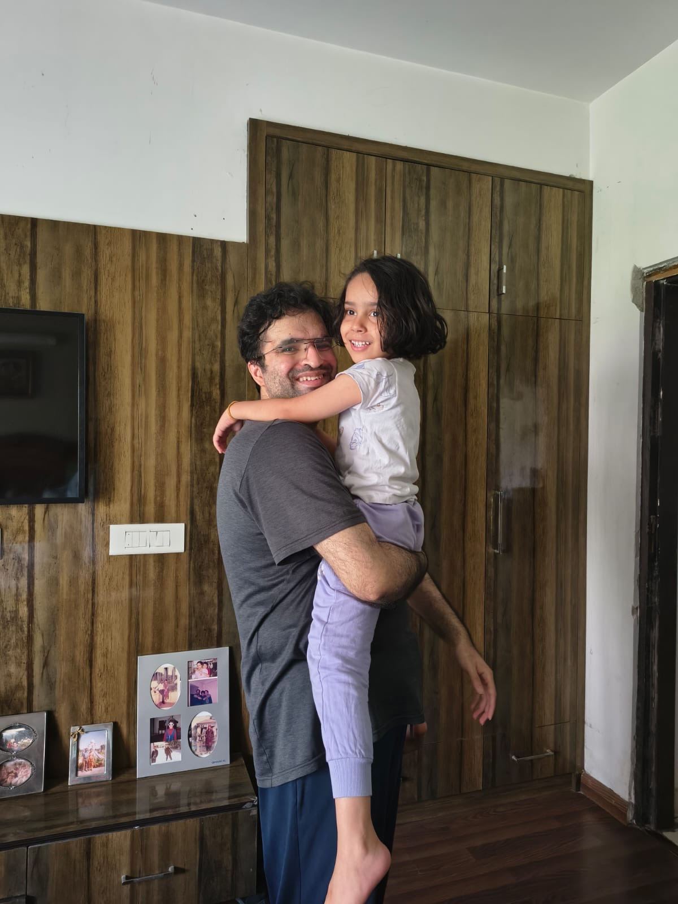

#   
  
#diary   
  
## Llm usage  
Good for boilerplate code, visualization, getting syntax right. Ever  
improving.  
Don’t use it for your psets but you can use it for your final projects. You  
*should* learn how to use these tools effectively.  
Think first, then ask an LLM for help.  
Don’t trust the code without verification.  
  
no b12 no matter wherever you see, take iron tablet when dizzy, for long time nothing else will work food or anything was  , I had not even left the chair only low iron like doctor said tayiji..  
Still dizzy no nothing wrong anywhere, but problem is over exertion  
  
Now got anxiety seeing this note, was working properly before it and realized how stupid I was  
This fracture was a blessing in disguise having corrected finally iron deficiency, was dizzy daily before and thinking daily did nothing for months, because of b12 except physical exertion which worsened my anaemia and was easily influenced by llms, now 2 months later know how far I have come giving interviews, just pain of physio bothering does not let me sleep, can do any amount of physical exertion still, have ptsd of things before fracture  
  
Need iron tablet for a month and sleep and what doctor asks in terms of meds not llms  
Stupidly did 50 squats and 4-5 minutes hiit workout just after 39 minutes if physio coz of watching something about fat on youtube  was dehydrated because of creatine then probem of dizziness started again without **eating since Llm usage**  
**Good for boilerplate code, visualization, getting syntax right. Ever**  
**improving.**  
**Don’t use it for your psets but you can use it for your final projects. You**  
***should* learn how to use these tools effectively.**  
**Think first, then ask an LLM for help.**  
**Don’t trust the code without verification**.  
  
  
  
Do not let doing physio derail you again from work much more important an**==d no b12==**  
  
  
  
**==No google seaeches or watching stupid suggestions on youtube.. strengthening alreasy by carrying Aashvi 17kg all day., will lose mind if see something idiotic and beleive it to ne true when doing daily physio.. ==**  
  
**==Delete the app or ==**  

|  |  |
| - | - |
|  |  |
  
  
