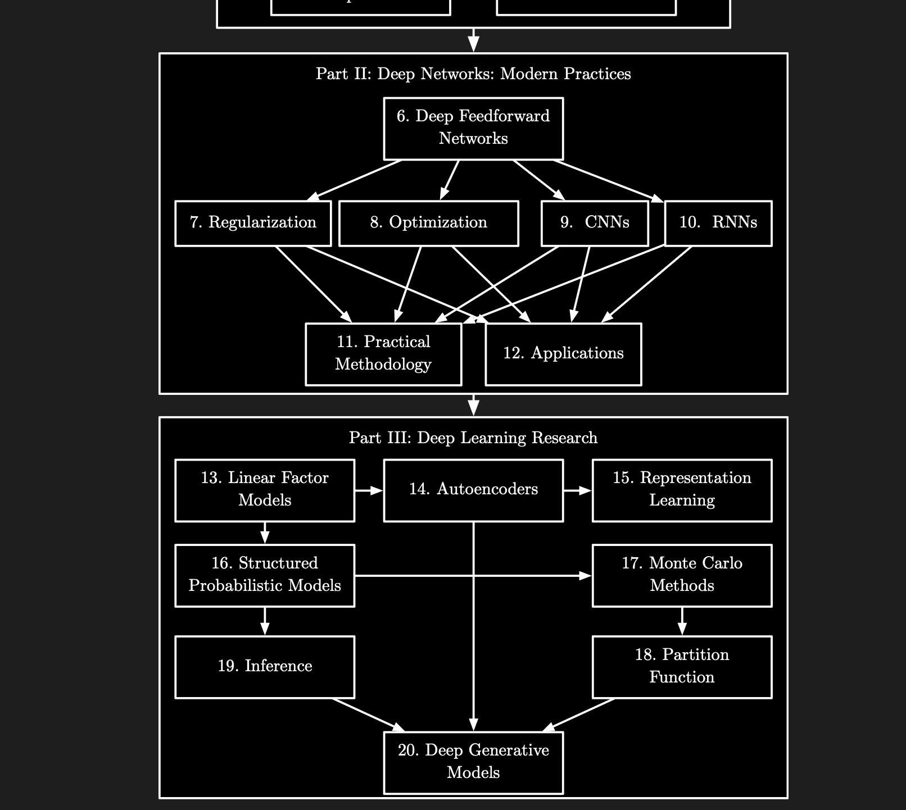

# 6.7960  
  
  
  
**Grading Policy**  
  
#diary** do this course blindly.. **  
  
  
  
  
  
## - Materials  
* ****Readings will come from a variety of sources and will be posted on the schedule each week.****  
* Some readings are derived from the course textbook, which can be found for free online: [Foundations of Computer Vision](https://visionbook.mit.edu/).  
* The best textbook devoted entirely to deep learning is probably [Understanding Deep Learning](https://udlbook.github.io/udlbook/), which is freely available online.  
* Content from 6.390 Intro to ML can also be found [here](https://introml.mit.edu/notes/?fbclid=PAQ0xDSwMxDVNleHRuA2FlbQIxMAABp0r1wjiBU7px9Kf6ziMGCn6NGB3GhTW-QhmDeMG5oCD9T6qAQW5ItdrbpohF_aem_jL3v0-a5F6jpmw5iOtA7Aw) for those who want to brush up on ML concepts.  
   
  

| Date | Topics | Course Materials |  |  |
| --------- | --------------------------------------------------------------------------------------------------------------------------------------------------------------------------------------------------------------------- | --------------------------------------------------------------------------------------------------------------------------------- | - | - |
| Week 1 |  |  |  |  |
| Thu 2/6 | Course overview, introduction to deep neural networks and their basic building blocks | slides |  |  |
|  |  |  |  |  |
|  |  | optional readings: |  |  |
|  |  | notation for this course |  |  |
|  |  | neural networks |  |  |
| Week 2 |  |  |  |  |
| Mon 9/6 | PyTorch Tutorial: 4-5 PM, 32-123 | pytorch tutorial colab |  |  |
| Tue 9/6 | How to train a neural net | slides |  |  |
|  | + details |  |  |  |
|  | SGD, Backprop and autodiff, differentiable programming | required readings: |  |  |
|  |  | gradient-based learning |  |  |
|  |  | backprop |  |  |
| Tue 9/6 | PyTorch Tutorial: 3-4 PM, 2-190 |  |  |  |
| Wed 9/6 | PyTorch Tutorial: 7-8 PM, 32-123 |  |  |  |
| Thu 11/6 | Approximation theory | slides |  |  |
|  | + details |  |  |  |
|  | How well can you approximate a given function by a DNN? We will explore various facets of this issue, from universal approximation to Barron's theorem. And does increasing the depth provably help for expressivity? |  |  |  |
| Fri 12/6 | PyTorch Tutorial: 11 AM -12 PM, 32-123 |  |  |  |
| Week 3 |  |  |  |  |
| Tue /16 | Architectures: Grids | slides |  |  |
|  | + details |  |  |  |
|  | This lecture will focus mostly on convolutional neural networks, presenting them as a good choice when your data lies on a grid. | required reading: |  |  |
|  |  | CNNs |  |  |
| Thu 2/7 | Architectures: Memory and Sequence Modeling | slides |  |  |
|  | + details |  |  |  |
|  | RNNs, LSTMs, memory, sequence models. |  |  |  |
| Week 4 |  |  |  |  |
| Tue 9/7 | Architectures: Transformers | slides |  |  |
|  | + details |  |  |  |
|  | Transformers. Three key ideas: tokens, attention, positional codes. Relationship between transformers and MLPs, GNNs, and CNNs -- they are all variations on the same themes! | reading: |  |  |
|  |  | Transformers (note that this reading focuses on examples from vision but you can apply the same architecture to any kind of data) |  |  |
| Thu 16/7 | Generalization Theory | slides |  |  |
|  |  |  |  |  |
|  |  | optional readings: |  |  |
|  |  | Deep learning requires rethinking generalization |  |  |
|  |  | Deep learning not so mysterious or different |  |  |
|  |  | Data science at the singularity |  |  |
| Week 5 |  |  |  |  |
| Tue 23/7 | Representation Learning: Reconstruction-based | slides |  |  |
|  | + details |  |  |  |
|  | Intro to representation learning, unsupervised and self-supervised learning, clustering, dimension reduction, autoencoders, and modern self-supevised learning with reconstruction losses. |  |  |  |
| Thu 1/8 | Representation Learning: Similarity-based (aka Neural Information Retrieval) | slides |  |  |
|  | + details |  |  |  |
|  | Information retrieval, contrastive learning (InfoNCE; hard negatives; KL distillation; self-supervised vs. supervised), sub-linear search and scaling tradeoffs (cross-encoders; bi-encoders; late interaction). | optional readings: |  |  |
|  |  | Contrastive Representation Learning |  |  |
|  |  | Contextualized Late Interaction over BERT |  |  |
|  |  | In Defense of Dual-Encoders |  |  |
| Week 6 |  |  |  |  |
| Tue 7/8 | Representation Learning and Information Theory | slides |  |  |
| Thu 8/8 | Foundation models: pre-training | slides |  |  |
|  |  |  |  |  |
|  |  | optional readings: |  |  |
|  |  | Language Models are Few-Shot Learners |  |  |
|  |  | SmolLM3; OLMo 2; Marin 8B |  |  |
| Week 7 |  |  |  |  |
| Tue 10/8 | Foundation models: scaling laws | slides |  |  |
|  | LLms also covered.. |  |  |  |
|  |  | optional readings: |  |  |
|  |  | Scaling Laws for LLMs |  |  |
|  |  | Training Compute-Optimal LLMs |  |  |
|  |  | Emergent Abilities of LLMs |  |  |
|  |  | Are Emergent Abilities of LLMs a Mirage? |  |  |
| Thu 10/16 | Generative models: basics | slides |  |  |
| Week 8 |  |  |  |  |
| Tue 10/21 | Midterm: 7:30 - 9:30 PM |  |  |  |
| Thu 10/23 | Generative models: VAE and GAN | slides |  |  |
| Week 9 |  |  |  |  |
| Tue 10/28 | Foundation models: post-training | slides |  |  |
| Thu 10/30 | Generative models: Diffusion and Flows | slides |  |  |
| Week 10 |  |  |  |  |
| Tue 11/4 | Generalization (OOD) | slides |  |  |
|  | + details |  |  |  |
|  | Exploring model generalization out of distribution, with a focus on adversarial robustness and distribution shift |  |  |  |
| Thu 11/6 | Transfer learning: Models and Data | slides |  |  |
|  | + details |  |  |  |
|  | Finetuning, linear probes, knowledge distillation, generative models as data, domain adaptation, prompting |  |  |  |
| Week 11 |  |  |  |  |
| Tue 11/11 | No class: Veterans Day |  |  |  |
| Thu 11/13 | Inference-time Algorithms | slides |  |  |
| Week 12 |  |  |  |  |
| Tue 11/18 | Guest Lecture: Deep Learning that Improves Real-World Interactions |  |  |  |
| Thu 11/20 | Evaluation | slides |  |  |
|  | + details |  |  |  |
|  | Designing benchmarks, selecting metrics, and using human input at inference |  |  |  |
| Week 13 |  |  |  |  |
| Tue 11/25 | Applying Deep Learning to Your Problems | slides |  |  |
| Thu 11/27 | No class: Thanksgiving Day |  |  |  |
| Week 14 |  |  |  |  |
| Tue 12/2 | Guest Lecture 2 |  |  |  |
| Thu 12/4 | Project office hours |  |  |  |
| Week 15 |  |  |  |  |
| Tue 12/9 | Guest Lecture 3 |  |  |  |
|  |  |  |  |  |
  
  
