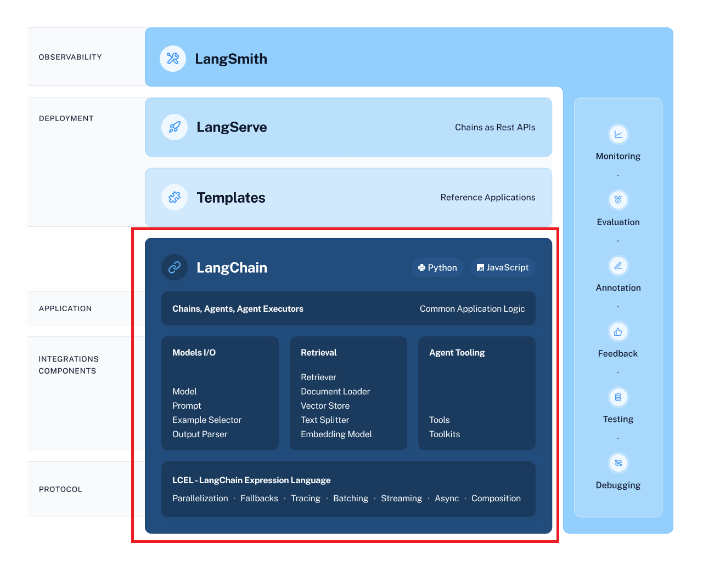
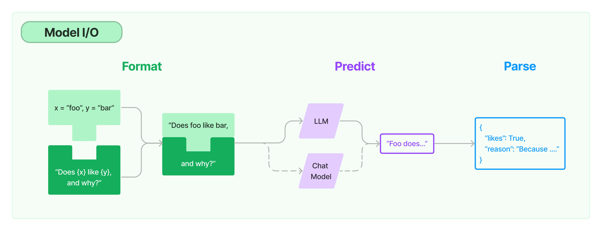
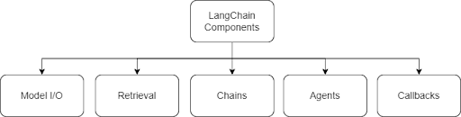
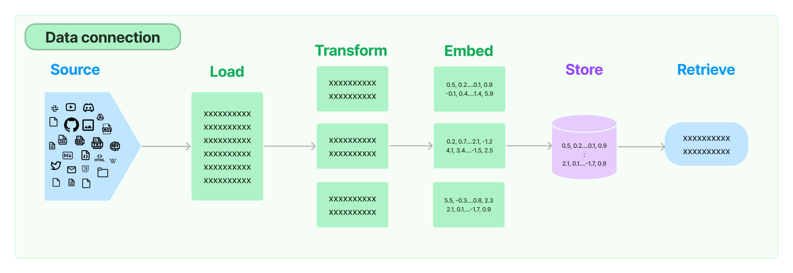
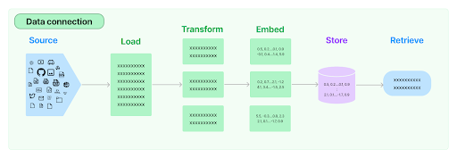

  
  
# Langchain Proper  
  
  
## Introduction To The Langchain

  
LangChain is an open-source framework that enables developers to build applications powered by large language models (LLMs). LangChain provides a framework that makes it easier to build LLM-based applications such as:  
* Chatbots and personal assistants  
* Text summarization and analysis  
* Q&A over documents or structured data  
* Code generation and understanding  
* Interaction with APIs  
  
LangChain works by providing a layer of abstraction between the developer and the LLM. This abstraction layer makes it easier to use the LLM in a variety of ways providing several features that make it easier to build robust and reliable LLM-based applications that can also be LLM agnostic.  
  
One of the key features of LangChain is its support for chaining prompts. This means that developers can combine multiple prompts together to create more complex and nuanced requests. Another key feature of LangChain is its support for modular components. This means that developers can reuse components from different chains to create new chains. This can save developers a lot of time and effort, and it also makes it easier to share and collaborate on chains.  
  
### LangChain Framework:  
  
LangChain is a framework that simplifies the development of LLM applications. LangChain offers a suite of tools, components and interfaces that simplify the construction of LLM-centric applications. LangChain provides an LLM class designed for interfacing with various language model providers, such as OpenAI, Cohere and Hugging Face, that makes it easier to build LLM-agnostic applications by simply switching the language models, allowing developers to focus on the application logic without delving into the complexities of dealing with vendor-specific language models. The versatility and flexibility of LangChain enable seamless integration with various data sources, making it a comprehensive solution for creating advanced language model-powered applications.  
  
The open-source framework of LangChain is available to build applications in Python or JavaScript/TypeScript. Its core design principle is composition and modularity. By combining modules and components, one can quickly build complex LLM-based applications. LangChain is an open-source framework that makes it easier to build powerful applications with LLMs relevant to the interests and needs of the user. It connects to external systems to access information required to solve complex problems. It provides abstractions for most of the functionalities needed for building an LLM application and also has integrations that can readily read and write data, reducing the development time of the application. LangChains’s framework allows for building applications that are agnostic to the underlying language model. With its ever-expanding support for various LLMs, LangChain offers a unique value proposition to build applications and iterate continuously.  
  
The LangChain framework comprises the following:  
* **Components**: LangChain provides modular abstractions for the components necessary to work with language models. LangChain also has collections of implementations for all these abstractions. The components are designed to be easy to use, regardless of whether you are using the rest of the LangChain framework or not. The illustration below depicts the various components of Langchain.  
  
  
  
* Use-Case Specific Chains: Chains can be thought of as assembling these components in particular ways in order to best accomplish a particular use case. These are intended to be a higher-level interface through which people can easily get started with a specific use case. These chains are also designed to be customizable.  
  
The LangChain framework revolves around the following building blocks:  
* Model I/O: Interface with language models (LLMs and Chat Models, Prompts and Output Parsers)  
* Retrieval: Interface with application-specific data (Document loaders, Document transformers, Text embedding models, Vector stores and Retrievers)  
* Chains: Construct sequences/chains of LLM calls  
* Memory: Persist application state among runs of a chain  
* Agents: Let chains choose which tools to use, given high-level directives  
* Callbacks: Log and stream intermediate steps of any chain  
  
The image below from the ++[official documentation](https://python.langchain.com/docs/get_started/introduction)++ provides more information about the Langchain ecosystem. It should be noted that the focus of the session will be only on building applications with Langchain   
  
  
### Benefits of Using LangChain
  
There are several benefits of using LangChain to build applications powered by LLMs. These benefits include:  
* **Ease of use**: LangChain makes it easier to use LLMs to build a variety of applications, even if the developer does not have any experience with artificial intelligence (AI) or machine learning  
* **Flexibility**: LangChain is a flexible framework that can be used to build a wide variety of applications. Developers are not limited to any specific use case  
* **Scalability**: LangChain is scalable to support applications of all sizes. Developers can use LangChain to build applications that serve millions of users  
* **Robustness**: LangChain provides several features that make it easier to build robust and reliable applications. For example, LangChain supports caching and error handling  
  
  
  

  
## Model I/O
  
LangChain provides an easy out-of-the-box framework to work with LLMs. As shown in the image below, the Model I/O comprises of the following elements:  
* Format the prompt with the help of PromptTemplates  
* Predict the response of the LLM  
* Parse the output response of the LLM

  
*   
* LangChain provides two methods to work with large language models (LLMs):  
    * LLMs: Models that take a text string as input and return a text string   
    * Chat models: Models that are backed by a language model but take a list of chat messages as input and return a chat message output  
* 

LLMs and chat models are subtly similar but differ in their output responses.
**LLMs **in langchain framework refer to pure text completion models - where a string prompt is taken as the input and the language model outputs a string. The completions model of OpenAI API is an example of LLMs supported in Langchain.
**Chat models **are LLMs that have been tuned specifically for having turn-based conversations, such as ChatGPT. Instead of a single string, they take a list of chat messages as input. Usually, these models have labelled messages, such as ‘System’ and ‘Human’ and provide an AI chat message (‘AI’/ ‘Output Response’) as the output. The ChatCompletions model of OpenAI API is an example of a chat model in Langchain.


LangChain provides a standard interface for interacting with many different LLMs to perform standard text completion tasks. The LLM class of LangChain is designed to provide a standard interface for all the major LLM providers, such as OpenAI, Cohere, Hugging Face, etc. It should be noted that the corresponding library must first be installed before being used with langchain. For example, the OpenAI library must first be installed using the  <pip install openai> command before you can use the ChatOpenAI class in LangChain.


**NOTE**: If not specified, the default OpenAI completions model used is the text-davinci-003 model whereas the default chat model is gpt-3.5-turbo. It should be noted that the  
* **Introduction To The Langchain
**
  
* LangChain is an open-source framework that enables developers to build applications powered by large language models (LLMs). LangChain provides a framework that makes it easier to build LLM-based applications such as:  
* Chatbots and personal assistants  
* Text summarization and analysis  
* Q&A over documents or structured data  
* Code generation and understanding  
* Interaction with APIs  
*   
* LangChain works by providing a layer of abstraction between the developer and the LLM. This abstraction layer makes it easier to use the LLM in a variety of ways providing several features that make it easier to build robust and reliable LLM-based applications that can also be LLM agnostic.  
*   
* One of the key features of LangChain is its support for chaining prompts. This means that developers can combine multiple prompts together to create more complex and nuanced requests. Another key feature of LangChain is its support for modular components. This means that developers can reuse components from different chains to create new chains. This can save developers a lot of time and effort, and it also makes it easier to share and collaborate on chains.  
*   
* **LangChain Framework:**  
*   
* LangChain is a framework that simplifies the development of LLM applications. LangChain offers a suite of tools, components and interfaces that simplify the construction of LLM-centric applications. LangChain provides an LLM class designed for interfacing with various language model providers, such as OpenAI, Cohere and Hugging Face, that makes it easier to build LLM-agnostic applications by simply switching the language models, allowing developers to focus on the application logic without delving into the complexities of dealing with vendor-specific language models. The versatility and flexibility of LangChain enable seamless integration with various data sources, making it a comprehensive solution for creating advanced language model-powered applications.  
*   
* The open-source framework of LangChain is available to build applications in Python or JavaScript/TypeScript. Its core design principle is composition and modularity. By combining modules and components, one can quickly build complex LLM-based applications. LangChain is an open-source framework that makes it easier to build powerful applications with LLMs relevant to the interests and needs of the user. It connects to external systems to access information required to solve complex problems. It provides abstractions for most of the functionalities needed for building an LLM application and also has integrations that can readily read and write data, reducing the development time of the application. LangChains’s framework allows for building applications that are agnostic to the underlying language model. With its ever-expanding support for various LLMs, LangChain offers a unique value proposition to build applications and iterate continuously.  
*   
* The LangChain framework comprises the following:  
* **Components**: LangChain provides modular abstractions for the components necessary to work with language models. LangChain also has collections of implementations for all these abstractions. The components are designed to be easy to use, regardless of whether you are using the rest of the LangChain framework or not. The illustration below depicts the various components of Langchain.  
*   
*   
*   
* Use-Case Specific Chains: Chains can be thought of as assembling these components in particular ways in order to best accomplish a particular use case. These are intended to be a higher-level interface through which people can easily get started with a specific use case. These chains are also designed to be customizable.  
*   
* The LangChain framework revolves around the following building blocks:  
* Model I/O: Interface with language models (LLMs and Chat Models, Prompts and Output Parsers)  
* Retrieval: Interface with application-specific data (Document loaders, Document transformers, Text embedding models, Vector stores and Retrievers)  
* Chains: Construct sequences/chains of LLM calls  
* Memory: Persist application state among runs of a chain  
* Agents: Let chains choose which tools to use, given high-level directives  
* Callbacks: Log and stream intermediate steps of any chain  
*   
* The image below from the ++[official documentation](https://python.langchain.com/docs/get_started/introduction)++ provides more information about the Langchain ecosystem. It should be noted that the focus of the session will be only on building applications with Langchain   
*   
* **Benefits of Using LangChain**
There are several benefits of using LangChain to build applications powered by LLMs. These benefits include:  
* **Ease of use**: LangChain makes it easier to use LLMs to build a variety of applications, even if the developer does not have any experience with artificial intelligence (AI) or machine learning  
* **Flexibility**: LangChain is a flexible framework that can be used to build a wide variety of applications. Developers are not limited to any specific use case  
* **Scalability**: LangChain is scalable to support applications of all sizes. Developers can use LangChain to build applications that serve millions of users  
* **Robustness**: LangChain provides several features that make it easier to build robust and reliable applications. For example, LangChain supports caching and error handling  
*   
*   
*   
*   
*   
*   
*   
*   
*   
*   
*   
* odel along with other OpenAI completions models has been classified as legacy and is set to retire from active use. The complete list can be referred ++[here](https://platform.openai.com/docs/models/overview)++.


The ‘chat models’ class in Langchain requires the input prompts to be passed in the form of messages. Chat messages in LangChain are a way to interact with the LLM using a chat-like interface. They function similar to a simple text input to the LLM but with a small difference - the chat model must be supplied with message types for the various roles: System, Human and AI.  
    * SystemMessage - System messages provide helpful background context that tells the chat model/AI what to do  
    * HumanMessage - A ChatMessage that represents Human messages/intended to represent the user  
    * AIMessage - AI messages show the chat model’s (/AI) response  
* 

A few of the supported chat models in langchain currently are:  
    * ChatOpenAI,  
    * ChatVertexAI,  
    * AzureChatOpenAI,  
    * BedrockChat,  
    * ChatAnthropic,  
    * ChatCohere,  
    * ChatDatabricks,  
    * ChatGooglePalm etc.  
* 

An important benefit of using Langchain is the ease with which language models can be swapped in and out. The abstractions provided by Langchain make it easy for developers to compare the performance of both closed and open-source language models for a particular task. For more information on working with open-source language models on HuggingFace, refer to the following link.


**Additional Readings:
**In this article, you will come across how different language models can be accessed using this ++[link](https://medium.com/codecontent/using-huggingface-openai-and-cohere-models-with-langchain-0fbf48067764)++

  
  
  
  
  
  

  
## Prompt Template

  
Prompt templates are a crucial component of LangChain’s framework that makes constructing prompts with dynamic inputs easier. In a traditional API, you would write the prompt query and write a function to perform an API call. In LangChain, an API call to the language model is performed by passing the prompt as a prompt template to a text completion or a chat model.   
  
PromptTemplates are predefined structures for different types of prompts. They serve as a starting point for creating prompts and provide a consistent structure that helps guide the responses of the language model with the added benefit of in-built validation by LangChain.   
  
Prompt Templates can be optimised for diverse applications, such as classification, generation, question-answer, summarization and translation prompts.  The functionality of PromptTemplate can be compared to that of f-strings in Python. A prompt template comprises a string template and accepts a set of parameters from the user that can be used to generate a prompt for a language model and provide ease of use while working with dynamic input prompts. By using PromptTemplates, you can formalise the process of building prompts with an object-oriented approach, add multiple parameters to prompts, build prompts with dynamic inputs, reuse great prompts hundreds of times, streamline the prompt engineering process and provide a consistent structure that helps guide the responses of the language model. This also lets developers create language model agnostic templates to make it easy to reuse existing templates across different language models.  
  
The sequence of steps in defining a PromptTemplate is as follows:  
* **Define the structure of the prompt template**: The first step in creating a Prompt Template is to define the structure of the prompt template. This includes defining the different parts of the prompt, such as instructions, context, user input and output indicator.  
* **Define the parameters of the prompt template**: Once you have defined the structure of the prompt template, you need to define the parameters of the prompt template. These are the variables that will be used to create dynamic prompts.  
* **Use the Prompt Template to generate prompts with dynamic inputs**: Finally, you can use the Prompt Template to generate prompts with dynamic inputs. You can pass in different values for the parameters to create different prompts.  
  
The ‘langchain.prompts’ class in LangChain allows two methods for easily defining prompt templates:  
* **PromptTemplate**: Create a prompt template for a string prompt. This template only works with the completions model defined by the langchain.llms  
* **ChatPromptTemplate**: Create a prompt template out of a list of chat messages. Each chat message is associated with content and a role. For example, in the OpenAI Chat Completions API, these correspond to system, human or AI roles. It should be noted that this prompt template works when used with chat completions API defined by long chain.chat_models  
  
An added advantage of using prompt templates is that the same prompt can be used multiple times with different sets of input variables or vice-versa.  
  
  
  
  
  
  
  
  
  
  
  
##   
## Output Parsing

  
LangChain provides a helpful way to format the output response of a model. These parsers are especially useful when a structured output is required. The official documentation of LangChain contains the list of supported output parsers documentation.  
  
Output Parsers are classes that help structure language model responses. Typically, LLMs output text as responses; however, if you want to get a more structured response than just the response text, Output Parsers are effective.  
  
Output Parsers provide an easy method to restrict the output response of the large language model. The following are a few of the output parsers available in Langchain:  
* BooleanOutputParser,  
* CommaSeparatedListOutputParser,  
* DatetimeOutputParser,  
* ListOutputParser,  
* MarkdownListOutputParser,  
* NumberedListOutputParser,  
* PandasDataFrameOutputParser,  
* RegexDictParser,  
* RegexParser etc.  
  
Output parsers provide a template to define the output of the language model and effectively consist of a system message that parses the input to the class by performing an API call to the language model. For example, the CommaSeparatedListOutputParser method consists of the following instructions for the LLM:  
```
Your response should be a list of comma separated values, eg:  `foo, bar, baz`

```
```


```
  
  
## Document Loaders
  
  

So far, you’ve looked at various components offered by Model I/O in langchain. These components provide an easy method of creating Generative AI applications but these models are limited by their training cut-off due to which it can provide insufficient or limited answers to queries regarding current knowledge. This can be rectified using techniques such as Retrieval Augmented Generation (RAG). Langchain provides components for performing RAG through various Retrieval methods as illustrated in the image below.
  
  
  
Document loaders in LangChain are responsible for loading documents from different sources and handling various types of documents, including PDFs.  
They convert these documents into a format that can be processed by the LangChain system, involving steps such as data ingestion, context understanding, and fine-tuning.  
There are different types of document loaders, such as Transform Loaders, Public Datasets/Services Loaders, and Proprietary Datasets/Services Loaders, which can handle data from specific formats and transform them into the Document format.  
These document loaders are essential for structuring documents for language model applications and maximising the potential of the LangChain platform  
  
## Session Summary  
  
In this course, we focused on getting acquainted with Langchain and some its basic components such as Model I/O (Models such as llms and chat models, PromptTemplates, Output Parsers). At the end of the course, you should be able to understand:  
1. What is Langchain and why is it gaining popularity?  
2. The vaious components of Langchain  
3. Langchain Model I/O Components:  
    * Model  
    * Prompt Templates  
    * Output Parsers  
4. Document Loaders in Langchain  
  
# Langchain -2  
  
This session on LangChain will focus on advanced concepts in LangChain such as:  
* Document Connectors  
    * Document Transformers  
    * Text Embedding Models  
    * Vector Stores  
    * Retriever  
* Chains  
    * Sequential Chain  
    * Retrieval QA Chain  
    * Router Chain  
* Agents  
* Memory  
* Callbacks  
* LangChain Expression Language (LCEL)    
  
  
  
## Session Overview

  
This session, ‘**LangChain - Advanced**’, is built on the foundations of the first session.  
  
In the previous session, you were introduced to the essential components of LangChain. These modular components provide helpful abstractions to make building LLM-based applications easier. You were first introduced to the following Model I/O components:  
* Models - LLMs and chat models  
* PromptTemplates  
* Output parsers  
  
In this session, you will cover advanced topics and functions in LangChain, such as chains, agents and LCEL (LangChain Expression Language).  
  
The platform text of this session is designed to supplement the live session that you may have attended on the upGrad Live platform.   
  
  
## Working With Documents In LangChain

  
In this session, the SME introduced you to other useful abstractions of LangChain. Additionally, there are specialised components in LangChain, such as chains, memory, agents and callbacks, that are increasingly being used by developers to build LLM applications.  
  
Many LLM applications require user-specific data that is not part of the model's training set. A workaround for this can be accomplished through retrieval-augmented generation (RAG). In this process, external data is retrieved and then passed to the LLM during the generation step.  
  
LangChain provides all the building blocks for RAG applications by providing various useful abstractions. You’re already familiar with this portion regarding the retrieval step, e.g., fetching the data using Document Loaders. Additionally, the following components provided by LangChain help process documents as shown in the illustration below:  
* Document Loaders  
* Text Splitters  
* Text Embedding  
* Vector Stores  
* Retrievers

  
*   
* You were briefly introduced to the Document Loaders component in LangChain for working with various types of documents. Document Loaders provide an easy method for importing data from different sources or formats as a document, which contains the text content and the associated metadata. Document Loaders load documents from different sources like HTML, PDF, text, etc., from various locations such as cloud storage buckets and public websites. LangChain provides over 100 different Document Loaders as well as integrations with other major providers in the space, like AirByte and Unstructured. It should be noted that some Document Loaders require the associated libraries to be installed.


**Document Transformers
**Once the content in the document is parsed, it can be passed to the LLM for further transformations. However, LLMs have a context window limit beyond which they cannot process documents effectively. To work around the ‘context window limit’, there are document chunking strategies that divide the text into individual ‘chunks’ and send them to the LLM for processing. LangChain provides several text splitter methods. 


**Text Embedding Models
**The Embeddings class is a class designed for interfacing with text embedding models. LangChain provides support for most of the embedding model providers (OpenAI, Cohere), including the sentence transformers library from Hugging Face. Embeddings create a vector representation of a piece of text and support all operations, such as similarity search, text comparison and sentiment analysis. 


**Vector Stores
**One of the most common ways to store and search over unstructured data is to embed it and store the resulting embedding vectors. Then, at query time, you can embed the unstructured query and retrieve the embedding vectors that are 'most similar' to the embedded query. A vector store takes care of storing embedded data and performing vector search for you. LangChain provides classes to work with popular vector stores such as Chroma, FAISS and LanceDB.


**Retrievers
**Retrievers provide an easy interface to fetch contextually relevant documents from a vector store based a user's query. A retriever cannot store documents, only return (or retrieve) them from the vector store where they are stored along with their embeddings. A retriever will create a vector embedding for a user's query and then compare it with document embeddings available in the vector store, by using distance metrics such as cosine similarity. It provides an interface that will return documents based on an unstructured query. Vector stores can be used as the backbone of a retriever, but there are other types of retrievers as well. There are many different types of retrievers; the most widely supported retriever is the VectoreStoreRetriever. The official ++[documentation](https://python.langchain.com/docs/integrations/retrievers/)++ and ++[API reference](https://api.python.langchain.com/en/latest/community/retrievers.html#module-langchain_community.retrievers)++ contain a list of retriever integrations supported by LangChain.

  
  
  
  
## Chains

  
Chains are logical organisations of different LangChain components, one after the other. Chains can be formed using various types of components, such as prompts, models, arbitrary functions or even other chains. Chains allow you to combine language models with other data sources and third-party APIs. They form the foundational functionality for creating chains tailored to specific use cases. Utility chains are specialised chains composed of many LLMs to help solve a specific task. LangChain chains can b**e used for various use cases such as QA and chat over documents, tabular question answering, interacting with APIs, summarisation, agent simulations and autonomous agents.**  
  
**Chains can be simple (i.e., generic) or specialised (i.e., utility):**  
  
* **Generic: A single LLM is the simplest chain. It takes an input prompt and the name of the LLM and then uses the LLM for text generation (i.e., output for the prompt). Some examples include LLMChain, TransformChain, and SequentialChain.**  
* **Utility: These are specialised chains composed of many LLMs to help solve a specific task. For example, LangChain supports some end-to-end chains (such as AnalyzeDocumentChain for summarisation and QnAs) and some specific ones (such as GraphQnAChain for creating, querying and saving graphs). We will take a look at one specific chain called PalChain in this tutorial.**  
  
What if langchain changes this in future? Who is going to ask this..
  
  
## Agents

  
LangChain agents harness the capabilities of large language models (LLMs) to process natural language input and generate corresponding output. These LLMs have undergone extensive training on vast data sets comprising text and code, equipping them to excel at various tasks, including comprehending queries, text generation and language translation.  
  
**Architecture**  
The fundamental architecture of a LangChain agent is structured as follows:  
* **Input reception**: The agent receives natural language input from the user.  
* **Processing with LLM**: The agent employs the LLM to process the input and formulate an action plan.  
* **Plan execution**: The agent executes the devised action plan, which might involve interacting with other tools or services.  
* **Output delivery**: Subsequently, the agent delivers the output of the executed plan back to the user.  

The key components of LangChain agents include the agent itself, external tools and toolkits:  
* **Agent**: This is the core of the architecture and is responsible for processing input, generating action plans and executing them.  
* **Tools**: These external resources are utilised by the agent to accomplish tasks. They encompass a diverse range, from other LLMs to web APIs.  
* **Toolkits**: Toolkits consist of groups of tools purposefully assembled for specific functions. Examples include toolkits for question answering, text generation and natural language processing.  
By gaining an understanding of LangChain and its agent-based architecture, users can harness its potential for creating intelligent applications that proficiently process and generate natural language text.  
  
  
What is the purpose of LangChain's initialize_agent?,now create_agent  
  
  
  
Agents combine language models with [tools](https://docs.langchain.com/oss/python/langchain/tools) to create systems that can reason about tasks, decide which tools to use, and iteratively work towards solutions.  
[create_agent](https://reference.langchain.com/python/langchain/agents/factory/create_agent) provides a production-ready agent implementation.  
[An LLM Agent runs tools in a loop to achieve a goal](https://simonwillison.net/2025/Sep/18/agents/). An agent runs until a stop condition is met - i.e., when the model emits a final output or an iteration limit is reached.  
  
### Tools  
  
Tools give agents the ability to take actions. Agents go beyond simple model-only tool binding by facilitating:  
* Multiple tool calls in sequence (triggered by a single prompt)  
* Parallel tool calls when appropriate  
* Dynamic tool selection based on previous results  
* Tool retry logic and error handling  
* State persistence across tool calls  
For more information, see [Tools](https://docs.langchain.com/oss/python/langchain/tools).  
  
## Summary

  
In this session, you learned some of the advanced topics in LangChain such as:  
* Document Connectors  
    * Document Transformers  
    * Text Embedding Models  
    * Vector Stores  
    * Retriever  
* Chains  
    * Sequential Chain  
    * Retrieval QA Chain  
    * Router Chain  
* Agents  
  
  
  
  
  
  
  
  
  
  
  
  
  
  
  
  
  
  
  
  
  
  
  
  
#   
#   
# Analytics-Vidya, Revision  
  
# What is LangChain?  
  
  
Large language models (LLMs) have revolutionized natural language processing (NLP), enabling various applications, from conversational assistants to content generation and analysis. However, working with LLMs can be challenging, requiring developers to navigate complex prompting, data integration, and memory management tasks. This is where LangChain comes into play, a powerful open-source Python framework designed to simplify the development of **++[LLM-powered applications.](https://www.analyticsvidhya.com/blog/2023/07/building-llm-powered-applications-with-langchain/)++**  
  
LangChain addresses the difficulties of building sophisticated LLM applications by providing modular, easy-to-use components for connecting language models with external data sources and services. It abstracts away the complexities of LLM integration, enabling developers to focus on building impactful applications that leverage the full potential of these advanced language models. **todo-> Build one yourself**  
  
As the importance of **++[LLMs](https://www.analyticsvidhya.com/blog/2023/03/an-introduction-to-large-language-models-llms/)++** continues to grow in various domains, LangChain plays a crucial role in democratizing their use and empowering developers to create innovative solutions that can transform industries.  
  
Here is the comprehensive LangChain Guide for you!  
  
## Overview  
* LangChain simplifies building LLM-powered apps with its modular, open-source Python framework.  
* It integrates LLMs and external services, enabling complex workflows and easy development.  
* Quick setup – install via pip, connect to LLMs like OpenAI, and start coding.  
* Process documents by reading, splitting text into chunks, and creating embeddings.  
* Store embeddings in vector stores like Chroma for efficient similarity search.  
  
## Table of contents  
1. Getting Started with LangChain  
    * Hello World example with LangChain  
    * Ingesting Data from Various Sources  
    * Text Splitting and Chunking Techniques:  
2. Vector Store and Retrieval Mechanisms  
3. Building Chains  
4. Agents: Elevating LLM Capabilities  
    * Agent  
    * Define Tools  
5. Bind Tools to LLM  
    * Create the Agent  
    * Adding Memory  
6. Memory Management in LangChain  
    * Importance of Memory in MultiStep Workflows  
    * Types of Memory  
7. ConversationBufferMemory Example and Implementation  
8. Real-world Applications and Case Studies  
9. Future of LangChain and LLMs  
10. Potential Impact of LLMs on Various Industries  
11. Ethical Considerations and Responsible AI Practices  
12. Conclusion  
13. Frequently Asked Questions  
  
  
## What is LangChain?  
  
LangChain is an open-source orchestration framework for building applications using large language models (LLMs). Available in both Python and JavaScript-based libraries, LangChain provides a centralized development environment and set of tools to simplify the process of creating LLM-driven applications like chatbots and virtual agents.  
  
Serving as a generic interface for integrating with various LLMs, LangChain’s modular design allows developers and data scientists to dynamically compare different prompts and even different foundation models with minimal need to rewrite code. This flexibility also enables building programs that utilize multiple LLMs together, such as one model for interpreting user queries and another for generating responses.   
  
The way I see it, LangChain is filling an important gap – providing a common framework to build upon, so that innovators and creators don’t have to reinvent the wheel every time they want to leverage the power of LLM.   
  
## How Does LangChain Work?  
  
The core idea behind LangChain is to provide a modular, flexible framework for building applications that utilize large language models (LLMs). At the heart of LangChain are a few key concepts:  
  
### LLMs  
  
At the core of LangChain is the ability to seamlessly integrate with a variety of large language models (LLMs) from different providers, such as OpenAI, Anthropic, and Google. LangChain provides a standardized interface to interact with these powerful AI models, abstracting away the complexities of working with each vendor’s unique APIs and input/output formats.  
  
### Chains  
  
LangChain’s Chains are the basic building blocks for creating complex workflows and processing pipelines. A Chain is a sequence of operations that can be performed on the outputs of an LLM. For example, you might have a Chain that first uses an LLM to extract key information from user input, then passes that to another LLM to generate a relevant response. Chaining multiple LLM-powered steps together enables developers to tackle increasingly sophisticated natural language tasks.  
  
**Also Read: ++[A Comprehensive Guide to Using Chains in Langchain](https://www.analyticsvidhya.com/blog/2023/10/a-comprehensive-guide-to-using-chains-in-langchain/)++**  
  
### Agents  
  
Building on the Chains concept, LangChain introduces higher-level abstractions called Agents. Agents are self-contained units that can leverage Chains and other LangChain components to autonomously solve complex, goal-driven tasks. Agents encapsulate the logic for interacting with LLMs, managing state and memory, and coordinating multi-step workflows. This allows developers to create intelligent, LLM-powered “actors” that can engage in more natural, contextual conversations and complete intricate assignments.  
  
Memory  
  
A crucial capability provided by LangChain is its memory management system. This allows LLMs to store and retrieve relevant information during the course of a multi-step workflow, enabling context preservation and statefulness across executions. The memory component is essential for building conversational applications and other LLM-powered experiences that require an understanding of previous interactions and intermediate results.  
  
By combining these core elements – LLM integrations, Chains, Agents, and Memory – LangChain gives developers a comprehensive toolkit for building sophisticated applications driven by large language models. The framework’s modular, flexible design empowers creators to experiment, iterate, and scale their LLM-powered solutions more efficiently. Rather than getting bogged down in the underlying technical complexities, they can focus on the specific use case and workflow, seamlessly swapping out components as needed to find the optimal configuration.  
  
## Getting Started with LangChain  
To install LangChain, you can use pip, the package installer for Python. Run the following command:  
```
!pip install langchain


```
  
  
Setting up an LLM provider (e.g., OpenAI, **Anthropic**, Cohere):  
  
LangChain supports integration with various large language model providers. In this example, we’ll set up the OpenAI provider. First, install the necessary dependency:  
```
!pip install qU langchain-openai


```
  
  
Next, import the required modules and set your OpenAI API key as an environment variable:  
```
import getpass
import os

os.environ["OPENAI_API_KEY"] = getpass.getpass()
from langchain_openai import ChatOpenAI
model = ChatOpenAI(model="gpt-3.5-turbo")


```
  
  
Hello World example with LangChain  
  
With the LLM provider set up, we can now interact with the language model. Here’s a basic example of using the model for translation:  
```
from langchain_core.messages import HumanMessage, SystemMessage

messages = [
    SystemMessage(content="Translate the following from English into Italian"),
    HumanMessage(content="hi!"),
]
model.invoke(messages)


```
  
  
  
This will return an ==AIMessage== object containing the model’s response and metadata about the response.  
  
To extract just the string response, we can use an output parser:  
```
from langchain_core.output_parsers import StrOutputParser

parser = StrOutputParser()
result = model.invoke(messages)
parser.invoke(result)


```
  
  
  
In this example, we first create a list of messages representing the conversation context and the input to translate. Using the ‘ invoke ‘ method, we then invoke the language model with these messages. The model returns an ==AIMessage== object containing the translation in Italian (==’Ciao!’==) along with additional metadata.  
  
Using LangChain’s modular components, you can easily set up and interact with various large language models, enabling you to build sophisticated NLP applications with relative ease.  
  
## Ingesting Data from Various Sources  
  
To read and split a PDF document, you can use the ==PyPDFLoader== class from ==langchain_community.document_loaders==:  
  
**Installing dependencies:**  
```
!pip install pypdf
from langchain_community.document_loaders import PyPDFLoader

loader = PyPDFLoader("2310.06625v4.pdf")
pages = loader.load_and_split()

print(pages[1].page_content)


```
  
  
  
### Text Splitting and Chunking Techniques:  
  
Effective text splitting and chunking are essential for handling large documents. The ==CharacterTextSplitter== class can split documents into smaller chunks, which are easier to process and manage.  
  
Split by character  
  
This is the simplest method. This splits based on characters (by default “\n\n”) and measures  
  
chunk length by number of characters.  
```
from langchain.text_splitter import CharacterTextSplitter
# Assuming you have a list of pages loaded
page = pages[0] # Get the first page
# Get the text content of the first page
page_content = page.page_content
# Create a CharacterTextSplitter instance
text_splitter = CharacterTextSplitter(
chunk_size=100, # Adjust the chunk size as needed
chunk_overlap=20, # Adjust the chunk overlap as needed
separator="\n" # Use newline character as the separator
)
# Split the page content into chunks
chunks = text_splitter.split_text(page_content)
chunks


```
  
  
  
  
  
## Vector Store and Retrieval Mechanisms  
  
Vector stores are critical for storing and retrieving document embeddings. This walkthrough showcases basic functionality related to vector stores. A key part of working with vector stores is creating the vector to put in them, usually created via embeddings. Therefore, it is recommended that you familiarize yourself with the text-embedding model interfaces before diving into this. There are many great vector store options; a few are free, open-source, and run entirely on your local machine. Review all integrations for many great hosted offerings.  
  
Here’s an example using the Chroma vector store:  
```
## this code is if you have latest version of the langchain installed 
__import__('pysqlite3')
import sys
sys.modules['sqlite3'] = sys.modules.pop('pysqlite3')
from langchain.document_loaders import TextLoader
from langchain.embeddings import OpenAIEmbeddings
from langchain.text_splitter import CharacterTextSplitter
from langchain.vectorstores import Chroma
# Load your documents (assuming 'pages' is already loaded)
text_splitter = CharacterTextSplitter(chunk_size=1000,
chunk_overlap=0)
documents = text_splitter.split_documents(pages)
# Create the embeddings
embeddings = OpenAIEmbeddings()
# Create the Chroma vector store
db = Chroma.from_documents(documents, embeddings)

query = "What is i transformer"
docs = db.similarity_search(query)
print(docs[0].page_content)


```
  
  
  
This code creates embeddings for the documents and stores them in a Chroma vector store, enabling efficient similarity search queries.  
  
## Building Chains  
  
Chains refer to sequences of operations, including calls to LLMs, tools, or data preprocessing steps. They are essential for creating complex workflows by linking multiple components together.  
  
## LCEL (Langchain Expression Language)  
  
LCEL is great for constructing chains, but using chains already on the shelf is also nice.  
  
Chains built with LCEL: LangChain offers a higher-level constructor method in this case. However, all that is being done under the hood is constructing a chain with LCEL. Chains are constructed by subclassing from a legacy Chain class. These chains do not use LCEL under the hood but are the standalone classes. We are working on creating methods that create LCEL versions of all chains. We are doing this for a few reasons.  
  
Here, we are going to explore only about the LCEL Chains:  
  
**LLM Chain: Chain to run queries against LLMs**  
```

from langchain_core.prompts import PromptTemplate
from langchain_openai import OpenAI
prompt_template = "Tell me a {adjective} joke"
prompt = PromptTemplate(
input_variables=["adjective"], template=prompt_template
)
llm = OpenAI()
chain = prompt | llm # chain using prompt and llm
result=chain.invoke("your adjective here")
print(result)


```
  
  
  
**Combining and Customizing Chains for Complex Tasks**  
  
Chains can be combined and customized to handle more complex tasks. By linking multiple chains, you can create sophisticated workflows that leverage various capabilities of LLMs and tools.  
  
## Agents: Elevating LLM Capabilities  
In LangChain, agents are built to expand the functionality of LLMs by enabling them to interact with diverse tools and data sources. These agents can dynamically make decisions, execute actions, and retrieve information.  
  
### Agent  
  
There are several types of agents, including ZeroShotAgent and ConversationalAgent. Each type is suited for different tasks:  
*  **ZeroShotAgent:** Performs tasks without needing prior context or training.  
* ** ConversationalAgent:** Maintains context across interactions, suitable for dialog-based applications  
  
* Define Tools  
  
* Next, let’s define some tools to use. Let’s write a really simple Python function to calculate the length of a word that is passed in.  
```
## Loading the model first
from langchain_openai import ChatOpenAI
llm = ChatOpenAI(model="gpt-3.5-turbo", temperature=0)
from langchain.agents import tool

@tool
def get_word_length(word: str) -> int:
"""Returns the length of a word."""
return len(word)
get_word_length.invoke("abc")
#output = 3
tools = [get_word_length]


```
  
  
### Create Prompt Using Agents  
  
Now, let us create the prompt. Because OpenAI Function Calling is finetuned for tool usage, we hardly need any instructions on how to reason or how to output format. We will just have two input variables: input and agent_scratchpad.  
  
Input should be a string containing the user objective. agent_scratchpad should be a message sequence containing the previous agent tool invocations and the corresponding tool outputs.  
```
from langchain_core.prompts import ChatPromptTemplate,
MessagesPlaceholder
prompt = ChatPromptTemplate.from_messages(
[
(
"system",
"You are very powerful assistant, but don't know current
events",
),
("user", "{input}"),
MessagesPlaceholder(variable_name="agent_scratchpad"),
]
)


```
  
  
### Bind Tools to LLM  
How does the agent know what tools it can use? In this case, we rely on an OpenAI tool called LLMs, which takes tools as a separate argument. We have been specifically trained to know when to invoke those tools. To pass our tools to the agent, we just need to format them in the OpenAI tool format and pass them to our model. (By binding the functions, we ensure they’re passed each time the model is invoked.)  
```
llm_with_tools = llm.bind_tools(tools)


```
  
  
### Create the Agent  
  
After putting those pieces together, we can now create the agent. We will import two last utility functions: a component for formatting intermediate steps (agent action, tool output pairs) to input messages that can be sent to the model and a component for converting the output message into an agent action/agent finish.  
```
from langchain.agents.format_scratchpad.openai_tools import (
format_to_openai_tool_messages,
)
from langchain.agents.output_parsers.openai_tools import
OpenAIToolsAgentOutputParser
agent = (
{
"input": lambda x: x["input"],
"agent_scratchpad": lambda x: format_to_openai_tool_messages(
x["intermediate_steps"]
),
}
| prompt
| llm_with_tools
| OpenAIToolsAgentOutputParser()
)
from langchain.agents import AgentExecutor
agent_executor = AgentExecutor(agent=agent, tools=tools, verbose=True)
list(agent_executor.stream({"input": "How many letters in the word
eudca"}))


```
  
  
### Adding Memory  
  
This is great – we have an agent! However, this agent is stateless – it doesn’t remember anything about previous interactions. This means you can’t ask follow-up questions easily. Let’s fix that by adding in memory. To do this, we need to do two things:  
  
Add a place for memory variables in the prompt. Keep track of the chat history. First, let’s add a place for memory in the prompt. We do this by adding a message placeholder with the key “chat_history.” Notice that we put this above the new user input (to follow the conversation flow).  
  
**Code: **  
```
from langchain_core.prompts import MessagesPlaceholder

MEMORY_KEY = "chat_history"

prompt = ChatPromptTemplate.from_messages([
    (
        "system",
        "You are very powerful assistant, but bad at calculating lengths of words.",
    ),
    MessagesPlaceholder(variable_name=MEMORY_KEY),
    ("user", "{input}"),
    MessagesPlaceholder(variable_name="agent_scratchpad"),
])

from langchain_core.messages import AIMessage, HumanMessage

chat_history = []

agent = (
    {
        "input": lambda x: x["input"],
        "agent_scratchpad": lambda x: format_to_openai_tool_messages(x["intermediate_steps"]),
        "chat_history": lambda x: x["chat_history"],
    }
    | prompt
    | llm_with_tools
    | OpenAIToolsAgentOutputParser()
)

agent_executor = AgentExecutor(agent=agent, tools=tools, verbose=True)

input1 = "how many letters in the word educa?"

result = agent_executor.invoke({"input": input1, "chat_history": chat_history})
chat_history.extend([HumanMessage(content=input1), AIMessage(content=result["output"])])

agent_executor.invoke({"input": "is that a real word?", "chat_history": chat_history})


```
  
  
  
## Memory Management in LangChain  
Memory management is crucial in LangChain applications, especially in multistep workflows, where maintaining context is essential for coherent and accurate interactions. This section delves into the importance of memory and the types of memory used, and it provides examples and use cases to illustrate its application.  
  
Importance of Memory in MultiStep Workflows  
  
Memory ensures that the application can retain information across multiple interactions in multistep workflows. This capability is vital for creating conversational agents that remember previous exchanges and provide relevant, context-aware responses. Each interaction would be independent without memory, leading to disjointed and less useful dialogues.  
  
Types of Memory  
  
LangChain supports different types of memory to suit various needs:  
* **Conversational Memory:** Keeps track of the entire conversation history, enabling the agent to refer to previous user inputs and responses.  
* **Buffer Memory:** Maintains a limited number of recent interactions, balancing context retention and memory efficiency.  
* **Entity Memory:** This technique focuses on tracking specific entities mentioned during the conversation, which is useful for tasks that require detailed information about particular items or concepts.  
  
## ConversationBufferMemory Example and Implementation  
  
ConversationBufferMemory stores the conversation history in a buffer. This type of memory is suitable for scenarios where maintaining a sequential record of interactions is important. It helps the model remember previous interactions and use that context to generate more coherent and contextually relevant responses.  
  
**Code**  
```
from langchain_openai import ChatOpenAI
from langchain.memory import ConversationBufferMemory
from langchain_core.prompts import ChatPromptTemplate,MessagesPlaceholder
from langchain_core.runnables import RunnableLambda,RunnablePassthrough

model=ChatOpenAI(model_name='gpt-3.5-turbo', temperature=0.0)

prompt= ChatPromptTemplate.from_messages(
        [
            ("system", "Act as a helpful Al Assistant"), 
            MessagesPlaceholder(variable_name="history"), 
            ("human", "(input)"),
        ]
)
memory=ConversationBufferMemory(return_messages=True)

from operator import itemgetter

chain=( 
        RunnablePassthrough.assign
        (
            history=RunnableLambda(memory.load_memory_variables)
            |
            itemgetter("history")
        )
        |
        prompt
        |
        model
        )
#use the conversation chain
user_input={'input':'what are the first four colors of a rainbow'}
response=chain.invoke(user_input)
#saving the context
memory.save_context(user_input,{'output':response.content})
print('First Response: ',response.content)

user_input={'input':'And the last 3 ?'}
response=chain.invoke(user_input)
#also using memory present in the chain 
memory.save_context(user_input,{'output':response.content})
print('Second Response: ',response.content)


user_input = {'input': 'Which color is in the center of a rainbow?'}
response = chain.invoke(user_input)
memory.save_context(user_input, {'output': response.content})
print('Third Response: ', response.content)


```
  
  
  
**Also Read: ++[How to Build a LangChain Chatbot with Memory?](https://www.analyticsvidhya.com/blog/2024/06/langchain-chatbot-with-memory/)++**  
## Real-world Applications and Case Studies  
Practical Applications of LangChain  
  
LangChain has found numerous applications across various industries due to its powerful capabilities in handling large language models (LLMs) and maintaining conversational memory. Some practical applications include:  
* ****Customer Support:** **Companies use LangChain to create intelligent chatbots that provide personalized and context-aware responses, improving customer service efficiency and satisfaction.  
* **Healthcare:** LangChain powered systems assist healthcare professionals by offering accurate medical information and advice, helping with patient interactions, and maintaining a coherent conversation history for better patient care.  
* **Education:** Educators leverage LangChain to develop interactive tutoring systems that provide personalized learning experiences, track student progress, and offer continuous support through coherent dialogues.  
* **Content Creation: **LangChain aids content creators by generating ideas, drafting articles, and maintaining consistent narrative flow in long-form content, thereby enhancing productivity.  
  
* Success Stories and Industry Use Cases  
* **E-commerce**: An online retailer integrated LangChain into their customer service platform, significantly reducing response times and increasing customer satisfaction by 40%. The system’s ability to remember previous interactions allowed for more personalized and effective support.  
* **Financial Services**: A financial advisory firm used LangChain to develop a virtual assistant that provides clients with tailored financial advice and tracks their investment histories. This led to a 25% increase in client engagement and satisfaction.  
* **Telecommunications: **A telecommunications company deployed LangChain to streamline technical support. The conversational memory feature enabled the support system to recall past customer issues, leading to faster problem resolution and a 30% reduction in support tickets.  
  
* Potential Challenges and Limitations  
* **Scalability:** As interactions grow, managing and scaling memory efficiently can become challenging, requiring robust infrastructure and optimization techniques.  
* **Data Privacy: **Storing conversation histories necessitates stringent data privacy measures to protect sensitive user information and comply with regulations.  
* **Model Limitations:** While LLMs are powerful, they may still produce incorrect or biased responses. Ensuring the reliability and accuracy of the information generated remains a critical challenge.  
## Future of LangChain and LLMs  
LangChain’s roadmap includes several exciting features aimed at enhancing its capabilities:  
* **Enhanced Memory Management:** Memory handling improves to support larger and more complex conversation histories.  
* **Integration with External Knowledge Bases: **LangChain can access external databases and APIs for more accurate and comprehensive responses.  
* **Advanced Personalization:** Leveraging user profiles and preferences to provide more tailored interactions.  
* **Multimodal Capabilities**: Expanding support to include visual and auditory inputs, enabling more diverse and rich user interactions.  
## Potential Impact of LLMs on Various Industries  
The integration of LLMs into different sectors is poised to revolutionize how businesses operate and interact with their customers:  
* **Healthcare:** Enhanced diagnostic tools, virtual health assistants, and personalized patient care.  
* **Education:** Intelligent tutoring systems, personalized learning pathways, and automated grading.  
* **Finance:** Advanced financial advisory systems, fraud detection, and personalized banking experiences.  
* **Retail:** Improved customer service, personalized shopping experiences, and efficient inventory management.  
## Ethical Considerations and Responsible AI Practices  
As LLMs become more prevalent, it is crucial to address ethical concerns and promote responsible AI practices:  
* **Bias Mitigation:** Implementing techniques to identify and reduce biases in model outputs.  
* **Transparency:** Ensuring that AI systems are explainable and their decision-making processes are transparent.  
* **User Privacy:** Protecting user data through robust encryption and compliance with privacy regulations.  
* **Accountability:** Establishing clear guidelines for accountability in AI system errors or misuse.  
## LangChain Tutorial: Building Innovative LLM Powered Applications End-to-End  
  
  
  
  
Analytics Vidhya  
  
138K subscribers  
  
[LangChain Tutorial: Building Innovative LLM Powered Applications End-to-End](https://www.youtube.com/watch?v=hLQ8DAkcygI)  
  
  
Share  
  
  
  
  
[Watch on](https://www.youtube.com/watch?v=hLQ8DAkcygI&embeds_referring_euri=https%3A%2F%2Fwww.analyticsvidhya.com%2F)  
  
## Conclusion  
LangChain offers a robust framework for building applications with large language models. It provides features like conversational memory that enhance user experience and interaction quality. Its practical applications across various industries demonstrate its potential to revolutionize customer support, healthcare, education, and more.  
  
By democratizing LLM development, LangChain empowers developers and businesses to harness the power of advanced language models. As LangChain continues to evolve, it will play a crucial role in shaping the future of AI-driven applications.  
  
***Ready to master Generative AI? Join our ++[GenAI Pinnacle Program](https://www.analyticsvidhya.com/genaipinnacle?utm_source=blog_page&utm_medium=blog&utm_campaign=SEO)++ today and gain hands-on experience with LangChain and other cutting-edge concepts!***  
