# Module 1 GenAI Prompt Engineering  
  
  
  
**What I cannot create I do not understand->Richard Feynman**  
  
"*What I cannot create, I do not understand*." Feynman  
  
  
  
# ML vs DL vs GENAI  
  
* 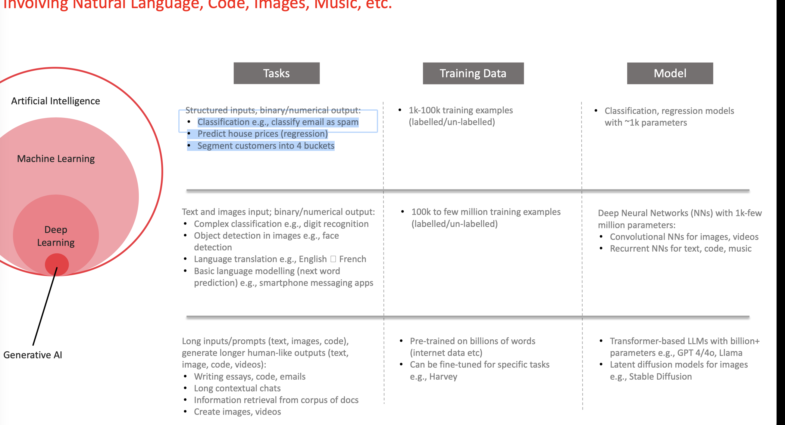  
  
## Generative AI Use Cases: Technology  
  
  
GitHub Copilot, Devin and Replit Ghostwriter are AI-powered  
coding assistants that can streamline development by  
suggesting code completions, generating code from prompts  
and providing a searchable knowledge base  
  
  
These tools can be used for tasks such as these:  
  
	● Automated code generation  
	● Code completion and intelligent suggestions  
	● Bug detection and correction  
	● Code summarisation  
  
**Introduction**  
When thinking about a large language model input and output, a text prompt (sometimes accompanied by other modalities such as image prompts) is the input the model uses  
to predict a specific output. You don’t need to be a data scientist or a machine learning engineer – everyone can write a prompt. However, crafting the most effective prompt can be complicated. Many aspects of your prompt affect its efficacy: the model you use, the model’s training data, the model configurations, your word-choice, style and tone, structure, and context all matter. Therefore, prompt engineering is an iterative process. Inadequate prompts can lead to ambiguous, inaccurate responses, and can hinder the model’s ability to provide meaningful output.  
  
   
   
   
   
   
When you chat with the Gemini chatbot,1 you basically write prompts, however this whitepaper focuses on writing prompts for the Gemini model within Vertex AI or by using the API, because by prompting the model directly you will have access to the configuration such as temperature etc.  
   
This whitepaper discusses prompt engineering in detail. We will look into the various prompting techniques to help you getting started and share tips and best practices to become a prompting expert. We will also discuss some of the challenges you can face while crafting prompts.  
   
   
**Prompt engineering**  
Remember how an LLM works; it’s a prediction engine. The model takes sequential text as an input and then predicts what the following token should be, based on the data it was trained on. The LLM is operationalized to do this over and over again, adding the previously predicted token to the end of the sequential text for predicting the following token. The next  
token prediction is based on the relationship between what’s in the previous tokens and what the LLM has seen during its training.  
   
When you write a prompt, you are attempting to set up the LLM to predict the right sequence of tokens. Prompt engineering is the process of designing high-quality prompts that guide LLMs to produce accurate outputs. This process involves tinkering to find the best prompt, optimizing prompt length, and evaluating a prompt’s writing style and structure in relation  
to the task. In the context of natural language processing and LLMs, a prompt is an input provided to the model to generate a response or prediction.  
  
   
   
   
   
   
These prompts can be used to achieve various kinds of understanding and generation tasks such as text summarization, information extraction, question and answering, text classification, language or code translation, code generation, and code documentation or reasoning.  
   
Please feel free to refer to Google’s prompting guides2,3 with simple and effective prompting examples.  
   
When prompt engineering, you will start by choosing a model. Prompts might need to be optimized for your specific model, regardless of whether you use Gemini language models in Vertex AI, GPT, Claude, or an open source model like Gemma or LLaMA.  
   
Besides the prompt, you will also need to tinker with the various configurations of a LLM.  
   
   
**LLM output configuration**  
Once you choose your model you will need to figure out the model configuration. Most LLMs come with various configuration options that control the LLM’s output. Effective prompt engineering requires setting these configurations optimally for your task.  
   
   
**Output length**  
** **  
An important configuration setting is the number of tokens to generate in a response. Generating more tokens requires more computation from the LLM, leading to higher energy consumption, potentially slower response times, and higher costs.  
  

|  |  |
| - | - |
|  |  |
  
   
   
   
   
   
  
Reducing the output length of the LLM doesn’t cause the LLM to become more stylistically or textually succinct in the output it creates, it just causes the LLM to stop predicting more tokens once the limit is reached. If your needs require a short output length, you’ll also possibly need to engineer your prompt to accommodate.  
   
Output length restriction is especially important for some LLM prompting techniques, like ReAct, where the LLM will keep emitting useless tokens after the response you want.  
   
Be aware, generating more tokens requires more computation from the LLM, leading to higher energy consumption and potentially slower response times, which leads to higher costs.  
   
   
**Sampling controls**  
** **  
LLMs do not formally predict a single token. Rather, LLMs predict probabilities for what the next token could be, with each token in the LLM’s vocabulary getting a probability. Those token probabilities are then sampled to determine what the next produced token will be.  
Temperature, top-K, and top-P are the most common configuration settings that determine how predicted token probabilities are processed to choose a single output token.  
   
   
**Temperature**  
** **  
Temperature controls the degree of randomness in token selection. Lower temperatures are good for prompts that expect a more deterministic response, while higher temperatures can lead to more diverse or unexpected results. A temperature of 0 (greedy decoding) is  
  
   
   
   
   
   
deterministic: the highest probability token is always selected (though note that if two tokens have the same highest predicted probability, depending on how tiebreaking is implemented you may not always get the same output with temperature 0).  
   
Temperatures close to the max tend to create more random output. And as temperature gets higher and higher, all tokens become equally likely to be the next predicted token.  
   
  
The Gemini temperature control can be understood in a similar way to the softmax function used in machine learning. A low temperature setting mirrors a low softmax temperature (T), emphasizing a single, preferred temperature with high certainty. A higher Gemini temperature setting is like a high softmax temperature, making a wider range of temperatures around  
the selected setting more acceptable. This increased uncertainty accommodates scenarios where a rigid, precise temperature may not be essential like for example when experimenting with creative outputs.  
   
   
**Top-K and top-P**  
** **  
Top-K and top-P (also known as nucleus sampling)4 are two sampling settings used in LLMs to restrict the predicted next token to come from tokens with the top predicted probabilities. Like temperature, these sampling settings control the randomness and diversity of generated text.  
•     **Top-K **sampling selects the top K most likely tokens from the model’s predicted distribution. The higher top-K, the more creative and varied the model’s output; the lower top-K, the more restive and factual the model’s output. A top-K of 1 is equivalent to greedy decoding. (Count Based)  
  
   
   
   
   
   
•     **Top-P **sampling selects the top tokens whose cumulative probability  ([PMF)->Probability Mass function sum of probabilities of events till P=PMF(P)) ]does not exceed a certain value (P). Values for P range from 0 (greedy decoding) to 1 (all tokens in the LLM’s vocabulary).  
   
The best way to choose between top-K and top-P is to experiment with both methods (or both together) and see which one produces the results you are looking for.  
   
   
   
   
   
**Putting it all together**  
** **  
Choosing between top-K, top-P, temperature, and the number of tokens to generate, depends on the specific application and desired outcome, and the settings all impact one another. It’s also important to make sure you understand how your chosen model combines the different sampling settings together.  
   
If temperature, top-K, and top-P are all available (as in Vertex Studio), tokens that meet both the top-K and top-P criteria are candidates for the next predicted token, and then  
temperature is applied to sample from the tokens that passed the top-K and top-P criteria. If only top-K or top-P is available, the behavior is the same but only the one top-K or P setting is used.  
   
If temperature is not available, whatever tokens meet the top-K and/or top-P criteria are then randomly selected from to produce a single next predicted token.  
   
At extreme settings of one sampling configuration value, that one sampling setting either cancels out other configuration settings or becomes irrelevant.  
  
# Enhancing LLM Capabilities with Chain-of-Thought  
  
Such prompting techniques are sometimes referred to as ++[in-context learning](http://ai.stanford.edu/blog/understanding-incontext/)++ (ICL). Such techniques allow a model to generalise and learn from a few examples to understand the output for a specific task or domain without the need for extensive ++[fine-tuning](https://platform.openai.com/docs/guides/fine-tuning)++, which can often be costly and is used as a last resort if you are not able to get the desired outputs solely through prompt engineering. You will learn more about fine-tuning LLMs in the upcoming weeks.  
  
The various techniques that fall under in-context learning are as follows:  
* Zero-shot prompting  
* Few-shot prompting  
* Chain-of-thought prompting  
* ReAct prompting  
  
The zero-shot prompting technique is the simplest approach, in which no examples are given to the model. Instead, the model relies on its pre-training on vast amounts of data to generate coherent and relevant content for tasks or concepts they have never been explicitly trained on. The model uses high-level instructions or prompts provided by users to guide its generation process. These prompts can include a description of the desired task or specific instructions for generating content related to that task. So far, we have been using the zero-shot prompting technique to generate good model outputs.   
  
Chain-of-thought (CoT) prompting technique refers to the process of reasoning and making decisions in a way that has been proved to produce good model outputs when working with LLMs like ChatGPT. It involves sequentially building upon and connecting different thoughts, ideas, and information to arrive at a desired outcome or solution.
  
CoT prompting enables complex reasoning capabilities through intermediate reasoning steps. It enables a deeper exploration of complex questions and problems, facilitating a more comprehensive and informed decision-making process. This prompting technique, however, requires a thoughtful and iterative approach. The user must break down a complex task into a series of steps or instructions for the model to follow, actively engage with and evaluate the model’s responses, make the prompts concise, and, if required, incorporate external knowledge and context.  
  
  
Chain-of-thought prompting is a powerful prompting technique that can generate responses that are more natural, coherent, and creative. This technique allows for a more intuitive and efficient interaction, as users can rely on their chain-of-thoughts to guide the model's responses, rather than having to start from scratch with each prompt.  
  
Additionally, chain-of-thought prompting can help to avoid common issues in prompt engineering, such as vague or confusing prompts, by providing a clear and coherent framework for users to work within. In the video above, we saw that just by introducing the phrase 'Let's think step-by-step', the model is able to provide accurate responses even in a zero-shot setting, without any few-shot examples.  
  
  
**Enhancing LLM Capabilities with Chain-of-Thought**  
  
The following image contains examples of different chain-of-thought prompts.  
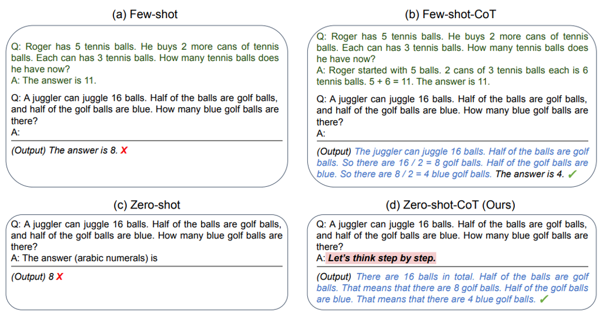  
  
It must also be noted about the salient differences between Zero-Shot-CoT and Few-Shot-CoT. Both techniques are variants of the Chain-of-Thought technique. However, in the case of Zero-Shot-CoT, we use the phrase 'Let's think step by step' and rely wholly on the model's pre-training to generate the output whereas for Few-Shot-CoT, the model analyses the given text, the key concepts, entities, and relationships in the few-shot examples to generate prompts that are relevant to the task at hand. We will learn more about Few-Shot-CoT technique in the upcoming segment.  
  
The chain-of-thought prompting technique requires a deep understanding of the LLM capabilities and the various prompt engineering techniques covered earlier in the session. Once the prompts have been thoroughly vetted and perfected for their responses, the chain-of-thought prompting approach ensures significantly improved and coherent responses compared to traditional prompting techniques, particularly for reasoning and contextual understanding problems.  
  
In the next segment, we will explore another prompting paradigm known as the 'few-shot' prompting. Combined together, chain-of-thought and few-shot techniques can result in better performance of LLMs.  
  
**Additional Readings:**  
* On this site, the author explains the paradigms within CoT with a few examples: ++[Chain-of-thought prompting](https://www.promptingguide.ai/techniques/cot)++  
* In this paper, the authors explore the reasoning capabilities of LLMs using the CoT technique: ++[Chain-of-Thought Prompting Elicits Reasoning in Large Language Models](https://arxiv.org/abs/2201.11903)++  
* In this paper, the authors compare the performance of Zero-shot-CoT vs. Zero-shot prompting: ++[Large Language Models are Zero-Shot Reasoners](https://arxiv.org/pdf/2205.11916.pdf)++  
   
**Enhancing LLM Capabilities with Few-Shot Prompting**  
  
In this session, we will explore the next prompt engineering technique known as ‘few-shot prompting’. This technique revolves around providing examples (or shots) to guide the model to respond in a specific way.  
  
In the few-shot prompting paradigm, we provide the model with multiple examples (or shots) so that the model can generalise and generate the desired output.  
  
In the following video, Kshitij will provide a detailed explanation of the few-shot prompting technique. The prompt used in the video can be accessed below.  
  
In the video, you observed the example of an AI tutor that uses few-shot prompts to guide the model. The few shots serve as references for the model to generate outputs that are highly task-specific. In this case, the task assigned to the model is that of an AI tutor. Note that the model has no prior recollection of how to act as an AI tutor and we specify its role, task, context, guidelines and output format through system messages in the form of prompts. By leveraging the few-shot examples, we ensure that the model understands the underlying context and engages in more targeted and contextually aware conversations. Few-shot prompting techniques offer flexibility to new tasks, making them valuable in generative AI applications.  
  
In the video, you observed the example of an AI tutor that uses few-shot prompts to guide the model. The few shots serve as references for the model to generate outputs that are highly task-specific. In this case, the task assigned to the model is that of an AI tutor. Note that the model has no prior recollection of how to act as an AI tutor and we specify its role, task, context, guidelines and output format through system messages in the form of prompts. By leveraging the few-shot examples, we ensure that the model understands the underlying context and engages in more targeted and contextually aware conversations. Few-shot prompting techniques offer flexibility to new tasks, making them valuable in generative AI applications.  
  
mentioned in the video, few-shot prompting technique's ability to generalise from the few-shot examples provided to the model makes it a powerful prompting technique, particularly when zero-shot technique fails. The usefulness of the few-shot prompting technique lies in its ability to enable rapid adaptation and application of pre-trained models to various specific tasks, without the need for explicit ++[fine-tuning](https://platform.openai.com/docs/guides/fine-tuning)++ (you will learn more about fine-tuning in the upcoming weeks.). We also saw the performance improvements that can be gained by combining few-shot technique with the chain-of-thought technique.  
  
  
  
  
  
  
  
  
  
  
  
  
  
  
  
  
  
  
  
  
  
# Advanced Prompting  
In the module, you will be introduced to the basics of designing Large Language Model (LLM)- based systems and the best practices to ensure a safe and reliable AI system. This session on LLM system design will cover the following topics:  
* Advanced Prompting for Designing AI Systems  
    * Self-consistency prompting  
    * ReAct prompting  
* Designing Safe AI Systems  
    *  Detecting unsafe information  
    * Prompt injection  
    * Detecting prompt injection attacks  
    * Moderation API  
* Beyond Advanced Prompting  
    * Fine-tuning LLMs  
    * Integrating large data sets with LLMs
In the upcoming segments, we will cover the factors to consider when working with language models. The prompts and examples demonstrated in this session have been tested on ChatGPT. It should be noted that the concepts covered in this session can be applied to any large language model available in the market, whether it is an open-source language model or an enterprise model.  
  
json-> Improves readability and reduces hallucinations..  
  
## Self-consistency  
  
  
While large language models have shown impressive success in various NLP tasks, their  
ability to reason is often seen as a limitation that cannot be overcome solely by increasing  
model size. As we learned in the previous Chain of Thought prompting section, the model can  
be prompted to generate reasoning steps like a human solving a problem. However CoT uses  
a simple ‘greedy decoding’ strategy, limiting its effectiveness.  
  
  
  
 Self-consistency combines sampling and majority voting to generate diverse reasoning paths and select the most  
consistent answer. It improves the accuracy and coherence of responses generated by LLMs.  
  
Self-consistency gives a pseudo-probability likelihood of an answer being correct, but  
obviously has high costs.  
  
It follows the following steps:  
	1. Generating diverse reasoning paths: The LLM is provided with the same prompt multiple  
times. A high temperature setting encourages the model to generate different reasoning  
paths and perspectives on the problem  
    2. Extract the answer from each generated response.  
1. Choose the most common answer  
  
  
In the video, Kshitij introduced two advanced prompting techniques: the self-consistency technique and the ReAct technique. Let’s explore the self-consistency technique. As you learned in the previous module, the chain-of-thought prompting technique performs reasonably well in tasks that require complex reasoning and logical thinking.  
  
The self-consistency technique can be considered an extension of the chain-of-thought technique. In practical situations, humans tend to explore different reasoning paths or consult multiple sources to make well-informed decisions. Analogously, the self-consistency approach aims to emulate this cognitive process. **Self-consistency capitalises on the understanding that a complex reasoning problem usually allows for various approaches, each leading to the same unique correct answer. The technique involves sampling from various reasoning paths with a few-shot chain-of-thought prompting technique and then using the responses (i.e., diverse reasoning paths) to choose the best (i.e., most consistent) answer. The model is provided with diverse perspectives, thereby promoting critical evaluation of its own reasoning. The image below has been sourced from the original research paper and illustrates the self-consistency approach.**  
  
  
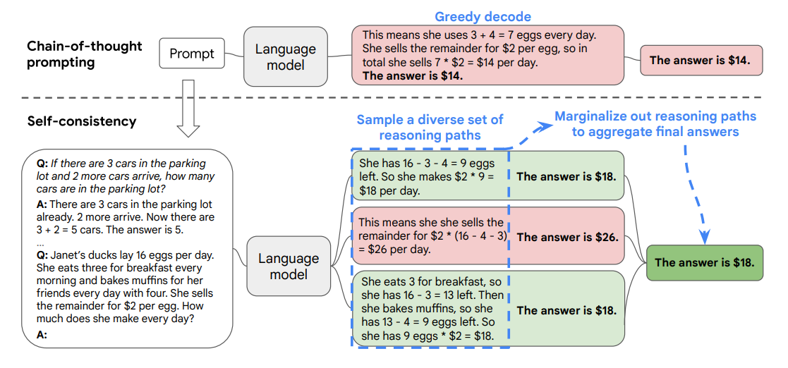  
  
While a traditional chain-of-thought approach employs a naive greedy decoding strategy to reach its response, self-consistency replaces the strategy with a diverse set of reasoning paths. The AI model can arrive at more accurate and reliable answers by utilising a majority voting system. The self-consistency technique has been shown to improve results on arithmetic, commonsense and symbolic reasoning tasks.  
  
As shown in the image above, the model selects the most coherent and consistent response among the generated outputs. There are several advantages of using this technique:   
* **Reduced bias**: The technique can help narrow down and mitigate biases, if any, as a result of its pre-training.  
* **Self-evaluation**: It encourages the model to consider various viewpoints and form a logical train of thought before reaching a conclusion. This makes the model valuable for problem-solving and decision-making problems.  
* **Improved accuracy**: By exploring different reasoning paths, the model can evaluate and produce the most accurate results.
  
Self-consistency prompting ensures that the language model behaves in the intended manner, i.e., it generates consistent outputs given an input prompt and, to a large extent, ensures the accuracy of its output. Furthermore, Kshitij also mentioned the ReAct prompting technique. We will explore this technique in the next segment.  
  
Later in the video, Kshitij introduced a system designed for the AI Tutor application. The aim of the AI tutor application is to help learners understand concepts by clearing their doubts. The architecture for the AI Tutor application has been divided into the following layers:  
* **Solution layer**: In this layer, we ask the LLM to first solve the problem by itself. We use few-shot CoT examples in the prompt, ensemble multiple attempts (say 10), and choose the most consistent answer among the 10 attempts.   
* **Guidance layer**: In this layer, the answer produced in the previous step is provided as guidance to the learner. The overall system architecture is illustrated in the image below.  
  
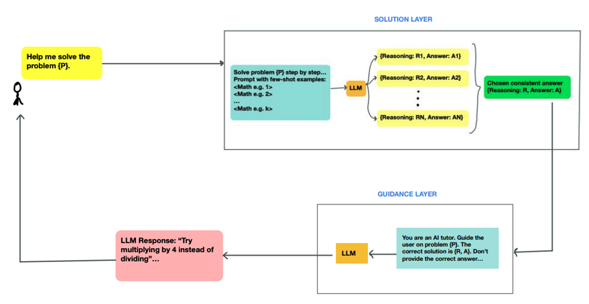  
  
In the image of the system design above, you can see how the different layers can be combined to achieve the end goal: the AI tutor must be able to solve hard mathematical problems step-by-step without revealing the final answer. The design involves passing the output of one prompt to another in a sequence/ chain of prompts to generate output responses for the user’s query. This method, whereby prompts are grouped sequentially to form a chain, is known as **prompt chaining** and is an essential technique for creating applications with large language models.  
  
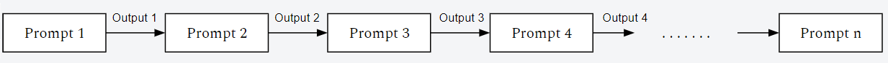  
  
You may have used this concept non-intuitively while working with ChatGPT. For instance, given a task, you use an input prompt to get a model response. Furthermore, when given additional information, ChatGPT is able to provide a modified output by remembering the context of the conversation. This is a simple example of prompt chaining, whereby the model modifies the output based on the additional information provided to the model. Prompt chaining makes it possible to divide the overall system based on the logical steps involved in solving the problem. This ensures that the overall prompt size (length of prompts in the system message,  role, etc.) is low, and the model can understand the underlying context of the task. However, creating additional layers via prompt chaining leads to additional API calls since the model is called multiple times to generate the user response. In the following video, we will explore the individual prompts in each layer of the AI tutor architecture.  
  
In the video, we saw the individual prompts in the solution layer and guidance layer that make up the AI tutor application. The prompt texts can be downloaded from this ++[link](https://woolfaws-prod.s3.ap-south-1.amazonaws.com/sharepoint_zips/Week_3.zip)++. difference from react-> No input from environment  
  
The solution layer uses the few-shot chain-of-thought technique and answer-ensembling (self-consistency) to arrive at the correct answer to the problem. Note that we have demarcated the prompt into their individual components (role, task, guidelines, output format) for easy understanding, as discussed in the session ‘Prompt Engineering’.  The output response from this layer in the JSON format {Reasoning: <Reason>, Answer: <Answer>} is now passed to the next chain in the sequence, i.e., the ‘guidance layer’.  
  
The guidance layer has been designed to help the learner show the step-by-step reasoning for the task without explicitly showing the output. This has been configured by defining the role, task, guidelines and output format in the prompt. This layer serves as an intermediary before finally passing the response to the end user. The user can now input their query to the system, and the model can produce the output response by adhering to the system prompts defined in the architecture.  
react then?  
  
  
  
In the next segment, we will take a look at the next prompting technique - the ReAct (Reasoning and Acting) prompting technique.   
**Additional Reading:**  
* In this ++[paper](https://arxiv.org/abs/2203.11171)++, the authors propose the self-consistency technique.   
* This ++[article](https://learnprompting.org/docs/intermediate/self_consistency)++ showcases a few use cases of the self-consistency technique.  
  
  
  
  
  
  
  
  
  
**React Prompting**  
  
The ReAct framework is a groundbreaking technique that has immense potential in knowledge-intensive reasoning tasks and decision-making scenarios. The method can be considered an off-shoot of the chain-of-thought technique we explored in the previous module, where we induce the language model to think in a series of steps to arrive at a conclusion. The ReAct technique goes one step further and incorporates ‘reasoning’ and ‘performing actions’ based on its reasoning. This helps improve the model’s performance (i.e., in terms of correct response) and also deals with the pitfalls that such models usually face.  
Language models are susceptible to a common issue known as ‘hallucinations’. The term ‘hallucination’ refers to the phenomenon where the model generates text that is incorrect, nonsensical or not real. LLMs are trained on vast amounts of data to predict the most probable next word in a sequence. Although they are very efficient at predicting the correct token predictors for a preceding token, they are not quite good at understanding if the predicted token is, in fact, correct or incorrect. Additionally, the models are known to suffer from biases and reasoning errors.  
ReAct aims to overcome these issues by enabling LLMs to perform in-context learning using few-shot learning techniques. ReAct-based prompts include examples with interleaved thoughts, actions and observations, imitating how humans think and act when solving problems or performing task-specific actions, which allows LLMs to take text actions and receive text observations. The image below from the original research paper illustrates the ReAct framework for LLMs.
  
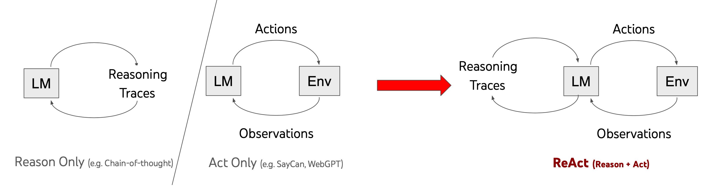  

The following ++[image](https://react-lm.github.io/)++ from the original paper illustrates the performance of ReAct for the following question: Aside from the Apple Remote, what other device can control the program Apple Remote was originally designed to interact with?  By dividing the tasks into ‘Thoughts’, ‘Actions’ and ‘Observations’, the ReAct framework effectively generates both verbal reasoning traces and text actions in an interleaved manner. In this ++[example](https://chat.openai.com/share/78423531-fcb6-43a3-963a-6bfe48443cb9)++, ReAct demonstrates it is able to reason correctly and propose the correct course of action for a complex scenario. 
  
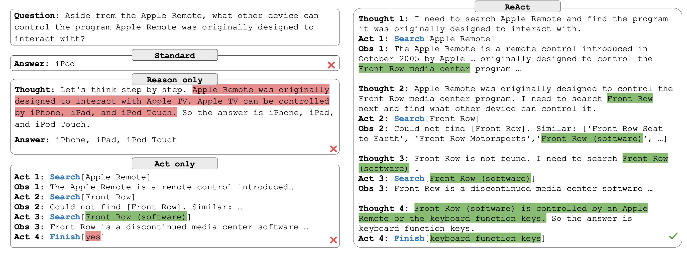  

In the following example from ++[Google’s Research blog](https://ai.googleblog.com/2022/11/react-synergizing-reasoning-and-acting.html?m=1)++, the ReAct technique is able to arrive at the correct answer while CoT gives a hallucinated output. 
  
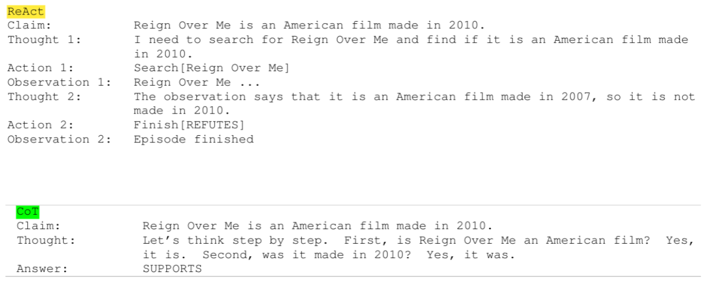  

As we can observe above, a distinguishing factor of ReAct is its ability to tackle hallucinations effectively, which has been a major challenge in large language models. By allowing the model to interact with the environment and gather information through actions, ReAct minimises the risk of generating incorrect or fictitious answers. When the model comes across a question that cannot be answered using its knowledge base, ReAct allows the model to interact with external sources (news articles, financial reports, internet) to gather more information and arrive at the correct answer.  
ReAct represents a significant step towards achieving artificial general intelligence (AGI) and embodied language models, bringing robots closer to thinking and acting like humans. This revolutionary prompt engineering approach opens the doors to a future where LLMs can act as intelligent agents in various domains, leveraging their ability to reason and interact with environments. In the SemanticSpotter project, we will explore new LLM frameworks, such as LangChain, that ++[integrate ReAct](https://python.langchain.com/docs/modules/agents/agent_types/react)++ within their ecosystem, which reduces the scope for LLM hallucinations and enables the model to use external tools such as search engines and plug-ins to perform a given task.  
In the video, Kshitj introduced the problem - which is to build a chatbot that can recommend laptops to users in an e-commerce domain and suggest the correct laptop based on their preferences. Building a product recommendation system is a complex machine learning problem that involves understanding the user requirements correctly and suggesting the right products. Let’s break down the steps involved in solving the problem:  
* The chatbot should converse normally with the user and identify their purpose for buying a laptop. The chatbot should ask clarifying questions to capture the user’s intent for buying the laptop and surmise the intended use of the laptop from its conversation with the user.  
* Once the chatbot has gained enough context and information from the user, it should generate laptop features that can be easily used to identify the laptop from the database. Additionally, the features should closely match the existing schema of the given laptop databases. For example, if the user is aiming to buy a computer with a high-performance GPU, the model should correctly extract this feature and appropriately tagged as :<high_performance>/ etc. This tagging enables the model to extract the relevant products from the database, ensuring that the product meets the user’s expectations.   
* If the chatbot has found a laptop/laptops, it should display these results to the user.   
* If the chatbot is unable to find a laptop as per the user’s requirement, it should redirect them to a human operator.   
Each step described in the process is a complex set of instructions that usually requires extensive coding, testing and evaluation before being eventually deployed in a production environment. As you learned in the previous segments and modules, language models are capable of performing reasoning and logical operations and can perform complex tasks once they are provided with instructions clearly specified through prompts.  
In the upcoming video. Kshitij will describe one of the ways in which a complex system, such as a laptop recommendation system, can be built using a language model such as ChatGPT.  
**Additional Reading:**  
* In this ++[paper](https://arxiv.org/pdf/2210.03629.pdf)++, the author introduces the ReAct prompting framework  
* This ++[article](https://www.promptingguide.ai/techniques/react)++ summarises the essential concepts of ReAct prompting.  
* This ++[article](https://medium.com/@bryan.mckenney/teaching-llms-to-think-and-act-react-prompt-engineering-eef278555a2e)++ details the basics of ReAct prompting and its performance for various tasks.  
* In this ++[paper](https://www.arxiv-vanity.com/papers/2212.10403/)++, the authors explore the various reasoning frameworks that LLMs employ.  
  
  
  
  
# ShopAssist  
  
In the video, Kshitj introduced the problem - which is to build a chatbot that can recommend laptops to users in an e-commerce domain and suggest the correct laptop based on their preferences. Building a product recommendation system is a complex machine learning problem that involves understanding the user requirements correctly and suggesting the right products. Let’s break down the steps involved in solving the problem:  
* The chatbot should converse normally with the user and identify their purpose for buying a laptop. The chatbot should ask clarifying questions to capture the user’s intent for buying the laptop and surmise the intended use of the laptop from its conversation with the user.  
* Once the chatbot has gained enough context and information from the user, it should generate laptop features that can be easily used to identify the laptop from the database. Additionally, the features should closely match the existing schema of the given laptop databases. For example, if the user is aiming to buy a computer with a high-performance GPU, the model should correctly extract this feature and appropriately tagged as <gpu>:<high_performance>/<high> etc. This tagging enables the model to extract the relevant products from the database, ensuring that the product meets the user’s expectations.   
* If the chatbot has found a laptop/laptops, it should display these results to the user.   
* If the chatbot is unable to find a laptop as per the user’s requirement, it should redirect them to a human operator.   
  
Each step described in the process is a complex set of instructions that usually requires extensive coding, testing and evaluation before being eventually deployed in a production environment. As you learned in the previous segments and modules, language models are capable of performing reasoning and logical operations and can perform complex tasks once they are provided with instructions clearly specified through prompts.  
  
In the upcoming video. Kshitij will describe one of the ways in which a complex system, such as a laptop recommendation system, can be built using a language model such as ChatGPT.  
  
The objective of the overall system is to recommend laptops based on the user’s profile.  
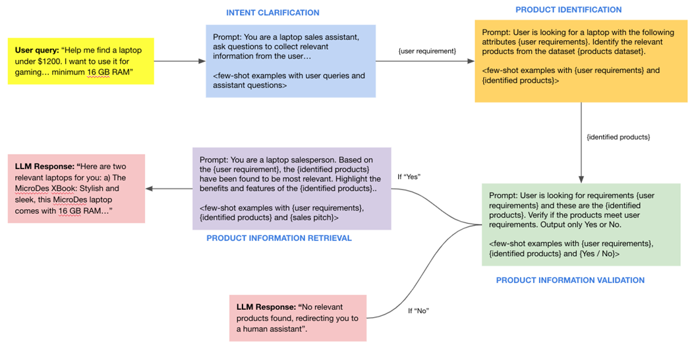  
The salient components of this system are described below:  
* **User query:** In this component, the user inputs the requirement to the model. It can include the possible use cases where they intend to use the laptop, such as gaming, professional use or academic research. The language model must capture the user’s requirements from this conversation and accordingly parse it to find the right laptop recommendations for the user based on their needs. This is handled by the next layer.  
* **Intent clarification:** This layer is tasked with extracting the exact requirements of the user based on their input prompt, converting them into a set of features that can eventually be used to narrow down the laptops from the laptop database.  
* **Product identification:** This layer evaluates the products from the product database based on the user requirements collected in the previous chain and identifies the relevant products.  
* **Product information validation:** This layer validates if relevant product information is present in the database and meets the user's requirements. If it is not present, this layer will connect the user to a human assistant.  
* **Product information retrieval:** The ‘sales’ layer communicates the product features in a friendly, persuasive manner.  
**Additional Reading:**  
* In this ++[article](https://huyenchip.com/2023/04/11/llm-engineering.html)++, the author describes the various challenges of creating LLM applications.  
* This ++[article](https://a16z.com/2023/06/20/emerging-architectures-for-llm-applications/)++ shows the emerging system architectures for LLM applications.  
  
In the video above, Kshitj illustrated some safety concerns while integrating AI solutions into a product. Large language models are highly stochastic and can produce widely varied outputs based on the user’s input; hence, safety and privacy are important aspects to be considered when building such solutions. Here are some of the common points that must be considered:  
* **Detecting unsafe information**. It is important to ensure that the AI system does not generate or share unsafe information, such as hate speech, misinformation or harmful content. This can be achieved through content moderation and filtering mechanisms.  
* **Detecting prompt injections and prompt injection attacks**. Prompt injection is a vulnerability in LLMs that can be exploited by attackers to manipulate their output responses.  
* **Detecting information that may be considered sensitive, racist or discriminatory**. Large language models like ChatGPT have the potential to generate sensitive information, such as personal data or confidential information. This can be prevented by designing prompts carefully and implementing privacy and security measures to protect any sensitive information that may be generated.  
Creating a safe AI system with a large language model like ChatGPT requires careful consideration of the points mentioned above to ensure that the system is secure, reliable and trustworthy. OpenAI has released an API called the Moderation API, which can detect any unsafe information from the user’s text and flag them before the language model can act on the user’s input. The ++[Moderation API](https://platform.openai.com/docs/guides/moderation)++ currently can correctly classify the following categories of unsafe texts:  
* hate  
* hate/threatening  
* harassment  
* harassment/threatening  
* self-harm  
* self-harm/intent  
* self-harm/instructions  
* sexual  
* sexual/minors  
* violence  
* violence/graphic
We urge you to read OpenAI’s documentation to understand what each of these categories represents. The Moderation API is currently free to use when monitoring the inputs and outputs of OpenAI APIs and supports only English text. Now let’s hear from the SME on how to deal with prompt injections in the video below.  
In the video, Kshitij discussed prompt injection and how prompt injection sequences can be detected. Prompt injection attacks can be used to manipulate the output of an AI system in harmful ways. These attacks can be prevented by designing the input prompts carefully and monitoring the system for any signs of manipulation. To tackle this issue, Kshitij discussed adding a separate layer that can perform the necessary checks to detect and classify unsafe pieces of text and prompt injections. By using a moderation layer that analyses and validates the user input before it reaches the language model, the system can detect and catch some prompt injection attempts. This involves checking for specific language patterns, tokens or encoding mechanisms that may indicate a prompt injection attack.  
Additionally, to detect prompt injections and prompt injection attacks in a large language model like ChatGPT, the following approaches can help safeguard your LLM application:  
* **Implement security controls**: Adding layers of security controls can make prompt injection attacks more difficult to exploit. This can include measures such as access controls, authentication mechanisms and input validation to ensure that only authorised and safe inputs are processed by the language model.  
* **Monitor and log interactions**: By monitoring and logging the interactions between the language model and users, potential prompt injection attempts can be detected and analysed. This involves keeping track of the input prompts and examining them for any signs of manipulation or malicious intent.  
* **Reduce the impact of attack**: LLMs are increasingly becoming valuable tools for organisations, enabling them to extract insights from their proprietary data by creating ++[data moats](https://www.forbes.com/sites/lutzfinger/2023/04/04/what-is-the-competitive-advantage-of-llms-like-chatgpt-for-your-business-three-takeaways/?sh=1709c1715751)++. By implementing robust security measures and limiting the model's access to sensitive data and resources, you can reduce the potential impact on your organisation if an attack were to be successful.  
Detecting prompt injections and prompt injection attacks can be challenging, as language input is inherently complex and attackers are always on the lookout for new vulnerabilities to bypass security controls. However, by implementing the abovementioned strategies and staying vigilant, the risks can be minimised and the language model applications can be made more secure. Prompt injection attacks are a new vulnerability, and researchers are actively working on developing countermeasures. One must stay updated with the latest research and security practices to mitigate the risks associated with prompt injections.  
**Additional Reading:**  
* This ++[blog post](https://research.nccgroup.com/2022/12/05/exploring-prompt-injection-attacks/)++ explores prompt injection patterns in large language models in great depth.  
* This ++[article ](https://medium.com/@ppaudyal/the-illusion-of-proprietary-data-as-a-moat-in-the-age-of-large-language-models-9d64a8c81a44)++explores the technical challenges involved in creating LLM applications.  
n this video, Kshitij discussed a few additional techniques that need to be considered once you have evaluated prompt engineering techniques for your LLM application. These include the following:  
* Designing better prompts  
* Providing additional data  
* LLM fine-tuning
The choice of these techniques depends on the nature of the task, complexity or costs associated with the technique and availability of resources.   
In the graph given below, the accuracy has been plotted against the complexity and cost for different regimens in a large language model. (**Source**: ++[AWS](https://github.com/aws-samples/sagemaker-distributed-training-workshop/blob/main/slides/Generative%20AI%20Foundations%20Technical%20Deep%20Dive/1%20-%20Intro%20to%20FMs.pdf.zip)++, Slide 7)  
  
As seen in the graph, while prompt engineering is the least complex and cost-efficient method, it may not always produce the most accurate response.  
  
  
**Beyond Advanced Prompting: Integrating Data**  
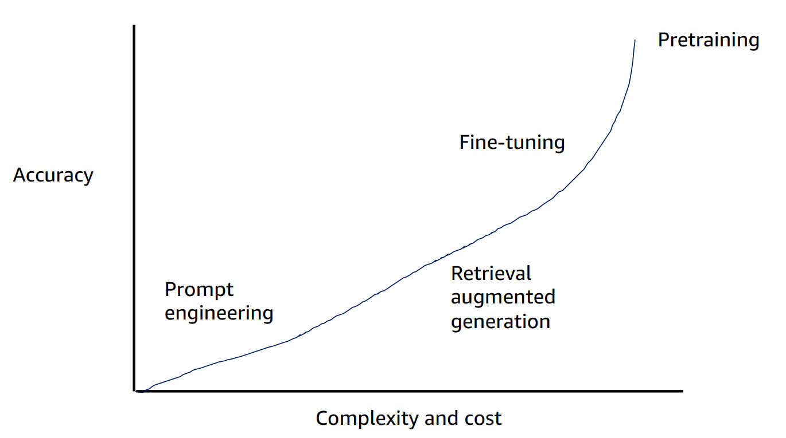  
  
  
  

In the video, Kshitij mentions a key issue encountered when working with large data sets. Data sets with millions of rows or enterprise documents that may often range from a few terabytes to petabytes of data are difficult to directly input into the large language model. Large language models are also limited by the context window, which is the length of the longest sequence that it can use to generate a token, and the high costs typically associated with using large input tokens. Hence, it is not possible to build a scalable system with only a large language model. For dealing with these issues, Kshitij discussed how this limitation can be resolved. One way to achieve this is by creating vector embeddings. Vector embeddings are representations of words, phrases or sentences as dense numerical vectors in a high-dimensional space. For example, OpenAI’s embeddings have ++[1536 dimensions](https://openai.com/blog/new-and-improved-embedding-model#:~:text=The%20new%20embeddings%20have%20only%201536%20dimensions%2C)++, whereas the open-source BERT-BASE model generates ++[768-length embedding vectors](https://tech.target.com/blog/bert-model)++.  
  
These embeddings are used to capture the semantic meaning and contextual relationships between different elements of language. The concept is a fundamental component of many natural language processing (NLP) tasks and has significantly contributed to the success of large language models such as ChatGPT. Once the vector representations of the corpus in the input document has been created, these can be stored in a dedicated database that specialises in storing these vector inputs. With the explosion of large language models, many vector embeddings and vector database solutions are available in the market. A few popular ones include ++[Pinecone](https://www.pinecone.io/)++, ++[Redis](https://redis.io/)++, ++[Weaviate](https://weaviate.io/)++, ++[Chroma ](https://www.trychroma.com/)++and ++[FAISS](https://faiss.ai/index.html)++. You will learn more about embeddings and vector databases in the HelpMate AI project, but if you are curious now, you can refer to this link for more information on ++[word embeddings](https://www.turing.com/kb/guide-on-word-embeddings-in-nlp)++.
Word Embeddings in NLP is a technique where individual words are represented as real-valued vectors in a lower-dimensional space and captures inter-word semantics. Each word is represented by a real-valued vector with tens or hundreds of dimensions.  
Kshitj also illustrated a typical solution involving vector embeddings in an LLM-based system by considering the example of the laptop recommendation system discussed in the previous segment. When a user presents a query to the LLM system, the model first converts the query into its embeddings. The user’s query in the embedding form is then compared with the embeddings of the entire corpus using metrics such as ++[cosine similarity](https://en.wikipedia.org/wiki/Cosine_similarity)++ to obtain the closest matching output to retrieve the relevant output for the query. The system then parses the embeddings back to a human-readable text format.
This technique is called **Retrieval Augmented Generation** (as visible in the graph given above the video). Retrieval Augmented Generation (RAG) is a novel technique that is usually employed for information extraction tasks, typically those involving enterprise data. Language models have a cut-off date beyond which they cannot produce a correct output or may even produce ‘hallucinations’. This technique leverages the strengths of retrieval-based models and generative models to enhance the quality and relevance of the generated text in natural language processing tasks and reduce ++[LLM hallucinations](https://cobusgreyling.medium.com/retrieval-augmented-generation-rag-safeguards-against-llm-hallucination-2d24639aff65)++. Applications of RAG include enterprise question answering systems in which the retrieval-based model can find relevant information to answer user queries as well as knowledge-intensive tasks that require generating text based on the retrieved information. We will discuss this technique in more detail in the upcoming modules.  
  
  
In the video, Kshitij mentions a key issue encountered when working with large data sets. Data sets with millions of rows or enterprise documents that may often range from a few terabytes to petabytes of data are difficult to directly input into the large language model.   
  
Large language models are also limited by the context window, which is the length of the longest sequence that it can use to generate a token, and the high costs typically associated with using large input tokens. Hence, it is not possible to build a scalable system with only a large language model. For dealing with these issues, Kshitij discussed how this limitation can be resolved. One way to achieve this is by creating vector embeddings. Vector embeddings are representations of words, phrases or sentences as dense numerical vectors in a high-dimensional space. For example, OpenAI’s embeddings have ++[1536 dimensions](https://openai.com/blog/new-and-improved-embedding-model#:~:text=The%20new%20embeddings%20have%20only%201536%20dimensions%2C)++, whereas the open-source BERT-BASE model generates ++[768-length embedding vectors](https://tech.target.com/blog/bert-model)++.  
  
These embeddings are used to capture the semantic meaning and contextual relationships between different elements of language. The concept is a fundamental component of many natural language processing (NLP) tasks and has significantly contributed to the success of large language models such as ChatGPT. Once the vector representations of the corpus in the input document has been created, these can be stored in a dedicated database that specialises in storing these vector inputs. With the explosion of large language models, many vector embeddings and vector database solutions are available in the market. A few popular ones include ++[Pinecone](https://www.pinecone.io/)++, ++[Redis](https://redis.io/)++, ++[Weaviate](https://weaviate.io/)++, ++[Chroma ](https://www.trychroma.com/)++and ++[FAISS](https://faiss.ai/index.html)++. You will learn more about embeddings and vector databases in the HelpMate AI project, but if you are curious now, you can refer to this link for more information on ++[word embeddings](https://www.turing.com/kb/guide-on-word-embeddings-in-nlp)++.
  
  
Kshitj also illustrated a typical solution involving vector embeddings in an LLM-based system by considering the example of the laptop recommendation system discussed in the previous segment. When a user presents a query to the LLM system, the model first converts the query into its embeddings. The user’s query in the embedding form is then compared with the embeddings of the entire corpus using metrics such as ++[cosine similarity](https://en.wikipedia.org/wiki/Cosine_similarity)++ to obtain the closest matching output to retrieve the relevant output for the query. The system then parses the embeddings back to a human-readable text format.  
  

This technique is called **Retrieval Augmented Generation** (as visible in the graph given above the video). Retrieval Augmented Generation (RAG) is a novel technique that is usually employed for information extraction tasks, typically those involving enterprise data. Language models have a cut-off date beyond which they cannot produce a correct output or may even produce ‘hallucinations’. This technique leverages the strengths of retrieval-based models and generative models to enhance the quality and relevance of the generated text in natural language processing tasks and reduce ++[LLM hallucinations](https://cobusgreyling.medium.com/retrieval-augmented-generation-rag-safeguards-against-llm-hallucination-2d24639aff65)++. Applications of RAG include enterprise question answering systems in which the retrieval-based model can find relevant information to answer user queries as well as knowledge-intensive tasks that require generating text based on the retrieved information. We will discuss this technique in more detail in the upcoming modules.  
  
  
**LLM Fine-Tuning**
In this segment, we will explore the concept of fine-tuning in the context of a large language model. Fine-tuning is a machine learning concept that is commonly applied in machine learning to optimise and adapt a model’s weights to the examples provided to it. This results in a model that performs better than what would be possible without fine-tuning. OpenAI allows you to fine-tune its models on specific data to ensure that the output responses are in line with your domain or use cases. Let's hear from Kshitij in the video below.  
Fine-tuning is a technique used in deep learning for optimising a pre-trained model on new data. The weights of the neural networks in the pre-trained model are updated after training on new data (either on the entire neural network or on only a subset of its layers). Fine-tuning can be a powerful training technique, as it adapts an already capable model to perform a particular task.

In the earlier video, Kshitij explained the advantages of fine-tuning a large language model. There are various reasons why LLMs need to be fine-tuned:  
* **Model’s performance**: Fine-tuned language models perform better than generic language models since they have been trained on additional data from the domain.  
* **Output quality**: By leveraging the language model’s ability to deal with natural language tasks owing to pretraining and additional fine-tuning on the custom data, the model can produce a more accurate, relevant and context-aware response than that generated by a normal language model.  
* **Hallucinations**: By fine-tuning the LLM on carefully curated domain-specific data sets, the language model can learn how to generate more accurate and relevant responses to tasks pertaining to the domain. Along with human feedback and constant training, the problem of hallucinations can be reduced to a large extent.   
* **Safety**: The model can be explicitly trained in scenarios that may lead to security concerns. This ensures that the model does not return malicious or discriminatory content.
As described in the video, the training examples can be structured in the following JSON format.  
```


```
```


```
```
{"prompt": "", "completion": ""}
{"prompt": "", "completion": ""}
{"prompt": "", "completion": ""}


```
You can refer to OpenAI’s official ++[link ](https://platform.openai.com/docs/guides/fine-tuning)++for more information on fine-tuning using GPT models.  
  

Fine-tuning a model involves additional computing costs for updating the model weights, which may range from a ++[couple of dollars](https://www.databricks.com/blog/2023/04/12/dolly-first-open-commercially-viable-instruction-tuned-llm)++ to ++[millions of dollars](https://www.pcguide.com/apps/gpt-3-cost/)++. Ultimately, the choice of fine-tuning or prompt engineering is based on the accuracy of the language model for the given task against the complexity and cost involved in the process.   
Prompt engineering remains the simplest and easiest approach for generating the model’s response. It involves an iterative process of refining and evaluating the model’s response to generate the intended response. The typical process involved in prompt engineering has been illustrated below. (**Source**: ++[AWS](https://github.com/aws-samples/sagemaker-distributed-training-workshop/blob/main/slides/Generative%20AI%20Foundations%20Technical%20Deep%20Dive/3-%20Using%20pretrained%20FMs.pdf.zip)++, Slide 5)
  
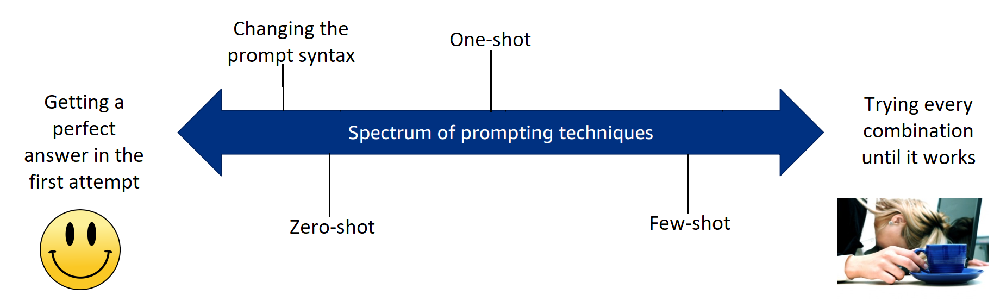  

As shown in the image and covered in the previous segments, we have covered various prompt engineering techniques that have been proven to give useful and correct output responses for various NLP tasks. Let’s recap the general workflow involved in prompt engineering:   
1. The general strategy taken while using prompt engineering techniques is to start with a generic prompt template and make slight adjustments to evaluate the model responses. Such zero-shot prompts generally give good responses if the model has seen information regarding the user prompt during pretraining. Typically, this works well for LLMs with large parameters (>100B parameters), such as ChatGPT, Bard and LLaMA, that have been trained on a large text corpus but fail to perform adequately for smaller parameter models.  
2. If the zero-shot technique fails, you can add examples to the prompt to mimic the type of responses you want to achieve. The number of responses depends on how well the model can generalise from the examples provided to it, and you get single-shot or one-shot and few-shot prompt techniques.  
3. You can then iteratively improve the prompt until you have achieved the perfect output response from the model.  
4. After performing steps 1–3, if you do not receive a sufficiently good output, you can consider augmenting the model using relevant domain data or performing fine-tuning with sufficient examples. These are more advanced techniques that you will implement in the later projects of the program.  
  
  
As you can surmise, prompt engineering is an iterative process, and you should be aware of the language model’s capabilities and general prompting principles to elicit a good output. As researchers explore various prompting paradigms, the more capable these models seem to become in solving specific tasks, especially the tasks containing logical and reasoning steps. Though time is required to engineer the 'correct prompt’ for your use case, the final response from the model is always subject to the model’s capability and updates.   
  
  
  
Enterprise models are constantly updated and aligned using techniques such as Reinforcement Learning through Human Feedback (RLHF), which updates the model’s capabilities constantly.  
Additionally, prompts also vary from one language model to another. A prompt used in a language model with large parameters (i.e., parameters >100B or 100 Billion), such as ChatGPT (175B parameters), may not necessarily work in a different language model (i.e., Google FLAN-T5 XXL, which contains 11B parameters).   
  
  
Another training regimen for large language m**odels is model pretraining. This refers to training a language model from scratch on various data sets. Pre-training is the process of training a language model on a large amount of unlabelled text data. The goal of pre-training is to teach the model basic language tasks and functions, such as predicting the next word in a sentence, so that it can better understand and generate natural language. This training regimen is employed by companies such as OpenAI, Meta and Google to build ‘foundation models’ (such as ChatGPT, Bard and LLaMA) using various transformer architectures, training techniques, data sets, etc. **  
  
  
 These models are then fine-tuned using techniques such as ++[instruction-fine-tuning](https://cameronrwolfe.substack.com/p/language-models-gpt-and-gpt-2)++ on a specific task, for example, text classification.  
  
 For large enterprises, pre-training can be especially useful when a language model needs to be fine-tuned on proprietary data sets, which can be very vast and diverse compared to the ++[research data sets](https://magazine.sebastianraschka.com/p/ahead-of-ai-8-the-latest-open-source)++ used for the usual pre-training of a language model. A few examples of such models include ones that have been covered in the module titled ‘Introduction to Generative AI’, such as BloombergGPT and Einstein GPT, which use proprietary data sets for pre-training.   
  
Additionally, pre-training a foundation model can also reduce LLM hallucinations and ensure the privacy of proprietary data.  
Ultimately, the deciding factor for fine-tuning is taken by judging the language model’s capabilities, its performance with prompt techniques (such as few-shot technique), the type of application being developed and the overall cost of building the model. To obtain a model that performs better, you will need to fine-tune it using a few hundred to a couple of thousand examples, which will incur additional costs.   
Foundation models are being constantly developed at a breakneck speed with new improvements, training techniques and data sets. Keeping yourself updated with the latest technologies and model offerings is crucial while working with generative technologies and creating applications with LLMs. The ++[Open LLM Leaderboard](https://huggingface.co/spaces/HuggingFaceH4/open_llm_leaderboard)++ is one such initiative by HuggingFace to evaluate and rank open-source LLMs and chatbots.  
  
  
**Additional Reading:**  
* In this ++[paper](https://aclanthology.org/2021.naacl-main.208.pdf)++, the authors compared the efficiency of using simple prompt engineering techniques with that of using fine-tuning methods on large language models  
* This ++[article ](https://mlops.community/fine-tuning-vs-prompt-engineering-llms/)++explores the benefits of fine-tuning and prompt engineering in LLMs  
* These links provide additional information on LLM fine-tuning:  
    * ++[LLM Fine Tuning Guide for Enterprises in 2023](https://research.aimultiple.com/llm-fine-tuning/)++  
    * ++[The Complete Guide to LLM Fine-Tuning](https://bdtechtalks.com/2023/07/10/llm-fine-tuning/)++  
* This ++[article ](https://cameronrwolfe.substack.com/p/language-model-scaling-laws-and-gpt)++explores the various parameters and the scaling law to be considered while pre-training LLMs such as the GPT models  
In this session, we covered the important concepts involved in designing LLM-based systems.

We started the session by discussing a few advanced prompting techniques, such as self-consistency and ReAct, along with their use cases.  
Then, you learnt how to design LLM applications with the help of the example of the AI Tutor application. We decomposed the task into its components and used prompt chaining to create the AI tutor system.  
We then explored the safety aspects of LLM applications, such as:  
* Detecting unsafe/sensitive information  
* Detecting prompt injection
 
We covered OpenAI’s Moderation API, which can be used for detecting unsafe information and its various categories such as hate, violence, etc.  
Prompt injections and prompt injection attacks are carried out to reveal confidential or sensitive information from language models by exploiting various vulnerabilities. We then discussed how LLMs can be protected against such attacks by:  
* Implementing security controls  
* Monitoring and logging user interactions with the model  
* Creating data moats  
We then explored a few concepts that can create better LLM-based applications such as the following:  
* Prompt engineering  
* Integrating large data sets  
* Fine-tuning  
  
  
