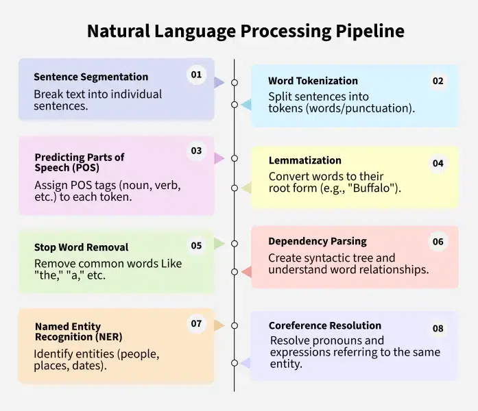
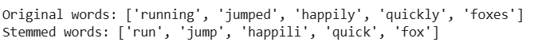
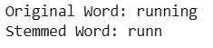
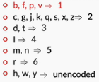
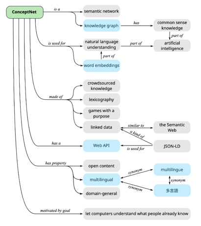
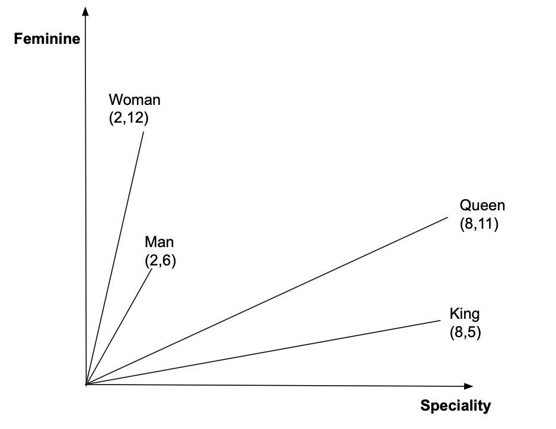

#  Natural Language Processing (NLP)  
  
#todo Rewatch CNN Stable Diffusion Lecture  
  
Natural Language Processing (NLP) enables computers to understand and interpret human language. While computers excel at processing structured data, such as spreadsheets or databases, natural language in its unstructured form (text, speech, etc.) presents a unique challenge. NLP bridges this gap by allowing machines to process and understand human languages, making it an essential tool in modern AI systems.
Let's learn more about Natural Language Processing in this article.
  
  
**Need for Natural Language Processing
The growing amount of unstructured natural language data in the world makes it increasingly important for machines to comprehend and analyze it effectively. By training NLP models, we can equip computers to process language data in a variety of forms, from written text to voice input. With centuries of human-written literature and massive data available, it’s vital to teach computers to interpret that wealth of information. However, this task comes with significant challenges, such as resolving ambiguities in meaning, Named-Entity Recognition (NER), and coreference resolution.
While NLP systems are improving, they still face difficulties in understanding the exact meaning of sentences.
For example, consider the phrase: "The boy radiated fire-like vibes." Does it refer to a motivating personality or imply something literal? Such ambiguities make text analysis complex for computers.
To solve these challenges, NLP breaks down language understanding into smaller, manageable components. This approach, known as the NLP pipeline, involves several stages that collectively enable machines to interpret human language effectivel
Key Steps in Natural Language Processing (NLP) Pipeline
**  
  

**1. Sentence Segmentation**
Sentence segmentation is the first step in NLP, which involves breaking text into individual sentences. This helps the computer understand the structure of the text.
Example Input: San Pedro is a town on the southern part of Ambergris Caye in Belize. According to estimates, it has a population of 16,444.
Output:  
* Sentence 1: San Pedro is a town on the southern part of Ambergris Caye in Belize.  
* Sentence 2: According to estimates, it has a population of 16,444.
**2. Word Tokenization**
Word tokenization divides sentences into smaller components called tokens (words or punctuation). These tokens are crucial for understanding how a sentence is structured.
Example Input: San Pedro is a town in Belize.
Output: Tokens: ['San', 'Pedro', 'is', 'a', 'town', 'in', 'Belize']
**3. Predicting Parts of Speech (POS)**
POS tagging involves identifying the function of each word in a sentence, such as whether it's a noun, verb, or adjective. This helps determine the role each word plays in the context of the sentence.
Example Input: San Pedro is a town.
Output: 'San Pedro' - Noun, 'is' - Verb, 'a' - Article, 'town' - Noun
**4. Lemmatization**
Lemmatization converts words to their root forms. For example, "Buffalo" and "Buffaloes" are both lemmatized to "Buffalo," ensuring that variations of the same word are treated identically.
Example Input: There are Buffaloes grazing in the field.
Output: Buffalo (root word)
**5. Stop Word Removal**
Stop words (e.g., "a," "the," "and") are common words that provide minimal meaning. Removing them helps reduce noise and improve the efficiency of NLP models.
Prefix Tree-> /Users/deven/Developer/Machine_Learning_Algorithms/6_101/Week8/student_code/lab.py (autocomplete, autocorrect, not autosuggest)
**6. Dependency Parsing**
Dependency parsing identifies relationships between words, creating a syntactic tree. This helps understand the grammatical structure of a sentence and the roles of each word.
Example Input: San Pedro is an island in Belize.
Output: Parse Tree: ‘San Pedro’ (subject) → ‘is’ (verb) → ‘island’ (object)
Noun phrases group related words to represent a specific concept. In the sentence "The second-largest town in the Belize District," we can extract the noun phrase "second-largest town."
**7. Named Entity Recognition (NER)**
NER identifies and categorizes entities such as people, places, or dates in text.
Example Input: San Pedro is a town on the southern part of the island of Ambergris Caye in the Belize District of the nation of Belize, in Central America.
Output:  
* San Pedro: Geographic Entity  
* Ambergris Caye: Geographic Entity  
* Belize: Geographic Entity  
* Central America: Geographic Entity
**8. Coreference Resolution**
Coreference resolution identifies when two or more expressions in a text refer to the same entity. For example, the word "it" might refer to a specific person or thing earlier in the sentence.
Example Input: San Pedro is a town on the southern part of the island of Ambergris Caye. According to 2015 mid-year estimates, the town has a population of about 16,444. It is the second-largest town in the Belize District.
Output: "It" refers to "San Pedro."  
* 
  
*   
* **Techniques Used in NLP**
NLP techniques can be broadly categorized into two approaches:  
1. Rule-based Methods: These involve manually created rules and heuristics to process language data. For example, defining patterns in language to extract meaning.  
2. Machine Learning (ML) and Deep Learning (DL): These involve using algorithms to automatically learn from data and improve over time. ML models such as ++[decision trees](https://www.geeksforgeeks.org/machine-learning/decision-tree/)++, ++[support vector machines](https://www.geeksforgeeks.org/machine-learning/support-vector-machine-algorithm/)++, and deep learning models like ++[recurrent neural networks (RNNs) ](https://www.geeksforgeeks.org/machine-learning/introduction-to-recurrent-neural-network/)++and ++[transformers](https://www.geeksforgeeks.org/machine-learning/getting-started-with-transformers/)++ are commonly used in modern NLP.
One of the most prominent breakthroughs in NLP in recent years has been the use of transformers, a type of deep learning architecture that powers models like++[ BERT](https://www.geeksforgeeks.org/nlp/explanation-of-bert-model-nlp/)++ and ++[GPT](https://www.geeksforgeeks.org/artificial-intelligence/introduction-to-generative-pre-trained-transformer-gpt/)++. These models excel at tasks like language understanding and generation, enabling applications like chatbots and automated content creation.
**Applications of NLP**  
3. Speech Recognition: Converting spoken language into text, which powers voice assistants like Siri and Alexa.  
4. Language Translation: Automatically translating text from one language to another (e.g., Google Translate).  
5. Chatbots and Virtual Assistants: Understanding and responding to user queries in natural language (e.g., customer support).  
6. Text Summarization: Condensing long documents into shorter summaries without losing important information.  
7. Sentiment Analysis: Understanding opinions expressed in text, which is useful in social media monitoring, product reviews, and customer feedback analysis. Like in movie analysis or amazon product review analysis, how many likes or stars you give feedback  
8. Information Retrieval: Enhancing search engines by interpreting and matching search queries with relevant documents.  
## All of below are supervised learning analysis-> RNN  
  
1. 
  
2.   
3. 

   
4.   
  
# 1 Lexical Processing  
  
  
 As you learnt in the previous section, NLP has a pretty wide array of applications - it finds use in many fields such as social media, banking, insurance and many more.  
  
  
   
However, there is one question that still remains. The data you’ll get while performing analytics on text, very often, will be just a sequence of words. Something like the text shown in the image below:  
   
![History (edit]](Attachments/9134C68A-613E-4E95-92FC-E9F59A504D7E.png)  
   
Now, think about it, if the data you get is of this form, and your task is to create an algorithm that translates this paragraph to a different language, say, Hindi, then how exactly will you do it?  
   
To do so, your system should be able to take the raw unprocessed data shown above, break the analysis down into smaller sequential problems (a pipeline), and solve each of those problems individually. The individual problems could be as simple as breaking the data into sentences, words etc. to something as complex as understanding what a word means, based on the words in its “neighbourhood”.  
   
In this course on ‘Text Analytics’, you’ll learn about all the different “steps” generally undertaken on the journey from data to meaning. This journey can be divided roughly into three parts, which correspond to the three modules that you’ll study one-by-one in this course.  
   
Now that you have looked at the areas of text analytics, let’s take a look at what does it mean to understand the text, i.e., how to approach a problem that deals with text.  
  
Let’s go back to the wikipedia example. Recall what the data (textual data) looked like - it was simply a collection of characters, that machines can’t make any sense  of. Starting with this data, you will move according to the following steps -  
   
* **Lexical Processing:** First, you will just convert the raw text into words and, depending on your application's needs, into sentences or paragraphs as well.  
    1. For example, if an email contains words such as lottery, prize and luck, then the email is represented by these words, and it is likely to be a spam email.  
    2. Hence, in general, the group of words contained in a sentence gives us a pretty good idea of what that sentence means. Many more processing steps are usually undertaken in order to make this group more representative of the sentence, for example, cat and cats are considered to be the same word. In general, we can consider all plural words to be equivalent to the singular form.  
    3. For a simple application like spam detection, lexical processing works just fine, but it is usually not enough in more complex applications, like, say, machine translation. For example, the sentences “My cat ate its third meal” and “My third cat ate its meal”, have very different meanings. However, lexical processing will treat the two sentences as equal, as the “group of words” in both sentences is the same. Hence, we clearly need a more advanced system of analysis.  
* **Syntactic Processing:** So, the next step after lexical analysis is where we try to extract more meaning from the sentence, by using its syntax this time. Instead of only looking at the words, we look at the syntactic structures, i.e., the grammar of the language to understand what the meaning is.  
    1. One example is differentiating between the subject and the object of the sentence, i.e., identifying who is performing the action and who is the person affected by it. For example, “Ram thanked Shyam” and “Shyam thanked Ram” are sentences with different meanings from each other because in the first instance, the action of ‘thanking’ is done by Ram and affects Shyam, whereas, in the other one, it is done by Shyam and affects Ram. Hence, a syntactic analysis that is based on a sentence’s subjects and objects, will be able to make this distinction.  
    2. There are various other ways in which these syntactic analyses can help us enhance our understanding. For example, a question answering system that is asked the question “Who is the Prime Minister of India?”, will perform much better, if it can understand that the words “Prime Minister” are related to “India”. It can then look up in its database, and provide the answer.  
  
   
* **Semantic Processing**: Lexical and syntactic processing don't suffice when it comes to building advanced NLP applications such as language translation, chatbots etc.. The machine, after the two steps given above, will still be incapable of actually understanding the meaning of the text. Such an incapability can be a problem for, say, a question answering system, as it may be unable to understand that PM and Prime Minister mean the same thing. Hence, when somebody asks it the question, “Who is the PM of India?”, it may not even be able to give an answer unless it has a separate database for PMs, as it won’t understand that the words PM and Prime Minister are the same. You could store the answer separately for both the variants of the meaning (PM and Prime Minister), but how many of these meanings are you going to store manually? At some point, your machine should be able to identify synonyms, antonyms, etc. on its own.  
    1. This is typically done by inferring the word’s meaning to the collection of words that usually occur around it. So, if the words, PM and Prime Minister occur very frequently around similar words, then you can assume that the meanings of the two words are similar as well.  
    2. In fact, this way, the machine should also be able to understand other semantic relations. For example, it should be able to understand that the words “King” and “Queen” are related to each other and that the word “Queen” is simply the female version of the word “King”. Also, both of these words can be clubbed under the word “Monarch”. You can probably save these relations manually, but it will help you a lot more, if you can train your machine to look for the relations on its own, and learn them. Exactly how that training can be done, is something we’ll explore in the third module.
   
Once you have the meaning of the words, obtained via semantic analysis, you can use it for a variety of applications. Machine translation, chatbots and many other applications require a complete understanding of the text, right from the lexical level to the understanding of syntax to that of meaning. Hence, in most of these applications, lexical and semantic processing simply form the “pre-processing” layer of the overall process. In some simpler applications, only lexical processing is also enough as the pre-processing part.  
This gives you a basic idea of the process of analysing text and understanding the meaning behind it. Now, in the next segment, you'll learn how text is stored on machines.  
  
##   
## Text Encoding  
  
Now, it is not necessary that when you work with text, you’ll get to work with the English language. With so many languages in the world and internet being accessed by many countries, there is a lot of text in non-English languages. For you to work with non-English text, you need to understand how all the other characters are stored.
   
  
Computers could handle numbers directly and store them on registers (the smallest unit of memory on a computer). But they couldn’t store the non-numeric characters as is. The alphabets and special characters were to be converted to a numeric value first before they could be stored.  
   
Hence, the concept of **encoding** came into existence. All the non-numeric characters were encoded to a number using a code. Also, the encoding techniques had to be standardised so that different computer manufacturers won’t use different encoding techniques.  
   
The first encoding standard that came into existence was the **ASCII (American Standard Code for Information Interchange) standard**, in 1960. ASCII standard assigned a unique code to each character of the keyboard which was known as  **ASCII code**. For example, the ASCII code of the alphabet ‘A’ is 65 and that of the digit zero is 48. Since then, there have been several revisions made to the codes to incorporate new characters that came into existence after the initial encoding.  
   
When ASCII was built, English alphabets were the only alphabets that were present on the keyboard. With time, new languages began to show up on keyboard sets which brought new characters. ASCII became outdated and couldn’t incorporate so many languages. A new standard has come into existence in recent years - the **Unicode standard**. It supports all the languages in the world - both modern and the older ones.  
   
For someone working on text processing, knowing how to handle encodings becomes crucial. Before even beginning with any text processing, you need to know what kind of encoding the text has and if required, modify it to another encoding format.  
   
In this segment, you’ll understand how encoding works in Python and the different types of encodings that you can use in Python.  
   
  
To summarise, there are two most popular encoding standards:  
1. American Standard Code for Information Interchange (ASCII)  
2. Unicode  
    * UTF-8  
    * UTF-16  
   
Let’s look at the relation between ASCII, UTF-8 and UTF-16 through an example. The table below shows the ASCII, UTF-8 and UTF-16 codes for two symbols - the dollar sign and the Indian rupee symbol.  
  
   
As you can see, UTF-8 offers a big advantage in cases when the character is an English character or a character from the ASCII character set. Also, while UTF-8 uses only 8 bits to store the character, UTF-16 (BE) uses 16 bits to store it, which looks like a waste of memory.  
   
However, in the second case, a symbol is used which doesn’t appear in the ASCII character set. For this case, UTF-8 uses 24 bits, whereas UTF-16 (BE) only uses 16. Hence the storage advantages offered by UTF-8 is reversed and actually becomes a disadvantage here. Also, the advantage UTF-8 offered previously by being same as the ASCII code is also not of use here, as ASCII code doesn’t even exist for this case.  

The default encoding for strings in python is Unicode UTF-8. You can also look at ++[this](https://mothereff.in/utf-8)++ UTF-8 encoder-decoder to look how a string is stored. Note that, the online tool gives you the hexadecimal codes of a given string.  
   
Try this code in your Jupyter notebook and look at its output. Feel free to tinker with the code.   
   
```
# create a string
amount = u"₹50"
print('Default string: ', amount, '\n', 'Type of string', type(amount), '\n')

# encode to UTF-8 byte format
amount_encoded = amount.encode('utf-8')
print('Encoded to UTF-8: ', amount_encoded, '\n', 'Type of string', type(amount_encoded), '\n')


# sometime later in another computer...
# decode from UTF-8 byte format
amount_decoded = amount_encoded.decode('utf-8')
print('Decoded from UTF-8: ', amount_decoded, '\n', 'Type of string', type(amount_decoded), '\n')

```
   
In the next segment, you’ll learn about **regular expressions** which are a must-know tool for anyone working in the field of natural language processing and text analytics.  
  
This section onwards, you’ll learn about **regular expressions**. Regular expressions, also called **regex**, are very powerful programming tools that are used for a variety of purposes such as feature extraction from text, string replacement and other string manipulations. For someone to become a master at text analytics, being proficient with regular expressions is a must-have skill.  
   
A regular expression is a set of characters, or a **pattern**, which is used to find substrings in a given string.   
   
Let’s say you want to extract all the hashtags from a tweet. A hashtag has a fixed pattern to it, i.e. a pound (‘#’) character followed by a string. Some example hashtags are - #mumbai, #bangalore, #upgrad. You could easily achieve this task by providing this pattern and the tweet that you want to extract the pattern from (in this case, the pattern is - any string starting with #). Another example is to extract all the phone numbers from a large piece of textual data.  
   
In short, if there’s a pattern in any string, you can easily extract, substitute and do all kinds of other string manipulation operations using regular expressions.  
   
Learning regular expressions basically means learning how to identify and define these patterns.  
   
Regulars expressions are a language in itself since they have their own compilers. Almost all popular programming languages support working with regexes and so does Python.  
   
Let's take a look at how to work with regular expressions in Python. Download the Jupyter notebook provided below to follow along:  
  
n this section, you’ll learn some new concepts of regular expressions.   
   
The first is the use of **whitespace**. Till now, in the regular expression pattern, you didn’t use a whitespace character. A whitespace comprises of a single space, multiple spaces, tab space or a newline character (also known as a vertical space). You can learn about multiple spaces in a computer ++[here](https://en.wikipedia.org/wiki/Whitespace_character)++. Turns out, you can use these spaces in your regular expression normally.  
   
These whitespaces will match the corresponding spaces in the string. For example, the pattern ‘ +’, i.e. a space followed by a plus sign will match one or more spaces. Similarly, you could use spaces with other characters inside the pattern. The pattern, ‘James Allen’ will allow you to look for the name ‘James Allen’ in any given string.  
   
When you learn about character classes later in this session, you’ll see the different types of spaces that one can use. Whitespaces are used extensively when used inside character sets about which you’ll study later in this session.  

Moving onto the next notation - the **parentheses**. Till now, you have used quantifiers preceded by a single character which meant that the character preceded by the quantifier can repeat a specified number of times. If you put the parentheses around some characters, the quantifier will look for repetition of the **group of characters **rather than just looking for repetitions of the preceding character. This concept is called **grouping** in regular expression jargon. For example, the pattern ‘(abc){1, 3}’ will match the following strings:  
* abc  
* abcabc  
* abcabcabc  
Similarly, the pattern (010)+ will match:  
* 010  
* 010010  
* 010010010, and so on.  
You’ll study about grouping later in this session.  
  
## Greedy vs Non Geedy Matching?  
Logic?  
  
When you use a regular expression to match a string, the regex greedily tries to look for the longest pattern possible in the string. For example, when you specify the pattern 'ab{2,5}' to match the string 'abbbbb', it will look for the maximum number of occurrences of 'b' (in this case 5).  
   
This is called a 'greedy approach'. By default, a regular expression is greedy in nature.  
   
There is another approach called the non-greedy approach, also called the lazy approach, where the regex stops looking for the pattern once a particular condition is satisfied.  
The following video uses the basic concept of HTML, for this you can refer to this ++[link](https://html.com/)++.  
   
t’s understand the non-greedy or the lazy approach with another example. Suppose, you have the string ‘3000’. Now, if you use the regular expression ‘30+’, it means that you want to look for a string which starts with ‘3’ and then has one or more '0's followed by it. This pattern will match the entire string, i.e. ‘3000’. This is the greedy way. But if you use the non-greedy technique, it will only match ‘30’ because it still satisfies the pattern ‘30+’ but stops as soon as it matches the given pattern.  
  
   
It is important to not confuse the greedy approach with matching multiple strings in a large piece of text - these are different use cases. Similarly,  the lazy approach is different from matching only the first match.  
   
For example, take the string ‘One batsman among many batsmen.’. If you run the patterns ‘bat*’ and ‘bat*?’ on this text, the pattern ‘bat*’ will match the substring ‘bat’ in ‘batsman’ and ‘bat’ in ‘batsmen’ while the pattern ‘bat*?’ will match the substring ‘ba’ in batsman and ‘ba’ in ‘batsmen’. The pattern ‘bat*’ means look for the term ‘ba’ followed by zero or more ‘t’s so it greedily looks for as many ‘t’s as possible and the search ends at the substring ‘bat’. On the other hand, the pattern ‘bat*?’ will look for as few ‘t’s as possible. Since ‘*’ indicates zero or more, the lazy approach stops the search at ‘ba’.  
   
### Regex   
  
To use a pattern in a non-greedy way, you can just put a question mark at the end of any of the following quantifiers that you’ve studied till now:  
* *  
* +  
* ?  
* {m, n}  
* {m,}  
* {, n}  
* {n}  
   
The lazy quantifiers of the above greedy quantifiers are:  
* *?  
* +?  
* ??  
* {m, n}?  
* {m,}?  
* {, n}?  
* {n}?  
   
To strengthen your understanding of greedy vs non-greedy search, attempt the following exercise.  
   
In the next section, you’ll learn about the various re functions that you can leverage to help you with your text analysis.  
   
Before you proceed further, Spend some time answering the question next.  
  
#todo #diary  implement a search engine..  
  
  
  
  
  
  
  
  
  
  
  
#   
## Inverted Index  
  
To summarise, the++[ **Zipf's law** ](https://en.wikipedia.org/wiki/Zipf%27s_law)++(discovered by the linguist-statistician George Zipf) states that the frequency of a word is inversely proportional to the rank of the word, where rank 1 is given to the most frequent word, 2 to the second most frequent and so on. This is also called the **power law distribution.**  
   
The Zipf's law helps us form the basic intuition for **stopwords - **these are the words having the highest frequencies (or lowest ranks) in the text, and are typically of limited 'importance'.  
   
Broadly, there are three kinds of words present in any text corpus:  
* Highly frequent words, called stop words, such as ‘is’, ‘an’, ‘the’, etc.  
* Significant words, which are typically more important to understand the text  
* Rarely occurring words, which are again less important than significant words  
   
Generally speaking, stopwords are removed from the text for two reasons:  
1. They provide no useful information, especially in applications such as spam detector or search engine. Therefore, you’re going to remove stopwords from the spam dataset.  
2. Since the frequency of words is very high, removing stopwords results in a much smaller data as far as the size of data is concerned. Reduced size results in faster computation on text data. There’s also the advantage of less number of features to deal with if stopwords are removed.  
   
However, there are exceptions when these words should not be removed. In the next module, you’ll learn concepts such as POS (parts of speech) tagging and parsing where stopwords are preserved because they provide meaningful (grammatical) information in those applications. Generally, stopwords are removed unless they prove to be very helpful in your application or analysis.  
   
On the other hand, you’re not going to remove the rarely occurring words because they might provide useful information in spam detection. Also, removing them provides no added efficiency in computation since their frequency is so low.  
  
## Stemming
  
  
It is a **rule-based** technique that just chops off the suffix of a word to get its root form, which is called the ‘stem’. For example, if you use a stemmer to stem the words of the string - "The driver is racing in his boss’ car", the words ‘driver’ and ‘racing’ will be converted to their root form by just chopping of the suffixes ‘er’ and ‘ing’. So, ‘driver’ will be converted to ‘driv’ and ‘racing’ will be converted to ‘rac’.
 
You might think that the root forms (or stems) don’t resemble the root words - ‘drive’ and ‘race’. You don’t have to worry about this because the stemmer will convert all the variants of ‘drive’ and ‘racing’ to those root forms only. So, it will convert ‘drive’, ‘driving’, etc. to ‘driv’, and ‘race’, ‘racer’, etc. to ‘rac’. This gives us satisfactory results in most cases.
 
There are two popular stemmers:  
* **Porter stemmer**: This was developed in 1980 and works only on English words. You can find all the detailed rules of this stemmer ++[here](http://snowball.tartarus.org/algorithms/porter/stemmer.html)++.  
* **Snowball stemmer**: This is a more versatile stemmer that not only works on English words but also on words of other languages such as French, German, Italian, Finnish, Russian, and many more languages. You can learn more about this stemmer ++[here](http://snowball.tartarus.org/)++.
 
**Lemmatization**
This is a more sophisticated technique (and perhaps more 'intelligent') in the sense that it doesn’t just chop off the suffix of a word. Instead, it takes an input word and searches for its base word by going recursively through all the variations of dictionary words. The base word in this case is called the **lemma**. Words such as ‘feet’, ‘drove’, ‘arose’, ‘bought’, etc. can’t be reduced to their correct base form using a stemmer. But a lemmatizer can reduce them to their correct base form. The most popular lemmatizer is the **WordNet lemmatizer** created by a team of researchers at the Princeton university. You can read more about it ++[here](https://wordnet.princeton.edu/)++.
 
Nevertheless, you may sometimes find yourself confused in whether to use a stemmer or a lemmatizer in your application. The following points might help you make the decision:  
1. A stemmer is a rule based technique, and hence, it is much faster than the lemmatizer (which searches the dictionary to look for the lemma of a word). On the other hand, a stemmer typically gives less accurate results than a lemmatizer.  
2. A lemmatizer is slower because of the dictionary lookup but gives better results than a stemmer. Now, as a side note, it is important to know that for a lemmatizer to perform accurately, you need to provide the **part-of-speech tag** of the input word (noun, verb, adjective etc.). You’ll see learn POS tagging in the next session - but it would suffice to know that there are often cases when the POS tagger itself is quite inaccurate on your text, and that will worsen the performance of the lemmatiser as well. In short, you may want to consider a stemmer rather than a lemmatiser if you notice that POS tagging is inaccurate.
 
In general, you can try both and see if its worth using a lemmatizer over a stemmer. If a stemmer is giving you almost same results with increased efficiency than choose a stemmer, otherwise use a lemmatizer.  
Stemming is an important text-processing technique that reduces words to their base or root form by removing prefixes and suffixes. This process standardizes words which helps to improve the efficiency and effectiveness of various natural language processing (NLP) tasks.  
  
  
  
  
  
In NLP, stemming simplifies words to their most basic form, making it easier to analyze and process text. For example, "chocolates" becomes "chocolate" and "retrieval" becomes "retrieve". This is important in the early stages of NLP tasks where words are extracted from a document and tokenized (broken into individual words).  
It helps in tasks such as++[ text classification](https://www.geeksforgeeks.org/nlp/text-classification-using-scikit-learn-in-nlp/)++, ++[information retrieval](https://www.geeksforgeeks.org/nlp/what-is-information-retrieval/)++ and ++[text summarization](https://www.geeksforgeeks.org/nlp/text-summarization-in-nlp/)++ by reducing words to a base form. While it is effective, it can sometimes introduce drawbacks including potential inaccuracies and a reduction in text readability.  
Examples of stemming for the word "like":  
* "likes" → "like"  
* "liked" → "like"  
* "likely" → "like"  
* "liking" → "like"  
  
### Types of Stemmer in NLTK   
  
Python's ++[NLTK (Natural Language Toolkit)](https://www.geeksforgeeks.org/python/NLTK-NLP/)++ provides various stemming algorithms each suitable for different scenarios and languages. Lets see an overview of some of the most commonly used stemmers:  
  
  
  
1. Porter's Stemmer  
++[Porter's Stemmer](https://www.geeksforgeeks.org/nlp/porter-stemmer-technique-in-natural-language-processing/)++ is one of the most popular and widely used stemming algorithms. Proposed in 1980 by Martin Porter, this stemmer works by applying a series of rules to remove common suffixes from English words. It is well-known for its simplicity, speed and reliability. However, the stemmed output is not guaranteed to be a meaningful word and its applications are limited to the English language.  
Example:  
* 'agreed' → 'agree'  
* Rule: If the word has a suffix EED (with at least one vowel and consonant) remove the suffix and change it to EE.  
Advantages:  
* Very fast and efficient.  
* Commonly used for tasks like information retrieval and text mining.  
Limitations:  
* Outputs may not always be real words.  
* Limited to English words.  
Now lets implement Porter's Stemmer in Python, here we will be using NLTK library.  
  
```
from nltk.stem import PorterStemmer

porter_stemmer = PorterStemmer()

words = ["running", "jumps", "happily", "running", "happily"]

stemmed_words = [porter_stemmer.stem(word) for word in words]

print("Original words:", words)
print("Stemmed words:", stemmed_words)

```
Output:  
  
Porter's Stemmer  
2. Snowball Stemmer  
The ++[Snowball Stemmer](https://www.geeksforgeeks.org/nlp/snowball-stemmer-nlp/)++ is an enhanced version of the Porter Stemmer which was introduced by Martin Porter as well. It is referred to as Porter2 and is faster and more aggressive than its predecessor. One of the key advantages of this is that it supports multiple languages, making it a multilingual stemmer.  
Example:  
* 'running' → 'run'  
* 'quickly' → 'quick'  
Advantages:  
* More efficient than Porter Stemmer.  
* Supports multiple languages.  
Limitations:  
* More aggressive which might lead to over-stemming.  
Now lets implement Snowball Stemmer in Python, here we will be using NLTK library.  
  
  
  
  
  
  
  
  
   
  
  
```
from nltk.stem import SnowballStemmer
​
stemmer = SnowballStemmer(language='english')
​
words_to_stem = ['running', 'jumped', 'happily', 'quickly', 'foxes']
​
stemmed_words = [stemmer.stem(word) for word in words_to_stem]
​
print("Original words:", words_to_stem)
print("Stemmed words:", stemmed_words)

```
  
Output:  
  
Snowball Stemmer  
3. Lancaster Stemmer  
The++[ Lancaster Stemmer](https://www.geeksforgeeks.org/nlp/lancaster-stemming-technique-in-natural-language-processing/)++ is known for being more aggressive and faster than other stemmers. However, it’s also more destructive and may lead to excessively shortened stems. It uses a set of external rules that are applied in an iterative manner.  
Example:  
* 'running' → 'run'  
* 'happily' → 'happy'  
Advantages:  
* Very fast.  
* Good for smaller datasets or quick preprocessing.  
Limitations:  
* Aggressive which can result in over-stemming.  
* Less efficient than Snowball in larger datasets.  
Now lets implement Lancaster Stemmer in Python, here we will be using NLTK library.  
  
  
  
  
  
  
  
  
   
  
  
```
from nltk.stem import LancasterStemmer
​
stemmer = LancasterStemmer()
​
words_to_stem = ['running', 'jumped', 'happily', 'quickly', 'foxes']
​
stemmed_words = [stemmer.stem(word) for word in words_to_stem]
​
print("Original words:", words_to_stem)
print("Stemmed words:", stemmed_words)

```
  
Output:  
  
  
The Lancaster Stemmer or the Paice-Husk Stemmer, is a robust algorithm used in natural language processing to reduce words to their root forms. Developed by C.D. Paice in 1990, this algorithm aggressively applies rules to strip suffixes such as "ing" or "ed."  
Prerequisites: ++[NLP Pipeline](https://www.geeksforgeeks.org/nlp/natural-language-processing-nlp-pipeline/)++, ++[Stemming](https://www.geeksforgeeks.org/machine-learning/introduction-to-stemming/)++  
Implementing Lancaster Stemming  
You can easily implement the Lancaster Stemmer using Python. Here’s a simple example using the 'stemming' library, which can be installed using the following command:  
!pip install stemming   
Now, proceed with the implementation:  
  
  
  
  
  
  
  
  
   
  
  
```
import nltk
nltk.download('punkt_tab')
​
from stemming.paicehusk import stem
from nltk.tokenize import word_tokenize
​
text = "The cats are running swiftly."
words = word_tokenize(text)
stemmed_words = [stem(word) for word in words]
​
print("Original words:", words)
print("Stemmed words:", stemmed_words)

```
  
Output:  
Original words: ['The', 'cats', 'are', 'running', 'swiftly', '.']   
Stemmed words: ['Th', 'cat', 'ar', 'run', 'swiftli', '.']  
How the Lancaster Stemmer Works?  
The Lancaster Stemmer works by repeatedly applying a set of rules to remove endings from words until no more changes can be made. It simplifies words like "running" or "runner" into their root form, such as "run" or even "r" depending on how aggressively the algorithm applies its rules.  
Key Features and Benefits of Lancaster Stemmer  
* The Lancaster Stemmer is designed for speed, making it suitable for processing large datasets quickly.  
* It reduces the diversity of word forms by consolidating various forms into a single root, enhancing the efficiency of search operations.  
* Utilizing over 100 rules, it can handle complex word forms that might be overlooked by less comprehensive stemmers.  
* The stemmer is straightforward to implement in programming environments, making it accessible for beginners.  
Limitations of Lancaster Stemmer  
* The aggressive nature of the algorithm can result in stems that are not meaningful, such as reducing "university" and "universe" to "univers."  
* Primarily optimized for English, its performance may degrade with other languages.  
* Due to its aggressive stemming, it can conflate words with different meanings into the same stem, leading to potential ambiguity.  
Lancaster Stemmer  
4. Regexp Stemmer  
The Regexp Stemmer or Regular Expression Stemmer is a flexible stemming algorithm that allows users to define custom rules using ++[regular expressions (regex)](https://www.geeksforgeeks.org/dsa/write-regular-expressions/)++. This stemmer can be helpful for very specific tasks where predefined rules are necessary for stemming.  
Example:  
* 'running' → 'runn'  
* Custom rule: r'ing$' removes the suffix ing.  
Advantages:  
* Highly customizable using regular expressions.  
* Suitable for domain-specific tasks.  
Limitations:  
* Requires manual rule definition.  
* Can be computationally expensive for large datasets.  
Now let's implement Regexp Stemmer in Python, here we will be using NLTK library.  
  
  
  
  
  
  
  
  
  
  
   
  
  
```
from nltk.stem import RegexpStemmer
​
custom_rule = r'ing$'
regexp_stemmer = RegexpStemmer(custom_rule)
​
word = 'running'
stemmed_word = regexp_stemmer.stem(word)
​
print(f'Original Word: {word}')
print(f'Stemmed Word: {stemmed_word}')

```
  
Output:  
  
Regexp Stemmer  
5. Krovetz Stemmer   
The Krovetz Stemmer was developed by Robert Krovetz in 1993. It is designed to be more linguistically accurate and tends to preserve meaning more effectively than other stemmers. It includes steps like converting plural forms to singular and removing ing from past-tense verbs.  
Example:  
* 'children' → 'child'  
* 'running' → 'run'  
Advantages:  
* More accurate, as it preserves linguistic meaning.  
* Works well with both singular/plural and past/present tense conversions.  
Limitations:  
* May be inefficient with large corpora.  
* Slower compared to other stemmers.  
Note: The Krovetz Stemmer is not natively available in the NLTK library, unlike other stemmers such as Porter, Snowball or Lancaster.  
Stemming vs. Lemmatization  
Let's see the tabular difference between Stemming and ++[Lemmatization ](https://www.geeksforgeeks.org/python/python-lemmatization-with-nltk/)++for better understanding:  

| Stemming | Lemmatization |
| -------------------------------------------------------------------- | ----------------------------------------------------------------- |
| Reduces words to their root form often resulting in non-valid words. | Reduces words to their base form (lemma) ensuring a valid word. |
| Based on simple rules or algorithms. | Considers the word's meaning and context to return the base form. |
| May not always produce a valid word. | Always produces a valid word. |
| Example: "Better" → "bet" | Example: "Better" → "good" |
| No context is considered. | Considers the context and part of speech. |
  
  
Applications of Stemming  
  
  
Stemming plays an important role in many NLP tasks. Some of its key applications include:  
1. Information Retrieval: It is used in search engines to improve the accuracy of search results. By reducing words to their root form, it ensures that documents with different word forms like "run," "running," "runner" are grouped together.  
2. Text Classification: In text classification, it helps in reducing the feature space by consolidating variations of words into a single representation. This can improve the performance of machine learning algorithms.  
3. Document Clustering: It helps in grouping similar documents by normalizing word forms, making it easier to identify patterns across large text corpora.  
4. Sentiment Analysis: Before sentiment analysis, it is used to process reviews and comments. This allows the system to analyze sentiments based on root words which improves its ability to understand positive or negative sentiments despite word variations.  
Challenges in Stemming  
While stemming is beneficial but also it has some challenges:  
1. Over-Stemming: When words are reduced too aggressively, leading to the loss of meaning. For example, "arguing" becomes "argu" making it harder to understand.  
2. Under-Stemming: Occurs when related words are not reduced to a common base form, causing inconsistencies. For example, "argument" and "arguing" might not be stemmed similarly.  
3. Loss of Meaning: Stemming ignores context which can result in incorrect interpretations in tasks like sentiment analysis.  
4. Choosing the Right Stemmer: Different stemmers may produce diffierent results which requires careful selection and testing for the best fit.  
These challenges can be solved by fine-tuning the stemming process or using lemmatization when necessary.  
Advantages of Stemming  
Stemming provides various benefits which are as follows:  
1. Text Normalization: By reducing words to their root form, it helps to normalize text which makes it easier to analyze and process.  
2. Improved Efficiency: It reduces the dimensionality of text data which can improve the performance of machine learning algorithms.  
3. Information Retrieval: It enhances search engine performance by ensuring that variations of the same word are treated as the same entity.  
4. Facilitates Language Processing: It simplifies the text by reducing variations of words which makes it easier to process and analyze large text datasets.  
  
## Lemmatization  
  
Lemmatization is an important text pre-processing technique in Natural Language Processing (NLP) that reduces words to their base form known as a "lemma." For example, the lemma of "running" is "run" and "better" becomes "good."  
Unlike ++[stemming](https://www.geeksforgeeks.org/machine-learning/introduction-to-stemming/)++ which simply removes prefixes or suffixes, it considers the word's meaning and ++[part of speech (POS)](https://www.geeksforgeeks.org/nlp/nlp-part-of-speech-default-tagging/)++ and ensures that the base form is a valid word. This makes lemmatization more accurate as it avoids generating non-dictionary words.  
  
Lemmatization  
It is used for:  
* Improves accuracy: It ensures words with similar meanings like "running" and "ran" are treated as the same.  
* Reduced Data Redundancy: By reducing words to their base forms, it reduces redundancy in the dataset. This leads to smaller datasets which makes it easier to handle and process large amounts of text for analysis or training machine learning models.  
* Better NLP Model Performance: By treating all similar word as same, it improves the performance of NLP models by making text more consistent. For example, treating "running," "ran" and "runs" as the same word improves the model's understanding of context and meaning.  
  
### Lemmatization Techniques  
  
  
There are different techniques to perform lemmatization each with its own advantages and use cases:  
  
  
### 1. Rule Based Lemmatization  
  
  
In rule-based lemmatization, predefined rules are applied to a word to remove suffixes and get the root form. This approach works well for regular words but may not handle irregularities well.  
For example:  
Rule: For regular verbs ending in "-ed," remove the "-ed" suffix.  
Example: "walked" -> "walk"  
While this method is simple and interpretable, it doesn't account for irregular word forms like "better" which should be lemmatized to "good".  
  
  
### 2. Dictionary-Based Lemmatization  
  
  
It uses a predefined dictionary or lexicon such as WordNet to look up the base form of a word. This method is more accurate than rule-based lemmatization because it accounts for exceptions and irregular words.  
For example:  
* 'running' -> 'run'  
* 'better' -> 'good'  
* 'went' -> 'go  
"I was running to become a better athlete and then I went home," -> "I was run to become a good athlete and then I go home."  
By using dictionaries like WordNet this method can handle a range of words effectively, especially in languages with well-established dictionaries.  
3. Machine Learning-Based Lemmatization  
It uses algorithms trained on large datasets to automatically identify the base form of words. This approach is highly flexible and can handle irregular words and linguistic nuances better than the rule-based and dictionary-based methods.  
For example:  
A trained model may deduce that “went” corresponds to “go” even though the suffix removal rule doesn’t apply. Similarly, for 'happier' the model deduces 'happy' as the lemma.   
Machine learning-based lemmatizers are more adaptive and can generalize across different word forms which makes them ideal for complex tasks involving diverse vocabularies.  
Implementation of Lemmatization in Python  
Lets see step by step how Lemmatization works in Python:  
Step 1: Installing NLTK and Downloading Necessary Resources  
In Python, the NLTK library provides an easy and efficient way to implement lemmatization. First, we need to install the NLTK library and download the necessary datasets like WordNet and the punkt tokenizer.  
  
```
!pip install nltk

```
Now lets import the library and download the necessary datasets.  
  
```
import nltk
nltk.download('punkt_tab')      
nltk.download('wordnet')    
nltk.download('omw-1.4') 
nltk.download('averaged_perceptron_tagger_eng') 

```
Step 2: Lemmatizing Text with NLTK  
Now we can tokenize the text and apply lemmatization using NLTK's WordNetLemmatizer.  
  
```
from nltk.tokenize import word_tokenize
from nltk.stem import WordNetLemmatizer

lemmatizer = WordNetLemmatizer()
text = "The cats were running faster than the dogs."
tokens = word_tokenize(text)
lemmatized_words = [lemmatizer.lemmatize(word) for word in tokens]

print(f"Original Text: {text}")
print(f"Lemmatized Words: {lemmatized_words}")

```
Output:   
  
Lemmatizing Text with NLTK  
In this output, we can see that:  
* "cats" is reduced to its lemma "cat" (noun).  
* "running" remains "running" (since no POS tag is provided, NLTK doesn't convert it to "run").  
  
  
### Step 3: Improving Lemmatization with Part of Speech (POS) Tagging  
  
  
To improve the accuracy of lemmatization, it’s important to specify the correct Part of Speech (POS) for each word. By default, NLTK assumes that words are nouns when no POS tag is provided. However, it can be more accurate if we specify the correct POS tag for each word.  
For example:  
* "running" (as a verb) should be lemmatized to "run".  
* "better" (as an adjective) should be lemmatized to "good".  
  
```
from nltk.tokenize import word_tokenize
from nltk import pos_tag
from nltk.stem import WordNetLemmatizer
lemmatizer = WordNetLemmatizer()
sentence = "The children are running towards a better place."
tokens = word_tokenize(sentence)
tagged_tokens = pos_tag(tokens)


def get_wordnet_pos(tag):
    if tag.startswith('J'):
        return 'a'
    elif tag.startswith('V'):
        return 'v'
    elif tag.startswith('N'):
        return 'n'
    elif tag.startswith('R'):
        return 'r'
    else:
        return 'n'


lemmatized_sentence = []
for word, tag in tagged_tokens:
    if word.lower() == 'are' or word.lower() in ['is', 'am']:
        lemmatized_sentence.append(word)
    else:
        lemmatized_sentence.append(
            lemmatizer.lemmatize(word, get_wordnet_pos(tag)))
print("Original Sentence: ", sentence)
print("Lemmatized Sentence: ", ' '.join(lemmatized_sentence))

```
Output:   
  
Improving Lemmatization with POS Tagging  
In this improved version:  
* "children" is lemmatized to "child" (noun).  
* "running" is lemmatized to "run" (verb).  
* "better" is lemmatized to "good" (adjective).  
Advantages  
Lets see some key advantages:  
* Efficient Data Processing: It reduces the number of unique words by grouping similar variations together. This reduction helps to process large datasets more efficiently, conserving both memory and computational resources.  
* Enhanced Search and Retrieval: In tasks like search and information retrieval, it improves results by making it easier to match different forms of a word like "run," "running," "ran" to the same base form increasing the relevance of search queries.  
* Consistency in NLP Models: Standardizing words to their base form improves the consistency of input data which enhances the performance of NLP models. With consistent data, models are more likely to make accurate predictions and understand the underlying context of the text.  
Disadvantages  
* Time-consuming: It can be slower compared to other techniques such as stemming because it involves parsing the text and performing dictionary lookups or morphological analysis.  
* Not Ideal for Real-Time Applications: Due to its time-consuming nature, it may not be well-suited for real-time applications where fast processing is important.  
* Risk of Ambiguity: It may sometimes produce ambiguous results, when a word has multiple meanings based on its context. For example, the word "lead" can refer to both the noun (a type of metal) and a verb (to guide). Without context, the lemmatizer might not always resolve these ambiguities correctly.  
Related Articles:  
* ++[Python - Lemmatization Approaches with Examples   ](https://www.geeksforgeeks.org/machine-learning/python-lemmatization-approaches-with-examples/)++   
* ++[Python | Named Entity Recognition (NER) using spaCy](https://www.geeksforgeeks.org/python/python-named-entity-recognition-ner-using-spacy/)++  
* ++[Python | PoS Tagging and Lemmatization using spaCy](https://www.geeksforgeeks.org/machine-learning/python-pos-tagging-and-lemmatization-using-spacy/)++  
* ++[Removing stop words with NLTK in Python](https://www.geeksforgeeks.org/nlp/removing-stop-words-nltk-python/)++  
  
**Tf-IDF**  
The bag of words representation, while effective, is a very naive way of representing text. It relies on just the word frequencies of the words of a document. But don’t you think word representation shouldn’t solely rely on the word frequency? There is another way to represent documents in a matrix format which represents a word in a smarter way. It’s called the TF-IDF representation and it is the one that is often preferred by most data scientists.
 
The term TF stands for term frequency, and the term IDF stands for inverse document frequency. How is this different from bag-of-words representation? Professor Srinath explains the concept of TF-IDF below.  
The TF-IDF representation, also called the **TF-IDF model**, takes into the account the importance of each word. In the bag-of-words model, each word is assumed to be equally important, which is of course not correct.
 
The formula to calculate TF-IDF weight of a term in a document is:
 
 
 
The log in the above formula is with base 10. Now, the tf-idf score for any term in a document is just the product of these two terms:
 
Higher weights are assigned to terms that are present frequently in a document and which are rare among all documents. On the other hand, a low score is assigned to terms which are common across all documents.
 
Now, attempt the following quiz. Questions 1-3 are based on the following set of documents:
Document1: "Vapour, Bangalore has a really great terrace seating and an awesome view of the Bangalore skyline"
Document2: "The beer at Vapour, Bangalore was amazing. My favourites are the wheat beer and the ale beer."
Document3: "Vapour, Bangalore has the best view in Bangalore."
**Phonetic hashing**  
**is done using the Soundex algorithm. American Soundex is the most popular Soundex algorithm. It buckets British and American spellings of a word to a common code. It doesn't matter which language the input word comes from - as long as the words sound similar, they will get the same hash code.**
 
Now, let’s arrive at the Soundex of the word ‘Mississippi’. To calculate the hash code, you’ll make changes to the same word, in-place, as follows:  
1. Phonetic hashing is a four-letter code. The first letter of the code is the first letter of the input word. Hence it is retained as is. The first character of the phonetic hash is ‘M’. Now, we need to make changes to the rest of the letters of the word.  
2. Now, we need to map all the consonant letters (except the first letter). All the vowels are written as is and ‘H’s, ‘Y’s and ‘W’s remain unencoded (unencoded means they are removed from the word). After mapping the consonants, the code becomes MI22I22I11I.
 
  
3.   
4. 

   
5. The third step is to remove all the vowels. ‘I’ is the only vowel. After removing all the ‘I’s, we get the code M222211. Now, you would need to merge all the consecutive duplicate numbers into a single unique number. All the ‘2’s are merged into a single ‘2’. Similarly, all the ‘1’s are merged into a single ‘1’. The code that we get is M21.  
6. The fourth step is to force the code to make it a four-letter code. You either need to pad it with zeroes in case it is less than four characters in length. Or you need to truncate it from the right side in case it is more than four characters in length. Since the code is less than four characters in length, you’ll pad it with one ‘0’ at the end. The final code is M210.  
**Phonetic correction**  
Our final technique for tolerant retrieval has to do with *phonetic* correction: misspellings that arise because the user types a query that sounds like the target term. Such algorithms are especially applicable to searches on the names of people. The main idea here is to generate, for each term, a ``phonetic hash'' so that similar-sounding terms hash to the same value. The idea owes its origins to work in international police departments from the early 20th century, seeking to match names for wanted criminals despite the names being spelled differently in different countries. It is mainly used to correct phonetic misspellings in proper nouns.
Algorithms for such phonetic hashing are commonly collectively known as *soundex* algorithms. However, there is an original soundex algorithm, with various variants, built on the following scheme:  
1. Turn every term to be indexed into a 4-character reduced form. Build an inverted index from these reduced forms to the original terms; call this the soundex index.  
2. Do the same with query terms.  
3. When the query calls for a soundex match, search this soundex index.
The variations in different soundex algorithms have to do with the conversion of terms to 4-character forms. A commonly used conversion results in a 4-character code, with the first character being a letter of the alphabet and the other three being digits between 0 and 9.  
4. Retain the first letter of the term.  
5. Change all occurrences of the following letters to '0' (zero): 'A', E', 'I', 'O', 'U', 'H', 'W', 'Y'.  
6. Change letters to digits as follows: B, F, P, V to 1. C, G, J, K, Q, S, X, Z to 2. D,T to 3. L to 4. M, N to 5. R to 6.  
7. Repeatedly remove one out of each pair of consecutive identical digits.  
8. Remove all zeros from the resulting string. Pad the resulting string with trailing zeros and return the first four positions, which will consist of a letter followed by three digits.
For an example of a soundex map, Hermann maps to H655. Given a query (say herman), we compute its soundex code and then retrieve all vocabulary terms matching this soundex code from the soundex index, before running the resulting query on the standard inverted index.
This algorithm rests on a few observations: (1) vowels are viewed as interchangeable, in transcribing names; (2) consonants with similar sounds (e.g., D and T) are put in equivalence classes. This leads to related names often having the same soundex codes. While these rules work for many cases, especially European languages, such rules tend to be writing system dependent. For example, Chinese names can be written in Wade-Giles or Pinyin transcription. While soundex works for some of the differences in the two transcriptions, for instance mapping both Wade-Giles hs and Pinyin x to 2, it fails in other cases, for example Wade-Giles j and Pinyin r are mapped differently.  
  
  
  
# Syntactic Processing  
  
  
**Hidden Markov Model**  
When working with sequences of data, we often face situations where we can't directly see the important factors that influence the datasets. Hidden Markov Models (HMM) help solve this problem by predicting these hidden factors based on the observable data
Hidden Markov Model in Machine Learning  
It is a ++[statistical model](https://www.geeksforgeeks.org/machine-learning/difference-between-statistical-model-and-machine-learning/)++ that is used to describe the probabilistic relationship between a sequence of observations and a sequence of hidden states. Iike it is often used in situations where the underlying system or process that generates the observations is unknown or hidden, hence it has the name "Hidden Markov Model." 
An HMM consists of two types of variables: hidden states and observations.  
* The hidden states are the underlying variables that generate the observed data, but they are not directly observable.  
* The observations are the variables that are measured and observed. 
The relationship between the hidden states and the observations is modeled using a probability distribution. The Hidden Markov Model (HMM) is the relationship between the hidden states and the observations using two sets of probabilities: the transition probabilities and the emission probabilities.   
* The transition probabilities describe the probability of transitioning from one hidden state to another.  
* The emission probabilities describe the probability of observing an output given a hidden state.
Hidden Markov Model  Algorithm
The Hidden Markov Model (HMM) algorithm can be implemented using the following steps:  
* Step 1: Define the state space and observation space: The state space is the set of all possible hidden states, and the observation space is the set of all possible observations.  
* Step 2++:++ Define the initial state distribution: This is the probability distribution over the initial state.  
* Step 3: Define the state transition probabilities: These are the probabilities of transitioning from one state to another. This forms the transition matrix, which describes the probability of moving from one state to another.  
* Step 4: Define the observation likelihoods: These are the probabilities of generating each observation from each state. This forms the emission matrix, which describes the probability of generating each observation from each state.  
* Step 5: Train the model: The parameters of the state transition probabilities and the observation likelihoods are estimated using the Baum-Welch algorithm, or the forward-backward algorithm. This is done by iteratively updating the parameters until convergence.  
* Step 6: Decode the most likely sequence of hidden states: Given the observed data, the Viterbi algorithm is used to compute the most likely sequence of hidden states. This can be used to predict future observations, classify sequences, or detect patterns in sequential data.  
* Step 7: Evaluate the model: The performance of the HMM can be evaluated using various metrics, such as accuracy, precision, recall, or F1 score.
To summarise, the HMM algorithm involves defining the state space, observation space, and the parameters of the state transition probabilities and observation likelihoods, training the model using the Baum-Welch algorithm or the forward-backward algorithm, decoding the most likely sequence of hidden states using the Viterbi algorithm, and evaluating the performance of the model.
Implementation of HMM in python
Till now we have covered the essential steps of HMM and now lets move towards the hands on code implementation of the following
Key steps in the Python implementation of a simple ++[Hidden Markov Model](https://www.geeksforgeeks.org/nlp/markov-chains-in-nlp/)++ (HMM) using the hmmlearn library.
Example 1. Weather Prediction
Problem statement: Given the historical data on weather conditions, the task is to predict the weather for the next day based on the current day's weather.
Step 1: Import the required libraries
The code imports the ++[NumPy](https://www.geeksforgeeks.org/numpy/python-numpy/)++,++[matplotlib](https://www.geeksforgeeks.org/python/python-introduction-matplotlib/)++, ++[seaborn](https://www.geeksforgeeks.org/python/introduction-to-seaborn-python/)++, and the hmmlearn library.  
```


```
```


```
```
import numpy as np
import matplotlib.pyplot as plt
import seaborn as sns
from hmmlearn import hmm


```
Step 2: Define the model parameters
In this example, The state space is defined as a state which is a list of two possible weather conditions: "Sunny" and "Rainy". The observation space is defined as observations which is a list of two possible observations: "Dry" and "Wet". The number of hidden states and the number of observations are defined as constants.   
```


```
```


```
```
states = ["Sunny", "Rainy"]
n_states = len(states)
print('Number of hidden states :',n_states)

observations = ["Dry", "Wet"]
n_observations = len(observations)
print('Number of observations  :',n_observations)


```
Output:  
```


```
```


```
```
Number of hidden states : 2
Number of observations  : 2


```
The start probabilities, transition probabilities, and emission probabilities are defined as arrays. The start probabilities represent the probabilities of starting in each of the hidden states, the transition probabilities represent the probabilities of transitioning from one hidden state to another, and the emission probabilities represent the probabilities of observing each of the outputs given a hidden state.
The initial state distribution is defined as state_probability, which is an array of probabilities that represent the probability of the first state being "Sunny" or "Rainy". The state transition probabilities are defined as transition_probability, which is a 2x2 array representing the probability of transitioning from one state to another. The observation likelihoods are defined as emission_probability, which is a 2x2 array representing the probability of generating each observation from each state.  
```


```
```


```
```
state_probability = np.array([0.6, 0.4])
print("State probability: ", state_probability)

transition_probability = np.array([[0.7, 0.3],
                                   [0.3, 0.7]])
print("\nTransition probability:\n", transition_probability)
emission_probability= np.array([[0.9, 0.1],
                                 [0.2, 0.8]])
print("\nEmission probability:\n", emission_probability)


```
Output:  
```


```
```


```
```
State probability:  [0.6 0.4]
Transition probability:
 [[0.7 0.3]
 [0.3 0.7]]
Emission probability:
 [[0.9 0.1]
 [0.2 0.8]]


```
Step 3: Create an instance of the HMM model and Set the model parameters
The HMM model is defined using the hmm.CategoricalHMM class from the hmmlearn library. An instance of the CategoricalHMM class is created with the number of hidden states set to n_hidden_states and the parameters of the model are set using the startprob_, transmat_, and emissionprob_ attributes to the state probabilities, transition probabilities, and emission probabilities respectively.  
```


```
```


```
```
model = hmm.CategoricalHMM(n_components=n_states)
model.startprob_ = state_probability
model.transmat_ = transition_probability
model.emissionprob_ = emission_probability


```
Step 4: Define an observation sequence
A sequence of observations is defined as a one-dimensional NumPy array.
The observed data is defined as observations_sequence which is a sequence of integers, representing the corresponding observation in the observations list.  
```


```
```


```
```
observations_sequence = np.array([0, 1, 0, 1, 0, 0]).reshape(-1, 1)
observations_sequence


```
Output:  
```


```
```


```
```
array([[0],
       [1],
       [0],
       [1],
       [0],
       [0]])


```
Step 5: Predict the most likely sequence of hidden states
 The most likely sequence of hidden states is computed using the prediction method of the HMM model.  
```


```
```


```
```
# Predict the most likely sequence of hidden states
hidden_states = model.predict(observations_sequence)
print("Most likely hidden states:", hidden_states)


```
Output:  
```


```
```


```
```
Most likely hidden states: [0 1 1 1 0 0]


```
Step 6: Decoding the observation sequence
The ++[Viterbi algorithm](https://www.geeksforgeeks.org/dsa/need-of-data-structures-and-algorithms-for-deep-learning-and-machine-learning/)++ is used to calculate the most likely sequence of hidden states that generated the observations using the decode method of the model. The method returns the log probability of the most likely sequence of hidden states and the sequence of hidden states itself.  
```


```
```


```
```
log_probability, hidden_states = model.decode(observations_sequence,
                                              lengths = len(observations_sequence),
                                              algorithm ='viterbi' )

print('Log Probability :',log_probability)
print("Most likely hidden states:", hidden_states)


```
Output:  
```


```
```


```
```
Log Probability : -6.360602626270058
Most likely hidden states: [0 1 1 1 0 0]


```
This is a simple algo of how to implement a basic HMM and use it to decode an observation sequence. The hmmlearn library provides a more advanced and flexible implementation of HMMs with additional functionality such as parameter estimation and training.
Step 7: Plot the results  
```


```
```


```
```
sns.set_style("whitegrid")
plt.plot(hidden_states, '-o', label="Hidden State")
plt.xlabel('Time step')
plt.ylabel('Most Likely Hidden State')
plt.title("Sunny or Rainy")
plt.legend()
plt.show()


```
Output:
  
  

Sunny or Rainy
Finally, the results are plotted using the matplotlib library, where the x-axis represents the time steps, and the y-axis represents the hidden state. The plot shows that the model predicts that the weather is mostly sunny, with a few rainy days mixed in.
Example 2: Speech recognition using HMM
++Problem statement:++ Given a dataset of audio recordings, the task is to recognize the words spoken in the recordings.
In this example, the state space is defined as states, which is a list of 4 possible states representing silence or the presence of one of 3 different words. The observation space is defined as observations, which is a list of 2 possible observations, representing the volume of the speech. The initial state distribution is defined as start_probability, which is an array of probabilities of length 4 representing the probability of each state being the initial state.
The state transition probabilities are defined as transition_probability, which is a 4x4 matrix representing the probability of transitioning from one state to another. The observation likelihoods are defined as emission_probability, which is a 4x2 matrix representing the probability of emitting an observation for each state.
The model is defined using the++[ MultinomialHMM ](https://www.geeksforgeeks.org/python/how-to-find-probability-distribution-in-python/)++class from hmmlearn library and is fit using the startprob_, transmat_, and emissionprob_ attributes. The sequence of observations is defined as observations_sequence and is an array of length 8, representing the volume of the speech in 8 different time steps.
The predict method of the model object is used to predict the most likely hidden states, given the observations. The result is stored in the hidden_states variable, which is an array of length 8, representing the most likely state for each time step.  
```


```
```


```
```
import numpy as np
import matplotlib.pyplot as plt
import seaborn as sns
from hmmlearn import hmm


states = ["Silence", "Word1", "Word2", "Word3"]
n_states = len(states)

observations = ["Loud", "Soft"]
n_observations = len(observations)

start_probability = np.array([0.8, 0.1, 0.1, 0.0])

transition_probability = np.array([[0.7, 0.2, 0.1, 0.0],
                                    [0.0, 0.6, 0.4, 0.0],
                                    [0.0, 0.0, 0.6, 0.4],
                                    [0.0, 0.0, 0.0, 1.0]])

emission_probability = np.array([[0.7, 0.3],
                                  [0.4, 0.6],
                                  [0.6, 0.4],
                                  [0.3, 0.7]])

model = hmm.CategoricalHMM(n_components=n_states)
model.startprob_ = start_probability
model.transmat_ = transition_probability
model.emissionprob_ = emission_probability

observations_sequence = np.array([0, 1, 0, 0, 1, 1, 0, 1]).reshape(-1, 1)

hidden_states = model.predict(observations_sequence)
print("Most likely hidden states:", hidden_states)

sns.set_style("darkgrid")
plt.plot(hidden_states, '-o', label="Hidden State")
plt.legend()
plt.show()


```
Output:  
```


```
```


```
```
Most likely hidden states: [0 1 2 2 3 3 3 3]


```
  

Speech Recognition
Other Applications of Hidden Markov Model
HMMs are widely used in a variety of applications such as speech recognition, natural language processing, computational biology, and finance. In speech recognition, for example, an HMM can be used to model the underlying sounds or phonemes that generate the speech signal, and the observations could be the features extracted from the speech signal. In computational biology, an HMM can be used to model the evolution of a protein or DNA sequence, and the observations could be the sequence of amino acids or nucleotides.
Conclusion
In conlclusion, HMMs are a powerful tool for modeling sequential data, and their implementation through libraries such as hmmlearn makes them accessible and useful for a variety of applications.  
**Semantic Processing**  
**Knowledge Graph**  
The different types of knowledge graphs are as follows:  
* ++[WordNet:](https://wordnet.princeton.edu/)++ This is a lexical database of semantic relations between words. It is developed by Princeton University.  
* ++[ConceptNet](https://conceptnet.io/)++: This is a freely available semantic network that is designed to help computers understand the meanings of words that people use. It is developed by MIT.
The graph that describes the conceptnet is given below.
 
  
*   
* 
 
Both WordNet and ConceptNet are used for natural language understanding. At the end of this session, we will use WordNet to solve a use of Word Sense Disambiguation.
 
Another type of knowledge graph is UMLS.   
* Unified Medical Language System (UMLS): It is a set of files and software that brings together many health and biomedical vocabularies and standards to enable interoperability between computer systems.
Suppose you need to understand the text data that is related to the medical field. If you use WordNet or ConceptNet, you will have words that do not have relevance, and the results will be inaccurate. Hence, you require domain-specific knowledge graphs.
We know the famous knowledge graph called Google Search.
Although these are openly available knowledge graphs, many companies create their own knowledge graphs according to their company requirements.  
* Microsoft uses knowledge graphs for the Bing search engine, LinkedIn data and academics.  
* Facebook develops connections between people, events and ideas, focusing mainly on news, people and events related to the social network.  
* IBM provides a framework for other companies and/or industries to develop internal knowledge graphs.  
* eBay is currently developing a knowledge graph that functions to provide connections between users and the products present on the website.
 
Fun Exploration:
Watson is a question answering computer system that can answer questions posed in natural language. It is based on knowledge graphs. You can watch Watson winning the famous game of jeopardy ++[here](https://www.youtube.com/watch?v=P18EdAKuC1U)++. 
 
Now that you have gone through different types of knowledge graphs, in the next segment, you will gain a detailed understanding of one of the widely used knowledge graphs: ‘WordNet’.  
In the previous segment, you learnt about different types of knowledge graphs.
In this segment, you will gain a detailed understanding of the WordNet knowledge graph. 
WordNet is a part of NLTK, and you will use it later in this module to identify the 'correct' sense of a word (i.e., for word sense disambiguation).
WordNet® is a large lexical database of English words developed by Princeton University. It can be accessed ++[here](http://wordnet.princeton.edu/)++.  
Let us understand what we learnt in the above video.
The diagram below is a screenshot from the WordNet website:
  
  

 
In the diagram given above, each word sense of the word bank is grouped into its nouns and verbs. A set of all these senses is called a synset.
Each sense of the word has a gloss or meaning of the word and an example as in the dictionary.
For example, the first verb sense of the word has a gloss or a meaning as ‘tip literally’ and the example sentence as ‘the pilot had to bank the aircraft’.
Similarly, each word sense contains a gloss and an example sentence.

If meanings are available in the dictionary as well, what makes WordNet unique?
Each of these senses of the words is related to other senses through some relations.   
The types of relationship between different words can be grouped as follows:  
1. Synonym: A relation between two similar concepts
Example: Large is a synonym of big.  
2. Antonym: A relation between two opposite concepts
Example: Small is an antonym of big.  
3. Hypernym: A relation between a concept and its superordinate
 A superordinate is all-encompassing.
Example: Fruits is the hypernym of mango.  
4. Hyponym: A relation between a concept and its subordinate
Example: Apple is the hyponym of fruits.
You can refer to the diagram given below to understand hyponyms and hypernyms. Any word that is connected with its hypernyms has an ‘is a’ relationship
 
 
  
5.   
6. 
   
7. Holonym: A relation between a whole and its parts
Example: Face is the holonym of eyes.  
8. Meronym: A relation between a part and its whole.
Example: Eyes is the meronym of human body
You can refer to the diagram given below to gain an understanding of holonyms and meronyms. Any word is connected with its holonym by a ‘has part’ relationship. 
 
  
9.   
10. 
 
Based on your learnings so far, attempt the following questions.
 
Apart from these, can you think of some other examples of hypernyms, hyponyms, meronyms, holonyms, synonyms and antonyms?
To summarise, Wordnet contains word senses for each word, and these senses are related through different relations.
 
In the next segment, you will understand the different functions of WordNet using NLTK.  
  
You learnt how to get the synsets of a word and the definition of each sense of the word. 
 
  
  

 
++[Source](https://web.stanford.edu/~jurafsky/slp3/18.pdf)++
 
We started from the tractor and traversed the graph upwards using the hypernyms function in WordNet until we reached the wheeled vehicle. 
Then, we used the meronyms function to traverse the ‘has part’ relation.
   
**Word Sense Disambiguation
 **  
Homonymy is when a word has multiple (entirely different) meanings. For example, consider the word ‘pupil’. It can either refer to students or eye pupils depending on the context in which it is used. 
 
Suppose you are searching for the word ‘pupil’. The search engines sometimes give data relevant to the context and sometimes give irrelevant data. Such things happen because the query may contain words whose meaning is ambiguous or those having several possible meanings.
 
To solve this ambiguity problem, the Lesk algorithm is used.
 
In the previous segment, we understood different functions in WordNet. In the next video, you will learn how WordNet can be used to disambiguate words.  
You can consider the definitions corresponding to the different senses of the ambiguous word and determine the definition that overlaps the maximum with the neighbouring words of the ambiguous word. The sense that has the maximum overlap with the surrounding words is then chosen as the ‘correct sense’.
 
“She booked the **flight tickets** to Delhi in **advance**”  

|  |                                  |
| - | -------------------------------- |
|  | "reserve me a seat on a flight"; |
  
"The agent booked tickets to the show for the whole family"; "please hold a table at Maxim's" | | | | | | |  

|  |  |
| --------------------------------------------------------------------------------------- | --------------------------------------------------------------- |
|  |  |
| Gloss 1 |  |
|  | arrange for and reserve (something for someone else) in advance |
| Examples 1 |  |
| Gloss 2 |  |
| a written work or composition that has been published (printed on pages bound together) |  |
|  |  |
  
 
In this example, you will notice that the gloss or meaning 1 has more overlap than gloss 2. Hence, we consider gloss 1 as the correct sense.
 
Although we have shown only two senses, a lesk algorithm parses through all the word senses and outputs the gloss that has the maximum overlap.
 
In the next segment, you will learn how to understand how to use WordNet to code the Lesk algorithm in NLTK.
 
Source: ++[https://wordnet.princeton.edu](https://wordnet.princeton.edu/)++ .  
**Distributional Semantic Processing**  
**Geometric Representation of words**  
What do you do first when you come across a word you are unfamiliar with? 
 
The dictionary definitions are not quite straightforward. Understanding a definition refers to understanding all the words within the definition of the word. However, we do not rely on a dictionary every time we don’t understand the meaning of a word.
You understand the meaning of the word from the overall context of the surrounding words. For example, let us assume that one does not know the meaning of the word ‘credit”. 
 
After reading the sentence ‘The money was credited to my bank account’, one can easily infer that the word ‘credit’ is related to the exchange of currency. The words ‘money’ and ‘account’ set a context to the sentence that implies the predicted meaning. Through intelligent predictions such as this one, the meaning of words in a sentence becomes quite intuitive.
 
Hence, it was rightly said by the English linguist John Firth in 1957 -
 “You shall know a word by the company it keeps.”
Distributional semantics creates word vectors such that the word’s meaning is captured from its context.  
  
Now, let’s try to capture the meaning of a word using geometry. Let’s consider two dimensions, speciality and femininity, to represent the meaning of the word. A classic example of this would be plotting the words King, Queen, Man and Woman on a plot of Speciality vs Femininity. 
 
A King and Queen are equally special; however, a Queen is more feminine than a King. Similarly, a man is as special as a woman, but a woman is more feminine than a man. Interestingly, a man/woman is not as special as a king/queen. With all this in mind, the plot would look something like this.
 
  
  

 
Note that the meaning of the word is restricted to only two features; hence, this is not the complete picture. However, this gives an intuitive understanding of how the meaning of words are represented in geometry.  
  
  
# 3 Semantic Processing  
  
  
In the module on semantic processing, you studied the following concepts:  
* **Introduction to semantic text processing**: Defining meaning, understanding concepts, terms, entities, relations between entities etc.  
* **Vector Semantics**: Representing words as vectors  
* **Topic Modelling**: Identifying 'topics' being talked about in text  
Let's now summarize each of these topics in this document.  
  
  
# Introduction to Semantic Processing  
  
## Concepts and Terms  
  
  
Semantic processing is about understanding the meaning of a given piece of text. But what do we mean by 'understanding the meaning' of text?  
To study semantics, we first need to establish a representation of 'meaning'. Though we often use the term 'meaning' quite casually, it is quite non-trivial to answer the question "What is the meaning of meaning, and how do you represent the meaning of a statement?"  
Thus, the first step in semantic processing is to create a model to interpret the 'meaning' of text.  
There are objects which exist but you cannot touch, see or hear them, such as independence, freedom, algebra and so on. But they still do exist and occur in natural language. We refer to these objects as 'concepts'. Terms act as *handles* to concepts and the notion of 'concepts' gives us a way to represent the 'meaning' of a given text.  
But how do terms acquire certain concepts? It turns out that the context in which terms are frequently used make the term acquire a certain meaning. For example. the word 'bank' has different meanings in the phrases 'bank of a river' and 'a commercial bank' because the word happens to be used differently in these contexts.  
  
  
## Entity and Entity Types  
  
  
There are two other concepts that help in refining our representation of meaning further **entities** and **entity types**. **Entities** are instances of **entity types**. Multiple entity types can be grouped under a **concept.**  
A system needs some kind of **mapping between entities and entity types**, i.e. it needs to understand that a Labrador is a dog, a mammal is an animal, a coach is a specific person etc.  
This brings us to the concept of **associations** between entities and entity types. These associations are represented using the notion of **predicates**.  
The notion of a **predicate** gives us a simple model to process the meaning of complex statements. For example, say you ask an artificial NLP system - "Did France win the football world cup final in 2018?". The statement can be broken down into a set of predicates, each returning True or False, such as win(France, final) = True, final(FIFA, 2018) = True.  
A predicate is a function which takes in some parameters and returns True or False depending on the relationship between the parameters. For example, a predicate teacher_teaches_course(P = professor Srinath, C = text analytics) returns True.  
**Arity and Reification**  
Consider that these three statements are true:  
* Shyam supplies cotton to Vivek  
* Vivek manufactures t-shirts  
* Shyam supplies cotton which is used to manufacture t-shirts  
Can you conclude that the following statement is also true - "Shyam supplies cotton to Vivek which he uses to manufacture t-shirts"?  
You saw that predicates are assertions that take in some parameters, such as supplier_manufacturer(Shyam, Vivek), and return True or False. But most real-world phenomena are much more complex to be represented by simple **binary predicates**, and so we need to use **higher-order** predicates (such as the **ternary predicate** supplier_manufacturer_product(Shyam, Vivek, t-shirts)).  
Further, if a binary predicate is true, it is not necessary that a higher order predicate will also be true. This is captured by the notion of **arity of a predicate**. The higher order predicates (i.e. having a large number of entity types as parameters) are complex to deal with. We cannot simply break down complex sentences (i.e. higher order predicates) into multiple lower-order predicates and verify their truth by verifying the lower-order predicates individually.  
To solve this problem, we use a concept called **reification.** Reification refers to combining multiple entity types to convert them into lower order predicates.  
**Schema**  
We saw that we need a structure using which we can represent the meaning of sentences. One such schematic structure (used widely by search engines to index web pages) is **[schema.org](https://schema.org/docs/faq.html)**.  
Schema.org is a joint effort by Google, Yahoo, Bing and Yandex (Russian search engine) to create a large schema relating the most commonly occurring entities on web pages. The main purpose of the schema is to ease search engine querying and improve search performance.  
**Semantic Associations**  
You studied that entities have associations such as "a hotel has a price", "a hotel has a rating", "ginger is a plant" etc.  
**Aboutness**  
When machines are analysing text, we not only want to know the type of semantic associations 'is-a' and 'is-in' but also want to know what is the word or sentence 'about'.  
To understand the 'aboutness' of a text basically means to identify the 'topics' being talked about in the text. What makes this problem hard is that the same word (e.g. China) can be used in multiple topics such as politics, the Olympic games, trading etc.  
  
  
We also studied about the different kinds of relationship that exist between words.  
    * **Hypernyms** and **hyponyms**: This shows the relationship between a generic term (hypernym) and a specific instance of it (hyponym). For example, the term 'Punjab National Bank' is a hyponym of the generic term 'bank'  
    * **Antonyms**: Words that are opposite in meanings are said to be antonyms of each other. Example hot and cold, black and white etc.  
    * **Meronyms** and **Holonyms**: A term 'A' is said to be a holonym of term 'B' if 'B is part of 'A' (while the term 'B' is said to be a meronym of the term 'A'). For example, an operating system is part of a computer. Here, 'computer' is the holonym of 'operating system' whereas 'operating system' is the meronym of 'computer.  
    * **Synonyms**: Terms that have a similar meaning are synonyms to each other. For example, 'glad' and 'happy'.  
    * **Homonymy** and **polysemy**: Words having different meanings but the same spelling and pronunciations are called homonyms. For example, the word 'bark' in 'dog's bark' is ahomonym to the word 'bark' in 'bark of a tree'. Polysemy is when a word has multiple (entirely different) meanings. For example, consider the word 'pupil'. It can either refer to students or eye pupil, depending upon the context in which it is used.  
Consider the phrase - 'cake walk'. The meanings of the terms 'cake' and 'walk' are very different from the meaning of their combination. Such cases are said to violate the **principle of compositionality.**  
  
  
**Databases - WordNet and ConceptNet**  
WordNet is a semantically oriented dictionary of English, similar to a traditional thesaurus but with a richer structure.  
Another important resource for semantic processing is **ConceptNet** which deals specifically with assertions between concepts. For example, there is the concept of a "dog", and the concept of a "kennel". As a human, we know that a dog lives inside a kennel. ConceptNet records that assertion with /c/en/**dog** /r/**AtLocation** /c/en/**kennel**.  
**Word Sense Disambiguation - Naive Bayes**  
Word sense disambiguation (WSD) is the task of identifying the correct sense of an ambiguous word such as 'bank', 'bark', 'pitch' etc.  
**Supervised** techniques for word sense disambiguation require the input words to be tagged with their senses. The sense is the label assigned to the word. In **unsupervised** techniques, words are not tagged with their senses, which are to be inferred using other techniques.  
One of the simplest text classification algorithms is the **Naive Bayes Classifier.**  
**Word Sense Disambiguation - Lesk Algorithm**  
A popular unsupervised algorithm used for word sense disambiguation is the Lesk algorithm.  
There are various ways in which you can use the lesk algorithm. One of the methods is - you just take the definitions corresponding to the different senses of the ambiguous word and see which definition overlaps maximum with the neighbouring words of the ambiguous word. The sense which has the maximum overlap with the surrounding words is then chosen as the 'correct sense'.  
**Summary**  
Till now, you learnt about the basic ideas which are used to represent meaning - entities, entity types, arity, reification and various types of semantic associations that can exist between entities. You also studied the idea of aboutness - text is always about something, and there are techniques to infer the topics the text is about.  
You also saw that associations between a wide range of entities are stored in a structured way in gigantic knowledge graphs or schemas such as schema.org.  
You also learnt techniques that can be used to disambiguate the meaning of a word supervised and unsupervised. The 'correct' meaning of an ambiguous word depends upon the contextual words.  
In supervised techniques, such as naive Bayes (or any classifier for that matter), you take the context-sense set as the training data. The label is the 'sense' and the input is the context words.  
In unsupervised techniques, such as the lesk algorithm, you assign the definition to the ambiguous word which overlaps with the surrounding words maximally.  
**Distributional Semantics**  
**Introduction to Distributional Semantics**  
'You shall know a word by the company it keeps'. - John Firth  
The basic idea that we use to **quantify the similarity between words** is that words which occur in similar contexts are similar to each other. We need to represent words in a format which encapsulates its similarity with other words. For e.g. in such a representation of words, the terms 'greebel' and 'train' will be similar to each other.  
The most commonly used representation of words is using '**word vectors'.** There are two broad techniques to represent words as vectors:  
* The term-document **occurrence matrix**, where each row is a term in the vocabulary and each column is a document (such as a webpage, tweet, book etc.)  
* The term-term **co-occurrence matrix**, where the ith row and jth column represents the occurrence of the ith word *in the context of* the jth word.  
**Occurrence Matrix**  
The **occurrence matrix** is also called a **term-document matrix** since its rows and columns represent terms and documents/occurrence contexts respectively.  
Term-document matrices (or **occurrence context** matrices) are commonly used in tasks such as **information retrieval**. Two documents having similar words will have similar vectors, where the **similarity between vectors** can be computed using a standard measure such as the **dot product**. Thus, you can use such representations in tasks where, for example, you want to extract documents similar to a given document from a large corpus.  
Using the term-document matrix to compare similarities between terms and documents poses some serious shortcomings such as with **polysemic words**, i.e. words having multiple meanings. For example, the term 'Java' is polysemic (coffee, island and programming language), and it will occur in documents on programming, Indonesia and cuisine/beverages.  
So if you imagine a high dimensional space where each document represents one dimension, the (resultant) vector of the term 'Java' will be a vector sum of the term's occurrence in the dimensions corresponding to all the documents in which 'Java' occurs. Thus, the vector of 'Java' will represent some sort of an 'average meaning', rather than three distinct meanings (although if the term has a predominant sense, e.g. it occurs much frequently as a programming language than its other senses, this effect is reduced).  
**Co-occurrence Matrix**  
Unlike the occurrence-context matrix, where each column represents a context (such as a document), now the columns also represent a word. Thus, the co-occurrence matrix is also sometimes called the **term-term** matrix.  
There are two ways of creating a co-occurrence matrix:  
1. **Using the occurrence context (e.g. a sentence):**  
○ Each sentence is represented as a context (there can be other definitions as well). If two terms occur in the same context, they are said to have occurred in the same occurrence context.  
**2. Skip-grams (x-skip-n-grams):**  
○ A sliding window will include the (x+n) words. This window will serve as the context now. Terms that co-occur within this context are said to have co-occurred.  
**Word Vectors**  
There are two approaches to create the term-term co-occurrence matrix:  
**1. Occurrence context:**  
○ A context can be defined as, for e.g., an entire sentence. Two words are said to co-occur if they appear in the same sentence.  
**2. Skipgrams:**  
○ 3-skip means that the two words that are being considered should have at max 3 words in between them, and 2-gram means that we are going to select two words from the window.  
**Word Embeddings**  
The occurrence and co-occurrence matrices have really large dimensions (equal to the size of the vocabulary V). This is a problem because working with such huge matrices make them almost impractical to use.  
Word embeddings are a compressed, **low dimensional** version of the mammoth-sized occurrence and co-occurrence matrices.  
Each row (i.e word) has a much **shorter vector** (of size say 100, rather than tens of thousands) and is **dense**, i.e. most entries are non-zero (and you still get to retain most of the information that a full-size sparse matrix would hold).  
Word embeddings can be generated using the following two broad approaches:  
    * **Frequency-based approach:** Reducing the term-document matrix (which can as well be a tf-idf, incidence matrix etc.) using a dimensionality reduction technique such as SVD  
    * **Prediction based approach:** In this approach, the input is a single word (or a combination of words) and output is a combination of context words (or a single word). A shallow neural network learns the embeddings such that the output words can be predicted using the input words.  
**Latent Semantic Analysis (LSA)**  
Latent Semantic Analysis (LSA) uses **Singular Value Decomposition (SVD)** to reduce the dimensionality of the matrix. It is a frequency-based approach.  
In LSA, you take a noisy higher dimensional vector of a word and project it onto a lower dimensional space. The lower dimensional space is a much richer representation of the semantics of the word.  
Apart from its many advantages, LSA has some **drawbacks** as well. One is that the resulting dimensions are not interpretable (the typical disadvantage of any matrix factorisation based technique such as PCA). Also, LSA cannot deal with issues such as polysemy. For e.g. we had mentioned earlier that the term 'Java' has three senses, and the representation of the term in the lower dimensional space will represent some sort of an 'average meaning' of the term rather than three different meanings.  
However, the convenience offered by LSA probably outweighs its disadvantages, and thus, it is a commonly used technique in semantic processing.  
**Skipgram Model**  
Skipgram model is a **prediction-based approach** for creating word embeddings.  
In the skip-gram approach, the input is your target word and the task of the neural network is to predict the context words (the output) for that target word. The input word is represented in the form of a 1-hot-encoded vector. Once trained, the weight matrix between the input layer and the hidden layer gives the word embeddings for any target word (in the vocabulary).  
**Word2Vec**  
Word2vec is a technique that is used to compute word-embeddings (or word vectors) using some large corpora as the training data.  
Say you have a large corpus of vocabulary |V| = 10,000 words. The task is to create a word embedding of say 300 dimensions for each word (i.e. each word should be a vector of size 300 in this 300-dimensional space).  
The first step is to create a distributed representation of the corpus using a technique such as skip-gram where each word is used to predict the neighbouring 'context words'. Let's assume that you have used some k-skip-n-grams.  
The model's (a neural network, shown below) task is to learn to **predict the context words** correctly for each input word. The input to the network is a **one-hot encoded vector** representing one term. For e.g. the figure below shows an input vector for the word 'ants'.  
  
Fig1. Word2Vec  
The hidden layer is a layer of *neurons* - in this case, 300 neurons. Each of the 10,000 elements in the input vector is connected to each of the 300 neurons (though only three connections are shown above). Each of these **10,000 x 300 connections** has a **weight** associated to it. This matrix of weights is of size 10,000 x 300, where each row represents a word vector of size 300.  
The output of the network is a vector of size 10,000. Each element of this 10,000-vector represents the *probability of an output context word* for the given (one-hot) input word.  
For e.g., if the context words for the word 'ants' are 'bite' and 'walk', the elements corresponding to these two words should have much higher probabilities (close to 1) than the other words. This layer is called the **softmax layer** since it uses the 'softmax function' to convert discrete classes (words) to probabilities of classes.  
The **cost function** of the network is thus the difference between the ideal output (probabilities of 'bite' and 'walk') and the actual output (whatever the output is with the current set of weights). The **training task** is to **learn the weights** such that the output of the network is as close to the expected output. Once trained (using some optimisation routine such as gradient descent), the **10,000 x 300 weights** of the network represent the **word embeddings** - each of the 10,000 words having an embedding/vector of size 300.  
The neural network mentioned above is informally called 'shallow' because it has only one hidden layer, though one can increase the number of such layers. Such a shallow network architecture was used by Mikolov et al. to train word embeddings for about 1.6 billion words, which become popularly known a[s](https://arxiv.org/abs/1301.3781) [Word2Vec.](https://arxiv.org/abs/1301.3781)  
**Continuous Bag-of-Words (CBOW)**  
Apart from the skip-gram model, there is one more model that can be used to extract word embeddings for the word. This model is called **Continuous-Bag-of-Words (CBOW)** model.  
The **skip-gram** takes the target/given word as the input and predicts the context words (in the window), whereas **CBOW** takes the context terms as the input and predicts the target/given term.  
**Glove Embeddings**  
We had mentioned earlier that apart from Word2Vec, several other word embeddings have been developed by various teams. One of the most popular i[s](http://nlp.stanford.edu/projects/glove/) **GloVe (Global [Vectors](http://nlp.stanford.edu/projects/glove/) for [Words)](http://nlp.stanford.edu/projects/glove/)** developed by a Stanford research group. These embeddings are trained on about 6 billion unique tokens and are available as pre-trained word vectors ready to use for text applications.  
While working with word embeddings, you have two options:  
    * **Training your own word embeddings**: This is suitable when you have a sufficiently **large dataset** (a million words at least) or when the task is from a **unique domain** (e.g. healthcare). In specific domains, pre-trained word embeddings may not be useful since they might not contain embeddings for certain specific words (such as drug names).  
    * **Using pre-trained embeddings**: Generally speaking, you should always start with pre-trained embeddings. They are an important performance benchmark trained on billions of words. You can also use the pre-trained embeddings as the starting point and then use your text data to further train them. This approach is known as 'transfer learning', which you will study in the neural networks course.  
**Basics of Topic Modelling with ESA**  
You had briefly studied the concept of 'aboutness' in the first session in semantic association. Recall that the topic modelling task is to infer the 'topics being talked about' in a given set of documents.  
There are various ways in which you can extract topics from text:  
    * PLSA Probabilistic Latent Semantic Analysis  
    * LDA Latent Dirichlet Allocation  
    * ESA Explicit Semantic Analysis  
Let's first discuss the approach of Explicit Semantic Analysis.  
In **ESA**, the 'topics' are represented by a 'representative word' which is closest to the centroid of the document. Say you have N Wikipedia articles as your documents and the total vocabulary is V. You first create a tf-idf matrix of the terms and documents so that each term has a corresponding tf-idf vector.  
Now, if a document contains the words sugar, hypertension, glucose, saturated, fat, insulin etc., each of these words will have a vector (the tf-idf vector). The 'centroid of the document' will be computed as the centroid of all these word vectors. The centroid represents 'the average meaning' of the document in some sense. Now, you can compute the distance between the centroid and each word, and let's say that you find the word vector of 'hypertension' is closest to the centroid. Thus, you conclude that the document is most closely about the topic 'hypertension'.  
**Introduction to Probabilistic Latent Semantics Analysis (PLSA)**  
**PLSA** is a more generalized form of LSA.  
The basic idea of PLSA is this -  
We are given a list of documents and we want to identify the topics being talked about in each document. For example, if the documents are news articles, each article can be a **collection of topics** such as elections, democracy, economy etc. Similarly, technical documents such as research papers can have topics such as hypertension, diabetes, molecular biology etc.  
  
Fig2. PLSA  
PLSA is a **probabilistic technique** for topic modelling. First, we fix an arbitrary number of topics which is a hyperparameter (say 20 topics in all documents). The basic model we assume is this - each document is a collection of some topics and each topic is a collection of some terms.  
For example, a topic t1 can be a collection of terms (hypertension, sugar, insulin, ...) etc. t2 can be (numpy, variance, learning, ...) etc. The topics are, of course, not given to us, we are only given the documents and the terms.  
That is, we do not know:  
    * How many topics are there in each document (we only know the total number of topics across all documents).  
    * What is each 'topic' c, i.e. which terms represent each topic.  
The **task** of the PLSA algorithm is to figure out the set of topics c. PLSA is often represented as a graphical model with shaded nodes representing observed random variables (d, w) and unshaded ones unobserved random variables (c). The basic idea for setting up the optimisation routine is to find the set of topics c which maximises the joint probability P(d, w).  
Also note that the term '**explicit**' in ESA indicates that the topics are represented by explicit terms such as hypertension, machine learning etc, rather than 'latent' topics such as those used by PLSA.  
**Summary**  
In this session, you studied the idea of **distributional semantics** and word vectors in detail. You learnt that words can be represented as vectors and that usual vector algebra operations can be performed on these vectors.  
Word vectors can be represented as matrices in broadly two ways - using the term-document (**occurrence context** matrices) or the term-term **co-occurrence** matrices. Further, there are various techniques to create the co-occurrence matrices such as **context-based co-occurrence, skip-grams** etc.  
You studied that word vectors created using both the above techniques (term-document/ occurrence context matrices and the term-term/co-occurrence matrices) are **high-dimensional** and **sparse**.  
**Word embeddings** are a lower-dimensional representation of the word vectors. There are broadly two ways to generate word embeddings - **frequency-based** and **prediction-based:**  
* In a **frequency-based** approach, you take the high-dimensional **occurrence-context** or a **co-occurrence** matrix. Word embeddings are then generated by performing the dimensionality reduction of the matrix using matrix factorisation (e.g. LSA).  
* **Prediction based** approach involves training a shallow neural network which learns to predict the words in the context of a given input word. The two widely used prediction-based models are the **skip-gram model** and the **Continuous Bag of Words (CBOW)** model. In the skip-gram model, the input is the current/target word and the output are the context words. The embeddings then are represented by the weight matrix between the input layer and the hidden layer. Also, **word2vec** and **GloVe** vectors are two of the most popular pre-trained word embeddings available for use.  
You also studied the notion of **aboutness** and the task of topic modelling - text is usually about some (and usually more than one) 'topics'. There are multiple techniques that are used for **topic modelling** such as **ESA, PLSA, LDA etc.**  
