# Representation Learning and Generative Modeling (Very Important)  
##   
#todo** Apply it rag legal policy documents.. to achieve low latency fast retrieval from scratch.. 2 days in hyderabad..will take time to understand apply so many concepts.. apply this.. read udl or genai pretrained transformers to do.. not using openai etc for now.. to get confidence.. reinforcement learning important concept to practice.. but can do now easier.. and gnn especially interviews..**  
****??  and rest later.. no breaking link..****  
  
  
** **  
  
## Overview  
  
  
1.   
  
  
  
**Revision**  
  
  
  
  
  
# Linear Methods  
  
  
## K Means Clustering  
  
**Clusters**  
  
  
  
The next concept that is crucial for understanding how clustering generally works is the idea of centroids. If you remember your high school geometry, centro  
  
ids are essentially the centre points of triangles. Similarly, in the case of clustering, centroids are the** centre points of the clusters **that are being formed.  
   
Now before going to the formula part, here is an intuition for the need of a centroid. Imagine you have the following clusters of the marks of a group of students in Mathematics and Biology and someone asks you to explain them. From a glance, you can easily interpret the 4 clusters that are being formed.   
   
   
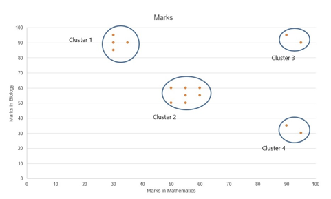  
   

   
So the four clusters that are being formed are as follows:  
   
Cluster 1: Students who have scored high marks in Bio, but poor marks in Maths
Cluster 2: Students who have scored average  marks in Bio and  Maths
Cluster 3: Students who have scored high marks in both Bio and Maths
Cluster 4: Students who have scored high marks in Maths, but poor marks in Bio  
   
Now the above representation is fine and correct, but it is missing one crucial information - **the numerical order**. For example, when you want to compare two clusters say Cluster 1 and Cluster 2 can you say by how much marks on average do the students from Cluster 1 outperform or underperform the Cluster 2 students in a particular subject just by taking a look at the above visualisation alone? Is it by 10 marks? Or 15?  
   
This is where the concept of **Centroids** come in handy. Listen to the following lecture to understand its importance and how it is calculated.  
  
  
  
  
  
Therefore, as mentioned in the video, the Centroids are essentially** the cluster centres** of a group of observations that help us in **summarising the cluster's properties**. Thus as you saw in the video, the centroid value in the case of clustering is essentially the mean of all the observations that belong to a particular cluster. For example, in the dataset that you saw here,  
   
  
   
   
The centroid is calculated by computing the mean of each and every column/dimension that you have and then ordering them in the same way as above.  
Therefore, Height-mean = ((175+165+183+172))/4  = 173.75
                    Weight-mean = ((83+74+98+80))/4 = 83.75
                    Age - mean = ((22+25+24+24))/4 =23.75  
Thus the centroid of the above group of observations is (173.75, 83.75 and 23.75)  
  
  
   
**Centroid**  
   
The K-Means algorithm uses the concept of the centroid to create K clusters. Before you move ahead, it will be useful to recall the ++[concept of the centroid](https://en.wikipedia.org/wiki/Centroid)++. called mean in MIT  
   
In simple terms, a centroid of n points on an x-y plane is another point having its own x and y coordinates and is often referred to as the geometric centre of the n points.  
   
For example, consider three points having coordinates (x1, y1), (x2, y2) and (x3, y3). The centroid of these three points is the average of the x and y coordinates of the three points, i.e.  
(x1 + x2 + x3 / 3, y1 + y2 + y3 / 3).  
   
Similarly, if you have n points, the formula (coordinates) of the centroid will be:  
(x1+x2…..+xn / n, y1+y2…..+yn / n).   
 basically mean  
So let’s see how the K-Means algorithm achieves this goal.  
  
  
  
  
  
Each time the clusters are made, the centroid is updated. The updated centroid is the centre of all the points which fall in the cluster associated with the centroid. This process continues till the centroid no longer changes, i.e. the solution converges.  
** **  
**Thus, you can see that the K-means algorithm is a clustering algorithm that takes N data points and groups them into K clusters. In this example, we had N =10 points and we used the K-means algorithm to group these 10 points into K = 2 clusters.**  
** **  
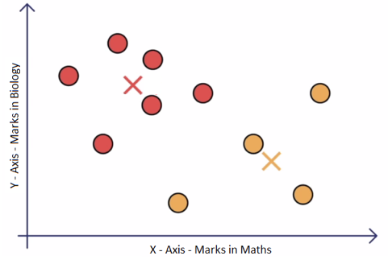  
Download the Excel file below. It is designed to give you hands-on practice of k-means clustering algorithm. The file contains a set of 10 points (with x and y coordinates in column A and B respectively) and two initial centres 1 and 2 (in columns F and G). Answer the questions below based on the Excel file.  
  
  
  
  
So the cost function for the K-Means algorithm is given as:   
**J=∑(k1=K)∑(i=n)(X¡-µ_k)^2  **  
  
  
  
  
Now in the next video, we will learn what exactly happens in the assignment step? and we will also look at how to assign each data point to a cluster using the K-Means algorithm assignment step.  
  
  
  
In the optimisation step, the algorithm calculates the average of all the points in a cluster and moves the centroid to that average location.  
The equation for optimisation is as follows:  
µ=1/(K(∑X¡))   
i.e average of sum of Xi's  belonging to cluster i  
The process of assignment and optimisation is repeated until there is no change in the clusters or possibly until the algorithm converges.  
In the next segment, we will learn how to optimise the K-Means algorithm even further using the K-Means ++ algorithm  
**Additional Reading**  
* You can also look K-Means algorithm as a coordinate descent problem and how to achieve global minima in the K-Means cost function. Please take a look at this ++[optional segment](https://learn.upgrad.com/course/1633/segment/12967/80802/241409/1266225)++ to learn further  
  
  
To choose the cluster centres smartly, we will learn about K-Mean++ algorithm. K-means++ is just an initialisation procedure for K-means. In K-means++ you pick the initial centroids using an algorithm that tries to initialise centroids that are far apart from each other.  
Let's understand the algorithm in detail in the next lecture.  
  
  
  
To summarise, In K-Means++ algorithm,  
1.  We choose one data point as the cluster centre at random.  
2. For each data point X¡We compute the distance between X¡ and the nearest centre that had already been chosen.  
3. Now, we choose the next cluster centre using the weighted probability distribution where a point X is chosen with probability proportional to d(X)^2  
4. Repeat Steps 2 and 3 until K clusters have been chosen  
* 
Let’s see the K-Means algorithm in action using a visualisation tool. This tool can be found on ++[naftaliharris.com](http://www.naftaliharris.com/blog/visualizing-k-means-clustering/)++. You can go to this link after watching the video below and play around with the different options available to get an intuitive feel of the K-Means algorithm.
  
Upon trying the different options, you may have noticed that the final clusters that you obtain vary depending on many factors, such as choice of the initial cluster centres and the value of K, i.e. the number of clusters that you want. You will understand these factors and other practical considerations while using the K-means algorithm in more detail in the next segment.  
   
  
**Silhouette Metric:**  
  
a(i)-> Average Distance of a point inter cluster(**Cohesion**)  
b(i)->  Average Distance of a point from nearby cluster(**Dis-simarity**)-(Seperation)  
  
S¡=(b¡-a¡)/max({b¡,a¡}})  
  
Average Distance = mean(S¡)  
  
  
Yes, **Principal Component Analysis (PCA)** is fundamentally a dimensionality reduction technique designed to exploit the correlation (relationship) between features to compress data.  
When multiple features in a dataset are highly related, they contain redundant information. PCA reorganizes this space by projecting the data onto a lower-dimensional coordinate system that preserves the maximum possible variance.  
  
**1. The Geometric Intuition: Redundancy vs. Nuance**  
When features are highly correlated, plotting them reveals a clear directional trend.  
* **The Dominant Signal (PC1)**: PCA identifies the axis of maximum variation in the data. For example, if you have two highly correlated features \(r_1\) and \(r_2\), the primary diagonal direction captures almost all of their shared information. This direction is the first **Principal Component (PC1)**, which serves as a highly useful, compact representation.  
* **The Discarded Nuance (PC2)**: The direction orthogonal to PC1 represents the remaining variance. In highly correlated datasets, this direction contains very little signal and is treated as negligible "nuance" or noise. PCA discards these lower-variance components, reducing the dimensionality of the representation space while retaining the core structure.  
  
**2. PCA as a Linear Autoencoder**  
From a representation learning perspective, PCA is mathematically equivalent to a **linear autoencoder with an orthogonal constraint**.  
We can map the mechanics of PCA directly onto the encoder-decoder framework:  
1. **The Encoder (\(W\))**: Projects the raw \(d\)-dimensional input vector \(x\) onto a lower \(k\)-dimensional latent space of the largest principal components: \[z = Wx\] where \(W\) is a \(k \times d\) matrix.  
2. **The Decoder (\(W^\top\))**: Projects the compressed code \(z\) back into the original \(d\)-dimensional space to reconstruct the input: \[\hat{x} = W^\top z = W^\top W x\] where \(W^\top\) acts as the decoder.  
3. **The Orthogonal Constraint**: PCA constrains the projection matrix to be orthonormal: \[WW^\top = I_{k \times k}\] This ensures that the coordinates in the reduced latent space are completely uncorrelated (orthogonal).  
  
**3. Equivalence of Objectives**  
Under these linear and orthogonal constraints, PCA minimizes the **squared \(L_2\) reconstruction loss** between the input \(x\) and its reconstruction \(\hat{x}\): \[\min_W \mathbb{E} |x - W^\top W x|_2^2 \quad \text{s.t.} \quad WW^\top = I\]  
By expanding this quadratic objective, minimizing the reconstruction error is mathematically identical to **maximizing the variance captured** in the projected subspace.  
Because of this, if you train a vanilla linear autoencoder (like the LinearAutoEncoder we designed earlier) *without* an explicit orthogonal constraint, the weight matrix \(W\) will not necessarily be orthogonal, but the learned latent bottleneck \(z\) will still **span the exact same \(k\)-dimensional subspace** as scikit-learn's PCA.  
  
📐 We can write a quick PyTorch and scikit-learn script to compress a dataset, train your LinearAutoEncoder, and plot the learned bottleneck side-by-side with classical PCA to visually prove that they span the exact same subspace. Would you like to do that?  
  
  
**Practical Considerations**  
   
Let’s understand some of the factors that can impact the final clusters that you obtain from the K-means algorithm. This would also give you an idea about the issues that you must keep in mind before you start to make clusters to solve your business problem.  
  
  
  
  
  
Thus, the major practical considerations involved in K-Means clustering are:  
* The number of clusters that you want to divide your data points into, i.e. the value of K has to be pre-determined.  
* The choice of the initial cluster centres can have an impact on the final cluster formation.  
* The clustering process is very sensitive to the presence of outliers in the data.  
* Since the distance metric used in the clustering process is the Euclidean distance, you need to bring all your attributes on the same scale. This can be achieved through standardisation.  
* The K-Means algorithm does not work with categorical data.  
* The process may not converge in the given number of iterations. You should always check for convergence.  
You will understand some of these issues in detail and also see the ways to deal with them when you implement the K-means algorithm in Python.  
   
Now let's look in detail how to choose K for K-Means algorithm.  
  
  
  
**Additional reading**  
You can read more about K-Mode clustering ++[here](https://shapeofdata.wordpress.com/2014/03/04/k-modes/)++, We will be covering it in detail in the next section.  
  
Before we apply any clustering algorithm to the given data, it's important to check whether the given data has some meaningful clusters or not? which in general means the given data is not random. The process to evaluate the data to check if the data is feasible for clustering or not is known as the clustering tendency.  
   
As we have already discussed in the previous lecture that the clustering algorithm will return K clusters even if that data does not have any clusters or have any meaningful clusters. So before proceeding for clustering, we should not blindly apply the clustering method and we should check the clustering tendency.  
   
Let's look in detail at how it works.  
  
  
  
  
  
To check cluster tendency, we use Hopkins test. Hopkins test examines whether data points differ significantly from uniformly distributed data in the multidimensional space.  
   
**Additional Resources**  
To read about Hopkins test in detail, please follow this ++[link1](http://www.sthda.com/english/articles/29-cluster-validation-essentials/95-assessing-clustering-tendency-essentials/#methods-for-assessing-clustering-tendency)++, ++[link2](https://stats.stackexchange.com/questions/332651/validating-cluster-tendency-using-hopkins-statistic)++, remember that the document is described using R programming, please ignore it.  
  
**Summary**  
  
We covered a lot in this session. We started with understanding the K-Means intuitively by grouping the 10 random points in 2 clusters.  
  
   
The algorithm begins with choosing K random cluster centres.  
   
Then the 2 steps of **Assignment and Optimisation** continue iteratively till the clusters stop updating. This gives you the most optimal clusters — the clusters with minimum intra-cluster distance and maximum inter-cluster distance.  
   
You also saw the different practical issues that need to be considered while employing clustering to your data set. You need to choose **how many clusters **you want to group your data points into. Secondly, the K-means algorithm is **non-deterministic**. This means that the final outcome of clustering can be different each time the algorithm is run even on the same data set. This is because, as you saw, the final cluster that you get can vary by the choice of the initial cluster centres.  
   
You also saw that the **outliers** have an impact on the clusters and thus outlier-infested data may not give you the most optimal clusters. Similarly, since the most common measure of the distance is the Euclidean distance, you would need to bring all the attributes into the same scale using **standardisation**.  
   
You also saw that you cannot use categorical data for the K-Means algorithm. There are other customised algorithms for such categorical data.  
  
  
#Analytics-Vidya   
## K modes Clustering  
  
  
I recently read an interesting ++[Wired story](http://www.wired.com/wiredscience/2014/01/how-to-hack-okcupid/)++ about Chris McKinlay (a fellow alum of Middlebury College), who used a clustering algorithm to understand the pool of users on the dating site OkCupid (and successfully used this information to improve his own profile.) The data involved was answers to multiple-choice questions, which is very similar to the ++[categorical data](https://shapeofdata.wordpress.com/2013/10/09/cast-study-2-tokens-in-census-data/)++ that I discussed a few posts back. But, instead of translating the data into vectors, like I discussed in that post, McKinlay used an algorithm called K-modes that works directly on this type of data. So, I thought this would be a good excuse to write a post about K-modes and how it compares to translating the data into vectors and then running ++[K-means](https://shapeofdata.wordpress.com/2013/07/30/k-means/)++.  
First, I want to review how we could turn answers to multiple-choice questions into vector data, and what the K-means algorithm would do to it. To make things simple, lets say that we have a multiple-choice questionnaire with ten questions, each with four possible choices. A number of people fill out the questionnaire and we record their responses.  
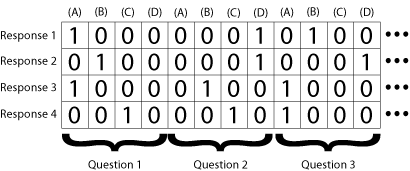  
As I described in the post on token data, we can convert each of the filled-out questionnaires into a data point in a 40-dimensional space as follows: The first four dimensions/features will record the response to the first question. If they answered (A) to the first question, the first four values would be *(1,0,0,0)*. If they answered (B), it would be *(0,1,0,0)* and so on. Similarly, the next four features would record the response to the second question in the same way, and so on, as in the Figure to the right. So each questionnaire would give us a 40-dimensional vector with ten 1s and the remaining places all 0s.  
  
  
Recall that K-means works by selecting a small number of special points called *centroids*, which are in the data space but not necessarily data points, and working out which of the centroids each data points is closest to. Then, it replaces each centroid with the new centroid/center of mass of the data points that were associated to it.  
To understand how this works for the type of data that we get from a questionnaire, lets start by looking at the step where we find the new centroids. Given a collection of data points, we find their center of mass by adding them all together and then dividing by the number of data points. (This is basically an average, but we use the fancy term centroid because an average usually refers to a single number rather than a vector.) When we add the vectors together, we’re just adding up all the 1s in a particular dimension/feature. So in the resulting vector, the value in the first spot will be equal to the number of questionnaires that answered (A) to the first question. The value in the second spot will be the number that answered (B) to the first question, etc. The value in the fifth spot will be the number who answered (A) to the second question and so on.  
Next, we divide by the number of data points, which means we divide each entry of the vector by this number. The first spot in the resulting vector is the number of questionnaires that answered (A) to the first question, divided by the total number of questionnaires. This number will be between zero and one, and you can think of it as the percentage of questionnaires that answered (A) to the first question. (Technically, to get the percentage, you have to multiply the number by 100.) The number in the second spot is the percentage who answered (B), and so on. Think of this like a bar graph showing the responses to each question, where the value in each spot is the height of the bar.  
The step where we decide which centroid is closest to each data point is a little trickier. To find the standard Euclidean distance between a data point and a centroid, we subtract the number in each spot of the data vector from each spot of the centroid vector (and take the absolute value so that the resulting number is always positive.) Then we square each of these numbers, add them all up, then take the square root of the final number. (There are other possible types of distance to calculate, but that’s a digression for another time.)  
  
That’s getting a bit more technical than I usually like, so let me just point out three key things to understand about this calculation: First, if a lot of the data points that were used to make the centroid agree with the new data point on a given question, this will make the distance lower (as we would hope.) Second, if a lot of the original data points agreed on a different answer than the new data point to a given question, then this will make the distance higher (again, as we would hope.) Third, if a lot of the original data points disagree with the new data point, but are fairly evenly spread among the other possible answers, then this will add a little bit to the distance, but not as much as if they all agreed on a single answer that disagreed with the new data point.  
What this process does is to pick out the questionnaire responses that are most similar to each centroid, and thus to each other. In other words, we would expect that the data points that are closest to any given centroid will have a lot of responses in common with each other, so that when we calculate the centroids the next time, there will be a stronger majority on each question.  
  
So, we run K-means by repeating this process over and over until the centroids stabilize/converge to places that define our new clusters. We can then read off the “typical” response to the first question in each cluster by looking at the values of the first four spots in each centroid, and choosing the one that’s the highest. We can read off the “typical” response to the second question by looking at the next four entries, and so on. If the data set has well defined clusters, and we pick our *K* correctly, we would expect the values defining these “typical” responses to be pretty close to 1 (i.e. 100%).  
The K-modes algorithm is based on a very similar idea, but as I mentioned above, it skips the intermediate step of transforming the questionnaire data into vectors. It consists of the same two steps, but they look slightly different. For the step in which we compute the centroids, we again start by adding up the number of questionnaires that responded with each possible answer to each of the questions. So far, this isn’t too different; it’s essentially the same as adding up the 40-dimensional vectors like we did with K-means.  
  
  
However, instead of dividing by the number of questionnaires like we did with K-means, the K-modes algorithm simply records which answer to each question got the most votes. This is the *mode* of the responses -the most common answer – which is where the name *K-modes* comes from. So each centroid is in the same form as the original questionnaire data – a set of responses to the different questions – rather than a 40-dimensional vector.  
The next step is again to calculate the “distance” from each data point to each centroid. For K-means, we were able to use the standard Euclidean distance, since we were working with vector data. For K-modes, we’re going to have to come up with a notion of distance from scratch, but this turns out not to be too hard. The most obvious notion of distance is as follows: For each data point and each centroid, we can define the distance to be the number questions they disagree on. As with the Euclidean distance we used in K-means, when they agree on a question, this will make the distance lower, and when they disagree on a question, it will make the distance higher.  
Note, however, that the third point about the Euclidean distance doesn’t hold here: The K-modes centroids don’t keep track of how close the margin was between the answer that that got the most responses and the second most. So, if the data point disagrees with the most popular response among the original data points, it gets the same penalty whether or not the original data points strongly agreed on this answer.  
This difference is a trade-off rather than a deficiency. The problem with the way K-means calculates distances is that it can lead to centroids where no one answer is much higher than the others. Essentially, K-means never makes a strong decision about which data points to abandon. Since K-modes forces the centroids to make this decision, it can lead to much better defined clusters. Of course, for data where there aren’t strong correlations to be found, having to make this decision (especially in the early rounds of K-means/K-modes) could make things worse.  
As usual, the question of which algorithm is better depends entirely on the data set and the goals of the project. Both algorithms rely heavily on picking the right value for *K*, and the Wired article does a nice job of describing how McKinlay did this through trial and error. (I may have to borrow the lava lamp analogy.) McKinlay’s analysis was complicated somewhat by the fact that each profile in the data set that he looked at answered a slightly different set of multiple choice questions. While there was a lot of overlap between the sets, each question would have had a lot of no-answer data. There are a number of ways one could deal with this, and I don’t know which one McKinlay used, but as always the best solution to a problem like this depends on the particular data set.  
  
  
  
  
## DBSCAN vs K Means  
  
**DBSCAN and K-Means are both popular clustering algorithms, but they differ significantly in how they group data points. K-Means is a centroid-based algorithm that partitions data into K clusters, while DBSCAN is a density-based algorithm that groups data based on point density and can identify clusters of arbitrary shapes, as well as outliers. **  
  
**Here's a more detailed comparison:**  
  
  
##   
  
  
##   
**K-Means:**  
* Centroid-based: It works by assigning data points to the nearest of K centroids (cluster centers). 
  
* Requires specifying K: You need to predefine the number of clusters (K). 
  
* Assumes spherical clusters: It works best when clusters are roughly spherical and of similar size. 
  
* Sensitive to initialization: The initial placement of centroids can affect the final clustering. 
  
* Fast and efficient: Relatively fast, especially for large datasets.   
**DBSCAN:**  
* Density-based: Groups data points based on density, identifying dense regions separated by sparser areas. 
  
* Doesn't require K: Automatically determines the number of clusters based on data density. 
  
* Can handle arbitrary shapes: Effective at finding clusters with irregular shapes. 
  
* Identifies outliers: Naturally identifies outliers as points not belonging to any dense region. 
  
* More robust to noise: Less affected by outliers compared to K-Means. 
  
* Can be slower: Computationally more intensive, especially with large datasets and high dimensionality.   
When to choose which algorithm:  
* K-Means: 
Use when you have a good idea of the number of clusters and they are relatively spherical and well-separated. 
  
* DBSCAN: 
Use when you don't know the number of clusters, the clusters have irregular shapes, and you need to identify outliers. 
  
  
## Hierarchical Clustering  
  
One of the major considerations in using the K-means algorithm is deciding the value of K beforehand. The hierarchical clustering algorithm does not have this restriction.  
  
   
The output of the hierarchical clustering algorithm is quite different from the K-mean algorithm as well. It results in an inverted tree-shaped structure, called the dendrogram. An example of a dendrogram is shown below.  
   
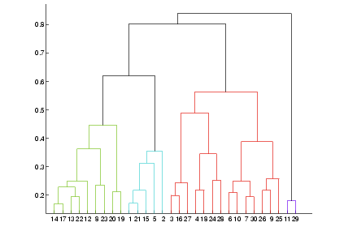  
   
Let's see how hierarchical clustering works.  
  
  
  
  
  
In the K-Means algorithm, you divided the data in the first step itself. In the subsequent steps, you refined our clusters to get the most optimal grouping. In hierarchical clustering, the data is not partitioned into a particular cluster in a single step. Instead, a series of partitions/merges take place, which may run from a single cluster containing all objects to n clusters that each contain a single object or vice-versa.  
   
  
This is very helpful since you don’t have to specify the number of clusters beforehand.  
   
  
Given a set of N items to be clustered, the steps in hierarchical clustering are:  
1. Calculate the NxN distance (similarity) matrix, which calculates the distance of each data point from the other  
2. Each item is first assigned to its own cluster, i.e. N clusters are formed  
3. The clusters which are closest to each other are merged to form a single cluster  
4. The same step of computing the distance and merging the closest clusters is repeated till all the points become part of a single cluster  
   
Thus, what you have at the end is the dendrogram, which shows you which data points group together in which cluster at what distance. You will learn more about interpreting the dendrogram in the next segment.  
   
Look at the image given below and answer the question that follows.  
   
  
Hierarchical clustering is a helpful technique in data analysis and machine learning that groups similar data points based on their closeness to each other. Unlike methods like K-means, it doesn’t require you to decide the number of groups beforehand. Instead, it builds a tree-like diagram called a dendrogram, which shows how the data points are joined together step by step. By cutting this tree at different levels, you can create clusters of different sizes depending on what you need.  
Types of Hierarchical Clustering  
Hierarchical clustering builds a tree-like hierarchy of clusters. There are two main types of hierarchical clustering:  
1. Agglomerative Clustering: This approach starts by considering each data point as a single cluster and then iteratively merges the closest pairs of clusters until only one cluster remains. It is also known as bottom-up clustering.  
2. Divisive Clustering: In contrast, divisive clustering begins with all data points in a single cluster and then splits the cluster recursively into smaller clusters until each data point is in its cluster. Divisive clustering is also called top-down clustering.  
Problem with K-means: Sensitivity to Initial Centroid Selection  
K-means clustering, while widely used and relatively efficient, is sensitive to the initial selection of cluster centroids. The algorithm converges to a local optimum and different initializations may lead to different final cluster assignments. This sensitivity to initialization can sometimes result in suboptimal clustering solutions or even convergence to a poor local optimum.  
How Hierarchical Clustering Addresses this Problem ?  
Hierarchical clustering, especially agglomerative hierarchical clustering, doesn’t have the problem of being sensitive to how it starts, unlike K-means. Instead of picking random starting points (like K-means does with centroids), hierarchical clustering starts with each data point on its own and then keeps joining the closest groups step by step. Because it merges clusters based on their actual distances, the process is more predictable and doesn’t change depending on where it begins.  
Also, since it looks at all the data points and merges clusters gradually, hierarchical clustering usually gives more consistent and reliable results than K-means. Plus, it builds a tree-like structure that lets you see groups at different levels, so you can explore the data in more detail.  
How Does Agglomerative Hierarchical Clustering Work?  
Agglomerative hierarchical clustering proceeds as follows:  
1. Initialization: Begin with each data point as a singleton cluster.  
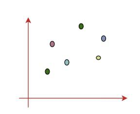  
  
2. Pairwise Distance Calculation: Compute the distance (similarity) between each pair of clusters. The choice of distance metric (e.g., Euclidean distance, Manhattan distance, etc.) depends on the nature of the data.  
  
  
  
  
3. Merge Closest Clusters: Merge the two closest clusters based on the chosen distance metric, creating a new, larger cluster.  
  
  
4. Update Distance Matrix: Recompute the pairwise distances between the new cluster and the remaining clusters.  
5. Repeat Steps 3-4: Continue merging the closest clusters and updating the distance matrix until only a single cluster remains.  
  
  
It is also known as the bottom-up approach or Hierarchical Agglomerative Clustering (HAC). A structure that is more informative than the unstructured set of clusters returned by flat clustering. This clustering algorithm does not require us to prespecify the number of clusters. Bottom-up algorithms treat each data point as a singleton cluster at the outset and then successively agglomerate pairs of clusters until all clusters have been merged into a single cluster that contains all data.  
  
  
Implementation in Python  
We are performing hierarchical clustering on the dataset and assigning cluster labels to the data points.  
* AgglomerativeClustering: The class from sklearn.cluster used for hierarchical clustering.  
* n_clusters=3: Specifies the number of clusters to form (in this case, 3 clusters).  
* fit_predict(df_k): Fits the hierarchical clustering model to the data (df_k) and assigns each data point to a cluster.  
* df_k['clusters_hierarchical']: Adds the cluster labels from the hierarchical clustering model as a new column (clusters_hierarchical) in the DataFrame.  
* df_k.head(20): Displays the first 20 rows of the updated DataFrame with the cluster labels.  
  
  
  
  
  
  
  
  
   
  
```python  
from sklearn.cluster import AgglomerativeClustering  
hierarchical = AgglomerativeClustering(n_clusters=3)  
y_predicted_hierarchical = hierarchical.fit_predict(df_k)  
df_k['clusters_hierarchical']= y_predicted_hierarchical  
df_k.head(20)  
```  
## Linkages  
  
  
* **Single Linkage: **Here, the distance between 2 clusters is defined as the shortest distance between points in the two clusters  
* **Complete Linkage: **Here, the distance between 2 clusters is defined as the maximum distance between any 2 points in the clusters  
* **Average Linkage: **Here, the distance between 2 clusters is defined as the average distance between every point of one cluster to every other point of the other cluster.  
   
You have to decide what type of linkage should be used by looking at the data. One convenient way to decide is to look at how the dendrogram looks. Usually, a single linkage-type will produce dendrograms which are not structured properly , whereas complete or average linkage will produce clusters which have a proper tree-like structure. You will see later what this means when you run the hierarchical clustering algorithm in Python.  
  
   
**Additional reading**  
You can read more about the type of linkages ++[here](http://www.saedsayad.com/clustering_hierarchical.htm)++,++[ here](https://stats.stackexchange.com/questions/195446/choosing-the-right-linkage-method-for-hierarchical-clustering)++ and ++[here](http://www.stat.cmu.edu/~ryantibs/datamining/lectures/05-clus2.pdf)++.  
   
##   
##   
# Representation Learning  
  
## Overview  
  
  
  
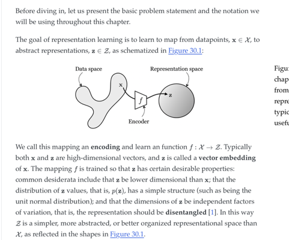  
  
**Mapping data to a representation..then reconstructing back **  
  
  
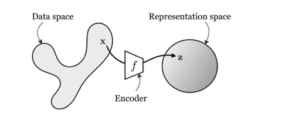  
  
[6.390 IntroML (Spring26) - Lecture 8 Representation Learning Slides 2]  
  
**PCA and k means(clustering) are very important models, everything else in representation learning is just a generalization of them**  
  
**Clustering-> Basically learns a latent space z.. or in 1 dimensional integers..**  
  
## Compression Methods  
  
  
## AutoEncoder   
  
  
**Overview**  
  
**Dimensionality->R^n->R^m->R-^n**  
**m<n.. in autoencoder architecture**  
**R**  
** PCA**  
  
**Autoencoder, Contrastive Learning-> Learn Representations by compression**  
  
**Autoencoders are deep learning versions of PCA**  
**Another method guess?  is deep learning version of k means **  
  
  
  
**Architecture tradeoff-> they are good at learning some representations bad at others like shape vs colors.. good representation of colors bad at shapes, why colors are just pixels.. shapes are not..**  
  
**L2 Autoencoders-> **  
  
**Neural Networks are representation learners.. Earlier layers generate representations.. later are finetuned for that task.. can be transferred(Transfer learning) by freezing those layers.. basically.. is_trainable=False.. syntax depends on framework used..**  
**basically this.. **  
  
**From Data to representations-> called Encoding or Encoder.. **  
**from representation to data-> Generative Modeling->  called decoding or Decoder**  
**methods.. many..**  
**Identity-> Autoencoder**  
**with loss-> Variational Autoencoder..**  
**Now practice..**  
  
  
When embeddings are generated by a neural network, they are clustered into groups which is a generalization of linear clustering..  
  
Latent embedding Space   
  
  
  
  
Yeah, equivalent of PCA. OK, right. So you're on to this. What is PCA doing? PCA can be understood as trying to  
maximize the variance I'm capturing in the signal via some linear orthogonal transformation of the vector.  
And if I'm maximizing the variance, I'm able to best reconstruct. And that actually is exactly equivalent to the L2  
reconstruction objective. So PCA can be understood as doing essentially the same thing.  
So if they're both linear, we'll just replace it with the encoders of matrix W. The decoder is a matrix Wg, and the  
encoders matrix Wf. And we're trying to say, if I pass encode, decode, I will obtain my original data matrix again.  
That's the objective of an autoencoder written with linear f and g.  
And PCA is a variant of this, where we assume that the encoder and decoder are the same matrix W. And they  
have this property that it's an orthogonal matrix, so that's the constraint. It's a slightly different setting, but it's  
almost the same.  
And so this is the objective that PCA tries to minimize. It tries to find W such that this transformation will result in  
decoding back to the original data. So you can work through the math.  
If you're more familiar with PCA maximize the variance in the projected space, then you can work out that this  
thing under this condition is equivalent to minimize the variance in x minus the variance in the transformed  
version of x. And then we can maximize and change the sign to be plus instead of minus. And then we can  
remove this term because this term doesn't depend on W, and we're maximizing over w.  
And then this is just maximize the variance captured in the reconstructions. And that might be more familiar PCA  
that you're used to. And what can be proven is that the embeddings learned by a linear autoencoder span the  
same subspace as embeddings learned by PCA. So this is the rough the rough argument there.  
So vanilla, most intro statistical model that you can think of, the most standard one that's been around for  
hundreds of years, I believe, or quite a long time, PCA. Well, an autoencoder, the very best representation  
learning method in the family of reconstruction based representation learning is just nonlinear PCA. That's a  
generalization of PCA to nonlinear representations.  
  
  
[PDF 5]  
  
Representation Space:   
  
is thought be Gaussian N(0,1)  
  
distance between two clusters-> Maths is for gaussian it is L2 Norm.. Derivation see your notes or ask chatgpt..  
[mit6_7960_f24_lec11 (dragged).pdf](Attachments/70A256DD-9FD6-44B0-B398-B57CF763610D.pdf)  
 min(Expected value of (x¡-x¡)^2))   
  
[PDF 6]  
L2 Norm-> euclidean norm  
  
I cannot learn formulae but proofs are easier to conceptualize 10 years later..  
  
[PDF 4]  
  
learning by compression  
  
## Clustering K means or Vector Quantized   
  
  
  
  
[PDF 2]  
  
So let's look at clustering now. So clustering is the problem of taking data and assigning each data point to a  
cluster. So a representation-learning lens on clustering is you're learning an encoder that doesn't output a  
vector. It outputs an integer. So for every data point, I output an integer, which is the cluster assignment. It still  
is an encoder. It's still representation learning.  
So at inference time, if I just apply my learned encoder that outputs integers to some data points, it will tell me,  
this is the third class. And I'll color that red. And that has identified clusters So clustering is learning an encoder  
to integers.  
  
  
  
[PDF 3]  
So why is clustering a good representation? So from the representation-learning angle, **clustering is learning a**  
**function f that outputs an integer, will represent the integers of one-hot code, in this example here**.  
## I will map every image like this to this cluster, and I can just label it arbitrarily with a  
## word.  
  
  
  
 So we can think of it as a vector embedding, but it's just a one-hot vector embedding that's isomorphic with the integers, for a finite set of integers.  
So. what's the best representation that-- this is another subjective statement. What's the best representation  
that humans have come up with so far? What do you think? What's the best representation that the human brain  
has discovered? Yeah?  
  
  
  
  
**And clustering is the problem of making up new words for things**. That's one way of understanding it, right? A  
word is like a symbol that at least-- there might be some linguists that would quibble about this, but one rough  
definition of word is it's just like it is a symbol that denotes a set, and that's what clustering is doing.  
  
  
  
  
** Language has more structure beyond the words, but this is but words are an important part of it. So clustering is the representation learning problem of finding new words for concepts.**  
[PDF]  
##   
  
  
 Representation earning is generalizing these concepts concepts of PCA and k means  
  
  
So what does k-means do? k-means finds k different clusters in your data. And each cluster is represented with  
what's called the mean or centroid, which is just going to be the average of all the data points in that cluster. So it maps data  
points to integers. And it does that in such a way that each data point is as close as possible to the mean of the data points in the cluster it is assigned to. So here's the representation learning view of k-means. I'm going to train an encoder that will output one-hot  
codes. And then my decoder will just be-- think of it like a lookup table. It takes in a one-hot code, and it outputs  
a vector. And it's trying to output the vector that will reconstruct the input as best as possible.  
If I only can output a single vector for every item in a cluster, every item in the cluster goes to the same one-hot  
code. So now I can decode that into just a single vector. Think of g as a matrix W applied to a one-hot code. It  
selects a row of that matrix.  
What is going to be the decoder that minimizes the Euclidean distance reconstruction error, the L2 reconstruction  
error? What is the name for the vector that minimizes the distance to all points in a set, the L2 distance? Yeah?  
he mean, OK. I think a lot of that, maybe some of you don't. But, yes, the vector that minimizes the L2 distance  
to a set of other points is the mean of those other points.  
  
  
  
  
  
  
  
  
  
 You can show that.  
So that means that k-means is an L2 autoencoder. The only difference from the other autoencoder that I showed  
you is that the hypothesis space doesn't have a low-dimensional bottleneck. It has an integer bottleneck, OK?  
So that's just a mapping of k-means onto autoencoders. They're the same model with a different hypothesis  
space. k-means, this hypothesis space is not differentiable. It has some properties that can be exploited, some  
structure that can be exploited.  
So we optimize it with a different algorithm than SGD. And that's where you might have encountered the  
**expectation maximization me**thod for doing k-means and so forth. And, yeah, that's just because this problem  
has some special structure.  
And then the deep learning version of k-means is called a **vector quantized autoencoder.** So a vector quantized  
autoencoder is exactly the same as k-means, except that f is non-linear instead of linear. And there's a whole  
bunch of variations on VQ models. There's VQGAN, VQVAE, et cetera, et cetera. These have bells and whistles,  
but this is the gist of it.  
I'm trying to learn an encoding into a set of integers and a decoding that minimizes reconstruction error. And f  
will be a deep network, or little f in little g are both going to be deep neural networks. So you can read up on  
exactly how that method works, but it's just k-means with deep nets. Yeah?  
  
#diary First learn concepts.. but remember terms.. to be able to answer interview questions.. like today's interview.. human in the loop.. in llamaindex.. Import all your notes..  
  
# Representing by Prediction  
  
Label Prediction..   
Given half features construct rest  
  
## Same Self Supervised Learning  
  
  
So now rather than learning representations by compressing data, we're going to try to learn representations by  
predicting held-out data. And this is actually the kind I started this lecture with. I said that we could just pre-train  
a network on music classification. That's a prediction problem, and it induces an OK representation for music  
classification.  
But we're instead going to do something else, which is we'll say, we didn't want labels. We don't want to be we  
don't want a representation that is tied to a specific task. So we don't want to have to have humans label some  
narrow task. We do something much more generic that doesn't require annotations or task specificity.  
And one way to do that is we say, we're not going to predict labels. We're going to predict the raw data itself. And  
this is called self-supervised learning.  So it's called self-supervised learning because it's using the machinery of supervised learning, meaning predict y from x, except that we define y as being some part of the raw data as  
opposed to some label. So this is like an autoencoder, except I'm predicting half of the data from the other half of the data. And  
interestingly, this works really well. This tends to work a lot better than autoencoders.  
  
**Example**  
  
So here's an example of this setup. This is the colorization problem I showed you before. Try to predict the colors  
from a black and white image?  
And this is a self-supervised method that tries to predict part of the raw data, the color channels, from another  
part of the raw data, the black and white channel. So we can now take that model that's just trained to do this  
self-supervised prediction of the missing colors.  
  
Now it's free labels because color images have the colors built in. I just took the color image. I split it into the  
luminance channel and the color channels. So it's cheap. It's easy to run this on just raw, unlabeled data.  
Now I can investigate, did this system actually learn a meaningful representation? So we'll do the deep net  
electrophysiology. I'll poke my probe in there and ask, what are the neurons sensitive to?  
  
So here, I guess I'll ask the class. What do you think? Remember when I talked about the Zeiler and Fergus  
model, I said that they were like face selective neurons, and dog face selective neurons, and other things. What  
do you think the neurons will be sensitive to for predicting colors?  
And let's look at layer five of a network, so deep inside the network. What do you all think? Yeah, over here?  
  
  
Yeah, different classes of objects have different colors. If I know something's strawberry, I can say it's probably  
red. So knowing the object category tells me a lot about the color. Anything else? So, yes, it turns out objects is  
one of the answers.  
  
So here are our three different neurons. And this is looking at the feature maps. And we're just shading-- we're  
blacking out all the parts of the feature maps where the activations are below a threshold. So this is like, where  
are the neurons firing at some convolutional layer 5 of this network?  
  
And, yeah, on lower layers, it is textures and other things like this. But the interesting thing is that it doesn't  
really matter how you train these networks. If you train them to predict classes, if you train them to predict  
colors, if you train them to inpaint missing pixels, just pick the right half of the image from the left half, the units  
that carve the world at its joints, that are predictive of everything, turn out to be objects and semantics and the  
words that humans have.  
  
So it's like words are not arbitrary. We have the words we have because they're very predictive statistically of  
missing data. So this is discovery of semantic words without any semantic labels.  
  
And this has been the big finding over the last decade that led to this revolution in how we do deep learning,  
which was the move from supervised learning to self-supervised learning. So the self-supervised learning is-- we used to try to do what's called unsupervised learning, which is just learn from raw, unlabeled data. But then we  
switch it into the mathematical machinery of supervised learning by just predicting some fake labels, which are  
just raw data, which you call pretext labels or pretext tasks from the data itself.  
  
And there's so many different ways of doing this learning by prediction. So you could just predict class labels.  
That would be called supervised learning of representations. You could predict the next frame in a video, the  
future. You could predict the next pixel in a sequence and the same thing for any other data modality, too.  
So the two on the right are self-supervised because no human had to provide the label target. It's the next frame in the video, the raw data. It's the next pixel in a sequence.  
  
  
[6.390 IntroML (Spring26) - Lecture 8 Representation Learning Slides]  
  
  
And as you probably know,   
[6.390 IntroML (Spring26) - Lecture 8 Representation Learning Slides 3]  
the way that language models work is they predict the next word in a sequence, so  
they're mostly in the family of this type of learning. And most people still call language models self-supervised  
because they're just predicting the raw data. It happens the raw data is semantic and is words, but in that  
context, it's not like they're predicting the sentiment. They're just predicting the next word.  
So all of these self-supervised tasks can be understood as something we call imputation, which just means take  
  
your data-- it could be a matrix, a tensor, some data object. A video would be like time by x by y. A sentence  
would be time by the content at that time, the word at that time.  
And mask part of it, and put that into an encoder. Decode it to predict the masked part of that input. So masked  
prediction or imputation is the standard pretext tasks that people like to use these days to learn representations.  
So spatial imputation, just predict the next pixel from the previous pixel. Temporal imputation-- predict the next  
frame from the previous frame. Channel imputation-- predict the colors from the black and white and, again, on  
other modalities, you can do the same.  
  
**Prediction by masking**  
  
Yeah, you can do this in a way that frames it just like an autoencoder, again, but it will be called now a masked  
autoencoder. So masked autoencoder is you take your data, you mask random chunks of it. And the little  
interesting trick is that in masked autoencoder is applied to images.  
You're using a vision transformer. And the vision transformer already tokenized the image into the first--  
remember, we talked about vision transform. We said that we are going to create a set of tokens by chopping the  
image into patches and then mapping those patches to vector embeddings or tokens that then get processed.  
And so they just said, well, what if I just remove some of the tokens, and then I predict the missing tokens?  
And the really interesting thing about the attention architecture is that I can mask different ratios. I can only  
keep four of these tokens, but then the attention mechanism will scale in a way that is proportional to the  
number of tokens. Each token will attend to each other token.  
So if I have four, it will be four attending to four. And it will output predictions for four. If I have eight, it will be  
eight attending to eight. So it has this nice kind of architectural invariance to the number of tokens you put in.  
And then I decode. I just have some blank tokens I put into another transformer. And then I have trained it so  
that those blank tokens get filled in with the prediction of the pixels in the missing tokens, or the prediction of the  
data in the missing tokens.  
  
**Vision**  
  
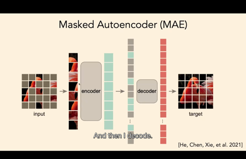  
**Text**  
  
  
And masked autoencoders are just a new name for another model which was very popular called BERT. So there are differences.  
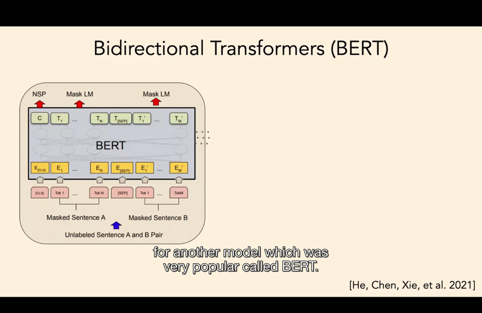  
  
 Engineering this to work on language versus vision is a very important difference but,  
conceptually, they're almost the same thing.   
Mask LM  
Uses Byte Pair Tokens  
  
Bidirectional Transformers  
  
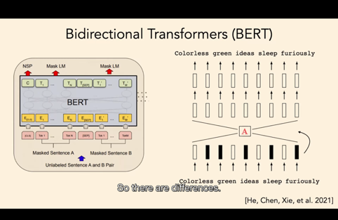  
So BERT was a language model that was very popular some years ago. It's gone a bit out of fashion, but BERT is  
roughly the same thing on text. So I just take my text. I tokenize it. I mask some of the tokens. I run it through a  
transformer, and I predict all the tokens. So I'm now doing masked prediction with language. some tokens in between.. maskingWe introduce a new language representation model called BERT, which stands for **Bidirectional Encoder Representations from Transformers. **Unlike recent language representation models (Peters et al., 2018a; Radford et al., 2018), BERT is designed to pre-train deep bidirectional representations from unlabeled text by jointly conditioning on both left and right context in all layers. As a result, the pre-trained BERT model can be fine-tuned with just one additional output layer to create state-of-the-art models for a wide range of tasks, such as question answering and language inference, without substantial task-specific architecture modifications. BERT is conceptually simple and empirically powerful. It obtains new state-of-the-art results on eleven natural language processing tasks, including pushing the GLUE score to 80.5% (7.7% point absolute improvement), MultiNLI accuracy to 86.7% (4.6% absolute improvement), SQuAD v1.1 question answering Test F1 to 93.2 (1.5 point absolute improvement), and SQuAD v2.0 Test F1 to 83.1 (5.1 point absolute improvement).  
  
**Popular Works best Guess and reason why**  
  
I only thought difference between masking in between words vs masking final word.. Real question is masking vs autoencoder..  
  
And the autoregressive models that try to predict the next word in a sentence are just the same, except they're  
only masking the final word as opposed to interleaving words. And th  
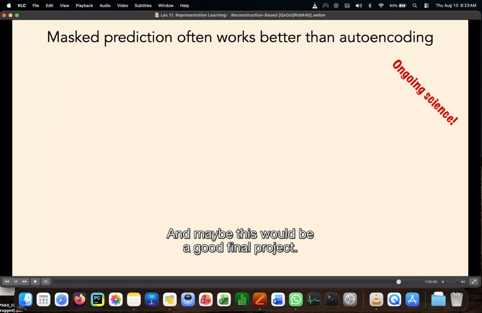  
  
at has some advantages in that I can  
decode in sequential order as opposed to in out-of-time order. So, yeah, question? final token  
Works by Conditional likelihood..   
  
  
  
AUDIENCE:   
  
Why is BERT getting out of fashion?  
  
Why is BERT getting out of fashion? So I think it's because masking the final token, naturally, can be used for  
generating sentences autoregressively, which we talked about before. If I mask the interleaving, then it's like I'm  
generating words out of temporal order.  
  
  
So if I'm talking with a human, time is an axis that is important and not symmetric with other axes. I have to  
answer the question after the question has been asked by the person I'm talking to. And so having these causal  
attention mechanisms for the masking is in causal order. I'm only masking the future in conditioning on the past.  
It just fits into language models, which operate in causal order.  
  
And once that became popular, the biggest models were all masking only the tokens in the future, given the  
tokens in the past  
  
  
  
And because those were the biggest models, they just worked the best. But if I want to learn a  
sentence embedding, I bet the BERT method is still going to work better if scaled the same amount.  
  
  
  
  
  
OK, so here's an interesting empirical finding. This is going back to that colorization paper, but it's been shown in  
a lot of work, which is that masked prediction just tends to always work better than autoencoding.  
So if I I'm going to look at the accuracy, I'm going to look at the representations at each layer of an autoencoder  
versus a masked prediction network, for colorization in this case. And I'm going to assess performance seeing  
how well I can linearly classify given the representation on that layer.  
Imagenet categories, in this case, is like a probe, just like we were doing with the shapes, where we had the  
nearest neighbor probe. Now we have a linear classifier probe. So here's what happens.  
As I go deeper in the network, you get this separation, where autoencoding learns an OK representation, but  
masked prediction learns a representation which is more semantic. It linearly decodes ImageNet categories  
better. And this is something that I thought I had a good explanation for, and then I realized I don't.  
  
## Final Project why masked prediction works better than autoencoding  
  
  
  
  
  
So I'm going to call it ongoing science and leave it as a puzzle for the class. And maybe this would be a good final  
project. Why does masked prediction work better than autoencoding? So here are three hypotheses to think  
about.  
  
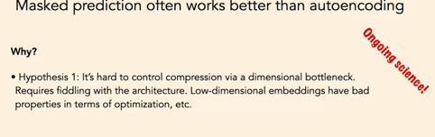  
So one is that autoencoding controls compression via dimensional bottleneck. Masked prediction controls  
compression by the non-overlap between the outputs you're predicting and the inputs you're conditioning on.   
  
  
So  
the only thing that's useful for predicting the outputs is the mutual information between the inputs and the  
outputs. And if these are separate, then I will just forget all the stuff that's specific to the inputs that's not  
relevant for the output. So that's how it does compression.  
So it could be that just controlling compression via dimensional bottlenecks is really hard to make work. It's very  
finicky. It requires an architecture that has constraints on the dimensionality of the embeddings.  
  
  
  
And we know that low-dimensional things, anything with low dimension and deep learning just is hard. It interacts with optimization in weird ways and interacts with BatchNorm and LayerNorm in weird ways. So low-dimensional embeddings have some bad properties, and maybe it's just really hard to use dimensionality of the embeddings as the way to learn a good representation.  
  
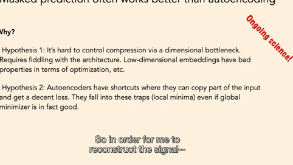  
Hypothesis two is autoencoders are learning shortcuts. So in order for me to reconstruct the signal-- imagine this.  
What if I had an autoencoder with skip connections, with residual connections?  
Would that be a good idea?  
  
 What would be wrong with that, autoencoder f, g, but they just have some residual  
connections in between f and g?  
  
F=f((g(x))-> Identity..=I  
If residual-> (f+f(f(g(x)-> embedding..-> skip connection +g(x))..? it will skip the embedding  
  
  
  
AUDIENCE: Not forcing this low-dimensional representation.  
PHILLIP ISOLA: Yeah. It skips the bottleneck. So there's all these little gotchas like that. And it could be that autoencoders just  
have this tendency to copy the local information that they're processing. And that will be a decent solution, even  
though it would be better for them to capture global properties in order to reconstruct the entire signal.  
And then maybe math prediction is closer to the prediction problems we actually care about.  
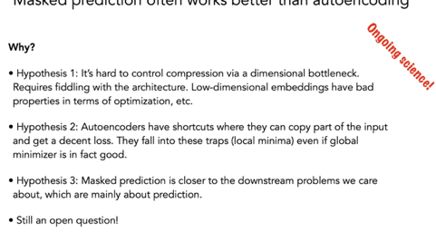  
  
 So somehow it's closer to the actual use case. We're going to try to predict the future from the past or something like this.  
So I don't know. I asked Kaiming, who's a professor here who was the first author of "The Masked Autoencoder" paper. And he said, well, at the end of the day, it's just empiricism. So masked prediction works better than  
autoencoding. And I think it's a really interesting question, theoretically why that should be the case. Yeah?  
AUDIENCE: [INAUDIBLE] beginning of the lecture, you said that in the scope of representation learning, you think this  
framework of [INAUDIBLE] is simplest and will win out. I was wondering if you could talk about why you think that  
is?  
  
  
  
 Yeah, so ultimately, it just goes back to some first principle argument that I can't really prove. But there are  
arguments along the lines of Occam's razor(Occam's razor is the problem-solving principle that recommends searching for explanations constructed with the smallest possible set of elements. It is also known as the principle of parsimony or the law of parsimony.) and formalisms of that the compression is somehow equivalent to prediction. And the most compressed representation will make the most accurate predictions about the future.  
And autoencoders are just a simple embodiment of the idea of take your data, compress it as much as possible,  
and remove all redundancies. And it just seems, from first principles, if compression is all you need, then  
autoencoders are all you need. I think there's more to say about that  
  
. I don't have time right now.  
So, yeah, still an open question. I'll end with I think this is a nice idea that Yann LeCun put out some years ago,  
which is that intelligence is like this cake.   
  
## Summary  
  
Masked Autoencoders (MAE) mask random image patches and reconstruct pixels. BERT masks random text tokens and predicts missing words using both sides. Autoregressive models mask future tokens and predict the next word using only past context. They differ in data types, training goals, and context flow. [1, 2, 3, 4, 5]
Key Differences
Masked Autoencoders (MAE)  
• Data Type: Vision (images split into patches).
• Masking Strategy: Random high masking (often 75% of patches).
• Context Use: Bidirectional (sees all unmasked patches around the target).
• Objective: Reconstruct raw pixel values of missing patches. [6, 7, 8, 9, 10]  
BERT Language Masking  
• Data Type: Text (words or sub-word tokens).
• Masking Strategy: Random moderate masking (usually 15% of tokens).
• Context Use: Bidirectional (sees left and right context of the masked word).
• Objective: Predict the exact original token ID (classification task). [11, 12, 13, 14, 15]  
Autoregressive Future Token Masking  
• Data Type: Text or sequential data.
• Masking Strategy: Casual lower-triangular mask hiding all future tokens (t+1 and beyond).
• Context Use: Unidirectional (sees only past and current tokens).
• Objective: Predict the single next token in the sequence. [16, 17, 18, 19, 20]  
Comparison  

| Feature | MAE (Vision) | BERT (Language) | Autoregressive (Future Masking) |
| ----------- | -------------------- | ------------------- | ------------------------------- |
| Domain | Computer Vision | Natural Language | Language / Generative |
| Mask Amount | Very high (75%) | Low (15%) | 100% of future sequence |
| Direction | Two-way | Two-way | One-way (left-to-right) |
| Main Goal | Pixel reconstruction | Word classification | Next-token prediction |
  
Would you like to explore how these affect fine-tuning performance or the math behind the attention masks for one of these models?
  
A lot of you may have seen this, where the bulk of the cake is representation learning.  
  
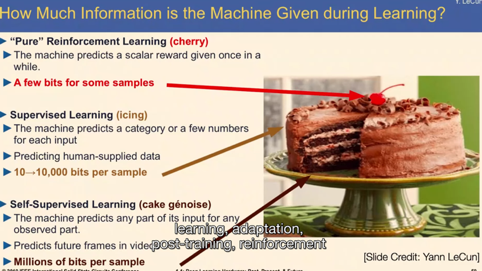  
  
  
You spend a lot of data and a lot of time coming up with a really good representation of the world in a self-  
supervised way or an unsupervised way, not tied to any specific task. So self-supervision is about not having  
labels, but it's also about not being narrow and tied to a task. It's just generally compress the universe into  
something that's predictive of the future and is compact.  
And then the icing and the cherry are all the rest of machine learning-- supervised learning, adaptation, post-  
training, reinforcement learning. So he's making the point that representation learning is the bulk of intelligence,  
and I agree with that point. So I will end th  
  
  
  
So BERT was a language model that was very popular some years ago. It's gone a bit out of fashion, but BERT is roughly the same thing on text. So I just take my text. I tokenize it. I mask some of the tokens. I run it through a  
transformer, and I predict all the tokens. So I'm now doing masked prediction with language.  
  
  
And the autoregressive models that try to predict the next word in a sentence are just the same, except they're  
only masking the final word as opposed to interleaving words. And that has some advantages in that I can  
decode in sequential order as opposed to in out-of-time order. So, yeah, question?  
  
  
# Similarity Based Learning  
  
  
Overview  
  
## Why do we learn representations  
  
  
  
1. To compress the data space, or use it later for **prediction**  
2. Predict and then retrieve that information-> Information Retrieval  
3. Methods:  
    1. Contrastive Learning  
    2. Approximate Nearest Search(ANN)-> Takes O(√N)time  
    3.  Vector database and RAG, HNSW(Hierarchical Graph Navigable Space) O(log n) time, LSH (Approximate Nearest Mapping)-> More sophisticated than ANN.. faster   
    4. Predict by minimizing reconstruction error  
  
  
Contrastive Means-> Two different things which are very different..   
Working->  
Project data to latent space embedding-> Augment the data using a hypothesis sensible that similar items can be clustered together and dissimilar are far apart by first normalizing on the hypersphere.. in such a way that they are uniformly spread on the hypershere-  
  
Why Hypershpere->  
We first normalize the data  
So in 2d-> Circle z1^2 + z2^2=1  
3d-> Sphere z1^2+z2^2+z3^2=1  
n dimension-> Becomes hypersphere-> ∑z¡^2=1 ∀ i from 1 to n  
  
  
  
  
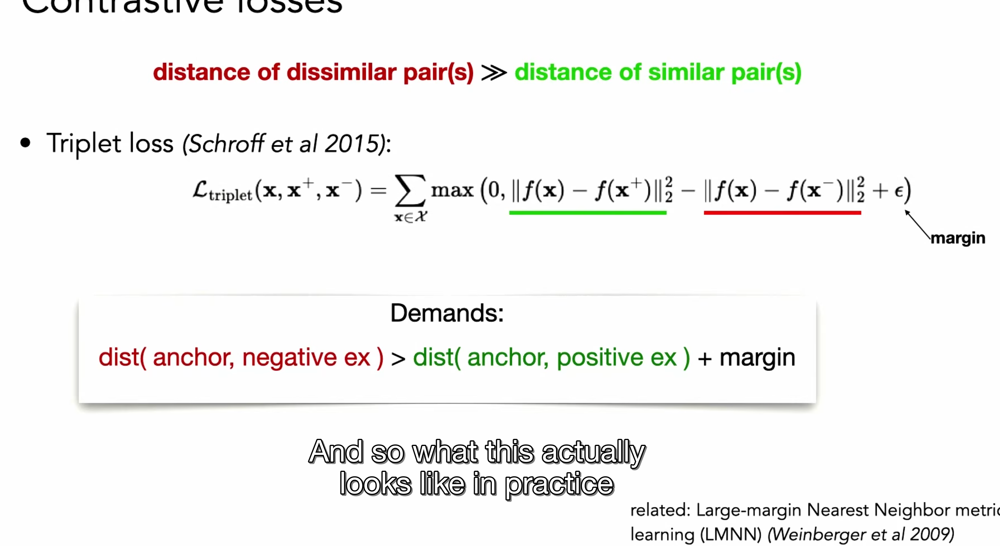  
  
  
  
  
# Theory  
  
  
Make Problem based algorithms and formulae.. like a statistician.. with algorithms.. with cs knowledge with help of genai.. theory.. statistics mostly know.. need to revise.. do nothing else..  
  
  
  
  
  
  
  
