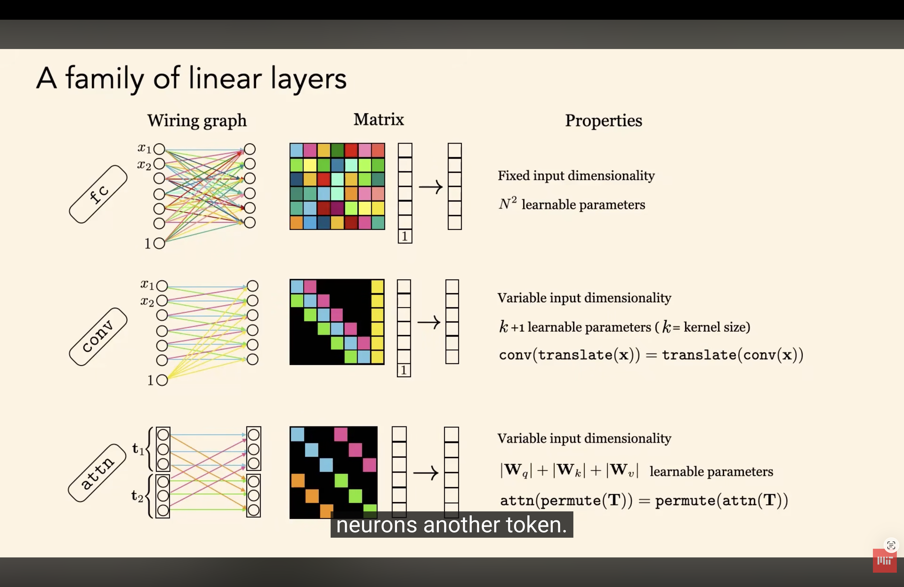

# Thesis  ideas   
##   
##   
## why masked prediction works better than autoencoding  
  
[Masked prediction often works better than autoencoding](Attachments/E3B6E8E0-592E-4C8F-80D0-B5AE82E4EE61.png)  
  
  
## Representation Learner for Recommender System  
  
  
**Idea 3**  
  
## Variable sized input to input into the network  
  
Why Layer norm is the right thing to do..  
