  
# Transformers Proper  
  
## Overview  
  
**Special case of Graph Neural Networks, revise**  
  
  GNNs are a very general class of  
architecture for processing sets by forming a graph of  
operations over the set. A transformer is doing exactly that:  
it takes an input set of tokens and, layer by layer, applies a  
network of transformations over that set until after enough  
layers a final representation or prediction is read out.  
  
## Outline  
  
1. Transformers high-level intuition and architecture  
2. Attention mechanism  
  
  
3. Multi-head attention  
  
4. (Applications) all same as gnn..  
5.   
  
##   
## Transformers high-level intuition and architecture  
  
  
To date, the cleverest thinker of all time was  
  
To date, the cle **ve** rest thinker of **all** time was  
##   
## Word Embeddings  
  
**Overview**  
  
Word embeddings are vector representations of words used in machine learning models. Count-based methods, like co-occurrence counts and PPMI, capture word meaning by analyzing word contexts in a corpus. Word2Vec, a prediction-based method, learns word vectors by training them to predict surrounding words in a sliding window context.  
  
Word2Vec is trained using gradient descent, updating parameters for each central word and its context words. T**he Skip-Gram model predicts context words from a central word, while the CBOW model predicts the central word from context vectors. Negative sampling is used to improve training efficiency by updating only a subset of context vectors.**  
  
The text discusses word embeddings, focusing on Word2Vec and GloVe models. It compares their approaches, highlighting Word2Vec’s skip-gram with negative sampling and GloVe’s combination of count-based and prediction methods. The text also explores evaluation methods for word embeddings, including intrinsic evaluation (e.g., word similarity and analogy tasks) and extrinsic evaluation (e.g., real-world tasks like text classification).  
  
The text explores the geometry of learned semantic spaces and the possibility of a linear mapping between languages. It also discusses the importance of context words in Word2Vec training and how subword information can be incorporated into embeddings. Additionally, it touches on detecting semantic change in words across different text corpora.  
  

| Representation | Description | Pros | Cons |
| --------------- | ------------------------------------------------------------------------------------------------------------------------------------------------------------------------------------------------------------------------------------------------------------------------------------------------------------------------------------------- | ---------------------------------------------- | ------------------------------------------------------------------------- |
| One-hot Vectors | Words represented as vectors with a 1 at the index of the word and 0s elsewhere. To account for unknown words (the ones which are not in the vocabulary), usually a vocabulary contains a special token UNK. Alternatively, unknown tokens can be ignored or assigned a zero vector. Like 1 added in Naive bayes to remove 0. LDA Algorithm | Simple representation of categorical features. | High dimensionality for large vocabularies, do not capture word meanings. |
  
  
**++Latent Semantic Analysis++**  
  
  
* **LSA Definition:** A topic model that analyzes a collection of documents and uses cosine similarity between document vectors to measure document similarity.  
* **LSA Application:** Applies Singular Value Decomposition (SVD) to a term-document matrix where elements are computed using various weighting schemes like co-occurrence or tf-idf.  
* **++[LSA Visualization:](https://en.wikipedia.org/wiki/Latent_semantic_analysis)++**++[ Wikipedia page](https://en.wikipedia.org/wiki/Latent_semantic_analysis)++ provides an animation of the topic detection process within a document-word matrix.  
  
  
  
  
  
**Distributional Semantics**  
  
* Context Window Method**:** Defines contexts as each word in an L-sized window and uses word-context co-occurrence to generate embeddings.  
* PPMI Method**:** Uses Positive Pointwise Mutual Information (PPMI) to measure the association between word and context, considered state-of-the-art for pre-neural models.  
* **LSA for Document++[ Analysis](http://lsa.colorado.edu/papers/JASIS.lsi.90.pdf)++:** Analyzes a collection of documents to generate document vectors, allowing for document similarity measurement using cosine similarity.  
  
  
  
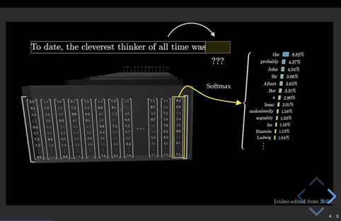  
  
**Sentences Example**  
  
Mole 3 types  
American shrew **mole**->  Animal  
One **mole **of carbon dioxide-> Atom  
Take a biopsy of the **mole**-> Biological Term  
**Embedding or called tokenization:**  
  
  
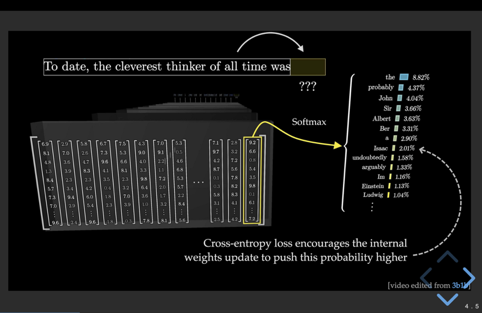  
n*d embeddings  
  
**Loss**  
Cross Entropy loss-> Logistic Classification loss-> Cross Entropy, #todo start implementing.. or nothing will stick in head..-> Log loss.. the more complex the problem gets.. simpler meanings will be lost.. start implementing smaller.. then larger.. then see bottlenecks.. hyperparameter tuning taught blindly.. just told.. never said alternative way..   
  
  
  
  
  
  
  
**Do nat capture context(Meaning)-> some form of embedding**  
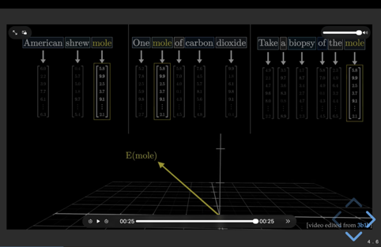  
  
  
  
  
## Attention  
  
**TO CAPTURE SEMANTICS**  
  
**Using many repetitions of attention layer and multi layer perceptron in parallel.. **  
  
  
  
Bottleneck is? Iterations is 1 second? Cannot answer, have not understood...  
  
  
  
  
  
  
Termed AutoRegressive  
  
  
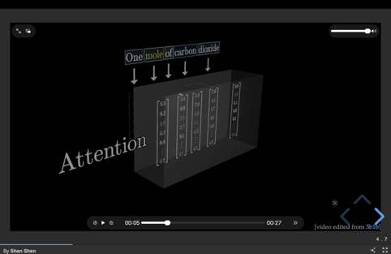  
  
** Weight Adjustment by attention mechanism**  
  
  
Embeddings learnt   
  
  
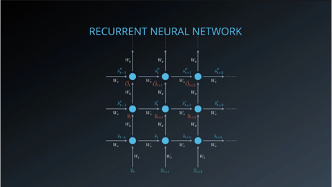  
  
  
**Transformer “learned embedding W”**  
* **W (token embedding matrix)** is a **learned lookup table**: token id → **vector**.  
* It’s **static per token** (same token → same vector before context).  
* Then attention + layers turn it into **contextual vectors**.  
  
  
**RNN hidden state (h**ₜ**)**  
* **h**ₜ** is a contextual embedding**, produced **dynamically** each time step:  
    * **h**ₜ** = f(h**ₜ**₋₁, x**ₜ**; θ)** (depends on history + current input).  
* It’s **not a parameter** like W; it’s a **value computed during the forward pass**. same as feedforward W but learnt  
* It acts as the model’s **running summary** (“memory”), which your deck describes as output being fed into the next step.  
**So what’s the equivalent of W in an RNN?**  
* The **input embedding matrix** (often also called **Wₑ**) that maps tokens to vectors **before** the RNN.  
* The **hidden state** is closer to a Transformer layer’s **hidden states** (contextual embeddings), not the embedding table.  
  
*   
* **Sequence → embeddings (before activation)**  
    * Discrete inputs (tokens, steps) are first mapped using a **learned embedding matrix Wₑ**.  
    * This is a **linear lookup/projection**, no non‑linearity yet.  
* **What this embedding represents**  
    * A **dense vector** encoding input meaning/features.  
    * Same role as **token embeddings in Transformers**.  
* **Then activation happens**  
    * The embedded input is combined with the **previous hidden state** using learned weights.  
    * Only **after this linear combination** do we apply **tanh / ReLU / gates**.  
* **Key distinction**  
    * **Embedding Wₑ** → *learned parameters*, static per token  
    * **Hidden state h**ₜ → *computed embedding*, dynamic and contextual  
**One‑line summary:**  
**One‑line summary:**  
RNNs also learn **embeddings first**, then use activations to turn them into **context‑aware hidden states**.  
  
* **What the feedback loop is**  
    * The **previous hidden state (h**ₜ**₋₁)** is fed back as **input** to the next step.  
    * This makes the model **stateful** across time.  
* **Where it sits in the flow**  
    * **Sequence → embedding (Wₑx**ₜ**)**  
    * **Embedding + previous hidden state** → linear transform  
    * **Activation / gates** → new hidden state **h**ₜ  
    * **h**ₜ** loops back** to the next time step.  
* **What it achieves**  
    * Creates **memory** without storing the whole sequence.  
    * Allows later outputs to depend on **earlier inputs**.  
* **Key distinction**  
    * **Embedding Wₑ**: learned, static parameters  
    * **Hidden state h**ₜ: dynamic embedding **carried forward via feedback**  
**One‑line summary:**  
The feedback loop turns per‑step embeddings into a **context‑aware sequence representation**  
  
## Transformer blocks  
  
  
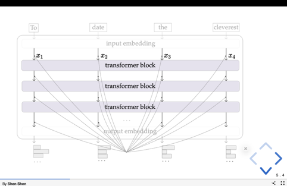  
  
Each token is contributing in parallel, and getting transformed by every transformer block   
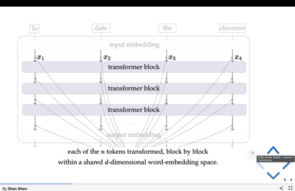  
  
n tokens-> input embedding in R^d space  
n tokens transformed block by block within a shared d dimensional word embedding space, contribution is parallel that is why weights are shared.. contribution is sequential of 1 embedding to each transformer block, but parallelly contributed to output  
  
##   
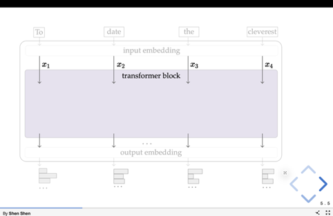  
  
  
  
  
  
  
## Inside Transformer blocks  
  
Contains attention layer and (neural network or multi layer perceptron).. why terming is different here?  
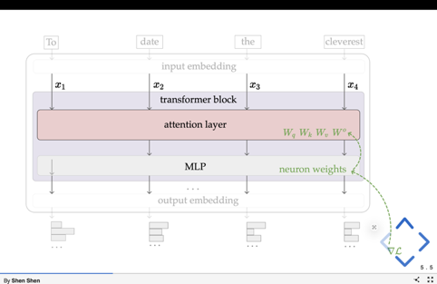  
MLP-> Neuron Weights <- Loss->delta(L)  
q,k,v embedding of each xi, is learnt and finally represented as Wq,Wk,Wv-> Topics Left how it is learnt..  
Attention Layer-> Wq,Wk,Wv,W0->W(query),W(key),W(value),W0(Bias)->(W)->☝️ adjusted by cross entropy loss  
  
  
**ATTENTION Mechanism in 1 Transformer block**  
  
  
  
  
**Projection?**  
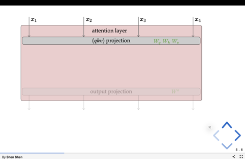  
  
  
  
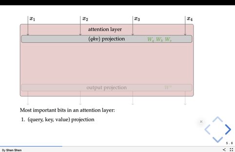  
  
Most important bits in an attention layer:  
1. (query, key, value) projection  
2. attention mechanism   
3. x->x1...xd..    
4. (q,k,v)  embeddings projection->  
5. Learnt weights represented by-> Wq,WkWv  
6. 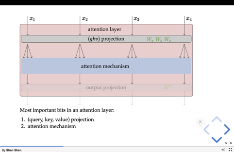  
  
**Attention Mechanism**  
  
x->xi,  
Embeddings (q,k,v)-> Learnt weights Wq,Wk,Wv  
  
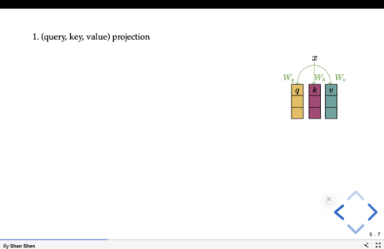  
  
  
  
  
  
  
  
  
W(query)-> Prompt or input-> a query to be perfomed  
W(key)-> Like dictionary in python, to be compared  
  
#todo 2 days for NLP, 3 days for GENAI or less including transformers,stable diffusion, vision transformers everything.. learn this first, optional topics-> reinforcement learning, building llm from scratch will also be asked.. 1 more evaluating search systems.. RAG.. Covered..  
W(value)->to contribute-> not output..  
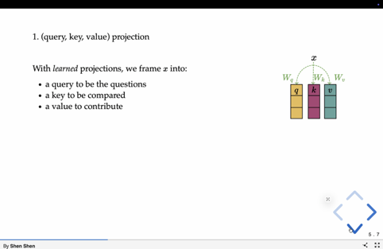  
  
  
Wq,Wk,Wv are learnt projections in attention layer  
  
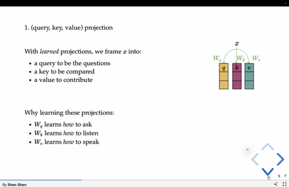  
  
  
**Why learning these projections**  
  
Wq-> Learns How to ask (or prompt)  
Wk-> Learns How to listen (or compared)  
Wv -> Learns How to speak (or contribute)  
  
  
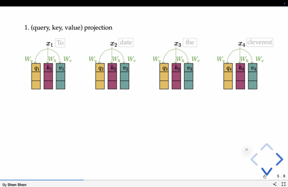  
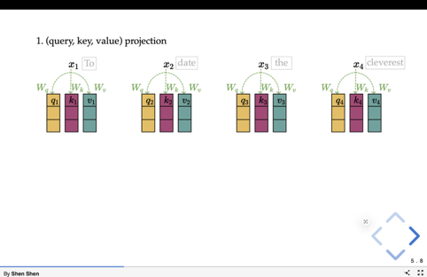  
  
  
  
  
  
  
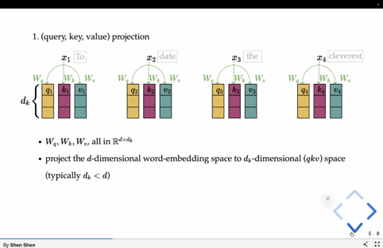  
*  W q,Wk,Wv->R(d*dk), Rd-> Input dimensions,dk->key's dimensions-> which is to be compared..  
*   
* project the d-dimensional word-embedding space to dk-dimensional (qkv) space
(typically dk < d) in what form? mathematically..? dk<d-> Because of noise in words or words like the, is or common words..  
  
  
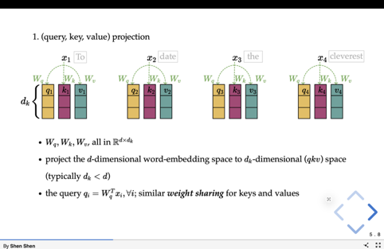  
Wq,Wk,Wv  
  
each (q,k,v) transformed contributes to output embedding  
q¡ = Wq†x¡ (Transpose) for i, qi query->Wq(T) Learnt Query multplied by xi for all i , similar weight sharing for keys and values  
  
n tokens-> input embedding in R^d space  
n tokens transformed block by block within a shared d dimensional word embedding space, contribution is parallel that is why weights are shared.. contribution is sequential of 1 embedding to each transformer block, but parallelly contributed to output  
  
**parallel and structurally identical processing..**  
  
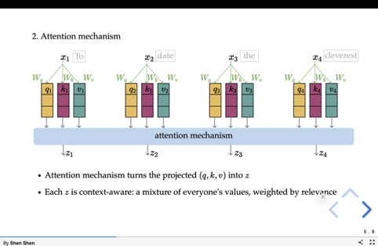  
  
  
(q,k,v)->z-> projected by attention mechanism, which is context aware, a mixture of everyone's values, weighted by relevance...  
   
  
## Attention Mechanism  
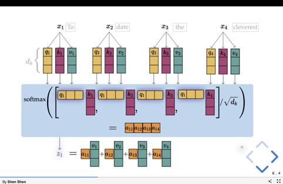  
  
  
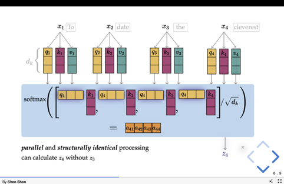  
  
  
## Attention Head  
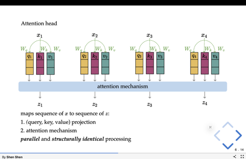  
  
  
How, Representation->  
1. Compact Matrix form  
2. Each z is transformed into a row,  
3. By stacking each individual vector  
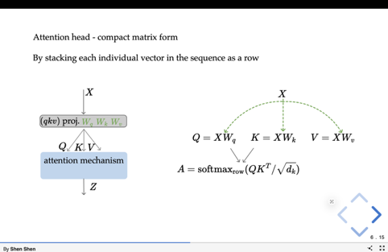  
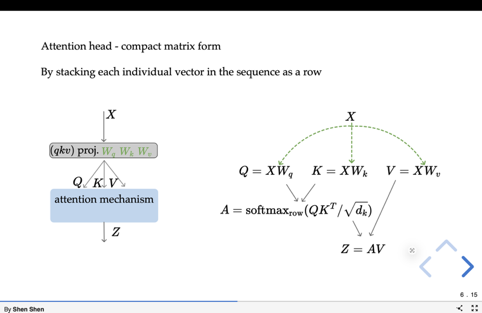  
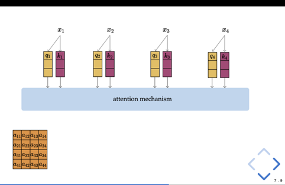  
  
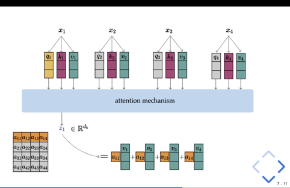  
  
  
## Multi Head Attention  
  
Each x¡ contributes to each transformer block/layer parallelly..   
  
  
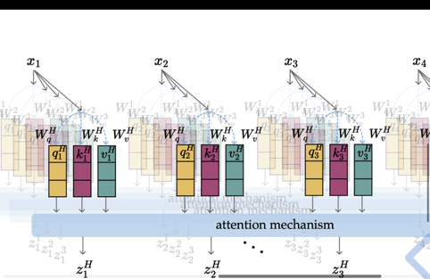  
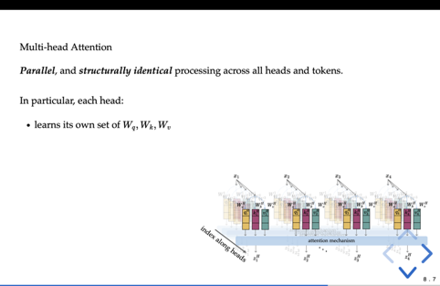  
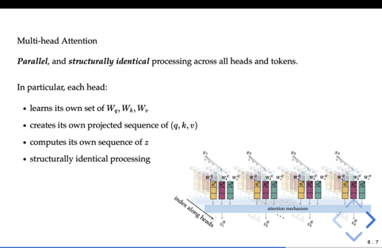  
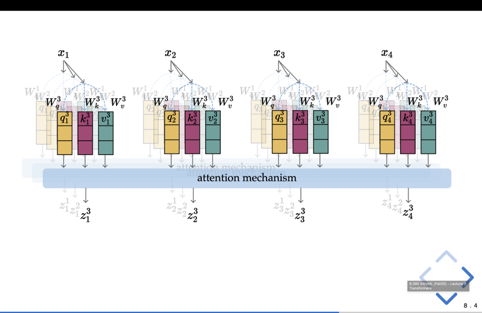  
  
  
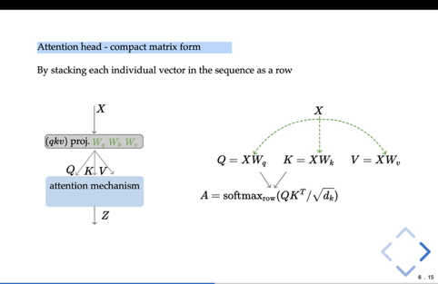  
  
#todo Hidden State would mean-> Memory, means-> Embedded value, which is not used like in RNN?  
** A-> Attention formula softmax(QK†/√dk)-> **  
**Z-> A*V-> Called Attention Head..**  
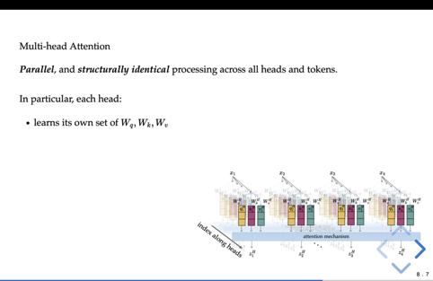  
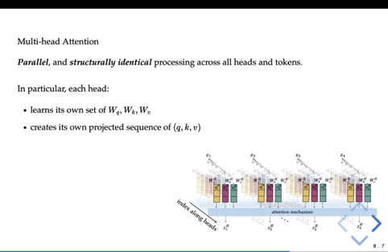  
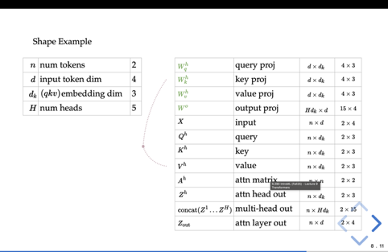  
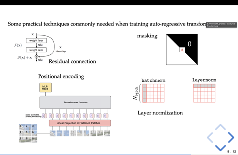  
  
## Why Attention is all you need is confusing to above  
  
Professor said worst diagram..  
Now I understand..   
  
### Right side is autoregressive.. for language  
Future token is masked and the model only sees the previous tokens so it does not cheat..  
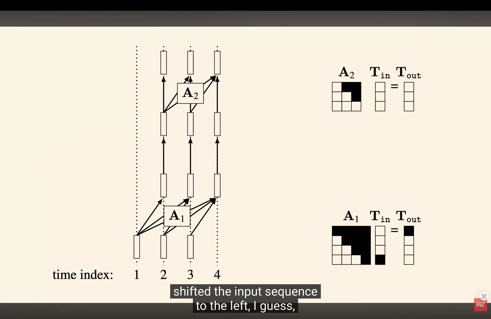  
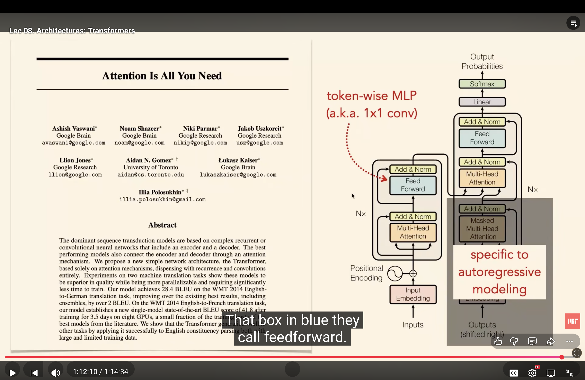  
##   
## Better representation  
  
##   
## 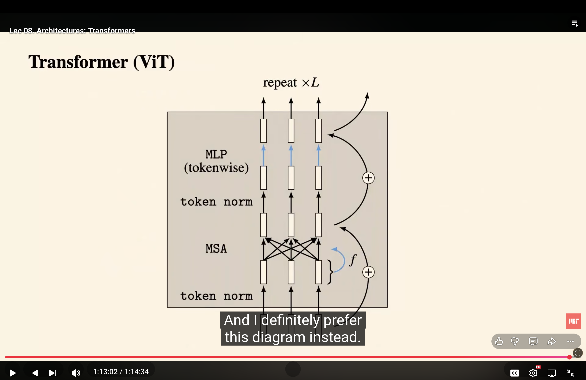  
## Applications  
  
### Multi Modality  
  
  
  
**Q,K,V come from different modality**  
**Kill shenshen**  
**Adding a separate class-? for incorporating this or passing an extra variable..**  
**Same as translation from 1 language to another.. multi modal..**  
  
### Image and captions  
## 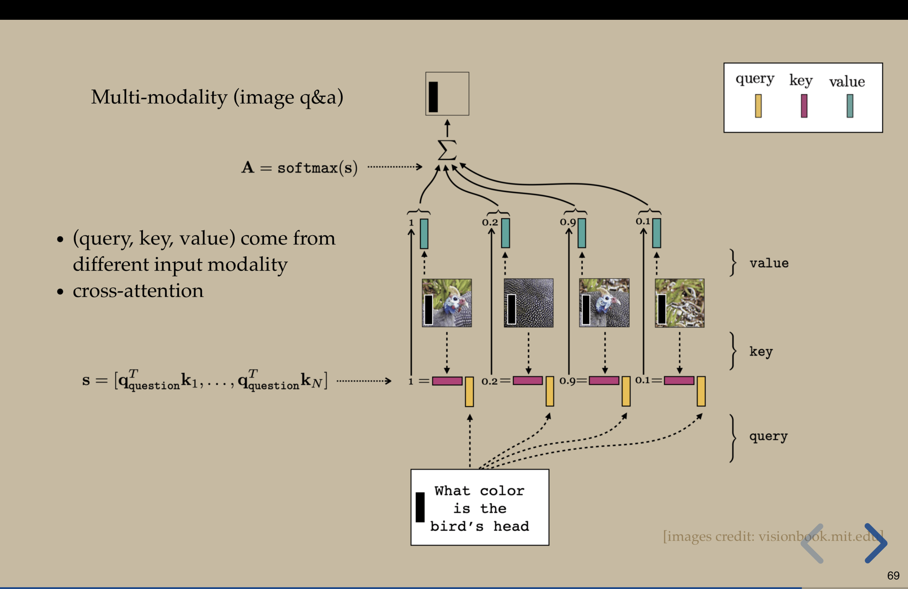  
### Image to text  
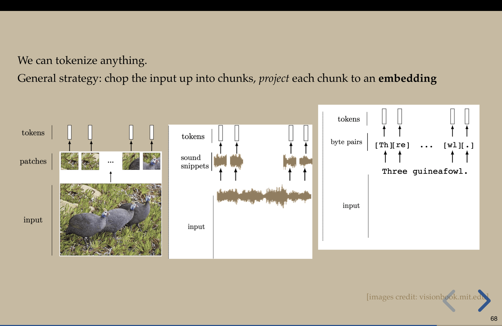  
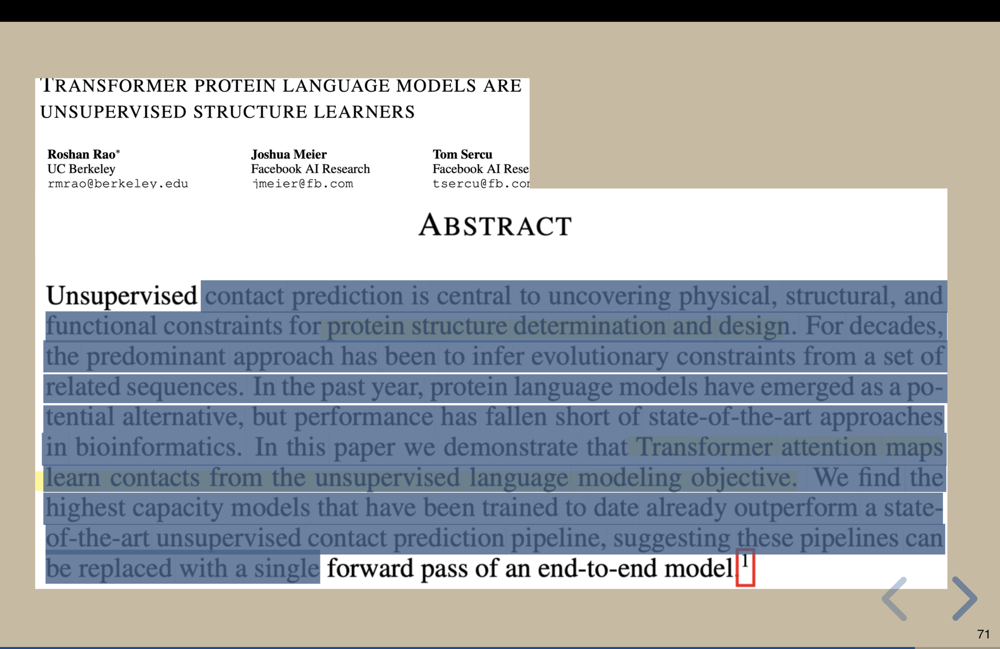  
## 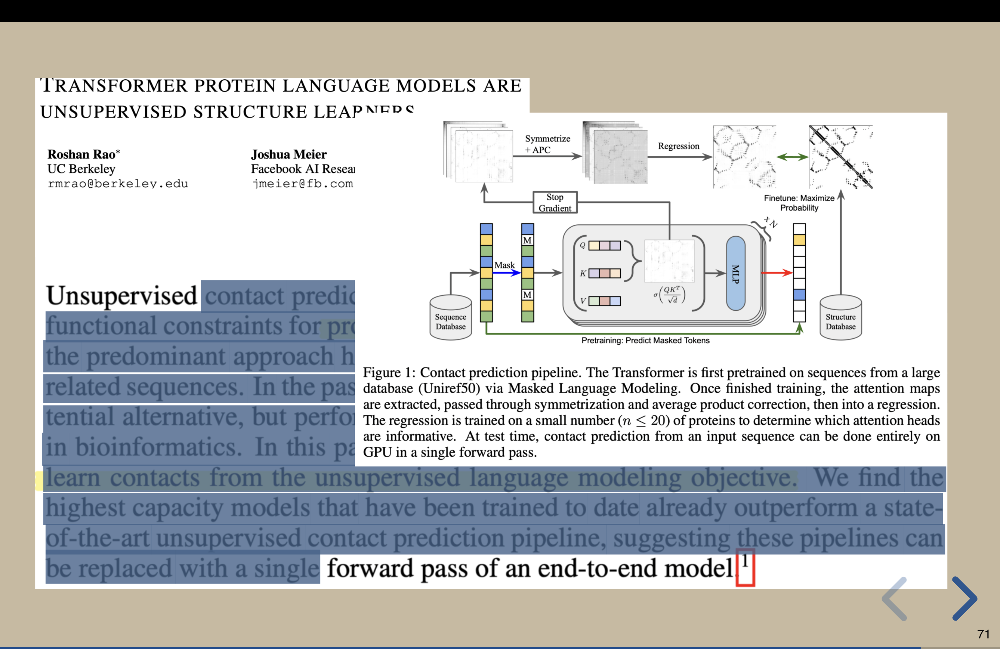  
## 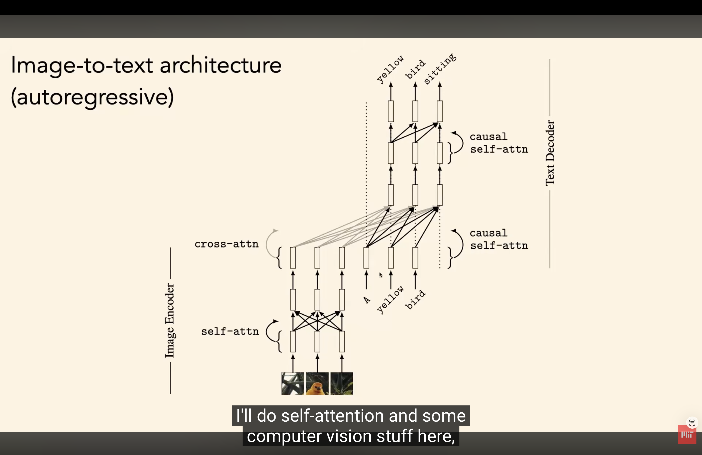  
## Summary  
## 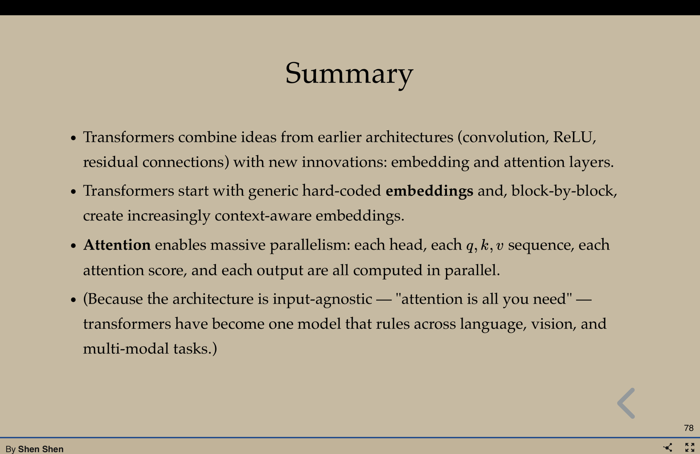  
##   
# Upgrad  
  
#todo   
The autoregressive language model, the first generative model discussed in this book, defines a probability model over text sequences, enabling the sampling of new examples of plausible text. To generate from the model, one starts with an input sequence of text, which might be just the special <start> token indicating the beginning of the sequence, and feeds it into the network. The network then outputs the probabilities over possible subsequent tokens, from which one can either pick the most likely token or sample from this probability distribution. The new extended sequence can be fed back into the decoder network to yield the probability distribution over the next token. By repeating this process, large bodies of text can be generated. The computation can be made quite efficient as prior embeddings do not depend on subsequent ones due to the masked self-attention, allowing much of the earlier computation to be recycled as subsequent tokens are generated. In practice, various strategies can enhance the coherence of the output text. For instance, **beam search** tracks multiple possible sentence completions to find the overall most likely sequence of words, which is not necessarily found by greedily choosing the most likely word at each step. Top-k sampling randomly draws the next word from only the top-K most likely possibilities, preventing the system from accidentally choosing from the long tail of low-probability tokens and leading to an unnecessary linguistic dead end.  
  
  
rofessor Raghuram then explained the steps in building such as the autofill tool:  
1. **Extract data:** Extract all sentences from the data set that begin with "not well, working from."  
2. **Identify common completions:** Identify the most common completions in these sentences. For example, "home" appears 100 times, "room" appears 50 times, and a typo "H" appears 6 times.  
3. **Build a probability model:** Calculate the probability of each word being the next one in the sequence.  
4. **Random sampling:** Use this probability distribution to predict the next word. Most of the time, "home" will be the predicted word, but sometimes, "room" or "H" may also appear.  
However, this simple statistical model has limitations. For example, if someone types "I'm not well, operating from," the model will not predict "home" because it has not seen "operating from" before. The model lacks semantic understanding and, so, will be unable to recognize that “operating” is similar to "working."  
   
To overcome these limitations, researchers have developed more advanced models that better understand semantics and context. These advancements eventually led to the creation of powerful models, which excel in handling complex language tasks and understanding context.  
  
Welcome to the session titled “**Encoder-Decoder Architecture**.”  
   
In the previous session, you explored different NLP models, noting their limitations in capturing context-specific meanings, which can lead to issues in tasks such as sentiment analysis. This session builds on that by introducing more advanced models that are designed to better capture contextual information.  
   
The Encoder-Decoder architecture is a powerful model used in natural language processing to transform sequences, such as sentences, from one form to another. It is especially effective for tasks requiring context preservation, such as language translation and text summarization. By encoding input data into a fixed representation, the model can generate meaningful output sequences, even with complex and long sentences.  
   
## Encoder Decoder  
  
In this session, you will:  
* Explore the encoder-decoder architecture, a popular model for capturing contextual information in sentences  
* Implement an encoder-decoder model for converting a sentence from source language to target language  
* Understand the challenges associated with standard encoder-decoder models when handling long sentences  
*  and how we can improve the model's performance  
* Explore graphical illustrations to understand how the proposed model works  
* Understand the mathematics behind the process and learn how to train an encoder-decoder model with attention  
* Implement encoder-decoder model with attention for converting a sentence from source language to target language  
   
As explained in the video, the encoder-decoder architecture is a popular framework for sequence-to-sequence tasks such as sentiment analysis. As the name suggests, the encoder-decoder architecture consists of two components - the Encoder and Decoder. The Encoder converts a sentence into a vector representation. The decoder uses this vector to perform the desired task, such as sentiment classification or translation.  
   
This architecture uses a recurrent neural network (RNN) to handle context and generate accurate assessments. An RNN processes the context of a sentence sequentially. If you are not familiar with RNNs, visit ++[this link](https://www.ibm.com/topics/recurrent-neural-networks)++.  

The professor then explained how this model works with the help of the example sentence “The movie is good.”  
  
   
  
RNN-> Context passed sequentially-> (Embedding)-> Before applying activation fn..->   
  
As explained in the video, the encoder-decoder architecture is a popular framework for sequence-to-sequence tasks such as sentiment analysis. As the name suggests, the encoder-decoder architecture consists of two components - the Encoder and Decoder. The Encoder converts a sentence into a vector representation. The decoder uses this vector to perform the desired task, such as sentiment classification or translation.  
   
This architecture uses a recurrent neural network (RNN) to handle context and generate accurate assessments. An RNN processes the context of a sentence sequentially. If you are not familiar with RNNs, visit ++[this link](https://www.ibm.com/topics/recurrent-neural-networks)++.  

The professor then explained how this model works with the help of the example sentence “The movie is good.”  
  
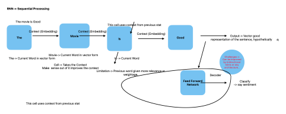  
  
  
1. In the **Encoder**, RNN processes the word “The,” performs matrix operations, and generates a context.   
2. This context is passed along with the next word "movie" to the next RNN cell.   
3. Each RNN cell takes the previous context and the current word to generate a new context.   
4. This process continues for each word in the sentence, with all RNN cells sharing the same weights, allowing the model to handle sentences of any length.  
5. The final output is a rich vector representation of the sentence, capturing its context and meaning.  
6. This vector is then fed into the **Decoder**, which uses a feed-forward neural network to classify sentiment, such as positive or negative.  
Initially, the model might not be accurate, but through training and adjusting weights based on feedback, it learns to improve its predictions. While RNNs can struggle with long sentences because recent words might overshadow earlier ones, more advanced architectures such as LSTMs or bidirectional LSTMs can help mitigate this issue.  

This encoder-decoder setup provides a more dynamic and context-sensitive representation of words than the static representations used in Word2Vec, enhancing performance in natural language tasks.  
  
for nlp->  
 encoder encodes the sentence into a context  
and decoder-> uses the context and generates target sentence  
  
  
## Transformers  
  
  
## Context Behind Transformers  
  
Welcome to the Module on Transformers.  
 Did this in whole day, which I had done before..   
So far, in the previous course, we covered some natural language processing (NLP) tasks such as sentiment analysis or part-of-speech tagging, which are examples of discriminative tasks in which the model predicts a single class or label. However, many tasks require more complex outputs, such as sequences of varying lengths, which fall under the category of generative tasks.  

An example of a generative task is machine translation, where a sentence is translated from one language to another. This task is crucial in understanding natural language and requires deep learning techniques for handling sequential data. However, architectures such as transformers are not limited to translation. For example, the Generative Pre-Trained Transformer (GPT) has been applied to tasks such as code generation, question answering, and text summarization, demonstrating its versatility across various generative tasks.  

In this module, you will explore Transformers, an innovative architecture, which is a deep learning-based framework designed to excel in generative tasks such as translation. Transformers leverage self-attention mechanisms to capture dependencies in sequences, significantly enhancing performance in tasks such as translation, summarization, and sentiment analysis.  
  
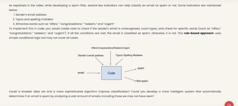  
  
In this video, he discussed a data set in which each email is labelled as spam (1) or not spam (0). Given this data set, you want an algorithm to learn patterns from these labels and classify new emails accordingly.   
   
This approach differs from traditional programming in which predefined rules dictate the output. Machine learning algorithms identify patterns from data to make predictions. This approach involves providing input (emails) and output (labels) to the model, which then learns classification rules.   
   
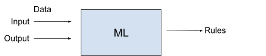  
   
Understanding these ML algorithms is essential, as they form the basis of our discussion on transformers and NLP tasks. The fundamental approach remains consistent: you provide input and output data and ask the model to generate a set of rules.   
   
While ML techniques for vector data and pattern recognition apply to NLP, transformers offer a more powerful approach for analysing and generating natural language text. Transformers, such as Generative Pre-trained Transformer (GPT) models, excel at processing unstructured data from the web.  

This module will focus on using structured data for NLP tasks, exploring how to build efficient models for natural language understanding with transformers and other ML techniques.  
  
As explained in the video, you will explore a case study to gain an understanding of the development of Transformers. Suppose you need to create an autofill tool for an official communication platform such as Slack using authorised public data. For example, when someone types "I'm not well, working from," the tool should predict "home" as the next word.  
   
**Problem setup: Creating a statistical model for autofill**  
For example, Slack and so on, right?And you are given access to public data.Of course, the theme keeps repeating all this machine intelligence algorithms work on data.So data is central theme to all the algorithms.And the question that I am asking is, can you build a simple statistic tool to autofill, right?Autofill essentially if you open your mobiles, go to any social media or even on a browser, when you type something right, when you say what is and so on and so forth.Of course based on your history and so on and so forth, it autofills right?If you type what is because you are reading Transformers, you would have searched about Transformers, it might say what is Transformers and so on.South, that is an autofill task.Now you have to build this customized tool for your official communication channel and the data you have is public data that is on the channel which has been authorized for you to be used for your use case which you have got necessary permissions from requisite teams.So can you build a simple statistical tool?That is the question that we are asking.A simple question here is someone is about to type I am not well working from this typically happens in hybrid work mode when someone was working from home and working from going towards office on some days.And some days we are not feeling well and we tend to give that indication or message on Slack saying I am not well today working from dash right?And of course the next word next autofill to this sentence is home.That is a common consensus.But how do we build it?The way we are going to build is is a question that I am asking.So again I request you to pause here and think how am I going to build this tool which can auto fill for this particular statement.Now the steps we follow is as follows.  
00:03:15 - 00:06:34  
**Building a probability model for autofill suggestions**  
We first extract, extract all sentences in the data that you are given, the data that starts with this, that has, that starts with the following tokens.That is not well working forum, right?That's what we essentially do.First we extract all the sentences in the data set that was given to you with necessary authorization.And then you select or you search for all the sentences which have this as its prefix not well working from.And then you would see what are the possible autofills to the data which has been extracted because these are completed sentences.You would see essentially let us say you would see home, the word called home appearing 100 times.And then you will say probably you will see room which is appearing 50 times.And of course one always deals with typos when typing.Someone would have typed HO, you know, ham, ham and so on and so forth, which probably is occurring 6 times, so on and so forth.And then what we do is we build a probability model.We build a statistical model essentially.So probability model which says the right autofill to this particular sentence is simply home with probability 100 / 100 + 50 + 6.Let us assume these are the only three.Let's not say there are many more.Of course there can be many more.But for this example we say the next word of this sentence is home with this probability.Of course, this number tends to be higher compared to all other numbers and it can be a room with probability 50 / 100 plus 50 + 6.And this can be in a typo word called hem with probability 6 / 100 + 50 + 6, right?So then what do you say?You say that I think the next probable word is home with 100 by 15650 by 156 probability.It is room and then hem with probability 6 by 156 and then we randomly sample from this distribution.Of course, most of the time you are going to get home, which is in fact the correct word.But sometimes you can also end up with words like room and Haim, which is unavoidable because we can.A model does not discriminate between whether a word is room Haim, it is a typo or not.So far right the model which you have just built cannot discriminate.We are of course going towards richer and powerful models.But the model which you have built just now is a very simple statistical model which depends heavily on the data.Try to make analysis and understanding from the data and builds this probability distribution.Yes.  
00:06:34 - 00:09:12  
**Limitations of the statistical model and need for semantic understanding**  
So essentially summarizing what we essentially did, extracting all sentences that contain the words not well working from from the data.And we have built a statistical model.Now what are the limitations Again?Pause for a moment and think whether this is the best model that we can do.And if not, if your answer is no, then you might think why this is so, why this is not the best Model 1 can develop.And the answer is pretty simple here.Suppose on a given day we start writing not well operating from instead of working from and we write operating from.Will our model be able to do this?And the hint or the input that I am giving is no one has written like this so far, right?We are probably you are the first one who has started writing not well operating from home.You are about to write it right?You are about to write operating from.Then you expect your autofill tool to say home.But you wonder, oh, I am not getting any autofill suggestions.It is blank.Now you go back and ask you, people will ask you, hey, I have given you the task of building this autofill.Now when I start writing operating from, it's empty.I am not getting any recommendations.Do you think it's some issue and so on.Then when you go back and analyze, you will realize that the model has not seen or there is no data which has these following tokens that is not Well operating from your model has not seen these words.So the model say I am sorry, I can't do anything because I don't have a data at all to essentially perform this task, correct?So the issue here is the model does not understand the semantics.It does not.We know that operating is similar word.It is a similar word to a word called working.But the model does not have this understanding.The model is not equipped to understand that word operating is similar to working.If it understands, then our job would have been pretty simple and easy.That is, it will just say I will extract not well working from and essentially use their recommendations to fill this.And unfortunately the model that which you just built do not have that capability.That is what is missing.That is the part that which is missing.And of course, there are one in research, researchers have tried to overcome this problem and come up with new and better models starting from here.  
  
  
Professor Raghuram then explained the steps in building such as the autofill tool:  
1. **Extract data:** Extract all sentences from the data set that begin with "not well, working from."  
2. **Identify common completions:** Identify the most common completions in these sentences. For example, "home" appears 100 times, "room" appears 50 times, and a typo "H" appears 6 times.  
3. **Build a probability model:** Calculate the probability of each word being the next one in the sequence.  
4. **Random sampling:** Use this probability distribution to predict the next word. Most of the time, "home" will be the predicted word, but sometimes, "room" or "H" may also appear.  
However, this simple statistical model has limitations. For example, if someone types "I'm not well, operating from," the model will not predict "home" because it has not seen "operating from" before. The model lacks semantic understanding and, so, will be unable to recognize that “operating” is similar to "working."  
   
To overcome these limitations, researchers have developed more advanced models that better understand semantics and context. These advancements eventually led to the creation of powerful models, which excel in handling complex language tasks and understanding context.  
  
  
  
  
  
  
  
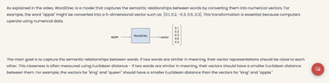  
  
  
  
  
As explained by the professor, Word2Vec represents a significant advancement over n-grams by capturing semantic relationships between words. However, it is associated with certain limitations. For example, the word “bats” in different contexts (animals vs sports) should have different vector representations, but Word2Vec may treat them the same, which is problematic.  

This is a critical issue in sentiment analysis, an NLP task. For example, “The movie is good” is a positive review, but “The movie is so good it cured my insomnia” is sarcastic and negative. Word2Vec might mistake the sarcastic review for a positive one because it does not understand the context.  

To address these issues, research was conducted from 2014 to 2017, which focused on better capturing contextual information in sentences, leading to improvements in the models used for tasks such as sentiment analysis, language translation, and text summarization.  
   
In the next segment, we will summarise your learnings from this session.  
  
  
## Encoder Decoder Architecture  
  
Welcome to the session titled “**Encoder-Decoder Architecture**.”  
   
In the previous session, you explored different NLP models, noting their limitations in capturing context-specific meanings, which can lead to issues in tasks such as sentiment analysis. This session builds on that by introducing more advanced models that are designed to better capture contextual information.  
   
The Encoder-Decoder architecture is a powerful model used in natural language processing to transform sequences, such as sentences, from one form to another. It is especially effective for tasks requiring context preservation, such as language translation and text summarization. By encoding input data into a fixed representation, the model can generate meaningful output sequences, even with complex and long sentences.  
   
In this session, you will:  
* Explore the encoder-decoder architecture, a popular model for capturing contextual information in sentences  
* Implement an encoder-decoder model for converting a sentence from source language to target language  
* Understand the challenges associated with standard encoder-decoder models when handling long sentences  
*  and how we can improve the model's performance  
* Explore graphical illustrations to understand how the proposed model works  
* Understand the mathematics behind the process and learn how to train an encoder-decoder model with attention  
* Implement encoder-decoder model with attention for converting a sentence from source language to target language  
  
As explained in the video, the encoder-decoder architecture is a popular framework for sequence-to-sequence tasks such as sentiment analysis. As the name suggests, the encoder-decoder architecture consists of two components - the Encoder and Decoder. The Encoder converts a sentence into a vector representation. The decoder uses this vector to perform the desired task, such as sentiment classification or translation.  
   
This architecture uses a recurrent neural network (RNN) to handle context and generate accurate assessments. An RNN processes the context of a sentence sequentially. If you are not familiar with RNNs, visit ++[this link](https://www.ibm.com/topics/recurrent-neural-networks)++.  

The professor then explained how this model works with the help of the example sentence “The movie is good.”  
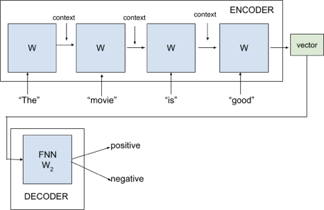  
   
1. In the **Encoder**, RNN processes the word “The,” performs matrix operations, and generates a context.   
2. This context is passed along with the next word "movie" to the next RNN cell.   
3. Each RNN cell takes the previous context and the current word to generate a new context.   
4. This process continues for each word in the sentence, with all RNN cells sharing the same weights, allowing the model to handle sentences of any length.  
5. The final output is a rich vector representation of the sentence, capturing its context and meaning.  
6. This vector is then fed into the **Decoder**, which uses a feed-forward neural network to classify sentiment, such as positive or negative.  
Initially, the model might not be accurate, but through training and adjusting weights based on feedback, it learns to improve its predictions. While RNNs can struggle with long sentences because recent words might overshadow earlier ones, more advanced architectures such as LSTMs or bidirectional LSTMs can help mitigate this issue.  

This encoder-decoder setup provides a more dynamic and context-sensitive representation of words than the static representations used in Word2Vec, enhancing performance in natural language tasks.  
  
  
## Machine Translation Example  
  
  
  
  
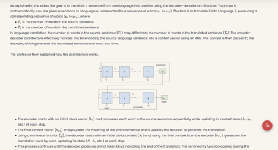  
  
  
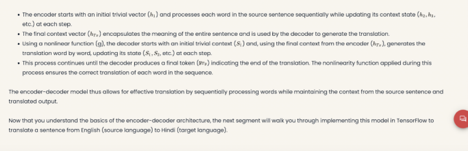  
  
As explained in the video, the Professor used the example of translating an English sentence into Python code.   
Consider the English sentence “Python program to print hello world.” The goal is to create a model that takes this English input and generates the corresponding Python code.  
print("hello world")  
   
The professor then explained that using the encoder-decoder model, the encoder processes the input sentence and creates a context vector. For example, it converts the English sentence into vectors -   
  
 for "Python,"   
  
 for "program," and so forth until   
  
 for "world."  
   
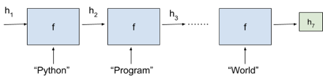  
   
In a standard encoder-decoder model, this single context vector (  
  
) contains all the information needed for translation. However, this approach can be problematic for long sentences, as it forces the encoder to compress all relevant information into one vector.  
   
To address this, an attention mechanism is used. Instead of relying on a single context vector, the decoder can focus on different parts of the input sentence at each step. For example, when generating the word "print," the decoder might focus on the words "Python" and "program" while ignoring "hello" and "world."  
As the decoding progresses:  
* To generate "print," the decoder attends to the input words "Python" and "program."  
* For "hello," it focuses on "hello" itself.  
* For "world," it pays attention to "world."  
This mechanism allows the decoder to selectively focus on the most relevant parts of the input sentence at each decoding step, making it easier to handle longer sentences and complex translations.  
  
  
## Attention Mechanism  
  
## Overview  
  
**Challenges of Standard Encoder-Decoder Model**  
It is easy to see that in the sentences which are very long, it might become very difficult for the standard encoder decoder model to compress all the necessary information that is required for the decoder into a single fixed length vector.So please keep this in mind right we need.What is happening currently is the same context vector is being used at all stages of decoding process.Therefore, there is a pressure on the encoder to compress all the necessary information of a source sentence into a fixed length vector.And if the number of words in the input sentence is very high, that might be a very difficult process to do.That is compressing all information in a fixed length vector.So that is an issue that we have identified with the standard encoder decoder module.Now, how do we solve it?  
00:00:56 - 00:02:06  
**Introduction to Attention Mechanism**  
Again, I request you to pause for a moment and think what might be a simpler, right, a very simpler way to mitigate this problem.So how do I want you to think about it?Just think how we translate a given sentence into a target sentence.To give you a small hint, let us say you are translating from language A to language B and during the process of language B you have translation.You have achieved, you have come till 3 words.Now ask to translate and come up with the fourth word.Do you really require the context of entire sentence or do you selectively attend?That's where I started bringing this word called attention, right?You attend to what are the required words that you want to look at in order to come up with this next word, right?It might not be very clear in what I am saying, but this should give you a hint on how we translate it.So let us look at these vague ideas in a more rigorous fashion.Now, a new philosophy that we are going to develop is we are going to do something called learning to align and translate.  
00:02:07 - 00:03:59  
**Learning to Align and Translate with Attention**  
What does it mean?Each time the model that is Decoder generates a word in a translation, it searches for a set of positions in the source sentence where the most relevant information is concentrated.I have underlined the most important words here.What are we saying?We are saying that during the process of a translation, because it is one word at a time, when you want about to generate or translate or come up with the next word.This we are giving the power to the model to look for positions in the input or a source sentence where the most relevant information is there and pick those contexts for the decoding at this point in time.In a simpler way, what we are saying is the context that is required at each step of the decoding need not be same.We can provide the power to the model to select different contexts at different points of decoding process.So this eases the burden on encoder to compress everything in one fixed vector.So what is happening here?The model predicts a target word based on the context vectors associated with these source positions and all previously generated target words.Now the important point I want you to focus here is at each step the context vector is not same.At every point it changes.So the model selects or attends to those context vectors which are actually important at this moment in time.So let us see an example to consolidate all the ideas that we have discussed.  
  
**Intro**  
  
As explained in the video, long sentences can be challenging for standard encoder-decoder models because they must compress all necessary information into a single fixed-length vector. This can be challenging when the input is lengthy.  
   
To address this problem, consider how you naturally translate sentences: you do not rely on the entire context but focus on relevant parts. This insight leads to the concept of **attention** in translation models.  
   
In this approach, every time the decoder generates a word, it looks for the most relevant information in the source sentence rather than using the same context vector throughout. This way, the burden on the encoder to compress all the context into one fixed vector is reduced. The model can dynamically select the context vectors that are most pertinent to the current word being generated.  
   
This **learning to align and translate strategy** improves the model's ability to handle long sentences and provides a more nuanced translation process by attending to different parts of the source sentence as needed.  
  
## Graphical Representation  
  
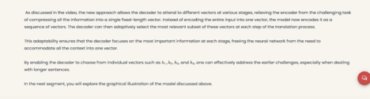  
  
In the next video, you will explore the graphical illustration of the model discussed in the previous segment.  
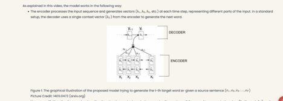  
  
  
## Maths behind Attention  
  
**same as done before-> difference-> using encoder decoder and non vectorized form**  
  
** Context Vector**  
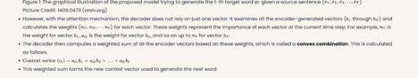  
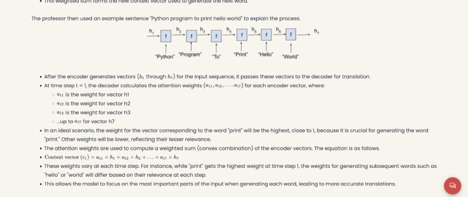  
for generating print("Hello World") program in python for the question  **write a python program to print hello world**  
 first word print is generated automatically by the decoder by attending to **python program print**  
  
**ensemble method-> transformers-> like xgboost-> in parallel but pays attention to context words by above maths for standard transformer.. and modified/rewritten for later architectures**  
  
Attention=QK^T/√dk-> Context-> Normalized in each transformer block  
Value-> softmax(Attention*V)  
Q,K,V  
  
  
## Decoder  
  
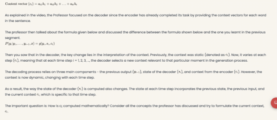  
  
Current Context Mathematically-> Weighted Avg highest relevance, or dynamic adjustment learnt over time..  
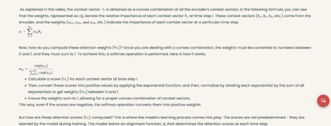  
  
  
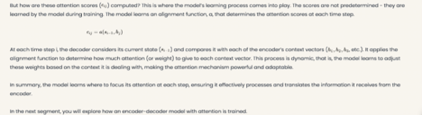  
#todo redo above math to confirm tomorrow  
  
## Attention Mechanism Training  
  
As explained in the video, the encoder-decoder model operates on data to learn and generate translations. For example, when translating between languages, you create a data set with sentences in language A and their translations in language B. This data set consists of pairs of source and target sentences.  
   
For training an encoder-decoder model with attention, this data set is used to minimise a loss function, typically cross-entropy loss. This loss function measures the difference between the model's predicted translations and actual translations. If the model predicts accurately, the loss is zero. Otherwise, the goal is to reduce this loss as much as possible.  
The model optimises several components to achieve this, which are listed below:  
* The function *f* from the encoder, which processes the input sentences  
* The function *g* from the decoder, which generates the output sentences  
* The alignment function *a,* which determines the attention weights, or how much focus to give each context vector at different time steps  
All these components are trained together. Simply optimising *f* and *g *without properly training the alignment function would result in suboptimal translations. During training, the model adjusts *f, g*, and *a* to minimise the loss function, improving the translation quality over time.  
   
For example, while translating English to French, the attention mechanism helps the model focus on the relevant English words for translating specific French words. If the model is well-trained, it will correctly prioritise the words "europèenne" and "èconomique" when translating to their French counterparts, as shown in the image below.  
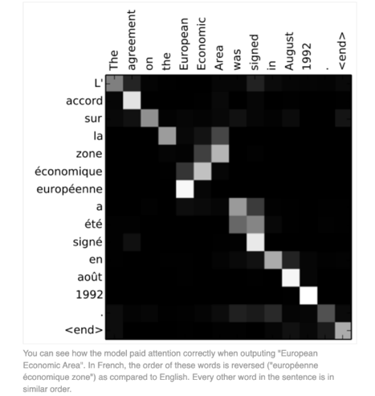  
   
The attention module enhances the encoder-decoder model by allowing it to dynamically focus on the most relevant parts of the input sentence, improving translation accuracy.  
  
**Drawbacks of RNN**  
  
  
  
  
## Python Demo  
  
  
  
**Model building**  
  
For most of the attention-based NMT models, the process remains the same as earlier since we are working on the same data set. In the next video, Mohit will take you through the entire implementation and will help you understand the changes that are introduced to make the model prediction better and solve the information bottleneck problem.  
  
  
**Transcript**  
  
**Introduction to Attention Mechanism in Encoder-Decoder Architecture**  
A very warm welcome to you, learners.In this model, we'll be looking at the implementation of the attention mechanism.We'll be extending our encoder decoder architecture to have the attention mechanism as well.So the data set remains mostly the same.We're using exactly the same data set and the same set of libraries.The the data preparation process also mostly remains the same.What changes really is the place where we start defining the encoder model with attention.  
00:00:33 - 00:01:56  
**Changes in Encoder Model with Attention Outputs**  
So just pay a close look here.There's not a lot of changes if you can really understand this architecture well and be able to appreciate the differences, which I'm going to highlight now.So if you see in the earlier example, when we were using the encoder decoder model, we didn't use the outputs which were getting produced here.So in this model, in the attention model, what really essentially changes is that now we're going to make use of these different attention outputs, which are the different outputs of the the encoder model also to be used in the decoder site.So this encoder output which is mentioned here essentially will be an array of the number of time steps which you have in the encoded encoding process with the batch size and the number of units which are defined, which we have as we have used in our example, which are defined as 1024.So this essential input goes into the decoder side and it's available all the places in all the decoding steps.One of the other modules which we added, and as you would have known from the lecture is this module called the attention model.So this attention model and this encoder output, how do we take care of that in the decoder site is essentially what changes from the previous example which you've already seen.So let's just take a deep dive there.In terms of the encoder architecture, it's exactly the same like what we had used earlier.  
00:01:56 - 00:02:36  
**Understanding Badanu's Attention Model**  
We have the return sequences equal to true, we had the same, but what we were not doing in our example is actually using these encoder outputs.So let's first look at the Badanu's attention model, which we'll be implementing, and then see how we can use the encoder outputs of the encoder layer in the decoder.So these are the two critical changes which you should focus on to understand the difference between the previous sequence to model the traditional one which we discussed and the attention model.So if you see in this Bodanos attention model, the the essential process, how the attention works is determined by a query and a value.  
00:02:36 - 00:03:28  
**Query and Value in Attention Mechanism**  
So the the query is what is on the hidden side.The hidden state of the decoder is the query and the values is the values of the encoder output which are available on the encoder side.What we have to eventually do is to produce some sort of a scalar values to be available from for different.So just to know that which is the encoder output which you should be most concerned with while decoding.So this is essentially what this step is doing this formula you would have already seen in the the lectures where there's this is what we define as the out the the scoring mechanism for a Badano's model.1 of the things which sometimes confuses learners is this thing called how do, why do we need to have these different the shapes which are there.  
00:03:28 - 00:04:11  
**Attention Weights and Context Vector**  
So one thing which you can just think about as intuitively as something which will help in your understanding is that once we are essentially when we are dealing with multiple time steps, this second dimension helps us in which time step we are.But when we want to take an output of it, we essentially want to work with the lower dimension where we don't need this time step.So this is the reason why we sometimes change.We have used this in a few examples to downsize and upsize.Let's just see what the Badanu's attention model is essentially doing.So we finally get the attention weights which are the softmax output of these score values.  
00:04:12 - 00:05:02  
**Changes in Decoder with Attention Layer**  
So this is essentially working on the outputs and giving us for every encoder, every encoder step, what's the value of these different weights.So if suppose the attention weight is higher for one of the encoding layers, it would mean it has more attention of the decoder when it's trying to decode. weighted average..  
  
The other thing which we do is we actually do a weighted sum of the attention weights along with the hidden values so that we have a context lecture which takes care of the different attention weights.So you can think about it as if you're doing a **weighted average**.It gives gives the recorder a better sense of which words to focus upon and which words to not focus upon.So this is we defined this attention layer additionally.  
00:05:02 - 00:06:13  
**Training Model with Attention and Teacher Forcing**  
So now that we've understood the Badanu's attention mechanism, let's take a closer look at what changes are there in the decoder.So one of the things which you notice is that you have this encoder output being passed to the call of the decoder which was not there in this traditional sequence to sequence sequence model which was not using attention.So once we use this encoder output, we pass it to the attention layer and get the weighted context vector and attention weights.So one of the things which we use this context vector is you can see it from the above explanation which has been provided that we concatenate that with the input which is there.So you can note that the input dimension is having a time step field as well.So there it's like batch size, time step, the embedding dimension.But what we want is that we would want this shape to also consider the embedding plus hidden.So you expand the dimension of the context vector to include that 10 step dimension which was missing.And then you concatenate and finally the the output the the return value is being passed back, although attention weights are being passed back.  
00:06:13 - 00:07:05  
**Interpreting Attention Weights and Output**  
But this is something which we'll use for plotting.It's not something which is used further in the model in any way.Finally we come to the the training of the model.The most important part.And just to note that this essentially the most of the stuff remains the same except for this again this minor change when we are doing the training step.What essentially changes is this encoder output getting added to the train step in the decoder function.We were not like the output of this was available to us in the sequence model as well in the traditional sequence model as well, but we were not using it.Now we have just passed this parameter which gets output off the encoder into the decoder and we are starting to make predictions.One of the things which we didn't discuss in very great detail, which is very important to notice, this concept of teacher forcing.  
00:07:05 - 00:08:10  
**Handling Longer Sentences with Attention Model**  
So what you would expect typically is that what the predictions are being made to be actually be passed back into the input value, right?This is what you would expect.But in the teacher forcing concept, as we discussed in some detail in the previous example, this actually uses the target which is the.Essentially when we know what is the translated word, we are passing that and it is said that it improves the training process, it gives a better output.So this is one key difference.Otherwise, most of this training step remains the same.We go through this training process.We have used a different epoch size here.This since there's added parameters which are added because of the attention layer.This training takes a little more time.It takes around 2 1/2 hours, 3 hours.We are using the checkpointed 1 so we are just showing you the output.But once you run this, it will take you 3 hours.You need to just as in the previous worksheet.You just need to make this as true and you can run this training sample.So we've essentially looked at what changes which have been made, right?Let's just see how the output looks like.  
00:08:10 - 00:11:18  
**Beam Search Algorithm in Translation Model**  
One of the things which we have modified in this output is that we've also given you a matplotlib plot of the attention weights and we're just going to see the input.So now I use the same translate function and I'm using the plotting.That's why it's true.And I say I'm hungry and it says me Bukata, which is probably not a very accurate, but it it essentially gives you the output how you would like to interpret this visual map of the attention weights is important.As you can see from these that we have used this phone called where it is.So if you just go to the Matlotlab and just check out the word is.So you'll see that attention this these values are the lower values, the dark Blues and the yellows are the high, high values.So if you see here Hungary, although it's the third word, but buka is the second word, but it gets more attention.So it gets a yellow here and I and may which is again in green.So this is how you can interpret this.Now coming to the, the very important aspect which we thought that we were why we were doing the attention is to be able to handle longer sentences.Let's see how the new model which we have built performs on slightly longer, longer sentences.In the traditional model, it's it didn't just work right, right.It didn't give a very bad translation.But if you see here, it's done a much better job.It remembers that the first thing was mujhe buk lagi hai, mujhe kuch khana khane ke liye.A little bad here.But otherwise it's done a very good job.And again, you can interpret this.You can see that eat although was the last word in the input, but eat came in a lot earlier, Hana and Khan here.And you can see very high attention rates for this.So brilliant.We have now moved ahead and now we are able to solve.We are able to translate longer sentences with much greater accuracy.So we have run the blue example, although it's not directly comparable, but you'll see that you can compare the output.If you're fine tuning your model, you can use the blue to make some sort of adjustments.The last thing which you would like to discuss in this module is something called the beam search.If you remember we talked about it in the lecture where we looked at how we can use a beam instead of just using the greedy search algorithm.So once we start the beam as the where we look at more number of options than just the greedy search.So we are trying to output in this example, we are fed in I am hungry and we have kept a beam size of three.So when we take the beam size of three, we get 3 translated values Mujhebuk lagi here, Mujhebuk lagi here with a Viram sign instead of the full stop and mehbuka.So this is the BEAM output and you can see the values of these BEAM outputs are given out as probability.So this is a brilliant way to also further improve our model.Those who are inclined to understand this BEAM implementation can just look at this.Otherwise this is optional.  
00:11:18 - 00:11:48  
  
You can see that essentially what we are doing is we are calling this in the encode, we are calling the BEAM search step recursively and essentially we are running three parallel.The beam size is 3, so we are running three parallel encoder and decoders.But this essentially is what we covered in the lectures and this should give you a good view now how to implement both the traditional model and the model with attention.  
  
  
  
The following image shows us the entire architecture of the attention-based NMT model you are going to build.  
   
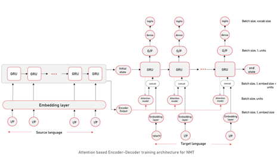  
   
   
As seen in the video the Encoder remains the same, however, the encoder output is not discarded here and is used as an input to the attention model.   
   
**Attention model**  
To the decoder, the **encoder_output** is added as an added input to generate the context vector. The encoder_output and decoder's hidden state is passed as input to the **Bahdanau's attention model** (Additive attention).   
Here is the code for the attention model:  
   
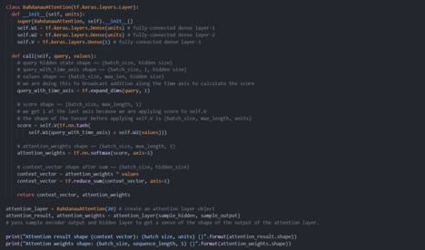  

Once you have built your attention model successfully you can observe:   
   
Attention result shape (context vector): **(batch size, units) =  **(64, 1024)  
Attention weights shape: **(batch_size, sequence_length, 1) = **(64, 72, 1)  
   
Once the context vector is generated, it is then concatenated with the output from the embedding layer. This concatenated result is fed to the GRU layer as input. The other components of the Decoder remain the same.  
   
In the end, you have seen how beam search improves the model performance and how it performs a better job even when it is fed with longer sentences. To understand more on the beam search refer the beam_search_step the function used in the demonstration.  
   
You are now ready to experiment with encoder-decoder model and attention models and how they can be tuned to increase the model’s performance.   
   
In the next segment, we will summarise your learnings from this session.  
  
## Summary  
  
  
* The encoder-decoder architecture, which is essential for capturing contextual information in sequences  
* Implementation of encoder-decoder model on converting a sentence from source language to target language  
* The challenges faced by traditional encoder-decoder models, particularly with long sentences, the inefficiencies of sequential computations and, how we can improve model's performance using attention  
* Graphical illustrations that clarified the proposed model’s structure and functionality  
* The mathematics behind the decoder, emphasising its role in processing context vectors  
* The training process for an encoder-decoder model with attention, which enhances the model's ability to focus on relevant parts of the input sequence  
* Implementation of encoder-decoder model with attention on converting a sentence from source language to target language  
   
   
In the next session, you will learn how to develop a mechanism that processes these vectors parallelly instead of sequentially.  
  
  
## Intuition Behind Transformers  
  
  
## Intro  
  
Welcome to the session titled ‘Intuition Behind Transformers.”  

In previous sessions, you learned about traditional encoder-decoder models and gained an understanding of their sequential processing of words. This approach, while effective, struggles with inefficiencies and time-consuming processes, particularly with long sentences. This approach required processing each word one by one to generate context vectors, which could be slow and exhaustive.  

In this session, you will explore a mechanism that addresses these challenges. You will focus on processing vectors parallelly rather than sequentially by taking a novel approach to attention that enhances the efficiency and speed of handling input sequences. You will learn how to utilize the different features provided by the Transformer API. These features will help you perform different NLP tasks, and among them, the easiest to use is the pipeline() function. Once you have a good understanding of this function, you will learn about the tokenizer() function to understand how a transformer preprocesses numerical inputs to output predictions. You will also learn how to process multiple sentences and pass them to the model for predictions simultaneously. Finally, you will apply what you learned to fine-tune a BERT model to perform the task of Quora question-pair similarity.   

In this session, you will:  
* Understand the intuition behind parallel processing in transformers  
* Learn about the high-level architecture of transformers through practical examples  
* Discover how the encoder and decoder works in transformers  
* Examine the roles of self-attention and encoder-decoder attention in refining and selecting the next word, highlighting how these mechanisms enhance the model's performance  
* Apply the pipeline() function to perform NLP tasks such as text generation and classification  
* Configure both tokenizer and transformer models to perform an NLP task  
* Fine-tune a transformer model for a custom use-case of Quora question-pair similarity  
  
  
## Part 1 Parallelization  
  
That's why not needed above stuff..  
  
  
In this video, the professor previously discussed how attention mechanisms enhance language translation in RNN-based encoder-decoder models. However, transformers use attention differently to enable parallel processing, which makes them faster and more efficient.  
   
In transformers, the core concept of attention remains the same, but it is applied in a way that enables the model to process data parallelly rather than sequentially. This parallelisation is key to handling long sentences and complex tasks efficiently.  
   
   
  

The transformer architecture, introduced in the research paper ‘++[Attention Is All You Need](https://arxiv.org/abs/1706.03762)++,’ revolutionised natural language processing by combining attention with parallelisation. This approach significantly improved performance of the transformers in various NLP tasks, including models such as GPT. The core philosophy remains intact - context matters and words depend on their neighbours to establish meaning. However, transformers offer faster computation and the ability to handle lengthy sentences.   

For example, imagine building a transformer model that translates an English sentence into Python code, such as converting the sentence ‘Python statement to print hello world’ into the correct Python code as shown below.
                           
This example illustrates how transformers can be applied beyond traditional language tasks, extending to programming languages.  
   
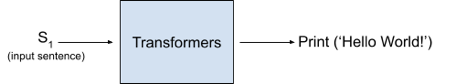  
   
You may now ask this question: How do you train a transformer to accomplish these tasks? The answer lies in understanding the transformer architecture, its use of attention, and its ability to process information in parallel,  
  
  
  
  
In this video, the professor previously discussed how attention mechanisms enhance language translation in RNN-based encoder-decoder models. However, transformers use attention differently to enable parallel processing, which makes them faster and more efficient.  
   
In transformers, the core concept of attention remains the same, but it is applied in a way that enables the model to process data parallelly rather than sequentially. This parallelisation is key to handling long sentences and complex tasks efficiently.  
   
   
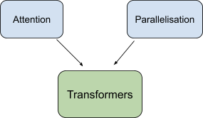  

The transformer architecture, introduced in the research paper ‘++[Attention Is All You Need](https://arxiv.org/abs/1706.03762)++,’ revolutionised natural language processing by combining attention with parallelisation. This approach significantly improved performance of the transformers in various NLP tasks, including models such as GPT. The core philosophy remains intact - context matters and words depend on their neighbours to establish meaning. However, transformers offer faster computation and the ability to handle lengthy sentences.   

For example, imagine building a transformer model that translates an English sentence into Python code, such as converting the sentence ‘Python statement to print hello world’ into the correct Python code as shown below.
                           
This example illustrates how transformers can be applied beyond traditional language tasks, extending to programming languages.  
   
  
   
You may now ask this question: How do you train a transformer to accomplish these tasks? The answer lies in understanding the transformer architecture, its use of attention, and its ability to process information in parallel,  
  
  
  
  
  
  
  
##   
  
  
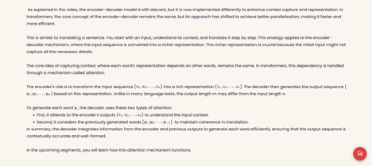  
  
## Introduction to Transformer Architecture  
  
   
In this video, the professor introduced the concept of attention using a group project analogy. Suppose you are part of a team of five working on a task. Each member independently reads different chapters from a book and then discusses their findings with other members.  

During your independent work, each person reads and understands their chapter, formulates questions about it, and develops key insights. In technical terms:  
* The understanding gained is called the **value (V).**  
* The questions you have are called **queries (Q)**.  
* The key insights are called **keys (K)**.  
When the team meets, each person shares their questions and insights. The group members whose insights match with the questions provide answers. This is similar to the working of the attention model. The decoder uses the keys (K) from the encoder’s outputs and the queries (Q) from the current input to find relevant information. The similarity between each query and key is computed, usually with a dot product, and the result is used to generate attention weights. This can be mathematically represented as follows.  
  
same as python dictionary and MIT stuff.. parallel and weighted combination..   
  
  
  
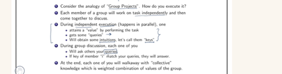  
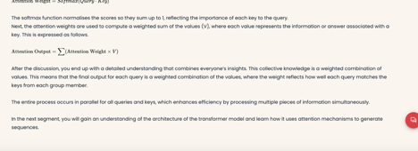  
  
So this is an architecture I want to expose you to the architecture of the of the Transformers before we go and look at each detail very carefully and you know, in a detailed man fashion.So these are the initial input embeddings, right?In the earlier example, you can say print a Python program for saying hello world.So that is that goes as an input.And these are your attention models, correct?These are your attention models.This will give you a richer representation of all the words in your input sentence.And using this, this is your encoder.  
00:00:41 - 00:01:11  
**Role of Encoder in Transformers**  
The job of encoder is given the input, get the richer representation.How did this richer representation come about?Go back to the analogy of group projects.All these words are essentially trying to do a group project of improving their own context, getting much richer representation.We will see the math, but intuition is that they kind of come up with richer vectors which accurately represent them and that is taken in decoder.So as I discussed earlier, decoder will have two attention models.  
00:01:11 - 00:01:40  
**Decoder and Attention Models in Transformers**  
This is first, this is what we call as a self attention model, attention model.And then this is your encoder decoder.That is the attention model which attends to the outputs of encoder.That is why you will have you have the sequence coming here.So this is we can refer to it as an encoder decoder attention model, attention model, right?So, and then you have the output.So how does this output look?  
00:01:40 - 00:02:51  
**Process of Generating Output in Transformers**  
First, let us say program to print the input S 1, which we have seen, right, the entire words, the sequence of words, the program to print Hello world.Then first it takes it.This will give a richer representation of each word in the sentence.This richer representation is being taken here.And then one first output is given.That is first print is given and then the print becomes an input to the decoder now, right, So current output, current output.Now it goes ahead and prints a bracket because that is your next token.Now print and bracket will become your second two inputs to this model and then you would get this quote, single quote and then this becomes an input and this process repeats until you get the entire piece of code.And you know this is what we are discussing.During inference training is of course parallelized and so on.But during inference this is how it works.First, output that comes as an input because as I said, go back to the intuition, when we are translating, we not just need the context of the input, but we need the context of what has been spoken so far.  
00:02:51 - 00:03:24  
**Inference and Contextual Understanding in Transformers**  
That is equally important as well.So this component tries to enrich the representation of the current outputs.And this attention model which we are referring to as an encoder decoder attention model, we will try to understand this is what has been translated so far and the encoder is telling me this is what they want.So what is missing?It tries to understand using matrix operations and then try to push this output and give you respective next correct word in the context.  
  
  
  
  
 As explained in the video, the architecture of transformers begins with initial input embeddings. For example, if the input is a task to generate a Python program to print ‘Hello, world!’ This request is processed through attention models, which create richer representations of all the words in the input sentence.   
   
The encoder generates these enhanced representations, which are then used by the decoder, which employs two types of attention models:  
* The first one is self-attention, which enables the decoder to focus on various parts of the current output sequence.  
* The second one is encoder-decoder attention, where the decoder attends to the encoder's outputs to incorporate context from the input sequence.  
You understood this process using an example - generating a Python program to print ‘Hello, world!’.  
   
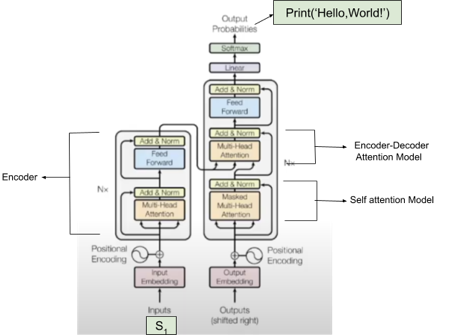  
  
1. 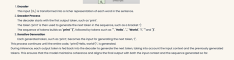  
  
During inference, each output token is fed back into the decoder to generate the next token, taking into account the input context and the previously generated tokens. This ensures that the model maintains coherence and aligns the final output with both the input context and the sequence generated so far.  
   
   
The next segment will cover a high-level overview of the working of transformers with the help of the same example discussed above.  
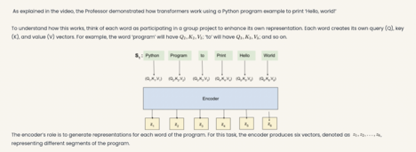  
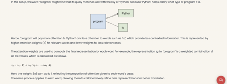  
   
 As explained in the video, the decoder's job is to generate the output step by step, starting from scratch. Initially, the decoder uses a ‘start’ token to signal the beginning of the translation process.   

At this point, the decoder does not need to focus on any input because translation has not begun yet. However, to generate the first word, such as ‘print,’ the decoder checks which encoder outputs are the most relevant. For example, the word ‘print’ might focus more on encoder outputs related to ‘Python’ and ‘program,’ giving less attention to less relevant words.  
   
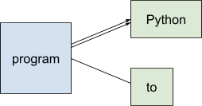  
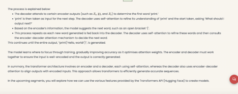  
As discussed previously, transformer models are usually quite large in the order of billion parameters. Therefore, creating and training them from scratch makes little sense. Since new variants of transformer models are developed every day, the team at Hugging Face has democratized the usage of such state-of-the-art models with the help of Transformer APIs.   
   
With such an API, it becomes easy for anyone to download any pre-trained models, load datasets, and tokenize the input as per the model requirements. Using pre-trained models can significantly reduce your compute costs and carbon footprint and save you the time and resources required to train a model from scratch.  
Here are the features of the Transformer API:  
* **Ease of use:** You can easily download, load, train, and save any state-of-the-art NLP model with few lines of code.  
* **Flexibility: **The API allows you to change the language/framework (TensorFlow or PyTorch) for the model in which it is developed/used because all models are simple PyTorch nn.Module or TensorFlow tf.keras.Model classes.  
* **Simplicity:** Transformers have a layered API that allows the programmer to engage with the library at various levels of abstraction.  
   
   
To understand the features of the Transformers API, let’s go through the next segment.  
  
Hugging Face offers the Transformer library API to democratize the usage of the state-of-the-art NLP models. The most significant advantage of such an API is the abstraction it provides, allowing developers to use this library quickly.  
   
Pipelines are a great and easy way to use all types of models for inference. These pipelines are objects that abstract most of the complex code from the library, offering a simple API dedicated to several tasks, including named entity recognition, masked language modelling, sentiment analysis, feature extraction, and question answering.  
   
The pipeline() function is the most powerful function offered by the API. It encapsulates all other pipelines and handles everything, including converting raw text into a set of predictions from a fine-tuned model.  
   
You can download the notebook used in this segment below.  
   
++[Introduction to Transformer API](https://cdn.upgrad.com/uploads/production/84344d86-1cd6-4d64-8c3f-85f2e6614af6/Intro%2Bto%2BTransformer-API(overview).ipynb)++  
   
In the upcoming video, you will learn more about the pipeline() function.  
   
As explained in the video above, the pipeline() function allows you to perform different tasks. Here, the function is used for text-generation.  
from transformers import pipeline
   
generator = pipeline("text-generation") generator("In the galaxy far far")  
Output:  
[{'generated_text': 'In the galaxy far far, far away in the far future, a strange, strange and beautiful force is taking over the galaxy; the galaxy.**\n\n**It does not know how this is happening.” **\n\n**- Roddenberry, The Hitch'}]  
   

The pipeline() function allows you to easily download any pre-trained model and perform any NLP task in just two lines of code.  
By default, the code above downloads the gpt2 model. However, you may change the model as per your requirement.
   
generator = pipeline("text-generation", model="distilgpt2") generator(     "In the galaxy far far",     max_length=**30**,     num_return_sequences=**2**, )  
Output:  
[{'generated_text': 'In the galaxy far far away, which mean a few million years ago. Now it’s looking at how much it can melt - maybe'},  {'generated_text': "In the galaxy far far, far away, it’s very familiar to the ancient history"}]  

Here, we are using the distilGpt2 model, which is a lighter variant of the gpt2 model. 
Also, you can pass custom arguments to control the output of the code given above. Here, max_length denotes the maximum length of the generated text, and num_return_sequences denotes the number of output sequences the model should return.  
Apart from text generation, you can do masked language modelling, where the downloaded model will predict masked words.  
unmasker = pipeline("fill-mask") unmasker("You are going to <mask> about a wonderful library today.", top_k=**2**)  
 
As the code above asks to make the top two predictions for the <mask> token, the model provides the following output in a dictionary, with their prediction score.  
Output:  
[{'score': **0.5679107308387756**,   'token': **1798**,   'token_str': ' hear',   'sequence': 'You are going to hear about a wonderful library today.'},  {'score': **0.22818315029144287**,   'token': **1532**,   'token_str': ' learn',   'sequence': 'You are going to learn about a wonderful library today.'}]  
   
Here, the model has predicted “hear” and “learn” as the top two predictions for the masked word.  
  
  
Let’s take a simple example of sentiment classification:  
input_sentences = [         "I don't like this movie",         "Upgrad is helping me learn new and wonderful things.",              ] classifier = pipeline("sentiment-analysis") classifier(     input_sentences )  
   
Output  
[{'label': 'NEGATIVE', 'score': **0.9839025139808655**},  {'label': 'POSITIVE', 'score': **0.9998325109481812**}]  
   
As you may observe, the model has returned NEGATIVE sentiment for the first sentence and Positive sentiment for the second sentence.  
The pipeline() function encapsulates the pre-processing, modelling and post-processing steps. Therefore, it can convert the input sentence into predictions easily.  

Let’s take a look at these steps.  
As you saw earlier, the pipeline() function uses the tokenizer function first to convert the raw text into its numerical representation. However, each model uses different tokenization techniques, which you may not be aware of. This is where the **AutoTokenizer.from_pretrained()** method comes into the picture. It automatically identifies the relevant tokenization technique pertaining to the specified model using the checkpoint name of the model.  
The AutoTokenizer.from_pretrained() method can fetch the data associated with the model’s tokenizer and cache it for re-use.  
**from** **transformers** **import** AutoTokenizer   model = "distilbert-base-uncased-finetuned-sst-2-english" tokenizer = AutoTokenizer.from_pretrained(model)  
 
Once the tokenizer function is initialized with the checkpoint/model name, you can feed your input sentence to pre-process it as per the model’s input expectations.
   
inputs = tokenizer(input_sentences, padding=**True**, truncation=**True**, max_length = **12**, return_tensors="tf",) pp.pprint(inputs)  
   
Output  
{'attention_mask': <tf.Tensor: shape=(**2**, **12**), dtype=int32, numpy= array([[**1**, **1**, **1**, **1**, **1**, **1**, **1**, **1**, **1**, **0**, **0**, **0**],        [**1**, **1**, **1**, **1**, **1**, **1**, **1**, **1**, **1**, **1**, **1**, **1**]], dtype=int32)>,  'input_ids': <tf.Tensor: shape=(**2**, **12**), dtype=int32, numpy= array([[  **101**,  **1045**,  **2123**,  **1005**,  **1056**,  **2066**,  **2023**,  **3185**,   **102**,             **0**,     **0**,     **0**],        [  **101**,  **2039**, **16307**,  **2003**,  **5094**,  **2033**,  **4553**,  **2047**,  **1998**,          **6919**,  **2477**,   **102**]], dtype=int32)>}  
   
The returned output is in the form of a dictionary containing the following keys: 'attention_mask' and  'input_ids'.
The last three 0’s **[1, 1, 1, 1, 1, 1, 1, 1, 1, 0, 0, 0]** in “input_ids” signifies the padded values as padding=True and max_length = 12.  
   
Once the raw input is pre-processed, we can feed it to the model to get the predictions. 
We can download the model the same way as we have downloaded the tokenizers. To download it, the Transformers API provides the **TFAutoModel** class with the from_pretrained method.
In this case, we will use **TFAutoModelForSequenceClassification** to download a distilbert model with a sequence classification head.  
   
**from** **transformers** **import** TFAutoModelForSequenceClassification   checkpoint = "distilbert-base-uncased-finetuned-sst-2-english" model = TFAutoModelForSequenceClassification.from_pretrained(model) outputs = model(inputs) pp.pprint(outputs.logits.shape)  
 
After the model produces the output, you may observe the shape of the output.  
Output:  
TensorShape([**2**, **2**])  
   
Here, the row signifies the number of input sentences fed to it and the column signifies the number of labels at the output.  
You can also visualize the prediction score using:  
pp.pprint(outputs.logits)  
Output:  
<tf.Tensor: shape=(**2**, **2**), dtype=float32, numpy= array([[ **2.2426074**, -**1.870255** ],        [-**4.1284227**,  **4.432841** ]], dtype=float32)>  
   
This output can be normalized using a softmax function.  
predictions = tf.math.softmax(outputs.logits, axis=-**1**) pp.pprint(predictions)  
Output:  
<tf.Tensor: shape=(**2**, **2**), dtype=float32, numpy= array([[**9.8390251e-01**, **1.6097505e-02**],        [**1.9134062e-04**, **9.9980873e-01**]], dtype=float32)>  
   
The output indicates that the first sentence is classified as Negative because the first column has a higher value. The second sentence is classified as Positive because the second column has a higher value.  
   
In the next segment, you will explore the tokenization pipeline.  
  
  
Let’s take a simple example of sentiment classification:  
input_sentences = [         "I don't like this movie",         "Upgrad is helping me learn new and wonderful things.",              ] classifier = pipeline("sentiment-analysis") classifier(     input_sentences )  
   
Output  
[{'label': 'NEGATIVE', 'score': **0.9839025139808655**},  {'label': 'POSITIVE', 'score': **0.9998325109481812**}]  
   
As you may observe, the model has returned NEGATIVE sentiment for the first sentence and Positive sentiment for the second sentence.  
The pipeline() function encapsulates the pre-processing, modelling and post-processing steps. Therefore, it can convert the input sentence into predictions easily.  

Let’s take a look at these steps.  
As you saw earlier, the pipeline() function uses the tokenizer function first to convert the raw text into its numerical representation. However, each model uses different tokenization techniques, which you may not be aware of. This is where the **AutoTokenizer.from_pretrained()** method comes into the picture. It automatically identifies the relevant tokenization technique pertaining to the specified model using the checkpoint name of the model.  
The AutoTokenizer.from_pretrained() method can fetch the data associated with the model’s tokenizer and cache it for re-use.  
**from** **transformers** **import** AutoTokenizer   model = "distilbert-base-uncased-finetuned-sst-2-english" tokenizer = AutoTokenizer.from_pretrained(model)  
 
Once the tokenizer function is initialized with the checkpoint/model name, you can feed your input sentence to pre-process it as per the model’s input expectations.
   
inputs = tokenizer(input_sentences, padding=**True**, truncation=**True**, max_length = **12**, return_tensors="tf",) pp.pprint(inputs)  
   
Output  
{'attention_mask': <tf.Tensor: shape=(**2**, **12**), dtype=int32, numpy= array([[**1**, **1**, **1**, **1**, **1**, **1**, **1**, **1**, **1**, **0**, **0**, **0**],        [**1**, **1**, **1**, **1**, **1**, **1**, **1**, **1**, **1**, **1**, **1**, **1**]], dtype=int32)>,  'input_ids': <tf.Tensor: shape=(**2**, **12**), dtype=int32, numpy= array([[  **101**,  **1045**,  **2123**,  **1005**,  **1056**,  **2066**,  **2023**,  **3185**,   **102**,             **0**,     **0**,     **0**],        [  **101**,  **2039**, **16307**,  **2003**,  **5094**,  **2033**,  **4553**,  **2047**,  **1998**,          **6919**,  **2477**,   **102**]], dtype=int32)>}  
   
The returned output is in the form of a dictionary containing the following keys: 'attention_mask' and  'input_ids'.
The last three 0’s **[1, 1, 1, 1, 1, 1, 1, 1, 1, 0, 0, 0]** in “input_ids” signifies the padded values as padding=True and max_length = 12.  
   
Once the raw input is pre-processed, we can feed it to the model to get the predictions. 
We can download the model the same way as we have downloaded the tokenizers. To download it, the Transformers API provides the **TFAutoModel** class with the from_pretrained method.
In this case, we will use **TFAutoModelForSequenceClassification** to download a distilbert model with a sequence classification head.  
   
**from** **transformers** **import** TFAutoModelForSequenceClassification   checkpoint = "distilbert-base-uncased-finetuned-sst-2-english" model = TFAutoModelForSequenceClassification.from_pretrained(model) outputs = model(inputs) pp.pprint(outputs.logits.shape)  
 
After the model produces the output, you may observe the shape of the output.  
Output:  
TensorShape([**2**, **2**])  
   
Here, the row signifies the number of input sentences fed to it and the column signifies the number of labels at the output.  
You can also visualize the prediction score using:  
pp.pprint(outputs.logits)  
Output:  
<tf.Tensor: shape=(**2**, **2**), dtype=float32, numpy= array([[ **2.2426074**, -**1.870255** ],        [-**4.1284227**,  **4.432841** ]], dtype=float32)>  
   
This output can be normalized using a softmax function.  
predictions = tf.math.softmax(outputs.logits, axis=-**1**) pp.pprint(predictions)  
Output:  
<tf.Tensor: shape=(**2**, **2**), dtype=float32, numpy= array([[**9.8390251e-01**, **1.6097505e-02**],        [**1.9134062e-04**, **9.9980873e-01**]], dtype=float32)>  
   
The output indicates that the first sentence is classified as Negative because the first column has a higher value. The second sentence is classified as Positive because the second column has a higher value.  
   
In the next segment, you will explore the tokenization pipeline.  
  
2.  
Suppose you pass three sentences to the model to perform sentiment classification (0: Negative, 1: Positive). After the pre-processed text is passed as an input to the model, what would be the dimension of the final output?  
  
  
  
  
  
  
  
As you learned earlier, the first component inside the pipeline() function is pre-processing, which is done by the tokenizers inside the Transformer API. The tokenizers convert the text in the raw format and transform it into the desired manner, for the model to start processing. Since no model can feed raw text automatically, the first job of tokenizers is to convert text inputs to numerical data.   

In this segment, Ankush will explain what exactly happens in the tokenization pipeline.  
   
  
  
  
Let’s understand how input text is processed.  
tokenized_text = "Learning NLP is so much rewarding".split()  
pp.pprint(tokenized_text)  
Output:  
['Learning', 'NLP', 'is', 'so', 'much', 'rewarding']  
   
Here, the input is split into each of the tokens using the split() function. However, the transformer tokenizers convert the input text into the numerical representation of each of the tokens.   
**from** **transformers** **import** BertTokenizer  
tokenizer = BertTokenizer.from_pretrained("bert-base-cased")  
tokenizer("Learning NLP is so much rewarding")  
Output:  
{'input_ids': [**101**, **9681**, **21239**, **2101**, **1110**, **1177**, **1277**, **10703**, **1158**, **102**], 'token_type_ids': [**0**, **0**, **0**, **0**, **0**, **0**, **0**, **0**, **0**, **0**], 'attention_mask': [**1**, **1**, **1**, **1**, **1**, **1**, **1**, **1**, **1**, **1**]}  
   
Note: Here, we have downloaded the tokenizer used in the BERT model.  
Here, you may observe that the input text is transformed into a dictionary consisting of the following three keys: **'input_ids', 'token_type_ids' and 'attention_mask'.**  
Let’s first see how each word is tokenized.  
tokens = tokenizer.tokenize("Learning NLP is so much rewarding", )  
pp.pprint(tokens)  
Output  
['Learning', 'NL', '##P', 'is', 'so', 'much', 'reward', '##ing']  
 
Here, we have used the Subword tokenization technique. This type of tokenization algorithm relies on the principle that frequently used words should not be split into smaller subwords, but rare words should be decomposed into meaningful subwords. This helps in avoiding a large vocabulary and thus ensures faster processing. 
After these tokens are generated, they can be converted into 'input_ids' using the **convert_tokens_to_ids** method.
   
ids = tokenizer.convert_tokens_to_ids(tokens)  
pp.pprint(ids)  
   
Output:  
[**9681**, **21239**, **2101**, **1110**, **1177**, **1277**, **10703**, **1158**]  
   
However, the input_ids generated earlier consists of more values, which are given below.  
 'input_ids': [**101**, **9681**, **21239**, **2101**, **1110**, **1177**, **1277**, **10703**, **1158**, **102**]  
   
On comparing, you notice that the special tokens,** start id(101) **and **end id(102)**, are missing in the returned output.  
tokens = tokenizer.tokenize("Learning NLP is so much rewarding", add_special_tokens = **True** )  
pp.pprint(tokens)  
ids = tokenizer.convert_tokens_to_ids(tokens)  
pp.pprint(ids)  
Output:  
['[CLS]', 'Learning', 'NL', '##P', 'is', 'so', 'much', 'reward', '##ing', '[SEP]']  
[**101**, **9681**, **21239**, **2101**, **1110**, **1177**, **1277**, **10703**, **1158**, **102**]  
   
 
While decoding, you may also get the special tokens that are not required in production.  
[CLS] Learning NLP **is** so much rewarding [SEP].  
   
You may prevent these special tokens from being generated by using the following argument: **skip_special_tokens=True**  
   
tokenizer.decode(ids, skip_special_tokens=**True**)  
Output:  
Learning NLP **is** so much rewarding  
   
Great! Now you know how a sentence is converted into tokens and then converted into ids. But what if we have multiple sentences?  
  
  
  
  
  
Let’s take a look at another example.  
tokenized_output = tokenizer(["Learning NLP is so much rewarding","Another test sentence"])  
tokenized_output['input_ids']  
Output:  
[[**101**, **9681**, **21239**, **2101**, **1110**, **1177**, **1277**, **10703**, **1158**, **102**],  
 [**101**, **2543**, **2774**, **5650**, **102**]]  

Here, the tokenized outputs are not of the same length. The tokenizer function allows us to control the output using the following argument: padding and truncation. 
   
sequences = ["Learning NLP is so much rewarding","Another test sentence"]  
# Will pad the sequences up to the maximum sequence length  
model_inputs = tokenizer(sequences, padding="longest")  
pp.pprint(model_inputs)  
   
Since both input sequences are of different lengths, we have applied padding based on the maximum length. Here, the first sequence has 10 words, so the token length is 10.
The second sequence needs another 5 tokens to fill this gap, so it adds them by padding 0’s at the tail. This is reflected in attention_mask and input_ids.  
Output:  
'attention_mask': [[**1**, **1**, **1**, **1**, **1**, **1**, **1**, **1**, **1**, **1**], [**1**, **1**, **1**, **1**, **1**, **0**, **0**, **0**, **0**, **0**]]  
'input_ids': [[**101**, **9681**, **21239**, **2101**, **1110**, **1177**, **1277**, **10703**, **1158**, **102**],  
               [**101**, **2543**, **2774**, **5650**, **102**, **0**, **0**, **0**, **0**, **0**]],  
   
The 0’s in the attention masks signal the model to ignore them, as they are empty entries and consider only values that are marked 1.  
If we apply max_length to the padding, it will add 0’s till the maximum dimension of the model, which is 512 in this case.   
model_inputs = tokenizer(sequences, padding="max_length", max_length=**6**)  
pp.pprint(model_inputs)  
   
However, this is an inefficient method if the input sequences are short in length. This is because the gap between the text length and max_length is filled by 0’s, which ultimately increases the processing time.   
Instead of applying padding, you may truncate the values.  
model_inputs = tokenizer(sequences, max_length=**6**, truncation=**True**)  
pp.pprint(model_inputs)  
   
Output:  
   
{'attention_mask': [[**1**, **1**, **1**, **1**, **1**, **1**], [**1**, **1**, **1**, **1**, **1**]],  
 'input_ids': [[**101**, **9681**, **21239**, **2101**, **1110**, **102**], [**101**, **2543**, **2774**, **5650**, **102**]],  
 'token_type_ids': [[**0**, **0**, **0**, **0**, **0**, **0**], [**0**, **0**, **0**, **0**, **0**]]}  
   
Here, all the tokens are adjusted to the length of 6. Therefore, no 0’s are added in attention_mask. However, max_length should be applied carefully because truncation removes the information/tokens.  
  
  
You can also change the returned output to a different language/framework using the **return_tensors **argument. Let’s see how to do this in the next video.  
This brings us to the end of the session on tokenization pipeline. However, we have not looked at the utility of '**token_type_ids**'. In the next segment, you will learn about 'token_type_ids' with the help of a case study. In this case study, we need two different sequences to be joined in a single “input_ids” entry.  
  
  
  
  
  
  
In this segment, we will use one of the variants of the Transformer model, BERT, and fine-tune it to perform sentence-pair classification. This task is part of the semantic textual similarity problem, wherein you are provided with two pairs of questions and are required to model the textual interaction between them.  
   
You can download the notebook used in this segment from below:  
   
++[Fine_tuning_BERT_for_Sentence_Pair_Classification](https://cdn.upgrad.com/uploads/production/553d5807-0e70-4f79-9e5c-4e2b34d23fe3/Fine_tuning_BERT_for_Sentence_Pair_Classification.ipynb)++  
   
In the next video, Ankush will explain the problem statement and the data used.  
   
  
  
  
  
  
Here is the problem statement: Predict whether any given two sentences (questions) are semantically similar to each other. We will use the Quora Question Pair (QQP) data set, which is part of the GLUE benchmark. We will use two evaluation metrics, F1 and accuracy metrics.  
   
By the end of this case study, you should be able to:
Work with Hugging Face data sets
Load, train and save BERT-based models (BERT and ALBERT, among others)
Perform end-to-end implementation (training, validation, prediction, and evaluation)  

You can download the data set from ++[this ](https://drive.google.com/drive/folders/1NwwS0v1o3vPYUgKfQZzVj-I8ivVAvSn2?usp=sharing)++link.  
   
train = pd.read_csv('/content/drive/MyDrive/sentence_pair_classification_data/train.csv')  
train.sample(**5**)  
   
 Output:
   
  
   
   
There are 363,846 entries of data with the following four columns: question1, question2, label, and idx. However, to use the Transformer API, we need to use the load_datset() function, which automatically converts the given data into a dictionary.  
dataset = load_dataset('csv', data_files={'train': '/content/drive/MyDrive/sentence_pair_classification_data/train.csv',\  
                                          'valid':'/content/drive/MyDrive/sentence_pair_classification_data/val.csv',  
                                          'test': '/content/drive/MyDrive/sentence_pair_classification_data/test.csv'},)  
   
Output:  
DatasetDict({  
    train: Dataset({  
        features: ['question1', 'question2', 'label', 'idx'],  
        num_rows: **363846**  
    })  
    valid: Dataset({  
        features: ['question1', 'question2', 'label', 'idx'],  
        num_rows: **40430**  
    })  
    test: Dataset({  
        features: ['question1', 'question2', 'label', 'idx'],  
        num_rows: **390965**  
    })  
})  
   
In order to pre-process the inputs, we need to initialize the model_name/checkpoint and load the tokenizer such that it can automatically load the tokenizer for it.  
model_checkpoint = "bert-base-cased"  
**from** **transformers** **import** AutoTokenizer  
tokenizer = AutoTokenizer.from_pretrained(model_checkpoint)  
 
After the tokenizer is loaded, we can apply it to a sample input, as given below.  
tokenizer(train.question1[**0**], train.question2[**0**],   
                                      padding='max_length',  # Pad to max_length  
                                      truncation=**True**,  # Truncate to max_length  
                                      max_length=**100**,    
                                      return_tensors='tf',return_token_type_ids = **True**)   

The output is a dictionary consisting of the following three keys:  
**'input_ids', 'token_type_ids' and 'attention_mask'.**  
   
We need to handle the two sequences as a pair and apply the appropriate preprocessing simultaneously. For this, we pass both questions as combined input_ids, which is performed with the help of special tokens, such as the classifier ([CLS]) and separator ([SEP]) tokens. Also, the BERT model expects the processed input in the format in which two sentences are separated using [SEP] tokens.  
However, since padding is maintained at 100(max_length), the extra values in the input_ids are filled with 0’s.  
Generally, special tokens are capable for the model to understand the presence of two sequences. However, the BERT models take in token_type_ids as well. These ids are represented as a binary mask identifying the two types of sequences in the model, where all the tokens of the first sequences are filled with 0’s and all the tokens of the second sequences are filled with 1’s.  
For example, if the first question is of 10 tokens and the second question is of 8 tokens, you will observe the following output:  
'token_type_ids': [**0**, **0**, **0**, **0**, **0**, **0**, **0**, **0**, **0**, **0**, **1**, **1**, **1**, **1**, **1**, **1**, **1**, **1**]  
   
To return these ids, you need to set the argument **return_token_type_ids = True.**  
  
  
  
To apply the tokenizer to the entire data set, we need to first create a function and apply it using the map() function.  
**def** **preprocess_function**(records):  
    **return** tokenizer(records['question1'], records['question2'], truncation=**True**, return_token_type_ids=**True**, max_length = **75**)  
encoded_dataset = dataset.map(preprocess_function, batched=**True** )  
 Output:  
DatasetDict({  
    train: Dataset({  
        features: ['question1', 'question2', 'label', 'idx', 'input_ids', 'token_type_ids', 'attention_mask'],  
        num_rows: **363846**  
    })  
    valid: Dataset({  
        features: ['question1', 'question2', 'label', 'idx', 'input_ids', 'token_type_ids', 'attention_mask'],  
        num_rows: **40430**  
    })  
    test: Dataset({  
        features: ['question1', 'question2', 'label', 'idx', 'input_ids', 'token_type_ids', 'attention_mask'],  
        num_rows: **390965**  
    })  
})  
   
However, the transformed data set consists of original features, so we need to remove them once the data set is encoded.  
pre_tokenizer_columns = set(dataset["train"].features)  
tokenizer_columns = list(set(encoded_dataset["train"].features) - pre_tokenizer_columns)  
print("Columns added by tokenizer:", tokenizer_columns)  
Output  
Columns added by tokenizer: ['token_type_ids', 'attention_mask', 'input_ids']  
 
Now that you have encoded and processed the input, the next step is to convert the format of the data set to be compatible with the chosen Tensorflow framework using the to_tf_dataset() function. You also need to import a data collator from the Transformers to combine the varying sequence lengths into a single batch of equal lengths.  
  
  
  
  
Here is the code to create the train and validation dataset:  
**from** **transformers** **import** DataCollatorWithPadding  
   
data_collator = DataCollatorWithPadding(tokenizer=tokenizer, return_tensors="tf",)  
   
   
tf_train_dataset = encoded_dataset["train"].to_tf_dataset(  
    columns=tokenizer_columns,  
    label_cols=["labels"],  
    shuffle=**True**,  
    batch_size=batch_size,  
    collate_fn=data_collator,  
)  
tf_validation_dataset = encoded_dataset["valid"].to_tf_dataset(  
    columns=tokenizer_columns,  
    label_cols=["labels"],  
    shuffle=**False**,  
    batch_size=batch_size,  
    collate_fn=data_collator,  
)  
Note: Here, we have utilized shuffling to apply variation for the training data set only.
 
Since the transformed tf.dataset is an iterator object, we can check one sample from it using the next() function to observe how the processing is executed.
   
z = next(iter(tf_train_dataset))  
tokenizer.decode(z[**0**]['input_ids'][**0**])  
   
Output:  
[CLS] How should I prepare **for** CA final law? [SEP] How should I prepare **for** CA final law? [SEP] [PAD] [PAD] [PAD] [PAD] [PAD] [PAD] [PAD] [PAD] [PAD] [PAD] [PAD] [PAD] [PAD] [PAD] [PAD] [PAD] [PAD] [PAD] [PAD] [PAD] [PAD] [PAD] [PAD] [PAD] [PAD] [PAD] [PAD] [PAD] [PAD] [PAD] [PAD] [PAD] [PAD] [PAD] [PAD] [PAD] [PAD] [PAD] [PAD] [PAD] [PAD] [PAD] [PAD] [PAD] [PAD] [PAD] [PAD] [PAD] [PAD] [PAD] [PAD] [PAD] [PAD] [PAD] [PAD] [PAD] [PAD] [PAD] [PAD] [PAD] [PAD] [PAD] [PAD] [PAD]  
 
You may have noticed the presence of special tokens(to separate the two question inputs) and the [PAD] token. Also, while training a model, we need to provide the count of labels we want the model to train on. This can be extracted using **train.label.nunique().**  
   
   
Now that you know how to load a data set and pre-process it, in the next segment, you will learn how to configure your model and train it.  
  
  
The model can be downloaded using the checkpoint defined earlier.  
model = TFAutoModelForSequenceClassification.from_pretrained(model_checkpoint, num_labels = num_labels)  
   

After downloading the model, we define the hyperparameters for it.  
num_epochs = **3**  
num_train_steps = len(tf_train_dataset) * num_epochs  
lr_scheduler = PolynomialDecay(  
    initial_learning_rate=**5e-5**, end_learning_rate=**0.0**, decay_steps=num_train_steps, power = **2**  
)  
opt = Adam(learning_rate=lr_scheduler)  
loss = SparseCategoricalCrossentropy(from_logits=**True**)  
   
   
Here, we have defined the total epochs and the optimizer using a custom learning rate scheduler.  
   
The **learning rate scheduler** is a callback API that updates the learning rate at each interval with a specific decay rate. When combined with the optimizer, this callback tracks the current learning rate and returns a new learning rate to the optimizer.  
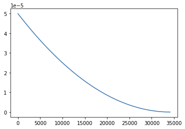  
   
You can see how the learning rate decays as each epoch progresses.  
You may have noticed how a learning rate that started from 10^-5 decays to 0 at the end of the 35000 epoch. The degree of this decay can be customized using the power parameter, which is set to 2 in this case.  
Once the optimizer is defined, we can compile the model with the desired performance metrics, as done below.
   
model.compile(optimizer=opt, loss=loss, metrics=["accuracy"])  
   
#Once the model is compiled, we can train it for 3 epochs.  
   
model.fit(tf_train_dataset, validation_data=tf_validation_dataset, epochs=num_epochs)  
   
 
Note: The model training will take more than 4 hours because BERT is a large model.  
After training the model is trained, you can save and load it for later use.  
  
  
  
  
  
  
  
  
   
You can load the trained model using the .from_pretrained() function.  
trained_model = TFAutoModelForSequenceClassification.from_pretrained('/content/drive/MyDrive/saved_model_epoch2/',num_labels = num_labels)  
   
After loading the model, we can apply a custom function to infer the performance of the model on a custom input.  
   
**def** **check_similarity**(question1, question2):  
  tokenizer_output = tokenizer(question1, question2, truncation=**True**, return_token_type_ids=**True**, max_length = **75**, return_tensors = 'tf')  
  logits = trained_model(**tokenizer_output)["logits"]  
  predicted_class_id = int(tf.math.argmax(logits, axis=-**1**)[**0**])  
  **if** predicted_class_id == **1**:  
    **return** "Both questions mean the same"  
  **else**:  
    **return** "Both the questions are different."  
   
 
Once the function is defined, we can pass in custom inputs.  
check_similarity("Why are people so obsessed with cricket?", "Why are people so obsessed with football?")  
   
Although both sentences are of the same length and mostly the same words, the context is of two different sports. The trained model still understands the context and returns the following output.   
Both questions are different.  
   
When we change the input to :  
check_similarity("Why are people so obsessed with cricket?", "Why do people like cricket?").  
The model understands that both questions talk about the same context and thus returns the following output.  
Both the questions are same  
   
   
Great! With this, we wrap up the use case for fine-tuning a BERT model for performing sentence-pair similarity.  
  
  
Congratulations on completing this session! This session covered the following:  
* How transformers use attention mechanisms to efficiently process long sentences and complex tasks  
* The encoder's role in generating representations for different segments of input data  
* The decoder’s step-by-step process for generating and refining output  
* The application of self-attention and encoder-decoder attention to improve the accuracy of predictions  
* How a pipeline() works and what goes behind it.  
* How a tokenization pipeline works and transforms the raw input into numerical representations.  
* How to download a tokenizer that is understandable by the desired model.  
* Understood the different components of the tokenized output and their utility.  
* Set up a tokenizer and a model together to get from text to predictions.  
* Fine-tuned a BERT model for a custom use-case of Quora question-pair similarity.  
   
It is highly recommended that you go through the ++[official documentation](https://huggingface.co/docs)++ of Transformers to understand the other features of it and play around with it.   
   
   
In the next session, you will explore the practical aspects of Transformers.  
  
  
  
  
Welcome to the session titled “Transformers: Practical Aspects.”  

In the previous sessions, you explored the foundational concepts of transformers, focusing on the attention mechanism and its role in capturing relationships within sequences. In these sessions, you learnt how transformers leverage attention to process information, laying the groundwork for more advanced topics.  

In this session, you will:  
* Understand the mathematics behind transformers, particularly focusing on matrix operations  
* Explore a Python-based demonstration of the matrix operation performed in attention mechanism  
* Understand how transformers use attention to capture word relationships in context  
* Learn about the role of multi-head attention in enhancing transformer performance  
* Explore additional layers and processes that enhance the transformer's capabilities  
  
  
  
  
  
  
  
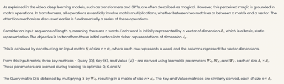  
  
  
  
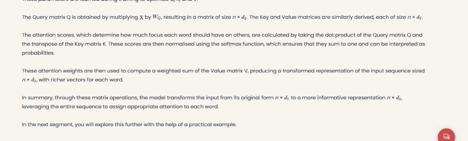  
  
  
een in the video, Professor Raghuram began the setup process by importing the numpy library, which is essential for performing the matrix operations required in the attention mechanism.  

Next, he created a sample *input_matrix* using a random number generator. This matrix represents the initial data points that we will work with in our attention mechanism. The code demonstrating this is mentioned below.  
input_matrix = np.random.uniform(-**1**,**1**,size = (**5**,**4**))  
   
Here, *input_matrix* is a 5x4 matrix, representing 5 examples, each with 4 features. These are the initial representations of our data points.  

The next step involves initialising the weight matrices for the query (*wQ*), key (*wK*), and value (*wV*), which are essential for transforming the input data into the corresponding queries, keys, and values.  
wQ = np.random.uniform(-**1**,**1**,size = (**4**,**8**)) #d_2 = 8  
wK = np.random.uniform(-**1**,**1**,size = (**4**,**8**))  
wV = np.random.uniform(-**1**,**1**,size = (**4**,**8**))  
   
These matrices, randomly initialised to a size of 4x8, will convert the 4-dimensional input data into 8-dimensional queries, keys, and values.  
   
Now, to calculate the queries (*Q*), keys (*K*), and values (*V*), matrix multiplication is performed between the input_matrix and the respective weight matrices.  
Q = np.matmul(input_matrix,wQ) #X.W_Q  
K = np.matmul(input_matrix,wK) #X.W_K  
V = np.matmul(input_matrix,wV) #X.W_V  
   
The resulting matrices *Q, K*, and *V* each have a shape of 5x8, which indicates that there are now 5 queries, 5 keys, and 5 values, each represented by an 8-dimensional vector.  
   
The next operation involves computing the attention scores (*QK*) by multiplying the query matrix (*Q*) with the transpose of the key matrix (*K*).  
QK = np.matmul(Q,K.T) #Q.K^T  
   
This results in a 5x5 matrix, where each element represents the attention score between pairs of data points.  
   
The attention scores (*QK*) are then normalised using the softmax function to ensure they sum up to 1 across each row. This normalisation is crucial for converting the scores into probabilities.  
normalise_QK = []  
**for** i **in** range(**5**):  
    temp = [np.exp(QK[i,j])/sum(np.exp(QK[i])) **for** j **in** range(**5**)]  
    normalise_QK.append(temp)  
normalise_QK = np.array(normalise_QK)  
   
The resulting matrix, *normalise_QK*, is a 5x5 matrix, where each row contains normalised attention weights.  
Finally, the output representation is generated by multiplying the normalised attention weights with the value matrix *V*. This step combines the values in a weighted manner based on the normalised attention scores.  
Attention = np.matmul(normalise_QK,V)  
   
The resulting Attention matrix is a 5x8 matrix, which provides a richer representation of the original input data, reflecting the learned importance of each data point.  
   
This demonstration explores the core operations behind an attention mechanism, showing how initial data points are transformed into queries, keys, and values and how attention scores are computed and normalised. By gaining an understanding of these steps, you can gain insights into how attention mechanisms function within transformers, particularly in applications such as natural language processing.  
   
Feel free to experiment with different input sizes or modify the weight matrices to understand how the attention mechanism adapts to various scenarios.  
   
In the next segment, you will explore how transformers use attention to capture word relationships based on the context.  
  
  
  
As explained in the video, this example is based on Jay Alammar's blog on transformers. The sentence used is ‘*The animal did not cross the street because it was too tired.*’ As humans, we understand that ‘it’ refers to ‘the animal.’ The model, through training, learns to pay attention to this context as well.  

In the visual representation given below, the brightness of the colour indicates how much attention the model is paying. For example, ‘it’ heavily attends to ‘animal,’ showing that the model has learned the correct reference. ‘It’ receives little attention because the word only gains meaning within the context of ‘the animal did not cross.  
   
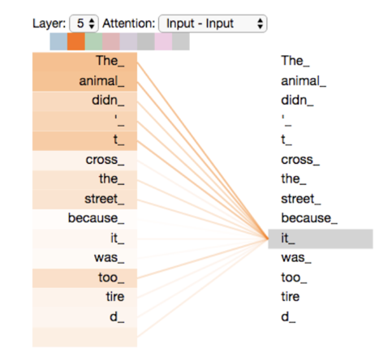  
   
*As we are encoding the word ‘it’ in encoder #5 (the top encoder in the stack), part of the attention mechanism was focusing on ‘The Animal’, and baked a part of its representation into the encoding of ‘it’.
Picture Credit: ++[Jay Alammar – The Illustrated Transformer](https://jalammar.github.io/illustrated-transformer/)++*  

This explains how attention in transformers captures context. The word ‘it’ is represented by its own value and a combination of attention weights from related words, especially ‘animal.’ This results in a richer, context-aware representation.  

The power of the attention model and transformers is evident; when the model is trained well with sufficient data, it learns to associate each word with its contextual meaning, similar to how humans understand language.  

The professor then discussed the encoder-decoder attention mechanism.  

As discussed earlier, two attention models are present in the decoder. The first one attends to the current inputs, similar to the encoder. The second one, known as encoder-decoder attention, uses queries from the decoder’s previous layer and keys and values from the encoder’s outputs.  

For example, when generating a sequence, the decoder queries which word should come next, whereas the encoder’s outputs provide the context. This allows the decoder to attend to all the positions of the encoder's outputs, ensuring that the generated sequence is contextually accurate and coherent.  

This encoder-decoder attention mechanism is a key feature that enables transformers to produce contextually relevant outputs.  
   
   
In the next segment, you will learn how multi-head attention in transformers captures diverse perspectives by processing data in parallel.  
  
#todo   
  
  
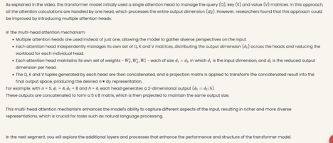  
  
  
To transform the concatenated outputs into the final desired output size.  
  
Correct! The projection matrix is applied to transform the concatenated outputs from all attention heads into the final desired output size, ensuring consistency and coherence in the output representation.  
  
  
  
In the video, the professor discussed the additional details involved in the transformer architecture, starting with the feed-forward neural network that follows the attention mechanism. An image of the transformer-model architecture is given below.  
   
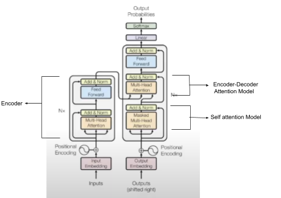  
Figure 1: Transformer-Model Architecture  

As you can see in the architecture above, after the attention mechanism, each output is passed through a feed-forward neural network. This network is applied independently to each position, transforming the multi-head attention output into a different space while sharing the same weights to maintain processing speed.   

The professor then discussed the stacking of multiple encoder and decoder layers in transformers. Each stack contains an attention block followed by a feed-forward network. The output of one encoder, such as E1, is passed as input to the next encoder, such as E2, creating richer representations through repeated layers.  

Another key point mentioned was the role of positional encoders. Since transformers process input in parallel, they lack inherent order information. To address this, positional encoders assign vector representations to each position, such as position 1, position 2 and so on. These vectors are then combined with the raw input embeddings, enabling the transformer to capture the order of words in a sentence.  

The professor then explained the add and normalise operations, which are applied after attention and feed-forward layers, as shown in Figure 1. This process involves adding the input to the output of the previous layer and then applying normalisation. By consistently performing this operation across all layers, the model maintains stability and enhances performance, ensuring that the data remains well-balanced as it progresses through the network.  

To conclude, the transformer model processes input embeddings, enhanced with positional encodings, through layers of attention mechanisms and feed-forward networks across multiple encoder and decoder stacks. These components work together to refine the data representation. The final output is produced after attending to both previous outputs and encoder outputs, followed by further processing through feed-forward networks.  
  
  
  
  
  
n the video, the professor discussed the additional details involved in the transformer architecture, starting with the feed-forward neural network that follows the attention mechanism. An image of the transformer-model architecture is given below.  
   
  
Figure 1: Transformer-Model Architecture  

As you can see in the architecture above, after the attention mechanism, each output is passed through a feed-forward neural network. This network is applied independently to each position, transforming the multi-head attention output into a different space while sharing the same weights to maintain processing speed.   

The professor then discussed the stacking of multiple encoder and decoder layers in transformers. Each stack contains an attention block followed by a feed-forward network. The output of one encoder, such as E1, is passed as input to the next encoder, such as E2, creating richer representations through repeated layers.  

Another key point mentioned was the role of positional encoders. Since transformers process input in parallel, they lack inherent order information. To address this, positional encoders assign vector representations to each position, such as position 1, position 2 and so on. These vectors are then combined with the raw input embeddings, enabling the transformer to capture the order of words in a sentence.  

The professor then explained the add and normalise operations, which are applied after attention and feed-forward layers, as shown in Figure 1. This process involves adding the input to the output of the previous layer and then applying normalisation. By consistently performing this operation across all layers, the model maintains stability and enhances performance, ensuring that the data remains well-balanced as it progresses through the network.  

To conclude, the transformer model processes input embeddings, enhanced with positional encodings, through layers of attention mechanisms and feed-forward networks across multiple encoder and decoder stacks. These components work together to refine the data representation. The final output is produced after attending to both previous outputs and encoder outputs, followed by further processing through feed-forward networks.  
  
  
 As explained in the video, to achieve accurate predictions, it is crucial to start with a high-quality data set that includes well-defined input-output pairs. For example, in the task of translating English to Python code, the following input and output pair is crucial as it guides the model during the training process.  
* **Input**: “Python program to print ‘Hello World!’”  
* **Output**: *print(‘Hello World!’)  *  
In a transformer, the decoder outputs a probability distribution over all possible tokens. The model consists of multiple encoder and decoder stacks. The encoder processes the input, and the decoder predicts the next token based on the probability distribution.  
For example, if the decoder assigns a probability of 0.96 to the word ‘print’, it suggests that ‘print’ is likely the first word in the output sequence.  

Initially, the model’s predictions might be inaccurate because the weights of the transformer's internal matrices, such as   
  
,   
  
 and   
  
 , are not yet fully trained. The correct weights are determined through training, where the model adjusts its parameters, *θ*, which include the weights of both the encoder and decoder, to minimise errors.  

The translation quality depends on both the encoder and decoder, so both must be jointly trained using a loss function. The cross-entropy loss function is typically used to measure the difference between the predicted and actual outputs. This loss function guides the model in adjusting the weights, including those in the encoder, decoder and feed-forward neural network layers.  

As training progresses, the model optimises its weights, leading to better translation accuracy. The transformer architecture includes encoders with attention mechanisms and feed-forward networks, and decoders with self-attention and encoder-decoder attention mechanisms.  

The softmax function at the decoder’s output layer produces the probability distribution from which the final output is sampled. This sequence of operations captures the core functioning of a transformer model.  
   
In the next segment, we will summarise your learnings from this session.  
  
  
  
  
  
Congratulations on completing this session! This session covered the following:   
* The mathematics of transformers focusing on key matrix operations such as queries, keys and values  
* A Python demonstration showing how attention mechanisms function in practice  
* How transformers capture contextual relationships between words  
* The role of multi-head attention in enhancing model performance  
* The architecture of transformers, including additional layers such as feed-forward networks and positional encodings  
* The process of training transformers to generate accurate predictions  
These topics provided practical insights into how transformers operate and can be effectively applied.  
  
  
# Implementation  
  
BERT  
  
BERT is an encoder model that uses a vocabulary of 30,000 tokens. Input tokens are  
converted to 1024-dimensional word embeddings and passed through 24 transformer  
layers. Each contains a self-attention mechanism with 16 heads. The queries, keys, and  
values for each head are of dimension 64 (i.e., the matrices Ωvh,Ωqh,Ωkh are 64 ×1024).  
The dimension of the single hidden layer in the fully connected networks is 4096. The  
total number of parameters is∼340 million. When BERT was introduced, this was  
considered large, but it is now much smaller than state-of-the-art models.  
Encoder models like BERT exploit transfer learning (section 9.3.6). During pre-  
training, the parameters of the transformer architecture are learned using self-supervision  
from a large corpus of text. The goal here is for the model to learn general information  
about the statistics of language. In the fine-tuning stage, the resulting network is adapted  
to solve a particular task using a smaller body of labelled training data.  
  
  
## Autoregressive with masked self attention  
  
**Auotoregressive:**  
  
Based on conditional liikelihood.. next token depends on all the previous tokens..  
n autoregressive language model. This is easiest to understand with a concrete  
example. Consider the sentence It takes great courage to let yourself appear weak. For  
simplicity, let’s assume that the tokens are the full words. The probability of the full  
sentence can be factored as:  
Pr(It takes great courage to let yourself appear weak) =  
Pr(It) ×Pr(takes|It) ×Pr(great|It takes) ×Pr(courage|It takes great) ×  
Pr(to|It takes great courage) ×Pr(let|It takes great courage to) ×  
Pr(yourself|It takes great courage to let) ×  
Pr(appear|It takes great courage to let yourself) ×  
Pr(weak|It takes great courage to let yourself appear).   
  
The autoregressive formulation demonstrates the connection between maximizing the  
joint probability of the tokens and the next token prediction task.  
minimizing log   
  
**Masked Self Attention**  
  
Future tokens are masked with large negative values and to the decoder only previous tokens are passed, so it does not cheat  
  
To train a decoder, we seek parameters that maximize the log probability of the input  
text under the autoregressive model (i.e., that maximize the sum of the log conditional  
probability terms). Ideally, we would pass in the whole sentence and compute all the  
log probabilities and gradients in the same forward pass rather than doing a forward  
pass for each token in the sentence. However, if we pass in the full sentence, the term  
computing log [Pr(great|It takes)] would have access to both the answer great and the  
right context courage to let yourself appear weak. Hence, the system can cheat rather  
than learn to predict the following words and won’t train properly.  
Fortunately, the tokens only interact in the self-attention layers in a transformer  
network. Hence, the problem can be resolved by ensuring that the attention to the  
answer and the right context is zero. This can be achieved by setting the corresponding  
dot products in the self-attention computation (equation 12.5) to negative infinity before  
they are passed through the softmax[•] function. This is known as masked self-attention.  
The effect is to make the weight of all the upward-angled arrows in figure 12.1 zero.  
The entire decoder network operates as follows. The input text is tokenized, and the  
tokens are converted to embeddings. The embeddings are passed into the transformer  
network, but now the transformer layers use masked self-attention so that they can  
only attend to the current and previous tokens. Each of the output embeddings can be  
thought of as representing a partial sentence, and for each, the goal is to predict the next  
token in the sequence.   
Consequently, after the transformer layers, a single linear layer  
maps each output embedding to the size of the vocabulary, followed by a softmax[•]  
function that converts these values to probabilities.   
  
During training, we aim to maximize the sum of the log probabilities of the next token in the ground truth sequence at every position using a standard multiclass cross-entropy loss (figure 12.12).  
  
  
## Generating Text from a decoder  
##   
  
The autoregressive language model is the first example of a generative model discussed  
in this book. Since it defines a probability model over text sequences, it can be used  
to sample new examples of plausible text. To generate from the model, we start with  
an input sequence of text (which might be just the special <start> token indicating  
the beginning of the sequence) and feed this into the network, which then outputs the  
probabilities over possible subsequent tokens. We can then either pick the most likely  
token or sample from this probability distribution. The new extended sequence can be  
fed back into the decoder network to yield the probability distribution over the next token  
  
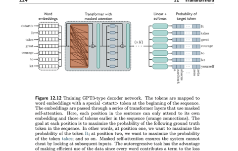  
  
  
The tokens are mapped to word embeddings with a special <start>token at the beginning of the sequence.  
The embeddings are passed through a series of transformer layers that use masked  
self-attention. Here, each position in the sentence can only attend to its own  
embedding and those of tokens earlier in the sequence (orange connections). The  
goal at each position is to maximize the probability of the following ground truth  
token in the sequence. In other words, at position one, we want to maximize the  
probability of the token It; at position two, we want to maximize the probability  
of the token takes; basically the attention weight or softmax probability of token which is highest  and so on. Masked self-attention ensures the system cannot cheat by looking at subsequent inputs. The autoregressive task has the advantage of making efficient use of the data since every word contributes a term to the loss  
function. However, it only exploits the left context of each word. By repeating this process, we can generate large bodies of text. The computation can be made quite efficient as prior embeddings do not depend on subsequent ones due to the masked self-attention. Hence, much of the earlier computation can be recycled as  
we generate subsequent tokens.  
  
### Greedy  
  
In practice, many strategies can make the output text more coherent. For example,  
**beam search **keeps track of multiple possible sentence completions to find the overall most  
likely sequence of words (which is not necessarily found by greedily choosing the most  
likely word at each step).   
  
### Probabilistic  
  
Top-k sampling randomly draws the next word from only the top-K most likely possibilities to prevent the system from accidentally choosing from the long tail of low-probability tokens and leading to an unnecessary linguistic dead end.  
  
## Problems  
  
#diary Do not worry hand movement will always be there now for typing etc.. chill..  
  
  
Problem 1: RNNs versus transformers (8 pt)

Recurrent neural networks, also known as RNNs, are a type of neural network used for sequence modelling. In this question, we will think conceptually about how an RNN processes information, and compare this to transformers.
Consider the simple RNN architecture shown in Figure 1. The inputs x1*, x2, ...xT are vectors in Rdin , the hidden states h1, h2, ..., hT are vectors in Rdhidden , and the outputs y1, y2, ..., yT are vectors in Rdout . The hidden states and outputs are given by recurrence relations:
ht = ϕh(Whht−1 + Wxxt + bh*);                                                (1)
yt = ϕy(Wyht by)*.                                                                  *(2)  
The functions ϕh( ) and ϕy( ) are arbitrary element-wise non-linearities. The RNN has three weight matrices Wh, Wx and Wy and two bias vectors bh and by.  
(a)  **(1pt)** If you wanted to train and deploy a neural network that operates on very long sequences T → ∞, would you rather use an RNN or a transformer? Why?  
Hint: There are different possible answers here, and we are just looking for some short sensible commentary that reflects on memory and time complexity mentioned in previous problems.
 
Figure 1: A simple RNN architecture. At time t, an RNN computes a hidden state ht based on the current input xt and prior hidden state ht−1. The RNN also spits out an output yt.
 
For simplicity, in this question we will set the initial hidden state h0 = 0, we will set the non-linearity ϕh to the identity ϕh(h) = h and we will set the biases bh *= 0 and by = 0. Under this simplification, after one time step T=1: *  
*h1 = Wxx1 and y1 = *ϕ*y(WyWxx*1).
 
(a)   **(1pt)** Derive formulae for hidden state h2 and output y2 in terms of the weight matrices Wy, Wx, Wh and inputs x1, *x2.
(b)   **(1pt)** Derive formulae for hidden state h3 and output y3 in terms of the weight matrices Wy, Wx, Wh and inputs x1, x2, *x3.
(c)   **(1pt) *Derive formulae for hidden state hT and output yT in terms of the weight matrices Wy, Wx, Wh and inputs x1, ..., xT *.
(d)    **(1pt) **Suppose the sequence length *T is very long. What do you notice about the contribution of the first input x1 to the last output yT of the RNN?
 
Another way of handling sequential data is to use a self-attention layer, a` la transformers. Given a sequence of inputs x1, x2, ..., xT *. A self-attention layer computes:
αij = √d (Qxi) (Kxj) for *i = 1, ..., T *and *j = 1, ..., T *; (3)  
 
contribution or the hrstinput Xi to the last output ут oftne KING  
 
where Q, **K **and **V **are the query, *key *and *value *matrices and *d *is the embedding dimension.
 
(e)  **(3pt)** For the first two questions, your answer only needs to indicate the asymptotic scaling with sequence length **T** . Use big-O notation, and ignore any other factors.
•  For RNNs, how many floating point operations are needed for a forward pass?  
 
•  For a self-attention layer, how many floating point operations are needed for a forward pass?
•  With sufficient parallel hardware, will performing a forward pass on a trans- former or RNN be faster? Why is this the case?
Hint: Think about different ways to arrange the computation of Equations 3 and 4.
(f)   **(1pt) **If you wanted to train and deploy a neural network that operates on very long sequences T → ∞, would you rather use an RNN or a transformer? Why?
Hint: There are different possible answers here, and we are just looking for some short sensible commentary that reflects on memory and time complexity mentioned in previous problems.  
In detail the ViT has a few steps (see Figure 2).
• First we embed the patches using into a sequences of embeddings.
•We add a positional encoding to the embedding which captures the position of each  
 
•  We extract the final representation of the class embedding and learn a linear layer (MLP Head) to predict the probability of each class.
•  We supervise the class with cross entropy loss.
   
## VIT  

Now that we’ve implemented a transformer, we can use it to implement a ViT! Make sure you’ve already done the previous section.
 
**In detail the ViT has a few steps (see Figure 2). same for text**  
  
## VIT Abstract  
  
While the Transformer architecture has become the de-facto standard for natural  
language processing tasks, its applications to computer vision remain limited.   
  
  
In vision, attention is either applied in conjunction with convolutional networks, or  
used to replace certain components of convolutional networks while keeping their  
overall structure in place.   
  
We show that this reliance on CNNs is not necessary  
and a pure transformer applied directly to sequences of image patches can perform  
very well on image classification tasks.   
  
**VIT uses Self Supervised Learning**  
  
When pre-trained on large amounts of data and transferred to multiple mid-sized or small image recognition benchmarks  
(ImageNet, CIFAR-100, VTAB, etc.), Vision Transformer (ViT) attains excellent results compared to state-of-the-art convolutional networks while requiring sub-  
stantially fewer computational resources to train.  
  

• First we embed the patches using into a sequences of embeddings.
• We add a positional encoding to the embedding which captures the position of each
patch in the image.
• We prepend an extra learned class embedding to our sequence and pass the entire
sequence through a transformer.
• We extract the final representation of the class embedding and learn a linear layer
(MLP Head) to predict the probability of each class.
• We supervise the class with cross entropy loss.
  
Now that we’ve implemented a transformer, we can use it to implement a ViT! Make sure
you’ve already done the previous section.  
  
1. ✅ (2pt) We first implement our patch embedding. Take a look at the class PatchEmbed.
For a given image, we want to split the image into square patches. Each patch should
then be flattened and linearly projected with some weight.
For example, suppose we want embeddings of size 128. If your image is size (3,32,32)
and your patches are 4 ×4, you should end up with 64 patches. Flattened, each patch
contains 3 ∗4 ∗4 = 48 elements. We want to learn a linear projection from those
48 elements to our output dimension 128. We’ll then end up with a sequence of 64
inputs of 128 elements each to pass into our transformer!
Deliverable Implement PatchEmbed.
Hint: Splitting up the patches manually and then using nn.Linear will be painful.Instead, look at nn.Conv2d. How can you use this to implement the patch embedding? supposedly Linear but using convolutio  
            1. images=32*32=
patches=4*4  = 16
images/patches =
channels=3
flattenedpatch=patches*channels = 48
sequence=image/patches = 64
embedding=128   
        1. tokens whose internal content is a vector of neurons. A single token will
therefore be represented by a column vector t ∈ ℝd×1,
which is also sometimes called the token's code vector.
The first step to working with tokens is to tokenize the raw input data. Once we have done this, all subsequent layers will operate over tokens, until the output layer, which will make some decision or prediction as a function of the final set of tokens.  
2. ❌   **(1pt) **Read through the VisionTransformer (implemented for you). Take a look at the positional embedding. Positional embeddings encode the position of each element in the sequence. In this case, the positional embeddings for every position in the sequence is learned. However, this creates a strict limit on how many tokens can be passed to the transformer (if you only had 64 position embeddings, the positional embedding of the 65th token is undefined!)
Suppose you wanted to implement a transformer that can take arbitrarily long inputs (ignore any memory or time constraints).   
        1. Describe a way to implement the positional embedding such that there is no maximum sequence size.  
  
  
One approach is to prune the self-attention interactions or, equivalently, to sparsify the interaction matrix (figures 12.15c-h).  can be done via graph also  
  
  
For example, this can be restricted to a convolutional structure so that each token only interacts with a few neighboring tokens. Across multiple layers, tokens still interact at larger distances as the receptive field expands. As for convolution in images, the kernel can vary in size and dilation rate.  
  
  
A pure convolutional approach requires many layers to integrate information over large distances. One way to speed up this process is to allow certain tokens (perhaps at the start of every sentence) to attend to all other tokens (encoder model) or all previous tokens (decoder model).   
  
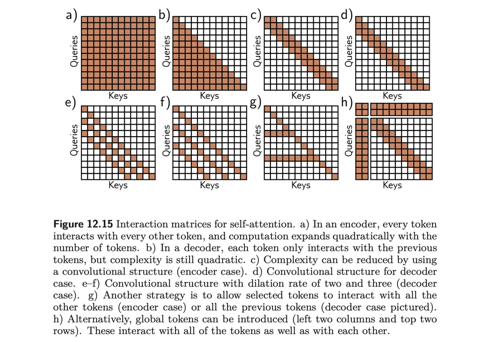  
  
A similar idea is to have a small number of global tokens that connect to all the other tokens and themselves. Like the <cls> token, these do not represent any word but serve to provide long-distance connections.  
  
    1.   
1.  Relative Positional Encoding.. embed position w.r.t position index.. update encoding after each 64 positions.. for images?they are already translational invariant because of pooling which summarizes strongest response for each patch.. without it .. so we do need the same.. then we can detect very fine grained things using this.. add number of global tokens per patch size or similar also.. for text can be done at character level
es  
    1. One approach is to prune the self-attention interactions or, equivalently, to sparsify the interaction matrix (figures 12.15c-h). For
example, this can be restricted to a convolutional structure so that each token only interacts with a few neighboring tokens. Across multiple layers, tokens still interact at
larger distances as the receptive field expands. As for convolution in images, the kernel
can vary in size and dilation rate pure convolutional approach requires many layers to integrate information over large distances. basically can be first parsed using graph neural network One way to speed up this process is to allow certain tokens (perhaps at
the start of every sentence) to attend to all other tokens (encoder model) or all previous
tokens (decoder model).  
    2.   
    3. #todo*   add global embeddings so that even token window does not matter Then we can learn very fine grained details.. without cheating.. no point otherwise..*
A similar idea is to have a small number of global tokens that
connect to all the other tokens and themselves. Like the token, these do not
represent any word but serve to provide long-distance connections.  
    4.   
    5.   
    6.   **(1pt) **Train the Vision Transformer on CIFAR-10! We’ve implemented the training loop for you. Run the cells to train a model and **report your validation accuracy here **(it should be greater than 50%). This should take about 5 minutes.  
2.     **(1pt) **The attention maps for transformers tell us which patch relied on which other patch. Let’s take a look at the attention heatmap of the class token (averaged over all heads and layers). At a high level this can give us a sense of which parts of the image the model is relying on. We provide code to visualize this heatmap for 10 validation images.  
xTyT  
(e) (1pt) Previously, we have seen convolutional neural networks (CNNs) used for image  
classification. Answer the following questions with regards to the capabilities of  
CNNs and ViTs. We expect no more than a few sentences for each question.  
• CNNs have inductive biases that emphasize local spatial patterns by design,  
while ViTs rely on global attention with limited biases. How does this difference  
affect their abilities, particularly on small vs. large datasets?  
• CNNs capture spatial information due to their network structure, while ViTs  
generally rely on learned positional encodings. How do these approaches impact  
each model’s ability to generalize to images of different sizes?  
  
**So I'm going to notate**  
**things where I'm going to take the first three neurons and call that one token, and the next three neurons**  
**another token. So I'm factorizing the input signal into these two tokens now.And then those two tokens get to attend and interact with each other. But that just corresponds to using the**  
**same set of weights for each element of the token vector, because a linear combination of rows of a matrix is**  
**using the same weights for every element of the row when I'm taking that combination.**  
**So you can work it out. Think of it for yourself, but this is what it looks like. So transformers have these layers or**  
**linear layers. Of course, the weights are coming from queries and values. So there's another mechanism on the**  
**side. But at the end of the day, it's just like this low-rank sparse transformation. It has fewer linear learnable**  
**parameters, which is advantageous in some ways.**  
  
Instead of product, it is saying it becomes a sum  
  
  
  
## Transcript  
  
K, I'm not sure I've got the first part of the question quite. But I think you're asking, shouldn't we have a  
different way of processing language and vision? Can you adapt your architecture to that?And the answer is, yeah, that is of interest. But again, the power of the transformer and the transformer  
paradigm is only put in domain knowledge into the first step, plus a few other places, like in positional encoding,  
which we'll get to, you can put in domain knowledge. And otherwise use a very generic computational  
framework, which has the advantage of just if you homogenize, then you can get advantages of everything runs  
on the same commodity hardware. The code bases are all the same. The lessons are transferable between  
different modalities. So there's a lot of advantages to that.  
But specialization to modality is of interest as well. It's just a trade-off, a back and forth. How much do you  
specialize versus how much do you make homogeneous approaches? I'm not sure I quite answered the question,  
but I think I need to move on to get through everything. We can talk after.  
So as I said, the attention layer is, at the end of the day, just a linear combination. So we can now think of a  
family of different linear combinations of neurons that we've seen. So the first one was in the MLP, the fully  
connected layer, where every single edge in the mapping from input vector to output vector is a learnable  
parameter. So we have n squared learnable parameters. If the input is in Rn and the output is in Rn. And we also  
have some bias terms that we can add, n bias terms.  
In convolution, we have a much lower rank matrix. But remember, we said that the convolution can be  
represented as a matrix. For a fixed dimensional input, we can represent the convolution as a fixed dimensional  
matrix.  
But the interesting thing is it has this Toeplitz structure, where the diagonals all share the same value. So the  
colors indicate the unique values in this matrix. So there's far fewer learnable parameters. There's only four  
learnable parameters if we include the bias, as opposed to n squared learnable parameters, for this toy problem  
where the convolutional kernel size is 3. So every three neurons in the input map to one neuron in the output.  
And convolution has this nice property of translation equivariance, conv of trans x is trans of conv x. And that  
comes because of this weight sharing. You kind of see it. Like, if I translate the input, I'm just the same values at  
a different location in that matrix.  
So what is the transformer attention matrix look like with this notation? So what do you think? This is probably  
pretty tricky to work out just in your head. But what do you think it's going to look like? I'm going to draw it on the  
next animation. So anyone want to guess? Like, what is the transformer's matrix of unique values going to look  
like?  
OK, yeah, let's go here.  
AUDIENCE: So it's not going to necessarily look sparse, but it should be low rank.  
PHILLIP ISOLA: So it will be low rank. You said it's not going to look sparse. I think it does look sparse, but we'll see, we'll see.  
Yeah, OK, any others? It's going to be some low-rank sparse matrix. It's a little hard to work it out.  
So I also have to tell you how I'm notating things. So I mean, it's not like you were wro**ng. So I'm going to notate**  
**things where I'm going to take the first three neurons and call that one token, and the next three neurons**  
**another token. So I'm factorizing the input signal into these two tokens now.And then those two tokens get to attend and interact with each other. But that just corresponds to using the**  
**same set of weights for each element of the token vector, because a linear combination of rows of a matrix is**  
**using the same weights for every element of the row when I'm taking that combination.**  
**So you can work it out. Think of it for yourself, but this is what it looks like. So transformers have these layers or**  
**linear layers. Of course, the weights are coming from queries and values. So there's another mechanism on the**  
**side. But at the end of the day, it's just like this low-rank sparse transformation. It has fewer linear learnable**  
**parameters, which is advantageous in some ways.**  
And then the other interesting property, which I'll describe in a minute, is that transformers are equivariant with  
permutations of the input. But we'll come back to that, just like graph nets.  
OK. So here's the MLP. Here's the vanilla transformer with self-attention. And this is roughly the standard  
architecture we use in computer vision. The architecture we use in language processing has one small difference,  
which I'll come to in a minute.  
A few little details to add on top of this-- I think I won't talk about multi-headed self-attention. It's in the reading.  
There's a section on it. But the idea is that, rather than just having one attention layer, I can have k attention  
layers in parallel, and then I can aggregate them. And each attention layer can be attending to different things.  
One can learn to attend to shapes and one can learn to attend to textures, for example.  
OK, so here is the complete vision transformer architecture. This is the standard way of processing spatial  
signals. So images in particular, but also audio and other things can be used with the same architecture. And  
there's only a few things that you haven't seen. So it's going to be a set of tokens, multi-headed self-attention,  
which is MSA. So that's just multiple runs of attention, then combining them all together, and then point-wise  
nonlinearity, which is going to be an MLP.  
The blue are the learnable parameters. Everything else is not learnable. So the queries and the keys and the  
values, which are indicated by this F, well, that's really the queries, but there's also keys and values. That's  
learnable. And the parameters of the token-wise MLP are learnable. Everything else is not.  
These pluses here are residual connections. So I think in the CNN lecture, we talked about ResNets. So we'll just  
take an identity pass around all this processing. And that has some advantages.  
And then there's one other little layer, which I'm labeling token norm. It's often more commonly called in the  
literature LayerNorm. There's not really an obvious kind of layer structure here. Really, this operation is just  
taking the vector and normalizing it to have zero mean and unit variance. So I'm taking the elements of this  
vector and I'm just dividing by the variance and subtracting out the mean.  
So that connects a little bit to what Jeremy was talking about and what you've done on your problem sets or what  
you're working on your problem sets, where it's good to normalize activations and weight updates in your  
network for a lot of reasons. One reason that Jeremy alluded to is, for stability of optimization and taking the  
steepest descent direction, you need to think about the norms. And you might want to normalize your weight  
updates in a particular norm. And your problem set goes into that.Here we're not normalizing the weight updates. We're normalizing the activations. But you can understand that  
normalizing activations will have a consequence on changing the size of the weight updates. Because if I  
backprop through normalizing the activations, you can see that the weight update will be a function of the scale  
of the activations.  
So LayerNorm has desirable optimization properties. Exactly what those are is basically open science. And it's not  
quite clear why LayerNorm is right thing to do, but it's what people do.  
So you'll implement transformers on your problem set, but I want to quickly walk through a kind of pseudocode  
of it just to show you how simple these things are. They're so easy to implement. That's one of the reasons why  
people like them.  
So here is a transformer in the vision transformer style that is processing a set of tokens T. So we first tokenize  
the input. That might be domain-specific knowledge, like break up your image into patches.  
And then for each layer, we're just going to run the same operation. We might have different weights per layer,  
but otherwise the same operation. We will take the matrix multiply of the LayerNorm of the tokens, times like this  
outer product of the key query and value matrices with the token matrix. And we're LayerNorming it. Then we get  
key query and value matrices.  
And then we'll just take the matrix multiply of Q times K transpose, divided by the dimensionality, which here I'm  
noting as D, the dimensionality of the key query and value vectors. And then I'll add residual connections, and  
take the linear combination, other matmul. So everything is just matmuls and a few other simple operators. And  
this maps wonderfully onto modern compute that loves matrix multiplies. OK, so really simple. And that should  
work.  
So there's one more new idea I have to get to before the end of the lecture. Well, there's a few more things to get  
to, but one more big new idea, which is positional encodings. It's not a new idea. Again, it's been seen in a lot of  
older architectures, but it was one of the key things that made transformers stand out.  
So the first thing to know is that transformers are permutation equivariant, just like graph nets. So if I permute  
the input sequence of tokens, then you can work out for yourself that if I permute it, well, it's like taking T2 into  
the place of T1, then the output will also change the order. So the output representation of T2 will now be in this  
vector, as opposed to in the second vector. So permuting the input permutes the output  
So transformers are essentially a set-to-set mapping. An unordered set maps to an unordered set. The ordering of  
the tokens doesn't matter.  
So you can see this, because point-wise, token-wise nonlinearity F, it just applies to every token independently  
and identically. So of course, if I change the order of the tokens, it doesn't change anything. I'm just treating  
them all independently. And you can work out for yourself that attention is permutation invariant.  
Because again, attention is, like, every pair of tokens, how much they attend to each other will just be  
determined based on the values in the token vectors, not the order. So because transformers are just point-wise,  
token-wise nonlinearity and attention, the whole thing is permutation equivariant. So transformer permute the  
input is equal to permute the transformer of the input.So now, positional codes-- well, remember, if we want convolutional networks to not be translation equivariant,  
we tell the filter where I am in the image. And then it can make a different decision based on where I am. It's no  
longer translation equivariant. We saw that a few times.  
So now you can do exactly the same thing with transformers. If I don't want it to be permutation equivariant,  
which oftentimes you actually don't. Oftentimes, the order matters. If I'm processing a sentence, the earlier  
sentences have causal impact. The earlier words in the sentence are causally determining the next words, but  
there's not quite the anti-causal direction. The statistics are different. It's not like a reversible sequence where  
permutation invariant statistical process.  
So anyway, I can concatenate each token with a value that tells me where it came from in the input signal. What  
position was it in the input sentence? What location was it in the input image?  
And here's how you do that typically. Not typically-- but this is the vanilla way of doing that. There's a lot of more  
advanced ways of doing it. But if I want to tell this patch here on the giraffe's head what position it's at, I could  
encode the xy location in Cartesian coordinates of that patch, but I'll typically represent this on a Fourier basis  
where I will say, what is the value of a sine function at that location? And I'll do that for different sines and  
cosines, or in the vertical and the horizontal direction. And this is just like an encoding of the position, but in  
terms of a different basis as opposed to being just like the Cartesian grid.  
So these values tell me where I am in the image. The book chapter goes into some intuition about why Fourier  
positional encoding is advantageous over other types. But this is also an open science question. This one works  
pretty well.  
And for whatever signal you have, there's a lot of domain expertise that can come into this part of the problem.  
How you define the positional encodings. Because that's the part where you tell the system what it means to be  
local for your domain. You give it the inductive bias of what locality actually represents. So for processing data  
on a globe, I can do positional encoding that's like latitude and longitude, but maybe on some kind of Fourier  
basis over spherical harmonics, over sinusoids on the sphere.  
For graphs, one of the typical positional encodings is onto the eigenbasis of the graph Laplacian. So we  
mentioned this a little bit in the GNN lecture. But basically, I can take a graph and I can compute something  
called the graph Laplacian. And I can look at the eigenvectors of that, this thing that tells me location in the  
graph, canonical location in the graph.  
And the coordinates, some of these eigenvectors of this graph Laplacian are described by these colors on the  
nodes. And so the first eigenvector is this one. It's really smooth. It's like, where am I globally? And then other  
eigenvectors are, like, high frequency, almost like a Fourier basis.  
This is all domain knowledge. It's not stuff that you need to know intimately, unless you're working on that  
domain. But this is just to say you can introduce a lot of domain knowledge into positional encodings.  
So those are the three pieces for the transformer. But there's one last thing, which is a lot of you will have seen  
large language models and already heard about transformers in the context of language modeling. So I want to  
tell you how transformers map onto language models, because there's one extra piece that is important. And it's  
called causal attention.So first, we're going to come back to autoregressive models and generative models of language and other signals  
a little later. And one of the kinds will be an autoregressive model. But I'll tell you briefly what it is now, because  
it's extremely simple. And a lot of you already know this, because it's all over the media. This is how ChatGPT  
works, and so forth.  
  
  
# Problem 4: DialogueGPT (10 pt)  
  
**Learned Position Encodings increase time complexity.. apparently..**  
  
So Prefer sinusoidal only.. or some other maths you can think  
First learn this, then original.. then think by implementing.. what all are bottlenecks..  
  
  
  
  
## LLM From scratch  
  
Now let’s use our Transformer to train a language model! We’re going to train a language  
model on some Shakespeare. Run the cell to download input.txt which contains some  
Shakespeare text. Each element in all dialogues will be one example in our dataset.  
(a) (2pt) Our first step is to build a tokenizer, which splits line of dialogue into individual  
tokens and assigns each token to an ID. We’re going to use NLTK’s word tokenize,  
which splits words and punctuation into their own tokens.  
Take a look at MyTokenizer. This tokenizer has three special tokens: start (which will  
start every example), pad (used to pad examples to the same length), and unk (used  
when encountering a word not in our vocabulary). We’ve initialized the tokenizer for  
you.  
Deliverable Implement the following functions in MyTokenizer:  
• encode: convert a string to a series of token ids and prepend the token id for the  
start token. Use word tokenize to split the string.  
• decode: convert an array of token ids back into tokens. Join them with a space.  
Make sure that your tokenizer fulfills the test case.  
(b) Read over and make sure you understand how we create the DialogueDataset and  
data loader. The data loader pads the list of tokens such that they are all the same  
length. It outputs a dictionary with two elements:  
• input ids contains the input ids for each element in the batch (padded to the  
right to the max length)  
• input mask indicates which tokens are pad tokens (and should thus be ignored).  
Deliverable You don’t need to do anything for this question.  
  
(c) (2pt) Time to implement DialogueGPT! Review the lecture on language models if you  
haven’t already.  
Deliverable Fill out TODOs in the init and forward methods. The forward call  
should:  
• Given the token ids, retrieve the corresponding token embeddings. Add to this  
a learned positional embedding.  
• Generate a causal attention mask. Remember that for GPT, every token only  
depends on itself and the tokens before it  
• Pass the embeddings and the attention mask to the transformer and the language  
model head. Output logits of size (T ×V) where T is the number of tokens and  
V is the vocabulary size. This step is implemented for you  
(d) (2pt) Let’s implement the loss. Remember that a language model is trained to predict  
the next token given a prefix of tokens.  
Suppose our vocab size is V and we have T tokens in our training example (including the start token). Then our model will output logits O ∈RT×V). Our loss for this  
example will be T−1 individual classification losses, where using logit vector O[i] we  
will predict the token id for token i+ 1 via cross entropy loss. This means we will not  
supervise the start token, nor will we use the last logit vector O[−1]. An illustration  
of this is shown below.  
Input: "<START> To be or not to be" DialogueGPT  
  
Deliverable Implement DialogueLoss. Remember to take into account the inp mask  
to ignore supervising tokens that correspond to padding.  
(e) (1pt) Go back to DialogueGPT read the generate function, which we have imple-  
mented for you. The generate function takes in a prefix of token ids and auto-  
regressively generates num tokens more tokens, by greedily picking the most likely  
next token and adding it back to the input.  
  
Generating T tokens is often much slower than training on an input with T tokens.  
Comment on why this is the case.  
(f) (1pt) Now its time to train DialogueGPT! Run the cells to train the model. This step  
will take you around 30 minutes, so budget accordingly. Note: if you’re having  
trouble debugging, try overfitting to just a few examples (e.g., make your training  
dataset size 10 or so).  
The training code generates some text after every epoch. What do you notice about  
the generations as the epochs progress?  
(g) (1pt) Generate 50 tokens of input text. Our language model is pretty small and hasn’t  
been trained for very long, but you should still get something approximating english.  
Paste the output of your model here.  
(h) (0.5pt) As you can see above, GPT-like models often struggle with generating long,  
coherent outputs and tend to produce repetitive or degenerate sequences when  
generating many tokens. One common solution to this issue is to use decoding  
strategies such as nucleus sampling instead of greedy decoding.  
Deliverable Please restrict your answer to 2-3 sentences in 1 paragraph. Explain  
how nucleus sampling works and why it may produce more diverse and coherent  
outputs compared to greedy decoding. What trade-offs does it introduce in terms of  
generation speed and output quality?  
Hint: Nucleus sampling, also known as top-psampling, involves selecting from a  
subset of tokens whose cumulative probability exceeds a threshold (often denoted as  
p). Instead of always selecting the token with the highest probability (as in greedy de-  
coding), the model samples from a dynamically sized pool of likely tokens Holtzman  
et al. [2020].  
(i) (0.5pt) As you can see from the forward pass of DialogueGPT, generating a sequence  
of tokens requires multiple forward passes through the model, where each new token  
d  
  
  
## LLM Gemini Rotatory  
  
  
**Projection head always separate so you can enforce domain knowledge separate, which can be transferred for other tasks.. Representation Learning Lecture 12..**  
    
  
To implement a Large Language Model (LLM) from scratch, you need to **build the foundational architecture: Self-Attention, Causal Masking (to ensure tokens only look at past tokens), Feed-Forward Networks, and the modern Rotary Positional Embeddings (RoPE)** we discussed earlier.  
Here is a complete, minimal implementation of a modern, production-style LLM layer (similar to LLaMA or Mistral) using **PyTorch**.  
  
#diary wait till b12 clears your system..  will get concepts mixed... and do not hurt your shoulder..**Control rate of thoughts.. was never copy pasting.. changed nature since yesterday..completed this assignment in 3 weeks.. why now? Learn on your own with help from llm for syntax or concept..**  
  
  
  
  
  
  
  
# 💻 Production-Style LLM Layer (PyTorch)  
**why sin cos..**  
**Still do not know maths behind this..**  
  
```
import torch
import torch.nn as nn
import torch.nn.functional as F

class RotaryEmbedding(nn.Module):
    """Computes Rotary Positional Embeddings (RoPE) for sequence tokens."""
    def __init__(self, dim, max_seq_len=2048):
        super().__init__()
        # Compute frequencies
        inv_freq = 1.0 / (10000 ** (torch.arange(0, dim, 2).float() / dim))
        t = torch.arange(max_seq_len, dtype=torch.float32)
        freqs = torch.outer(t, inv_freq)
        # Cache sine and cosine states
        self.register_buffer("cos", freqs.cos())
        self.register_buffer("sin", freqs.sin())

    def _rotate_half(self, x):
        x1, x2 = x.chunk(2, dim=-1)
        return torch.cat((-x2, x1), dim=-1)

    def forward(self, x, seq_len):
        # x shape: [Batch, Heads, Seq_Len, Head_Dim]

```
```
        cos = self.cos[:seq_len, None, :] s
        sin = self.sin[:seq_len, None, :]

```
```
        
        # Tile for matching dimensions
        cos = torch.cat([cos, cos], dim=-1).transpose(0, 1) # [1, Seq_Len, Head_Dim]
        sin = torch.cat([sin, sin], dim=-1).transpose(0, 1)
        
        return (x * cos) + (self._rotate_half(x) * sin)

class CausalSelfAttention(nn.Module):
    """Multi-Head Attention with Rotary Embeddings and Causal Masking."""
    def __init__(self, embed_dim, n_heads):
        super().__init__()
        self.n_heads = n_heads
        self.head_dim = embed_dim // n_heads
        
        self.qkv_proj = nn.Linear(embed_dim, embed_dim * 3, bias=False)
        self.out_proj = nn.Linear(embed_dim, embed_dim, bias=False)
        self.rope = RotaryEmbedding(self.head_dim)

    def forward(self, x):
        B, T, C = x.shape # Batch, Sequence Length, Embedding Dim
        
        # 1. Project to Q, K, V and split into multiple heads
        qkv = self.qkv_proj(x) # [B, T, 3 * C]
        q, k, v = qkv.chunk(3, dim=-1)
        
        q = q.view(B, T, self.n_heads, self.head_dim).transpose(1, 2) 

```
```
# [B, n_heads, T, head_dim]
        k = k.view(B, T, self.n_heads, self.head_dim).transpose(1, 2)

```
```
        v = v.view(B, T, self.n_heads, self.head_dim).transpose(1, 2)

        # 2. Apply Rotary Positional Embeddings
        q = self.rope(q, T)
        k = self.rope(k, T)

        # 3. Scaled Dot-Product Attention with PyTorch's native FlashAttention optimization

```
```
        # is_causal=True automatically applies the autoregressive lower-triangular mask # getting concepts mixed.. wait.. 
        attn_out = F.scaled_dot_product_attention(q, k, v, is_causal=True)

```
```
        
        # 4. Concatenate heads back together and project
        attn_out = attn_out.transpose(1, 2).contiguous().view(B, T, C)
        return self.out_proj(attn_out)

class SwiGLUFeedForward(nn.Module):
    """The SwiGLU activation network used in modern LLMs like LLaMA."""
    def __init__(self, embed_dim, hidden_dim):
        super().__init__()
        self.w1 = nn.Linear(embed_dim, hidden_dim, bias=False)
        self.w2 = nn.Linear(embed_dim, hidden_dim, bias=False)
        self.w3 = nn.Linear(hidden_dim, embed_dim, bias=False)

    def forward(self, x):
        return self.w3(F.silu(self.w1(x)) * self.w2(x))

class LLMBlock(nn.Module):
    """A full single Transformer decoder layer block."""
    def __init__(self, embed_dim, n_heads):
        super().__init__()
        self.attn_norm = nn.RMSNorm(embed_dim) # Modern LLMs use RMSNorm over LayerNorm
        self.attn = CausalSelfAttention(embed_dim, n_heads)
        
        self.ffn_norm = nn.RMSNorm(embed_dim)
        self.ffn = SwiGLUFeedForward(embed_dim, hidden_dim=int(2 * embed_dim * 4 / 3))

    def forward(self, x):
        # Pre-normalization with residual connections
        x = x + self.attn(self.attn_norm(x))
        x = x + self.ffn(self.ffn_norm(x))
        return x

```
  
# 🏗️ Architectural Checklist  
To scale this layer up into a full, working model, you need to string multiple parts together:  
  
* **Tokenizer:** Convert raw string text into integer Token IDs (e.g., Tiktoken or Hugging Face Byte-Pair Encoding).  
* **Token Embeddings:** An nn.Embedding(vocab_size, embed_dim) table to convert IDs into continuous vectors.  
* **Sequential Stack:** Stack 12 to 80 LLMBlock layers sequentially to build deep context tracking.  
* **LM Head:** A final nn.Linear(embed_dim, vocab_size) linear layer to calculate probability logs over the vocabulary for the next word.  
  
If you are setting up a workspace to train this model, let me know:  
  
* Are you aiming to build a tiny toy model (**Pre-training** from scratch) or load existing weights (**Fine-tuning**)?  
* What is your available **hardware** capacity (e.g., local consumer GPU vs. cloud cluster)?  
I can provide a training loop wrapper or generation sampling script (Top-K/Top-P) based on your goal.  
  
  
  
  
  
