  
# Clustering  
  
  
  
## K Means Clustering  
  
**Clusters**  
  
  
  
The next concept that is crucial for understanding how clustering generally works is the idea of centroids. If you remember your high school geometry, centroid  
  
ids are essentially the centre points of triangles. Similarly, in the case of clustering, centroids are the** centre points of the clusters **that are being formed.  
   
Now before going to the formula part, here is an intuition for the need of a centroid. Imagine you have the following clusters of the marks of a group of students in Mathematics and Biology and someone asks you to explain them. From a glance, you can easily interpret the 4 clusters that are being formed.   
   
   
  
   

   
So the four clusters that are being formed are as follows:  
   
Cluster 1: Students who have scored high marks in Bio, but poor marks in Maths
Cluster 2: Students who have scored average  marks in Bio and  Maths
Cluster 3: Students who have scored high marks in both Bio and Maths
Cluster 4: Students who have scored high marks in Maths, but poor marks in Bio  
   
Now the above representation is fine and correct, but it is missing one crucial information - **the numerical order**. For example, when you want to compare two clusters say Cluster 1 and Cluster 2 can you say by how much marks on average do the students from Cluster 1 outperform or underperform the Cluster 2 students in a particular subject just by taking a look at the above visualisation alone? Is it by 10 marks? Or 15?  
   
This is where the concept of **Centroids** come in handy. Listen to the following lecture to understand its importance and how it is calculated.  
  
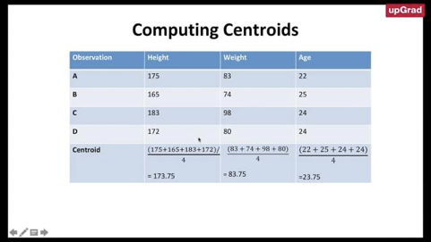  
  
  
  
Therefore, as mentioned in the video, the Centroids are essentially** the cluster centres** of a group of observations that help us in **summarising the cluster's properties**. Thus as you saw in the video, the centroid value in the case of clustering is essentially the mean of all the observations that belong to a particular cluster. For example, in the dataset that you saw here,  
   
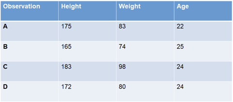  
   
   
The centroid is calculated by computing the mean of each and every column/dimension that you have and then ordering them in the same way as above.  
Therefore, Height-mean = ((175+165+183+172))/4  = 173.75
                    Weight-mean = ((83+74+98+80))/4 = 83.75
                    Age - mean = ((22+25+24+24))/4 =23.75  
Thus the centroid of the above group of observations is (173.75, 83.75 and 23.75)  
  
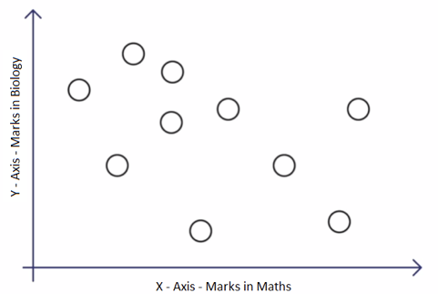  
   
**Centroid**  
   
The K-Means algorithm uses the concept of the centroid to create K clusters. Before you move ahead, it will be useful to recall the ++[concept of the centroid](https://en.wikipedia.org/wiki/Centroid)++.  
   
In simple terms, a centroid of n points on an x-y plane is another point having its own x and y coordinates and is often referred to as the geometric centre of the n points.  
   
For example, consider three points having coordinates (x1, y1), (x2, y2) and (x3, y3). The centroid of these three points is the average of the x and y coordinates of the three points, i.e.  
(x1 + x2 + x3 / 3, y1 + y2 + y3 / 3).  
   
Similarly, if you have n points, the formula (coordinates) of the centroid will be:  
(x1+x2…..+xn / n, y1+y2…..+yn / n).   
 basically mean  
So let’s see how the K-Means algorithm achieves this goal.  
  
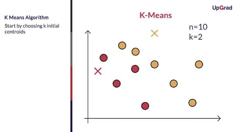  
  
  
  
Each time the clusters are made, the centroid is updated. The updated centroid is the centre of all the points which fall in the cluster associated with the centroid. This process continues till the centroid no longer changes, i.e. the solution converges.  
** **  
**Thus, you can see that the K-means algorithm is a clustering algorithm that takes N data points and groups them into K clusters. In this example, we had N =10 points and we used the K-means algorithm to group these 10 points into K = 2 clusters.**  
** **  
  
Download the Excel file below. It is designed to give you hands-on practice of k-means clustering algorithm. The file contains a set of 10 points (with x and y coordinates in column A and B respectively) and two initial centres 1 and 2 (in columns F and G). Answer the questions below based on the Excel file.  
  
  
  
  
So the cost function for the K-Means algorithm is given as:   
**J=∑(k1=K)∑(i=n)(X¡-µ_k)^2  **  
  
  
  
  
Now in the next video, we will learn what exactly happens in the assignment step? and we will also look at how to assign each data point to a cluster using the K-Means algorithm assignment step.  
  
  
  
In the optimisation step, the algorithm calculates the average of all the points in a cluster and moves the centroid to that average location.  
The equation for optimisation is as follows:  
µ=1/(K(∑X¡))   
i.e average of sum of Xi's  belonging to cluster i  
The process of assignment and optimisation is repeated until there is no change in the clusters or possibly until the algorithm converges.  
In the next segment, we will learn how to optimise the K-Means algorithm even further using the K-Means ++ algorithm  
**Additional Reading**  
* You can also look K-Means algorithm as a coordinate descent problem and how to achieve global minima in the K-Means cost function. Please take a look at this ++[optional segment](https://learn.upgrad.com/course/1633/segment/12967/80802/241409/1266225)++ to learn further  
  
  
To choose the cluster centres smartly, we will learn about K-Mean++ algorithm. K-means++ is just an initialisation procedure for K-means. In K-means++ you pick the initial centroids using an algorithm that tries to initialise centroids that are far apart from each other.  
Let's understand the algorithm in detail in the next lecture.  
  
  
  
To summarise, In K-Means++ algorithm,  
1.  We choose one data point as the cluster centre at random.  
2. For each data point X¡We compute the distance between X¡ and the nearest centre that had already been chosen.  
3. Now, we choose the next cluster centre using the weighted probability distribution where a point X is chosen with probability proportional to d(X)^2  
4. Repeat Steps 2 and 3 until K clusters have been chosen  
* 
Let’s see the K-Means algorithm in action using a visualisation tool. This tool can be found on ++[naftaliharris.com](http://www.naftaliharris.com/blog/visualizing-k-means-clustering/)++. You can go to this link after watching the video below and play around with the different options available to get an intuitive feel of the K-Means algorithm.
  
Upon trying the different options, you may have noticed that the final clusters that you obtain vary depending on many factors, such as choice of the initial cluster centres and the value of K, i.e. the number of clusters that you want. You will understand these factors and other practical considerations while using the K-means algorithm in more detail in the next segment.  
   
  
**Silhouette Metric:**  
  
a(i)-> Average Distance of a point inter cluster(**Cohesion**)  
b(i)->  Average Distance of a point from nearby cluster(**Dis-simarity**)-(Seperation)  
  
S¡=(b¡-a¡)/max({b¡,a¡}})  
  
Average Distance = mean(S¡)  
  
  
Yes, **Principal Component Analysis (PCA)** is fundamentally a dimensionality reduction technique designed to exploit the correlation (relationship) between features to compress data.  
When multiple features in a dataset are highly related, they contain redundant information. PCA reorganizes this space by projecting the data onto a lower-dimensional coordinate system that preserves the maximum possible variance.  
  
**1. The Geometric Intuition: Redundancy vs. Nuance**  
When features are highly correlated, plotting them reveals a clear directional trend.  
* **The Dominant Signal (PC1)**: PCA identifies the axis of maximum variation in the data. For example, if you have two highly correlated features \(r_1\) and \(r_2\), the primary diagonal direction captures almost all of their shared information. This direction is the first **Principal Component (PC1)**, which serves as a highly useful, compact representation.  
* **The Discarded Nuance (PC2)**: The direction orthogonal to PC1 represents the remaining variance. In highly correlated datasets, this direction contains very little signal and is treated as negligible "nuance" or noise. PCA discards these lower-variance components, reducing the dimensionality of the representation space while retaining the core structure.  
  
**2. PCA as a Linear Autoencoder**  
From a representation learning perspective, PCA is mathematically equivalent to a **linear autoencoder with an orthogonal constraint**.  
We can map the mechanics of PCA directly onto the encoder-decoder framework:  
1. **The Encoder (\(W\))**: Projects the raw \(d\)-dimensional input vector \(x\) onto a lower \(k\)-dimensional latent space of the largest principal components: \[z = Wx\] where \(W\) is a \(k \times d\) matrix.  
2. **The Decoder (\(W^\top\))**: Projects the compressed code \(z\) back into the original \(d\)-dimensional space to reconstruct the input: \[\hat{x} = W^\top z = W^\top W x\] where \(W^\top\) acts as the decoder.  
3. **The Orthogonal Constraint**: PCA constrains the projection matrix to be orthonormal: \[WW^\top = I_{k \times k}\] This ensures that the coordinates in the reduced latent space are completely uncorrelated (orthogonal).  
  
**3. Equivalence of Objectives**  
Under these linear and orthogonal constraints, PCA minimizes the **squared \(L_2\) reconstruction loss** between the input \(x\) and its reconstruction \(\hat{x}\): \[\min_W \mathbb{E} |x - W^\top W x|_2^2 \quad \text{s.t.} \quad WW^\top = I\]  
By expanding this quadratic objective, minimizing the reconstruction error is mathematically identical to **maximizing the variance captured** in the projected subspace.  
Because of this, if you train a vanilla linear autoencoder (like the LinearAutoEncoder we designed earlier) *without* an explicit orthogonal constraint, the weight matrix \(W\) will not necessarily be orthogonal, but the learned latent bottleneck \(z\) will still **span the exact same \(k\)-dimensional subspace** as scikit-learn's PCA.  
  
📐 We can write a quick PyTorch and scikit-learn script to compress a dataset, train your LinearAutoEncoder, and plot the learned bottleneck side-by-side with classical PCA to visually prove that they span the exact same subspace. Would you like to do that?  
  
  
**Practical Considerations**  
   
Let’s understand some of the factors that can impact the final clusters that you obtain from the K-means algorithm. This would also give you an idea about the issues that you must keep in mind before you start to make clusters to solve your business problem.  
  
  
  
  
  
Thus, the major practical considerations involved in K-Means clustering are:  
* The number of clusters that you want to divide your data points into, i.e. the value of K has to be pre-determined.  
* The choice of the initial cluster centres can have an impact on the final cluster formation.  
* The clustering process is very sensitive to the presence of outliers in the data.  
* Since the distance metric used in the clustering process is the Euclidean distance, you need to bring all your attributes on the same scale. This can be achieved through standardisation.  
* The K-Means algorithm does not work with categorical data.  
* The process may not converge in the given number of iterations. You should always check for convergence.  
You will understand some of these issues in detail and also see the ways to deal with them when you implement the K-means algorithm in Python.  
   
Now let's look in detail how to choose K for K-Means algorithm.  
  
  
  
**Additional reading**  
You can read more about K-Mode clustering ++[here](https://shapeofdata.wordpress.com/2014/03/04/k-modes/)++, We will be covering it in detail in the next section.  
  
Before we apply any clustering algorithm to the given data, it's important to check whether the given data has some meaningful clusters or not? which in general means the given data is not random. The process to evaluate the data to check if the data is feasible for clustering or not is known as the clustering tendency.  
   
As we have already discussed in the previous lecture that the clustering algorithm will return K clusters even if that data does not have any clusters or have any meaningful clusters. So before proceeding for clustering, we should not blindly apply the clustering method and we should check the clustering tendency.  
   
Let's look in detail at how it works.  
  
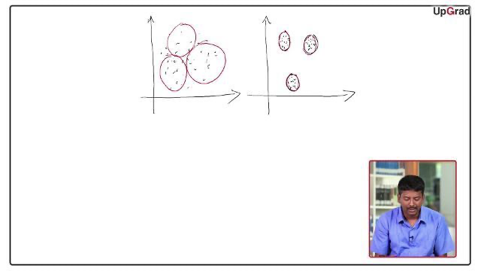  
  
  
  
To check cluster tendency, we use Hopkins test. Hopkins test examines whether data points differ significantly from uniformly distributed data in the multidimensional space.  
   
**Additional Resources**  
To read about Hopkins test in detail, please follow this ++[link1](http://www.sthda.com/english/articles/29-cluster-validation-essentials/95-assessing-clustering-tendency-essentials/#methods-for-assessing-clustering-tendency)++, ++[link2](https://stats.stackexchange.com/questions/332651/validating-cluster-tendency-using-hopkins-statistic)++, remember that the document is described using R programming, please ignore it.  
  
**Summary**  
  
We covered a lot in this session. We started with understanding the K-Means intuitively by grouping the 10 random points in 2 clusters.  
  
   
The algorithm begins with choosing K random cluster centres.  
   
Then the 2 steps of **Assignment and Optimisation** continue iteratively till the clusters stop updating. This gives you the most optimal clusters — the clusters with minimum intra-cluster distance and maximum inter-cluster distance.  
   
You also saw the different practical issues that need to be considered while employing clustering to your data set. You need to choose **how many clusters **you want to group your data points into. Secondly, the K-means algorithm is **non-deterministic**. This means that the final outcome of clustering can be different each time the algorithm is run even on the same data set. This is because, as you saw, the final cluster that you get can vary by the choice of the initial cluster centres.  
   
You also saw that the **outliers** have an impact on the clusters and thus outlier-infested data may not give you the most optimal clusters. Similarly, since the most common measure of the distance is the Euclidean distance, you would need to bring all the attributes into the same scale using **standardisation**.  
   
You also saw that you cannot use categorical data for the K-Means algorithm. There are other customised algorithms for such categorical data.  
  
  
#Analytics-Vidya   
## K modes Clustering  
  
  
I recently read an interesting ++[Wired story](http://www.wired.com/wiredscience/2014/01/how-to-hack-okcupid/)++ about Chris McKinlay (a fellow alum of Middlebury College), who used a clustering algorithm to understand the pool of users on the dating site OkCupid (and successfully used this information to improve his own profile.) The data involved was answers to multiple-choice questions, which is very similar to the ++[categorical data](https://shapeofdata.wordpress.com/2013/10/09/cast-study-2-tokens-in-census-data/)++ that I discussed a few posts back. But, instead of translating the data into vectors, like I discussed in that post, McKinlay used an algorithm called K-modes that works directly on this type of data. So, I thought this would be a good excuse to write a post about K-modes and how it compares to translating the data into vectors and then running ++[K-means](https://shapeofdata.wordpress.com/2013/07/30/k-means/)++.  
First, I want to review how we could turn answers to multiple-choice questions into vector data, and what the K-means algorithm would do to it. To make things simple, lets say that we have a multiple-choice questionnaire with ten questions, each with four possible choices. A number of people fill out the questionnaire and we record their responses.  
  
As I described in the post on token data, we can convert each of the filled-out questionnaires into a data point in a 40-dimensional space as follows: The first four dimensions/features will record the response to the first question. If they answered (A) to the first question, the first four values would be *(1,0,0,0)*. If they answered (B), it would be *(0,1,0,0)* and so on. Similarly, the next four features would record the response to the second question in the same way, and so on, as in the Figure to the right. So each questionnaire would give us a 40-dimensional vector with ten 1s and the remaining places all 0s.  
  
  
Recall that K-means works by selecting a small number of special points called *centroids*, which are in the data space but not necessarily data points, and working out which of the centroids each data points is closest to. Then, it replaces each centroid with the new centroid/center of mass of the data points that were associated to it.  
To understand how this works for the type of data that we get from a questionnaire, lets start by looking at the step where we find the new centroids. Given a collection of data points, we find their center of mass by adding them all together and then dividing by the number of data points. (This is basically an average, but we use the fancy term centroid because an average usually refers to a single number rather than a vector.) When we add the vectors together, we’re just adding up all the 1s in a particular dimension/feature. So in the resulting vector, the value in the first spot will be equal to the number of questionnaires that answered (A) to the first question. The value in the second spot will be the number that answered (B) to the first question, etc. The value in the fifth spot will be the number who answered (A) to the second question and so on.  
Next, we divide by the number of data points, which means we divide each entry of the vector by this number. The first spot in the resulting vector is the number of questionnaires that answered (A) to the first question, divided by the total number of questionnaires. This number will be between zero and one, and you can think of it as the percentage of questionnaires that answered (A) to the first question. (Technically, to get the percentage, you have to multiply the number by 100.) The number in the second spot is the percentage who answered (B), and so on. Think of this like a bar graph showing the responses to each question, where the value in each spot is the height of the bar.  
The step where we decide which centroid is closest to each data point is a little trickier. To find the standard Euclidean distance between a data point and a centroid, we subtract the number in each spot of the data vector from each spot of the centroid vector (and take the absolute value so that the resulting number is always positive.) Then we square each of these numbers, add them all up, then take the square root of the final number. (There are other possible types of distance to calculate, but that’s a digression for another time.)  
  
That’s getting a bit more technical than I usually like, so let me just point out three key things to understand about this calculation: First, if a lot of the data points that were used to make the centroid agree with the new data point on a given question, this will make the distance lower (as we would hope.) Second, if a lot of the original data points agreed on a different answer than the new data point to a given question, then this will make the distance higher (again, as we would hope.) Third, if a lot of the original data points disagree with the new data point, but are fairly evenly spread among the other possible answers, then this will add a little bit to the distance, but not as much as if they all agreed on a single answer that disagreed with the new data point.  
What this process does is to pick out the questionnaire responses that are most similar to each centroid, and thus to each other. In other words, we would expect that the data points that are closest to any given centroid will have a lot of responses in common with each other, so that when we calculate the centroids the next time, there will be a stronger majority on each question.  
  
So, we run K-means by repeating this process over and over until the centroids stabilize/converge to places that define our new clusters. We can then read off the “typical” response to the first question in each cluster by looking at the values of the first four spots in each centroid, and choosing the one that’s the highest. We can read off the “typical” response to the second question by looking at the next four entries, and so on. If the data set has well defined clusters, and we pick our *K* correctly, we would expect the values defining these “typical” responses to be pretty close to 1 (i.e. 100%).  
The K-modes algorithm is based on a very similar idea, but as I mentioned above, it skips the intermediate step of transforming the questionnaire data into vectors. It consists of the same two steps, but they look slightly different. For the step in which we compute the centroids, we again start by adding up the number of questionnaires that responded with each possible answer to each of the questions. So far, this isn’t too different; it’s essentially the same as adding up the 40-dimensional vectors like we did with K-means.  
  
  
However, instead of dividing by the number of questionnaires like we did with K-means, the K-modes algorithm simply records which answer to each question got the most votes. This is the *mode* of the responses -the most common answer – which is where the name *K-modes* comes from. So each centroid is in the same form as the original questionnaire data – a set of responses to the different questions – rather than a 40-dimensional vector.  
The next step is again to calculate the “distance” from each data point to each centroid. For K-means, we were able to use the standard Euclidean distance, since we were working with vector data. For K-modes, we’re going to have to come up with a notion of distance from scratch, but this turns out not to be too hard. The most obvious notion of distance is as follows: For each data point and each centroid, we can define the distance to be the number questions they disagree on. As with the Euclidean distance we used in K-means, when they agree on a question, this will make the distance lower, and when they disagree on a question, it will make the distance higher.  
Note, however, that the third point about the Euclidean distance doesn’t hold here: The K-modes centroids don’t keep track of how close the margin was between the answer that that got the most responses and the second most. So, if the data point disagrees with the most popular response among the original data points, it gets the same penalty whether or not the original data points strongly agreed on this answer.  
This difference is a trade-off rather than a deficiency. The problem with the way K-means calculates distances is that it can lead to centroids where no one answer is much higher than the others. Essentially, K-means never makes a strong decision about which data points to abandon. Since K-modes forces the centroids to make this decision, it can lead to much better defined clusters. Of course, for data where there aren’t strong correlations to be found, having to make this decision (especially in the early rounds of K-means/K-modes) could make things worse.  
As usual, the question of which algorithm is better depends entirely on the data set and the goals of the project. Both algorithms rely heavily on picking the right value for *K*, and the Wired article does a nice job of describing how McKinlay did this through trial and error. (I may have to borrow the lava lamp analogy.) McKinlay’s analysis was complicated somewhat by the fact that each profile in the data set that he looked at answered a slightly different set of multiple choice questions. While there was a lot of overlap between the sets, each question would have had a lot of no-answer data. There are a number of ways one could deal with this, and I don’t know which one McKinlay used, but as always the best solution to a problem like this depends on the particular data set.  
  
  
  
  
## DBSCAN vs K Means  
  
**DBSCAN and K-Means are both popular clustering algorithms, but they differ significantly in how they group data points. K-Means is a centroid-based algorithm that partitions data into K clusters, while DBSCAN is a density-based algorithm that groups data based on point density and can identify clusters of arbitrary shapes, as well as outliers. **  
  
**Here's a more detailed comparison:**  
  
  
##   
  
  
##   
**K-Means:**  
* Centroid-based: It works by assigning data points to the nearest of K centroids (cluster centers). 
  
* Requires specifying K: You need to predefine the number of clusters (K). 
  
* Assumes spherical clusters: It works best when clusters are roughly spherical and of similar size. 
  
* Sensitive to initialization: The initial placement of centroids can affect the final clustering. 
  
* Fast and efficient: Relatively fast, especially for large datasets.   
**DBSCAN:**  
* Density-based: Groups data points based on density, identifying dense regions separated by sparser areas. 
  
* Doesn't require K: Automatically determines the number of clusters based on data density. 
  
* Can handle arbitrary shapes: Effective at finding clusters with irregular shapes. 
  
* Identifies outliers: Naturally identifies outliers as points not belonging to any dense region. 
  
* More robust to noise: Less affected by outliers compared to K-Means. 
  
* Can be slower: Computationally more intensive, especially with large datasets and high dimensionality.   
When to choose which algorithm:  
* K-Means: 
Use when you have a good idea of the number of clusters and they are relatively spherical and well-separated. 
  
* DBSCAN: 
Use when you don't know the number of clusters, the clusters have irregular shapes, and you need to identify outliers. 
  
  
## Hierarchical Clustering  
  
One of the major considerations in using the K-means algorithm is deciding the value of K beforehand. The hierarchical clustering algorithm does not have this restriction.  
  
   
The output of the hierarchical clustering algorithm is quite different from the K-mean algorithm as well. It results in an inverted tree-shaped structure, called the dendrogram. An example of a dendrogram is shown below.  
   
  
   
Let's see how hierarchical clustering works.  
  
  
  
  
  
In the K-Means algorithm, you divided the data in the first step itself. In the subsequent steps, you refined our clusters to get the most optimal grouping. In hierarchical clustering, the data is not partitioned into a particular cluster in a single step. Instead, a series of partitions/merges take place, which may run from a single cluster containing all objects to n clusters that each contain a single object or vice-versa.  
   
  
This is very helpful since you don’t have to specify the number of clusters beforehand.  
   
  
Given a set of N items to be clustered, the steps in hierarchical clustering are:  
1. Calculate the NxN distance (similarity) matrix, which calculates the distance of each data point from the other  
2. Each item is first assigned to its own cluster, i.e. N clusters are formed  
3. The clusters which are closest to each other are merged to form a single cluster  
4. The same step of computing the distance and merging the closest clusters is repeated till all the points become part of a single cluster  
   
Thus, what you have at the end is the dendrogram, which shows you which data points group together in which cluster at what distance. You will learn more about interpreting the dendrogram in the next segment.  
   
Look at the image given below and answer the question that follows.  
   
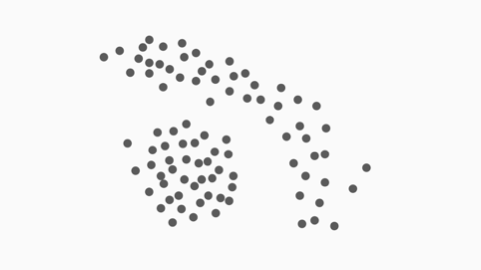  
Hierarchical clustering is a helpful technique in data analysis and machine learning that groups similar data points based on their closeness to each other. Unlike methods like K-means, it doesn’t require you to decide the number of groups beforehand. Instead, it builds a tree-like diagram called a dendrogram, which shows how the data points are joined together step by step. By cutting this tree at different levels, you can create clusters of different sizes depending on what you need.  
Types of Hierarchical Clustering  
Hierarchical clustering builds a tree-like hierarchy of clusters. There are two main types of hierarchical clustering:  
1. Agglomerative Clustering: This approach starts by considering each data point as a single cluster and then iteratively merges the closest pairs of clusters until only one cluster remains. It is also known as bottom-up clustering.  
2. Divisive Clustering: In contrast, divisive clustering begins with all data points in a single cluster and then splits the cluster recursively into smaller clusters until each data point is in its cluster. Divisive clustering is also called top-down clustering.  
Problem with K-means: Sensitivity to Initial Centroid Selection  
K-means clustering, while widely used and relatively efficient, is sensitive to the initial selection of cluster centroids. The algorithm converges to a local optimum and different initializations may lead to different final cluster assignments. This sensitivity to initialization can sometimes result in suboptimal clustering solutions or even convergence to a poor local optimum.  
How Hierarchical Clustering Addresses this Problem ?  
Hierarchical clustering, especially agglomerative hierarchical clustering, doesn’t have the problem of being sensitive to how it starts, unlike K-means. Instead of picking random starting points (like K-means does with centroids), hierarchical clustering starts with each data point on its own and then keeps joining the closest groups step by step. Because it merges clusters based on their actual distances, the process is more predictable and doesn’t change depending on where it begins.  
Also, since it looks at all the data points and merges clusters gradually, hierarchical clustering usually gives more consistent and reliable results than K-means. Plus, it builds a tree-like structure that lets you see groups at different levels, so you can explore the data in more detail.  
How Does Agglomerative Hierarchical Clustering Work?  
Agglomerative hierarchical clustering proceeds as follows:  
1. Initialization: Begin with each data point as a singleton cluster.  
  
  
2. Pairwise Distance Calculation: Compute the distance (similarity) between each pair of clusters. The choice of distance metric (e.g., Euclidean distance, Manhattan distance, etc.) depends on the nature of the data.  
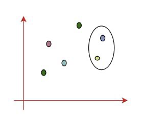  
  
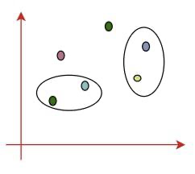  
  
3. Merge Closest Clusters: Merge the two closest clusters based on the chosen distance metric, creating a new, larger cluster.  
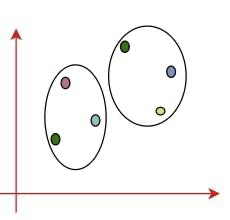  
  
4. Update Distance Matrix: Recompute the pairwise distances between the new cluster and the remaining clusters.  
5. Repeat Steps 3-4: Continue merging the closest clusters and updating the distance matrix until only a single cluster remains.  
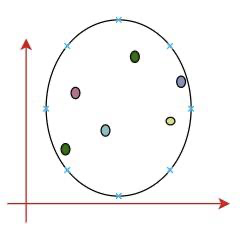  
  
It is also known as the bottom-up approach or Hierarchical Agglomerative Clustering (HAC). A structure that is more informative than the unstructured set of clusters returned by flat clustering. This clustering algorithm does not require us to prespecify the number of clusters. Bottom-up algorithms treat each data point as a singleton cluster at the outset and then successively agglomerate pairs of clusters until all clusters have been merged into a single cluster that contains all data.  
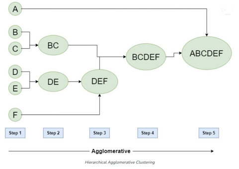  
  
Implementation in Python  
We are performing hierarchical clustering on the dataset and assigning cluster labels to the data points.  
* AgglomerativeClustering: The class from sklearn.cluster used for hierarchical clustering.  
* n_clusters=3: Specifies the number of clusters to form (in this case, 3 clusters).  
* fit_predict(df_k): Fits the hierarchical clustering model to the data (df_k) and assigns each data point to a cluster.  
* df_k['clusters_hierarchical']: Adds the cluster labels from the hierarchical clustering model as a new column (clusters_hierarchical) in the DataFrame.  
* df_k.head(20): Displays the first 20 rows of the updated DataFrame with the cluster labels.  
  
  
  
  
  
  
  
  
   
  
```python  
from sklearn.cluster import AgglomerativeClustering  
hierarchical = AgglomerativeClustering(n_clusters=3)  
y_predicted_hierarchical = hierarchical.fit_predict(df_k)  
df_k['clusters_hierarchical']= y_predicted_hierarchical  
df_k.head(20)  
```  
## Linkages  
  
  
* **Single Linkage: **Here, the distance between 2 clusters is defined as the shortest distance between points in the two clusters  
* **Complete Linkage: **Here, the distance between 2 clusters is defined as the maximum distance between any 2 points in the clusters  
* **Average Linkage: **Here, the distance between 2 clusters is defined as the average distance between every point of one cluster to every other point of the other cluster.  
   
You have to decide what type of linkage should be used by looking at the data. One convenient way to decide is to look at how the dendrogram looks. Usually, a single linkage-type will produce dendrograms which are not structured properly , whereas complete or average linkage will produce clusters which have a proper tree-like structure. You will see later what this means when you run the hierarchical clustering algorithm in Python.  
  
   
**Additional reading**  
You can read more about the type of linkages ++[here](http://www.saedsayad.com/clustering_hierarchical.htm)++,++[ here](https://stats.stackexchange.com/questions/195446/choosing-the-right-linkage-method-for-hierarchical-clustering)++ and ++[here](http://www.stat.cmu.edu/~ryantibs/datamining/lectures/05-clus2.pdf)++.  
   
