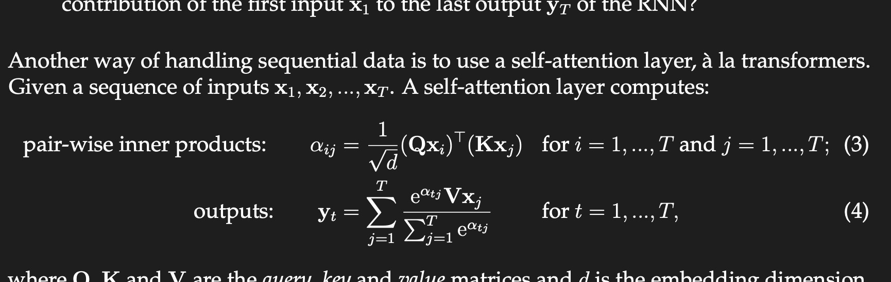

**Problem 1: RNNs versus transformers (8 pt)**  
** **  
Recurrent neural networks, also known as RNNs, are a type of neural network used for sequence modelling. In this question, we will think conceptually about how an RNN processes information, and compare this to transformers.  
Consider the simple RNN architecture shown in Figure ++1++. The inputs **x**1*, ***x**2*, ...***x***T *are vectors in R*d*in , the hidden states **h**1*, ***h**2*, ..., ***h***T *are vectors in R*d*hidden , and the outputs **y**1*, ***y**2*, ..., ***y***T *are vectors in R*d*out . The hidden states and outputs are given by recurrence relations:  
**h***t *= *ϕh*(**W***h***h***t*−1 + **W***x***x***t *+ **b***h*);                                                (1)  
**y***t *= *ϕy*(**W***y***h***t *+ **b***y*)*.                                                                  *(2)  
  
The functions *ϕh*( ) and *ϕy*( ) are arbitrary element-wise non-linearities. The RNN has three weight matrices **W***h*, **W***x *and **W***y *and two bias vectors **b***h *and **b***y*.   
  
(a)  **(1pt) **If you wanted to train and deploy a neural network that operates on very long sequences *T → ∞*, would you rather use an RNN or a transformer? Why?  
  
  
**Hint**: There are different possible answers here, and we are just looking for some short sensible commentary that reflects on memory and time complexity mentioned in previous problems.  
   
		Figure 1: A simple RNN architecture. At time *t*, an RNN computes a hidden state **h***t *based on the current input **x***t *and prior hidden state **h***t*−1. The RNN also spits out an output **y***t*.  
   
For simplicity, in this question we will set the initial hidden state **h**0 = **0**, we will set the non-linearity *ϕh *to the identity *ϕh*(**h**) = **h **and we will set the biases **b***h *= **0 **and **b***y *= **0**. Under this simplification, after one time step T=1: **h**1 = **W***x***x**1 and **y**1 = *ϕy*(**W***y***W***x***x**1).  
   
(a)   **(1pt) **Derive formulae for hidden state **h**2 and output **y**2 in terms of the weight matrices **W***y, ***W***x, ***W***h *and inputs **x**1*, ***x**2.  
(b)   **(1pt) **Derive formulae for hidden state **h**3 and output **y**3 in terms of the weight matrices **W***y, ***W***x, ***W***h *and inputs **x**1*, ***x**2*, ***x**3.  
(c)   **(1pt) **Derive formulae for hidden state **h***T *and output **y***T *in terms of the weight matrices **W***y, ***W***x, ***W***h *and inputs **x**1*, ..., ***x***T *.  
(d)    **(1pt) **Suppose the sequence length *T *is very long. What do you notice about the contribution of the first input **x**1 to the last output **y***T *of the RNN?  
   
Another way of handling sequential data is to use a self-attention layer, a` la transformers. Given a sequence of inputs **x**1*, ***x**2*, ..., ***x***T *. A self-attention layer computes:  
*αij *= *√d *(**Qx***i*) (**Kx***j*) for *i *= 1*, ..., T *and *j *= 1*, ..., T *; (3)  
   
   
  
  
  
   
where **Q**, **K **and **V **are the *query*, *key *and *value *matrices and *d *is the embedding dimension.  
   
(e)   **(3pt) ***For the first two questions, your answer only needs to indicate the asymptotic scaling with sequence length **T **. Use big-O notation, and ignore any other factors.*  
•  For RNNs, how many floating point operations are needed for a forward pass?  
  
   
•  For a self-attention layer, how many floating point operations are needed for a forward pass?  
•  With sufficient parallel hardware, will performing a forward pass on a trans- former or RNN be faster? Why is this the case?  
**Hint**: Think about different ways to arrange the computation of Equations ++3++ and ++4++.  
(f)   **(1pt) **If you wanted to train and deploy a neural network that operates on very long sequences *T → ∞*, would you rather use an RNN or a transformer? Why?  
**Hint**: There are different possible answers here, and we are just looking for some short sensible commentary that reflects on memory and time complexity mentioned in previous problems.  
  
  
In detail the ViT has a few steps (see Figure ++2++).  
• First we embed the patches using into a sequences of embeddings.  
•We add a positional encoding to the embedding which captures the position of each  
  
   
•  We extract the final representation of the class embedding and learn a linear layer (MLP Head) to predict the probability of each class.  
•  We supervise the class with cross entropy loss.  
   
Now that we’ve implemented a transformer, we can use it to implement a ViT! Make sure you’ve already done the previous section.  
   
In detail the ViT has a few steps (see Figure 2).  
• First we embed the patches using into a sequences of embeddings.  
• We add a positional encoding to the embedding which captures the position of each  
patch in the image.  
• We prepend an extra learned class embedding to our sequence and pass the entire  
sequence through a transformer.  
• We extract the final representation of the class embedding and learn a linear layer  
(MLP Head) to predict the probability of each class.  
• We supervise the class with cross entropy loss.  
Now that we’ve implemented a transformer, we can use it to implement a ViT! Make sure  
you’ve already done the previous section.  
  
(a) (2pt) We first implement our patch embedding. Take a look at the class PatchEmbed.  
For a given image, we want to split the image into square patches. Each patch should  
then be flattened and linearly projected with some weight.  
For example, suppose we want embeddings of size 128. If your image is size (3,32,32)  
and your patches are 4 ×4, you should end up with 64 patches. Flattened, each patch  
contains 3 ∗4 ∗4 = 48 elements. We want to learn a linear projection from those  
48 elements to our output dimension 128. We’ll then end up with a sequence of 64  
inputs of 128 elements each to pass into our transformer!  
Deliverable Implement PatchEmbed.  
Hint: Splitting up the patches manually and then using nn.Linear will be painful.Instead, look at nn.Conv2d. How can you use this to implement the patch embedding? supposedly Linear but using convolution  
  
A)  
  
  
image=32*32=  
patches=4*4=  
totalpatches=image/patches‎ = 64  
channels=3  
flattenedpatch=patches*channels‎ = 48  
sequence=image/patches‎ = 64  
embedding=128  
  
tokens whose internal content is a vector of neurons. A single token will  
therefore be represented by a column vector t ∈ ℝd×1,  
which is also sometimes called the token's code vector.  
The first step to working with tokens is to tokenize the raw input data. Once we have done this, all subsequent layers will operate over tokens, until the output layer, which will make some decision or prediction as a function of the final set of tokens.   
  
(b)   **(1pt) **Read through the VisionTransformer (implemented for you). Take a look at the *positional embedding*. Positional embeddings encode the position of each element in the sequence. In this case, the positional embeddings for every position in the sequence is *learned*. However, this creates a strict limit on how many tokens can be passed to the transformer (if you only had 64 position embeddings, the positional embedding of the 65th token is undefined!)  
Suppose you wanted to implement a transformer that can take arbitrarily long inputs (ignore any memory or time constraints). Describe a way to implement the positional embedding such that there is no maximum sequence size.   
  
  
A) Relative Positional Encoding.. embed position w.r.t position index.. update encoding after each 64 positions.. for images?they are already translational invariant because of pooling which summarizes strongest response for each patch.. without it  .. so we do need the same.. then we can detect very fine grained things using this..  add number of global tokens per patch size or similar also.. for text can be done at character level  
es.   
  
One approach is to prune the self-attention interactions or, equivalently, to sparsify the interaction matrix (figures 12.15c-h). For  
example, this can be restricted to a convolutional structure so that each token only in-  
teracts with a few neighboring tokens. Across multiple layers, tokens still interact at  
larger distances as the receptive field expands. As for convolution in images, the kernel  
can vary in size and dilation rate pure convolutional approach requires many layers to integrate information over large distances.  basically can be first parsed using graph neural network One way to speed up this process is to allow certain tokens (perhaps at  
the start of every sentence) to attend to all other tokens (encoder model) or all previous  
tokens (decoder model).   
A  similar idea is to have a small number of global tokens that  
connect to all the other tokens and themselves. Like the <cls> token, these do not  
represent any word but serve to provide long-distance connections.  
  
(c)   **(1pt) **Train the Vision Transformer on CIFAR-10! We’ve implemented the training loop for you. Run the cells to train a model and **report your validation accuracy here **(it should be greater than 50%). This should take about 5 minutes.  
  
(d)    **(1pt) **The attention maps for transformers tell us which patch relied on which other patch. Let’s take a look at the attention heatmap of the class token (averaged over all heads and layers). At a high level this can give us a sense of which parts of the image the model is relying on. We provide code to visualize this heatmap for 10 validation images.  
  
