## Vector Databases and RAG  
##   
**Optional Extra Material**  
## Search Systems   
  
  
  
As mentioned in the video, we will cover the essential concepts involved in building semantic search and generative search applications. The session will cover the following topics.  
  

| Topics | Subtopics |
| --------------- | --------------------------------------------------------------------------------------------------------------------------- |
| Search Systems | •	Traditional vs Generative Search |
| Embeddings | •	Embeddings and Vector Spaces
	•	Intuition of Embeddings
	•	Similarity Metrics
	•	Applications |
| Word Embeddings | •	Vectors for Words
	•	Dense Vector Representations
	•	Word Embeddings
	•	Sentence Embeddings
	•	Applications of Embeddings |
  
**Search Systems**

  
In the previous modules, you explored large language models (LLMs) and their applications in various NLP tasks, such as text generation, sentiment classification and translation, and also built a laptop recommendation system with only an LLM. In this session, you will learn how language models can be used to perform search and retrieval from a knowledge base. As discussed in the previous modules, although LLMs such as ChatGPT can produce novel answers, they often suffer from issues such as hallucinations, knowledge cut-off and lack of data privacy. These restrict their usage in domain-specific areas, which require **faithful information extraction free of hallucinations or generative texts. **  
  
Since the use of LLMs has become mainstream, augmenting the capabilities of LLMs to provide more relevant and accurate information by providing them with a knowledge base has become an active research area. One such active area is in the field of information retrieval and search systems. In the context of this segment, the term ‘search’ primarily refers to the information retrieval process that is usually employed to extract relevant information from source documents based on the user’s query.  
  
Using the various methods that we will explore in the upcoming segments, researchers have been able to enhance the performance of language models for their use in search and retrieval systems. In a nutshell, we will explore how to capture the underlying semantics of a user query, retrieve the relevant information from a knowledge base - be it documents or web pages - and generate an appropriate response to the query. Such LLM-based search systems can understand a user query and improve the overall search experience compared with the traditional keyword-based search that is commonly used today.  

In the upcoming video, Aditya will explore the capabilities of the new paradigm in search called generative search and compare it with the traditional search techniques.  
  
  
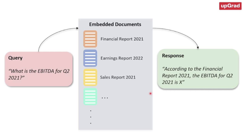  
  
As discussed in the video, generative search offers a new paradigm shift in the search technology, as user’s queries are captured more intuitively than what would be possible in the traditional search, which involves searching based on keywords alone. Generative search leverages the text generation capabilities that decoder-based LLMs such as ChatGPT offer and provides answers based on the user’s specific query.   
  
Generative search refers to the use of generative artificial intelligence (AI) algorithms and techniques to explore and generate new content, ideas or solutions based on user's query. It is a next-generation approach to online search that leverages AI to produce contextual answers to complex questions and generate unique outputs. Generative search relies on generative AI models such as ChatGPT and user prompts or inputs to generate new content in response to a user query. This offers various advantages such as the following:  
* **Increased personalisation and outputs**: By leveraging the generative capabilities of LLMs to generate content such as text, images, audio, program code and more from a given sample, traditional search systems can be enhanced to produce new outputs that are unique to a particular searcher and their search habits. This can lead to a more personalised and tailored search experience.  
* **Enhanced user experience**: Generative search results can deliver a better user experience by compiling an answer faster than having to read through individual search results. Users are more likely to find what they are looking for and have a more efficient search experience.  
Generative search is an exciting development in the field of AI and has the potential to revolutionise the way we search for information online. Companies such as You.com and Google are exploring generative search capabilities and integrating them into their search engines. By leveraging generative AI algorithms, generative search can provide more personalised and accurate search results, enhancing the overall search experience for users. This new search paradigm is also being increasingly used by organisations for various purposes such as creating question-answering systems, chatbots and semantic search applications.  
  
In the next segment, we will explore the concept of embeddings that enables generative search systems to understand the underlying context or meaning of a piece of text.  
  
  
## Intuition Of Embeddings  
  
In the realm of Natural Language Processing (NLP), understanding how computers interpret and work with human language has always been a profound challenge. Teaching a computer to not simply see words as isolated symbols but to grasp their underlying meaning, context and relationships in the way humans do has been a challenge ever since NLP, as a field, was established.  
  
 Word embeddings offer an elegant solution to this puzzle, bridging the world of words and the realm of mathematics. In the next video, Aditya will explain the intuitive concept underlying embeddings and discuss how they have revolutionised NLP applications by capturing the essence of language in a way that machines can comprehend.  
  
  
  
As Aditya explained in the video, embeddings are a useful machine learning concept involved in representing data as points in an n-dimensional space.   
  
Embeddings are vectors or arrays of numbers that represent the meaning be it sentences from a document, images or audio, in a higher dimensional space. These embeddings exist in a space with many dimensions, where each dimension signifies a feature or characteristic that the model has learnt about from the data. Embeddings are how a model grasps the meaning and connections within language as well as how it evaluates and distinguishes between various language components. They act as a link connecting the discrete and continuous aspects as well as the symbolic and numeric elements of language for the models. An important property of embeddings is that similar embeddings tend to cluster together, as shown in the video above.
  
**NOTE:** Refer to the following ++[link](https://atlas.nomic.ai/map/53d8f32e-df36-4394-b30c-6aa4c51968fa/37fc4954-9d86-4331-b204-925709e92883)++ to view the embedding dashboard in Nomic, as shown in the video.  
  
mentioned in the video,** embeddings are not just abstract representations of words - they capture the meaning and relationships within language.** This is achieved through extensive training on vast amounts of text data. During this training, models learn to position words or phrases in a vector space such that similar words are closer to each other, whereas dissimilar ones are further apart. Once the words and pieces of text have been represented as vectors in a high-dimensional space, their similarity or dissimilarity can be measured using various distance metrics. A few common distance metrics include Euclidean distance and cosine similarity as illustrated in the image below.   
  
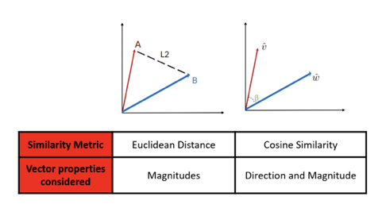  
Cosine similarity is a popular method for measuring similarity between vectors. For two vectors - u, w, the cosine of the angle between the two vectors is given using the following formula shown in the image below.  
Cosine Distance = 1 - Cosine Similarity  
  
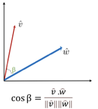  
  
Cosine Similarity formula?->   
If the vectors point in the same direction (i.e., they are similar), the cosine similarity is close to 1. If the vectors are orthogonal (90° apart, indicating dissimilarity), the cosine similarity is 0, and if they point in opposite directions (indicating strong dissimilarity), the cosine similarity is −1. The image below illustrates the three categories of vectors with cosine similarities of -1, 0 and 1 respectively.  
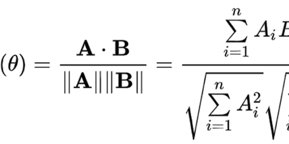  
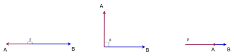  
  
In the video, Aditya explained how vectors capture information using similarity metrics such as cosine similarity. However, similarity metrics tend to fail in situations when dissimilar objects are considered. In such situations, we move to a higher-dimensional space by capturing various other features to better represent such objects. In the next segment, we will explore the vector embeddings pertaining to words and sentences.  
  
**Additional Readings:**  
* In addition to the distance metrics covered above,describes other distance metrics generally used in machine learning applications.++[ this article ](https://machinelearningmastery.com/distance-measures-for-machine-learning/#:~:text=of%20Distance%20Measures-,Distance%20measures%20play%20an%20important%20role%20in%20machine%20learning.,objects%20in%20a%20problem%20domain.&text=Another%20unsupervised%20learning%20algorithm%20that,the%20K%2Dmeans%20clustering%20algorithm.)++  
  
**Vectors For Words**

  
Vector representations for words are a powerful tool in natural language processing. It allows us to capture the meaning of words in a way that can be used by machine learning algorithms. In this segment, we will explore the concept of vector representations for words, and you will learn how they are computed and how they can be used in various applications.  
  
Vector representations for words, also known as word embeddings, are a way of representing words as vectors in a high-dimensional space. Each dimension of the vector represents a different feature of the word, such as its meaning, context or syntactic role. By representing words as vectors, we can perform mathematical operations on them, such as addition and subtraction, to capture the relationships between words and to perform various natural language processing tasks. Let’s hear more about this in the next video.  
  
  
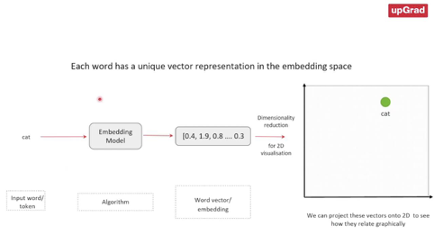  
  
  
  
As discussed in the video, vector representations of words are useful for capturing the context of the word in a sentence. These are particularly useful when words have multiple meanings. These are referred to as word embeddings and are useful for representing words and capturing semantics.   
  
Word embeddings are a way of representing words as vectors in a high-dimensional space, where each dimension corresponds to a feature/set of features representing the word. These features can be anything from the frequency of the word in a corpus to its semantic meaning. The key idea underlying the principle of word embeddings is that words with similar meanings and contexts tend to be grouped close together in a high-dimensional space. They are created using algorithms such as Word2vec and GloVe and have many applications in information retrieval, language modelling and other areas of NLP.  
  
Word embeddings are a fascinating area of research that has revolutionised the way machines understand text and languages. By representing words as vectors, we can enable computers to understand the meaning and context of texts, which, in turn, has led to many practical applications, such as text classification, sentiment analysis and machine translation. One of the most common applications of word embeddings is in information retrieval, wherein they are used to find similar words or phrases based on a user query. Word embeddings are also used in language modelling, where they are used to predict the next word in a sentence.

  
**Applications in NLP**  
  
Embeddings and distance metrics find applications in a wide range of NLP tasks. A few examples are listed below:  
* **Information retrieval**: In search engines, embeddings help match user queries with relevant documents. By calculating the similarity between query embeddings and document embeddings, search engines can rank results effectively.  
* **Sentiment analysis**: Embeddings can be used to analyse the sentiment of text. Similarity between the embedding of a word in a sentence and a sentiment lexicon can indicate the sentiment of the sentence.  
* **Machine translation**: In machine translation models, embeddings help align words or phrases in the source and target languages. Similar embeddings indicate translation equivalents.  
* **Clustering and classification**: Text clustering and classification tasks benefit from embeddings and distance metrics. Similarity-based clustering and classification are common approaches.  
* **Recommendation systems**: Embeddings are crucial for recommendation systems. They help identify users with similar preferences and suggest relevant content. May not work with pretrained transformers, libraries like sentence_transformers which will be covered in the rest of the course from here.. finetuning llms, and 3 slides of transformers left.. Attention Mechanism.. and hidden state term meaning and LSTM and GRU meaning..  
  
  
  
  
So far, you have learnt about word embeddings. Similar to these are sentence embeddings that represent entire sentences in the form of vectors. Sentence embeddings generally perform better at representing entire sentences than the traditional method of combining word embeddings and representing them in a higher-dimensional space. Let’s hear more about this from Aditya in this video.  
  
  
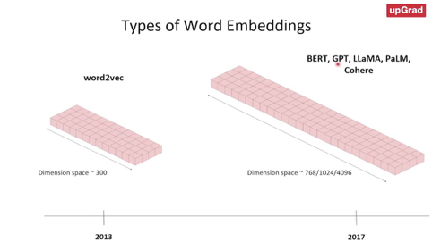  
  
  
  
In this video, Aditya mentioned how sentence embeddings, as shown in the image below, can embed entire sentences. Sentence embeddings generally perform better on individual sentences than their counterparts, i.e. word embeddings that only focus on individual words and tokens.  
  
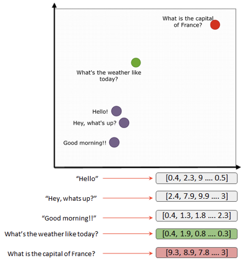  
  
  
  
  
The vector representations generated through sentence embeddings can then be compared semantically using popular similarity metrics that were covered in the previous segments. The key differences between word embeddings and sentence embeddings are given in the table below.  
  

| Word Embeddings | Sentence Embeddings |
| ---------------------------------------------------------------------------------------- | ------------------------------------------------------------------------------------------------ |
| Represent individual words | Represent entire sentences or groups of words |
| Assign a fixed-length vector to each word in the phrase or sentence | Assign a single fixed-length vector to a sentence |
| Can be used in tasks such as text classification, sentiment analysis and text generation | Can be used in tasks such as text classification, machine translation and information retrieval. |
  
## Word Embedding  
in Transformer, in a sentence-> each word is transformed into n dimensional embedding which is distribution over the whole vocabulary, within a shared d dimensional block by block word embedding space.. d  
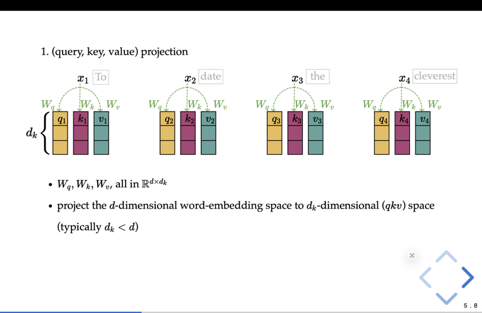  
 dimensions-> vocabulary  
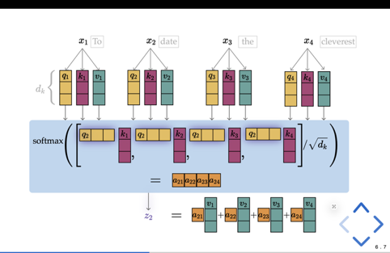  
  
We also explored various types of word embeddings that were classified based on their key architectural models. Various embedding models have been developed over the years that differ based on the key architectural elements, pretraining regimen and training data set used. T**he recent transformer-based models have led to the development of some popular embeddings such as OpenAI’s GPT, ada-002 models and sentence transformers such as BERT. Such models have been observed to preserve the meanings and contexts of sentences c**ompared with the previous generation of embedding models such as Word2Vec and GloVE. In the upcoming segments, we will also explore a few of these.   
  
In the video, Aditya also discussed the various applications of vector representations of words. Applications of such embeddings include information retrieval, question-answering systems, document/text clustering/ classification systems and content-based recommendation systems.  
  
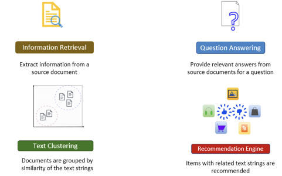  
In the next segment, you will learn how to generate and visualise word embeddings using the techniques we discussed in this session.  
  
**Additional Reading**
This paper explores the key differences between contextual and non-contextual word embeddings - ++[Contextual and Non-Contextual Word Embeddings: An In-Depth Linguistic Investigation](https://aclanthology.org/2020.repl4nlp-1.15.pdf)++  
  
  
  
## Generating and Visualising Embeddings - I

  
In the previous segments, you gained an understanding of the intuition of embeddings and learnt about various embedding models that have been used in the NLP arena for various applications. In this segment, we will use the commonly available embedding models to generate and visualise embeddings. In the next video, Akshay will explain the scope of this coding demonstration.  
  
  
  
  
  
As mentioned in the previous video, these are the steps that we will follow for the coding demonstration:  
1. Mount Google Drive and read the data  
2. Use sentence transformers to generate embeddings  
3. Visualise the embeddings through dimensionality reduction techniques  
  
  
## Semantic Search  
  
Search, or the more technical term ‘information retrieval’, is the process of retrieving relevant information from a large collection of data. Semantic search can be considered to be a subset of information retrieval that seeks to improve search accuracy by understanding the user's intent and the contextual meaning of terms by applying the principles of embedding space. Semantic search uses vector search and machine learning techniques to return results that aim to match a user’s query even when there are no word matches. Let’s hear more on this from Akshay in the next video.  
  
  
As mentioned in the video, semantic search focuses on the semantic understanding of the query and the documents by generating and comparing vector embeddings. In the previous segments, you were introduced to the concept of word embeddings that can be used to represent words as vectors in a high-dimensional space. These embeddings can be used to capture the semantic meaning of words and measure the similarity between words or documents. In semantic search ( sometimes also known as dense retrieval), the objective is to extract the document that matches closely with the user’s query. Semantic search systems go beyond simple keyword matching and take into consideration the context, semantics and conceptual relationships between words to match a user query with the corresponding content. As a result, a semantic search system can understand the intent and meaning behind a user's query and match it with relevant documents even if the query and the documents use different words or phrasing.   
  
  
After representing the pieces of text or documents in a high-dimensional space, the vector embeddings of the query and the documents can be compared using a distance metric such as cosine similarity. The search problem is now converted to a nearest neighbour method to find the phrase that closely matches with the vector embeddings of the query phrase and vice versa, as illustrated in the diagram below.  
  
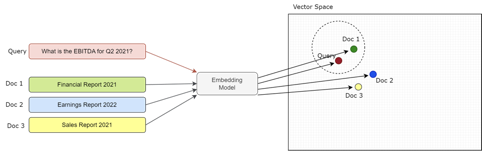  
With the advent of transformers and the rise of LLM-enabled text embeddings, it has become possible to capture the semantic value of words and phrases beyond their surface-level syntax or spelling.  
  
  
  
  
  
  
  
  
  
  
  
  
  
  
  
  
  
  
  
  
  
  
  
  
  
## Vector Database and RAG  
  
  
  
  
## Vector Store  
  
## Architecture
  
In the previous sessions, you learnt in detail about vector embeddings and their representations for various types of unstructured data, including textual data. And in the previous session, we built a semantic search application and stored the vector embeddings locally using a Pandas dataframe.   

While easy, retrieving and storing vector embeddings locally, such as in a dataframe, is quite time-consuming when the operation is scaled to include multiple documents. This can give rise to latency issues in our semantic search application, especially when real-time search and retrieval are required. To cater to such low-latency requirements, developers are increasingly using vector stores to store vector embeddings once documents are ingested and chunked. In the video below, Aditya will explain the various aspects of vector stores.  
  
  
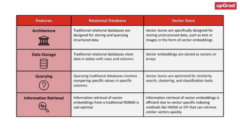  
  
  
  
As mentioned in the video, a vector store is a data storage system that is specially designed to store, index and retrieve high-dimensional vectors quickly. They can store and retrieve vectors much faster than traditional relational databases (RDBMS) and local storage options such as dataframes or flat files (.csv, .xlsx etc.). The image below illustrates some of the key differences between relational databases and vector stores.  
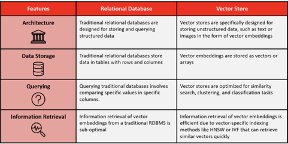  
  
  
They offer fast and accurate similarity search and data retrieval based on their vector distance or other similarity metrics. Vector stores consist of various components that work together to provide efficient storage, indexing and querying capabilities for high-dimensional vectors. Some of its key features include data management, metadata storage and filtering, and approximate nearest-neighbour (ANN) search algorithms.  
* **Data management**: Vector databases offer features for easy data storage, insertion, deletion and updating, making it convenient to manage and maintain vector data.   
* **Metadata storage and filtering**: These databases can store metadata associated with each vector entry, allowing users to query the database using additional metadata filters for more precise queries.  
* **Approximate nearest-neighbour (ANN) search algorithms**: Vector databases use a combination of algorithms to optimise similarity search, such as hashing, quantisation or graph-based search.   
  
The main advantages of using vector stores for storing and querying high-dimensional vectors are as follows:  
* **Fast and accurate similarity search**: Vector stores excel at finding the most similar or relevant data based on the underlying semantic or contextual meaning of various texts which enables efficient retrieval of information. These can return query results faster than the traditional methods of search, such as keyword-based search or k-Nearest Neighbour-based searching methods.  
* **Flexibility**: Vector stores can be used with various types of high-dimensional vectors, ranging from tens to thousands of dimensions, depending on the complexity and granularity of the data.  
  
The popularity of vector stores is augmented by the availability of indexing strategies that can retrieve embeddings faster than traditional lookup-based approaches. Indexing in vector stores involves breaking down a document or website into smaller segments and converting these segments into vectors that can be stored in a vector database. The indexing process maps the vectors to a data structure that can be traversed quickly.   
  
In the previous segment, you were introduced to the two types of vector stores: vector libraries and vector databases. In the video below, Aditya will explain these terms in detail.  
  
## Different Indexing Strategies:  
  
As mentioned in the video, vector stores use indexing strategies to efficiently query vectors by computing the proximity of a query to the vector embeddings. The indexing algorithms used in vector databases vary depending on the specific application. Recently, however, approximate nearest-neighbours (ANN) methods such as product quantisation, Hierarchical Navigable Small World (HNSW) and Locative Sensitive Hashing(LSH) have garnered significant attention from developers and researchers alike. As the name suggests, ANN methods involve an approximation of the usual nearest-neighbour methods. You might already be familiar with some of the common methods of the nearest-neighbour algorithm called the k-nearest neighbour (kNN) method.  
  
As discussed already, semantic search involves comparing the vector representations of a query and document by generating the vector embeddings and comparing the embeddings using a distance metric such as cosine similarity. Exact nearest neighbours, such as the **kNN** algorithm, can often help narrow down the retrieval process and produce accurate search results. But this accuracy comes at the expense of increased retrieval time. On the other hand, ANN methods sacrifice accuracy for speed.   
  
**ANN-> Same as Euclidean in L2 and 1/nth in n dimensional space**  
**Euclidean Distance-√(x-y)^2**  
  
**√((1-0)^2+(0-1)^2) = 1.414**  
  
  
Now, as mentioned in the previous session, such an exact search often results in an O(N) time complexity; however,   
  
  
  
**ANN techniques result in a sub-linear time complexity O(log(N)). This is achieved with the help of special indexing techniques that make retrieval faster compared to traditional lookup-based methods. Indexing is like sorting a guest list by a certain characteristic, such as the first letter of their names or their closeness to you, so you can find your friends faster. Searching in vector stores involves querying the vector database to retrieve the most similar or relevant data based on their vector distance or similarity. The vector store compares the indexed query vector to the indexed vectors in a data set to find the nearest neighbours by applying a similarity metric of the indexed vectors.**   
  
In summary, indexing is the process of organising vectors in a way that allows for efficient similarity search, while searching is the process of querying a vector database to retrieve the most similar or relevant data based on their vector distance or similarity. Some of the common approximate nearest-neighbour algorithms are as follows:  
* Tree-based algorithms such as ++[ANNOY](https://github.com/spotify/annoy)++, which was created by Spotify  
* Graph-based algorithms such as the Hierarchical Navigable Small World (HNSW) algorithm; popular C++ implementation of this algorithm available ++[here](https://github.com/nmslib/hnswlib)++  
* Cluster-based algorithms such as the ++[Facebook AI Similarity Search (FAISS)](https://github.com/facebookresearch/faiss)++ and ++[Product Quantisation ](https://www.pinecone.io/learn/series/faiss/product-quantization/#:~:text=Product%20quantization%20(PQ)%20is%20a,x%20faster%20in%20our%20tests.)++(PQ)  
* Hash-based algorithms such as ++[Locality Sensitive Hashing](https://www.pinecone.io/learn/series/faiss/locality-sensitive-hashing/)++ (LSH).  
  
Each algorithm mentioned above finds applications in various use cases and comes with its own advantages and disadvantages. In the video above, Aditya explained the popular algorithm HNSW, which is a popular method of conducting approximate nearest-neighbour searches.   
  
**Hierarchical Navigable Small World (HNSW)**  
  
  
  
The Hierarchical Navigable Small World (HNSW) algorithm is a popular graph-based method that combines the principles of Navigable Small World and proximity graphs. It is a fully graph-based solution that constructs a multi-layered graph with fewer connections in the top layers and more dense regions in the bottom layers as shown in the image below. The search starts from the highest layer and moves one level below every time the local nearest neighbour is found greedily among the layer nodes. Ultimately, the nearest neighbour found in the lowest layer is the answer to the query. Nodes in HNSW are inserted sequentially one by one, and every node is randomly assigned an integer indicating the maximum layer at which the node can be present in the graph.  
  
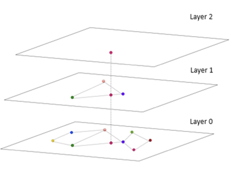  
The HNSW greedy search algorithm is sublinear, which means it has a complexity close to log(N), where N is the number of vectors in the graph. This makes it an efficient algorithm for approximate nearest-neighbour search. HNSW is used in various vector databases and libraries, including Pinecone, Faiss and ChromaDB.   
  
In the next segment, we will go over the various types of vector stores that are commonly available, namely vector libraries and vector databases.  
  
**Supplementary Resources:**  
* This ++[article](https://www.pinecone.io/learn/vector-database/#:~:text=a%20vector%20database.-,Algorithms,-Several%20algorithms%20can)++ provides an in-depth analysis of various vector indexing algorithms.  
* This ++[article](https://www.pinecone.io/learn/series/faiss/hnsw/)++ by Pinecone elucidates the intricacies of the HNSW algorithm in detail.  
* This ++[article](https://abishek21.medium.com/building-your-favourite-tv-series-search-engine-information-retrieval-using-bm25-ranking-8e8c54bcdb38)++ illustrates the BM25 indexing strategy employed in information retrieval.  
* In this ++[article](https://medium.com/swlh/demystifying-a-web-search-problem-using-inverted-index-c6df8236291)++, the author delves into the utilization of the Inverted File Index (IVF) indexing strategy.  
  
  
## Vector Library  
  
**Vector databases and vector libraries are two classes of vector stores that can be actually used to store embedding.**  
  
But in vector libraries these store vector embeddings in memory indexes.So in order to perform the similarity search, it stores the vector embeddings in the memory of the system in in memory indexes  
  
  
Vector stores come in multiple flavours; two common categories are vector libraries and vector databases.  
  
Vector libraries and vector databases can be used to efficiently perform nearest-neighbour searches to retrieve similar pieces of text based on their semantic meaning. Vector libraries (also referred to as vector indices or vector search libraries) are popular for quick prototyping purposes and when the data size is considerably small. These libraries do not support the usual create, read, update and delete (CRUD) support that traditional relational databases and vector databases offer; hence, they are not suitable for building scalable applications. They, however, offer native support to store the vector embeddings to the local disk by persisting it from memory to the local disk. Popular vector libraries include ++[Meta’s FAISS](https://github.com/facebookresearch/faiss)++, ++[Spotify’s ANNOY](https://github.com/spotify/annoy)++, ++[Google SCaNN](https://github.com/google-research/google-research/tree/master/scann)++, ++[NMSLIB](https://github.com/nmslib/nmslib)++, ++[hnswlib](https://github.com/nmslib/hnswlib)++, etc.  
  
Vector databases are optimised for storage and the retrieval of vector embeddings with the additional capabilities to store and update the vector embeddings, as they support CRUD operations natively. This makes them a great choice for applications that require low-latency search, such as recommendation systems, search engines and chatbots. Vector databases are typically more focussed on enterprise-level production deployments as opposed to vector libraries that are used for quick prototyping. Popular vector databases include ++[Chroma](https://docs.trychroma.com/)++, ++[Pinecone](https://www.pinecone.io/)++, ++[Weviate](https://weaviate.io/)++, ++[Qdrant](https://qdrant.tech/)++, etc.  
  
The figure below illustrates the differences between both types of vector stores.  
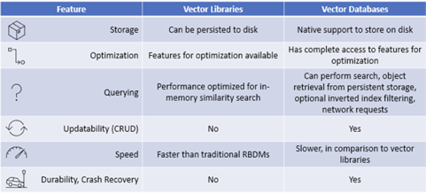  
Additionally, vector databases solve several major limitations of vector libraries. These include:  
  
  
Next, let us discuss about vector libraries.Vector databases and vector libraries are two classes of vector stores that can be actually used to store embedding.  
  
  

| Feature | Vector Libraries | Vector Databases |
| -------------------------- | ----------------------------------------------------- | ----------------------------------------------------------------------------------------------------------------- |
| Storage | Can be persisted to disk | Native support to store on disk |
|  | Optimization Features for optimization available | Has complete access to features for optimization |
| Querying | Performance optimized for in-memory similarity search | Can perform search, object retrieval from persistent storage, optional inverted index filtering.
network requests |
| Updatability (CRUD) | No | Yes |
| Speed | Faster than traditional RBDMS | Slower, in comparison to vector
Iibraries |
| Durability, Crash Recovery | No | Yes |
  
  
  
  
**Pipleline->after converting (word, image, video, etc) to embedding or vector(tokenization), it is indexed and stored in database, queried and processed, **  
  
**Vector store two terms, vector library  and vector database ->**  
  
** vector library->(word, image, video, etc) to embedding or vector(tokenization), it is indexed-> only querying possible, obviously, can be in memory and fast**  
  
Vector database-> Pipeline-> Database, stored on disk, scalable,   
  
  
Additionally, vector databases solve several major limitations of vector libraries. These include:  
* **Metadata storage and filtering**: Vector databases can store metadata associated with each vector entry. Users can then query a database using additional metadata filters for finer-grained queries. Vector libraries store only vector embeddings and not the associated objects they were generated from. When you run a query, a vector library will respond with the relevant vectors and object IDs. This is limiting since the actual information is stored in the object and not the ID. To solve this problem, you would have to store the objects in a secondary storage. You could then use the returned IDs from the query and match them to the objects to understand the results.  
* **Scalability**: Vector databases are designed to scale with growing data volumes and user demands, providing better support for distributed and parallel processing. Standalone vector indices may require custom solutions to achieve similar levels of scalability (such as deploying and managing them on Kubernetes clusters or other similar systems).  
* **Real-time updates**: Vector databases often support real-time data updates, allowing for dynamic changes to the data, whereas standalone vector indexes may require a full re-indexing process to incorporate new data, which can be time-consuming and computationally expensive.  
* **Backups and collections**: Vector databases handle the routine operation of backing up all the data stored in a database. Pinecone also allows users to choose specific indexes that can be backed up in the form of ‘collections’, which store the data in that index for later use.  
* **Ecosystem integration**: Vector databases can more easily integrate with other components of a data processing ecosystem, such as ETL pipelines (like Spark), analytics tools (like Tableau and Segment) and visualisation platforms (like Grafana),    streamlining the data management workflow. It also enables easy integration with other AI-related tools such as LangChain, LlamaIndex and ChatGPT’s plugins.  
* **Data security and access control**: Vector databases typically offer built-in data security features and access control mechanisms to protect sensitive information, which may not be available in standalone vector index solutions.  
  
Here are the steps in the typical process of storing vector embeddings in a vector database:  
1. **Generate vector embeddings**: In this step,  you generate the vector embeddings for the documents.  
2. **Perform indexing**: The vector database indexes vectors using an algorithm such as PQ, LSH or HNSW (more on these below). This step maps the vectors to a data structure that will enable faster searching.  
3. **Store indices and embedding vectors**: In this step, you store the embedding vectors in the local storage or cache of the vector store and generate the indices for the embeddings.  
4. **Querying**: The vector database compares the indexed query vector to the indexed vectors to find the nearest neighbours (applying a similarity metric used by that index)  
5. **Perform post-processing**: In this stage, common data management techniques such as updation and deletion operations are performed on the vector embeddings. In some cases, the vector database retrieves the final nearest neighbours from the data set and post-processes them to return the final results. This step can include re-ranking the nearest neighbours using a different similarity measure.
LL  
  
  
  
Chroma and Pinecone are vector databases that are designed for small to medium-sized data sets. ChromaDB is fully open-source, whereas Pinecone has a free tier and pricing plans that provide additional features and increased scalability. There are several open-source alternatives to Pinecone and ChromaDB that can be used to build a vector database for LLM (Large Language Model)-based embeddings. One such alternative is Pgvector, a PostgreSQL extension that supports vector data types and provides fast vector operations. Another option is Weaviate, a cloud-native, open-source vector database that is designed for machine learning applications. Weaviate supports semantic search and can be integrated with other machine learning tools such as TensorFlow and PyTorch. ANNOY is an open-source library for approximate nearest-neighbour search that is optimised for large-scale data sets. It can be used to build a custom vector database tailored to specific use cases.  
  
In the upcoming segments, we will work with the Chroma vector database.  
  
**Additional Readings:**  
* This ++[article](https://weaviate.io/blog/vector-library-vs-vector-database)++ describes the differences between vector libraries and vector databases in detail.  
  
  
In the video, Aditya explained the typical process by which vector databases, such as ++[ChromaDB](https://docs.trychroma.com/)++, are used to store and retrieve vector embeddings. Chroma is generally used to do the following:   
* Create collections to store embeddings  
* Perform collection management tasks such as updation and deletion  
* Query the vector embeddings  
  
In the video, we saw the various codes for working with Chroma. Let’s go over the important ones below:  
* **Instantiate the Chroma client**: This method is used to instantiate the Chroma client by first initiating the Chroma package as shown in the code block below. Chroma can be configured to use an in-memory database or an on-disk database, which is useful for larger data that does not fit in the memory.

import chromadb
chroma_client = chromadb.Client()  
* **Adding to collection**: Once a client is created, a Chroma collection must be created to store the vector embeddings. A collection can be created using the ‘create_collection’ method as shown in the following image.

 collection.add( embeddings =  <embeddings>,  
*  documents = <documents>,  
*  metadata = <metadata>,  
*  ids = <id>  
* )  
* **Querying the collection**: Once the vector embeddings are stored in the collection, it can be queried using the ‘query’ method as shown in the image below. The query function can be used to search for similar documents based on a given query, which can be in the form of natural language or a specific embedding. When using the query function, you can specify which data you want returned, such as embeddings, documents, metadata and distances. By default, Chroma will return the documents, metadata and distances of the results while excluding the embeddings for performance reasons.
  
results = collection.query(  
 query =  ['This is a query document'],  
 n_results = 2,  
)  
  
* **Collection management**: Chroma supports updation and deletion operations on the collection as shown in the image below. The ‘update’ method updates the vector embeddings by taking a dictionary with the new values for the item as an argument and the ID of the item to be updated. The delete method takes the ID of the item to delete as an argument, which will delete the embeddings, documents and metadata associated with the item.  
  
collection.update(  
 ids = <id>,  
 documents = <document>,  
 metadata = <metadata>  
)  
  
  
collection.delete(  
 ids = <id>,  
)  
  
  
In the upcoming session, you will see a code demonstration of how to work with the various commands and methods in Chroma to perform a semantic search.  
  
  
In this session, you learnt about vector stores. The indexing strategies provided in all the major vector stores make them a popular choice for storing vector embeddings. This is because their search and retrieval process is better than the traditional method of storing the vector embeddings locally in flat files. Indexing refers to the process of organising vectors in a way that allows for efficient similarity search.  
  
You also learnt about the two main types of vector stores - vector libraries and vector databases - and the major differences between them. As a rule of thumb, vector databases are preferred to vector libraries when the data at hand is sufficiently large and the development velocity is important. Vector databases are scalable solutions and support CRUD operations. They are increasingly becoming a popular choice among developers.  
  
We then explored the capabilities of ChromaDB, a popular open-source vector database. Then, we augmented the capabilities of our semantic search application by including ChromaDB for the storage and retrieval of vector embeddings.  
  
  
  
  
  
  
  
  
  
## Semantic Search with Chromadb  
##   
##   
Welcome to this session, titled ‘Semantic Search Demonstration - II’. In this session, you will perform a hands-on demonstration and understand how to work with vector embeddings in Chroma, which is a popular open-source vector database.

In this session
In this session, we will cover the topics listed below.  

| Topics | Subtopics |
| ---------------------------------- | -------------------------------------------------------------------------------------------------------------- |
| Semantic Search Demonstration - II | •	Semantic Search With Chroma
	◦	Working With Chroma
	◦	Building Collections in Chroma
	◦	Querying With Chroma |
  
**Creating Chroma Collections**

  
In this demonstration, we will go through some simple code to understand the basic functionalities of Chroma. So far, we only know that Chroma is a vector database that helps us store and query text data. We will understand more about it as we perform the demonstration. Till then, you can take a look at the official documentation of Chroma in Python ++[here](https://docs.trychroma.com/)++ and read through it to understand some of its basic functionalities.  
  
  
n the videos above, we read a CSV file and created all the embeddings for the section chunks as described in the first session. But since we read our data from a CSV file, everything was converted into the object data type. However, we need all the embeddings in the list data type for further processing, which was done using the apply function and the ast library.  
  
And finally, we clearly had a neat list of vector embeddings of the various chunks, which can now be passed to Chroma.  
**hatever we store in Chroma can be looked at as a collection. You can add embeddings or chunks of text directly to Chroma using its collection methods. **  
  
**After installing and importing Chroma, we initiated a client object. This initiation is the first step and will help us perform operations on the collections we wish to add and store in Chroma. There is also another method that uses PersistentClient() and helps us store data on the disk, in contrast to the normal Client() method, which runs in memory. For our demo, we will use PersistentClient(). **  
  
**NOTE: Chroma requires SQLite version 3.35 or higher. If you experience problems, either upgrade to Python 3.11 or install an older version of chromadb.**  
  
**Client**  
**import chromadb**  
**client = chromadb.Client()**  
  
**PersitentClientimport chromadb**  
client = chromadb.PersistentClient(path="/path/to/data")  

  
**The first method that we looked at is create_collection, which is shown below. We named this collection ‘semantic_search_with_Chroma’.**  
**collection = client.create_collection(<collection_name>)**  

  
Now that we have created this collection, we can add or store documents in this collection.
In the collection.add() method, we can pass our embeddings, documents and the IDs related to the documents. We can also pass information about the metadata of the documents to the collection. We will look at this in detail later.   
  
Note that we added documents to the vector database. We need not do that if we already have the embeddings. However, IDs are necessary, as Chroma needs to identify every unique piece of text.   
**collection.add(**  
**     embeddings = <embeddings>,**  
**     metadatas = <metadatas>,**  
**     documents = <documents>,**  
**     ids = <ids>,**  
)  

  
We later used the collection.peek() and collection.get() command to fetch a particular ID from our collection.   
  
Now, Chroma also offers some default models that will embed the documents for us instead of requiring us to feed the embeddings. The default embedding model that Chroma uses for this purpose is the ‘all-MiniLM-L6-v2’, which we have worked with before.  
  
We standardised the casing in our embeddings in the existing dataframe and also added the titles and the section titles as metadata. This allows us to store additional information about the embedded documents that may be useful during the querying process when we return our final semantic search results.  
  
Another important point to note here is the format in which we need to pass the metadata to the Chroma collection. As shown in the video, you need to pass all metadata information as dictionaries, which themselves are contained within an outer list. So, we created a dictionary with 2 keys, ‘Title’ and ‘Section’ and added all titles and sections as values into these keys for each of the chunks.  
  
**We later looked at the collection.upsert() method which helped us update the entries and add the metadata to them. The main difference between update() and upsert() is that if an entry (document ID) is already present in a collection, the upsert() method will update it with the new values provided and if the entry (document ID) is not present, it will be added to the collection similar to the add() function. The collection.update() method, however, will not update unless the document ID does not already exist in the database and will instead raise an error.**  
  
  
  
  
  
In the video, we used additional arguments ‘where’ and ‘where_document’ in the query method that help you filter the embeddings in the database by keywords in your metadata and document text, respectively. These can be particularly useful when you have some information about specific words or keywords that you necessarily want to have in your final search results. Using these filter methods allows you to augment the semantic search and keyword search approaches and can make your overall search more effective.  
  
You also saw that using the where and where_document filters, you can also perform logical operations. You can read more about these filters and some examples related to them here.  
  
  
In the video above, we learnt how our files are saved in ChromaDB. Since we had mounted Google Drive in the Colab Notebook drive, the collections were stored in Google Drive in the input path mentioned. This persists the Chroma collection in the disk; the collection can be retrieved for later querying in the same or different notebook. We can use the get method to get collections using the command  ‘collection.get()’.  
  
In the next segment, we will summarise all the important learnings from this session. But first, answer the following questions.  
  
  
  
Additional Readings:  
Chroma’s GitHub repository contains many examples.  
  
**Summary**  
  
In this session, we explored the Chroma vector database in detail. We saw the different methods of manipulating vector embeddings in Chroma. We first created a Chroma collection as a precursor to storing vector embeddings in the vector database. We then explored the different collection management strategies to manipulate the vector embeddings stored in the vector database such as the add, update, upsert methods and the delete methods. Then, we explored how the vector embeddings can be queried or filtered using the query function. You understood how to use the where commands to filter the metadata and the document contents.   
  
  
  
##   
##   
##   
##   
##   
##   
##   
##   
##   
## Retrieval augmented generation (RAG) 
  
  
## Overview  
  
Generator (LLM)  
  
LLms have their knowledge of their own. We as a company have our own database. We need to first decide what data should be public to LLM and private to us. Using this public data, we tell the LLM to learn from this data, provided as embeddings as tensors and this and knowledge available to it on its own and web search, it can automate work of our own. Like Private cloud compute. Our data is stored there, which is encrypted even for Apple, but chatgpt can store this data in its servers when Siri is using this plugin to answer our queries. What’s the point of this then? Microsoft is known for its violation of privacy easily when we use other services which almost every software is using chatgpt to answer. There has to be a better way. Yes Siri Plus gemini apparently.  Do not know the architecture.   
  

In the previous session, you were introduced to the key elements of semantic search. You dived into the technicalities of the semantic search pipeline and also learned how to augment the performance of the semantic search pipeline with the help of vector databases. Semantic search is a type of search that goes beyond traditional keyword matching to understand the meaning of a query and return results that are relevant to the user's intent. You were also introduced to the term ‘generative search’, which refers to the type of search that uses artificial intelligence to generate new content in response to a user's query. This content can include text, images, code and creative content. Let's hear more about it in the video given below.  
  
  
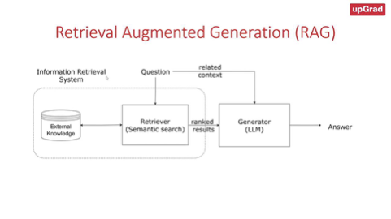  
  
  
  
As explained in the video, the main distinction between semantic search and generative search is that semantic search is primarily focused on retrieving relevant information, whereas generative search is focused on generating new content. However, the two technologies can be used together to improve the performance of a variety of tasks, such as question answering, summarisation, and machine translation. For example, a question-answering system can use semantic search to retrieve relevant documents from a knowledge base and then use generative search to generate a comprehensive and informative answer to the user's question. The differences between semantic search and generative search are elaborated in the table below.  
  
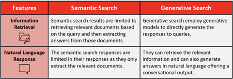  
  
  
Overall, semantic search and generative search are two powerful technologies that can be used to improve the performance of various AI tasks. Using these technologies together, we can create AI systems that are more accurate, informative and helpful.  
  
  
Retrieval augmented generation (RAG) is a special type of generative search that combines the strengths of semantic search and large language models to generate more accurate responses to user queries. This is a new search paradigm that combines the strengths of both retrieval-based models and generative foundation models to enhance the quality and relevance of the generated text. RAG retrieves relevant information from an external knowledge base to supplement the LLM's internal representation of information, which allows for fine-tuning and adjustments to the LLM's internal knowledge, making it more accurate and up-to-date. RAG has several applications, including question-answering systems, chatbots, and industry-specific LLMs. RAG can reduce hallucinations and repetition while improving specificity and factual grounding compared with conversation without retrieval. RAG can also provide more contextually appropriate answers to prompts as well as base those answers on the latest data.  
  
  
## RAG Pipeline  
  
* Embedding Layer  
* Search and Rank Layer  
* Generation Layer  
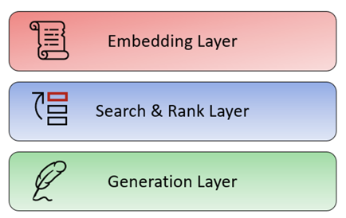  
  
Now, let’s discuss each of these layers in detail.  
  
**Embedding Layer**  
  
  
You are already familiar with the embedding layer, as it was covered in the previous sessions on semantic search. The embedding layer is typically the first layer of a RAG model, and it typically contains an embedding model that is trained on a massive data set of text and code. This data set is used to learn the relationships between words and phrases and to create embeddings that represent these relationships. The embedding layer is an important part of RAG models because it allows your system to understand the meaning of the text that it is processing and understand its semantic relationship to the query. The embedding layer generates embeddings for your text corpus and allows the RAG model to understand the meaning of the query and to generate a relevant and informative response. This is essential for a variety of tasks, such as question answering, summarisation and machine translation.  
  
**Search and Rank Layer**  
The next layer is the search and rank or the re-rank layer. The search and re-rank layer is a crucial component that is responsible for retrieving the relevant information from an external knowledge base, ranking it based on its relevance to the input query and presenting it to the generation layer for further processing. The search and re-rank layer is an essential component of RAG, as it ensures that the retrieved text is accurate, relevant and contextually appropriate. The search and re-rank layer typically consists of two components:  
* A search component that uses various techniques to retrieve relevant documents from the knowledge base  
* A re-rank component that uses a variety of techniques to re-rank the retrieved documents to produce the most relevant results  
  
The search component typically uses a technique called semantic similarity. As discussed in the previous session, semantic similarity is a measure of how similar two pieces of text are in terms of their meaning. The search component uses semantic similarity to retrieve documents from a knowledge base that are relevant to the user's query.   
  
The re-rank component of the search typically uses a variety of techniques to re-rank the retrieved documents. These techniques can include the following:  
* Ranking by relevance: The re-rank component can rank the retrieved documents based on how relevant they are to the user's query.  
* Ranking by popularity: The re-rank component can rank the retrieved documents based on how popular they are, such as by measuring the number of times they have been viewed or shared.  
* Ranking by freshness: The re-rank component can rank the retrieved documents based on how recent they are, such as by measuring the date on which they were published.  
  
The search and re-rank layer is an important part of RAG models because it allows the model to retrieve and re-rank relevant documents from a knowledge base. This is essential for numerous tasks, such as question answering, summarisation and machine translation. The search and re-rank layer is a powerful tool that can be used to improve the performance of a variety of AI tasks. It is an essential part of RAG models, and it plays a key role in helping these models retrieve and re-rank relevant information. The retrieval-based model is used to find relevant information from existing information sources. The re-rank layer is used to rank the retrieved information based on its relevance to the input query.   
  
**Generation Layer**  
The generation layer is typically the last layer of a RAG model which consists of a foundation large language model that is trained on a massive data set of text and code. As the name suggests, the generation layer allows the model to generate new text in response to a user's query. The generative model takes the retrieved information, synthesises all the data and shapes it into a coherent and contextually appropriate response. This is essential for many tasks, such as question answering, summarisation machine translation and also generative search specifically RAG. In the context of search, this layer excels in providing context and natural language capabilities for generative search.  
  
  
  
Aditya then explained the various stages of the RAG pipeline as shown in the image below. These are given below:  
1. **Step 1:** Build the vector store  
2. **Step 2:** Embed the query and perform semantic search  
3. **Step 3:** Pass the prompt with the query and the relevant documents to a Large Language Model (LLM)  
**NOTE**: In this project, we will be using GPT-3.5 as the Large Language Model for building the generative search application.  
  
Let’s go over each of these steps in detail.  

**Step 1: Build the vector store:** The first step is to build a vector store that can store documents along with metadata. A vector store is a database that stores embeddings of text data in a vector space. The documents are converted to raw text and then split into chunks. Each chunk is then represented as a vector using an embedding model. The vector store is then populated with these vectors.  
  
**Step 2: Embed the query and perform semantic search: **The next step is to embed the user query into the same vector space as the documents in the vector store. This is done using an embedding model. Once the query is embedded, a semantic search is performed to find the closest embedding from the vector store. The entries with the highest semantic overlap with the query are retrieved.  
  
**Step 3: Pass the prompt with the query and the relevant documents to the LLM: **The final step is to pass the prompt, which is a concatenation of the query and the retrieved documents, to the LLM. The LLM generates a response based on the context of the query, the system prompt and the relevant documents passed from the search layer. The retrieved documents serve as the knowledge bank and provide the necessary context for the query to the LLM, which helps it generate a more accurate and relevant response.  
  
In the first step, we process the documents (in this case, the documents pertain to the insurance domain) to extract the text, split it into smaller chunks and then pass them to the embedding model.
  
  
As you saw in the video, the ++[PDFPlumber library](https://pypi.org/project/pdfplumber/)++ is very efficient in extracting the text contents of multiple PDF documents. The library can also represent a table in a neat list of lists format that preserves the original hierarchical structure of the document. The library also supports visual debugging of almost any type of machine-generated PDFs; you can read more about it in the documentation link provided above.  
  
##   
## Vector Database and RAG  
  
  
  
  
## Vector Store  
  
## Architecture
  
In the previous sessions, you learnt in detail about vector embeddings and their representations for various types of unstructured data, including textual data. And in the previous session, we built a semantic search application and stored the vector embeddings locally using a Pandas dataframe.   

While easy, retrieving and storing vector embeddings locally, such as in a dataframe, is quite time-consuming when the operation is scaled to include multiple documents. This can give rise to latency issues in our semantic search application, especially when real-time search and retrieval are required. To cater to such low-latency requirements, developers are increasingly using vector stores to store vector embeddings once documents are ingested and chunked. In the video below, Aditya will explain the various aspects of vector stores.  
  
  
  
  
  
  
As mentioned in the video, a vector store is a data storage system that is specially designed to store, index and retrieve high-dimensional vectors quickly. They can store and retrieve vectors much faster than traditional relational databases (RDBMS) and local storage options such as dataframes or flat files (.csv, .xlsx etc.). The image below illustrates some of the key differences between relational databases and vector stores.  
  
  
  
They offer fast and accurate similarity search and data retrieval based on their vector distance or other similarity metrics. Vector stores consist of various components that work together to provide efficient storage, indexing and querying capabilities for high-dimensional vectors. Some of its key features include data management, metadata storage and filtering, and approximate nearest-neighbour (ANN) search algorithms.  
* **Data management**: Vector databases offer features for easy data storage, insertion, deletion and updating, making it convenient to manage and maintain vector data.   
* **Metadata storage and filtering**: These databases can store metadata associated with each vector entry, allowing users to query the database using additional metadata filters for more precise queries.  
* **Approximate nearest-neighbour (ANN) search algorithms**: Vector databases use a combination of algorithms to optimise similarity search, such as hashing, quantisation or graph-based search.   
  
The main advantages of using vector stores for storing and querying high-dimensional vectors are as follows:  
* **Fast and accurate similarity search**: Vector stores excel at finding the most similar or relevant data based on the underlying semantic or contextual meaning of various texts which enables efficient retrieval of information. These can return query results faster than the traditional methods of search, such as keyword-based search or k-Nearest Neighbour-based searching methods.  
* **Flexibility**: Vector stores can be used with various types of high-dimensional vectors, ranging from tens to thousands of dimensions, depending on the complexity and granularity of the data.  
  
The popularity of vector stores is augmented by the availability of indexing strategies that can retrieve embeddings faster than traditional lookup-based approaches. Indexing in vector stores involves breaking down a document or website into smaller segments and converting these segments into vectors that can be stored in a vector database. The indexing process maps the vectors to a data structure that can be traversed quickly.   
  
In the previous segment, you were introduced to the two types of vector stores: vector libraries and vector databases. In the video below, Aditya will explain these terms in detail.  
  
## Indexing:  
  
As mentioned in the video, vector stores use indexing strategies to efficiently query vectors by computing the proximity of a query to the vector embeddings. The indexing algorithms used in vector databases vary depending on the specific application. Recently, however, approximate nearest-neighbours (ANN) methods such as product quantisation, Hierarchical Navigable Small World (HNSW) and Locative Sensitive Hashing(LSH) have garnered significant attention from developers and researchers alike. As the name suggests, ANN methods involve an approximation of the usual nearest-neighbour methods. You might already be familiar with some of the common methods of the nearest-neighbour algorithm called the k-nearest neighbour (kNN) method.  
  
As discussed already, semantic search involves comparing the vector representations of a query and document by generating the vector embeddings and comparing the embeddings using a distance metric such as cosine similarity. Exact nearest neighbours, such as the kNN algorithm, can often help narrow down the retrieval process and produce accurate search results. But this accuracy comes at the expense of increased retrieval time. On the other hand, ANN methods sacrifice accuracy for speed.   
  
ANN-> Same as Euclidean in L2 and 1/nth in n dimensional space  
Euclidean Distance-√(x-y)^2  
  
√((1-0)^2+(0-1)^2) = 1.414  
  
  
Now, as mentioned in the previous session, such an exact search often results in an O(N) time complexity; however, ANN techniques result in a sub-linear time complexity O(log(N)). This is achieved with the help of special indexing techniques that make retrieval faster compared to traditional lookup-based methods. Indexing is like sorting a guest list by a certain characteristic, such as the first letter of their names or their closeness to you, so you can find your friends faster. Searching in vector stores involves querying the vector database to retrieve the most similar or relevant data based on their vector distance or similarity. The vector store compares the indexed query vector to the indexed vectors in a data set to find the nearest neighbours by applying a similarity metric of the indexed vectors.   
  
In summary, indexing is the process of organising vectors in a way that allows for efficient similarity search, while searching is the process of querying a vector database to retrieve the most similar or relevant data based on their vector distance or similarity. Some of the common approximate nearest-neighbour algorithms are as follows:  
* Tree-based algorithms such as ++[ANNOY](https://github.com/spotify/annoy)++, which was created by Spotify  
* Graph-based algorithms such as the Hierarchical Navigable Small World (HNSW) algorithm; popular C++ implementation of this algorithm available ++[here](https://github.com/nmslib/hnswlib)++  
* Cluster-based algorithms such as the ++[Facebook AI Similarity Search (FAISS)](https://github.com/facebookresearch/faiss)++ and ++[Product Quantisation ](https://www.pinecone.io/learn/series/faiss/product-quantization/#:~:text=Product%20quantization%20(PQ)%20is%20a,x%20faster%20in%20our%20tests.)++(PQ)  
* Hash-based algorithms such as ++[Locality Sensitive Hashing](https://www.pinecone.io/learn/series/faiss/locality-sensitive-hashing/)++ (LSH).  
  
Each algorithm mentioned above finds applications in various use cases and comes with its own advantages and disadvantages. In the video above, Aditya explained the popular algorithm HNSW, which is a popular method of conducting approximate nearest-neighbour searches.   
  
**Hierarchical Navigable Small World (HNSW)**  
The Hierarchical Navigable Small World (HNSW) algorithm is a popular graph-based method that combines the principles of Navigable Small World and proximity graphs. It is a fully graph-based solution that constructs a multi-layered graph with fewer connections in the top layers and more dense regions in the bottom layers as shown in the image below. The search starts from the highest layer and moves one level below every time the local nearest neighbour is found greedily among the layer nodes. Ultimately, the nearest neighbour found in the lowest layer is the answer to the query. Nodes in HNSW are inserted sequentially one by one, and every node is randomly assigned an integer indicating the maximum layer at which the node can be present in the graph.  
  
  
The HNSW greedy search algorithm is sublinear, which means it has a complexity close to log(N), where N is the number of vectors in the graph. This makes it an efficient algorithm for approximate nearest-neighbour search. HNSW is used in various vector databases and libraries, including Pinecone, Faiss and ChromaDB.   
  
In the next segment, we will go over the various types of vector stores that are commonly available, namely vector libraries and vector databases.  
  
**Supplementary Resources:**  
* This ++[article](https://www.pinecone.io/learn/vector-database/#:~:text=a%20vector%20database.-,Algorithms,-Several%20algorithms%20can)++ provides an in-depth analysis of various vector indexing algorithms.  
* This ++[article](https://www.pinecone.io/learn/series/faiss/hnsw/)++ by Pinecone elucidates the intricacies of the HNSW algorithm in detail.  
* This ++[article](https://abishek21.medium.com/building-your-favourite-tv-series-search-engine-information-retrieval-using-bm25-ranking-8e8c54bcdb38)++ illustrates the BM25 indexing strategy employed in information retrieval.  
* In this ++[article](https://medium.com/swlh/demystifying-a-web-search-problem-using-inverted-index-c6df8236291)++, the author delves into the utilization of the Inverted File Index (IVF) indexing strategy.  
  
  
## Vector Library  
  
Vector stores come in multiple flavours; two common categories are vector libraries and vector databases.  
  
Vector libraries and vector databases can be used to efficiently perform nearest-neighbour searches to retrieve similar pieces of text based on their semantic meaning. Vector libraries (also referred to as vector indices or vector search libraries) are popular for quick prototyping purposes and when the data size is considerably small. These libraries do not support the usual create, read, update and delete (CRUD) support that traditional relational databases and vector databases offer; hence, they are not suitable for building scalable applications. They, however, offer native support to store the vector embeddings to the local disk by persisting it from memory to the local disk. Popular vector libraries include ++[Meta’s FAISS](https://github.com/facebookresearch/faiss)++, ++[Spotify’s ANNOY](https://github.com/spotify/annoy)++, ++[Google SCaNN](https://github.com/google-research/google-research/tree/master/scann)++, ++[NMSLIB](https://github.com/nmslib/nmslib)++, ++[hnswlib](https://github.com/nmslib/hnswlib)++, etc.  
  
Vector databases are optimised for storage and the retrieval of vector embeddings with the additional capabilities to store and update the vector embeddings, as they support CRUD operations natively. This makes them a great choice for applications that require low-latency search, such as recommendation systems, search engines and chatbots. Vector databases are typically more focussed on enterprise-level production deployments as opposed to vector libraries that are used for quick prototyping. Popular vector databases include ++[Chroma](https://docs.trychroma.com/)++, ++[Pinecone](https://www.pinecone.io/)++, ++[Weviate](https://weaviate.io/)++, ++[Qdrant](https://qdrant.tech/)++, etc.  
  
The figure below illustrates the differences between both types of vector stores.  
  
Additionally, vector databases solve several major limitations of vector libraries. These include:  
  

| Feature | Vector Libraries | Vector Databases |
| -------------------------- | ----------------------------------------------------- | ----------------------------------------------------------------------------------------------------------------- |
| Storage | Can be persisted to disk | Native support to store on disk |
|  | Optimization Features for optimization available | Has complete access to features for optimization |
| Querying | Performance optimized for in-memory similarity search | Can perform search, object retrieval from persistent storage, optional inverted index filtering.
network requests |
| Updatability (CRUD) | No | Yes |
| Speed | Faster than traditional RBDMS | Slower, in comparison to vector
Iibraries |
| Durability, Crash Recovery | No | Yes |
  
  
  
  
Index is stored in library..  
Additionally, vector databases solve several major limitations of vector libraries. These include:  
* **Metadata storage and filtering**: Vector databases can store metadata associated with each vector entry. Users can then query a database using additional metadata filters for finer-grained queries. Vector libraries store only vector embeddings and not the associated objects they were generated from. When you run a query, a vector library will respond with the relevant vectors and object IDs. This is limiting since the actual information is stored in the object and not the ID. To solve this problem, you would have to store the objects in a secondary storage. You could then use the returned IDs from the query and match them to the objects to understand the results.  
* **Scalability**: Vector databases are designed to scale with growing data volumes and user demands, providing better support for distributed and parallel processing. Standalone vector indices may require custom solutions to achieve similar levels of scalability (such as deploying and managing them on Kubernetes clusters or other similar systems).  
* **Real-time updates**: Vector databases often support real-time data updates, allowing for dynamic changes to the data, whereas standalone vector indexes may require a full re-indexing process to incorporate new data, which can be time-consuming and computationally expensive.  
* **Backups and collections**: Vector databases handle the routine operation of backing up all the data stored in a database. Pinecone also allows users to choose specific indexes that can be backed up in the form of ‘collections’, which store the data in that index for later use.  
* **Ecosystem integration**: Vector databases can more easily integrate with other components of a data processing ecosystem, such as ETL pipelines (like Spark), analytics tools (like Tableau and Segment) and visualisation platforms (like Grafana), streamlining the data management workflow. It also enables easy integration with other AI-related tools such as LangChain, LlamaIndex and ChatGPT’s plugins.  
* **Data security and access control**: Vector databases typically offer built-in data security features and access control mechanisms to protect sensitive information, which may not be available in standalone vector index solutions.  
  
Here are the steps in the typical process of storing vector embeddings in a vector database:  
1. **Generate vector embeddings**: In this step,  you generate the vector embeddings for the documents.  
2. **Perform indexing**: The vector database indexes vectors using an algorithm such as PQ, LSH or HNSW (more on these below). This step maps the vectors to a data structure that will enable faster searching.  
3. **Store indices and embedding vectors**: In this step, you store the embedding vectors in the local storage or cache of the vector store and generate the indices for the embeddings.  
4. **Querying**: The vector database compares the indexed query vector to the indexed vectors to find the nearest neighbours (applying a similarity metric used by that index)  
5. **Perform post-processing**: In this stage, common data management techniques such as updation and deletion operations are performed on the vector embeddings. In some cases, the vector database retrieves the final nearest neighbours from the data set and post-processes them to return the final results. This step can include re-ranking the nearest neighbours using a different similarity measure.
LL  
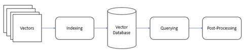  
  
  
  
  
## Retrieval augmented generation (RAG)   
Retrieval augmented generation (RAG) is a special type of generative search that combines the strengths of semantic search and large language models to generate more accurate responses to user queries. This is a new search paradigm that combines the strengths of both retrieval-based models and generative foundation models to enhance the quality and relevance of the generated text. RAG retrieves relevant information from an external knowledge base to supplement the LLM's internal representation of information, which allows for fine-tuning and adjustments to the LLM's internal knowledge, making it more accurate and up-to-date. RAG has several applications, including question-answering systems, chatbots, and industry-specific LLMs. RAG can reduce hallucinations and repetition while improving specificity and factual grounding compared with conversation without retrieval. RAG can also provide more contextually appropriate answers to prompts as well as base those answers on the latest data.  
  
  
## RAG Pipeline  
  
* Embedding Layer  
* Search and Rank Layer  
* Generation Layer  
  
  
Now, let’s discuss each of these layers in detail.  
  
**Embedding Layer**  
  
  
You are already familiar with the embedding layer, as it was covered in the previous sessions on semantic search. The embedding layer is typically the first layer of a RAG model, and it typically contains an embedding model that is trained on a massive data set of text and code. This data set is used to learn the relationships between words and phrases and to create embeddings that represent these relationships. The embedding layer is an important part of RAG models because it allows your system to understand the meaning of the text that it is processing and understand its semantic relationship to the query. The embedding layer generates embeddings for your text corpus and allows the RAG model to understand the meaning of the query and to generate a relevant and informative response. This is essential for a variety of tasks, such as question answering, summarisation and machine translation.  
  
**Search and Rank Layer**  
The next layer is the search and rank or the re-rank layer. The search and re-rank layer is a crucial component that is responsible for retrieving the relevant information from an external knowledge base, ranking it based on its relevance to the input query and presenting it to the generation layer for further processing. The search and re-rank layer is an essential component of RAG, as it ensures that the retrieved text is accurate, relevant and contextually appropriate. The search and re-rank layer typically consists of two components:  
* A search component that uses various techniques to retrieve relevant documents from the knowledge base  
* A re-rank component that uses a variety of techniques to re-rank the retrieved documents to produce the most relevant results  
  
The search component typically uses a technique called semantic similarity. As discussed in the previous session, semantic similarity is a measure of how similar two pieces of text are in terms of their meaning. The search component uses semantic similarity to retrieve documents from a knowledge base that are relevant to the user's query.   
  
The re-rank component of the search typically uses a variety of techniques to re-rank the retrieved documents. These techniques can include the following:  
* Ranking by relevance: The re-rank component can rank the retrieved documents based on how relevant they are to the user's query.  
* Ranking by popularity: The re-rank component can rank the retrieved documents based on how popular they are, such as by measuring the number of times they have been viewed or shared.  
* Ranking by freshness: The re-rank component can rank the retrieved documents based on how recent they are, such as by measuring the date on which they were published.  
  
The search and re-rank layer is an important part of RAG models because it allows the model to retrieve and re-rank relevant documents from a knowledge base. This is essential for numerous tasks, such as question answering, summarisation and machine translation. The search and re-rank layer is a powerful tool that can be used to improve the performance of a variety of AI tasks. It is an essential part of RAG models, and it plays a key role in helping these models retrieve and re-rank relevant information. The retrieval-based model is used to find relevant information from existing information sources. The re-rank layer is used to rank the retrieved information based on its relevance to the input query.   
  
**Generation Layer**  
The generation layer is typically the last layer of a RAG model which consists of a foundation large language model that is trained on a massive data set of text and code. As the name suggests, the generation layer allows the model to generate new text in response to a user's query. The generative model takes the retrieved information, synthesises all the data and shapes it into a coherent and contextually appropriate response. This is essential for many tasks, such as question answering, summarisation machine translation and also generative search specifically RAG. In the context of search, this layer excels in providing context and natural language capabilities for generative search.  
  
  
  
Aditya then explained the various stages of the RAG pipeline as shown in the image below. These are given below:  
1. **Step 1:** Build the vector store  
2. **Step 2:** Embed the query and perform semantic search  
3. **Step 3:** Pass the prompt with the query and the relevant documents to a Large Language Model (LLM)  
**NOTE**: In this project, we will be using GPT-3.5 as the Large Language Model for building the generative search application.  
  
Let’s go over each of these steps in detail.  

**Step 1: Build the vector store:** The first step is to build a vector store that can store documents along with metadata. A vector store is a database that stores embeddings of text data in a vector space. The documents are converted to raw text and then split into chunks. Each chunk is then represented as a vector using an embedding model. The vector store is then populated with these vectors.  
  
**Step 2: Embed the query and perform semantic search: **The next step is to embed the user query into the same vector space as the documents in the vector store. This is done using an embedding model. Once the query is embedded, a semantic search is performed to find the closest embedding from the vector store. The entries with the highest semantic overlap with the query are retrieved.  
  
**Step 3: Pass the prompt with the query and the relevant documents to the LLM: **The final step is to pass the prompt, which is a concatenation of the query and the retrieved documents, to the LLM. The LLM generates a response based on the context of the query, the system prompt and the relevant documents passed from the search layer. The retrieved documents serve as the knowledge bank and provide the necessary context for the query to the LLM, which helps it generate a more accurate and relevant response.  
  
In the first step, we process the documents (in this case, the documents pertain to the insurance domain) to extract the text, split it into smaller chunks and then pass them to the embedding model.
  
  
As you saw in the video, the ++[PDFPlumber library](https://pypi.org/project/pdfplumber/)++ is very efficient in extracting the text contents of multiple PDF documents. The library can also represent a table in a neat list of lists format that preserves the original hierarchical structure of the document. The library also supports visual debugging of almost any type of machine-generated PDFs; you can read more about it in the documentation link provided above.  
  
**RAG Demo - Part 1.1: Text Processing
**
  
In the previous segments, we covered the technical aspects of Retrieval Augmented Generation (RAG). In this segment, we will focus on building the RAG pipeline in Python.  
  
The notebook can be downloaded from the link below.  
  
The insurance policy documents used in this demonstration can be downloaded below.
++[Insurance Policy Documents](https://cdn.upgrad.com/uploads/production/8e278245-506c-4c8c-9246-892280692919/Policy+Documents.zip)++  
  
As explained in the video, in this session, the RAG pipeline will be built with OpenAI’s GPT-3.5 model and Chroma vector database. The RAG pipeline will consist of the following three layers:  
* Embedding Layer  
* Search and Rank Layer  
* Generation Layer  
We also covered the system design for the RAG application as shown in the image below.

  
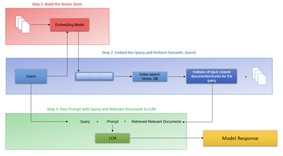  
In the previous segment, we have covered the design concepts. In this segment, we will focus on building the entire pipeline from the bottom-up.  
  
The first step in the pipeline is to build the vector store. As illustrated in the image below, this step involves ingesting the documents, processing them to create individual chunks and passing these to an embedding model to create individual vector representations of the text. The second layer in the pipeline is the search and rank layer, which will perform a semantic similarity search on the knowledge bank based on the query and retrieve the top results. The output of this layer is the top K closest documents or chunks for the query and their indices.  

The last layer is the generation layer, which receives the results of the previous layer, which contains the top retrieved search results, the original user query and a well-constructed prompt to the LLM. These inputs allow the LLM to generate a more coherent answer that is relevant to the user query with information/relevant chunks stored in the knowledge base.  
  
  
In the first step, we process the documents (in this case, the documents pertain to the insurance domain) to extract the text, split it into smaller chunks and then pass them to the embedding model.
  
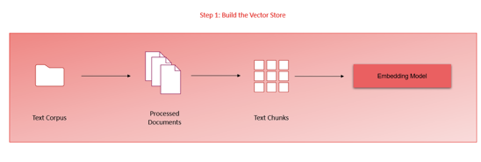  
As you saw in the video, the ++[PDFPlumber library](https://pypi.org/project/pdfplumber/)++ is very efficient in extracting the text contents of multiple PDF documents. The library can also represent a table in a neat list of lists format that preserves the original hierarchical structure of the document. The library also supports visual debugging of almost any type of machine-generated PDFs; you can read more about it in the documentation link provided above.  
  
  
We used the PDFPlumber library to extract the text in the video above since the library can identify text, images and any tabular information and parse them accordingly. It should however be noted that extra care needs to be taken while dealing with tabular information as many of the common libraries don’t have out-of-the-box support for extracting table data. As Akshay explained, you need to be wary of the various nuances in which tabular data can be effectively parsed, as they possess important information for our search system. It is also a good practice to keep checking your PDF/text documents during the text processing stage in order to avoid discrepanices or quality issues in the parsed text.  
  
In the next segment we will explore the remainder of the text processing steps in the first layer - chunking and generating the embeddings.  
  
  
  
In the video above, we implemented the page-level chunking strategy to chunk the documents at a page level along with the metadata information. Akshay also talked about the reasons behind implementing page-level chunking strategy for the insurance documents. The reason behind this choice is primarily due to the structure of information in the insurance documents and the context window limit of the LLM model (GPT-3.5). Finally, you also append the relevant metadata information such as document name and page number for later retrieval.  
  
  
  
As discussed in this video, once the text in the documents has been pre-processed and chunked, the next step is to generate vector representations using a suitable text embedding model. So far, you have been using the sentence transformer library and, specifically, the all-MiniLM-L6-V2 model to generate vector embeddings. For this demonstration, the embedding model being used is OpenAI's embedding model - specifically, the ada002 v2 model, which embeds text into a vector of 1,536 dimensions. We are using ChromaDB’s utilities functions to generate the vector embeddings through OpenAI’s model. For more information on this, refer to ++[this link](https://docs.trychroma.com/embeddings#openai)++.  
  
Once the embeddings have been generated, the next step is to store them in the vector database, which is ChromaDB. As covered in the previous sessions on ChromaDB, you need to first create the Chroma collections before you can start adding documents. Akshay used the get_or_create_collections method, which will create a collection if not already present, and fetch it from your system if it has been created and stored previously. Next, since we are using OpenAI embeddings and not Chroma's default embedding, you need to also pass your embedding function as an argument while creating the collection. Finally, the information that includes the document list, text and metadata information is passed to the chroma collection. Additionally, Akshay also created a Chroma collection to serve as cache, which we will explore in the upcoming segment.  
  
In the next segment, let's get started with the next step in the RAG pipeline - the semantic search layer.  
  
**Additional Readings:**  
* This ++[article](https://medium.com/@azhar.sayyad6/a-step-by-step-guide-to-parsing-pdfs-using-the-pdfplumber-library-in-python-c12d94ae9f07#:~:text=pdfplumber%20is%20a%20powerful%20library,data%20analysis%20and%20automation%20tasks.)++ explores the various functionalities of PDFPlumber.  
  
**RAG Demo - Part 2.1: Semantic Search With Cache
**  
In the previous segment, we looked at step 1 of the RAG pipeline. We ingested the documents, processed the text and tables and generated the embeddings using a text embedding model. Once the embeddings have been generated, we then store the embeddings in a vector database such as ChromaDB.  
  
As with any good system design, we need to consider a scenario when the application is scaled - suppose the number of documents increases or multiple users are using the application. Such a scenario opens up multiple concerns about the system’s performance  
* How will the system handle multiple queries simultaneously?  
* Is there scope to improve the system’s overall performance in search and retrieval?  
  
The first concern can be solved by using vector databases and scaling up the compute units (clusters/server) for the application. For the second concern, an improvement to the overall system design is required which can be achieved by implementing a cache collection in the vector database that stores previous queries and their results in the vector database. Let’s hear more on this from Akshay in the video below.  
  
As mentioned in the video, we create a cache collection within the vector database that will try to cache the queries coming in and the corresponding responses. Creating a cache is important to preserve the scalability of the RAG system, particularly when documents span in the range of 1,000 or more and multiple users are using this application concurrently. With this additional layer, when a query is first input, the system first searches within the cache collection instead of the bigger collection. Cache implementation results in an improved response time from the system since a semantic similarity search need not be performed for a query that the system has already seen. The image below shows the system design with a cache layer. It should be noted that the diagram also includes a re-ranking layer that we will discuss in the next segment.
  
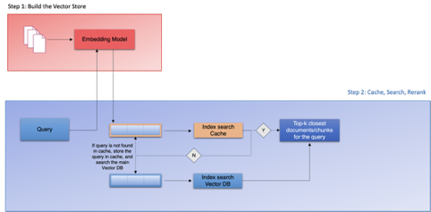  
  
  
  
A semantic cache stores the meaning of a query or request instead of only the raw data along with the responses. This can reduce the number of queries the database needs to process by recalling previous queries and their results. The cache system can now circumvent the semantic search layer, which has been the bottleneck of the system, and directly provide responses for the queries that have already been generated before and stored in the cache collection. Now, when the query is passed to the application, its vector representation is generated and then searched in the cache collection first. If the query is not found in the cache collection, the system queries the main collection and finds the top k closest documents or chunks for the query. The results are then returned to the user and, simultaneously, are stored in the cache alongwith the query. Customising and monitoring the cache's performance can also make it more efficient. Since the cache stores previous queries and results, it can quickly provide the results of a query without processing it. As a result, response times can be faster, and users can experience better application performance.  
  
  
As discussed in the video, the re-ranking stage is the next step in building the semantic search pipeline. So far, in our semantic search application, the system returns the top K documents that contain information relevant to the user’s query. The quality and accuracy of the information contained in these chunks or documents may vary - the system might retrieve documents that are not quite relevant to the search query. The purpose of the re-ranking layer is to sift through these top K results, verify the accuracy of the results in terms of the query and rank them or assign an importance score to these results for the query. Here are some of the benefits of using re-ranking in generative search:  
* Improved accuracy and relevance of the generated results  
* Reduced amount of irrelevant or inaccurate information presented to the user  
* More personalised and informative search results  
* Ability to tailor the search results to specific tasks or domains  
  
Traditionally, many methods of re-rank methods have been used in search such as Reciprocal Rank Fusion (RRF), hybrid search methods and cross-encoder models. For this project, we will focus on the popular method of using cross-encoders for our re-ranking task. The image below illustrates the re-ranking component once the search results have been collected by the semantic search layer.  
  
As mentioned in the video, cross-encoder models are transformer models that can be used to learn the semantic similarity between two text sequences. They are trained on a large data set of text pairs, where each pair is labelled with a score indicating how similar the two sequences are. Once trained, cross-encoder models can be used to compute the similarity between any two text sequences, even if they have never been seen before. The image below illustrates the function of a cross-encoder model.

  
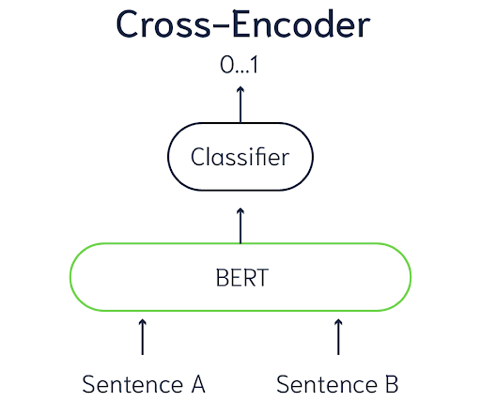  

  
There are a number of advantages of using cross-encoder models for re-ranking. First, these models can learn the semantic similarity between text sequences, which is a more accurate measure of relevance than traditional methods, such as keyword matching. Second, cross-encoder models can capture long-range dependencies in text, which can be important for understanding the meaning of a sentence or paragraph. Third, the models can be used to re-rank documents from any domain, without the need for any domain-specific knowledge.  
  
So far, we have covered the semantic search system of our application. The application seems to be performing quite well for the queries that we have passed so far. However, the inherent limitation of our application is that while it returns the top references for our query, the application is not a full-fledged generative system yet. The below diagram represents our system design so far.

  
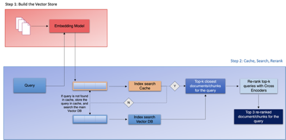  

The final step in our semantic search application is to include a generative AI model capable of generating content in response to the results or contexts passed to it.  
  
  
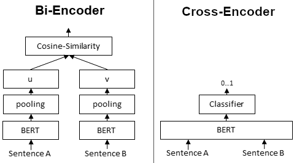  
  
  
  
  
  
  
  
  
  
  
  
  
  
  
  
  
  
  
  
  
  
  
  
  
  
