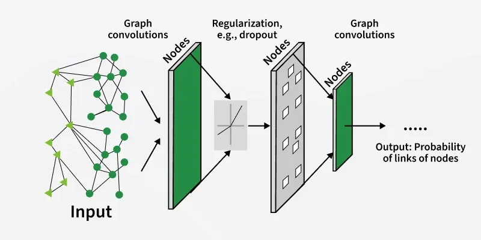
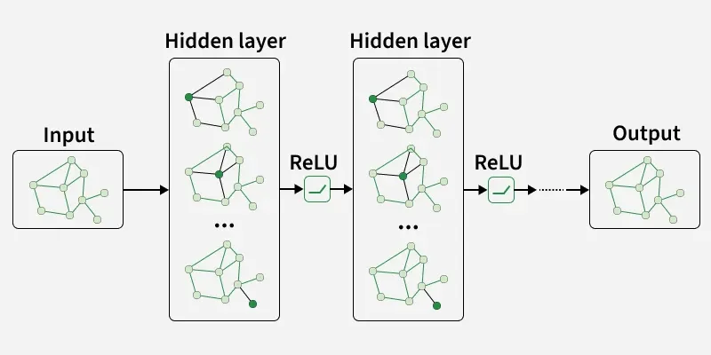
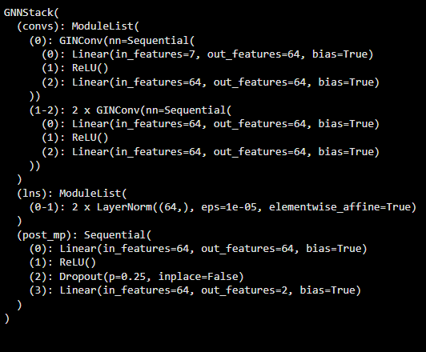
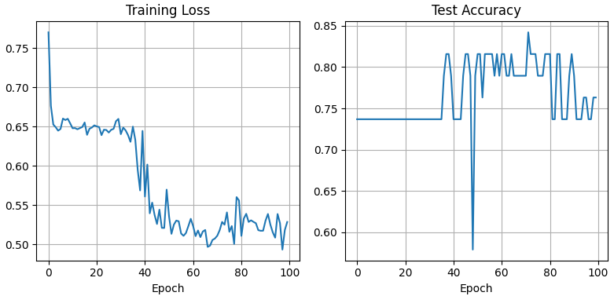
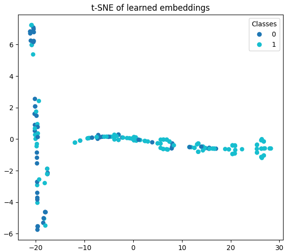

# Lecture 5   
  
  
**matrix multiplication faster using gnn**  
  
  
## Transcript  
  
[SQUEAKING] [RUSTLING] [CLICKING]  
PHILLIP ISOLA: OK. Hi, everyone. So we're going to get started.  
I'm the third instructor for this course, so I'll just quickly introduce myself.  
I'm Phillip Isola. I also go by Phil, so feel free to call me by my first name. Just Phil is fine.  
And I am a professor in EECS. Just-- I love deep learning.  
Deep learning is, for me, the most beautiful kind of math and intelligence that I could imagine.  
I think that it's a very popular subject, obviously, but sometimes deep learning gets a little bit of flack  
because maybe it's too hyped or because people feel like too much money is in it.  
So there's always this weird pushback to deep learning. And I just want to say, I just love it. It's so cool. And it's OK to love it.  
We're going to try to convey why it's so cool. So deep learning to me is just the most--  
my favorite subject of all, and it's great to get to teach you about it. OK, so there's a lot of beautiful things  
about deep learning. You've already heard some of them. And today we're going to hear one more, which is graph neural networks.  
This is a continuation of the sequence that we have going on architectures.  
So we have four lectures. We have the one that Sarah gave on Tuesday on convolutional networks. Now we're going to see graph nets that  
are a generalization of ConvNets, along with a lot of other architectures. And then we'll see transformers, which  
are a special kind of graph net and we'll see recurrent networks and memory-based architectures as well over the next few weeks.  
So the outline of this talk is going to be,  
first, talking about what types of problems are appropriate to use graph nets on.  
And then we'll talk about the main way that graph nets work. We'll present that as a message-passing algorithm,  
but you'll see that it turns out to be very familiar. It's just another neural network that  
has a forward pass and a backwards pass. And then the last section of this lecture  
will be on approximation power. So this will be continuing on from the approximation lecture that Jeremy gave, looking at, what types of functions  
can graph nets approximate? To what degree are they universal? What is their capacity to represent  
different types of functions? And one of the interesting things I want to point out here at the start  
is that graph nets are not universal in the same way that MLPs are.  
And in fact, that's where the power comes from. And that's what Sarah mentioned at the beginning of last lecture as well, that the idea of architecture design  
is to make systems that are maybe better to run on hardware, on GPUs, to make systems that  
are easy to parallelize and so forth. But another big part of architecture design is adding constraints.  
  
  
So making a function approximator that actually can't fit certain types of functions because we  
want to rule those types of functions out. Graph nets and graphs are a language  
for introducing constraints that limit your system from doing things you don't want it to do.  
And this is one of the perspectives on architecture design that we'll keep on coming back to. We want to be able to fit the data,  
but we want to constrain ourselves to fit it only in the right ways. So universality is actually not what we're  
after in architecture design. But within the family of functions that we do care about,  
we do want the architecture to build approximate them, and we'll see what family graph nets can approximate.  
Quick reminder on logistics is that problem sets are due next Tuesday.  
So hopefully, you're making good progress. But if you haven't started, start now. It's a two-week problem set.  
There's a lot of stuff in there. OK, so let's talk about what types of problems  
graph nets are amenable to. And maybe before I tell you some examples that I have in mind,  
I could just ask the audience. So graph nets are going to be appropriate for problems that  
naturally can be specified with a graph or data types that exist on a graph.  
So in your work and your fields that you're coming from, what are some problems that you can  
think of that are well-stated as graph problems? OK. Yeah, let's go up here.  
AUDIENCE: Social networks? PHILLIP ISOLA: So one are social networks. Social networks are graphs, people and their friends  
or their connections. OK, another one? AUDIENCE: Hidden Markov models or time-variant data? PHILLIP ISOLA: Yeah, hidden Markov models  
are one kind of probabilistic graphical model, and this idea of graphical models for representing  
probability distributions is a classical idea, and graph nets are appropriate for representing things  
like this. OK, back here. AUDIENCE: Gene interactions. PHILLIP ISOLA: Gene interactions. Yes. I'll have some examples on that.  
So whenever I have different genes that are interacting with each other or with proteins that  
get transcribed from those genes, then these could be thought of as nodes and edges that  
represent relationships. Let's do just one more. AUDIENCE: Cross referencing of different websites. PHILLIP ISOLA: Cross referencing different websites.  
So things like PageRank, hyperlinks between different web pages. Like, Google started as a graph search company, essentially.  
They represent the web as a graph of hyperlinks, and then they try to evaluate where the important nodes are  
in that graph. So whatever problem you have, if you  
have studied physics or chemistry or computer science, I'm sure that you have seen a million graphs. That's one of the basic data structures  
we use for representing the interesting types of data in the world.  
So graph nets are an appropriate technology for problems that naturally exist on graphs.  
And there's a few different things we might want to ask about a graph. So one thing is you might want to take a node in a graph.  
Maybe this is a social network graph. This is a user in that social network. You want to classify something about them.  
You want to say, is this person somebody who likes jazz music or not?  
Maybe that's the prediction problem that your social media company wants to make.  
So that's a node classification problem. We can ask a question about a node. Other times you might want to ask a question  
about the entire graph. What is the average number of friends that people have within this social network?  
Maybe that's a property that I care about. So we can ask questions about nodes, about edges, relationships, about the entire graph.  
I'm going to give you a few different examples just to motivate why graphs are so important.  
So another one might be this-- I think this is from Pinterest.  
So it's users and the boards that they're interested in. So these topic areas that they're interested in.  
So assigning you to, what are the topics that you're interested in on this website that  
allows you to see content under these topics? So this is a graph between people and their interest.  
These types of graphs are often used in recommender systems.  
I want to recommend what you might be interested-- what next video on YouTube would you want to watch? So it's like a bipartite graph between users  
and their interests or users and content. So I think we had the gene expression idea previously.  
But in general, for biology and especially chemistry, molecular biology, we have graphs which are molecules.  
Molecules are well-represented as graphs. There are atoms and bonds between the atoms.  
And if we want to do things like predict which-- where would the binding site be on that molecule for some drug,  
or would this molecule be toxic to a human, these are graph prediction problems.  
I'm trying to ask a question about that graph, which is the molecule structure.  
So in biology and chemistry, graph nets are used extensively.  
Here's another example where we have the graph of interactions between different drugs and the drug's effect on the human  
for some kind of medication. So we might have, in this example, two different drugs that can have a positive effect on you.  
But if you combine them, they're negative. Interactions between drugs that can be bad. You always have to read the bottle  
on the pills you're taking. Like, don't take this if you have this other drug. So that can be represented as a more complicated graph.  
Now, in this graph, we have edges between pharmaceutical interventions,  
like the drugs that you're going to take, and also edges between the drugs and the proteins that they affect. And so different types of edges and different types of nodes  
can exist in a graph, and we are going to be wanting to learn properties  
of these edges and these nodes so that we can make predictions about what combination of drugs might be toxic.  
So graphs also come up in just classical computer science  
algorithms. So in shortest path algorithms, in graph search  
of various forms, tree search algorithms, we often represent classical, discrete optimization problems  
as some kind of search of a graph. So here's one example. This is from Google Maps.  
And they're trying to find the shortest path, the fastest driving route between your house and where you want to go.  
So you probably use Google Maps to do this all the time. So how do they do it? Well, this is a huge, huge graph.  
It's a whole world of roads. So it's slow to use classical algorithms like Dijkstra's algorithm.  
And additionally, there might be a lot of constraints beyond just searching over the edge  
lengths of that road network. It might try to optimize for other properties,  
like how safe or scenic is the road, or avoid highways, or there's different constraints that you can add on top of this.  
So it becomes a very difficult graph search problem to solve with classical methods. It might be too slow.  
And so one use of graph neural networks is to find heuristics and approximate graph search  
algorithms that can solve these problems more quickly. So Google, in this example, is using a graph neural network  
to do faster search than classical algorithms, and we'll talk a little bit more about that as well,  
by learning heuristics Another one-- I don't think anybody mentioned physics, but that's another place where graphs come up all the time.  
So one of the popular ways to simulate fluids or particles or atoms is by thinking of them as a set of nodes  
with edges between the nodes that are indicating the physical forces. So two particles might have an edge,  
and that edge is describing the repelling force between those two particles because we  
know that two atoms can't occupy the same space, and they might have electrical forces that push them apart.  
So in this example, it's a particle system that simulates fluid dynamics, and this  
is represented as a graph neural net that takes in the graph of all of these water particles,  
and the edges between them are going to learn to push apart those nodes, essentially.  
So just more examples, and there's some paper references if you want to read up  
on these in more detail. And then most abstractly, just a lot of optimization problems,  
especially discrete optimization, combinatorial optimization, take the form of a graph problem  
where we might have a set of decision variables we're trying to optimize.  
We're trying to find, what is the setting of these xs that will satisfy a system of constraints?  
So on the right-hand side here, we have a linear program. We're trying to minimize this linear cost function  
subject to some constraints. And that can be set up as a graph of constraints that  
will penalize a certain kind of interaction between the decision variables, x. And we want to find the setting of the decision variables  
that satisfy those constraints. And so we can phrase this in the language of graphs, and there are graph neural networks  
that can help us solve these types of problems more efficiently. And something I want to point out here is that, again, just like in the shortest path example  
I gave, we do, often for these problems, have classical algorithms that we know will find the solution.  
And so one question you might have in mind is, why would we bother with a learning algorithm? Why would we bother with a neural network that's  
going to do something that we already have the optimal classical algorithm for? We know exactly how to solve a linear program on the right.  
We know exactly how to solve for shortest path in a graph on the left. And the reason is, essentially, that these classical algorithms  
can be slow. And if we want to use a learning-based system,  
we can potentially learn a faster way of finding an approximate solution. And the trade-off is that the classical algorithm  
will find-- will be guaranteed to converge to the true solution.  
But it might be slow. And the neural net, the graph net, might be able to use heuristics that  
work really well on the data distribution we train it on. And so it will solve the problem more quickly on the data  
distribution that we're training on, but it won't be guaranteed to find the right answer on other data distributions.  
So you're learning something that is more specialized to that data distribution. OK, cool.  
So now let's get into the technical content of how  
these graph nets work, how do they represent data. And this is how we'll represent graphs for this lecture.  
We'll say that a graph is a set of nodes. Every node is going to come with a attribute vector.  
So this is going to be our input to our graph processing  
algorithm. We will have a attribute vector for each node. If these are molecules, that attribute vector  
might tell us what is the atom. Is this carbon? Is this hydrogen? So in gray, we have this vector, which  
is the initial data, our observation about that node in the graph.  
And what we're going to try to learn is a mapping from our graph nodes  
to representations of the nodes that are going to be more informative about the properties  
that we care to predict. Just like we can do take an image patch  
and embed it into a vector, we can also take a node in a graph and embed it into a vector that tells us something important about that node,  
maybe classifies is it a binding site for the drug of interest?  
Additionally, we will represent the edges between the graph with an adjacency matrix, and this  
will be an additional input to our graph neural network. So we'll have a set of nodes which are represented by vectors of observed data  
and an adjacency matrix. And then we'll do some computation on that to make a prediction about the nodes.  
We can also make a prediction about the entire graph itself, and that's sometimes called a graph embedding. So this is graph to vec right.  
On the left side, we have node to vec. Every node gets embedded into some feature vector that tells us something of interest about it.  
On the right, we're going to just embed the entire graph into a feature vector that tells something of interest  
about the entire graph. For example, is this molecule toxic or not? So we can ask questions about nodes in a graph  
or about the entire graph itself.  
So GNNs-- graph neural networks are GNNs. They learn a function from these adjacency matrices that tell us  
the edge structure and the set of graph node attributes that are observed to a set of embedding vectors  
or predictions about the nodes or the entire graph itself.  
Do I see a question in the-- I think I see a question here. Yeah. AUDIENCE: [INAUDIBLE].  
Graph embeddings. Do they do the same model? PHILLIP ISOLA: Yeah.  
So the question is, what is the relationship between node embeddings and graph embeddings. And we'll see more details on this.  
But the node embedding is going to be a vector that we learn for each node in a graph, and the graph embedding  
is going to be one vector for the entire graph. We'll see examples of this. And then I saw one other question.  
Good? OK. In the back? AUDIENCE: For tasks, are you learning either the node embedding or the graph embedding,  
or do you typically join [INAUDIBLE]? PHILLIP ISOLA: So are we going to learn either node embedding  
or graph embedding, or are we going to jointly learn them? You could do either one. You could do both.  
Well, in general, we might learn a set of node embeddings and then sum them up at the end to get a graph embedding.  
That would be one way of combining the two. OK, one more question. Then I'll move on. Yeah, over here.  
Sorry, in the middle. Yeah. AUDIENCE: How much do we care about the size  
of the adjacency matrix and [INAUDIBLE] number of nodes [INAUDIBLE] dimensionality  
of the [INAUDIBLE] those are constrained not at all [INAUDIBLE]  
PHILLIP ISOLA: I think, if I understood the question- how much do we care about the dimensionality  
of the adjacency matrix? If we have a really big graph with a lot of connections,  
does this become intractable? And I would say that's more-- that's not really our choice as modelers.  
That's going to be the property of the data that we're working with. So yes, if we have a graph-- if our data type that we're working  
with are molecules are just very densely connected, then this will be something we have to deal with, and that will be computationally more expensive to deal with.  
But that's-- we don't usually try to simplify the input graph. We're going to take the input graph as given  
and ask a question about it. Yeah. So before we get to how graph nets work, let's  
first ask, what if we just wanted to make a prediction about graph-structured data  
with an MLP? We've already seen MLPs. So MLP's another name for that fully connected neural network.  
What if we just use this fully connected neural network? How would we take as input the properties of the graph?  
So one thing that we need as input is the adjacency matrix that tells us which nodes in the graph are connected to which nodes.  
And just to quickly show you what that looks like-- let's see.  
What happened to my mouse? How do I find my mouse? OK. Well, anyway, you can see the adjacency matrix up here  
on the left, and this is just telling us which nodes in the graph up at the top right  
are connected to each other. So 1 means there's an edge between the node index i and the node index j in that matrix.  
And a 0 means there's no edge. So what is the fourth row of that adjacency matrix?  
Which node in the graph at the top right does that refer to?  
Blue? OK, I heard it. Yeah. So blue, right? So there's three 1s, and that's the only node in that graph that  
has three edges, so that's how you would know that that's the relationship. So the adjacency matrix tells us the connectivity of the graph.  
And we additionally would have a set of attribute vectors for every single node, the observed vector for that node.  
And we could just put these into an MLP by simply creating a serialization  
of our adjacency matrix and all the node attribute vectors and just one really big vector  
and just put that into a multi-layer perceptron. So can anyone think of why that might not be the best strategy?  
What might be an undesirable property of just serializing our adjacency matrix  
and our node attributes? Let's go over here. AUDIENCE: So adjacency matrices can only consist of 1s and 0s,  
whereas MLPs can take in real numbers. PHILLIP ISOLA: OK, yeah. So adjacency matrices only consist of 1s and 0s.  
Maybe we're not making use of the full capacity of an MLP to take in real numbers. That's a good idea.  
AUDIENCE: It depends on the index you put on the nodes. So if you permute, it's not going to work.  
PHILLIP ISOLA: Yeah. So the answer-- and this is the answer that I always had in mind myself, is the adjacency matrix, represented as a vector,  
is going to depend on how we assigned indices to the nodes in the graph.  
And that decision was arbitrary. We decided that the fourth row of the adjacency matrix--  
the index 4 is the blue node. But why didn't I say that index 3 is the blue node.  
So generally, for graph-structured data, we want to be processing it in a way that is invariant to how we  
chose to index into the nodes. The structure of the graph, the structure of a model-- of a molecule in many types of graph data  
don't really depend on the ordering of the nodes. So in math terms, we would say that we  
want a function which is permutation-invariant to permuting the indices of the adjacency matrix  
and permuting the ordering of the node attribute vectors that we put into our system.  
So here is a permutation matrix, P, applied to the rows and the columns of our adjacency matrix.  
And the graph that is described by this permutation  
is the same, structurally, as the graph that's described by the original adjacency matrix.  
We've just chosen a different ordering of the indexes to label the nodes. So the first matrix, P, permutes the rows,  
and the P transpose permute the columns. Additionally, if we have a matrix of node attributes--  
so we have four nodes, and so we'll have a 4-by-D-dimensional matrix, X, of the node attributes.  
This is the observed data at each node. We can permute that with our permutation matrix, P.  
And in order for the graph net, f, or the function, f, to be invariant to these types of reindexing  
of our graph, we would want that permuting the adjacency matrix and permuting the nodes-- the node attributes  
will result in the same answer as any other permutation. So this property's called permutation invariance.  
Very related to what we heard about on Tuesday. Where convolutional networks are invariant or equivariant  
to translation, graph nets are going to be invariant or equivariant to permutations of the inputs.  
So permutation equivariance is almost the same thing. It just says that if you permute the way that you  
have indexed into the data, then you should permute your outputs. So if I shuffle my nodes, then I should end up  
shuffling my predictions. So same idea as translation invariance versus equivariance.  
I would want to be permutation-invariant if I'm trying to, let's say, predict something  
about the entire graph. So no matter how I index those nodes, then the prediction about the graph will be the same.  
And if I want to predict something about every node, like I want to output node embeddings, then I would want to be permutation-equivariant so  
that if I shuffle the nodes, my predictions about the nodes get shuffled in the same way, just  
like I want translation equivariance if I want to have the output of my convolutional network  
have the property that if I shuffle or translate the input image, I will translate the dense set of predictions  
in the output. I'll translate the feature map that comes out.  
So this is the kind of fundamental symmetry that we're going to be exploiting with graph neural  
networks. They'll be appropriate for processing data for which the problem of interest is actually  
permutation-equivariant or invariant. Yeah, question.  
AUDIENCE: I think I understand why we need to make it invariant, but is that under the assumption  
that all graphs could be made into this invariant form?  
What are some problems where the nodes are just not able to become invariant?  
PHILLIP ISOLA: Yeah, we'll see, at the end of the class, some cases where you wouldn't want permutation invariance.  
But if, for example, you live in a world where molecules always  
come in some orientation, like the heavier-- the blue is a heavier atom and it always  
lives on-- it has a position, a canonical position, that you're always going to observe, then you'd want to use that information.  
But in our world--  
yeah, . Yeah, I'll have to think a little bit more about a good example, but we're going to see one  
at the end of the class. One more question. Yeah? AUDIENCE: [INAUDIBLE] invariance, why  
is the output a single vector? Does that [INAUDIBLE] have anything to do with the entire graph itself,  
or is there a reason why that output's a single vector? PHILLIP ISOLA: Yeah, for permutation invariance,  
the output could be more than one vector. It could be any dimensionality. It just means that if I permute the inputs, then I get the same output no matter what.  
And that's going to be most appropriate if I'm making some prediction about the entire graph.  
If I'm making predictions about a single node in the graph, I want my prediction for the nth node in the graph  
to always be in the nth output row of my output matrix  
if I'm predicting a matrix as output or a set of vectors--  
vector embeddings per node as output. So let's, again, make the connection to graph neural  
networks-- sorry, to convolutional neural networks. So ConvNets are graph nets applied on a grid.  
We said that ConvNets are appropriate for grid-structured data. And if we're processing an image, which  
is one of the main applications of convolutional networks, then we'll have a grid of pixels or patches.  
And we can think of that as just a graph of nodes, and the edges between the nodes are the weights  
of the convolutional filter. And in a graph net, it's just the same idea,  
except generalized to non-grid topologies. So if I want to process something  
about the node in the center of that green region, I'm going to look at all my neighbors and aggregate information from all of them,  
just like in a ConvNet, we're going to run a filter that's going to look at all my local neighbors in a patch around a pixel, or around a node on a grid graph,  
and aggregate information to make a new representation of that location in the image.  
So one question for you. So graph nets look a lot like ConvNets,  
but now they're on arbitrary graphs, as opposed to just on a grid. So what are some of the interesting differences  
between a ConvNet and a graph net? What is the new problem you might encounter with a graph  
that you won't encounter with a ConvNet? Yeah. AUDIENCE: The neighborhood of a vertex is not the same shape all the time?  
PHILLIP ISOLA: Yeah. So the neighborhood of a vertex is not the same shape all the time. So you need a architecture that can handle having  
variable numbers of neighbors. It's not going to be something that's always, like, a 3 by 3 patch.  
And this is going to have hardware implications, right? It's going to mean that I can't just have baked onto my hardware  
that I'm going to look at, a 3 by 3 grid. I'm going to have to make that flexible enough that if the node  
has a lot of edge neighbors, then I will be able to aggregate over a bigger set.  
Any others? Yeah. AUDIENCE: There is no structure in the neighborhoods. All these should be treated equally.  
PHILLIP ISOLA: Yes, excellent. There's no structure in the neighborhood. All should be treated equally. So in a convolutional network, there  
is this kind of spatial dimensionality to it, where left and right have a different meaning than up  
and down, and I might want to treat left and right differently than up and down. And in a graph net, we actually are  
going to represent the operation that updates the node representation given the neighbors  
in a way that is-- doesn't depend on, spatially, where those nodes land.  
So the structures are more abstract than the spatial structure of a ConvNet. So there are a few important differences,  
but there's also a lot of commonalities. So here's a few of the commonalities. One is that both of these architectures  
are based on local operations. So we run local convolutional filters to update our representation of the data at that location.  
And we graph local computations where every node in the graph is going to get input from just its neighbors.  
And the way you make a global decision or you propagate information across the entire graph or the entire image is just by stacking those local operations.  
So you can filter an image over and over again, and the receptive fields gets bigger and bigger and bigger.  
And that location in the image aggregates information from farther and farther away. It's the exact same in a graph net.  
If I update a node based on its neighbors, then if I repeat that operation, I will-- every time I repeat it,  
I will hop one more neighbor away, and eventually, I'll cover the entire graph, and I'll globalize.  
Another idea that's shared between these things is that just like a ConvNet is chopping up the image into patches and operating on each patch  
independently and identically with the same parameters, a graph net will also chop up graphs into little local regions  
and operate on each local region independently and identically. And it's going to share the same parameters to update  
each region that-- each region of that graph. And another interesting property is that ConvNets can operate functionally  
on any size input image. They just slide that filter over as much as they need to go. And a graph that can operate on any size graph.  
You just continue running that local operation at every node in the graph. So that's a big difference from MLPs, which require  
a fixed dimensional input. OK, one question. AUDIENCE: Are we sharing the weights across different depths or only on [INAUDIBLE]?  
PHILLIP ISOLA: Yeah, so we're going to get into that in a minute. So are we sharing the weights across depth? And the answer is, that's an option.  
You can, or you don't have to. But we'll see that in just a second. So here's one more, just pointing out  
the exact relationship between a graph. Net and a convolutional network. So this is a CNN visualized like a graph net,  
so every single node in the graph is going to be connected to its neighbors, and every node will have this gray--  
let me try to get my mouse back. OK, there we go.  
I don't know why my mouse is not showing up. Anyway, It's fine.  
So the gray columns are meant to be the node attribute vectors. But what would the name of those gray columns  
be if we were working with a CNN? Anyone want to say? I think it's on the slide.  
AUDIENCE: Embeddings [INAUDIBLE]. PHILLIP ISOLA: Embeddings or channels, yeah. So in a CNN, every point in the grid  
has this column of channels underneath it, and that's equivalent to the node vectors in a graph neural  
network. So maybe some CNN review questions very quickly. In this convolutional network, what is the kernel size?  
AUDIENCE: 3 by 3. PHILLIP ISOLA: 3 by 3. OK, great. And what is the stride?  
The stride is 3. So why is stride 3? Because I didn't draw edges between--  
if you look at the pattern of edges, it's like I'm taking that pattern, that template, and moving it over by 3 to get the next filter's application.  
OK, cool. So CNNs are GNNs. But now let's look at GNNs more generally  
and get into the exact equations of how they operate. So the way I'm going to present this is that there's two steps.  
One step is we're going to pass messages  
from each node to its neighbors. And the next step is we're going to aggregate all of those messages to update the representation of each node.  
So every node has a vector associated with it, and that vector's going to be modified layer  
by layer through my graph net in order to come up with a better embedding that then makes a prediction at the very end of the day,  
just like in a ConvNet, how every layer modifies the set of channels underneath every spatial location.  
So here's the general form of one layer application of a graph net. So going to look at a really tiny graph here.  
I'm going to highlight that middle node and ask, how does that middle nodes node vector get  
updated after one application-- one layer of processing?  
So what does one layer of processing-- so we call this-- in each round k, in each layer k, we're going to do two things.  
We're going to aggregate and then update. So the aggregate function is going to be a function that takes the node vectors denoted  
as h of all of my neighbors, and it's going to produce a message, m, from that set.  
And importantly, aggregate is going to be a function that is permutation-invariant.  
So if I reindex into my neighbors, then I shouldn't get any different output message, m.  
OK, so the italic n is the set of neighbors of a vector of a node v. And I'm going  
to take the attribute vectors, h, from all my neighbors in that set.  
And I'm going to then somehow aggregate them. Now, once I've gotten that message, which is now just a vector-- it's a D-dimensional vector,  
let's say. Then I will update the red node, node vector,  
using another function called Update. So I'll take the messages from my neighbors. My neighbors told me something about what  
they know about the graph and about the world. And I'll combine that information with what I know about myself to update my own representation.  
And now I can repeat this process k times. And as k gets larger, it's like going in depth  
in a neural network where I'm just updating my representation to be better and better and better, until finally, at the end, I make a prediction.  
So every application of those two steps  
is going to essentially increase my receptive field by one. So that red node is going to get information  
about the green nodes if I run this algorithm twice. So I get a message that's passed from the green node  
to the blue node, now to the red node on the second round.  
So some of you will be familiar with message passing algorithms and hidden Markov chains and so forth.  
And that's one perspective on this. But I'll try to give a few different perspectives.  
So what is the aggregate function, and what is the update function?  
OK, let's make it a little bit more precise. So the aggregate function is going to be any set function.  
That means it takes as input a set of items where the ordering doesn't matter. So it's permutation-invariant to the ordering.  
And it produces an output vector. Now, technically, we would call this a multiset function because the set of inputs, which  
are the node vectors, h, could potentially have duplicates. So multiset is just the technical name  
for a set that can potentially have duplicate items. So if you come across this in the reading and so forth,  
they'll call it a multiset function. But unless you're deep into set theory, then it's just a function from a set of items to a vector.  
The set of items can have duplicates. So let's look at some examples of aggregate functions.  
So one example would be summation. A summation takes a set of any length,  
and it produces a vector. So summation-- and also is permutation-invariant. It doesn't matter how you order the items in that set.  
So summation is a multiset function that produces a vector m as output.  
And that will be the message that is passed to the red node. And another one could be average.  
So on the left here, I have summation. But then in gray, I'm dividing by the number of neighbors, So.  
Would be the average, as opposed to the sum. It has interesting different properties. We'll get into that in a bit. And on the right is just another popular aggregation function,  
which is normalizing by the number of neighbors that both you and what are the messages coming from have.  
So just another variation on the same thing. So the key property is that aggregate is not  
a universal function, and it can't represent everything. Aggregate is constrained. Aggregate is a multiset function that's permutation-invariant.  
It maps a set of items to a vector, and the ordering of the set doesn't matter.  
Another interesting aggregate function that satisfies those rules is max or min.  
This is a lot like the pooling operations in convolutional networks. So max will just take the largest item in the set.  
It produces a fixed-length vector regardless of the size of the set.  
So it's a multiset function. Min, same property. And there's some interesting things  
you can do when you start to look at different aggregate functions. So here's a graph algorithm that can be implemented  
with min aggregation. And this is the shortest-path Bellman-Ford algorithm.  
So a lot of you will have seen this in Intro to Algorithms. But in case you don't remember, to find the shortest  
path with Bellman-Ford, what you do is you assign to every node in your graph an attribute vector, which is just  
going to be the distance to the target node you're trying to reach. So I'm trying to find the shortest path to the target.  
So every node will have an attribute, which is just a scalar. It's just the distance-- my estimate of the shortest distance or the cost  
of the shortest path to get to the target, and I'll initialize those vectors, d, with infinity.  
And then I will run this recurrence over and over again until I converge, where I'm  
trying to say- I will say that the attribute vector for the target node is 0, and everything else is infinity.  
And then as I run this, I'll look at all of my neighbors, and I will see if the distance between myself and the neighbor,  
plus the estimate that the neighbor has of the distance to the target-- I'll see what that is, and I'll take the minimum over that.  
And that will give me the shortest path. If I kind of propagate out, now, from that target,  
these distances initially it will be 0, and everything will be infinity. And then all the neighbors of that target  
will be 1, if the cost is 1 to go one hop in the graph. And then this will propagate outward,  
and this will tell me the shortest-- the cost of the shortest path to that target. Yeah. AUDIENCE: So because the aggregate function  
is constrained, how-- I guess this is more of a question of designing a problem to then use a graph--  
a graph network. How do you know that your information needs to be permutation-invariant?  
Or how do you classify a set of problems to where you say, OK, I need to just aggregate my information together, and it doesn't  
matter what order they come in? How do when to classify a problem like that? PHILLIP ISOLA: Yeah, so the question  
is, how do when you want permutation invariance? And I think that's a good question.  
It's going to depend a lot on the domain.  
But yeah, so any problem where the ordering of inputs  
doesn't change the optimal thing you want to do, the prediction you want to make is going to be something you want to apply  
this constraint to being permutation-invariant to. And we're seeing a lot of examples where, structurally, that actually does make sense.  
Like, the shortest path in the graph has that property. I think that maybe a clearer example of a case where  
you wouldn't want permutation invariance is if I'm doing image processing, and I know that the top of the image  
is more likely to be sky than the bottom of the image. If I have a graph which has these local patches  
that I'm processing, I want to know where I am in the image. And I think Sarah talked about adding positional encoding  
to tell you where you are in an image if you don't want this translation invariance.  
So translation invariance is one type of permutation invariance, but permutation invariance is a more general version of that.  
OK. Yeah, question. AUDIENCE: Yeah, quick clarifying question. You mentioned the output of the aggregate function is a vector.  
Can you just quickly just say what the dimensions of that vector are? PHILLIP ISOLA: Yeah, so the output of the aggregate function  
is a D-dimensional column vector.  
So yeah, on your problem set, you'll have some questions about this shortest-path computation. So you'll get a little bit more intuition of it.  
But it's just a construction to demonstrate that you can represent classical graph problems, like graph  
search and shortest path problems, with these aggregate and update operations. In this particular case, Bellman-Ford  
can be implemented just as a GNN that only does aggregate, and the update is trivial in this case.  
So Bellman-Ford is on the left, and the equivalent graph net is on the right. The graph net-- the aggregate is going  
to be a min for Bellman-Ford rather than the sum. And the computation of-- the node embedding of your neighbor  
plus this cost could be represented as an MLP, which just adds 1-- adds the cost of 1, if we're assuming  
that every edge in the graph has length 1. So you'll work through that a little bit more in your problem  
set. So one question you might have is, well,  
sum seems like a fine aggregation function. Min seems like a fine one. Is there a family of aggregation functions  
that are universal in the sense that any multiset permutation invariant mapping can be represented in that family?  
And the answer is that, yes, this family of aggregation functions is universal in that sense.  
So take my neighbor's node embedding or my neighbor's  
node vector, and take my own node vector, pass those through an MLP, then sum up over- sum of that operation over all of my neighbors,  
and then pass the output through another MLP. This is a universal approximator of the family  
of multiset functions. And one question you might have is, wait a second.  
Didn't we say that MLPs on their own are universal approximators? And they are if I increase the width to infinity.  
But here we're, not trying to approximate all functions. We're trying to only approximate-- we  
want to have an approximator that can't fit functions that are not multiset functions.  
So the sum is the thing that makes it so it's one of these multiset functions, that the ordering of the edges-- sorry,  
the ordering of the neighbors doesn't matter because we're just going to summate over them.  
So this has the property that it is a universal approximator to the family of multiset functions,  
but it can't represent other functions.  
So that's good. It's a constrained family. The other thing that we need is what we call an update function,  
and the update function will take our messages from our neighbors and combine them with our current node  
vector and update that node vector to be a better representation of the graph,  
of the information that we're trying to process. And for this one, we're just going to use a very--  
a simple update, which is going to be an MLP, just a tiny, one-layer MLP.  
It goes linear transformation of my each of my neighbors. Oh, sorry, linear transformation of myself,  
plus linear transformation of the message coming from my neighbors, plus a bias, pass through sigma, which is going to be a pointwise non-linearity.  
That could be a ReLU. That's a canonical update function. So once we have those two things,  
then we have a graph net.  
That will give me updated node embeddings, and I can apply that over and over again to get my node embeddings into a better and better state.  
And then at the very end of the day, I could just take those node embeddings as my prediction about properties of the nodes.  
But if I want to instead predict something about the entire graph, I just do one more step, which is very simple, which is I aggregate the node embeddings  
into a final prediction. So here is my mapping from a graph to an embedding,  
and it requires this final step, which we call readout. There's other ways that you could've  
decided on the conventions of how to break down the pieces of a graph net. I'm just giving you one that makes  
some of the analysis simple and clean. But we're going to define this extra layer at the end, which is going to take all of my node embeddings.  
So it's going to be a multiset function again. It's going to take a set of node embeddings, possibly with duplicates, and it's going to output a vector.  
And this will be how I get a vector embedding of an entire graph. It's just another aggregate operator.  
It has exactly the same form as aggregate, but it's over all nodes in the graph, as opposed to the neighbors of a node.  
So this is the message-passing view of graph. Net that connects to classical theory of message-passing  
algorithms in graphs. But I actually think that there's a better and simpler way of understanding all of this, which  
will connect very intimately to what we'll see soon, which is transformers.  
So here's how I like to think of it. So if I unroll those message passing iterations for k steps,  
I can just think of every step as taking a set of node vectors  
and updating them. And here's my set of node vectors at the input. That's my input data, the observed data about the nodes  
in the graph. Again, if they're drugs, it might be the name of the drug.  
If the graph is a molecule it might be the atom, like is it carbon or is it hydrogen.  
If it's a social network, then the input could be a description of the user profile  
for every person in that graph. OK, I take that set of node vectors,  
and now I will do aggregate. So what is aggregate going to do?  
I'm trying to make it so that the vertical aligned nodes are  
corresponding to each other. So my message that's going to be passed to the red node--  
it's going to be that black vector, which is the second one.  
And as you can see, the red node in the graph gets input from the teal, the blue, and the yellow node.  
So the message is going to be coming from them. And aggregate is going to take all the node vectors  
from those three neighbors and combine them into a single D-dimensional vector. And that's my message that will be used to update  
the red nodes' node embedding. And then I will run Update, which is going to take the red nodes' node embedding plus the message  
from those neighbors and provide an updated representation of the red node.  
So what does this look like? This now looks a lot like a neural network MLP.  
Just like we saw before, we would have a set of neurons as input, and then we would take a linear combination, some aggregation of them.  
And then we would do a pointwise nonlinearity. Now we have a set of vectors as input.  
For every output vector, we're going to aggregate information over the neighbors that it connects to.  
And we're going to do a pointwise non-linearity, but it's going to be a node-wise non-linearity. It's going to be this update function which  
will apply the same vector-to-vector mapping to every single node in our graph.  
And then we'll repeat the process again on the next step of this message-passing algorithm. But if we unroll it like this, it just looks like an MLP.  
The only difference is that the neurons in this MLP  
are going to be vectors. They're going to be node embeddings. And that means that the pointwise operation will  
be a vector-to-vector mapping. The aggregate operation will be a vector-- a set of vectors  
to a vector operation. But topologically, it looks very similar to just a regular old  
neural network. OK, a few questions. Let's go here. AUDIENCE: How is this different from an attention head and how  
it-- PHILLIP ISOLA: Yeah. So how is this different from an attention head? So this perspective is the connection between graph nets  
and transformers. And transformers are a special kind of graph net, so we're going to talk a lot more in detail about that, and we'll get to attention then.  
Attention is just a special aggregation operator. It's a particular kind of aggregation operator.  
AUDIENCE: Is update always nonlinear, and why? PHILLIP ISOLA: So you need to have  
some nonlinearities in here. And in graph nets, you can have nonlinearities in the aggregate and/or the update.  
And I think typically, they'll both be nonlinear. But theoretically, you probably can  
prove universal approximation even if only one is nonlinear. I have to think about that a little bit more. Yeah.  
AUDIENCE: So [INAUDIBLE] the optimal number of iterations per k, which is [INAUDIBLE] k? PHILLIP ISOLA: So is the question, how should you set k?  
What is the optimal k? Yeah, so typically we will-- k is like your depth.  
Now, in graph nets, the interesting thing is that we could choose to share parameters.  
We could choose to do the same message-passing algorithm at every iteration. Or we could choose to say that my aggregate function has  
the superscript k, so I use a different set of parameters for every iteration of that aggregate function.  
Now, aggregate is going to be some parametrized function, psi, here. We said it could be in this form of an MLP.  
And we could choose to make it time-dependent, dependent on k, and use different parameters per k.  
Or we can choose to make it-- use the same parameters for every single layer. If we choose to make it time-dependent,  
then we'll have to pick a fixed depth, k, that we're going to unroll to and train for that depth  
because we'll have a different set of parameters for each of these operations. But if we choose to make it not depend on k and share parameters  
across time, across depth, then you can just run this as long as you want,  
and it will keep doing computation. And you might want to ensure that there's good asymptotic properties, like, if you run it forever,  
it will converge to a good value. And those are two different settings that can be interesting to look at. Let's go in the back over here.  
AUDIENCE: Can you explain the intuition behind the update formula again? And specifically, I'm curious why  
we use different weight matrices for the self and the neighborhoods. PHILLIP ISOLA: So what is the intuition behind the update  
formula? Why do we use different weight matrices? So I think what you could do is you could always just  
concatenate h, your node embedding, with the message  
from the neighbors, with m, and then have one big W. And then it will just look like a linear followed by ReLU layer.  
It's just separated here for notational clarity, I suppose.  
OK, one more, and then I'll move on. Yeah. AUDIENCE: How do you pass information if you have edge information, for example, the distances  
between the nodes? PHILLIP ISOLA: Yeah, that's a great question. So what if you have edge information?  
So I said you have node attributes, and you just send messages based on which  
edges connect to which nodes. So the edges only tell you about who your neighbors are to send messages to you.  
There's no other weight on the edge or information on the edge. And so I won't get into it in detail,  
but you can also have edge attribute vectors and then have a generalization of a GNN  
that has node attributes and edge attributes. And then the update and the aggregation is going to also take into account the edge attributes.  
Yeah. OK.  
So this is the picture how I like to think about GNNs. And you might be wondering, wait a second,  
where is backprop coming in here? Is this message passing? Is that an optimization algorithm? No, the message passing in this propagation-- that's the forward  
pass through the network. It's taking data about the graph and updating the representation  
of the nodes over and over again until finally having a readout at the end that makes a prediction. So how would you train that?  
You just backpropagate through this computation graph. Nothing different. So these message-passing steps are just a new computation graph  
that looks like that when unrolled, and I can backprop through the whole thing. So same exact algorithm that we saw for training  
any other neural network. OK, cool.  
OK, this might be a slightly tricky question. But I said that convolutional networks  
can be represented as a graph, and then you can observe-- you can just treat them like a graph net.  
It's a graph that has this grid connectivity. What is the graph net for an MLP?  
What does it look like? What does the graph look like for an MLP?  
Somebody who hasn't spoken. Did you speak? No. OK. Yeah, in the back there. AUDIENCE: [INAUDIBLE]  
PHILLIP ISOLA: Yes. Just a chain. So in particular, what does the graph look like? It's really just a node because the message-passing algorithm--  
so remember that an MLP takes a vector of neurons as input and then does linear, [INAUDIBLE], nonlinear, linear.  
So a node in a graph net comes with a vector. So that has the generality of being the vector of inputs to an MLP.  
And then if we unroll the message-passing algorithm. It's just this. It's just a chain of, take that vector, update it.  
And in this case, there's only one vector, so the aggregate function is trivial. It can be identity. And the update we said is just W times my node vector, right?  
Here's what we said for the update. There's no neighbors, so it'll just be W self times my node vector h, Pass through a ReLU  
or a pointwise nonlinearity. That's an MLP. So an MLP is just a graph net that's a single node.  
ConvNet is a graph net that is a grid.  
OK. So throughout this class I'm going to try to point out connections between different things  
because I think sometimes when you first learn about deep learning and just any topic,  
it'll seem like everything is different, but really, everything is the same. Really, everything is densely connected to all other concepts,  
and it's just like-- you can cast one concept as another concept with small manipulations.  
And I find this really helps me to get inside and understand how these things work. OK.  
So there was a question about edge attributes, and I'm not going to go into details on that. But yes, you can add vectors describing the information  
that an edge carries as well. We could have not just like a single message-passing  
algorithm, but maybe k-- or n different message-passing algorithms in parallel that are passing different types of messages.  
There's a lot of variations and riffs on these general themes. One of the most important ones is  
that we can aggregate with a operation which is not just summing or averaging, but instead  
is called attention, which is like a summation that's dependent on the value of your node embeddings.  
We're going to talk a lot more detail about that because the name for that system is called a transformer. So transformers are graph nets with attention  
as the aggregation operator. And you can read up on some of these other variations, too,  
but I'm not going to go into detail on them. The reading that we assigned for today  
is a chapter on graph nets, but if you continue reading forward  
from the part that we assigned, you'll see that there's a lot-- a lot more in that document. It's a very good--  
almost a book, really-- manuscript. So in the last section of this lecture,  
I want to talk a little bit about the theoretical properties of graph nets, what types of--  
what types of problems can they solve, and what types of problems can't they solve, and it's going to be related to approximation theory.  
So to set this up, I'm going to give one more perspective on how graph nets are operating, and this is the tree perspective  
of what a node will see. So here, we have a node of interest, node A, it has neighbors B, C, and D. And  
the message-passing algorithm, layer by layer, will do the following. This gray box is the aggregate function.  
It's going to take messages from all the neighbors, combine them, aggregate them together, and send a message to node A. And so node A only is learning something  
from these neighbors. But if we run multiple steps of message passing or we unroll this graph net deep--  
so two steps, so two-layer graph net, essentially-- now we'll get messages not only from B, C, D,  
but also from A and C, going into B, and so forth.  
So the information flow from the perspective-- suppose you're standing on the graph at node A. This is who's talking to you,  
and this is the funnel of information coming into you. And every iteration of the message passing will increase the depth of this tree by 1.  
So the layer 2 representation of A is going to be messages passed from the layer 1 representation of these other nodes, which  
is going to be messages passed from the input, raw layer 0 node vectors for those nodes.  
Question. AUDIENCE: How do you know- of I guess when you're starting to train your graph, your GNN, do you start with all  
the different nodes densely connected, and then you set some sort of parameter to be connected to the certain nodes, or does it start where none of the nodes  
are connected or-- PHILLIP ISOLA: Great question. So how do the connectivity of the graph? Do you start with a fully connected graph?  
Do you prune it? The vanilla answer for GNNs is the--  
the data tells you the connectivity that you're going to have to use. Like, the molecule that you're going to be making a prediction about-- it  
has a particular graph structure, which is just given by the data. If it's some hydrocarbon, it will have hydrogen  
connected to a few carbons. And so forth. And that's not something you're going to optimize.  
That's given to you. So the graph structure is given to you, and then you try to process that graph. It's like that's the data.  
Now, you're alluding to, could I somehow take nodes and learn  
the graph structure that makes me able to make good predictions? This is a meta-- this is another problem, but we're not  
going to get to that today. So for now, you're given the graph structure, and that tells you how to send messages  
to process information on that graph So this tree structure is important.  
Oh-- and additionally, we're going to just understand that every single aggregate function is  
the same. So we're sharing the weights. All those gray boxes are the same function. They could be different functions at different layers,  
but in parallel, across all operations of aggregation within one layer of the message-passing  
algorithm, are going to be using the same function. So that's the weight sharing idea,  
and that has some really nice properties. That means that if we add more nodes to the graph  
after having trained-- so we're learning the parameters of these gray boxes, learning the parameters of the Aggregate and Update functions.  
But after we've learned those parameters, we could run the same GNN with the same aggregate function  
on a graph that has a different shape because in order to aggregate over a different set of nodes,  
we just use the same function again on those new set of nodes. Just like in ConvNets, I can train on a small image  
and run the filters on a big image because I'm going to use the learn filter, but just on a different set of inputs.  
OK, so that means that graph nets can be trained on graphs of one size, but they'll generalize to graphs of other size.  
Statistically, they might only generalize to graphs of a slightly different size because they'll have maybe overfit  
to the training data which came in a certain size. But functionally, they can process--  
they can just repeat the same operation no matter how big the graph becomes.  
So we're going to get to the theory that makes use of these trees in just a second.  
But let's quickly make sure we understand how to set up a GNN and train it on a problem.  
So let's say I want to train a graph net on some problem of interest, like predicting  
the toxicity of molecules. So what would a data point be? What would a training data point look like?  
So who can tell me what a training data point would look like for classifying toxicity of molecules? Let's go to somebody new.  
Over here, yeah. AUDIENCE: [INAUDIBLE] the different molecules [INAUDIBLE], and each [INAUDIBLE] molecule would have an embedding.  
So one data point would be like a set of node embeddings, as well as a set of edges defining that molecule.  
And then you would have a label for the toxicity? PHILLIP ISOLA: Yeah. So I think you're roughly saying what I wanted to say here.  
If I have a supervised learning problem where I know the desirable prediction I want to make for every node,  
like, the label of every node, then I would have node and label pairs, and that would be my training data. If I want to predict a property of the whole graph,  
like I was saying, the toxicity of that entire molecule, it'd be the whole graph plus the label,  
is it toxic or not, maybe a binary label. So that's what my training data looks like. So molecule, toxicity, or a social network,  
and for every single node, every single person in the social network, a prediction of what music they like to listen to. And that would be a label of what music  
they truly like to listen to if I'm going to fit to that data. OK, so then what do we do? How do we train on that?  
What do we have to specify? We have to specify the aggregate function, the update function, and the readout function, the loss function.  
If it's a classification problem. Maybe I'm going to have a cross-entropy loss  
between the predictions at each node and the ground-truth labels.  
And then we'll train this with backpropagation, stochastic gradient descent.  
Yeah, question AUDIENCE: For clarification, for the node label pair, how do you [INAUDIBLE]?  
PHILLIP ISOLA: Oh, for the node label pair, we'll also take as input the adjacency matrix.  
So a single data point would be a graph with a target ground-truth label for every node,  
and additionally, the connectivity structure of that graph because that's going to be used in the algorithm, too. Yeah.  
AUDIENCE: And how is that different from the graph label pair? PHILLIP ISOLA: The graph label pair would just be the graph--  
the same input, but then the target output would be a label for the entire graph. Yeah.  
So I suppose I should have said node, comma, adjacency matrix, comma, labels.  
But every node has a label is the point there, and then you'd also need that other information. OK, one more question here.  
AUDIENCE: Why do you color these areas blue? So does that mean that some nodes cannot have labels?  
PHILLIP ISOLA: Yeah, that's really just meant to refer to-- we are isolating one node and looking at its set of neighbors.  
And yeah, don't read too much into the visualization. OK.  
Sorry. This wasn't the best visualization OK. So I think I'm going to skip past this.  
This is just giving an example of, in that paper that I showed at the start, how they can use--  
how they can set it up as a GNN to predict something about molecules.  
And you can see on the left over there that we have these boxes, which are aggregating information  
from all the different proteins and pharmaceuticals that are interacting in this system.  
You can read that more if you're interested. This is the same. We can set up our Google Maps problem.  
And there's a lot of connections for you to read up on if you're interested. So of course, graphs come up everywhere.  
So signal processing and probabilistic graphical models and inference, and graph nets are intimately  
connected to these, and here's a few examples. But let's get into the final section,  
which is the theory of what kinds of functions can GNNs approximate.  
And the key question here is going to be, which graphs can a GNN again distinguish?  
And we'll see that they actually can't distinguish all possible graphs from each other. There will be these equivalent sets  
where there'll be two different graphs where a GNN will necessarily have to make the same prediction,  
because according to GNN, those are the same graphs. So what is the equivalent set. So here are a bunch of graphs.  
And you can imagine that from the perspective of certain types  
of algorithms, certain sets of these graphs will be seen as the same.  
And we want to ask, which sets of graphs are going to be seen as the, same as the graph that cannot make a separate  
prediction on one graph versus the other graph, if they're part of the same equivalence class?  
So we're trying to understand what types of predictions and functions graph nets can approximate.  
And the way we'll do that is by showing that graph nets cannot distinguish between certain types of inputs. So they, necessarily, would not be  
able to approximate a function that has to distinguish between those inputs.  
So yeah, the theorem is just a formal statement of that,  
that if a graph net cannot distinguish between two items in an equivalence class, then clearly,  
it must incur an approximation error if the function I'm trying to approximate does distinguish between those two graphs in that  
equivalence class. So what is the set of equivalence classes for graph nets?  
What graphs are considered equivalent to each other? So the way to understand this is the tree structure.  
So according to a graph net, that graph on the left-- according to-- any node that's trying to update its  
representation based on messages coming in-- what it sees is these tree structures.  
So the red node is going to see this neighborhood structure that has that tree. So it's connected on the first hop to the blue and green,  
and on the second hop to all the other nodes. And the green node is going to have that tree structure, and the other green node is going  
to have that tree structure. So from the perspective of a graph net,  
these trees are the entire characterization of that graph. That's all they can see because that's how  
the messages get propagated. So if two graphs have the same tree structures  
for all the nodes, then those two graphs are equivalent according to the graph net.  
So this may not be obvious, but it turns out we can find two graphs that are different  
and yet have the same tree structure. And those two graphs will be two graphs that graph net cannot distinguish, cannot make different predictions for.  
So here's an example, and you're going to work on your problem set on trying to show some other examples.  
But I'm going to show you this one in particular. So first, convince yourself that these are not the same graph.  
Structurally, these are different graphs, right? One has these two closed planar regions, and the other has two regions, but there are triangles.  
These are structurally distinct graphs.  
But let's look at the tree structure of the top left red node.  
It has exactly the same tree structure for both graphs. We can expand those trees going further down, but this is enough to make the point.  
So the red node has a yellow node and a red node as a neighbor, and the yellow node has a red, yellow, and red node as neighbor.  
And then we can just keep repeating that process. You'll see they're entirely equivalent. And yet, they're not the same graph.  
So two graphs can have the same tree structure but not be the same graph. That means that if one of these molecules is toxic  
and the other is not-- let's say these are molecules and one of them is toxic and the other's not. These are different physical things, and so one of them  
could be different. It could be toxic, and then it might not be. A graph net will have to assign the same label to them.  
Yeah. AUDIENCE: So if you just gave each node in the graph the one-hot encoding in addition to its node attribute,  
then you could. PHILLIP ISOLA: Yeah, so you're giving the answer to a question I was going to ask in a few slides.  
So if you simply give each node a one-hot encoding, like, tell it its position in the graph,  
then the symmetry can be broken. But the power of graph nets is that you want to be invariant to the ordering of the nodes.  
And so by breaking that symmetry, you break the permutation invariance. So it's a trade-off.  
Here's another case, a bit harder to see, but these two graphs are equivalent according to a GNN.  
But they're not the same graph. So those are equivalence classes according  
to the GNNs because a GNN can only distinguish two graphs that have different neighborhood tree  
structures. Now, this actually connects to some deep and old theory in graphs, graph isomorphism, where  
you're trying to say, how can I tell if one graph is the same as another graph? And GNNs have the same power to distinguish graphs  
as this thing called the one WL algorithm? So some of you might have seen this before.  
I'm not going to go into all the details. But this is going back to the 1960s. This is really classical graph theory.  
And the Weisfeiler-Leman algorithm is an algorithm that takes two graphs and decides if they're the same or different.  
And the one Weisfeiler-Leman algorithm can distinguish certain kinds of graphs, and it's the same kinds of graphs  
that a GNN can distinguish. And so whatever the Weisfeiler-Leman algorithm can discriminate a GNN can discriminate.  
And this is just a connection to some graph theory. So roughly, the way that the Weisfeiler-Leman algorithm works  
is you assign colors to the nodes in the graph, and then you do some kind of propagation, and you'd decide if two graphs are  
the same if they result in the same coloring of the nodes.  
And let's see. So yeah, a GNN can, at best, distinguish the same graphs  
that the one-dimensional Weisfeiler-Leman algorithm can distinguish. But another interesting thing is that it's not only, can best.  
It's actually, you can achieve this. So for any size graph, there exists a GNN such  
that you can distinguish two graphs that are distinguishable by the WL algorithm.  
So we have universal approximation within this family-- a universal ability  
to discriminate within this family of graphs that can be discriminated by this classical theory.  
And just giving you the gist of why you get universality  
within that family is-- it's a two-part argument. The first part is that a arbitrary, nonlinear,  
some nonlinear function is a universal approximator of any multiset function, and MLPs  
are universal approximators to arbitrary nonlinear functions. So MLP-- some MLP is a universal approximator  
to multiset functions. And then, yeah, you can essentially  
show that the aggregate in this form that  
can take on a multiset function can distinguish exactly the same class of algorithms as the WL algorithm.  
Yeah. AUDIENCE: How common is it? PHILLIP ISOLA: Yeah, great question.  
So how common is it to find two graphs that cannot be distinguished in this way? I think that last year, I said, oh, it's an edge case.  
It's not too common. And then I realized I don't actually know. So it's hard to come up with them on pencil and paper.  
My guess is that this is a theoretically important thing.  
It's like an adversarial-- a worst-case thing. Like, this could exist, and then all your machinery breaks.  
But it would be really interesting to know if actual molecules that you're trying to classify the toxicity of would ever have this issue.  
Would there ever be like a benign and a toxic molecule that would be indistinguishable, according to graph net,  
but actually have different effects on the body? And the answer is, I don't know. But I imagine that for health and safety-critical  
applications, this is important to understand. So this is a worst-case. I'm not sure how common it is in practice.  
Yeah. OK.  
So I do want to bring this back to empirical practice to show that this really does make an important difference.  
If you understand the theory of what are the appropriate aggregation functions that  
will lead you to be able to approximate all the functions you care about within the set of multiset functions, well, is that theory actually  
important in practice? So let's look at this example. So here's a paper where we have training accuracy on the y-axis,  
and we have the epochs of learning on the x-axis. And higher is better. So the red line is using an aggregation function,  
which is MLP, some MLP. So the Gs are an MLP for the red line.  
And I stated that that is a universal approximator to any multiset function.  
And indeed, this is able to get 100% accuracy on fitting the training data. This is just the training accuracy,  
so this is just about approximation, not about generalization. Can I fit the training data? But the interesting thing is that if I  
use a different aggregation operation-- like, you might be just hacking away in PyTorch and think, oh, I'm not going to do MLP-- sum, MLP.  
I'll just do sum and linear ReLU. So linear ReLU is not a full MLP. It's not a universal approximator.  
We have to have linear ReLU linear is a universal approximator, but linear ReLU is not. So let's say I just decided, I'm going to save some computation.  
I'm going to skip that line in PyTorch. Well, that's not a universal approximator. And for this type of data, this protein prediction problem,  
I don't know the domain very well. But for this problem, you actually just plateau at a lower level of accuracy.  
And I suppose that's because you can't even approximate the data you're trying to approximate because you're not  
using an approximation function that has that capacity. So the theory actually is meaningful here.  
And sometimes I think that it's hard to see, like, why do we need to learn all this theory of what kinds  
of functions can be approximated by what kinds of neural networks? Well, it actually can matter in practice.  
And if you use something that does not have the capacity to approximate the family you care about, you can just be fundamentally limited.  
The other curves are even worse aggregation functions. So here's one really interesting one.  
Look at this one. That is, I just used-- the blue curve is using the mean as opposed to the sum.  
So I believe it's the same as the equation at the top. But rather than taking a sum, I take the mean.  
And suddenly, it doesn't work. And you might think, that seems like a tiny, tiny difference. Instead of taking the sum over my node, my neighbors,  
I'm taking the mean over my neighbors. Surely that should work. And you might be coding this way and just said, oh, I bet taking the average as opposed to the sum  
is going to be more numerically stable. I'll just do that. Well, the thing would fail completely. Anyone know why taking the mean is going to lose information  
that the sum has? Let's see if we can go-- right back here. Yeah. AUDIENCE: Maybe you can't calculate  
how many neighbors [INAUDIBLE]. PHILLIP ISOLA: Yeah, so maybe you can't calculate how many neighbors. So taking the sum knows something  
about the total number of neighbors, because it gets bigger with more neighbors. Taking the mean divides by the number of neighbors,  
so it loses information. And by losing that information on this problem, you just get-- you can't actually  
learn the true function because you required knowing the number of neighbors. So these tiny little details can actually make a big difference,  
and it's important to know that. So here's a few other properties of graphs that cannot be learned  
with a conventional GNN as I've described it so far. So you can't estimate the longest cycle in a graph.  
You can't estimate the diameter of the graph. These are things that, no matter how much training data you have, the graph net is--  
there's going to be cases where you'll get arbitrarily large error on these estimates because you can construct  
two graphs that are isomorphic according to the GNN, two graphs that have the same neighborhood structure but different diameters.  
OK, so there's fundamental limits to what GNNs can do. But how do we get around these fundamental limits? We heard the answer already.  
But anyone want to shout it out again? What would be a way of making a graph  
net that is not going to be invariant to permutations  
of the nodes? AUDIENCE: One-hot coding? PHILLIP ISOLA: One-hot encoding. Yeah. So more generally, positional encodings.  
So just like we can make a convolutional network which is not translation-equivariant, we can make a graph net that is not invariant to permutations  
by adding-- telling each node where it is, what position it's at. And this allows you to break some of these symmetries  
with these equivalence classes of two graphs that have the same neighborhood structure because now  
we actually can see that the nodes have different positions in the graph.  
And one of the common ways of doing this-- remember that Sarah talked about adding a sinusoidal positional  
encoding, where every position in your image is going to get-- it's going to get a vector that tells us where it is.  
Is it upper left? Is it middle? Is it right? Well, in a graph, we can get a kind of generalized version of where you are in the graph using the eigenvectors  
of the graph Laplacian. So I'm not going to talk in detail about that. But this is just a generalized coordinate system  
for your location of a node within a graph. And if you add those to your graph node  
inputs, the node vectors of the input layer to the graph net, then you will break some of these symmetries.  
And that can be good or bad because now you might not generalize to new permutations, but you will be able to discriminate things you couldn't discriminate  
before. So it's a trade-off. So yeah, that's just like positional encoding in CNNs,  
which we saw on the previous day. So I'm going to end there. We saw that graph nets are appropriate for processing  
graph-structured data. It turns out that a special case of the graph net is called the transformer, and that's just the dominant architecture these days.  
And we're going to hear a lot more about that in a week or so. And I can take questions up here at the end,  
but you're welcome to all leave now. Thank you.  
  
  
  
  
  
  
  
  
  
  
  
  
  
  
**Graph Machine Learning (GML)** is **a specialized AI technique that models data using networks of entities (nodes) and their relationships (edges)**. Unlike traditional machine learning that processes independent rows of tabular data, GML leverages interconnected structures to improve predictions in recommendation systems, fraud detection, and drug discovery. [++[1](https://milvus.io/ai-quick-reference/what-is-graphbased-machine-learning#:~:text=What%20is%20graph%2Dbased%20machine%20learning?%20What%20is,of%20ML%20techniques%20that%20operate%20on%20data)++, ++[2](https://towardsdatascience.com/graph-machine-learning-an-overview-c996e53fab90/#:~:text=What%20is%20Graph%20Machine%20Learning%20(GML)?%20At,learning%20to%20graphs%20specifically%20for%20predictive%20and)++, ++[3](https://medium.com/@jwizzed_70966/understanding-machine-learning-with-graphs-f8cf87287fca#:~:text=What%20is%20Graph%20Machine%20Learning?%20Graph%20Machine,structures%20to%20represent%20data%20and%20connections.%20Unlik)++]   
  
**Key Concepts **  
* **Nodes:** Entities in the graph (e.g., users, products, or molecules).   
* **Edges:** Relationships between entities (e.g., a transaction, a friendship, or a chemical bond).   
* **Graph Representation Learning:** The mathematical translation of nodes into vectors, allowing machine learning models to identify hidden patterns and similarities across complex networks.   
* **Graph Neural Networks (GNNs):** Deep learning architectures designed to pass and aggregate information between interconnected nodes, enabling powerful predictive capabilities. [++[1](https://milvus.io/ai-quick-reference/what-is-graphbased-machine-learning#:~:text=What%20is%20graph%2Dbased%20machine%20learning?%20What%20is,of%20ML%20techniques%20that%20operate%20on%20data)++, ++[6](https://arxiv.org/abs/2404.14928#:~:text=Graph%20Machine%20Learning%20in%20the%20Era%20of,Tang%2C%20Haitao%20Mao%2C%20Wenqi%20Fan%2C%20Hui%20Liu%2C)++]   
**Common Use Cases **  
* **Recommendation Systems:** Identifying intricate user-to-item interactions to deliver highly tailored suggestions.   
* **Fraud Detection:** Mapping transaction networks to identify suspicious, interconnected rings of activity.   
* **Drug Discovery:** Modeling molecular structures as graphs to accurately predict chemical properties and interactions. [++[1](https://milvus.io/ai-quick-reference/what-is-graphbased-machine-learning#:~:text=What%20is%20graph%2Dbased%20machine%20learning?%20What%20is,of%20ML%20techniques%20that%20operate%20on%20data)++, ++[2](https://towardsdatascience.com/graph-machine-learning-an-overview-c996e53fab90/#:~:text=What%20is%20Graph%20Machine%20Learning%20(GML)?%20At,learning%20to%20graphs%20specifically%20for%20predictive%20and)++, ++[6](https://arxiv.org/abs/2404.14928#:~:text=Graph%20Machine%20Learning%20in%20the%20Era%20of,Tang%2C%20Haitao%20Mao%2C%20Wenqi%20Fan%2C%20Hui%20Liu%2C)++]   
  
  
**Core Tasks **  
* **Node Classification:** Predicting the category or property of a specific node.   
* **Link Prediction:** Forecasting the likelihood of a relationship or connection forming between two nodes (e.g., "users you may know").   
* **Graph Classification:** Assigning a label to an entire graph structure (e.g., determining if a molecule is toxic). [++[2](https://towardsdatascience.com/graph-machine-learning-an-overview-c996e53fab90/#:~:text=What%20is%20Graph%20Machine%20Learning%20(GML)?%20At,learning%20to%20graphs%20specifically%20for%20predictive%20and)++, ++[4](https://huggingface.co/blog/intro-graphml#:~:text=Graph%20representations%20through%20ML.%20The%20usual%20process,meaningful%20representation%20for%20your%20items%20of%20i)++, ++[5](https://www.geeksforgeeks.org/data-science/graph-representation-learning/#:~:text=Graph%20Representation%20Learning%20*%20In%20this%20article,(ML).%20Graph%20is%20basically%20a%20data%20stru)++, ++[7](https://mattermost.com/blog/graph-neural-networks/#:~:text=Graph%20level%20task:%20Classify/predict%20something%20about%20the,(e.g.%2C%20predicting%20the%20reactivity/toxicity%20of%20a%20molecule).)++, ++[8](https://www.mdpi.com/2227-7390/10/24/4770#:~:text=In%20graph%20level%20tasks%2C%20the%20goal%20is,setting%2C%20the%20model%20is%20trained%20on%20graphs)++]   
  
  
Popular Frameworks   
  
**Building graph machine learning models generally relies on specialized Python libraries tailored for tensor operations and neighborhood aggregation. The most widely used tools include: **  
* **PyTorch Geometric (PyG):** A widely adopted library built upon PyTorch for deep learning on graphs.   
* **Deep Graph Library (DGL):** A framework designed for easy implementation of graph neural networks, supporting PyTorch, MXNet, and TensorFlow. [++[10](https://kumo.ai/research/time-series-forecasting/#:~:text=If%20you're%20excited%20to%20dive%20deeper%20and,PyTorch%20Geometric%20(PyG)%20is%20a%20great%20place)++, ++[11](https://dl.acm.org/doi/10.1145/3742784#:~:text=PyTorch%20Geometric%20(PyG)%20%5B%2052%5D%20is%20the,based%20on%20PyTorch%20%5B%20131%5D%20and%20off)++, ++[12](https://indiaai.gov.in/article/the-best-graph-neural-network-resources-to-learn-from#:~:text=PyTorch%20Geometric%20(PyG)%2C%20a%20Python%20library%2C%20is,was%20created%20and%20published%20by%20Matthias%20Fe)++, ++[13](https://medium.com/we-talk-data/pytorch-geometric-tutorial-94af3ae2b8cb#:~:text=This%20is%20where%20PyTorch%20Geometric%20(PyG)%20comes,library%20designed%20specifically%20for%20graph%2Dbased%20deep%20learning.)++, ++[14](https://www.exxactcorp.com/blog/Deep-Learning/open-source-libraries-for-deep-learning-graphs#:~:text=If%20you%20are%20set%20on%20using%20a,DGL%2C%20number%202%20on%20our%20list%2C%20can)++]   
Data Visualization in ML   
  
**If your query was instead regarding the plotting and visualization of data within standard machine learning workflows (e.g., plotting training accuracy or data distributions), it is typically done using libraries such as: **  
* **Matplotlib:** A foundational plotting library in Python for generating charts, histograms, and scatter plots.   
* **Seaborn:** A statistical data visualization library built on top of Matplotlib that provides a high-level interface for drawing attractive and informative statistical graphics. [++[15](https://www.slideshare.net/slideshow/4typesofgraphspptx/257892388#:~:text=The%20document%20discusses%20different%20types%20of%20graphs,bar%20graphs%2C%20line%20graphs%2C%20histograms%2C%20and%20ogives.)++, ++[16](https://afzalbadshah.medium.com/introduction-to-machine-learning-f527d27156f8#:~:text=Matplotlib:%20Matplotlib%20is%20a%20comprehensive%20library%20for,Python.%20It%20provides%20a%20MATLAB%2Dlike%20interface%20f)++, ++[17](https://www.projectpro.io/article/python-data-visualization-libraries/543#:~:text=Try%20out%20this%20exciting%20telecom%20churn%20prediction,uses%20the%20matplotlib%20library%20to%20build%20histo)++, ++[18](https://careerkarma.com/blog/how-to-learn-matplotlib/#:~:text=Matplotlib%20is%20a%20Python%20library%20for%20data,can%20share%20your%20findings%20with%20others%20to)++, ++[19](https://medium.com/@chinonsofortunatusnnaji/tracking-progress-how-i-analyzed-my-daily-movement-data-for-health-insights-55dc07e85891#:~:text=Visualization%20Tools:%20To%20create%20the%20visualizations%2C%20I,allowed%20me%20to%20create%20both%20scatter%2C%20li)++]   
  
*AI can make mistakes, so double-check responses*  
[1] ++[https://milvus.io/ai-quick-reference/what-is-graphbased-machine-learning](https://milvus.io/ai-quick-reference/what-is-graphbased-machine-learning#:~:text=What%20is%20graph%2Dbased%20machine%20learning?%20What%20is,of%20ML%20techniques%20that%20operate%20on%20data)++  
[2] ++[https://towardsdatascience.com/graph-machine-learning-an-overview-c996e53fab90/](https://towardsdatascience.com/graph-machine-learning-an-overview-c996e53fab90/#:~:text=What%20is%20Graph%20Machine%20Learning%20(GML)?%20At,learning%20to%20graphs%20specifically%20for%20predictive%20and)++  
[3] ++[https://medium.com/@jwizzed_70966/understanding-machine-learning-with-graphs-f8cf87287fca](https://medium.com/@jwizzed_70966/understanding-machine-learning-with-graphs-f8cf87287fca#:~:text=What%20is%20Graph%20Machine%20Learning?%20Graph%20Machine,structures%20to%20represent%20data%20and%20connections.%20Unlik)++  
[4] ++[https://huggingface.co/blog/intro-graphml](https://huggingface.co/blog/intro-graphml#:~:text=Graph%20representations%20through%20ML.%20The%20usual%20process,meaningful%20representation%20for%20your%20items%20of%20i)++  
[5] ++[https://www.geeksforgeeks.org/data-science/graph-representation-learning/](https://www.geeksforgeeks.org/data-science/graph-representation-learning/#:~:text=Graph%20Representation%20Learning%20*%20In%20this%20article,(ML).%20Graph%20is%20basically%20a%20data%20stru)++  
[6] ++[https://arxiv.org/abs/2404.14928](https://arxiv.org/abs/2404.14928#:~:text=Graph%20Machine%20Learning%20in%20the%20Era%20of,Tang%2C%20Haitao%20Mao%2C%20Wenqi%20Fan%2C%20Hui%20Liu%2C)++  
[7] ++[https://mattermost.com/blog/graph-neural-networks/](https://mattermost.com/blog/graph-neural-networks/#:~:text=Graph%20level%20task:%20Classify/predict%20something%20about%20the,(e.g.%2C%20predicting%20the%20reactivity/toxicity%20of%20a%20molecule).)++  
[8] ++[https://www.mdpi.com/2227-7390/10/24/4770](https://www.mdpi.com/2227-7390/10/24/4770#:~:text=In%20graph%20level%20tasks%2C%20the%20goal%20is,setting%2C%20the%20model%20is%20trained%20on%20graphs)++  
[9] ++[https://medium.com/octavian-ai/how-to-get-started-with-machine-learning-on-graphs-7f0795c83763](https://medium.com/octavian-ai/how-to-get-started-with-machine-learning-on-graphs-7f0795c83763#:~:text=It%20(%20graph%20ML%20system%20)%20's,yet%20exist.%20It's%20likely%20you'll%20be%20b)++  
[10] ++[https://kumo.ai/research/time-series-forecasting/](https://kumo.ai/research/time-series-forecasting/#:~:text=If%20you're%20excited%20to%20dive%20deeper%20and,PyTorch%20Geometric%20(PyG)%20is%20a%20great%20place)++  
[11] ++[https://dl.acm.org/doi/10.1145/3742784](https://dl.acm.org/doi/10.1145/3742784#:~:text=PyTorch%20Geometric%20(PyG)%20%5B%2052%5D%20is%20the,based%20on%20PyTorch%20%5B%20131%5D%20and%20off)++  
[12] ++[https://indiaai.gov.in/article/the-best-graph-neural-network-resources-to-learn-from](https://indiaai.gov.in/article/the-best-graph-neural-network-resources-to-learn-from#:~:text=PyTorch%20Geometric%20(PyG)%2C%20a%20Python%20library%2C%20is,was%20created%20and%20published%20by%20Matthias%20Fe)++  
[13] ++[https://medium.com/we-talk-data/pytorch-geometric-tutorial-94af3ae2b8cb](https://medium.com/we-talk-data/pytorch-geometric-tutorial-94af3ae2b8cb#:~:text=This%20is%20where%20PyTorch%20Geometric%20(PyG)%20comes,library%20designed%20specifically%20for%20graph%2Dbased%20deep%20learning.)++  
[14] ++[https://www.exxactcorp.com/blog/Deep-Learning/open-source-libraries-for-deep-learning-graphs](https://www.exxactcorp.com/blog/Deep-Learning/open-source-libraries-for-deep-learning-graphs#:~:text=If%20you%20are%20set%20on%20using%20a,DGL%2C%20number%202%20on%20our%20list%2C%20can)++  
[15] ++[https://www.slideshare.net/slideshow/4typesofgraphspptx/257892388](https://www.slideshare.net/slideshow/4typesofgraphspptx/257892388#:~:text=The%20document%20discusses%20different%20types%20of%20graphs,bar%20graphs%2C%20line%20graphs%2C%20histograms%2C%20and%20ogives.)++  
[16] ++[https://afzalbadshah.medium.com/introduction-to-machine-learning-f527d27156f8](https://afzalbadshah.medium.com/introduction-to-machine-learning-f527d27156f8#:~:text=Matplotlib:%20Matplotlib%20is%20a%20comprehensive%20library%20for,Python.%20It%20provides%20a%20MATLAB%2Dlike%20interface%20f)++  
[17] ++[https://www.projectpro.io/article/python-data-visualization-libraries/543](https://www.projectpro.io/article/python-data-visualization-libraries/543#:~:text=Try%20out%20this%20exciting%20telecom%20churn%20prediction,uses%20the%20matplotlib%20library%20to%20build%20histo)++  
[18] ++[https://careerkarma.com/blog/how-to-learn-matplotlib/](https://careerkarma.com/blog/how-to-learn-matplotlib/#:~:text=Matplotlib%20is%20a%20Python%20library%20for%20data,can%20share%20your%20findings%20with%20others%20to)++  
[19] ++[https://medium.com/@chinonsofortunatusnnaji/tracking-progress-how-i-analyzed-my-daily-movement-data-for-health-insights-55dc07e85891](https://medium.com/@chinonsofortunatusnnaji/tracking-progress-how-i-analyzed-my-daily-movement-data-for-health-insights-55dc07e85891#:~:text=Visualization%20Tools:%20To%20create%20the%20visualizations%2C%20I,allowed%20me%20to%20create%20both%20scatter%2C%20li)++  
  
**Graph Neural Networks (GNNs)** are **deep learning architectures specifically designed to process and learn from data structured as graphs**. Unlike traditional neural networks that handle fixed grids (images) or sequences (text), GNNs operate on non-Euclidean data, analyzing relationships between entities by passing, aggregating, and updating information across a graph's components. [++[1](https://en.wikipedia.org/wiki/Graph_neural_network#:~:text=Graph%20neural%20networks%20(GNNs)%20are%20artificial%20neural,usually%20do%20not%20have%20a%20canonical%20ordering)++, ++[2](https://www.geeksforgeeks.org/deep-learning/what-are-graph-neural-networks/#:~:text=What%20are%20Graph%20Neural%20Networks?%20*%20Graph,with%20graph%2Dstructured%20data%2C%20where%20information%20is%20r)++, ++[3](https://www.coursera.org/articles/graph-neural-networks#:~:text=What%20is%20a%20graph%20neural%20network%20(GNN)?,model%20designed%20specifically%20to%20process%20information%20represente)++, ++[4](https://link.springer.com/article/10.1186/s40537-023-00876-4#:~:text=Graph%20neural%20network.%20Graph%20Neural%20Networks%2C%20or,organized%20in%20graph%20structures.%20Graphs%20are%20mathem)++]   
  
Core Components   
  
**GNNs break down relational data into three main mathematical elements: **  
* **Nodes:** The entities or objects (e.g., users in a social network, atoms in a molecule).   
* **Edges:** The relationships or connections between entities (e.g., friendships, chemical bonds).   
* **Graph Features:** The specific attributes assigned to the nodes and edges. [++[1](https://en.wikipedia.org/wiki/Graph_neural_network#:~:text=Graph%20neural%20networks%20(GNNs)%20are%20artificial%20neural,usually%20do%20not%20have%20a%20canonical%20ordering)++, ++[2](https://www.geeksforgeeks.org/deep-learning/what-are-graph-neural-networks/#:~:text=What%20are%20Graph%20Neural%20Networks?%20*%20Graph,with%20graph%2Dstructured%20data%2C%20where%20information%20is%20r)++, ++[3](https://www.coursera.org/articles/graph-neural-networks#:~:text=What%20is%20a%20graph%20neural%20network%20(GNN)?,model%20designed%20specifically%20to%20process%20information%20represente)++, ++[5](https://www.ibm.com/think/topics/graph-neural-network#:~:text=Introducing%20GNNs.%20Graph%20neural%20networks%20(GNNs)%20are,in%20practical%20applications%20and%20cutting%2Dedge%20machine%20le)++]   
How They Work (Message Passing)   
  
**Instead of analyzing points independently, GNNs utilize iterative message-passing algorithms: **  
1. **Message Generation:** Each node creates a message based on its own features.   
2. **Message Aggregation:** The node receives messages from its neighboring nodes and aggregates them (often via permutation-invariant functions like sums or means).   
3. **State Update:** The node updates its own state/representation by combining its previous features with the aggregated messages from its neighborhood. [++[1](https://en.wikipedia.org/wiki/Graph_neural_network#:~:text=Graph%20neural%20networks%20(GNNs)%20are%20artificial%20neural,usually%20do%20not%20have%20a%20canonical%20ordering)++, ++[6](https://www.sciencedirect.com/topics/computer-science/graph-neural-network#:~:text=A%20Graph%20Neural%20Network%20is%20a%20novel,It%20involves%20message%20passing%20between%20nodes%2C%20where)++]   
By repeating this process over multiple network layers, the model captures both localized node properties and overall global graph structures. [++[2](https://www.geeksforgeeks.org/deep-learning/what-are-graph-neural-networks/#:~:text=What%20are%20Graph%20Neural%20Networks?%20*%20Graph,with%20graph%2Dstructured%20data%2C%20where%20information%20is%20r)++]   
  
Key Architectures   
  
**Several GNN types are customized for distinct data topologies and learning tasks: **  
* **Graph Convolutional Networks (GCNs):** Extend the idea of standard grid convolutions to irregular graph structures, aggregating features directly from immediate neighbors.   
* **Graph Attention Networks (GATs):** Use self-attention mechanisms to assign varying importance (weights) to different neighboring nodes.   
* **Message Passing Neural Networks (MPNNs):** Highly flexible frameworks supporting complex features on both nodes and edges. [++[2](https://www.geeksforgeeks.org/deep-learning/what-are-graph-neural-networks/#:~:text=What%20are%20Graph%20Neural%20Networks?%20*%20Graph,with%20graph%2Dstructured%20data%2C%20where%20information%20is%20r)++]   
Common Use Cases   
  
**GNNs are powerful in domains where interdependency dictates outcomes: **  
* **Molecular & Drug Design:** Predicting chemical properties or creating new antibiotics by representing molecules as graphs.   
* **Recommendation Systems:** Identifying complex user-item interaction paths.   
* **Fraud Detection:** Spotting anomalies and clustering suspicious activities in financial transaction graphs.   
* **Knowledge Graphs & NLP:** Structuring and reasoning over complex relational data and semantic dependencies. [++[1](https://en.wikipedia.org/wiki/Graph_neural_network#:~:text=Graph%20neural%20networks%20(GNNs)%20are%20artificial%20neural,usually%20do%20not%20have%20a%20canonical%20ordering)++, ++[2](https://www.geeksforgeeks.org/deep-learning/what-are-graph-neural-networks/#:~:text=What%20are%20Graph%20Neural%20Networks?%20*%20Graph,with%20graph%2Dstructured%20data%2C%20where%20information%20is%20r)++, ++[5](https://www.ibm.com/think/topics/graph-neural-network#:~:text=Introducing%20GNNs.%20Graph%20neural%20networks%20(GNNs)%20are,in%20practical%20applications%20and%20cutting%2Dedge%20machine%20le)++, ++[8](https://www.sciencedirect.com/science/chapter/edited-volume/pii/B978044329654300017X#:~:text=The%20graph%20neural%20network%20is%20a%20prominent,several%20disciplines%20where%20conventional%20convolutional%20neural%20networ)++, ++[9](https://www.nature.com/articles/s43586-024-00294-7#:~:text=Abstract.%20Graphs%20are%20flexible%20mathematical%20objects%20that,domains%2C%20including%20in%20the%20life%20sciences.%20Graph)++]   
Further Resources   
  
**To explore the mathematical foundations and implementations of GNNs, you can consult these learning materials: **  
* **Theoretical Overview:** Read the foundational Distill.pub GNN Introduction for a gentle visual breakdown of the concepts.   
* **Practical Learning:** Enroll in the Coursera Graph Neural Networks Course to understand applied use cases.   
* **Scientific Primer:** Access the Nature Reviews Methods Primers for deep insight into GNNs in physical and life sciences. [++[3](https://www.coursera.org/articles/graph-neural-networks#:~:text=What%20is%20a%20graph%20neural%20network%20(GNN)?,model%20designed%20specifically%20to%20process%20information%20represente)++, ++[9](https://www.nature.com/articles/s43586-024-00294-7#:~:text=Abstract.%20Graphs%20are%20flexible%20mathematical%20objects%20that,domains%2C%20including%20in%20the%20life%20sciences.%20Graph)++, ++[10](https://distill.pub/2021/gnn-intro/#:~:text=Graphs%20are%20all%20around%20us;%20real%20world,of%20objects%2C%20and%20the%20connections%20between%20them)++, ++[11](https://www.skillsoft.com/journey/graph-analytics-fbd8252d-803e-42e2-bc3f-6350929745e9#:~:text=Take%20this%20course%20to%20learn%20how%20to,analyzing%20graph%20data%20and%20the%20challenges%20aro)++]   
  
*AI can make mistakes, so double-check responses*  
[1] ++[https://en.wikipedia.org/wiki/Graph_neural_network](https://en.wikipedia.org/wiki/Graph_neural_network#:~:text=Graph%20neural%20networks%20(GNNs)%20are%20artificial%20neural,usually%20do%20not%20have%20a%20canonical%20ordering)++  
[2] ++[https://www.geeksforgeeks.org/deep-learning/what-are-graph-neural-networks/](https://www.geeksforgeeks.org/deep-learning/what-are-graph-neural-networks/#:~:text=What%20are%20Graph%20Neural%20Networks?%20*%20Graph,with%20graph%2Dstructured%20data%2C%20where%20information%20is%20r)++  
[3] ++[https://www.coursera.org/articles/graph-neural-networks](https://www.coursera.org/articles/graph-neural-networks#:~:text=What%20is%20a%20graph%20neural%20network%20(GNN)?,model%20designed%20specifically%20to%20process%20information%20represente)++  
[4] ++[https://link.springer.com/article/10.1186/s40537-023-00876-4](https://link.springer.com/article/10.1186/s40537-023-00876-4#:~:text=Graph%20neural%20network.%20Graph%20Neural%20Networks%2C%20or,organized%20in%20graph%20structures.%20Graphs%20are%20mathem)++  
[5] ++[https://www.ibm.com/think/topics/graph-neural-network](https://www.ibm.com/think/topics/graph-neural-network#:~:text=Introducing%20GNNs.%20Graph%20neural%20networks%20(GNNs)%20are,in%20practical%20applications%20and%20cutting%2Dedge%20machine%20le)++  
[6] ++[https://www.sciencedirect.com/topics/computer-science/graph-neural-network](https://www.sciencedirect.com/topics/computer-science/graph-neural-network#:~:text=A%20Graph%20Neural%20Network%20is%20a%20novel,It%20involves%20message%20passing%20between%20nodes%2C%20where)++  
[7] ++[https://www.sciencedirect.com/science/article/pii/S2666651021000012](https://www.sciencedirect.com/science/article/pii/S2666651021000012#:~:text=Abstract.%20Lots%20of%20learning%20tasks%20require%20dealing,among%20elements.%20Modeling%20physics%20systems%2C%20learning%20mol)++  
[8] ++[https://www.sciencedirect.com/science/chapter/edited-volume/pii/B978044329654300017X](https://www.sciencedirect.com/science/chapter/edited-volume/pii/B978044329654300017X#:~:text=The%20graph%20neural%20network%20is%20a%20prominent,several%20disciplines%20where%20conventional%20convolutional%20neural%20networ)++  
[9] ++[https://www.nature.com/articles/s43586-024-00294-7](https://www.nature.com/articles/s43586-024-00294-7#:~:text=Abstract.%20Graphs%20are%20flexible%20mathematical%20objects%20that,domains%2C%20including%20in%20the%20life%20sciences.%20Graph)++  
[10] ++[https://distill.pub/2021/gnn-intro/](https://distill.pub/2021/gnn-intro/#:~:text=Graphs%20are%20all%20around%20us;%20real%20world,of%20objects%2C%20and%20the%20connections%20between%20them)++  
[11] ++[https://www.skillsoft.com/journey/graph-analytics-fbd8252d-803e-42e2-bc3f-6350929745e9](https://www.skillsoft.com/journey/graph-analytics-fbd8252d-803e-42e2-bc3f-6350929745e9#:~:text=Take%20this%20course%20to%20learn%20how%20to,analyzing%20graph%20data%20and%20the%20challenges%20aro)++  
  
  
  
**Hierarchical Graph Neural Networks (HGNNs)** are **advanced machine learning models designed to process graph-structured data at multiple resolutions**. Unlike standard GNNs that operate on a single "flat" level, HGNNs capture complex interactions and long-range dependencies by progressively grouping nodes into clusters and creating "super-nodes". [++[1](https://www.emergentmind.com/topics/hierarchical-graph-neural-network-gnn#:~:text=Hierarchical%20Graph%20Neural%20Networks%20are%20advanced%20models,create%20multi%2Dscale%20representations%20by%20integrating%20local%2C%20mesoscopic%2C)++, ++[2](https://arxiv.org/abs/2107.07432#:~:text=Graph%20neural%20networks%20(GNNs)%20based%20on%20message,for%20capturing%20long%2Drange%20interactions%20in%20graphs.%20In)++, ++[3](https://arxiv.org/abs/2303.01640#:~:text=We%20introduce%20a%20novel%20variant%20of%20GNN,architecture%20creates%20a%20set%20of%20higher%2Dlevel%20repres)++, ++[4](https://www.mdpi.com/2078-2489/15/10/602#:~:text=Figure%201.%20General%20overview%20of%20steps%2C%20modules%2C,initiates%20with%20keypoint%20detection%20from%20distinctive%20features)++]   
  
**Why Use HGNNs? **  
* **Long-Range Dependencies:** Traditional message-passing often dilutes or fails to capture connections between nodes that are far apart. HGNNs solve this by creating "shortcuts" through hierarchical groupings.   
* **Multi-Scale Context:** They seamlessly integrate local features (e.g., individual atoms) with macro-level semantics (e.g., molecular properties).   
* **Computational Efficiency:** By reducing the graph size at deeper levels, they require less memory and computational time for large-scale networks. [++[6](https://www.youtube.com/watch?v=06zDheaNj64#:~:text=hello%20everyone%20welcome%20to%20this%20tutorial.%20on,was%20hierarchical%20graph%20representation%20learning%20with%20differenti)++, ++[7](https://arxiv.org/abs/2107.01319#:~:text=We%20propose%20a%20hierarchical%20graph%20neural%20network,number%20of%20identities%20using%20a%20training%20set)++]   
How They Work   
  
**HGNN architectures typically combine two main processes: **  
1. **Bottom-Up Coarsening (Pooling):** Algorithms identify tightly connected clusters of nodes and aggregate their features into single, representative "super-nodes" to create smaller, higher-level graphs.   
2. **Top-Down Refinement (Generation):** Higher-level structural updates and long-range messages are passed back down to the original, detailed node level. [++[2](https://arxiv.org/abs/2107.07432#:~:text=Graph%20neural%20networks%20(GNNs)%20based%20on%20message,for%20capturing%20long%2Drange%20interactions%20in%20graphs.%20In)++, ++[8](https://jov.arvojournals.org/article.aspx?articleid=2612969#:~:text=We%20first%20provide%20a%20computational%2Dlevel%20analysis%20of,is%20that%20input%20images%20may%20be%20synthesi)++]   
Common Architectures & Applications   
  
**Several specialized frameworks utilize this approach for specific use cases: **  
* **DiffPool:** A prominent differentiable pooling framework that learns to cluster nodes hierarchically using a secondary GNN.   
* **HGNet:** Focuses on hierarchical message passing with multi-resolution representations, notably used in molecular property prediction.   
* **Hi-LANDER:** A hierarchical GNN explicitly designed to cluster images into identities at varying granularities. [++[2](https://arxiv.org/abs/2107.07432#:~:text=Graph%20neural%20networks%20(GNNs)%20based%20on%20message,for%20capturing%20long%2Drange%20interactions%20in%20graphs.%20In)++, ++[6](https://www.youtube.com/watch?v=06zDheaNj64#:~:text=hello%20everyone%20welcome%20to%20this%20tutorial.%20on,was%20hierarchical%20graph%20representation%20learning%20with%20differenti)++, ++[7](https://arxiv.org/abs/2107.01319#:~:text=We%20propose%20a%20hierarchical%20graph%20neural%20network,number%20of%20identities%20using%20a%20training%20set)++]   
Would you like to explore:Specific algorithms (e.g., DiffPool, Edge Contraction)?Use-cases (e.g., molecular property prediction, image clustering, particle tracking)?**Implementation code** using PyTorch Geometric?Let me know how you'd like to proceed!   
*AI can make mistakes, so double-check responses*  
[1] ++[https://www.emergentmind.com/topics/hierarchical-graph-neural-network-gnn](https://www.emergentmind.com/topics/hierarchical-graph-neural-network-gnn#:~:text=Hierarchical%20Graph%20Neural%20Networks%20are%20advanced%20models,create%20multi%2Dscale%20representations%20by%20integrating%20local%2C%20mesoscopic%2C)++  
[2] ++[https://arxiv.org/abs/2107.07432](https://arxiv.org/abs/2107.07432#:~:text=Graph%20neural%20networks%20(GNNs)%20based%20on%20message,for%20capturing%20long%2Drange%20interactions%20in%20graphs.%20In)++  
[3] ++[https://arxiv.org/abs/2303.01640](https://arxiv.org/abs/2303.01640#:~:text=We%20introduce%20a%20novel%20variant%20of%20GNN,architecture%20creates%20a%20set%20of%20higher%2Dlevel%20repres)++  
[4] ++[https://www.mdpi.com/2078-2489/15/10/602](https://www.mdpi.com/2078-2489/15/10/602#:~:text=Figure%201.%20General%20overview%20of%20steps%2C%20modules%2C,initiates%20with%20keypoint%20detection%20from%20distinctive%20features)++  
[5] ++[https://arxiv.org/abs/2009.03717](https://arxiv.org/abs/2009.03717#:~:text=The%20key%20idea%20is%20generating%20a%20hierarchical,super%20graphs%2C%20along%20with%20innovative%20intra%2D%20and)++  
[6] ++[https://www.youtube.com/watch?v=06zDheaNj64](https://www.youtube.com/watch?v=06zDheaNj64#:~:text=hello%20everyone%20welcome%20to%20this%20tutorial.%20on,was%20hierarchical%20graph%20representation%20learning%20with%20differenti)++  
[7] ++[https://arxiv.org/abs/2107.01319](https://arxiv.org/abs/2107.01319#:~:text=We%20propose%20a%20hierarchical%20graph%20neural%20network,number%20of%20identities%20using%20a%20training%20set)++  
[8] ++[https://jov.arvojournals.org/article.aspx?articleid=2612969](https://jov.arvojournals.org/article.aspx?articleid=2612969#:~:text=We%20first%20provide%20a%20computational%2Dlevel%20analysis%20of,is%20that%20input%20images%20may%20be%20synthesi)++  
  
  
  
# Graph Neural Networks (GNNs)  
  
Graph Neural Networks (GNNs) are deep learning models designed to work with graph-structured data, where information is represented as nodes and edges. Unlike traditional neural networks that handle fixed-size inputs, GNNs capture relationships, dependencies and interactions between entities.  
* They operate on graphs made of nodes and edges.  
* Information is passed between connected nodes (neighbors) through message-passing steps.  
* Useful for tasks like social network analysis, molecule prediction and recommendation systems.  
* They learn both node-level and graph-level patterns.  
  
GNN  
This image shows how a GNN processes a graph node features pass through stacked graph convolution layers with regularization, gradually refining representations until the model outputs predictions such as the probability of links between nodes.  
GNN Architectures  
Graph Neural Networks can be built in different ways depending on how they aggregate information and update node representations. One of the most commonly used architectures is the ++[Graph Convolutional Network (GCN)](https://www.geeksforgeeks.org/deep-learning/graph-convolutional-networks-gcns-architectural-insights-and-applications/)++ which extends the idea of convolution from images to graph structured data.  
Graph Convolutional Network (GCN)  
A basic GCN for graph classification usually contains three main layers:  
* Convolutional Layer: Aggregates features from each node neighbors.  
* Activation Layer: Applies a non linearity like ReLU.  
* Output Layer: Produces the final prediction for the graph.  
GCNs are easy to implement and efficient for large graphs, but they cannot use edge features and do not perform full message passing, limiting their ability to model complex graph relationships.  
Message Passing Neural Networks (MPNNs)  
MPNNs overcome these limitations by supporting both node and edge features. In each iteration:  
* Nodes collect messages from their neighbors.  
* The aggregated information updates each node’s embedding.  
* The process repeats for multiple rounds.  
MPNNs provide richer representations and support node classification, edge classification and link prediction, making them more flexible and expressive than basic GCNs.  
GCNs and MPNNs represent two core ways of processing graph data and together they form GNN architectures.  
How Do GNN Work  
Graph Neural Networks work by allowing nodes in a graph to share information with their neighbors through a process known as message passing. Since graphs are irregular and unstructured, GNNs organize this data so deep learning models can extract meaningful patterns.  
1. Initialization: Each node begins with a feature vector describing its properties such as user attributes or atom characteristics.  
2. Message Passing: Nodes share information with their neighbors across layers, allowing each node to learn context from the surrounding graph structure.  
3. Update: After aggregation, nodes update their feature vectors using a neural network layer.  
GNNs use sparse operations and usually require only a few layers making them efficient for relational and interconnected data.  
Types of Graph Neural Networks  
Graph Neural Networks come in various forms, each designed to process graph-structured data in a unique way. Different GNN architectures focus on how information is aggregated, propagated or transformed across nodes and edges.  
1. Graph Convolutional Networks (GCN)  
  
GCN  
* Extend the idea of convolution from grid data to graphs.  
* Update a node’s representation by aggregating features from its neighbors.  
* Capture both local and global graph information through multiple stacked layers.  
* Widely used for semi-supervised tasks such as node classification and label prediction.  
2. Graph Attention Networks (GAT)  
* Introduce an attention mechanism during message passing.  
* Assign different importance weights to neighboring nodes based on relevance.  
* Better handle graphs with uneven or complex connectivity patterns.  
* Useful in social networks, citation graphs and recommendation systems.  
3. Graph Recurrent Networks (GRN)  
* Combine graph structures with recurrent neural network concepts.  
* Designed to handle temporal or evolving graph data.  
* Maintain and update hidden states to track changes over time.  
* Suitable for dynamic graphs such as traffic flow, communication patterns or social interactions.  
4. Spatial based GNN  
* Operate directly on the graph’s topology in the spatial domain.  
* Pass messages based on the physical or structural neighborhood of each node.  
* Intuitive and efficient for large, real-world graphs.  
5. Spectral based GNN  
* Use spectral graph theory and graph Fourier transforms for convolution.  
* Capture global and frequency-based properties of the graph.  
* Often used in mathematical or highly structured graph learning tasks.  
Step-By-Step Implementation  
Step 1: Imports Libraries  
We will import ++[pytorch](https://www.geeksforgeeks.org/deep-learning/getting-started-with-pytorch/)++, ++[scikit lear](https://www.geeksforgeeks.org/machine-learning/learning-model-building-scikit-learn-python-machine-learning-library/)++n, ++[matplotlib ](https://www.geeksforgeeks.org/python/python-introduction-matplotlib/)++and ++[numpy](https://www.geeksforgeeks.org/python/introduction-to-numpy/)++.  
  
```
import torch
import torch.nn as nn
import torch.nn.functional as F
import torch.optim as optim

from torch_geometric.datasets import TUDataset
from torch_geometric.data import DataLoader
import torch_geometric.nn as pyg_nn
import torch_geometric.transforms as T
import torch_geometric.utils as pyg_utils

from sklearn.manifold import TSNE
import matplotlib.pyplot as plt
import networkx as nx
import numpy as np

device = torch.device('cuda' if torch.cuda.is_available() else 'cpu')
print("Using device:", device)

```
Output:  
Device: cuda  
Step 2 Load the MUTAG dataset  
* Uses TUDataset which contains many small graphs.  
* Shuffles and splits into 80% train and 20% test.  
* NormalizeFeatures scales node features.  
* loader_train and loader_test yield batches of graphs.  
  
```
dataset = TUDataset(root='data/TUDataset', name='MUTAG', use_node_attr=False, transform=T.NormalizeFeatures())

dataset = dataset.shuffle()
n = len(dataset)
n_train = int(0.8 * n)
train_dataset = dataset[:n_train]
test_dataset = dataset[n_train:]

print(f"Loaded MUTAG. Total graphs: {len(dataset)} | Train: {len(train_dataset)} | Test: {len(test_dataset)}")

loader_train = DataLoader(train_dataset, batch_size=64, shuffle=True)
loader_test = DataLoader(test_dataset, batch_size=64, shuffle=False)

```
Step 3: Define the GNN model  
* GINConv is a useful graph aggregator for graph classification.  
* num_layers controls message passing depth.  
* global_mean_pool pools node embeddings to graph embeddings.  
* post_mp is an MLP that converts pooled embedding to class logits.  
* loss() returns NLL loss expecting F.log_softmax outputs.  
  
```
class GNNStack(nn.Module):
    def __init__(self, input_dim, hidden_dim, output_dim, num_layers=3, dropout=0.25):
        super(GNNStack, self).__init__()
        self.num_layers = num_layers

```
```
        self.dropout = dropout
        self.convs = nn.ModuleList()

```
```
        self.convs.append(pyg_nn.GINConv(nn.Sequential(
            nn.Linear(input_dim, hidden_dim), nn.ReLU(), nn.Linear(hidden_dim, hidden_dim)
        )))
        for _ in range(1, num_layers):
            self.convs.append(pyg_nn.GINConv(nn.Sequential(
                nn.Linear(hidden_dim, hidden_dim), nn.ReLU(), nn.Linear(hidden_dim, hidden_dim)
            )))
        self.lns = nn.ModuleList([nn.LayerNorm(hidden_dim) for _ in range(num_layers - 1)])

        self.post_mp = nn.Sequential(
            nn.Linear(hidden_dim, hidden_dim),
            nn.ReLU(),
            nn.Dropout(dropout),
            nn.Linear(hidden_dim, output_dim)
        )

    def forward(self, data):
        x, edge_index, batch = data.x, data.edge_index, data.batch
        if x is None:
            x = torch.ones((data.num_nodes, 1), device=edge_index.device)

        for i, conv in enumerate(self.convs):
            x = conv(x, edge_index)
            if i != self.num_layers - 1:
                x = F.relu(x)
                x = F.dropout(x, p=self.dropout, training=self.training)
                x = self.lns[i](x)

        emb = x  
        g_emb = pyg_nn.global_mean_pool(emb, batch)
        out = self.post_mp(g_emb)
        return emb, F.log_softmax(out, dim=1)

    def loss(self, pred_logprob, label):
        return F.nll_loss(pred_logprob, label)

```
Step 4: Instantiate model and optimizer  
* input_dim uses dataset node features.  
* Move model to device.  
* Adam optimizer with small weight decay for regularization.  
  
```
input_dim = max(1, dataset.num_node_features)
num_classes = dataset.num_classes

model = GNNStack(input_dim=input_dim, hidden_dim=64, output_dim=num_classes, num_layers=3, dropout=0.25).to(device)
optimizer = optim.Adam(model.parameters(), lr=0.01, weight_decay=5e-4)

print(model)

```
Output:  
  
GNN Model Architecture  
Step 5: Training and evaluation helpers  
* train_graph_epoch trains for one epoch across batches.  
* Multiply loss by batch.num_graphs to accumulate correctly.  
* eval_graph computes accuracy over test batches.  
* Functions expect batches moved to device.  
  
```
def train_graph_epoch(loader):
    model.train()
    total_loss = 0.0
    total_graphs = 0
    for batch in loader:
        batch = batch.to(device)
        optimizer.zero_grad()
        emb, pred = model(batch) 
        loss = model.loss(pred, batch.y)
        loss.backward()
        optimizer.step()
        total_loss += loss.item() * batch.num_graphs
        total_graphs += batch.num_graphs
    return total_loss / total_graphs

@torch.no_grad()
def eval_graph(loader):
    model.eval()
    correct = 0
    total = 0
    for batch in loader:
        batch = batch.to(device)
        emb, pred = model(batch)
        pred_label = pred.argmax(dim=1)
        correct += (pred_label == batch.y).sum().item()
        total += batch.num_graphs
    return correct / total

```
Step 6: Run training loop & log metrics  
Train for num_epochs, store loss and test accuracy lists.  
  
```
num_epochs = 100
train_losses = []
test_scores = []

for epoch in range(1, num_epochs + 1):
    loss = train_graph_epoch(loader_train)
    acc = eval_graph(loader_test)
    train_losses.append(loss)
    test_scores.append(acc)
    if epoch % 10 == 0 or epoch == 1:
        print(f"[Graph] Epoch {epoch:03d} | Loss: {loss:.4f} | Test Acc: {acc:.4f}")

```
Step 7: Plot training loss and test accuracy  
Use these to check convergence and overfitting.  
  
```
plt.figure(figsize=(10,4))
plt.subplot(1,2,1)
plt.plot(train_losses, label='Train Loss')
plt.xlabel('Epoch'); plt.ylabel('Loss'); plt.title('Training Loss'); plt.grid(True); plt.legend()

plt.subplot(1,2,2)
plt.plot(test_scores, label='Test Accuracy')
plt.xlabel('Epoch'); plt.ylabel('Accuracy'); plt.title('Test Accuracy'); plt.grid(True); plt.legend()

plt.tight_layout()
plt.show()

```
Output:  
  
Training Loss and Test Accuracy  
Step 8: Get graph embeddings and t-SNE visualization  
* Run model over all graphs, pool node embeddings to get graph-level embeddings.  
* Apply ++[t-SNE](https://www.geeksforgeeks.org/machine-learning/ml-t-distributed-stochastic-neighbor-embedding-t-sne-algorithm/)++ to reduce to 2D and scatter-plot colored by class.  
* Clusters indicate separability of learned graph representations.  
  
```
@torch.no_grad()
def get_graph_embeddings_and_labels():
    model.eval()
    all_embs = []
    all_labels = []
    loader = DataLoader(dataset, batch_size=64, shuffle=False)
    for batch in loader:
        batch = batch.to(device)
        emb, pred = model(batch)   
        g_emb = pyg_nn.global_mean_pool(emb, batch.batch)
        all_embs.append(g_emb.cpu())
        all_labels.append(batch.y.cpu())
    embs = torch.cat(all_embs, dim=0).numpy()
    labels = torch.cat(all_labels, dim=0).numpy()
    return embs, labels

embs, labels = get_graph_embeddings_and_labels()
print("Embeddings shape:", embs.shape, "Labels shape:", labels.shape)

tsne = TSNE(n_components=2, random_state=42, perplexity=20)
emb2 = tsne.fit_transform(embs)

plt.figure(figsize=(7,6))
scatter = plt.scatter(emb2[:,0], emb2[:,1], c=labels, cmap='tab10', s=40)
plt.legend(*scatter.legend_elements(), title="Classes")
plt.title('t-SNE of learned graph embeddings')
plt.show()

```
Output:  
  
t-SNE  
You can download full code from ++[here](https://media.geeksforgeeks.org/wp-content/uploads/20251119141450793290/GNN.ipynb)++.  
Applications  
* Social Network Analysis: Used to predict user behavior, community detection, friend recommendations and influence modeling.  
* Molecular Chemistry and Drug Discovery: Helps predict molecular properties, drug target interactions and protein structure by treating molecules as graphs.  
* Knowledge Graph Completion: Used to infer missing relations between entities in large knowledge bases.  
* Recommendation Systems: Models user item interactions as graphs for better recommendations.  
* Traffic and Transportation Networks: Predicts traffic flow, congestion patterns and route optimization using dynamic graph data.  
Advantages  
* Handles Irregular Data: Works naturally with non-Euclidean structures like social networks and molecules.  
* Learns Node Relationships: Aggregates neighbor information to build meaningful node embeddings.  
* Scales Across Graph Sizes: Works on small and large graphs without changing the model.  
* Flexible Predictions: Supports node-level, edge-level and whole-graph prediction tasks.  
* **Great for Semi-Supervised Learning: Performs well even when only a few nodes have labels.**  
Limitations  
* High Computational Cost: Large graphs require significant memory and processing power.  
* **Over-Smoothing Problem: When too many GNN layers are stacked, node features become indistinguishable.**  
* Scalability Challenges: Hard to train on extremely large or dynamic graphs without specialized techniques.  
* Dependency on Graph Quality: Poor or noisy graph structure can lead to incorrect learning.  
* Long-Range Dependency Modeling: Standard GNNs struggle to capture very distant node relationships without deeper architectures.  
  
  
## gnn in rl  
  
 we focus on discovering matrix multiplication algorithms(mdp type optimization) that are provably correct, without requiring initial reference mentations. We conclude by relating our work broadly to existing reinforcement learning methods for scientific discovery.  
 Within mathematics, reinforcement learning was applied, for** example, to theorem proving++55++,++56++,++57++,++[58](https://www.nature.com/articles/s41586-022-05172-4#ref-CR58)++, and to finding counterexamples refuting conjectures in combinatorics and graph theory++[59](https://www.nature.com/articles/s41586-022-05172-4#ref-CR59)++. Reinforcement learning was further shown to be useful in many areas in science, such as molecular design++[60](https://www.nature.com/articles/s41586-022-05172-4#ref-CR60)++,++[61](https://www.nature.com/articles/s41586-022-05172-4#ref-CR61)++ and synthesis++[62](https://www.nature.com/articles/s41586-022-05172-4#ref-CR62)++ and optimizing quantum dynamics++[63](https://www.nature.com/articles/s41586-022-05172-4#ref-CR63)++.**  
