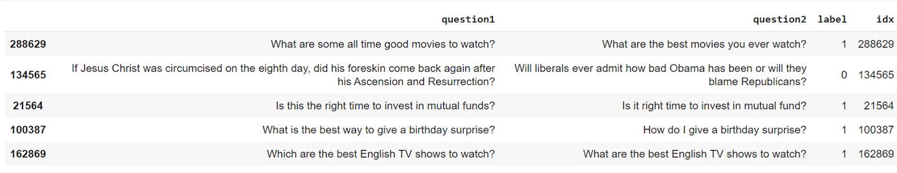

Here is the problem statement: Predict whether any given two sentences (questions) are semantically similar to each other. We will use the Quora Question Pair (QQP) data set, which is part of the GLUE benchmark. We will use two evaluation metrics, F1 and accuracy metrics.  
   
By the end of this case study, you should be able to:Work with Hugging Face data setsLoad, train and save BERT-based models (BERT and ALBERT, among others)Perform end-to-end implementation (training, validation, prediction, and evaluation)  
You can download the data set from ++[this ](https://drive.google.com/drive/folders/1NwwS0v1o3vPYUgKfQZzVj-I8ivVAvSn2?usp=sharing)++link.  
   
```
train = pd.read_csv('/content/drive/MyDrive/sentence_pair_classification_data/train.csv')
train.sample(5)

```
   
 Output:   
  
   
   
There are 363,846 entries of data with the following four columns: question1, question2, label, and idx. However, to use the Transformer API, we need to use the load_datset() function, which automatically converts the given data into a dictionary.  
```
dataset = load_dataset('csv', data_files={'train': '/content/drive/MyDrive/sentence_pair_classification_data/train.csv',\
                                          'valid':'/content/drive/MyDrive/sentence_pair_classification_data/val.csv',
                                          
```
```
'test': '/content/drive/MyDrive/sentence_pair_classification_data/test.csv'},)

```
   
Output:  
```
DatasetDict({
    train: Dataset({
        features: ['question1', 'question2', 'label', 'idx'],
        num_rows: 
```
```
363846

```
```
    })
    valid: Dataset({
        features: ['question1', 'question2', 'label', 'idx'],
        num_rows: 40430
    })
    test: Dataset({
        features: [
```
```
'question1', 'question2', 'label', 'idx'],

```
```
        num_rows: 390965
    })
})

```
   
In order to pre-process the inputs, we need to initialize the model_name/checkpoint and load the tokenizer such that it can automatically load the tokenizer for it.  
```
model_checkpoint = "bert-base-cased"
from transformers import AutoTokenizer
tokenizer = AutoTokenizer.from_pretrained(model_checkpoint)

```
 After the tokenizer is loaded, we can apply it to a sample input, as given below.  
```
tokenizer(train.question1[0], train.question2[0], 
                                      padding='max_length',  # Pad to max_length
                                      truncation
```
```
=True,  # Truncate to max_length

```
```
                                      max_length=100,  
                                      return_tensors
```
```
='tf',return_token_type_ids = True) 

```
The output is a dictionary consisting of the following three keys:  
**'input_ids', 'token_type_ids' and 'attention_mask'.**  
**'input_ids', 'token_type_ids' and 'attention_mask'.**  
   
We need to handle the two sequences as a pair and apply the appropriate preprocessing simultaneously. For this, we pass both questions as combined input_ids, which is performed with the help of special tokens, such as the classifier ([CLS]) and separator ([SEP]) tokens. Also, the BERT model expects the processed input in the format in which two sentences are separated using [SEP] tokens.  
However, since padding is maintained at 100(max_length), the extra values in the input_ids are filled with 0’s.  
Generally, special tokens are capable for the model to understand the presence of two sequences. However, the BERT models take in token_type_ids as well. These ids are represented as a binary mask identifying the two types of sequences in the model, where all the tokens of the first sequences are filled with 0’s and all the tokens of the second sequences are filled with 1’s.  
For example, if the first question is of 10 tokens and the second question is of 8 tokens, you will observe the following output:  
```
'token_type_ids': [0, 0, 0, 0, 0, 0, 0, 0, 0, 0, 1, 1, 1, 1, 1, 1, 1, 1]

```
   
To return these ids, you need to set the argument **return_token_type_ids = True.**  
  
  
  
  
  
  
  
  
  
  
  
  
