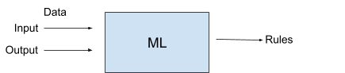
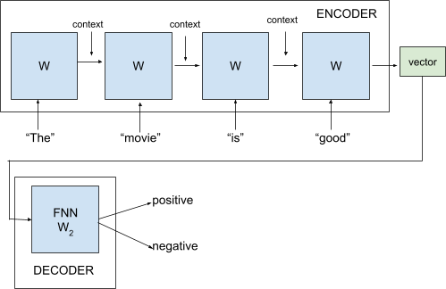
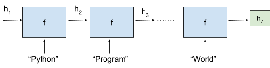
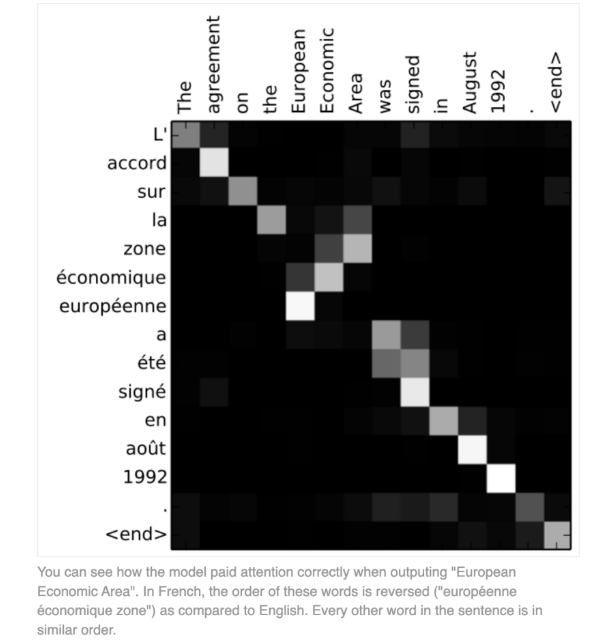
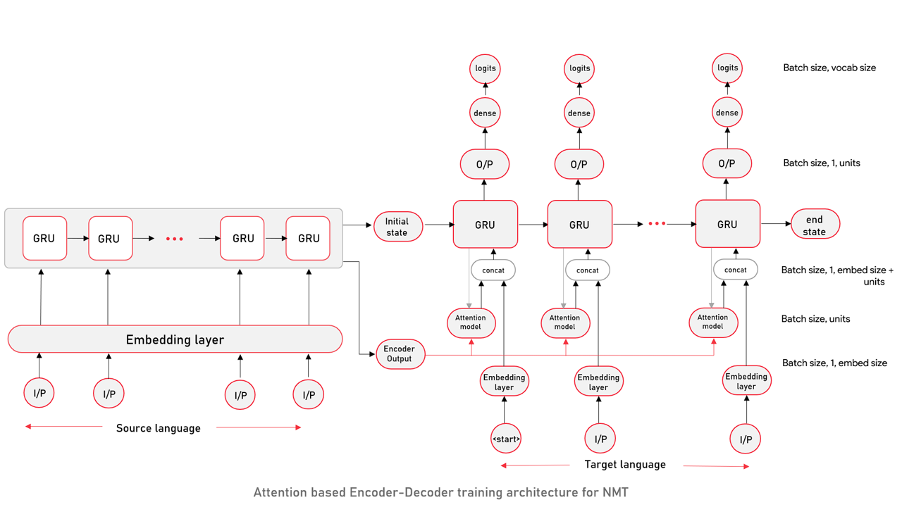
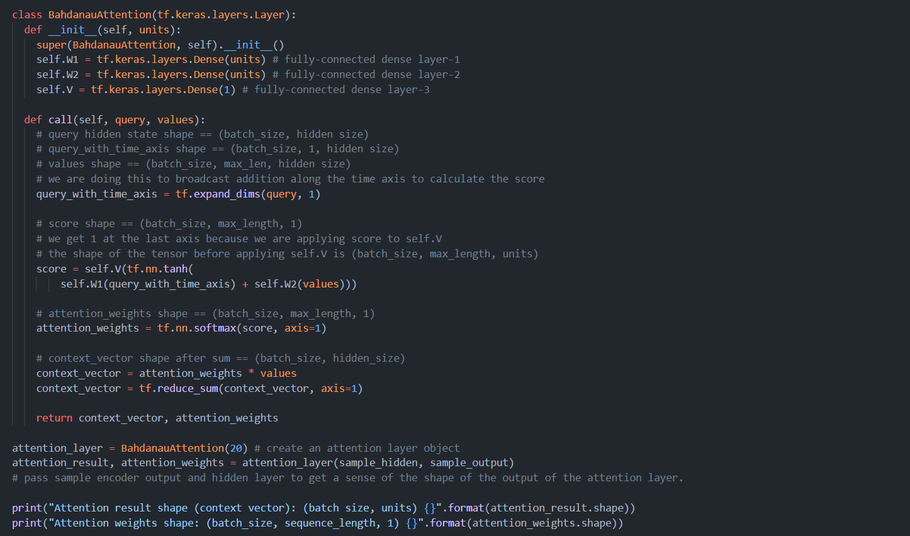

# Transformers  
  
  
# Context Behind Transformers  
  
Welcome to the Module on Transformers.  
   
So far, in the previous course, we covered some natural language processing (NLP) tasks such as sentiment analysis or part-of-speech tagging, which are examples of discriminative tasks in which the model predicts a single class or label. However, many tasks require more complex outputs, such as sequences of varying lengths, which fall under the category of generative tasks.  

An example of a generative task is machine translation, where a sentence is translated from one language to another. This task is crucial in understanding natural language and requires deep learning techniques for handling sequential data. However, architectures such as transformers are not limited to translation. For example, the Generative Pre-Trained Transformer (GPT) has been applied to tasks such as code generation, question answering, and text summarization, demonstrating its versatility across various generative tasks.  

In this module, you will explore Transformers, an innovative architecture, which is a deep learning-based framework designed to excel in generative tasks such as translation. Transformers leverage self-attention mechanisms to capture dependencies in sequences, significantly enhancing performance in tasks such as translation, summarization, and sentiment analysis.  
  
  
  
In this video, he discussed a data set in which each email is labelled as spam (1) or not spam (0). Given this data set, you want an algorithm to learn patterns from these labels and classify new emails accordingly.   
   
This approach differs from traditional programming in which predefined rules dictate the output. Machine learning algorithms identify patterns from data to make predictions. This approach involves providing input (emails) and output (labels) to the model, which then learns classification rules.   
   
  
   
Understanding these ML algorithms is essential, as they form the basis of our discussion on transformers and NLP tasks. The fundamental approach remains consistent: you provide input and output data and ask the model to generate a set of rules.   
   
While ML techniques for vector data and pattern recognition apply to NLP, transformers offer a more powerful approach for analysing and generating natural language text. Transformers, such as Generative Pre-trained Transformer (GPT) models, excel at processing unstructured data from the web.  

This module will focus on using structured data for NLP tasks, exploring how to build efficient models for natural language understanding with transformers and other ML techniques.  
  
As explained in the video, you will explore a case study to gain an understanding of the development of Transformers. Suppose you need to create an autofill tool for an official communication platform such as Slack using authorised public data. For example, when someone types "I'm not well, working from," the tool should predict "home" as the next word.  
   
**Problem setup: Creating a statistical model for autofill**  
For example, Slack and so on, right?And you are given access to public data.Of course, the theme keeps repeating all this machine intelligence algorithms work on data.So data is central theme to all the algorithms.And the question that I am asking is, can you build a simple statistic tool to autofill, right?Autofill essentially if you open your mobiles, go to any social media or even on a browser, when you type something right, when you say what is and so on and so forth.Of course based on your history and so on and so forth, it autofills right?If you type what is because you are reading Transformers, you would have searched about Transformers, it might say what is Transformers and so on.South, that is an autofill task.Now you have to build this customized tool for your official communication channel and the data you have is public data that is on the channel which has been authorized for you to be used for your use case which you have got necessary permissions from requisite teams.So can you build a simple statistical tool?That is the question that we are asking.A simple question here is someone is about to type I am not well working from this typically happens in hybrid work mode when someone was working from home and working from going towards office on some days.And some days we are not feeling well and we tend to give that indication or message on Slack saying I am not well today working from dash right?And of course the next word next autofill to this sentence is home.That is a common consensus.But how do we build it?The way we are going to build is is a question that I am asking.So again I request you to pause here and think how am I going to build this tool which can auto fill for this particular statement.Now the steps we follow is as follows.  
00:03:15 - 00:06:34  
**Building a probability model for autofill suggestions**  
We first extract, extract all sentences in the data that you are given, the data that starts with this, that has, that starts with the following tokens.That is not well working forum, right?That's what we essentially do.First we extract all the sentences in the data set that was given to you with necessary authorization.And then you select or you search for all the sentences which have this as its prefix not well working from.And then you would see what are the possible autofills to the data which has been extracted because these are completed sentences.You would see essentially let us say you would see home, the word called home appearing 100 times.And then you will say probably you will see room which is appearing 50 times.And of course one always deals with typos when typing.Someone would have typed HO, you know, ham, ham and so on and so forth, which probably is occurring 6 times, so on and so forth.And then what we do is we build a probability model.We build a statistical model essentially.So probability model which says the right autofill to this particular sentence is simply home with probability 100 / 100 + 50 + 6.Let us assume these are the only three.Let's not say there are many more.Of course there can be many more.But for this example we say the next word of this sentence is home with this probability.Of course, this number tends to be higher compared to all other numbers and it can be a room with probability 50 / 100 plus 50 + 6.And this can be in a typo word called hem with probability 6 / 100 + 50 + 6, right?So then what do you say?You say that I think the next probable word is home with 100 by 15650 by 156 probability.It is room and then hem with probability 6 by 156 and then we randomly sample from this distribution.Of course, most of the time you are going to get home, which is in fact the correct word.But sometimes you can also end up with words like room and Haim, which is unavoidable because we can.A model does not discriminate between whether a word is room Haim, it is a typo or not.So far right the model which you have just built cannot discriminate.We are of course going towards richer and powerful models.But the model which you have built just now is a very simple statistical model which depends heavily on the data.Try to make analysis and understanding from the data and builds this probability distribution.Yes.  
00:06:34 - 00:09:12  
**Limitations of the statistical model and need for semantic understanding**  
So essentially summarizing what we essentially did, extracting all sentences that contain the words not well working from from the data.And we have built a statistical model.Now what are the limitations Again?Pause for a moment and think whether this is the best model that we can do.And if not, if your answer is no, then you might think why this is so, why this is not the best Model 1 can develop.And the answer is pretty simple here.Suppose on a given day we start writing not well operating from instead of working from and we write operating from.Will our model be able to do this?And the hint or the input that I am giving is no one has written like this so far, right?We are probably you are the first one who has started writing not well operating from home.You are about to write it right?You are about to write operating from.Then you expect your autofill tool to say home.But you wonder, oh, I am not getting any autofill suggestions.It is blank.Now you go back and ask you, people will ask you, hey, I have given you the task of building this autofill.Now when I start writing operating from, it's empty.I am not getting any recommendations.Do you think it's some issue and so on.Then when you go back and analyze, you will realize that the model has not seen or there is no data which has these following tokens that is not Well operating from your model has not seen these words.So the model say I am sorry, I can't do anything because I don't have a data at all to essentially perform this task, correct?So the issue here is the model does not understand the semantics.It does not.We know that operating is similar word.It is a similar word to a word called working.But the model does not have this understanding.The model is not equipped to understand that word operating is similar to working.If it understands, then our job would have been pretty simple and easy.That is, it will just say I will extract not well working from and essentially use their recommendations to fill this.And unfortunately the model that which you just built do not have that capability.That is what is missing.That is the part that which is missing.And of course, there are one in research, researchers have tried to overcome this problem and come up with new and better models starting from here.  
  
  
Professor Raghuram then explained the steps in building such as the autofill tool:  
1. **Extract data:** Extract all sentences from the data set that begin with "not well, working from."  
2. **Identify common completions:** Identify the most common completions in these sentences. For example, "home" appears 100 times, "room" appears 50 times, and a typo "H" appears 6 times.  
3. **Build a probability model:** Calculate the probability of each word being the next one in the sequence.  
4. **Random sampling:** Use this probability distribution to predict the next word. Most of the time, "home" will be the predicted word, but sometimes, "room" or "H" may also appear.  
However, this simple statistical model has limitations. For example, if someone types "I'm not well, operating from," the model will not predict "home" because it has not seen "operating from" before. The model lacks semantic understanding and, so, will be unable to recognize that “operating” is similar to "working."  
   
To overcome these limitations, researchers have developed more advanced models that better understand semantics and context. These advancements eventually led to the creation of powerful models, which excel in handling complex language tasks and understanding context.  
  
  
  
  
  
  
  
  
  
  
  
  
As explained by the professor, Word2Vec represents a significant advancement over n-grams by capturing semantic relationships between words. However, it is associated with certain limitations. For example, the word “bats” in different contexts (animals vs sports) should have different vector representations, but Word2Vec may treat them the same, which is problematic.  

This is a critical issue in sentiment analysis, an NLP task. For example, “The movie is good” is a positive review, but “The movie is so good it cured my insomnia” is sarcastic and negative. Word2Vec might mistake the sarcastic review for a positive one because it does not understand the context.  

To address these issues, research was conducted from 2014 to 2017, which focused on better capturing contextual information in sentences, leading to improvements in the models used for tasks such as sentiment analysis, language translation, and text summarization.  
   
In the next segment, we will summarise your learnings from this session.  
  
  
# Encoder Decoder Architecture  
  
Welcome to the session titled “**Encoder-Decoder Architecture**.”  
   
In the previous session, you explored different NLP models, noting their limitations in capturing context-specific meanings, which can lead to issues in tasks such as sentiment analysis. This session builds on that by introducing more advanced models that are designed to better capture contextual information.  
   
The Encoder-Decoder architecture is a powerful model used in natural language processing to transform sequences, such as sentences, from one form to another. It is especially effective for tasks requiring context preservation, such as language translation and text summarization. By encoding input data into a fixed representation, the model can generate meaningful output sequences, even with complex and long sentences.  
   
In this session, you will:  
* Explore the encoder-decoder architecture, a popular model for capturing contextual information in sentences  
* Implement an encoder-decoder model for converting a sentence from source language to target language  
* Understand the challenges associated with standard encoder-decoder models when handling long sentences  
*  and how we can improve the model's performance  
* Explore graphical illustrations to understand how the proposed model works  
* Understand the mathematics behind the process and learn how to train an encoder-decoder model with attention  
* Implement encoder-decoder model with attention for converting a sentence from source language to target language  
  
As explained in the video, the encoder-decoder architecture is a popular framework for sequence-to-sequence tasks such as sentiment analysis. As the name suggests, the encoder-decoder architecture consists of two components - the Encoder and Decoder. The Encoder converts a sentence into a vector representation. The decoder uses this vector to perform the desired task, such as sentiment classification or translation.  
   
This architecture uses a recurrent neural network (RNN) to handle context and generate accurate assessments. An RNN processes the context of a sentence sequentially. If you are not familiar with RNNs, visit ++[this link](https://www.ibm.com/topics/recurrent-neural-networks)++.  

The professor then explained how this model works with the help of the example sentence “The movie is good.”  
  
   
1. In the **Encoder**, RNN processes the word “The,” performs matrix operations, and generates a context.   
2. This context is passed along with the next word "movie" to the next RNN cell.   
3. Each RNN cell takes the previous context and the current word to generate a new context.   
4. This process continues for each word in the sentence, with all RNN cells sharing the same weights, allowing the model to handle sentences of any length.  
5. The final output is a rich vector representation of the sentence, capturing its context and meaning.  
6. This vector is then fed into the **Decoder**, which uses a feed-forward neural network to classify sentiment, such as positive or negative.  
Initially, the model might not be accurate, but through training and adjusting weights based on feedback, it learns to improve its predictions. While RNNs can struggle with long sentences because recent words might overshadow earlier ones, more advanced architectures such as LSTMs or bidirectional LSTMs can help mitigate this issue.  

This encoder-decoder setup provides a more dynamic and context-sensitive representation of words than the static representations used in Word2Vec, enhancing performance in natural language tasks.  
  
  
## Machine Translation Example  
  
  
  
  
  
  
  
  
  
As explained in the video, the Professor used the example of translating an English sentence into Python code.   
Consider the English sentence “Python program to print hello world.” The goal is to create a model that takes this English input and generates the corresponding Python code.  
```
print("hello world")

```
   
The professor then explained that using the encoder-decoder model, the encoder processes the input sentence and creates a context vector. For example, it converts the English sentence into vectors -   
  
 for "Python,"   
  
 for "program," and so forth until   
  
 for "world."  
   
  
   
In a standard encoder-decoder model, this single context vector (  
  
) contains all the information needed for translation. However, this approach can be problematic for long sentences, as it forces the encoder to compress all relevant information into one vector.  
   
To address this, an attention mechanism is used. Instead of relying on a single context vector, the decoder can focus on different parts of the input sentence at each step. For example, when generating the word "print," the decoder might focus on the words "Python" and "program" while ignoring "hello" and "world."  
As the decoding progresses:  
* To generate "print," the decoder attends to the input words "Python" and "program."  
* For "hello," it focuses on "hello" itself.  
* For "world," it pays attention to "world."  
This mechanism allows the decoder to selectively focus on the most relevant parts of the input sentence at each decoding step, making it easier to handle longer sentences and complex translations.  
  
  
# Attention Mechanism  
  
## Overview  
  
**Challenges of Standard Encoder-Decoder Model**  
It is easy to see that in the sentences which are very long, it might become very difficult for the standard encoder decoder model to compress all the necessary information that is required for the decoder into a single fixed length vector.So please keep this in mind right we need.What is happening currently is the same context vector is being used at all stages of decoding process.Therefore, there is a pressure on the encoder to compress all the necessary information of a source sentence into a fixed length vector.And if the number of words in the input sentence is very high, that might be a very difficult process to do.That is compressing all information in a fixed length vector.So that is an issue that we have identified with the standard encoder decoder module.Now, how do we solve it?  
00:00:56 - 00:02:06  
**Introduction to Attention Mechanism**  
Again, I request you to pause for a moment and think what might be a simpler, right, a very simpler way to mitigate this problem.So how do I want you to think about it?Just think how we translate a given sentence into a target sentence.To give you a small hint, let us say you are translating from language A to language B and during the process of language B you have translation.You have achieved, you have come till 3 words.Now ask to translate and come up with the fourth word.Do you really require the context of entire sentence or do you selectively attend?That's where I started bringing this word called attention, right?You attend to what are the required words that you want to look at in order to come up with this next word, right?It might not be very clear in what I am saying, but this should give you a hint on how we translate it.So let us look at these vague ideas in a more rigorous fashion.Now, a new philosophy that we are going to develop is we are going to do something called learning to align and translate.  
00:02:07 - 00:03:59  
**Learning to Align and Translate with Attention**  
What does it mean?Each time the model that is Decoder generates a word in a translation, it searches for a set of positions in the source sentence where the most relevant information is concentrated.I have underlined the most important words here.What are we saying?We are saying that during the process of a translation, because it is one word at a time, when you want about to generate or translate or come up with the next word.This we are giving the power to the model to look for positions in the input or a source sentence where the most relevant information is there and pick those contexts for the decoding at this point in time.In a simpler way, what we are saying is the context that is required at each step of the decoding need not be same.We can provide the power to the model to select different contexts at different points of decoding process.So this eases the burden on encoder to compress everything in one fixed vector.So what is happening here?The model predicts a target word based on the context vectors associated with these source positions and all previously generated target words.Now the important point I want you to focus here is at each step the context vector is not same.At every point it changes.So the model selects or attends to those context vectors which are actually important at this moment in time.So let us see an example to consolidate all the ideas that we have discussed.  
  
### Intro  
  
As explained in the video, long sentences can be challenging for standard encoder-decoder models because they must compress all necessary information into a single fixed-length vector. This can be challenging when the input is lengthy.  
   
To address this problem, consider how you naturally translate sentences: you do not rely on the entire context but focus on relevant parts. This insight leads to the concept of **attention** in translation models.  
   
In this approach, every time the decoder generates a word, it looks for the most relevant information in the source sentence rather than using the same context vector throughout. This way, the burden on the encoder to compress all the context into one fixed vector is reduced. The model can dynamically select the context vectors that are most pertinent to the current word being generated.  
   
This **learning to align and translate strategy** improves the model's ability to handle long sentences and provides a more nuanced translation process by attending to different parts of the source sentence as needed.  
  
## Graphical Representation  
  
  
  
In the next video, you will explore the graphical illustration of the model discussed in the previous segment.  
  
  
  
## Maths behind Attention  
  
**same as done before-> difference-> using encoder decoder and non vectorized form**  
  
###  Context Vector  
  
  
for generating print("Hello World") program in python for the question  **write a python program to print hello world**  
 first word print is generated automatically by the decoder by attending to **python program print**  
  
**ensemble method-> transformers-> like xgboost-> in parallel but pays attention to context words by above maths for standard transformer.. and modified/rewritten for later architectures**  
  
Attention=QK^T/√dk-> Context-> Normalized in each transformer block  
Value-> softmax(Attention*V)  
Q,K,V  
  
  
## Decoder  
  
![aly, the contest wot static (denoted or 0], Now, varies of each](Attachments/B19913EC-1A50-4195-B16E-1801B6BCBBF2.heic)  
  
Current Context Mathematically-> Weighted Avg highest relevance, or dynamic adjustment learnt over time..  
  

[](Attachments/55C190A7-8A55-4E89-8E46-FAF0202045CA.heic)  
#todo redo above math to confirm tomorrow  
  
## Attention Mechanism Training  
  
As explained in the video, the encoder-decoder model operates on data to learn and generate translations. For example, when translating between languages, you create a data set with sentences in language A and their translations in language B. This data set consists of pairs of source and target sentences.  
   
For training an encoder-decoder model with attention, this data set is used to minimise a loss function, typically cross-entropy loss. This loss function measures the difference between the model's predicted translations and actual translations. If the model predicts accurately, the loss is zero. Otherwise, the goal is to reduce this loss as much as possible.  
The model optimises several components to achieve this, which are listed below:  
* The function *f* from the encoder, which processes the input sentences  
* The function *g* from the decoder, which generates the output sentences  
* The alignment function *a,* which determines the attention weights, or how much focus to give each context vector at different time steps  
All these components are trained together. Simply optimising *f* and *g *without properly training the alignment function would result in suboptimal translations. During training, the model adjusts *f, g*, and *a* to minimise the loss function, improving the translation quality over time.  
   
For example, while translating English to French, the attention mechanism helps the model focus on the relevant English words for translating specific French words. If the model is well-trained, it will correctly prioritise the words "europèenne" and "èconomique" when translating to their French counterparts, as shown in the image below.  
  
   
The attention module enhances the encoder-decoder model by allowing it to dynamically focus on the most relevant parts of the input sentence, improving translation accuracy.  
  
### Drawbacks of RNN  
  
  
  
  
# Python Demo  
  
  
  
**Model building**  
  
For most of the attention-based NMT models, the process remains the same as earlier since we are working on the same data set. In the next video, Mohit will take you through the entire implementation and will help you understand the changes that are introduced to make the model prediction better and solve the information bottleneck problem.  
  
  
### Transcript  
  
**Introduction to Attention Mechanism in Encoder-Decoder Architecture**  
A very warm welcome to you, learners.In this model, we'll be looking at the implementation of the attention mechanism.We'll be extending our encoder decoder architecture to have the attention mechanism as well.So the data set remains mostly the same.We're using exactly the same data set and the same set of libraries.The the data preparation process also mostly remains the same.What changes really is the place where we start defining the encoder model with attention.  
00:00:33 - 00:01:56  
**Changes in Encoder Model with Attention Outputs**  
So just pay a close look here.There's not a lot of changes if you can really understand this architecture well and be able to appreciate the differences, which I'm going to highlight now.So if you see in the earlier example, when we were using the encoder decoder model, we didn't use the outputs which were getting produced here.So in this model, in the attention model, what really essentially changes is that now we're going to make use of these different attention outputs, which are the different outputs of the the encoder model also to be used in the decoder site.So this encoder output which is mentioned here essentially will be an array of the number of time steps which you have in the encoded encoding process with the batch size and the number of units which are defined, which we have as we have used in our example, which are defined as 1024.So this essential input goes into the decoder side and it's available all the places in all the decoding steps.One of the other modules which we added, and as you would have known from the lecture is this module called the attention model.So this attention model and this encoder output, how do we take care of that in the decoder site is essentially what changes from the previous example which you've already seen.So let's just take a deep dive there.In terms of the encoder architecture, it's exactly the same like what we had used earlier.  
00:01:56 - 00:02:36  
**Understanding Badanu's Attention Model**  
We have the return sequences equal to true, we had the same, but what we were not doing in our example is actually using these encoder outputs.So let's first look at the Badanu's attention model, which we'll be implementing, and then see how we can use the encoder outputs of the encoder layer in the decoder.So these are the two critical changes which you should focus on to understand the difference between the previous sequence to model the traditional one which we discussed and the attention model.So if you see in this Bodanos attention model, the the essential process, how the attention works is determined by a query and a value.  
00:02:36 - 00:03:28  
**Query and Value in Attention Mechanism**  
So the the query is what is on the hidden side.The hidden state of the decoder is the query and the values is the values of the encoder output which are available on the encoder side.What we have to eventually do is to produce some sort of a scalar values to be available from for different.So just to know that which is the encoder output which you should be most concerned with while decoding.So this is essentially what this step is doing this formula you would have already seen in the the lectures where there's this is what we define as the out the the scoring mechanism for a Badano's model.1 of the things which sometimes confuses learners is this thing called how do, why do we need to have these different the shapes which are there.  
00:03:28 - 00:04:11  
**Attention Weights and Context Vector**  
So one thing which you can just think about as intuitively as something which will help in your understanding is that once we are essentially when we are dealing with multiple time steps, this second dimension helps us in which time step we are.But when we want to take an output of it, we essentially want to work with the lower dimension where we don't need this time step.So this is the reason why we sometimes change.We have used this in a few examples to downsize and upsize.Let's just see what the Badanu's attention model is essentially doing.So we finally get the attention weights which are the softmax output of these score values.  
00:04:12 - 00:05:02  
**Changes in Decoder with Attention Layer**  
So this is essentially working on the outputs and giving us for every encoder, every encoder step, what's the value of these different weights.So if suppose the attention weight is higher for one of the encoding layers, it would mean it has more attention of the decoder when it's trying to decode. weighted average..  
  
The other thing which we do is we actually do a weighted sum of the attention weights along with the hidden values so that we have a context lecture which takes care of the different attention weights.So you can think about it as if you're doing a **weighted average**.It gives gives the recorder a better sense of which words to focus upon and which words to not focus upon.So this is we defined this attention layer additionally.  
00:05:02 - 00:06:13  
**Training Model with Attention and Teacher Forcing**  
So now that we've understood the Badanu's attention mechanism, let's take a closer look at what changes are there in the decoder.So one of the things which you notice is that you have this encoder output being passed to the call of the decoder which was not there in this traditional sequence to sequence sequence model which was not using attention.So once we use this encoder output, we pass it to the attention layer and get the weighted context vector and attention weights.So one of the things which we use this context vector is you can see it from the above explanation which has been provided that we concatenate that with the input which is there.So you can note that the input dimension is having a time step field as well.So there it's like batch size, time step, the embedding dimension.But what we want is that we would want this shape to also consider the embedding plus hidden.So you expand the dimension of the context vector to include that 10 step dimension which was missing.And then you concatenate and finally the the output the the return value is being passed back, although attention weights are being passed back.  
00:06:13 - 00:07:05  
**Interpreting Attention Weights and Output**  
But this is something which we'll use for plotting.It's not something which is used further in the model in any way.Finally we come to the the training of the model.The most important part.And just to note that this essentially the most of the stuff remains the same except for this again this minor change when we are doing the training step.What essentially changes is this encoder output getting added to the train step in the decoder function.We were not like the output of this was available to us in the sequence model as well in the traditional sequence model as well, but we were not using it.Now we have just passed this parameter which gets output off the encoder into the decoder and we are starting to make predictions.One of the things which we didn't discuss in very great detail, which is very important to notice, this concept of teacher forcing.  
00:07:05 - 00:08:10  
**Handling Longer Sentences with Attention Model**  
So what you would expect typically is that what the predictions are being made to be actually be passed back into the input value, right?This is what you would expect.But in the teacher forcing concept, as we discussed in some detail in the previous example, this actually uses the target which is the.Essentially when we know what is the translated word, we are passing that and it is said that it improves the training process, it gives a better output.So this is one key difference.Otherwise, most of this training step remains the same.We go through this training process.We have used a different epoch size here.This since there's added parameters which are added because of the attention layer.This training takes a little more time.It takes around 2 1/2 hours, 3 hours.We are using the checkpointed 1 so we are just showing you the output.But once you run this, it will take you 3 hours.You need to just as in the previous worksheet.You just need to make this as true and you can run this training sample.So we've essentially looked at what changes which have been made, right?Let's just see how the output looks like.  
00:08:10 - 00:11:18  
**Beam Search Algorithm in Translation Model**  
One of the things which we have modified in this output is that we've also given you a matplotlib plot of the attention weights and we're just going to see the input.So now I use the same translate function and I'm using the plotting.That's why it's true.And I say I'm hungry and it says me Bukata, which is probably not a very accurate, but it it essentially gives you the output how you would like to interpret this visual map of the attention weights is important.As you can see from these that we have used this phone called where it is.So if you just go to the Matlotlab and just check out the word is.So you'll see that attention this these values are the lower values, the dark Blues and the yellows are the high, high values.So if you see here Hungary, although it's the third word, but buka is the second word, but it gets more attention.So it gets a yellow here and I and may which is again in green.So this is how you can interpret this.Now coming to the, the very important aspect which we thought that we were why we were doing the attention is to be able to handle longer sentences.Let's see how the new model which we have built performs on slightly longer, longer sentences.In the traditional model, it's it didn't just work right, right.It didn't give a very bad translation.But if you see here, it's done a much better job.It remembers that the first thing was mujhe buk lagi hai, mujhe kuch khana khane ke liye.A little bad here.But otherwise it's done a very good job.And again, you can interpret this.You can see that eat although was the last word in the input, but eat came in a lot earlier, Hana and Khan here.And you can see very high attention rates for this.So brilliant.We have now moved ahead and now we are able to solve.We are able to translate longer sentences with much greater accuracy.So we have run the blue example, although it's not directly comparable, but you'll see that you can compare the output.If you're fine tuning your model, you can use the blue to make some sort of adjustments.The last thing which you would like to discuss in this module is something called the beam search.If you remember we talked about it in the lecture where we looked at how we can use a beam instead of just using the greedy search algorithm.So once we start the beam as the where we look at more number of options than just the greedy search.So we are trying to output in this example, we are fed in I am hungry and we have kept a beam size of three.So when we take the beam size of three, we get 3 translated values Mujhebuk lagi here, Mujhebuk lagi here with a Viram sign instead of the full stop and mehbuka.So this is the BEAM output and you can see the values of these BEAM outputs are given out as probability.So this is a brilliant way to also further improve our model.Those who are inclined to understand this BEAM implementation can just look at this.Otherwise this is optional.  
00:11:18 - 00:11:48  
  
You can see that essentially what we are doing is we are calling this in the encode, we are calling the BEAM search step recursively and essentially we are running three parallel.The beam size is 3, so we are running three parallel encoder and decoders.But this essentially is what we covered in the lectures and this should give you a good view now how to implement both the traditional model and the model with attention.  
  
  
  
The following image shows us the entire architecture of the attention-based NMT model you are going to build.  
   
  
   
   
As seen in the video the Encoder remains the same, however, the encoder output is not discarded here and is used as an input to the attention model.   
   
**Attention model**  
To the decoder, the **encoder_output** is added as an added input to generate the context vector. The encoder_output and decoder's hidden state is passed as input to the **Bahdanau's attention model** (Additive attention).   
Here is the code for the attention model:  
   
  

Once you have built your attention model successfully you can observe:   
   
Attention result shape (context vector): **(batch size, units) =  **(64, 1024)  
Attention weights shape: **(batch_size, sequence_length, 1) = **(64, 72, 1)  
   
Once the context vector is generated, it is then concatenated with the output from the embedding layer. This concatenated result is fed to the GRU layer as input. The other components of the Decoder remain the same.  
   
In the end, you have seen how beam search improves the model performance and how it performs a better job even when it is fed with longer sentences. To understand more on the beam search refer the beam_search_step the function used in the demonstration.  
   
You are now ready to experiment with encoder-decoder model and attention models and how they can be tuned to increase the model’s performance.   
   
In the next segment, we will summarise your learnings from this session.  
  
## Summary  
  
  
* The encoder-decoder architecture, which is essential for capturing contextual information in sequences  
* Implementation of encoder-decoder model on converting a sentence from source language to target language  
* The challenges faced by traditional encoder-decoder models, particularly with long sentences, the inefficiencies of sequential computations and, how we can improve model's performance using attention  
* Graphical illustrations that clarified the proposed model’s structure and functionality  
* The mathematics behind the decoder, emphasising its role in processing context vectors  
* The training process for an encoder-decoder model with attention, which enhances the model's ability to focus on relevant parts of the input sequence  
* Implementation of encoder-decoder model with attention on converting a sentence from source language to target language  
   
   
In the next session, you will learn how to develop a mechanism that processes these vectors parallelly instead of sequentially.  
  
  
# Intuition Behind Transformers  
  
