In the upcoming sessions, you will understand the evolution of the cloud. You will understand what cloud computing is, the different technologies that made cloud computing possible and how it solved the problems faced before its advent. Then, you will learn about various deployment and service models and explore their essential characteristics. After this, you will learn about the benefits of cloud computing by exploring its advantages over on-premises data centres.  
   
You will be able to gain fundamental knowledge and practical skills required to build and deliver solutions on the cloud using the services of a major public cloud service provider, Amazon Web Services (AWS).  You will also get hands-on experience in using the storage, computing, and networking services within the AWS environment.  
*   
   
In this session  
This session will focus on the role of computing environments and their different types. Then, you will be able to understand what cloud computing is and how it solved the problems faced before its advent. Next, you will learn in detail about the fundamental technologies that made cloud computing possible and the various architectures and deployment models prevelant in the industry today.  
   
The broad topics covered in this session are as follows:  
* Introduction to cloud computing  
* Benefits of the cloud  
* Fundamental technologies of the cloud  
* Cloud deployment models  
* Cloud service models  
  
  
**Cloud Computing**  
Cloud computing refers to the delivery of services such as processing, storage, databases, networking, etc. to users and organisations based on their requirement, over the Internet. The servers on which these softwares and databases run are located in data centres across the world. Users and organisations can access these servers through the Internet from anywhere.  
Cloud computing is a pay-as-you-go service, i.e., the users pay only for the services that they use.  
   
The two main users of Cloud are:  
* **End Users:** These users use cloud services for proprietary benefits.  
* **Business Management Users:** These users utilise cloud services on an organisational level.  
   
  
The three major cloud providers are:  
* Amazon Web Service (AWS)  
* Microsoft Azure  
* Google Cloud Platform  
  
**Additional Reading**  
* ++[How AWS evolved](https://aws.amazon.com/blogs/enterprise-strategy/the-fast-and-the-furious-how-the-evolution-of-cloud-computing-is-accelerating-builder-velocity/)++ - This article shows how the evolution of cloud computing accelerated the growth of AWS.  
* ++[Real-world cloud computing examples](https://www.maropost.com/5-real-world-examples-of-cloud-computing/)++ - This article tells about the top five real-world examples which use cloud computing.  
* ++[Open-source Cloud Platforms](https://computingforgeeks.com/top-open-source-cloud-platforms-and-solutions/)++ - This article can tell you about some top open-source cloud platforms.  
  
  
**Benefits of Cloud Computing**
   
In the previous segment, you learnt about cloud computing and its various applications, and how industries are willing to shift towards the cloud. The cloud is a shared computing environment where you can dynamically **create**, **access**, and **remove** virtual computing resources. It is an implementation of the idea of accessing virtual computing resources remotely. Specifically, cloud computing is the **delivery of computing resources**, including servers, storage, databases, networking, and software** over the internet**.  
   
In this segment,  you will learn the benefits that cloud infrastructure offers to organisations.  
  
In this video, our industry expert will talk about the advantages of using the cloud over an on-premise system.  
  
Let's summarise the benefits of using the cloud over traditional data centres-  
  
* **Cost Saving:** Cloud computing eliminates the need for buying or maintaining hardware and software resources and for setting up data centres. It also eliminates the need for maintaining computing infrastructure. Most of the cloud services are pay-as-you-go, which means customers only pay for the services that they use. Use of the cloud also reduces the cost associated with staff wages.  
* **Scalability:** Cloud computing provides businesses with the ability to expand their resources when needed. Organisations need not worry about installing infrastructure, as it is done by the cloud service providers. They can also scale up their applications as per requirement.  
* **Availability:** Cloud is available at different locations across the world. It allows companies to expand to new geographical regions and deploy the resources globally.  
* **Security: **Cloud allows access to data and applications to authorised and authenticated users only.  
* **Data Storage Space:** Organisations can opt for the exact amount of storage they need and pay only for the space that they use.  
   
The image below depicts some of the basic differences between on-premises computing and cloud computing.:  
*   

  
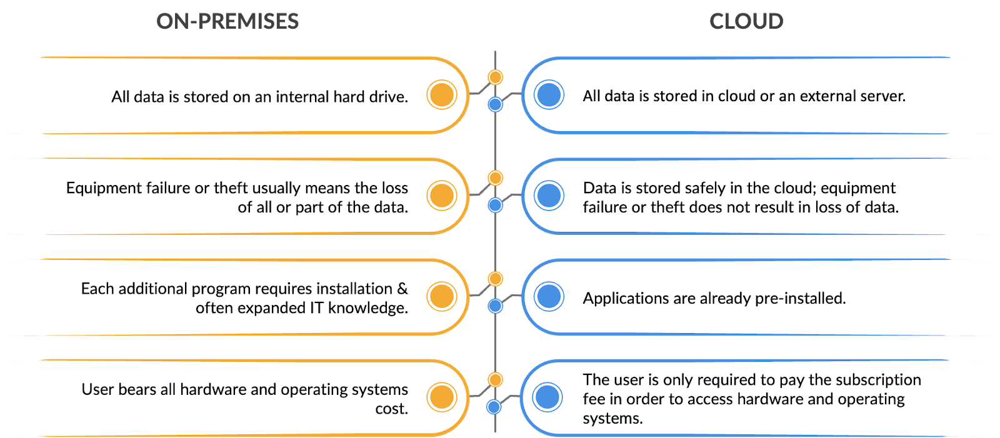  

   
**Additional Reading**  
* ++[Comparison Between On-Premise Systems and Cloud](https://www.softwareadvice.com/resources/cloud-erp-vs-on-premise/)++ -  This article will give you an idea about the differences between cloud and on-premise systems.  
  
  
**Data Centers**

   
Imagine you are working at AWS and it is your job to identify the essential components of AWS as a cloud service provider that will bind every technology on it and also enable a seems experience for the customers.  
   
Can you try guessing, what all services should one think of? Okay, let’s make this simple for you and go  step-by-step. Firstly, to provide the cloud services you will need a physical infrastructure. This could be called the data center for your technology. Secondly, the physical infrastructure that you set up will have to be accessed by other users through a seamless technology, so the internet would do just that. Now, after creating a platform, you should add the computing resources that users will eventually access virtually for their needs. So a virtual computing resource will be required.  
   
In the previous segments, you learned that cloud computing is defined as the delivery of computing resources over the internet. Now, it’s time for you to understand the fundamental technologies that brought cloud computing to life. Let’s understand this in detail, by watching the next video.  
  
o deliver computing resources over the internet, cloud platforms need the following three main ingredients:  
* **Data center**, i.e., physical infrastructure,  
* **Internet technology** to connect data center resources to the internet, and,  
* **Virtualization technology**, i.e., software to create virtual computing resources.  
   
The term data center refers to the **physical infrastructure** used to manage the IT operations of one organization and includes data storage, processing, distribution, and access. A data center has these three main elements:  
* **Core components**,  
* **Support infrastructure**, and,  
* **Operations staff

**  
* 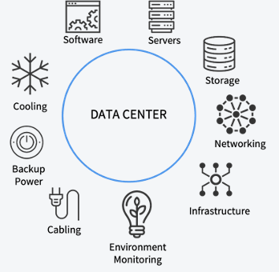  
* 

 
Let’s first learn about the **core components** of a data center, then we will learn about the support infrastructure and operations staff. 
 
The core components of a data center are its physical computing resources. They are needed for processing data, storing data, and distributing data. Data centers house multiple physical  
* **Servers **that provide computing power,  
* **Storage devices** for storing data, and  
* **Network equipment** for connecting the individual servers and storage devices.  
  
  
In a data center, servers are housed in multiple **racks **or **cabinets** and are connected to form a network by devices known as **switches**.  

Different types of network topologies or different ways to form a computer network exist. In a typical data center, there are multiple racks, each of which houses various servers.  
One popular option is the multitiered model consisting of  
* **Top-of-rack switches** that connect rack servers,   
* **Aggregation switches** that connect top-of-rack switches so that servers in different racks can communicate with each other, and  
* **Core switches** that connect aggregation switches to the internet.

  
* 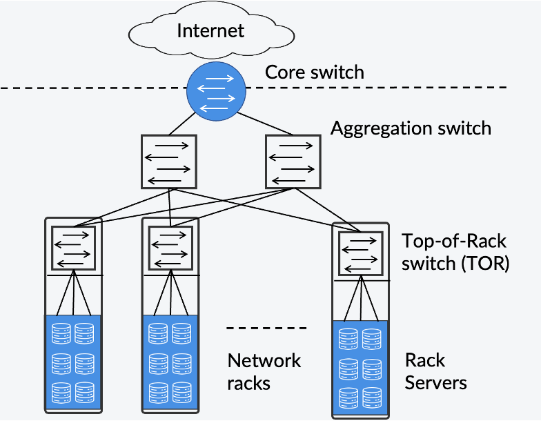  
* 

   
Data centers are critical infrastructure, and they need to be available at all times. This means that they must have minimal or no service interruptions. This property is called **high availability**. Data center also need to operate continuously, even in the case of network disruptions and must recover quickly in case of failures to continue operations. This property is called **fault tolerance**.  A data center needs **support infrastructure** to ensure high availability and fault tolerance. The support infrastructure includes the following:  
* **Redundant power supply**: generators, transformers, and uninterruptible power supplies.  
* **Environmental controls**: cooling systems and fire protection.  
* **Physical security**: access and authorization controls.  
   
To maintain the core components and the support infrastructure, data centers need a **dedicated team of qualified professionals** to  
* **Monitor** data center operations,   
* Ensure core equipment and support infrastructure are **maintained**, and  
* **Troubleshoot** the system and rectify faults.  
   
In summary, data centers are critical and complex systems that require  
* **Core components** for storage, processing, distributing, and accessing data.  
* **Support infrastructure** to ensure IT operations run uninterruptedly.   
* **Operations staff **for monitoring, maintaining, and troubleshooting the data center.  
   
Take-home message:  
   
***Running a data center is always an expensive operation.***  
  
The internet is a global **computer network** consisting of billions of devices (**end devices**) connected by **communication links** and **communication devices**. By connected, we mean they can exchange digital data formatted as **packets**. A packet is a basic unit of data transferred from an origin to a destination address on the internet. In cloud computing, we use the internet to interact remotely with the computing resources housed in a data center.  
   
**Protocols** control the transmission of packets across the internet. A protocol is an agreed set of rules that specify the format of the packets that devices send and receive and how they get exchanged between devices. 

  
  


   
The main internet protocols are **TCP/IP (transmission control protocol/internet protocol**). TCP/IP dictates that every connected end device should have an address, known as** IP address**. IP addresses are unique numbers identifying a device connected to a TCP/IP network. For sending data packets through the internet, it must contain the IP addresses of the origin and destination devices.  
   
There are two IP address versions:  
* **IPv4**  
* **IPv6**  

**IPv4** stands for internet protocol version 4. It consists of 32 bits and is represented using dot-decimal notation consisting of 4 decimal numbers between 0 and 255. An example of an IPv4 address is:

  
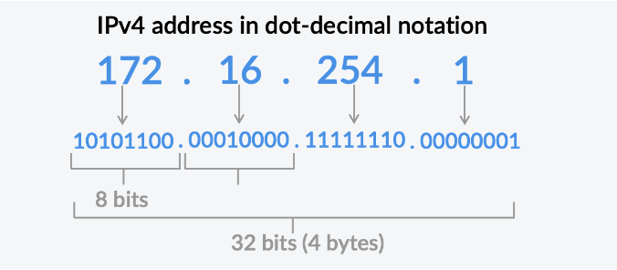  


**IPv6 **stands for internet protocol version 6 and is a successor to IPv4. It consists of 128 bits; thus, there can be many more IPv6 addresses than IPv4. Because of this, every device can have a unique IPv6 address as opposed to IPv4, where addresses need to be reused.  An example of IPv6 address is:

  
  


   
TCP/IP distinguishes IP addresses into two types:  
* **Public IP addresses** and  
* **Private IP addresses**.  
   
Public IP addresses can be accessed directly via the internet and are assigned to the personal network router by the internet service provider (ISP). They are used for communicating to the internet outside the personal network.  
   
Private addresses are a range of IP addresses used to form private networks. An example of a private network is the home wifi network. Each device within the same network is assigned a unique private IP address, and if an instrument within a private network sends a packet to a private address, this packet never leaves the private network. Private IP addresses allow devices connected to the same private network to communicate with each other without connecting to the entire internet.  
   
The key difference between private and public IP addresses is what they are connected to. You can connect to the wider internet using the public IP address, but private IP addresses allow you to connect securely to other devices within the same private network.   
   
There are millions of private networks across the world, all of which contain devices assigned private IP addresses within the following range:  
* **Class A**: 10.0.0.0 — 10.255.255.255  
* **Class B**: 172.16.0.0 — 172.31.255.255   
* **Class C**: 192.168.0.0 — 192.168.255.255  
   
Private IP addresses are unique in a particular private network, but two private IP addresses can be the same if they are in different private networks. The public addresses range includes all numbers not reserved for private IP addresses. They are unique in nature.  
   
In order to connect a private network to a public network, **gateways** are required. A gateway is a device that is capable of forwarding packets from a device within a private network to the internet. An example of the gateway is the home wifi router.  
   
Data centers use the TCP/IP protocol to form private networks, where servers and other equipment communicate through IP packets. In addition, TCP/IP connects the data center servers to the internet, and it is possible to connect to one of the servers in the data center remotely.  
   
Cloud data centers use TCP/IP to  
* **Form private networks**, where servers communicate with each other and  
* **Connect** its servers to the **internet**.  
   
In the previous segments, you learned that cloud computing is the delivery of computing resources over the internet. Connecting to one of the physical servers in a data center via the internet is an example of accessing cloud computing resources over the internet. When a physical server is completely dedicated to a particular user, it is known as a **bare-metal server**.  
   
A bare-metal server is not suitable for multi-tenant scenarios, where multiple users share the same physical resources. In order to share the physical resources of a data center among multiple users, another technology is required, called **virtualization**.  
  
In the video, you learned about the virtualization technology, which enables multiple operating systems to run on the same hardware. Virtualization technology allows abstracting physical resources from a hardware layer and creating virtual machines. You also explored the virtualization architecture in the video and compared it with traditional architecture. The architecture followed in typical laptops is traditional architecture, whereas some cloud service providers use virtualization architecture to run multiple virtual machines on a single hardware. You can use virtualization to pack and run multiple operating systems and application stacks on the samea \hardware. Each stack behaves like a physical computer and is known as a **virtual machine**. The virtualization layer enables the decoupling of hardware and operating system, thus removing the one-to-one mapping of the operating system and hardware. The hardware on which the virtualization layer runs is called the **host machine**, and each virtual machine is called a **guest machine**.  
   
Virtual machines offer many benefits, including the following:  
* **Efficient use of resources**, as a physical server can be shared so that it is not underused.  
* **Improved resource management**; VMs can be configured, created, and removed automatically.  
* **Fast provisioning**; VMs can be provisioned quickly to users.  
* **Reduced downtime**; multiple copies of the same VM can run in parallel.
  
* 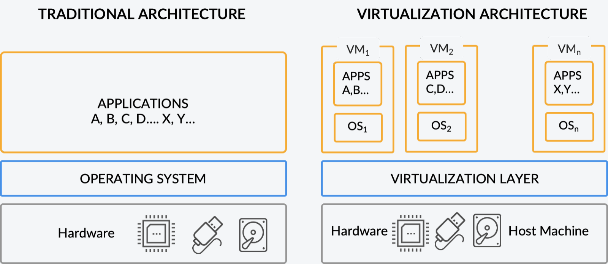  
  
  
VMs run on software known as the **hypervisor** that interacts with the underlying physical resources and assigns a fraction of the physical memory, computing power, network, and storage to each VM, enabling secure isolation. The hypervisor divides the capacity of the hardware components and assigns it to each virtual machine. Thus, a virtual machine is a complete computer with its virtual hardware.  
   
There are two types of hypervisors:  
* **Bare-metal** or **Type-1** and  
* **Hosted** or **Type-2**.   

**Bare-metal hypervisors** are installed directly on the hardware of a physical machine and are between the hardware and the operating system (OS). The term bare-metal refers to the fact that there is no operating system between the virtualization software and the hardware.
  
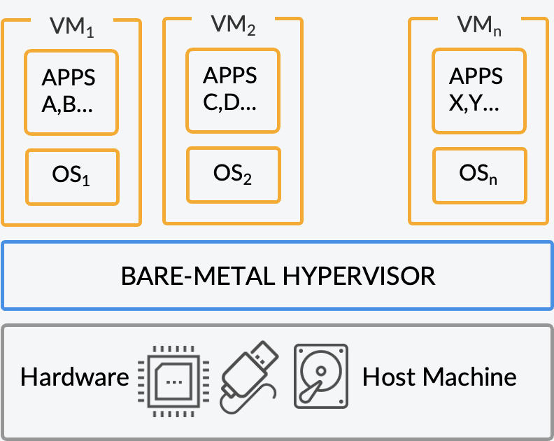  
  
Examples of bare-metal hypervisors include  
* VMWare's ESXi,  
* Microsoft's Hyper V, and  
* Xen Hypervisor.  
The bare-metal hypervisor resides on the hardware and enables it to run multiple virtual machines on top of it. But, is there a way to create this virtual environment if you are working on a typical machine, where the operating system resides directly on the hardware? Yes, and this is where the type 2 hypervisor comes into the picture. Let’s quickly learn about it from Vinod.  
  
While the bare-metal hypervisors run directly on the hardware, the **hosted hypervisor** runs as software within an operating system of a host machine. It uses the resources of the operating system to access the hardware. As the virtual machines created on the hosted hypervisor cannot access the hardware directly without accessing the host operating system, their performance gets limited by the performance of the host operating system. Thus, a hosted hypervisor is a bit slower than a bare-metal hypervisor. One of the advantages of hosted hypervisors is that it enables the faster creation of virtual machines compared to bare-metal instances.

  
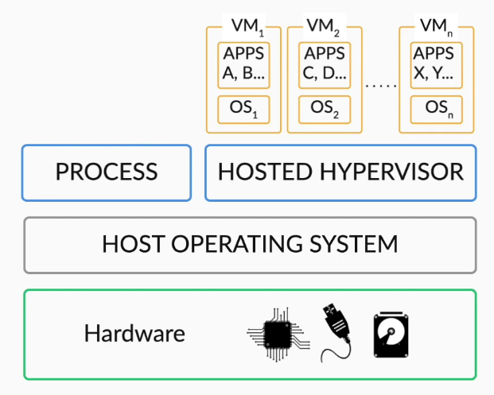  

   
Examples of hosted hypervisor include  
* Oracle Virtual Box and  
* VMWare Workstation.  
As the bare-metal hypervisor is independent of the host operating system, they are more preferred for enterprise applications and cloud computing.  
## 
 Containers

   
Using virtualization, you can deploy applications on multiple virtual machines. Even though you require only a few specific resources to run the application, you need to load the entire operating system into a virtual machine and then deploy the application.  

Containers provide an alternative, **lightweight virtualization model** consisting of images that encapsulate applications with other dependencies, such as software libraries and environment variables, but do not include an operating system. This is faster than creating a virtual machine and deploying an application. Let’s learn more about it through an example.  
  
  
  
Now, you must have understood that while **virtual machines are hardware-level virtualization, containers are OS-based virtualization**. The operating system is virtualized here by sharing the OS kernel among containers. These containers are isolated from each other. Each container loads only the libraries required to run an application.
The container engine resides in the host operating system and is responsible for sharing the OS kernel among containers.
  
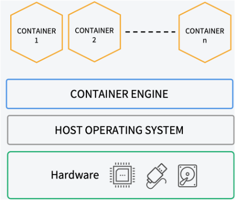  

   
Some of the differences between virtualization and containerization are:  

| Virtualization | Containerization |
| ------------------------------------------------------------------------------------------------------------------------------------------------------- | ---------------------------------------------------------------------------------------------------------------------------------------------------- |
| It is hardware-level virtualization. | It is operating system-level virtualization. |
| It loads the complete OS for an application to run. | It loads only the required libraries for an application to run. |
| It is heavier than containers, as it loads the complete operating system for deploying an application. The size of a virtual machine is usually in GBs. | It is lighter than virtual machines, as it loads only the required libraries for deploying an application. The size of containers is usually in MBs. |
| As virtual machines are heavier than containers, launching a new virtual machine is slower. | As containers are lighter than virtual machines, launching a new container is faster. |
  

  
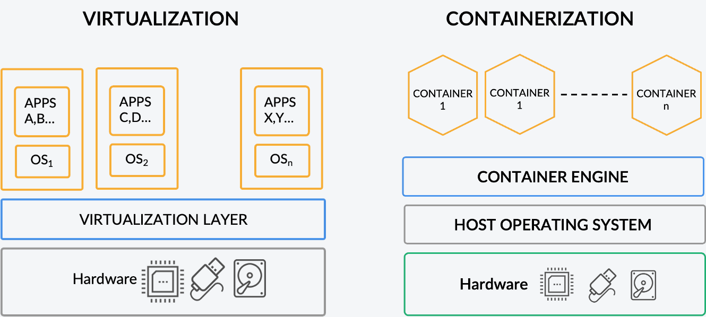  
  
  
  
**Cloud-based Architecture**  
Cloud architecture is a combination of different technologies that are brought together to create the cloud, which provides shared scalable resources across a network.  
Cloud architecture has the following two components:  
* **Front End:** This is the client or end-user. It consists of all the applications and interfaces that are used by clients to access cloud resources.  
* **Back End:** It is the cloud itself, as it consists of  infrastructure such as databases, computing resources, deployment models, etc. that are required to build the cloud   
Both the **front end and back end are connected** to each other through a network, usually the **Internet**.   
   
The following image illustrates the schematic structure of a cloud-based architecture.
  
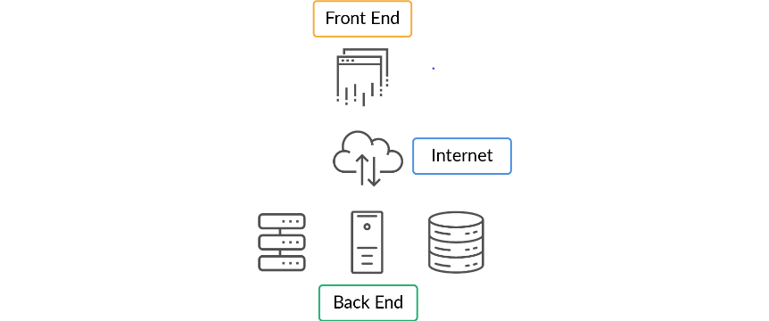  

et's summarise the cloud deployment models you just learnt in the above video.

  
**Cloud Deployment Models**  
The following are the three major types of cloud deployment models available.  
  
**1. Private Cloud:** In a private cloud, cloud resources are solely operated for a single organisation. The cloud is either managed by the organisation itself or by a third party and is hosted internally or externally.  
* These are some of the private cloud providers:  
    * IBM  
    * Oracle  
    * Vmware  
    * Hewlett Packard Enterprise (HPE)  
Here are some of the advantages and disadvantages of a private cloud:
**Advantages:**  
* It provides high security and also restricts access only to authorised users. Hence, this kind of infrastructure is generally preferred in financial institutions like banks, insurance firms, etc.  
* It provides high control over the resources.  
**Disadvantages:**  
* It is not cost-effective when compared with a public cloud.  
* It has limited scalability and can be scaled only up to the internal hosted resources.  
   
  
**2. Public Cloud:** In a public cloud, cloud resources are owned and operated by a third party. The services are provided to the users through the Internet. The cloud service provider is solely responsible for maintaining the resources.  
* Following are some of the major public cloud service providers:  
    * Google Cloud Platform  
    * Microsoft Azure  
    * Amazon Web Services  
Here are some of the advantages and disadvantages of a public cloud.
**Advantages:**  
* It is highly scalable. It offers flexibility to either scale up or scale down the usage of resources as per the demand or based on a user’s request.  
* It is also cost-effective. Users of a public cloud have to pay for only what they use.  
**Disadvantages:**  
* A public cloud might have security issues.  
* It is not 100% customisable as per an organisation’s requirements.  
   
  
**3. Hybrid Cloud:** Hybrid cloud is a combination of public and private clouds, and allows organisations to share data between them.   
* It can be a combination of:  
    * At least one private cloud and at least one public cloud,  
    * Two or more private clouds, or  
    * Two or more public clouds.  
  
The clouds chosen for the development of hybrid clouds should be able to connect multiple computers through a single network. These clouds should also be able to move workloads between one environment to the other. The ordered or consistent connections between separate clouds make it a hybrid cloud. Usually, the performance of a hybrid cloud is dependent on the development and management of its connections. The linking of public and private clouds is done using complex networks of LANs, APIs, VPNs, etc.  
Several cloud providers give their customers preconfigured connections. For Example:  
* Dedicated Interconnect by Google Cloud  
* Direct Connect by AWS, and  
* ExpressRoute by Microsoft Azure.  
Here are some of the advantages and disadvantages of a hybrid cloud:
**Advantages:**  
* A private cloud is secure, and hence, a hybrid cloud is secure as well.  
* Scalability: you already know that the public cloud is scalable. Therefore, the hybrid cloud which is the combination of public and private cloud is also scalable.  
* Users can access both the private and the public cloud as per their requirements; thus, a hybrid cloud offers flexibility.  
* Public cloud is cost-effective, hence hybrid cloud is also cost-effective if the user wants to use the public cloud properties.  
**Disadvantages:**  
* Complex networking problems: Due to the complexity of having the public and the private cloud, there would be an issue in configuring the network.  
* Organisation’s security compliance: Both the public and the private cloud should comply with the organisation’s security norms, and it is not easy to set up the clouds to meet this requirement.  
   
**Community Cloud**  
  
When different cloud services are integrated into a single cloud to meet the specific needs of an industry, community or business sector, the cloud is known as the community cloud.  
  
The infrastructure of the community cloud is shared between organisations that have common concerns or interests. Industries such as healthcare, media, etc. opt for community clouds.  
Here are some of the advantages and disadvantages of a community cloud:
**Advantages:**  
* The cost of maintenance can be shared among the organisations in the community.  
* It is more secure than a public cloud and less expensive than a private cloud.  
**Disadvantages:**  
* It is difficult to distribute the responsibilities among the organisations in a community.  
* It is difficult to segregate the data among the organisations in a community.  

**Multi-Cloud Strategy**  
A multi-cloud strategy is when an organisation uses multiple public and private clouds by different providers. This is adopted in order to avoid lock-in with a single vendor and to make use of the best services provided by these cloud providers. Note that this is different from Hybrid Cloud as here, the purpose of this strategy is to not lock-in with a single service provider whereas you can implement Hybrid Cloud using the services of the same service provider.  

**Additional Reading**  
* ++[Private Cloud](https://searchcloudcomputing.techtarget.com/definition/private-cloud)++ -  A detailed article about the private cloud and its differences with public and hybrid clouds.  
* ++[Features of Public Cloud](https://www.cloudways.com/blog/what-is-public-cloud/)++ - This article highlights the features provided by a public cloud.  
* ++[Benefits of Hybrid Cloud](https://www.iseek.com.au/cloud/7-benefits-of-a-hybrid-cloud-solution/)++ - This article explains in detail the benefits of using hybrid cloud solutions.  
  
  
**Cloud Service Models**  
On-demand cloud services are of mainly three types:  
**1. Infrastructure as a Service (IaaS**): These services are a set of compute, storage and network  that are virtualised by cloud providers so that users can access and configure resources according to their needs. With IaaS, a user can rent IT infrastructure.  
* Common examples of IaaS are as follows:  
    * AWS EC2  
    * Google Compute Engine (GCE)  
    * Digital Ocean  
Here are some of the **advantages** of Infrastructure as a Service:  
* The service provider provides the infrastructure, and the user has to just install an operating system of their requirements and work on it.  
* The user can modify the architecture as per their requirements since it is basic cloud infrastructure.  
* The user has full control over all the computing resources.  
   
**2. Platform as a Service (PaaS):** These are cloud services that provide an on-demand environment for developing and managing a software application. PaaS can be used to build, run and manage application programming interfaces (APIs).  
* The following are some of the common examples of PaaS:  
    * Windows Azure  
    * OpenShift  
    * AWS Elastic Beanstalk.  
Here are some of the advantages and disadvantages of PaaS:
**Advantages:**  
* Prebuilt platform: PaaS provides an already built platform for users to build and run their applications.  
* It is a simple model to use and deploy applications.  
* Low cost: Since the platform is already built, the user needs to create only their applications. This reduces the costs related to hardware and software.  
**Disadvantages:**  
* Migration issues: Migrating the user applications from one PaaS vendor to another might raise some issues.  
* Platform restrictions: The platforms provided by some vendors may have certain restrictions, for instance, the user can use only certain specified languages.  
   
**3. Software as a Service (SaaS)**: These are cloud services that provide the user with a complete software application over the Internet. All the infrastructure, application tools, data, etc. are located at data centres managed by the service providers.   
* Some of the examples of SaaS are as follows:   
    * Google Apps  
    * Salesforce  
    * Dropbox.  
* There are two modes of SaaS:  
    * **Simple Multi-Tenancy**: Each user has independent resources that are different from the resources of other users.  
    * **Fine Grain Multi-Tenancy**: Resources are shared by several users but the functionality of these resources remains the same.  
Here are some of the advantages and disadvantages of SaaS:
**Advantages:**  
* Ease of access: Users can access the applications on the server from anywhere using any Internet-connected device. Most types of internet-connected devices can access SaaS applications.  
* Low maintenance: Users need not update an application. The application is on the server, and it is the service provider’s responsibility to maintain the application.  
* Quick setup: Users do not require any hardware to install the application. The SaaS application is already present on the cloud.  
**Disadvantages:**  
* Lack of control: Users do not have control over the SaaS applications. Only the vendor has full control of SaaS applications.   
* Connectivity issue: The applications can only be accessed only via the Internet. Hence, if there is no Internet, then the users cannot access the applications.  
   
The image illustrates the components of the  different cloud service models:
  
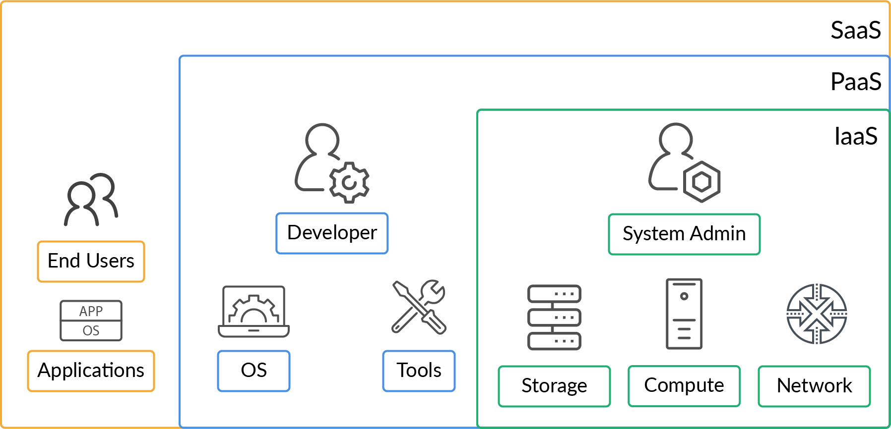  

   
You may refer to the content in the previous segment for more information on the various modes of deployment and a detailed explanation on service models.  

**Additional Reading**  
* ++[Infrastructure as a Service](https://www.ibm.com/cloud/learn/iaas#toc-what-is-a-k7Ng%20cdh)++ -  A very detailed explanation of infrastructure as a service model.  
* ++[Platform as a Service](https://www.ibm.com/cloud/learn/paas)++ - A very detailed explanation of platform as a service model.  
* ++[Comparison between the Service Models](https://www.bigcommerce.com/blog/saas-vs-paas-vs-iaas/#the-three-types-of-cloud-computing-service-models-explained)++ - Highlights the differences between the service models i.e.IaaS, PaaS and SaaS.  
  
  
**ession Summary**

   
With that, you have come to the end of this session. Let's summarize the key learnings.  
   
* First, you learned that cloud computing is the **delivery of computing resources over the internet**. It is possible due to several technologies, including **data centers**, the **internet**, and **virtualization**. You also learned about the benefits of cloud over on-premises setup.  
* Next, you learned more about the data centers. Data centers consist of thousands of servers, storage devices, and network equipment. The three main elements in a data center are  
    * **Core components** for storage, processing, distributing, and accessing data.  
    * **Support infrastructure** to ensure IT operations run uninterruptedly.   
    * **Operations staff **for monitoring, maintaining, and troubleshooting the data center.
  
    * 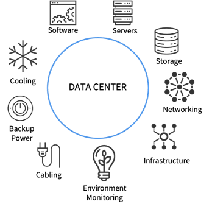  
    * 
   
* Then, you learned about the **internet**, which is a **global computer network consisting of billions of devices (end devices) connected by communication links and communication devices**. The main internet protocols are **TCP/IP **(transmission control protocol/internet protocol). TCP/IP dictates that every connected end device should have an address, known as **IP address**. There are two types of IP addresses  
    * **IPv4** (32 bits long) and  
    * **IPv6 **(128 bits long).  
* TCP/IP distinguishes IP addresses into two types:  
    * **Public IP addresses** and  
    * **Private IP addresses**.  
* Cloud data centers use TCP/IP to  
    * Form **private networks** where servers communicate with each other.  
    * **Connect **its servers to the **internet**.  
* After that, you understood another fundamental technology, i.e., virtualization, which made cloud computing possible. You learned the difference between the traditional and the virtualization architecture.
  
* 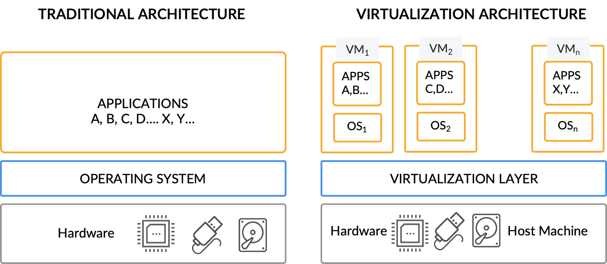  
* 
   
* You also learned about the types of hypervisors:  
    * Bare-metal or Type-1 and  
    * Hosted or Type-2.  
* Finally, you learned about containerization and also explored its architecture. You also understood how containerization is different from virtualization.
  
* 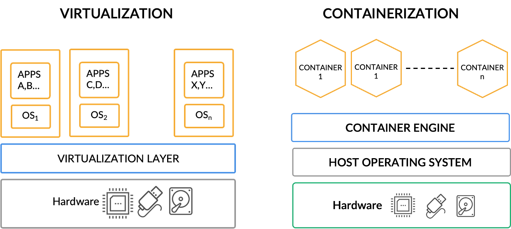  
* 

 
You learnt about cloud architecture and its different components. You also learnt about the main types of cloud deployment models: private, public, hybrid, community cloud and the muti-cloud strategy.
 
Finally, you learnt about cloud services and the benefits that they offer to users and organisations. The three cloud service models are Infrastructure as a Service (IaaS), Platform as a Service (PaaS) and Software as a Service (SaaS).

  
*   
* 


**Additional Resources:**
++[What is virtualization](https://www.redhat.com/en/topics/virtualization/what-is-virtualization)++
++[Hypervisors](https://phoenixnap.com/kb/what-is-hypervisor-type-1-2)++
++[Virtual Machines vs Containers](https://www.vmware.com/topics/glossary/content/vms-vs-containers.html)++
++[Real-world cloud computing examples](https://www.maropost.com/blog/5-real-world-examples-of-cloud-computing/)++
++[Open-source Cloud Platforms](https://computingforgeeks.com/top-open-source-cloud-platforms-and-solutions)++  
  
  
  
  
Docker  
  
  
  
  
  
  
  
  
  
  
  
  
  
  
  
  
  
  
  
  
  
  
  
  
  
  
  
  
