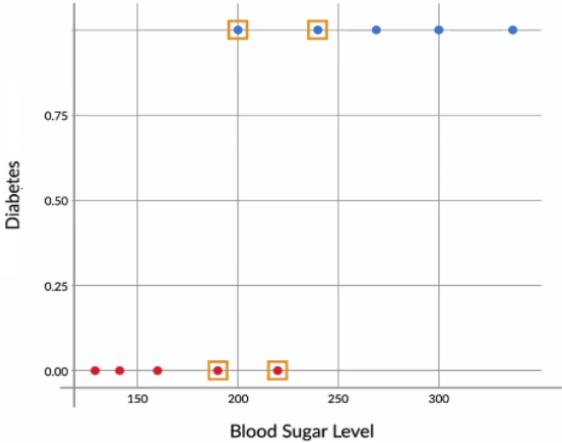
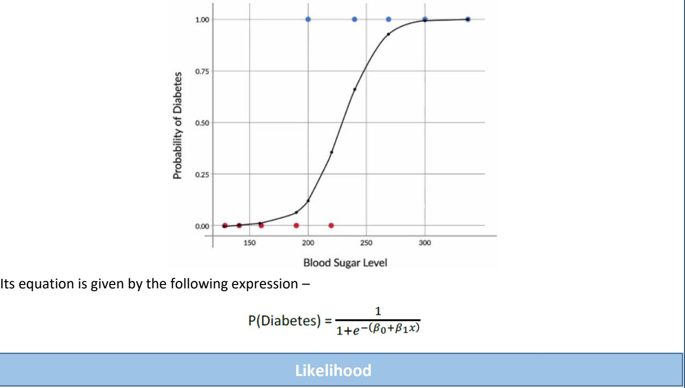
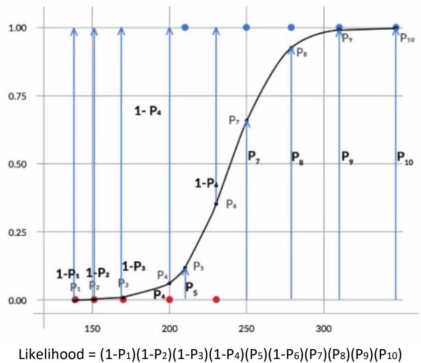
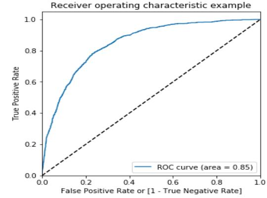
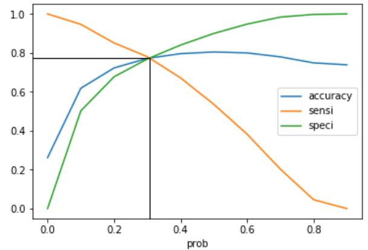
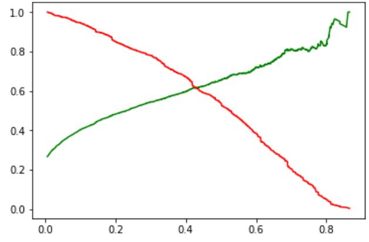
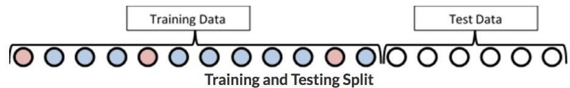
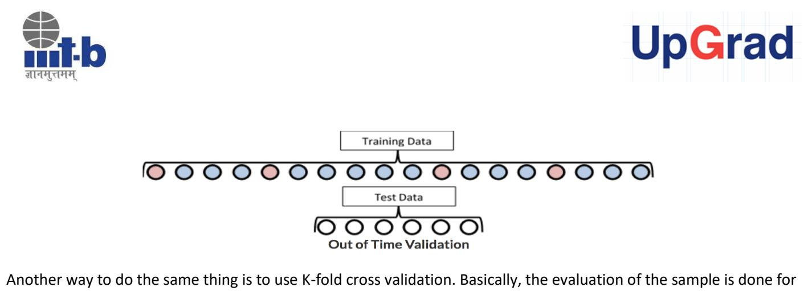

# Lecture Notes

# Logistic Regression

In the last module, you learnt Linear Regression, which is a supervised regression model. In other words, linear regression allows you to make predictions from labelled data, if the target (output) variable is numeric.

Hence, in this module, you moved to the next step, i.e., Logistic Regression. Logistic Regression is a supervised classification model. It allows you to make predictions from labelled data, if the target (output) variable is categorical.

# Binary Classification

You first learnt what a **binary classification** is. Basically, it is a classification problem in which the target variable has only 2 possible values, or in other words, two classes. Some examples of binary classification are –

- 1. A bank wants to predict, based on some variables, whether a particular customer will default on a loan or not
- 2. A factory manager wants to predict, based on some variables, whether a particular machine will break down in the next month or not
- 3. Google's backend wants to predict, based on some variables, whether an incoming email is spam or not

You then saw an example which was discussed in detail, which is the **diabetes example**. Basically, in this example, you try to predict whether a person has diabetes or not, based on that person's blood sugar level.

You saw why a simple boundary decision approach does not work very well for this example. It would be too risky to decide the class blatantly on the basis of cutoff, as especially in the middle, the patients could basically belong to any class, diabetic or non-diabetic.




 Hence, you learnt it is better, actually to talk in terms of **probability**. One such curve which can model the probability of diabetes very well, is the **sigmoid curve**.



The next step, just like linear regression, would be to find the **best fit curve**. Hence, you learnt that in order to find the best fit sigmoid curve, you need to vary β0 and β1 until you get the combination of beta values that maximises the **likelihood**. For the diabetes example, likelihood is given by the expression –




Generally, it is the product of -

```
[(1-Pi)(1-Pi) ------ for all non-diabetics --------] X [(Pi)(Pi) -------- for all diabetics -------]
```
This process, where you vary the betas, until you find the best fit curve for probability of diabetes, is called **logistic regression**.

# **Odds and Log Odds**

Then, you saw a simpler way of interpreting the equation for logistic regression. You saw that the following **linearized** equation is much easier to interpret –

$$\ln\left(\frac{P}{1-P}\right) = \beta\_0 + \beta\_1 x$$

The left-hand side of this equation is what is called **log odds**. Basically, the **odds** of having diabetes (P/1-P), indicate how much more likely a person is to have diabetes than to not have it. For example, a person for whom the odds of having diabetes are equal to 3, is 3 times more likely to have diabetes than to not have it. In other words, P(Diabetes) = 3\*P(No diabetes).

Also, you saw how odds vary with variation in x. Basically, with every linear increase in x, the increase in odds is **multiplicative**. For example, in the diabetes case, after every increase of 11.5 in the value of x, the odds get approximately doubled, i.e., increase by a multiplicative factor of around 2.

Multivariate Logistic Regression (Telecom Churn Example)

In this session, you learnt how to build a multivariate logistic regression model in R. The equation for **multivariate logistic regression** is basically just an extension of the univariate equation –

$$\mathbb{P} = \frac{1}{\mathbf{1} + e^{-(\beta\_0 + \beta\_1 \times\_1 + \beta\_2 \times\_2 + \beta\_3 \times\_3 + \cdots)}}$$

The example used for building the multivariate model in R, was the **Telecom Churn Example**. Basically, you learnt how R can be used to decide the probability of a customer churning, based on the value of 21 predictor variables, like monthly charges, paperless billing, etc.

# Multivariate Logistic Regression (Model Building)

The example used for building the multivariate model in Python was the **telecom churn example**. Basically, you learnt how Python can be used to decide the probability of a customer churning based on the value of 21 predictor variables such as monthly charges, paperless billing, etc.

First, the data was imported, which was present in 3 separate csv files. After creating a merged master data set, one that contains all 21 variables, **data preparation** was done, which involved the following steps:

- 1. Missing value imputation
- 2. Outlier treatment
- 3. Dummy variable creation for categorical variables


- 4. Test-train split of the data
- 5. Standardisation of the scales of continuous variables

After all of this was done, a logistic regression model was built in Python using the function **GLM()** under statsmodel library. This model contained all the variables, some of which had insignificant coefficients. Hence, some of these variables were removed first based on an automated approach, i.e. RFE and then a manual approach based on the VIFs and p-values.

The following code in statsmodels was used to build the logistic regression model.

Model Evaluation: Accuracy, Sensitivity, and Specificity

You first learnt what a confusion matrix is. It was basically a matrix showing the number of all the actual and predicted labels. It looked something like:

| Actual/Predicted   Not Churn   Churn |      |     |
|--------------------------------------|------|-----|
| Not Churn                            | 3269 | 366 |
| Churn                                | 595  | 692 |

From the confusion matrix, you can see that the correctly predicted labels are present in the first row, first column and the last row, last column. Hence, we defined accuracy as –

For your model, you got an accuracy of about 80% which seemed good but you relooked at the confusion matrix, and saw that there were a lot of misclassifications going on. Hence, we brought in two new metrics, i.e. **Sensitivity** and **Specificity**. They were defined as follows:


#### The you saw that the different elements in the confusion matrix can be labelled as follows –

| Actual/Predicted   Not Churn |                                  | Churn |
|------------------------------|----------------------------------|-------|
| Not Churn                    | True Negatives   False Positives |       |
| Churn                        | False Negatives   True Positives |       |

Hence, you rewrote the sensitivity and specificity formulas as –

 $Sensitivity = \frac{TP}{TP + FN}$ 

$$Specificity = \frac{TN}{TN + FP}$$

You found out that your specificity was good (~89%) but your sensitivity was only 53%. Hence, this needed to be taken care of.

#### ROC Curve

You had gotten sensitivity of 53% and this was mainly because of the cut-off point of 0.5 that you had arbitrarily chosen. Now, this cut-off point had to be optimised in order to get a decent value of sensitivity and in came the ROC curve. You first saw what the True Positive Rate (TPR) and the False Positive Rate (FPR) were. They were defined as follows –

When you plotted the true positive rate against the false positive rate, you got a graph which showed the trade-off between them and this curve is known as the ROC curve. The following curve is what you plotted for your case study.




The more this curve is towards the upper-left corner, the more is the area under the curve (AUC) and the better is your model. And when the curve is more towards the 45-degree diagonal, the worse is your model.

Then you also plotted the accuracy, sensitivity, and specificity and got the following curve.



From this, you concluded that the optimal cut-off for the model was around 0.3 and you chose this value to be your threshold and got decent values of all the three metrics – Accuracy (~77%), Sensitivity (~78%), and Specificity (~77%).

## Model Evaluation: Precision and Recall

You also learnt about precision and recall which was another pair of industry-relevant metric used to evaluate the performance of a logistic regression module. They were defined as –

$$Precision = \frac{TP}{TP + FP}$$

$$Recall = \frac{TP}{TP + FN}$$

And similar to what you did for sensitivity and specificity, you also plotted a trade-off curve between precision and recall.




After playing around with the metrics, and choosing a cut-off point of 0.3, you went ahead and made predictions on the test set and got decent values there as well. So, you decided this to be your final model.

#### Sample Selection for Logistic Regression

Selecting the right sample is essential for solving any business problem. As discussed in the lecture, there are major errors you should be on the lookout for, while selecting a sample. These include:

- **Cyclical or seasonal fluctuations** in the business that need to be taken care of while building the samples. E.g. Diwali sales, economic ups and downs etc.
- The sample should be **representative of the population** on which the model will be applied in the future.
- For **rare events samples**, the sample should be balanced before they are used for modelling.

### Segmentation

It is very helpful to perform **segmentation** of population before building a model.

Let's talk about the ICICI example. For students and salaried people, different variables may be important. While students' defaulting and not defaulting will depend on factors like program enrolled for, the prestige of the university attended, parents' income etc., the probability of salaried people will depend on factors like marital status, income etc. So, the predictive pattern across these two segments is very different, and hence, it would make more sense to make different child models for both of them, than to make one parent model.

A **segmentation** that divides your population into male and female may not be that effective, as the predictive pattern would not be that different for these two segments.

### Variable Transformation

There are several approaches for transforming independent variables. Few of them were:

- Dummy Variable Transformation
- Weight of Evidence(WOE TRANSFORMATION)
- Continuous Variables Transformation
- Interaction Variables
- Splines
- Mathematical Transformation
- Principal Component Transformation

## **DUMMY VARIABLE TRANSFORMATION**

You already know that **categorical variables** must be transformed into **dummies**. Also, you were told that numeric variables must be standardised, so that they all have the same scale. However, you could also convert **numeric variables** into **dummy** variables


 There are some **pros and cons of transforming variables** to dummies. Creating dummies for categorical variables is very straightforward. You can directly create **n-1 new variables** from an existing categorical variable if it has **n levels**. But **for continuous variables**, you would be required to do some kind of EDA analysis for binning the variables.

The **major advantage** offered by dummies especially for continuous variables is that they make the **model stable**. In other words, small variations in the variables would not have a very big impact on a model that was made using dummies, but they would still have a sizeable impact on a model built using continuous variables as is.

On the other side, there are some major **disadvantages** that exist. E.g. if you change the continuous variable to dummies, all the data will be **compressed** into **very few categories** and that might result in **data clumping**.

## **WOE TRANSFORMATION**

Three are **three important** things about **WOE**:

- Calculating woe values for fine binning and coarse binning
- Importance of woe for fine binning and coarse binning
- Usage of woe transformation

There are two main advantages of **WOE**:

WOE reflects group identity, this means it captures the general trend of distribution of good and bad customers. E.g. the difference between customers with 30% credit card utilisation and 45% credit card utilisation is not the same as the difference between customers with 45% credit card utilisation and customers with 60% credit card utilisation. This is captured by transforming the variable credit card utilisation using WOE.

Secondly, WOE helps you in treating missing values logically for both types of variables - categorical and continuous. E.g. in the credit card case, if you replace the continuous variable credit card utilisation with WOE values, you would replace all categories mentioned above (0%-45%, 45% - 60%, etc.) with certain specific values, and that would include the category "missing" as well, which would also be replaced with a WOE value.

WOE can be calculated using the following **equation**:

$$WOE = \ln\left(\frac{good\ in\ the\ bucket}{Total\ Good}\right) - \ln\left(\frac{bad\ in\ the\ bucket}{Total\ bad}\right)$$

Or it can also be expressed as follows:

$$WOE = \ln(\frac{Percentage\ of\ Good}{Percentage\ of\ Bad})$$

Once you've calculated woe values, it is also important to note that they should follow an increasing or **decreasing trend** across bins. If the trend is not **monotonic**, then you would need to compress the buckets/ bins(coarse buckets) of that variable and then **calculate woe values again**.

Woe transformation does have **pros and cons** as well, which are quite similar to dummy variables.


- • **Pros**: Model becomes more stable because small changes in the continuous variables will not impact the input so much.
- **Cons**: You may end up doing some score clumping.

This is because when you are using WOE values in your model, you are doing something similar to creating dummy variables - you are replacing a range of values with an indicative variable. It is just that instead of replacing it with a simple 1 or 0, which was not thought out at all, you are replacing it with a well thought out WOE value. Hence, the chances of undesired score clumping will be a lot less here.

Let's now move on to **IV (Information Value),** which is a very important concept. So, **information value** can be calculated using the following expression:

Or it can be expressed as:

It is an important indicator of **predictive power**.

Mainly, it helps you understand how the binning of variables should be done. The binning should be done such that the WOE trend across bins is monotonic - either increasing all the time or decreasing all the time. But one more thing that needs to be taken care of, is that IV (information value) should be high.

As there are so many other transformations, we can perform but they are not as important as discussed above.

Model Validation

Model can be validated on:

- In-sample validation
- Out-time validation
- K-fold cross validation

Recall Telecom business problem, The data used to build the model was from 2014. You split the original data into two parts, training and test data. However, these two parts were both with data from 2014.



This is called **in-sample validation**. Testing your model on this test data may not be enough though, as test data is too similar to training data.

So, it makes sense to actually test the model on data that is from some other time, like 2016. This is called, **out of time validation.**



Basically, there are 3 iterations in which evaluation is done. In the first iteration, 1/3rd of the data is selected as training data and the remaining 2/3rd of it is selected as testing data. In the next iteration, a different 1/3rd of the data is selected as the training data set and then the model is built and evaluated. Similarly, the third iteration is completed.

Such an approach is necessary if the data you have for model building is very small, i.e., has very few data points.

If these three methods of validation are still unclear to you, you need not worry as of now. They will be covered at length **in Course 4 (Predictive Analytics II).**

## Model Stability

Obviously, a good model will be stable. A model is considered stable if it has:

k-iterations. E.g. here's a representation of how 3-fold cross validation works:

- **Performance Stability**  Results of in-sample validation approximately match those of out-of-time validation
- **Variable Stability**  Sample used for model building hasn't changed too much and has the same general characteristics

Again, if stability is still a little cloudy, you need not worry. It will also be covered at length in Course 4 (Predictive Analytics II)


**Disclaimer**: All content and material on the UpGrad website is copyrighted material, either belonging to UpGrad or its bonafide contributors and is purely for the dissemination of education. You are permitted to access print and download extracts from this site purely for your own education only and on the following basis:

- You can download this document from the website for self-use only.
- Any copies of this document, in part or full, saved to disc or to any other storage medium may only be used for subsequent, self-viewing purposes or to print an individual extract or copy for non-commercial personal use only.
- Any further dissemination, distribution, reproduction, copying of the content of the document herein or the uploading thereof on other websites or use of content for any other commercial/unauthorized purposes in any way which could infringe the intellectual property rights of UpGrad or its contributors, is strictly prohibited.
- No graphics, images or photographs from any accompanying text in this document will be used separately for unauthorised purposes.
- No material in this document will be modified, adapted or altered in any way.
- No part of this document or UpGrad content may be reproduced or stored in any other web site or included in any public or private electronic retrieval system or service without UpGrad's prior written permission.
- Any rights not expressly granted in these terms are reserved.