## Session 1&2 : Introduction to PCA & Fundamentals of PCA: I

**Principal component analysis** (PCA) is one of the most commonly used dimensionality reduction techniques in the industry. By converting large data sets into smaller ones containing fewer variables, it helps in improving model performance, visualising complex data sets, and in many more areas.

# Why PCA?

Let's take some situations to understand the purpose of PCA.

## **Situation 1: Build a Predictive Model**

Problem:

- 1. A lot of Variables
- 2. Correlated Variable (leads to Multicollineraity problem)

Solution: Variable/Feature Selection

- 1. Manual feature Selection
  - a. Build a model
  - b. Drop less useful variables(high p-value)
  - c. Drop redundant variable (high VIF)
  - d. Rebuild the model and repeat
- 2. Automated Feature Selection.Use methods like:
  - a. RFE
  - b. forward/backward/stepwise selection based on AIC
  - c. Lasso regularisation etc.
- 3. But lost some information in the process.

Iteratively removing features is time-consuming and also leads to some information loss. So PCA is considered a better way.

#### **Situation 2: Data Visualisation**


Problem: A lot of variables to visualise and explore Solution:

1. Pairwise scatter plot or pair plot. If we have 10 variable then we would have 10C2 = 45 plots to visualise

It is not possible to visualise more than two variables at the same time using any 2-D plot. Therefore, finding relationships between the observations in a data set having several variables through visualisation is quite difficult. So, the better way is PCA.

## **Major Application of PCA:**

1. Dimensionality reduction: Fundamentally, PCA is a dimensionality reduction technique, i.e., it approximates the original data set to a smaller one containing fewer dimensions. To understand it visually, take a look at the following image.

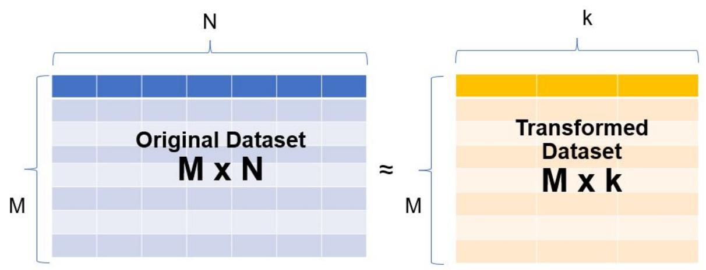

A data set having N dimensions has been approximated to a smaller data set containing 'k' dimensions.

Example: MNIST data set, used for number recognition has data in the pixel till 784


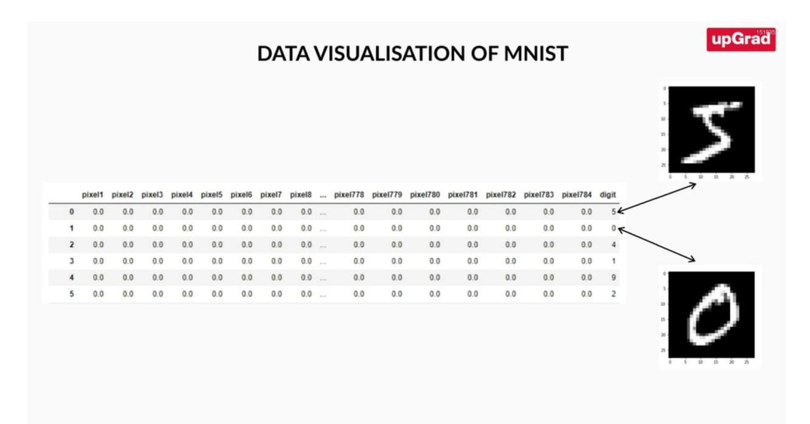

When we plot it using PCA, it is as follows:

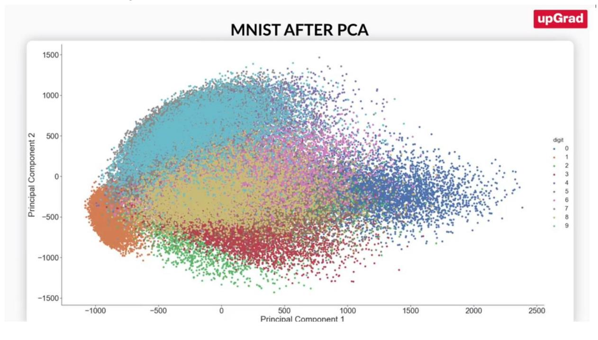

- 2. Data Visualisation and EDA


- 3. For creating uncorrelated features that can be input to a prediction model: With a smaller number of uncorrelated features, the modelling process is faster and more stable as well.
- 4. Finding latent themes in the data: If you have a data set containing the ratings given to different movies by Netflix users, PCA would be able to find latent themes like genre and, consequently, the ratings that users give to a particular genre.
- 5. Noise reduction: one way to visualise it to noise is some random patterns deviated from general patterns in data. Using PCA and removing useless information, when we reconstruct the image there is little noise

# What of PCA

PCA is fundamentally a **dimensionality reduction technique**; it helps in manipulating a data set to one with fewer variables.

In simple terms, dimensionality reduction is the exercise of dropping the unnecessary variables, i.e., the ones that add no useful information. Now, this is something that you must have done in the previous modules. In EDA, you dropped columns that had a lot of nulls or duplicate values, and so on. In linear and logistic regression, you dropped columns based on their p-values and VIF scores in the feature elimination step.

Similarly, what PCA does is that it converts the data **by creating new features from old ones**, where it becomes easier to decide which features to consider and which not to.

**Definition**: PCA is a statistical procedure to convert observations of possibly correlated variables to 'principal components' such that:

- They are **uncorrelated** with each other.
- They are **linear combinations** of the original variables.
- They help in capturing maximum **information** in the data set.

Now, the aforementioned definition introduces some new terms, such as '**linear combinations**' and '**capturing maximum information**', for which you will need some knowledge of linear algebra concepts as well as other building blocks of PCA.

# Vectorial Representation of Data

In order to understand the workings of PCA, it is crucial to understand some essential linear algebra concepts, such as matrices, vectors and their associated operations. A checklist of linear algebra stuff that you should be knowing before foraying into PCA:

● Vectors and their properties


- Vector operations (addition, scaling, linear combination and dot product)
- Matrices
- Matrix operations (matrix multiplication and matrix inverses

Consider the following data set containing the height and weight of five patients:

| Patient ID     | Height (cm) | Weight (kg) |
|----------------|-------------|-------------|
| P <sub>1</sub> | 165         | 55          |
| P <sub>2</sub> | 155         | 71          |
| P3             | 165         | 88          |
| P <sub>4</sub> | 160         | 105         |
| P <sub>5</sub> | 160         | 94          |

| 165 | 55  |
|-----|-----|
| 155 | 71  |
| 165 | 88  |
| 160 | 105 |
| 160 |     |

The height and weight information can be represented in the form of a matrix with each row representing a particular patient's data and each column representing the original variable. Geometrically, these patients can be represented as shown in the following image:

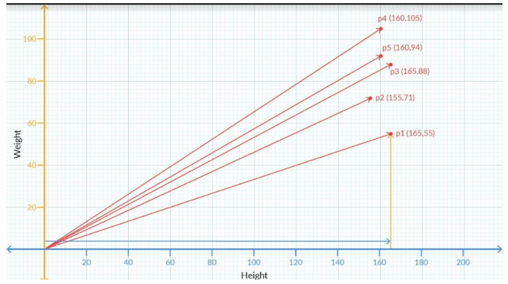


The vector associated with the first patient is given by the values (165, 55). This value can also be written in the following way:

1. A column containing the values along the rows. This is also known as the column-vector representation.

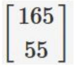

2. As a transpose of the above form. Essentially, it is the same column vector but now written as a transpose of a row vector.

[165 55] **T**

[Note: Transpose is something you must have learnt in your Python for DS module. If you need some brushing up on this topic, you can take a look at this [link](https://pandas.pydata.org/pandas-docs/stable/reference/api/pandas.DataFrame.transpose.html)]

3. In terms of the basis vectors, The vector (165,55) can also be written as 165**i** +55**j**, where **i** and **j** are the unit vectors along X and Y respectively and are the basis vectors used to represent all vectors in the 2-D space.

## Vector Representation for n-dimensional data

Each vector will contain values representing all the dimensions or variables in the data. For example, if there was an age variable also included in the above dataset and the first patient had an age of 22 years, then the vector representing him would be written as (165, 55, 22). Similarly, if the dataset had 10 variables, there would be 10 dimensions in the vector representation. Similarly, you can extend it for n dimensions or variables.

# Vector Operations

**1. Vectors have a direction and magnitude**

Each vector has a direction and magnitude associated with it. The direction is given by an arrow starting from the origin and pointing towards the vector's position. The magnitude is given by taking a sum of squares of all the coordinates of that vector and then taking its square root.


For example, the vector (2,3) has the direction given by the arrow joining (0,0) and (2,3) pointing towards (2,3). Its magnitude is given by √(2 <sup>2</sup>+3 2 ) =√13.

Similarly, for a vector in 3 dimensions, say (2,-3,4) its direction is given by the arrow joining (0,0,0) and (2,-3,4) pointing towards (2,-3,4). And as in the 2D case, we get the magnitude of this vector as

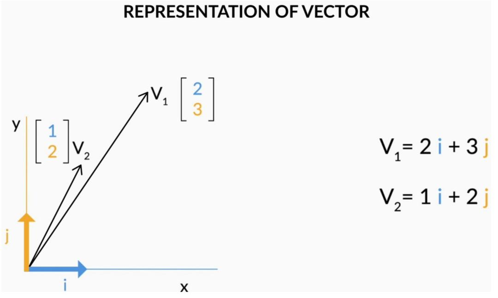

#### 2. **Vector Addition**

When you add two or more vectors, we essentially add their corresponding values element-wise. The first element of both the vectors get added, the second element of the both get added and so on.

For example, if you've two vectors say V1=(2,3) and V2=(1,2) then V1+V<sup>2</sup> = (2+1,3+2) = (3,5).


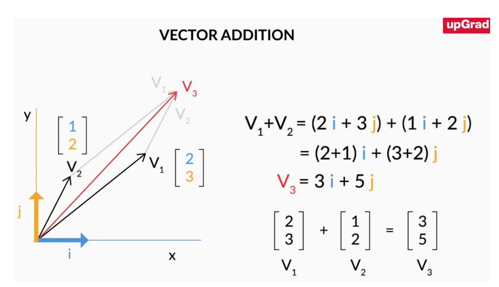

3. In the **i, j** notations that we introduced earlier, the above addition can be written as V1+V<sup>2</sup> = (2i+3j) + (i+2j) = (2+1)i + (1+2)j=3i+5j

Similarly, this idea can be extended to multiple dimensions as well.

## 4. **Scalar Multiplication**

If you multiply any real number or scalar by a vector, then there is a change in the magnitude of the vector and the direction remains same or turns completely opposite depending on whether the value is positive or negative respectively.

## Matrix Multiplication

The process of matrix multiplication is quite simple, and it involves the element-wise multiplication followed by addition of all the elements present in it. The one key rule that it must satisfy is when you multiply 2 matrices, say A and B, the number of columns of A must equal the number of rows in B. Visually, you can take a look at the following image to get the idea of how that should be:

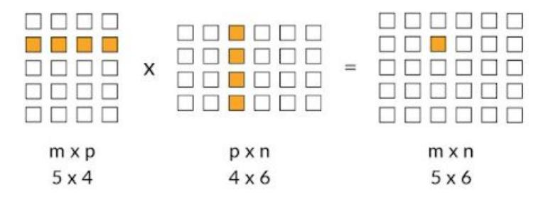


As shown in the example, since the number of columns in the first matrix and the number of rows in the second column are equal to 4, matrix multiplication is possible and the resultant matrix has a shape of 5 x 6.

The element-wise multiplication followed by addition is also pretty straightforward as can be seen in the following example:

$$
\begin{bmatrix} 2 & 3 \\ 4 & 5 \end{bmatrix} \begin{bmatrix} 1 \\ 2 \end{bmatrix} = \begin{bmatrix} (2 \times 1) + (3 \times 2) \\ (4 \times 1) + (5 \times 2) \end{bmatrix} = \begin{bmatrix} 8 \\ 14 \end{bmatrix}
$$

## **Matrix multiplication in Python:**

We use the '@' operator. We have to keep in mind while using this operator is that number of columns of A should be equal to the number of rows in B.

## **Inverse of a Matrix**

To understand what the inverse of a matrix is, let's take a look at the following example:

Let's say you have 2 matrices A and B such that A= and B =

If you multiply B with A like this: B x A = you get the following result-

The matrix that you got after the multiplication above is also known as an **Identity matrix**. In matrix notation, it serves the same function as that of the number 1 in the real number system. To establish an analogy, in the real number system if you multiply any number by 1, you get the number itself. Similarly, when you multiply any matrix with the identity matrix, also denoted by I, you get the same matrix once again.


Now taking the analogy of the real number system, when you multiply 2 numbers a and b and it comes out to be 1, i.e.

a×b=1

then a and b are called reciprocal of each other.

In the matrix world, if you have two matrices A and B, and their multiplication results in the identity matrix I, i.e.

#### B x A = I,

then A and B are called **inverses** of each other.

The inverse of A is also written as A −1 . Therefore B = A −1 . Note that **A −1A = I = A A −1** . In Python, we use numpy function linalg.inv() to calculate the inverse of matrix:

## Basis

The first fundamental building block of PCA is **Basis.** Essentially, 'basis' is a unit in which we express the vectors of a matrix. For example, we describe the weight of an object in terms of the kilogram, gram and so on; to describe length, we use a metre, centimetre, etc. So for example, when you say that an object has a length of 23 cm, what you are essentially saying is that the object's length is 23×1 cm. Here, 1 cm is the unit in which you are expressing the length of the object.

Similarly, vectors in any dimensional space or matrix can be represented as a linear combination of basis vectors.

Since i and j themselves represent **(1,0)** and **(0,1)**, you can represent any vector in the 2-D space with these i and j vectors.

Any vector **'a'** (ax , ay ) can be represented in a 2-D space, using the following notation:

$$
a = a_x i + a_y j
$$
  
or  
$$
a = a_x \cdot \begin{bmatrix} 1 \\ 0 \end{bmatrix} + a_y \cdot \begin{bmatrix} 0 \\ 1 \end{bmatrix}
$$

Visually, it can be represented as follows:


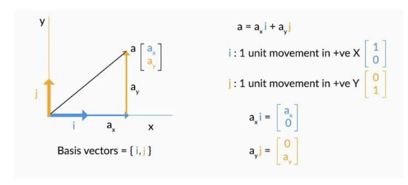

For example, a vector A (2,3) can be written as 2⋅ +3⋅ .

In order to obtain the vector A, we scaled **i** by 2 and **j** by 3 and then finally added them up. This scaling and adding the vectors up to obtain a new vector is also known as a **linear combination**.

For the patients' dataset that we had earlier, we can denote each patient vector by the following notation:

|  |  | $\begin{bmatrix} 165 \\ 55 \end{bmatrix}$ = 165 $\begin{bmatrix} 1 \text{ cm} \\ 0 \text{ kg} \end{bmatrix}$ + 55 $\begin{bmatrix} 0 \text{ cm} \\ 1 \text{ kg} \end{bmatrix}$ |
|--|--|--------------------------------------------------------------------------------------------------------------------------------------------------------------------------------|

Therefore, now we can say that Patient 1 is represented by 165(1 cm,0) + 55(0,1kg). And similarly, we can express other patients' information as well.

The **basic definition** of basis vectors is that they're a certain set of vectors whose linear combination is able to explain any other vector in that space.

In a 2D space, the standard basis vectors are given by and . In a 3D space, the same is

given by and . As you can see, an n-dimensional space or a dataset having n variables would have n standard basis vectors.


# Change of Basis: Introduction

Let's go ahead and understand how you can use different basis to explain the same set of vectors, similar to how you can use different units to explain the same measure.

Using the analogy of basis as a unit of representation, different basis vectors can be used to represent the same observations, just like you can represent the weight of a patient in kilograms or pounds. As in the previous case, the basis vectors for the representation of the patient's

information is given by 
$$
\begin{bmatrix} 1ft \\ 0lbs \end{bmatrix}
$$
 and  $\begin{bmatrix} 0ft \\ 1lbs \end{bmatrix}$ 

The following table summarises the results you get when you make the change.

| Patient ID     | Height (cm) | Weight (kg)                              |
|----------------|-------------|------------------------------------------|
|                | 165         | 55                                       |
| p2             | 155         | 71                                       |
| p <sub>3</sub> | 165         | !!!!!!!!!!!!!!!!!!!!!!!!!!!!!!!!!!!!!!!! |
| p4             | 160         | 105                                      |
| p5             | 160         |                                          |

| Patient ID     | Height (ft) | Weight (lbs) |
|----------------|-------------|--------------|
| p1             | 5.4         | 121.3        |
| p <sub>2</sub> | 5.1         | 156.5        |
| p3             | 5.4         | 194.0        |
| p4             | 5.2         | 231.5        |
| p <sub>5</sub> | 5.2         | 207.2        |

As you can see, the patient's height and weight have not changed physically. It's just that you're

using a different set of basis vectors now to explain the same patients. So is the same

as when different basis vectors are being used.

## **Relationship between the two sets of basis vectors**

To understand the relationship between the two basis vectors in concrete terms, recall the way we introduced it in the previous segment. We said that every vector in the 2D space can be written as a linear combination of the basis vectors.


So Patient 1's information in the cm/kg space is given by whereas in the ft/lbs space is given by Now, 1 ft = 30.48 cm and 1 cm = 0.033 ft Similarly, 1 kg = 2.205 lbs and 1lbs = 0.454 kg. Therefore, comparing the basis vectors, we can say

Here's a neat manipulation that you can do to understand the way the numbers arrange amongst themselves using the linear combination property.

$$
\begin{bmatrix} 165 \\ 55 \end{bmatrix} = 165 \begin{bmatrix} 1 \\ 0 \end{bmatrix} + 55 \begin{bmatrix} 0 \\ 1 \end{bmatrix} = 5.4 \begin{bmatrix} 30.48 \\ 0 \end{bmatrix} + 121.3 \begin{bmatrix} 0 \\ 0.45 \end{bmatrix}
$$
 in the cm/kg space.  
In the above case, we considered the new basis vectors as  $\begin{bmatrix} 30.48 \\ 0 \end{bmatrix}$  and  $\begin{bmatrix} 0 \\ 0.45 \end{bmatrix}$  in the cm/kg space which is equivalent to (1,0) and (0,1) in the ft/lbs space. And using this, we got the

representation of for the patient.

Therefore, we can choose a completely different set of vectors, say **v1** and **v2** as the basis vectors and find the representation of Patient 1 (originally in the standard basis vectors) in the new basis system. They should be satisfying the following linear combination equation.

$$
\left[ \frac{165}{55} \right] = a_1 \cdot v_1 + a_2 \cdot v_2
$$

where (a<sup>1</sup> ,a<sup>2</sup> ) is the representation of Patient 1 in the v1 and v2 space. To understand better,

and

$$
\quad \text{and} \quad
$$


Taking 
$$
v_1 = \begin{bmatrix} 30.48 \\ 0 \end{bmatrix}
$$
 and  $v_2 = \begin{bmatrix} 0 \\ 0.45 \end{bmatrix}$  we got  $a_1 = 5.4$  and  $a_2 = 121.3$   
\nSimilarly, taking  $v_1 = \begin{bmatrix} 55 \\ 0 \end{bmatrix}$  and  $v_2 = \begin{bmatrix} 0 \\ 55 \end{bmatrix}$  we get  $a_1 = 3$  and  $a_2 = 1$   
\nAgain, taking  $v_1 = \begin{bmatrix} 3 \\ 1 \end{bmatrix}$  and  $v_2 = \begin{bmatrix} 2 \\ 0 \end{bmatrix}$  we get  $a_1 = 55$  and  $a_2 = 0$   
\nand so on.

As we can see in the above example where we considered v1=[3 1] <sup>T</sup> and v2=[2 0] T , the new basis need not be parallel to the original basis.

Simply put, you have the flexibility of choosing a different set of basis vectors apart from the standard basis vectors that are provided to you to represent your information. The information won't change, just the numbers representing the information would change.

# Change of Basis: Demonstration

Suppose you make a list of places for your friend to visit on a Roadmap on 2-D cartesian, with 2 directions North and east where x-direction is East and y-direction is North. Every single point on the map is represented by 2 dimensions, for example, Factory can be (10, 8) as 10 units East and 8 units North. For successive movements, like from Hospital to Housing Society, it will be 3 unit North, 4 unit east.


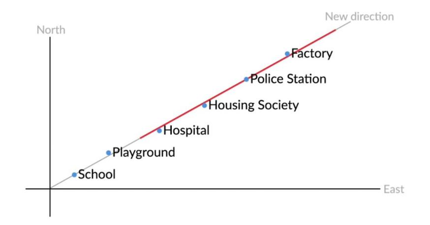

Now, your friend sees all the points are on a single line and can be represented in this new direction without north or east like Hospital to Housing Society is 5 units in the new direction.

So, with this new direction, we have reduced the dimensions from 2 to 1 without losing information. This is PCA, better representation was in a new direction, so by dimension reduction, we changed the basis.

# Change of Basis: Calculations

When you have one dimension, the calculations for the change of basis are pretty straightforward. All you need to do here is to multiply the factor M which gives you the method of transforming from one basis to another.

| New basis<br>$=Mx$ | Old basis         |
|--------------------|-------------------|
| Represention       | Representation    |
| (f <sup>t</sup> )  | (c <sub>m</sub> ) |

And to go in the opposite direction you simply have to divide by that factor M. Note that here M is a simple scalar since there is only one dimension involved.


When more than one dimensions are involved, M becomes a matrix rather than a simple scalar. In this case, the first equation remains the same, just that here M is a matrix instead of a scalar.

For example, to change the (ft, lbs) to (cms, kgs):

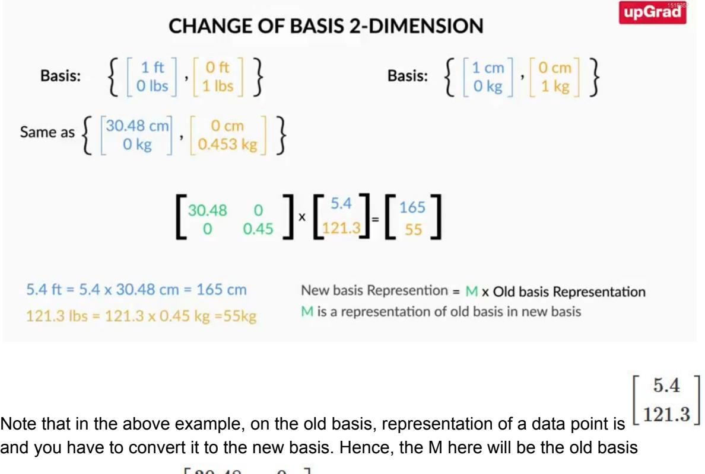

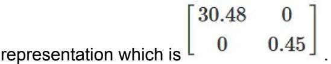


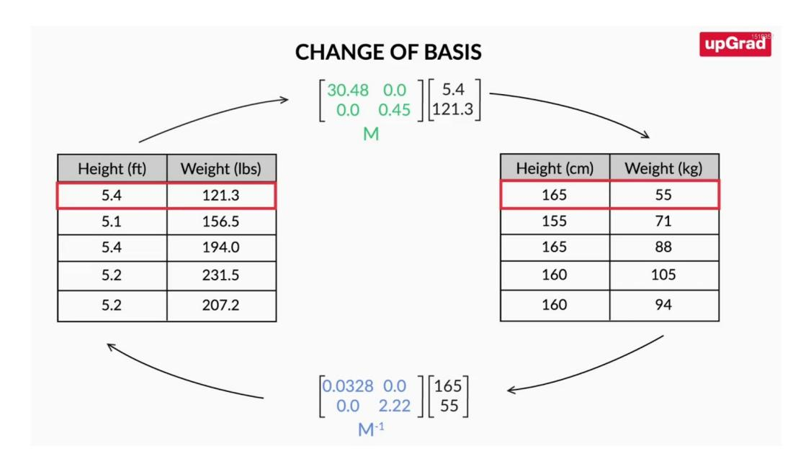

The original matrix gets inversed when we want to go the other way around. Therefore, the equation remains the same in both the cases, but here the M−1 would mean the inverse of the matrix rather than a simple reciprocal.

So to summarise,

M= which is the matrix that shows the change of basis from ft/lbs to cm/kgs and M−1= which shows the changes from cm/kgs to ft/lbs

## **Calculating M**

We obtained the following relationship

$$
B_1 \ast v_1 = B_2 \ast v_2
$$

When we move between basis vectors B1 and B2 with representations as v1 and v2 respectively.


This gives us the value of M as

$$
M=B_2^{-1}\ast B_1
$$

And finally the transformation is given as

$$
v_2=M*v_1
$$

## Session 3: Fundamentals of PCA: II

# Variance

$$
\sigma^2 = \frac{\Sigma(x-\mu)^2}{N}
$$

The questions we answer are:

- How to find the basis?
- What properties should it satisfy to help with dimensionality reduction?

PCA gauges the importance of a column by another metric called 'variance' or how varied a column's values are. For example if an image has all similar pixel values then no information can be drawn from it, but if there is a variation of pixel values in the image, then the data has a qualitative value.

- Significance:
  - For columns or features which show less variance, it is easier to remove those columns and do dimensionality reduction.
- Problem:
  - When variance of more than 1 features is similar.
- Solution:
  - Pick some other direction/basis vectors such that it captures maximum variance.


#### **The ideal basis vectors required has the following properties**:

- They explain the directions of maximum variance
- When used as the new set of basis vectors, the transformed dataset is now suitable for dimensionality reduction.
- These directions explaining the maximum variance are called the **Principal Components** of our data.

These basis vectors or directions that capture the maximum variance are essentially the Principal Components for the dataset.

## Session 4: PCA in Python

# Introduction

You have now discovered and learnt the theoretical concepts of PCA. In this session, you will learn how to implement PCA in python with some real examples.

Now you will learn how to use PCA on a problem you have already encountered before - predicting telecom churn using logistic regression. You will now learn to implement PCA in tandem with logistic regression. Learn how to use PCA in python, then will see how it helps us in visualizing data, reducing dimensionality, creating uncorrelated features and finally how to improve model speed and performance.

# Applying PCA using Python

For this demonstration, we begin with a very popular machine learning dataset - **'Iris'**. Then, you will learn the necessary steps needed to perform PCA on a dataset and then appreciate how it helps in visualizing your data that contains more than two dimensions.

# Importing the required libraries

import numpy as np, pandas as pd


# Extracting data from Iris.csv to parameter data and head() command show the first 5 value of data

#### data = pd.read\_csv("Iris.csv")

#### data.head()

|                | sepal length |     | sepal width petal length petal width |     | iris        |
|----------------|--------------|-----|--------------------------------------|-----|-------------|
| $\bf o$        | 5.1          | 3.5 | 1.4                                  | 0.2 | Iris-setosa |
| 1              | 4.9          | 3.0 | 1.4                                  | 0.2 | Iris-setosa |
| $\overline{2}$ | 4.7          | 3.2 | 1.3                                  | 0.2 | Iris-setosa |
| з              | 4.6          | 3.1 | 1.5                                  | 0.2 | Iris-setosa |
|                | 5.0          | 3.6 | 1.4                                  | 0.2 | Iris-setosa |

# Since we are doing unsupervised learning, we don't need classifying data i.e. iris, so we will remove species value.

y = data.pop("iris")

data.head()

|                |     | sepal length sepal width | petal length petal width |     |
|----------------|-----|--------------------------|--------------------------|-----|
| O              | 5.1 | 3.5                      | 1.4                      | 0.2 |
| 1              | 4.9 | 3.0                      | 1.4                      | 0.2 |
| $\overline{2}$ | 4.7 | 3.2                      | 1.3                      | 0.2 |
| 3              | 4.6 | 3.1                      | 1.5                      | 0.2 |
| 4              | 5.0 | 3.6                      | 1.4                      | 0.2 |

# Now we will look at statistical data of each parameter.

#### data.describe()


|       | sepal length | sepal width | petal length | petal width |
|-------|--------------|-------------|--------------|-------------|
| count | 150.000000   | 150.000000  | 150.000000   | 150.000000  |
| mean  | 5.843333     | 3.054000    | 3.758667     | 1.198667    |
| std   | 0.828066     | 0.433594    | 1.764420     | 0.763161    |
| min   | 4.300000     | 2.000000    | 1.000000     | 0.100000    |
| 25%   | 5.100000     | 2.800000    | 1.600000     | 0.300000    |
| 50%   | 5.800000     | 3.000000    | 4.350000     | 1.300000    |
| 75%   | 6.400000     | 3.300000    | 5.100000     | 1.800000    |
| max   | 7.900000     | 4.400000    | 6.900000     | 2.500000    |

We can see that each data have different range of value which will result into wrong estimation and hence we need to Scale our data.

```
# Scaling the data
```

from sklearn.preprocessing import StandardScaler

```
scaler = StandardScaler()
```

X = data.copy()

```
x = scaler.fit_transform(X)
```

X[:5,:5]

# Applying PCA after scaling the data

from sklearn.decomposition import PCA

pca = PCA(random\_state=42)


pca.fit(x)

Once we run PCA it takes all the data and do all the processing already discuss and return the principal component.

Quick Summary:

1. After basic data cleaning procedures, standardize your data

2. Once standardization has been done, you can go ahead and perform PCA on the dataset. For doing this you import the necessary libraries from **sklearn.decomposition.**

## **from sklearn.decomposition import** PCA

3. Instantiate the PCA function and set the random state to some specific number so that you get the same result every time you execute that code. (If you want to learn more about random state and how it works, you can check thi[s](https://stackoverflow.com/a/42197534) [StackOverflow](https://stackoverflow.com/a/42197534) answer)

pca = PCA(random\_state=**42**)

4. Perform PCA on the dataset by using the **pca.fit** function.

#### pca.fit(x)

The above function does both the steps: **finding the covariance matrix and doing an eigen decomposition of it to obtain the eigenvectors**, which are nothing but the **Principal Components** of the original dataset.

5. The Principal Components can be accessed using the following code

## pca.components\_

Executing the above code will give the list of Principal components of the original dataset. They'll be of the same number as the original variables in your dataset. In the next segment, you shall see how to choose the optimal number of principal components.

# Scree Plot

You now learnt how to perform PCA on your dataset and obtain the Principal Components. The final PCs that you got were as follows:


|                 | $array([ 0.52237162, -0.26335492,$ | 0.58125401, | $0.56561105$ ],               |
|-----------------|------------------------------------|-------------|-------------------------------|
| [0.37231836,    | 0.92555649,                        | 0.02109478, | $0.06541577$ ],               |
| $[-0.72101681,$ | 0.24203288,                        |             | $0.14089226, 0.6338014$ ,     |
| $[-0.26199559,$ | 0.12413481,                        |             | $0.80115427, -0.52354627$ ]]) |

PC1 is given by the direction - [0.52 -0.26 0.58 0.56], PC2 by [0.37 0.92 0.02 0.06] and so on. The principal components of the same number as that of the original variables with each Principal Component explaining some amount of variance of the entire dataset. This information would enable us to know which Principal Components to keep and which to discard to perform Dimensionality Reduction.

First, you came to know how much variance is being explained by each Principal Component using the following code

pca.explained\_variance\_ratio\_

The values that you will get are as follows:

array([**0.72770452**, **0.23030523**, **0.03683832**, **0.00515193**])

The above values can be summarized in the following table:

| Principal | Variance  |
|-----------|-----------|
|           | explained |
| Component |           |
|           | (in %)    |
|           |           |
| PC1       | 72.8      |
|           |           |
| PC2       | 23        |
|           |           |
| PC3       | 3.6       |
|           |           |
| PC4       | 0.5       |
|           |           |


So as you can see, the first PC, i.e. Principal Component 1([0.52 -0.26 0.58 0.56]) explains the maximum information in the dataset followed by PC2 at 23% and PC3 at 3.6%. In general, when you perform PCA, all the Principal Components are formed in decreasing order of the information that they explain. Therefore, the first principal component will always explain the highest variance, followed by the second principal component and so on. This order helps us in our dimensionality reduction exercise, as now we know which directions are more important than the others.

Now, in our dataset, we only had 4 columns and equivalently 4 PCs. Therefore it was easy to visualise the amount of variance explained by them using a simple bar plot and then we're able to make a call as to how much variance to keep in the data. For example, using the table above, you only need 2 principal components or 2 directions (PC1 and PC2) to explain more than 95% of the variation in the data.

But what happens when there are hundreds of columns? Using the above process would be cumbersome since you'd need to look at all the PCs and keep adding their variances up to find the total variance captured.

## Using a **Scree-Plot**

An elegant solution here would be to simply add plot a "Cumulative variance explained chart" Here against each number of components, we have the total variance explained by all the components till then.

| Principal | Variance Explained (in %) | Cumulative Variance Explained (in %) |
|-----------|---------------------------|--------------------------------------|
| Component |                           |                                      |
|           |                           |                                      |
| PC1       | 72.8                      | 72.8                                 |
|           |                           |                                      |
| PC2       | 23                        | 95.8                                 |
|           |                           |                                      |
| PC3       | 3.6                       | 99.4                                 |
|           |                           |                                      |


| PC4 | .5 | 99.9 |
|-----|----|------|
|     |    |      |

So, for example, cumulative variance explained by the top 2 principal components is the sum of their individual variances, given by 72.8 +23 =95.8 %. Similarly, you can continue this for 3 and 4 components.

If you plot the number of components on the X-axis and the total variance explained on the Y-axis, the resultant plot is also known as a Scree-Plot. It would look somewhat like this:

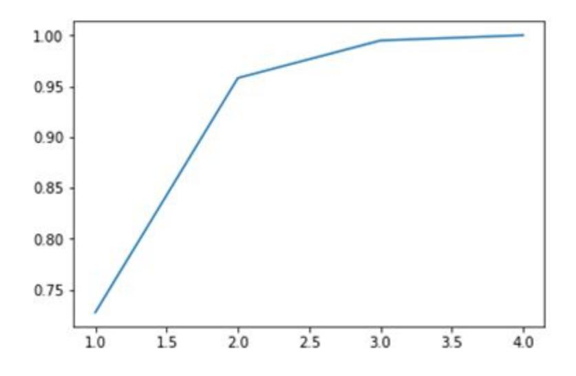

Now, this is a better representation of variance and the number of components needed to explain that much variance.

# Dimensionality Reduction

You understood how to apply PCA on a dataset followed by the importance of scree-plots. Now that you know how many principal components you need to explain a certain amount of variance, let's go and finally do dimensionality reduction on our dataset using the Principal Components that we've chosen.

1.) Choosing the required number of components

From the scree plot that you saw previously, you decided to keep ~95% of the information in the data that we have and for that, you need only 2 components. Hence you instantiate a new PCA


function with the number of components as 2. This function will perform the dimensionality reduction on our dataset and reduce the number of columns from 4 to 2.

pc2 = PCA(n\_components=**2**, random\_state=**42**)

2.) Perform **Dimensionality Reduction** on our dataset.

Now you simply transform the original dataset to the new one where the columns are given by the Principal Components. Here you've finally performed the dimensionality reduction on the dataset by reducing the number of columns from 4 to 2 and still retain 95% of the information. The code that you used to perform the same step is as follows:

newdata = pc2.fit\_transform(x)

and the new dataset is given as follows:

|          | PC <sub>1</sub>       | PC <sub>2</sub> |
|----------|-----------------------|-----------------|
| $\bf{0}$ | $-2.264542$           | 0.505704        |
| 1        | -2.086426 -0.655405   |                 |
|          | 2 -2.367950 -0.318477 |                 |
|          | 3 -2.304197 -0.575368 |                 |
|          | 4 -2.388777           | 0.674767        |

3) Data Visualization using the PCs

Now that you have got the data in 2 dimensions, it is easier for you to visualize the same using a scatterplot or some other chart. By plotting the observations that we have and dividing them on the basis of the species that they belong to we got the following chart:


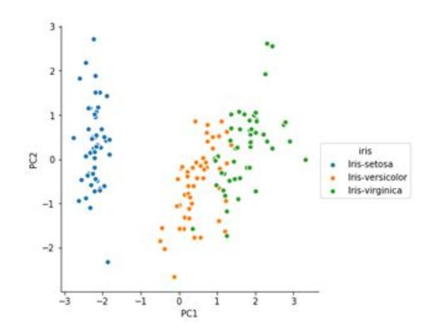

As you can see, you clearly see that all the species are well segregated from each other and there is little overlap between them. This is quite good as such insight was not possible with higher dimensions as you won't be able to plot them on a 2-D surface. So, therefore, applying PCA on our data is quite beneficial for observing the relationship between the data points quite elegantly.

**Important Note**: When you perform PCA on datasets generally, you may need more than 2 components to explain an adequate amount of variance in the data. In those cases, if you want to visualize the relationship between the observations, choose the top 2 Principal Components as your X and Y axes to plot a scatterplot or any such plot to do the same. Since PC1 and PC2 explain the most variance in the dataset, you'll be getting a good representation of the data when you visualize your dataset on those 2 columns.

# Improving Model Performance – I

You saw how to perform dimensionality reduction using PCA and then immediately were introduced to one of its key applications which is for data visualization. However, the most common application of PCA is to improve your model's performance. So, in real life, you use PCA in conjunction with any other model like Linear Regression, Logistic Regression, Clustering amongst others in order to make the process more efficient. In the following demonstration, you'll be looking at both the scenarios performing model building without PCA and then with PCA to appreciate how much faster it is to get similar or better results in the latter case.


You know the process of building a churn prediction model using logistic regression. Some important problems with this process are:

- **Multicollinearity** among a large number of variables, which is not totally avoided even after reducing variables using RFE (or a similar technique)
- Need to use a **lengthy iterative procedure**, i.e. identifying collinear variables, using variable selection techniques, dropping insignificant ones etc.
- A **potential loss of information** due to dropping variables
- **Model instability** due to multicollinearity

If you remember, we discussed all these points as potential issues that plague our model building activity. Now let's go ahead and perform PCA on the dataset and then apply Logistic Regression and see if we get any better results

## **Model Building with PCA**

First, we'll reduce the dimensions that we have using PCA and then create a logistic regression model on it.

You could achieve the same results with just a couple of lines of code. It will be helpful to note that the baseline PCA model has performed at par with the best Logistic Regression model built after the feature elimination and other steps.

PCA helped us solve the problem of multicollinearity (and thus model instability), loss of information due to the dropping of variables, and we don't need to use iterative feature selection procedures. Also, our model becomes much faster because it has to run on a smaller dataset. And even then, our ROC score, which is a key model performance metric is similar to what we achieved previously.

To sum it up, if you're doing any sort of modelling activity on a large dataset containing lots of variables, it is a good practice to perform PCA on that dataset first, reduce the dimensionality and then go ahead and create the model that you wanted to make in the first place. You are advised to perform PCA on the datasets that you worked on in Linear Regression and Clustering as well, to see how it makes our job easier.


# Improving Model Performance – II

Till now, you've been looking at the scree-plot to choose the number of components that explain a certain amount of variance before going for the dimensionality reduction using PCA. Now, there is a nice functionality which makes this process even more unsupervised. All you need to do is select the amount of variance that you want your final dataset to capture and PCA does the rest for you. Now what you can do is directly ask the algorithm to select a parameter based on the variance you want without doing all the long process we did earlier.

pca\_new = PCA(0.9)

Now if you look at the shape of training data after **fit\_transform,** the algorithm has already selected the parameter which gives 90% variance.

As you saw above, all you needed to do was select a particular amount of variance that you want to be explained by the Principal Components of the transformed dataset. PCA automatically chooses the appropriate number of components on its own and proceeds with the transformation. This again saves us a lot of time!

# Practical Considerations and Alternatives

Until now, you know the in and out of PCA and how to implement it in Python and hence, you should be aware when to apply PCA. Let's now look at some practical considerations that need to be kept in mind while applying PCA.

Those were some important points to remember while using PCA. To summaries:

- Most software packages use SVD to compute the principal components and assume that the data is **scaled and centered,** so it is important to do standardization/normalization.
- PCA is a **linear transformation method** and works well in tandem with linear models such as linear regression, logistic regression etc., though it can be used for computational efficiency with non-linear models as well.


● It should **not be used forcefully to reduce dimensionality** (when the features are not correlated).

You learnt some important shortcomings of PCA:

- PCA is limited to linearity, though we can use **non-linear techniques such as t-SNE** as well (you can read more about t-SNE in the optional reading material below).
- PCA needs the components to be perpendicular, though in some cases, that may not be the best solution. The alternative technique is to use **Independent Components Analysis.**
- PCA assumes that columns with low variance are not useful, which might not be true in prediction setups (especially classification problems with a high-class imbalance).

If you are interested in reading about t-SNE (t-Distributed Stochastic Neighbor Embedding) or ICA, you can go through the additional reading provided below.

## Summary

Here's a summary of what you've learnt so far.

First, you implemented PCA in python on the iris dataset. In that demonstration, you understood the basic steps that you need to follow in PCA - on how to perform PCA, find the Principal Components, choose a particular number of components using the scree-plot, transform your data and then visualize the data.

After that, you saw an implementation where you wanted to improve the model efficiency in a Logistic Regression Setup. Here you were able to see that with PCA, you're able to maintain the same level of efficiency without going through all the iterative feature elimination procedures. You also saw how to perform PCA faster by just giving it how much variance you need to be explained.

Here's a list of useful functions that use after importing the PCA function from sklearn libraries.

- **pca.fit()** Perform PCA on the dataset.
- **pca.components\_** Explains the principal components in the data


- **pca.explained\_variance\_ratio\_** Explains the variance explained by each component
- **pca.fit(n\_components = k)**  Perform PCA and choose only k components
- **pca.fit\_transform** Transform the data from original basis to PC basis.
- **pca(var) - Here** 'var' is a number between 0-1. Perform PCA on the dataset and choose the number of components automatically such that the variance explained is (100\*var) %.


Disclaimer: All content and material on the UpGrad website is copyrighted material, either belonging to UpGrad or its bonafide contributors and is purely for the dissemination of education. You are permitted to access print and download extracts from this site purely for your own education only and on the following basis:

- You can download this document from the website for self-use only.
- Any copies of this document, in part or full, saved to disc or to any other storage medium may only be used for subsequent, self-viewing purposes or to print an individual extract or copy for non-commercial personal use only.
- Any further dissemination, distribution, reproduction, copying of the content of the document herein or the uploading thereof on other websites or use of the content for any other commercial/unauthorized purposes in any way which could infringe the intellectual property rights of UpGrading its contributors, is strictly prohibited.
- No graphics, images or photographs from any accompanying text in this document will be used separately for unauthorised purposes.
- No material in this document will be modified, adapted or altered in any way.
- No part of this document or UpGrad content may be reproduced or stored in any other web site or included in any public or private electronic retrieval system or service without UpGrad's prior written permission.
- Any rights not expressly granted in these terms are reserved.