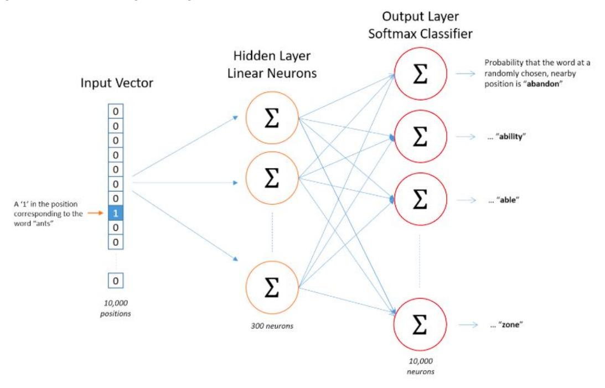
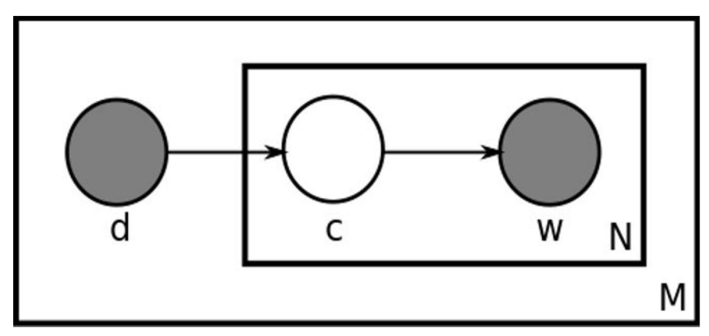

## **Semantic Processing**

In the module on semantic processing, you studied the following concepts:

- **Introduction to semantic text processing**: Defining meaning, understanding concepts, terms, entities, relations between entities etc.
- **Vector Semantics**: Representing words as vectors
- **Topic Modelling**: Identifying 'topics' being talked about in text

Let's now summarize each of these topics in this document.

### **Introduction to Semantic Processing**

### Concepts and Terms

Semantic processing is about understanding the meaning of a given piece of text. But what do we mean by 'understanding the meaning' of text?

To study semantics, we first need to establish a representation of 'meaning'. Though we often use the term 'meaning' quite casually, it is quite non-trivial to answer the question "What is the meaning of meaning, and how do you represent the meaning of a statement?"

Thus, the first step in semantic processing is to create a model to interpret the 'meaning' of text.

There are objects which exist but you cannot touch, see or hear them, such as independence, freedom, algebra and so on. But they still do exist and occur in natural language. We refer to these objects as 'concepts'. Terms act as *handles* to concepts and the notion of 'concepts' gives us a way to represent the 'meaning' of a given text.

But how do terms acquire certain concepts? It turns out that the context in which terms are frequently used make the term acquire a certain meaning. For example. the word 'bank' has different meanings in the phrases 'bank of a river' and 'a commercial bank' because the word happens to be used differently in these contexts.

### Entity and Entity Types

There are two other concepts that help in refining our representation of meaning further **entities** and **entity types**. **Entities** are instances of **entity types**. Multiple entity types can be grouped under a **concept.**

A system needs some kind of **mapping between entities and entity types**, i.e. it needs to understand that a Labrador is a dog, a mammal is an animal, a coach is a specific person etc.

This brings us to the concept of **associations** between entities and entity types. These associations are represented using the notion of **predicates**.

The notion of a **predicate** gives us a simple model to process the meaning of complex statements. For example, say you ask an artificial NLP system - "Did France win the football world cup final in 2018?". The statement can be broken down into a set of predicates, each returning True or False, such as win(France, final) = True, final(FIFA, 2018) = True.

A predicate is a function which takes in some parameters and returns True or False depending on the relationship between the parameters. For example, a predicate teacher\_teaches\_course(P = professor Srinath, C = text analytics) returns True.

### Arity and Reification

Consider that these three statements are true:

- Shyam supplies cotton to Vivek
- Vivek manufactures t-shirts
- Shyam supplies cotton which is used to manufacture t-shirts

Can you conclude that the following statement is also true - "Shyam supplies cotton to Vivek which he uses to manufacture t-shirts"?

You saw that predicates are assertions that take in some parameters, such as supplier\_manufacturer(Shyam, Vivek), and return True or False. But most real-world phenomena are much more complex to be represented by simple **binary predicates**, and so we need to use **higher-order** predicates (such as the **ternary predicate** supplier\_manufacturer\_product(Shyam, Vivek, t-shirts)).

Further, if a binary predicate is true, it is not necessary that a higher order predicate will also be true. This is captured by the notion of **arity of a predicate**. The higher order predicates (i.e. having a large number of entity types as parameters) are complex to deal with. We cannot simply break down complex sentences (i.e. higher order predicates) into multiple lower-order predicates and verify their truth by verifying the lower-order predicates individually.

To solve this problem, we use a concept called **reification.** Reification refers to combining multiple entity types to convert them into lower order predicates.

### Schema

We saw that we need a structure using which we can represent the meaning of sentences. One such schematic structure (used widely by search engines to index web pages) is **[schema.org](https://schema.org/docs/faq.html)**.

Schema.org is a joint effort by Google, Yahoo, Bing and Yandex (Russian search engine) to create a large schema relating the most commonly occurring entities on web pages. The main purpose of the schema is to ease search engine querying and improve search performance.

### Semantic Associations

You studied that entities have associations such as "a hotel has a price", "a hotel has a rating", "ginger is a plant" etc.

#### Aboutness

When machines are analysing text, we not only want to know the type of semantic associations 'is-a' and 'is-in' but also want to know what is the word or sentence 'about'.

To understand the 'aboutness' of a text basically means to identify the 'topics' being talked about in the text. What makes this problem hard is that the same word (e.g. China) can be used in multiple topics such as politics, the Olympic games, trading etc.

We also studied about the different kinds of relationship that exist between words.

- 1. **Hypernyms** and **hyponyms**: This shows the relationship between a generic term (hypernym) and a specific instance of it (hyponym). For example, the term 'Punjab National Bank' is a hyponym of the generic term 'bank'
- 2. **Antonyms**: Words that are opposite in meanings are said to be antonyms of each other. Example hot and cold, black and white etc.
- 3. **Meronyms** and **Holonyms**: A term 'A' is said to be a holonym of term 'B' if 'B is part of 'A' (while the term 'B' is said to be a meronym of the term 'A'). For example, an operating system is part of a computer. Here, 'computer' is the holonym of 'operating system' whereas 'operating system' is the meronym of 'computer.
- 4. **Synonyms**: Terms that have a similar meaning are synonyms to each other. For example, 'glad' and 'happy'.
- 5. **Homonymy** and **polysemy**: Words having different meanings but the same spelling and pronunciations are called homonyms. For example, the word 'bark' in 'dog's bark' is a

homonym to the word 'bark' in 'bark of a tree'. Polysemy is when a word has multiple (entirely different) meanings. For example, consider the word 'pupil'. It can either refer to students or eye pupil, depending upon the context in which it is used.

Consider the phrase - 'cake walk'. The meanings of the terms 'cake' and 'walk' are very different from the meaning of their combination. Such cases are said to violate the **principle of compositionality.**

### Databases - WordNet and ConceptNet

WordNet is a semantically oriented dictionary of English, similar to a traditional thesaurus but with a richer structure.

Another important resource for semantic processing is **ConceptNet** which deals specifically with assertions between concepts. For example, there is the concept of a "dog", and the concept of a "kennel". As a human, we know that a dog lives inside a kennel. ConceptNet records that assertion with /c/en/**dog** /r/**AtLocation** /c/en/**kennel**.

### Word Sense Disambiguation - Naive Bayes

Word sense disambiguation (WSD) is the task of identifying the correct sense of an ambiguous word such as 'bank', 'bark', 'pitch' etc.

**Supervised** techniques for word sense disambiguation require the input words to be tagged with their senses. The sense is the label assigned to the word. In **unsupervised** techniques, words are not tagged with their senses, which are to be inferred using other techniques.

One of the simplest text classification algorithms is the **Naive Bayes Classifier.**

### Word Sense Disambiguation - Lesk Algorithm

A popular unsupervised algorithm used for word sense disambiguation is the Lesk algorithm.

There are various ways in which you can use the lesk algorithm. One of the methods is - you just take the definitions corresponding to the different senses of the ambiguous word and see which definition overlaps maximum with the neighbouring words of the ambiguous word. The sense which has the maximum overlap with the surrounding words is then chosen as the 'correct sense'.

### Summary

Till now, you learnt about the basic ideas which are used to represent meaning - entities, entity types, arity, reification and various types of semantic associations that can exist between entities. You also studied the idea of aboutness - text is always about something, and there are techniques to infer the topics the text is about.

You also saw that associations between a wide range of entities are stored in a structured way in gigantic knowledge graphs or schemas such as schema.org.

You also learnt techniques that can be used to disambiguate the meaning of a word supervised and unsupervised. The 'correct' meaning of an ambiguous word depends upon the contextual words.

In supervised techniques, such as naive Bayes (or any classifier for that matter), you take the context-sense set as the training data. The label is the 'sense' and the input is the context words.

In unsupervised techniques, such as the lesk algorithm, you assign the definition to the ambiguous word which overlaps with the surrounding words maximally.

### **Distributional Semantics**

### Introduction to Distributional Semantics

'You shall know a word by the company it keeps'. - John Firth

The basic idea that we use to **quantify the similarity between words** is that words which occur in similar contexts are similar to each other. We need to represent words in a format which encapsulates its similarity with other words. For e.g. in such a representation of words, the terms 'greebel' and 'train' will be similar to each other.

The most commonly used representation of words is using '**word vectors'.** There are two broad techniques to represent words as vectors:

- The term-document **occurrence matrix**, where each row is a term in the vocabulary and each column is a document (such as a webpage, tweet, book etc.)
- The term-term **co-occurrence matrix**, where the ith row and jth column represents the occurrence of the ith word *in the context of* the jth word.

### Occurrence Matrix

The **occurrence matrix** is also called a **term-document matrix** since its rows and columns represent terms and documents/occurrence contexts respectively.

Term-document matrices (or **occurrence context** matrices) are commonly used in tasks such as **information retrieval**. Two documents having similar words will have similar vectors, where the **similarity between vectors** can be computed using a standard measure such as the **dot product**. Thus, you can use such representations in tasks where, for example, you want to extract documents similar to a given document from a large corpus.

Using the term-document matrix to compare similarities between terms and documents poses some serious shortcomings such as with **polysemic words**, i.e. words having multiple meanings. For example, the term 'Java' is polysemic (coffee, island and programming language), and it will occur in documents on programming, Indonesia and cuisine/beverages.

So if you imagine a high dimensional space where each document represents one dimension, the (resultant) vector of the term 'Java' will be a vector sum of the term's occurrence in the dimensions corresponding to all the documents in which 'Java' occurs. Thus, the vector of 'Java' will represent some sort of an 'average meaning', rather than three distinct meanings (although if the term has a predominant sense, e.g. it occurs much frequently as a programming language than its other senses, this effect is reduced).

### Co-occurrence Matrix

Unlike the occurrence-context matrix, where each column represents a context (such as a document), now the columns also represent a word. Thus, the co-occurrence matrix is also sometimes called the **term-term** matrix.

There are two ways of creating a co-occurrence matrix:

1. **Using the occurrence context (e.g. a sentence):**

○ Each sentence is represented as a context (there can be other definitions as well). If two terms occur in the same context, they are said to have occurred in the same occurrence context.

#### 2. **Skip-grams (x-skip-n-grams):**

○ A sliding window will include the (x+n) words. This window will serve as the context now. Terms that co-occur within this context are said to have co-occurred.

### Word Vectors

There are two approaches to create the term-term co-occurrence matrix:

#### 1. **Occurrence context**:

○ A context can be defined as, for e.g., an entire sentence. Two words are said to co-occur if they appear in the same sentence.

#### 2. **Skipgrams**:

○ 3-skip means that the two words that are being considered should have at max 3 words in between them, and 2-gram means that we are going to select two words from the window.

### Word Embeddings

The occurrence and co-occurrence matrices have really large dimensions (equal to the size of the vocabulary V). This is a problem because working with such huge matrices make them almost impractical to use.

Word embeddings are a compressed, **low dimensional** version of the mammoth-sized occurrence and co-occurrence matrices.

Each row (i.e word) has a much **shorter vector** (of size say 100, rather than tens of thousands) and is **dense**, i.e. most entries are non-zero (and you still get to retain most of the information that a full-size sparse matrix would hold).

Word embeddings can be generated using the following two broad approaches:

- 1. **Frequency-based approach:** Reducing the term-document matrix (which can as well be a tf-idf, incidence matrix etc.) using a dimensionality reduction technique such as SVD
- 2. **Prediction based approach:** In this approach, the input is a single word (or a combination of words) and output is a combination of context words (or a single word). A shallow neural network learns the embeddings such that the output words can be predicted using the input words.

### Latent Semantic Analysis (LSA)

Latent Semantic Analysis (LSA) uses **Singular Value Decomposition (SVD)** to reduce the dimensionality of the matrix. It is a frequency-based approach.

In LSA, you take a noisy higher dimensional vector of a word and project it onto a lower dimensional space. The lower dimensional space is a much richer representation of the semantics of the word.

Apart from its many advantages, LSA has some **drawbacks** as well. One is that the resulting dimensions are not interpretable (the typical disadvantage of any matrix factorisation based technique such as PCA). Also, LSA cannot deal with issues such as polysemy. For e.g. we had mentioned earlier that the term 'Java' has three senses, and the representation of the term in the lower dimensional space will represent some sort of an 'average meaning' of the term rather than three different meanings.

However, the convenience offered by LSA probably outweighs its disadvantages, and thus, it is a commonly used technique in semantic processing.

### Skipgram Model

Skipgram model is a **prediction-based approach** for creating word embeddings.

In the skip-gram approach, the input is your target word and the task of the neural network is to predict the context words (the output) for that target word. The input word is represented in the form of a 1-hot-encoded vector. Once trained, the weight matrix between the input layer and the hidden layer gives the word embeddings for any target word (in the vocabulary).

### Word2Vec

Word2vec is a technique that is used to compute word-embeddings (or word vectors) using some large corpora as the training data.

Say you have a large corpus of vocabulary |V| = 10,000 words. The task is to create a word embedding of say 300 dimensions for each word (i.e. each word should be a vector of size 300 in this 300-dimensional space).

The first step is to create a distributed representation of the corpus using a technique such as skip-gram where each word is used to predict the neighbouring 'context words'. Let's assume that you have used some k-skip-n-grams.

The model's (a neural network, shown below) task is to learn to **predict the context words** correctly for each input word. The input to the network is a **one-hot encoded vector** representing one term. For e.g. the figure below shows an input vector for the word 'ants'.

Fig1. Word2Vec

The hidden layer is a layer of *neurons* - in this case, 300 neurons. Each of the 10,000 elements in the input vector is connected to each of the 300 neurons (though only three connections are shown above). Each of these **10,000 x 300 connections** has a **weight** associated to it. This matrix of weights is of size 10,000 x 300, where each row represents a word vector of size 300.

The output of the network is a vector of size 10,000. Each element of this 10,000-vector represents the *probability of an output context word* for the given (one-hot) input word.

For e.g., if the context words for the word 'ants' are 'bite' and 'walk', the elements corresponding to these two words should have much higher probabilities (close to 1) than the other words. This layer is called the **softmax layer** since it uses the 'softmax function' to convert discrete classes (words) to probabilities of classes.

The **cost function** of the network is thus the difference between the ideal output (probabilities of 'bite' and 'walk') and the actual output (whatever the output is with the current set of weights). The **training task** is to **learn the weights** such that the output of the network is as close to the expected output. Once trained (using some optimisation routine such as gradient descent), the **10,000 x 300 weights** of the network represent the **word embeddings** - each of the 10,000 words having an embedding/vector of size 300.

The neural network mentioned above is informally called 'shallow' because it has only one hidden layer, though one can increase the number of such layers. Such a shallow network architecture was used by Mikolov et al. to train word embeddings for about 1.6 billion words, which become popularly known a[s](https://arxiv.org/abs/1301.3781) [Word2Vec.](https://arxiv.org/abs/1301.3781)

#### Continuous Bag-of-Words (CBOW)

Apart from the skip-gram model, there is one more model that can be used to extract word embeddings for the word. This model is called **Continuous-Bag-of-Words (CBOW)** model.

The **skip-gram** takes the target/given word as the input and predicts the context words (in the window), whereas **CBOW** takes the context terms as the input and predicts the target/given term.

#### Glove Embeddings

We had mentioned earlier that apart from Word2Vec, several other word embeddings have been developed by various teams. One of the most popular i[s](http://nlp.stanford.edu/projects/glove/) **GloVe (Global [Vectors](http://nlp.stanford.edu/projects/glove/) for [Words\)](http://nlp.stanford.edu/projects/glove/)** developed by a Stanford research group. These embeddings are trained on about 6 billion unique tokens and are available as pre-trained word vectors ready to use for text applications.

While working with word embeddings, you have two options:

- 1. **Training your own word embeddings**: This is suitable when you have a sufficiently **large dataset** (a million words at least) or when the task is from a **unique domain** (e.g. healthcare). In specific domains, pre-trained word embeddings may not be useful since they might not contain embeddings for certain specific words (such as drug names).
- 2. **Using pre-trained embeddings**: Generally speaking, you should always start with pre-trained embeddings. They are an important performance benchmark trained on billions of words. You can also use the pre-trained embeddings as the starting point and then use your text data to further train them. This approach is known as 'transfer learning', which you will study in the neural networks course.

## Basics of Topic Modelling with ESA

You had briefly studied the concept of 'aboutness' in the first session in semantic association. Recall that the topic modelling task is to infer the 'topics being talked about' in a given set of documents.

There are various ways in which you can extract topics from text:

- 1. PLSA Probabilistic Latent Semantic Analysis
- 2. LDA Latent Dirichlet Allocation
- 3. ESA Explicit Semantic Analysis

Let's first discuss the approach of Explicit Semantic Analysis.

In **ESA**, the 'topics' are represented by a 'representative word' which is closest to the centroid of the document. Say you have N Wikipedia articles as your documents and the total vocabulary is V. You first create a tf-idf matrix of the terms and documents so that each term has a corresponding tf-idf vector.

Now, if a document contains the words sugar, hypertension, glucose, saturated, fat, insulin etc., each of these words will have a vector (the tf-idf vector). The 'centroid of the document' will be computed as the centroid of all these word vectors. The centroid represents 'the average meaning' of the document in some sense. Now, you can compute the distance between the centroid and each word, and let's say that you find the word vector of 'hypertension' is closest to the centroid. Thus, you conclude that the document is most closely about the topic 'hypertension'.

# Introduction to Probabilistic Latent Semantics Analysis (PLSA)

**PLSA** is a more generalized form of LSA.

The basic idea of PLSA is this -

We are given a list of documents and we want to identify the topics being talked about in each document. For example, if the documents are news articles, each article can be a **collection of topics** such as elections, democracy, economy etc. Similarly, technical documents such as research papers can have topics such as hypertension, diabetes, molecular biology etc.

Fig2. PLSA

PLSA is a **probabilistic technique** for topic modelling. First, we fix an arbitrary number of topics which is a hyperparameter (say 20 topics in all documents). The basic model we assume is this - each document is a collection of some topics and each topic is a collection of some terms.

For example, a topic t1 can be a collection of terms (hypertension, sugar, insulin, ...) etc. t2 can be (numpy, variance, learning, ...) etc. The topics are, of course, not given to us, we are only given the documents and the terms.

That is, we do not know:

- 1. How many topics are there in each document (we only know the total number of topics across all documents).
- 2. What is each 'topic' c, i.e. which terms represent each topic.

The **task** of the PLSA algorithm is to figure out the set of topics c. PLSA is often represented as a graphical model with shaded nodes representing observed random variables (d, w) and unshaded ones unobserved random variables (c). The basic idea for setting up the optimisation routine is to find the set of topics c which maximises the joint probability P(d, w).

Also note that the term '**explicit**' in ESA indicates that the topics are represented by explicit terms such as hypertension, machine learning etc, rather than 'latent' topics such as those used by PLSA.

### Summary

In this session, you studied the idea of **distributional semantics** and word vectors in detail. You learnt that words can be represented as vectors and that usual vector algebra operations can be performed on these vectors.

Word vectors can be represented as matrices in broadly two ways - using the term-document (**occurrence context** matrices) or the term-term **co-occurrence** matrices. Further, there are various techniques to create the co-occurrence matrices such as **context-based co-occurrence, skip-grams** etc.

You studied that word vectors created using both the above techniques (term-document/ occurrence context matrices and the term-term/co-occurrence matrices) are **high-dimensional** and **sparse**.

**Word embeddings** are a lower-dimensional representation of the word vectors. There are broadly two ways to generate word embeddings - **frequency-based** and **prediction-based:**

- In a **frequency-based** approach, you take the high-dimensional **occurrence-context** or a **co-occurrence** matrix. Word embeddings are then generated by performing the dimensionality reduction of the matrix using matrix factorisation (e.g. LSA).
- **Prediction based** approach involves training a shallow neural network which learns to predict the words in the context of a given input word. The two widely used prediction-based models are the **skip-gram model** and the **Continuous Bag of Words (CBOW)** model. In the skip-gram model, the input is the current/target word and the output are the context words. The embeddings then are represented by the weight matrix between the input layer and the hidden layer. Also, **word2vec** and **GloVe** vectors are two of the most popular pre-trained word embeddings available for use.

You also studied the notion of **aboutness** and the task of topic modelling - text is usually about some (and usually more than one) 'topics'. There are multiple techniques that are used for **topic modelling** such as **ESA, PLSA, LDA etc.**