# NLP Module 1 and 2  
  
You learn there are three stages in text analytics:  
  
  
1. Lexical processing: In this stage, you will be required to do text preprocessing and text cleaning  
steps such as tokenisation, stemming, lemmatization, correcting spellings, etc.  
  
  
2. Syntactic processing: In this step, you will be required to extract more meaning from the sentence,  
by using its syntax this time. Instead of just blindly looking at what the words are, you’ll look at the  
syntactic structures, i.e., the grammar of the language to understand what the meaning is.  
  
  
  
3. Semantic processing: Lexical and syntactic processing do not suffice when it comes to building  
advanced NLP applications such as language translation, chatbots etc. The machine, after the two  
steps given above, will still be incapable of understanding the meaning of each word. Here, you will  
try and extract the hidden meaning behind the words which is also the most difficult part for  
computers. Semantic processing helps you to build advanced applications such as chatbots and  
language translators.  
  
# 1 Lexical Processing Intro  
  
  
 As you learnt in the previous section, NLP has a pretty wide array of applications - it finds use in many fields such as social media, banking, insurance and many more.  
  
  
   
However, there is one question that still remains. The data you’ll get while performing analytics on text, very often, will be just a sequence of words. Something like the text shown in the image below:  
   
![History (edit]](Attachments/FDE57B5B-0FC5-4AF4-9AF4-2BBC2BB51978.png)  
   
Now, think about it, if the data you get is of this form, and your task is to create an algorithm that translates this paragraph to a different language, say, Hindi, then how exactly will you do it?  
   
To do so, your system should be able to take the raw unprocessed data shown above, break the analysis down into smaller sequential problems (a pipeline), and solve each of those problems individually. The individual problems could be as simple as breaking the data into sentences, words etc. to something as complex as understanding what a word means, based on the words in its “neighbourhood”.  
   
In this course on ‘Text Analytics’, you’ll learn about all the different “steps” generally undertaken on the journey from data to meaning. This journey can be divided roughly into three parts, which correspond to the three modules that you’ll study one-by-one in this course.  
   
Now that you have looked at the areas of text analytics, let’s take a look at what does it mean to understand the text, i.e., how to approach a problem that deals with text.  
  
Let’s go back to the wikipedia example. Recall what the data (textual data) looked like - it was simply a collection of characters, that machines can’t make any sense  of. Starting with this data, you will move according to the following steps -  
   
* **Lexical Processing:** First, you will just convert the raw text into words and, depending on your application's needs, into sentences or paragraphs as well.  
    1. For example, if an email contains words such as lottery, prize and luck, then the email is represented by these words, and it is likely to be a spam email.  
    2. Hence, in general, the group of words contained in a sentence gives us a pretty good idea of what that sentence means. Many more processing steps are usually undertaken in order to make this group more representative of the sentence, for example, cat and cats are considered to be the same word. In general, we can consider all plural words to be equivalent to the singular form.  
    3. For a simple application like spam detection, lexical processing works just fine, but it is usually not enough in more complex applications, like, say, machine translation. For example, the sentences “My cat ate its third meal” and “My third cat ate its meal”, have very different meanings. However, lexical processing will treat the two sentences as equal, as the “group of words” in both sentences is the same. Hence, we clearly need a more advanced system of analysis.  
* **Syntactic Processing:** So, the next step after lexical analysis is where we try to extract more meaning from the sentence, by using its syntax this time. Instead of only looking at the words, we look at the syntactic structures, i.e., the grammar of the language to understand what the meaning is.  
    1. One example is differentiating between the subject and the object of the sentence, i.e., identifying who is performing the action and who is the person affected by it. For example, “Ram thanked Shyam” and “Shyam thanked Ram” are sentences with different meanings from each other because in the first instance, the action of ‘thanking’ is done by Ram and affects Shyam, whereas, in the other one, it is done by Shyam and affects Ram. Hence, a syntactic analysis that is based on a sentence’s subjects and objects, will be able to make this distinction.  
    2. There are various other ways in which these syntactic analyses can help us enhance our understanding. For example, a question answering system that is asked the question “Who is the Prime Minister of India?”, will perform much better, if it can understand that the words “Prime Minister” are related to “India”. It can then look up in its database, and provide the answer.  
  
   
* **Semantic Processing**: Lexical and syntactic processing don't suffice when it comes to building advanced NLP applications such as language translation, chatbots etc.. The machine, after the two steps given above, will still be incapable of actually understanding the meaning of the text. Such an incapability can be a problem for, say, a question answering system, as it may be unable to understand that PM and Prime Minister mean the same thing. Hence, when somebody asks it the question, “Who is the PM of India?”, it may not even be able to give an answer unless it has a separate database for PMs, as it won’t understand that the words PM and Prime Minister are the same. You could store the answer separately for both the variants of the meaning (PM and Prime Minister), but how many of these meanings are you going to store manually? At some point, your machine should be able to identify synonyms, antonyms, etc. on its own.  
    1. This is typically done by inferring the word’s meaning to the collection of words that usually occur around it. So, if the words, PM and Prime Minister occur very frequently around similar words, then you can assume that the meanings of the two words are similar as well.  
    2. In fact, this way, the machine should also be able to understand other semantic relations. For example, it should be able to understand that the words “King” and “Queen” are related to each other and that the word “Queen” is simply the female version of the word “King”. Also, both of these words can be clubbed under the word “Monarch”. You can probably save these relations manually, but it will help you a lot more, if you can train your machine to look for the relations on its own, and learn them. Exactly how that training can be done, is something we’ll explore in the third module.
   
Once you have the meaning of the words, obtained via semantic analysis, you can use it for a variety of applications. Machine translation, chatbots and many other applications require a complete understanding of the text, right from the lexical level to the understanding of syntax to that of meaning. Hence, in most of these applications, lexical and semantic processing simply form the “pre-processing” layer of the overall process. In some simpler applications, only lexical processing is also enough as the pre-processing part.  
This gives you a basic idea of the process of analysing text and understanding the meaning behind it. Now, in the next segment, you'll learn how text is stored on machines.  
  
##   
## Text Encoding  
  
Now, it is not necessary that when you work with text, you’ll get to work with the English language. With so many languages in the world and internet being accessed by many countries, there is a lot of text in non-English languages. For you to work with non-English text, you need to understand how all the other characters are stored.
   
  
Computers could handle numbers directly and store them on registers (the smallest unit of memory on a computer). But they couldn’t store the non-numeric characters as is. The alphabets and special characters were to be converted to a numeric value first before they could be stored.  
   
Hence, the concept of **encoding** came into existence. All the non-numeric characters were encoded to a number using a code. Also, the encoding techniques had to be standardised so that different computer manufacturers won’t use different encoding techniques.  
   
The first encoding standard that came into existence was the **ASCII (American Standard Code for Information Interchange) standard**, in 1960. ASCII standard assigned a unique code to each character of the keyboard which was known as  **ASCII code**. For example, the ASCII code of the alphabet ‘A’ is 65 and that of the digit zero is 48. Since then, there have been several revisions made to the codes to incorporate new characters that came into existence after the initial encoding.  
   
When ASCII was built, English alphabets were the only alphabets that were present on the keyboard. With time, new languages began to show up on keyboard sets which brought new characters. ASCII became outdated and couldn’t incorporate so many languages. A new standard has come into existence in recent years - the **Unicode standard**. It supports all the languages in the world - both modern and the older ones.  
   
For someone working on text processing, knowing how to handle encodings becomes crucial. Before even beginning with any text processing, you need to know what kind of encoding the text has and if required, modify it to another encoding format.  
   
In this segment, you’ll understand how encoding works in Python and the different types of encodings that you can use in Python.  
   
  
To summarise, there are two most popular encoding standards:  
1. American Standard Code for Information Interchange (ASCII)  
2. Unicode  
    * UTF-8  
    * UTF-16  
   
Let’s look at the relation between ASCII, UTF-8 and UTF-16 through an example. The table below shows the ASCII, UTF-8 and UTF-16 codes for two symbols - the dollar sign and the Indian rupee symbol.  
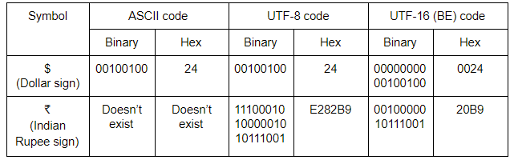  
   
As you can see, UTF-8 offers a big advantage in cases when the character is an English character or a character from the ASCII character set. Also, while UTF-8 uses only 8 bits to store the character, UTF-16 (BE) uses 16 bits to store it, which looks like a waste of memory.  
   
However, in the second case, a symbol is used which doesn’t appear in the ASCII character set. For this case, UTF-8 uses 24 bits, whereas UTF-16 (BE) only uses 16. Hence the storage advantages offered by UTF-8 is reversed and actually becomes a disadvantage here. Also, the advantage UTF-8 offered previously by being same as the ASCII code is also not of use here, as ASCII code doesn’t even exist for this case.  

The default encoding for strings in python is Unicode UTF-8. You can also look at ++[this](https://mothereff.in/utf-8)++ UTF-8 encoder-decoder to look how a string is stored. Note that, the online tool gives you the hexadecimal codes of a given string.  
   
Try this code in your Jupyter notebook and look at its output. Feel free to tinker with the code.   
   
```
# create a string
amount = u"₹50"
print('Default string: ', amount, '\n', 'Type of string', type(amount), '\n')

# encode to UTF-8 byte format
amount_encoded = amount.encode('utf-8')
print('Encoded to UTF-8: ', amount_encoded, '\n', 'Type of string', type(amount_encoded), '\n')


# sometime later in another computer...
# decode from UTF-8 byte format
amount_decoded = amount_encoded.decode('utf-8')
print('Decoded from UTF-8: ', amount_decoded, '\n', 'Type of string', type(amount_decoded), '\n')

```
   
In the next segment, you’ll learn about **regular expressions** which are a must-know tool for anyone working in the field of natural language processing and text analytics.  
  
This section onwards, you’ll learn about **regular expressions**. Regular expressions, also called **regex**, are very powerful programming tools that are used for a variety of purposes such as feature extraction from text, string replacement and other string manipulations. For someone to become a master at text analytics, being proficient with regular expressions is a must-have skill.  
   
A regular expression is a set of characters, or a **pattern**, which is used to find substrings in a given string.   
   
Let’s say you want to extract all the hashtags from a tweet. A hashtag has a fixed pattern to it, i.e. a pound (‘#’) character followed by a string. Some example hashtags are - #mumbai, #bangalore, #upgrad. You could easily achieve this task by providing this pattern and the tweet that you want to extract the pattern from (in this case, the pattern is - any string starting with #). Another example is to extract all the phone numbers from a large piece of textual data.  
   
In short, if there’s a pattern in any string, you can easily extract, substitute and do all kinds of other string manipulation operations using regular expressions.  
   
Learning regular expressions basically means learning how to identify and define these patterns.  
   
Regulars expressions are a language in itself since they have their own compilers. Almost all popular programming languages support working with regexes and so does Python.  
   
Let's take a look at how to work with regular expressions in Python. Download the Jupyter notebook provided below to follow along:  
  
n this section, you’ll learn some new concepts of regular expressions.   
   
The first is the use of **whitespace**. Till now, in the regular expression pattern, you didn’t use a whitespace character. A whitespace comprises of a single space, multiple spaces, tab space or a newline character (also known as a vertical space). You can learn about multiple spaces in a computer ++[here](https://en.wikipedia.org/wiki/Whitespace_character)++. Turns out, you can use these spaces in your regular expression normally.  
   
These whitespaces will match the corresponding spaces in the string. For example, the pattern ‘ +’, i.e. a space followed by a plus sign will match one or more spaces. Similarly, you could use spaces with other characters inside the pattern. The pattern, ‘James Allen’ will allow you to look for the name ‘James Allen’ in any given string.  
   
When you learn about character classes later in this session, you’ll see the different types of spaces that one can use. Whitespaces are used extensively when used inside character sets about which you’ll study later in this session.  

Moving onto the next notation - the **parentheses**. Till now, you have used quantifiers preceded by a single character which meant that the character preceded by the quantifier can repeat a specified number of times. If you put the parentheses around some characters, the quantifier will look for repetition of the **group of characters **rather than just looking for repetitions of the preceding character. This concept is called **grouping** in regular expression jargon. For example, the pattern ‘(abc){1, 3}’ will match the following strings:  
* abc  
* abcabc  
* abcabcabc  
Similarly, the pattern (010)+ will match:  
* 010  
* 010010  
* 010010010, and so on.  
You’ll study about grouping later in this session.  
  
## Greedy vs Non Geedy Matching?  
Logic?  
  
When you use a regular expression to match a string, the regex greedily tries to look for the longest pattern possible in the string. For example, when you specify the pattern 'ab{2,5}' to match the string 'abbbbb', it will look for the maximum number of occurrences of 'b' (in this case 5).  
   
This is called a 'greedy approach'. By default, a regular expression is greedy in nature.  
   
There is another approach called the non-greedy approach, also called the lazy approach, where the regex stops looking for the pattern once a particular condition is satisfied.  
The following video uses the basic concept of HTML, for this you can refer to this ++[link](https://html.com/)++.  
   
t’s understand the non-greedy or the lazy approach with another example. Suppose, you have the string ‘3000’. Now, if you use the regular expression ‘30+’, it means that you want to look for a string which starts with ‘3’ and then has one or more '0's followed by it. This pattern will match the entire string, i.e. ‘3000’. This is the greedy way. But if you use the non-greedy technique, it will only match ‘30’ because it still satisfies the pattern ‘30+’ but stops as soon as it matches the given pattern.  
  
   
It is important to not confuse the greedy approach with matching multiple strings in a large piece of text - these are different use cases. Similarly,  the lazy approach is different from matching only the first match.  
   
For example, take the string ‘One batsman among many batsmen.’. If you run the patterns ‘bat*’ and ‘bat*?’ on this text, the pattern ‘bat*’ will match the substring ‘bat’ in ‘batsman’ and ‘bat’ in ‘batsmen’ while the pattern ‘bat*?’ will match the substring ‘ba’ in batsman and ‘ba’ in ‘batsmen’. The pattern ‘bat*’ means look for the term ‘ba’ followed by zero or more ‘t’s so it greedily looks for as many ‘t’s as possible and the search ends at the substring ‘bat’. On the other hand, the pattern ‘bat*?’ will look for as few ‘t’s as possible. Since ‘*’ indicates zero or more, the lazy approach stops the search at ‘ba’.  
   
### Regex   
  
To use a pattern in a non-greedy way, you can just put a question mark at the end of any of the following quantifiers that you’ve studied till now:  
* *  
* +  
* ?  
* {m, n}  
* {m,}  
* {, n}  
* {n}  
   
The lazy quantifiers of the above greedy quantifiers are:  
* *?  
* +?  
* ??  
* {m, n}?  
* {m,}?  
* {, n}?  
* {n}?  
   
To strengthen your understanding of greedy vs non-greedy search, attempt the following exercise.  
   
In the next section, you’ll learn about the various re functions that you can leverage to help you with your text analysis.  
   
Before you proceed further, Spend some time answering the question next.  
  
#todo #diary  implement a search engine..  
  
  
In this session, you learnt about the different areas where text analytics is applied such as healthcare, e-commerce, retail, financial and various other industries. Then you learnt about the stack that is generally followed to extract insights from the text and to build various applications of natural language processing. You learn there are **three stages** in text analytics:  
  
1. Lexical processing  
2. Syntactic processing  
3. Semantic processing  
   
Then you learnt about **text encoding **and its various types such as **ASCII **and **Unicode**. You learnt how to change between different types of Unicode encodings in Python.  
   
Then you learnt about **regular expressions**. You learnt how to manipulate and extract the information that you want from a given text corpus using regular expressions. In regular expressions, you learnt about **quantifiers**, their different types and how they are used to mention the number of times a character(s) is present. You learnt about the the **anchor characters **(^ and $) and the **wildcard **(.). Then you learnt about the **character sets** and **meta-sequences** which are shorthand for common characters sets. You then learnt about the types of searches - **greedy and non-greedy** and how they differ. You also learnt the use of **grouping characters** in a regular expression. Finally you looked at the different types of functions that are present in Python to facilitate the use of regular expressions in practical settings.  
   
Finally, you can refer to this ++[link](https://pycon2016.regex.training/cheat-sheet)++ whenever you want a refresher in regular expressions in Python. There are some of the concepts that we’ve left untouched in regular expressions. But as someone who is working in the area of text analytics, you can achieve pretty much everything using the tools that you have learnt.  
   
  
  
  
  
  
  
  
  
# Basic Lexical Processing  
#   
**Right now no context so is are plural can be removed.. nothing related to meaning..**  
  
## Word Frequency and stop words  
  
While working with any kind of data, the first step that you usually do is to explore and understand it better. In order to explore text data, you need to do some basic preprocessing steps. In the next few segments, you will learn some basic preprocessing and exploratory steps applicable to almost all types of textual data.  
   
Now, a text is made of characters, words, sentences and paragraphs. The most basic statistical analysis you can do is to look at the **word frequency distribution, **i.e. visualising the word frequencies of a given text corpus.  
   
It turns out that there is a common pattern you see when you plot word frequencies in a fairly large corpus of text, such as a corpus of news articles, user reviews, Wikipedia articles, etc. In the following lecture, professor Srinath will demonstrate some interesting insights from word frequency distributions. You will also learn what **stopwords **are and why they are lesser relevant than other words.  
##   
  
To summarise, the++[ **Zipf's law** ](https://en.wikipedia.org/wiki/Zipf%27s_law)++(discovered by the linguist-statistician George Zipf) states that the frequency of a word is inversely proportional to the rank of the word, where rank 1 is given to the most frequent word, 2 to the second most frequent and so on. This is also called the **power law distribution.**  
   
The Zipf's law helps us form the basic intuition for **stopwords - **these are the words having the highest frequencies (or lowest ranks) in the text, and are typically of limited 'importance'.  
   
Broadly, there are three kinds of words present in any text corpus:  
* Highly frequent words, called stop words, such as ‘is’, ‘an’, ‘the’, etc.  
* Significant words, which are typically more important to understand the text  
* Rarely occurring words, which are again less important than significant words  
   
Generally speaking, stopwords are removed from the text for two reasons:  
1. They provide no useful information, especially in applications such as spam detector or search engine. Therefore, you’re going to remove stopwords from the spam dataset.  
2. Since the frequency of words is very high, removing stopwords results in a much smaller data as far as the size of data is concerned. Reduced size results in faster computation on text data. There’s also the advantage of less number of features to deal with if stopwords are removed.  
   
However, there are exceptions when these words should not be removed. In the next module, you’ll learn concepts such as POS (parts of speech) tagging and parsing where stopwords are preserved because they provide meaningful (grammatical) information in those applications. Generally, stopwords are removed unless they prove to be very helpful in your application or analysis. Later (Parts of Speech.)..  
   
On the other hand, you’re not going to remove the rarely occurring words because they might provide useful information in spam detection. Also, removing them provides no added efficiency in computation since their frequency is so low.  
  
  
## Tokenization  
  
You already know that you’re going to build a spam detector by the end of this module. In the spam detector application, you’re going to use word tokenisation, i.e. break the text into different words, so that each word can be used as a feature to detect whether the given message is a spam or not.  
   
Now, let’s take a look at the spam messages dataset to get a better understanding of how to approach the problem of building a spam detector.  
  
As you saw, there is a lot of noise in the data. Noise is in the form of non-uniform cases, punctuations, spelling errors. These are exactly the things that make it hard for anyone to work on text data.  
  
   
There is another thing to think about - how to extract features from the messages so that they could be used to build a classifier. When you create any machine learning model such as a spam detector, you will need to feed in features related to each message that the machine learning algorithm can take in and build the model. But here, in the spam dataset, you only have two columns - one column contains the message and the other contains the label related to the message. And as you know, machine learning works on numeric data, not text. Earlier when you worked with text columns, you either treated them as categorical variables and converted each categorical variable to numeric variable by either assigning numeric values to each category, or you created dummy variables. Here, you can do neither of these, since the message column is unique, it’s not a categorical variable. If you treat it as a category, your model will fail miserably. You can try it as an exercise.  
   
To deal with this problem, you will extract features from the messages. From each message you’ll extract each word by breaking each message into separate words or 'tokens'.  
   
This technique is called **tokenisation** - a technique that’s used to split the text into smaller elements. These elements can be characters, words, sentences, or even paragraphs depending on the application you’re working on.  
   
In the spam detector case, you will break each message into different words, so it’s called **word tokenisation**. Similarly, you have other types of tokenisation techniques such as character tokenisation, sentence tokenisation, etc. Different types of tokenisation are needed in different scenarios.  
   
Now, let’s take a look at what exactly tokenisation is and how to do it in NLTK. Prof Srinath walks you through the process using the following Jupyter notebook.  
  
There are multiple ways of doing a particular thing in Python. To tokenise words, you can use the split() method that just splits text on white spaces, by default. This method doesn’t always give good results. You are better off using NLTK’s tokeniser which handles various complexities of text. One of them is that it handles** contractions** such as “can’t”, “hasn’t”, “wouldn’t”, and other contraction words and splits these up although there is no space between them. On the other hand, it is smart enough to not split words such as “o’clock” which is not a contraction word.  
   
In NLTK, you also have different types of tokenisers present that you can use in different applications. The most popular tokenisers are:  
1. **Word tokeniser** splits text into different words.  
2. **Sentence tokeniser** splits text in different sentence.  
3. **Tweet tokeniser **handles emojis and hashtags that you see in social media texts  
4. **Regex tokeniser** lets you build your own custom tokeniser using regex patterns of your choice  
  
  
## Bag of Words  
  
  
You have now learnt two preprocessing steps - tokenisation and removing stopwords. But you still can’t use the list of words that you get after these processing steps to train a machine learning model.  
  
   
In this section, you’ll learn how to represent text in a format that you can feed into machine learning algorithms. The most common and most popular approach is to create a **bag-of-words representation** of the text data that you have. The central idea is that any given piece of text, i.e., tweets, articles, messages, emails etc., can be “represented” by a list of all the words that occur in it (after removing the stopwords), where the **sequence of occurrence does not matter**. You can visualise it as the “bag” of all “words” that occur in it. For example, consider the messages:  
   
“Gangs of Wasseypur is a great movie”  
   
The bag of words representation for this message would be:  
   
   
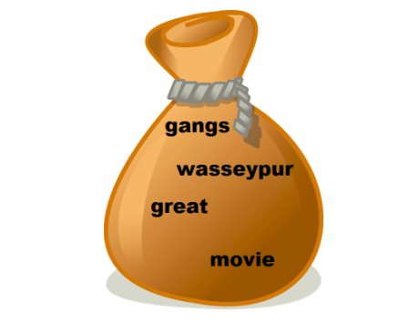  
This way, you can create “bags” for representing each of the messages in your training and test data set. But how do you go from these bags to building a spam classifier?  
   
Let’s say the bags, for most of the spam messages, contain words such as prize, lottery etc., and most of the ham bags don’t. Now, whenever you run into a new message, just look at its “bag-of-words” representation. Does the bag for this message resemble that of messages you already know as spam, or does it not resemble them? Based on the answer to the previous question, you can then classify the message.  
   
Now, the next question is, how do you get a machine to do all of that? Well, turns out that for doing that, you need to represent all the bags in a matrix format, after which you can use ML algorithms such as naive Bayes, logistic regression, SVM etc., to do the final classification.  
   
But how is this matrix representation created? Let’s understand it from professor Srinath.  
  
  
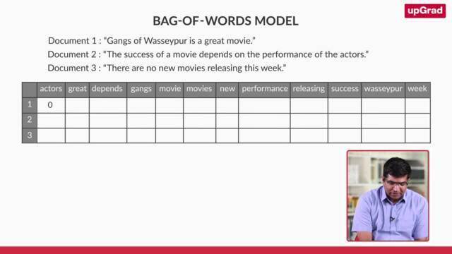  
  
  
  
  
So, that’s how text is represented in the form of matrix. It can then be used to train machine learning models. Each document sits on a separate row and each word of the vocabulary has a its own column. These vocabulary words are also called as **features** of the text.  
   
The bag-of-words representation is also called bag-of-words model but this is not to be confused with a machine learning model. A bag-of-words model is just the matrix that you get from text data.  
   
Another thing to note is that the values inside any cell can be filled in two ways - 1) you can either fill the cell with the frequency of a word (i.e. a cell can have a value of 0 or more), or 2) fill the cell with either 0, in case the word is not present or 1, in case the word is present (binary format).  
   
Both approaches work fine and don’t usually result in a big difference. The frequency approach is slightly more popular and the NLTK library in Python also fills the bag-of-words model with word frequencies rather than binary 0 or 1 values.  
   
Now, it’s your turn to create a bag of words model. Consider these documents and create a bag-of-words model with the frequency approach on these documents. Please note that there is no need to remove the stop words in this case (just for this exercise). After you’re done creating the model, answer the questions that follow.  
   
Document 1: “there was one place on my ankle that was itching”  
Document 2: “but we did not scratch it”  
Document 3: “and then my ear began to itch”  
Document 4: “and next my back”  
  
  
To build a bag-of-words model in Python, you can use the scikit-learn library. As you saw, you get lots of redundant features after building the model. There were features such as ‘get’ and ‘getting’, ‘goes’ and ‘going’, ‘see’ and ‘seeing’ and along with a lot of other duplicate features. They are not exactly duplicates but they’re redundant in the sense that they’re not giving you any extra information about the message. In fact, the words ‘winner’ and ‘win’ are equivalent when your goal is to detect whether a message is spam or not.  
   
Hence, keeping the two separate is actually going to hinder the performance of the machine learning algorithm since it is redundant information. Also, this redundancy is going to increase the number of features due to which the classifier can face the *curse of dimensionality *(error increases with the increase in number of features). To get rid of this problem, you’re going to learn two more preprocessing techniques - **stemming** and **lemmatization** - in the next section.  
   
In the next section, you’ll learn about preprocessing techniques that’ll help you to get rid of redundant tokens or features.  
   
Before you proceed further, Spend some time answering the question next.  
  
  
  
  
  
  
  
  
  
In the last section, you had seen the problem of redundant tokens. This will result in an inefficient model when you build your spam detector. **Stemming** makes sure that different variations of a word, say ‘warm’, warmer’, ‘warming’ and ‘warmed,’ are represented by a single token - ‘warm’, because they all represent the same information (represented by the 'stem' of the word).  
   
Another similar preprocessing step (and an alternative to stemming) is **lemmatisation.**  
   
You’ll now learn about these two techniques that will help you deal with the problem of redundant tokens:  
1. Stemming  
2. Lemmatization  
  
  
  
  
  
View Video Transcript  
  
If you noticed, the repeated tokens or features were nothing but a variation or an **inflected form **of the other token. For example, the word ‘seeing’ is an inflection of the word ‘see’. Similarly, the word ‘limited’ is an inflection of the word ‘limit’. The two techniques that you just learnt reduce these inflected words to the original base form. But which is one is a better technique in what situations? Let’s look at them one by one:  
   
**Stemming**  
It is a **rule-based** technique that just chops off the suffix of a word to get its root form, which is called the ‘stem’. For example, if you use a stemmer to stem the words of the string - "The driver is racing in his boss’ car", the words ‘driver’ and ‘racing’ will be converted to their root form by just chopping of the suffixes ‘er’ and ‘ing’. So, ‘driver’ will be converted to ‘driv’ and ‘racing’ will be converted to ‘rac’.  
   
You might think that the root forms (or stems) don’t resemble the root words - ‘drive’ and ‘race’. You don’t have to worry about this because the stemmer will convert all the variants of ‘drive’ and ‘racing’ to those root forms only. So, it will convert ‘drive’, ‘driving’, etc. to ‘driv’, and ‘race’, ‘racer’, etc. to ‘rac’. This gives us satisfactory results in most cases.  
   
There are two popular stemmers:  
* **Porter stemmer**: This was developed in 1980 and works only on English words. You can find all the detailed rules of this stemmer ++[here](http://snowball.tartarus.org/algorithms/porter/stemmer.html)++.  
* **Snowball stemmer**: This is a more versatile stemmer that not only works on English words but also on words of other languages such as French, German, Italian, Finnish, Russian, and many more languages. You can learn more about this stemmer ++[here](http://snowball.tartarus.org/)++.  
   
**Lemmatization**  
This is a more sophisticated technique (and perhaps more 'intelligent') in the sense that it doesn’t just chop off the suffix of a word. Instead, it takes an input word and searches for its base word by going recursively through all the variations of dictionary words. The base word in this case is called the **lemma**. Words such as ‘feet’, ‘drove’, ‘arose’, ‘bought’, etc. can’t be reduced to their correct base form using a stemmer. But a lemmatizer can reduce them to their correct base form. The most popular lemmatizer is the **WordNet lemmatizer** created by a team of researchers at the Princeton university. You can read more about it   
  
.  
   
Nevertheless, you may sometimes find yourself confused in whether to use a stemmer or a lemmatizer in your application. The following points might help you make the decision:  
1. A stemmer is a rule based technique, and hence, it is much faster than the lemmatizer (which searches the dictionary to look for the lemma of a word). On the other hand, a stemmer typically gives less accurate results than a lemmatizer.  
2. A lemmatizer is slower because of the dictionary lookup but gives better results than a stemmer. Now, as a side note, it is important to know that for a lemmatizer to perform accurately, you need to provide the **part-of-speech tag** of the input word (noun, verb, adjective etc.). You’ll see learn POS tagging in the next session - but it would suffice to know that there are often cases when the POS tagger itself is quite inaccurate on your text, and that will worsen the performance of the lemmatiser as well. In short, you may want to consider a stemmer rather than a lemmatiser if you notice that POS tagging is inaccurate.  
   
In general, you can try both and see if its worth using a lemmatizer over a stemmer. If a stemmer is giving you almost same results with increased efficiency than choose a stemmer, otherwise use a lemmatizer.  
  
  
  
  
  
  
  
  
  
  
  
  
  
  
  
  
  
  
  
  
  
  
  
  
  
## Stemming
  
  
It is a **rule-based** technique that just chops off the suffix of a word to get its root form, which is called the ‘stem’. For example, if you use a stemmer to stem the words of the string - "The driver is racing in his boss’ car", the words ‘driver’ and ‘racing’ will be converted to their root form by just chopping of the suffixes ‘er’ and ‘ing’. So, ‘driver’ will be converted to ‘driv’ and ‘racing’ will be converted to ‘rac’.
 
You might think that the root forms (or stems) don’t resemble the root words - ‘drive’ and ‘race’. You don’t have to worry about this because the stemmer will convert all the variants of ‘drive’ and ‘racing’ to those root forms only. So, it will convert ‘drive’, ‘driving’, etc. to ‘driv’, and ‘race’, ‘racer’, etc. to ‘rac’. This gives us satisfactory results in most cases.
 
There are two popular stemmers:  
* **Porter stemmer**: This was developed in 1980 and works only on English words. You can find all the detailed rules of this stemmer ++[here](http://snowball.tartarus.org/algorithms/porter/stemmer.html)++.  
* **Snowball stemmer**: This is a more versatile stemmer that not only works on English words but also on words of other languages such as French, German, Italian, Finnish, Russian, and many more languages. You can learn more about this stemmer ++[here](http://snowball.tartarus.org/)++.
 
**Lemmatization**
This is a more sophisticated technique (and perhaps more 'intelligent') in the sense that it doesn’t just chop off the suffix of a word. Instead, it takes an input word and searches for its base word by going recursively through all the variations of dictionary words. The base word in this case is called the **lemma**. Words such as ‘feet’, ‘drove’, ‘arose’, ‘bought’, etc. can’t be reduced to their correct base form using a stemmer. But a lemmatizer can reduce them to their correct base form. The most popular lemmatizer is the **WordNet lemmatizer** created by a team of researchers at the Princeton university. You can read more about it ++[here](https://wordnet.princeton.edu/)++.
 
Nevertheless, you may sometimes find yourself confused in whether to use a stemmer or a lemmatizer in your application. The following points might help you make the decision:  
1. A stemmer is a rule based technique, and hence, it is much faster than the lemmatizer (which searches the dictionary to look for the lemma of a word). On the other hand, a stemmer typically gives less accurate results than a lemmatizer.  
2. A lemmatizer is slower because of the dictionary lookup but gives better results than a stemmer. Now, as a side note, it is important to know that for a lemmatizer to perform accurately, you need to provide the **part-of-speech tag** of the input word (noun, verb, adjective etc.). You’ll see learn POS tagging in the next session - but it would suffice to know that there are often cases when the POS tagger itself is quite inaccurate on your text, and that will worsen the performance of the lemmatiser as well. In short, you may want to consider a stemmer rather than a lemmatiser if you notice that POS tagging is inaccurate.
 
In general, you can try both and see if its worth using a lemmatizer over a stemmer. If a stemmer is giving you almost same results with increased efficiency than choose a stemmer, otherwise use a lemmatizer.  
Stemming is an important text-processing technique that reduces words to their base or root form by removing prefixes and suffixes. This process standardizes words which helps to improve the efficiency and effectiveness of various natural language processing (NLP) tasks.  
  
## Stemming  
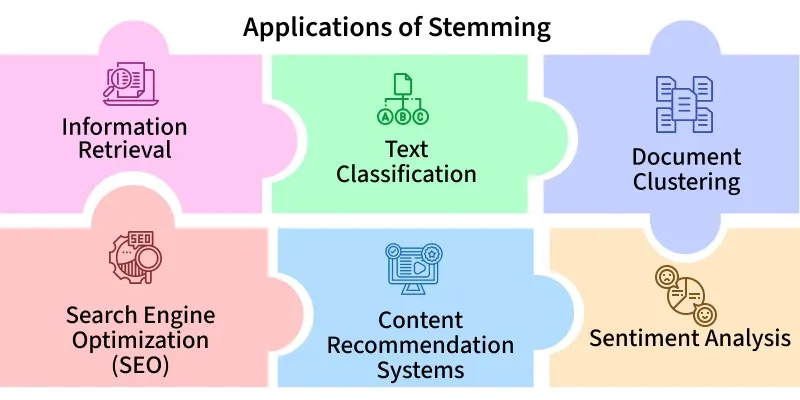  
In NLP, stemming simplifies words to their most basic form, making it easier to analyze and process text. For example, "chocolates" becomes "chocolate" and "retrieval" becomes "retrieve". This is important in the early stages of NLP tasks where words are extracted from a document and tokenized (broken into individual words).  
It helps in tasks such as++[ text classification](https://www.geeksforgeeks.org/nlp/text-classification-using-scikit-learn-in-nlp/)++, ++[information retrieval](https://www.geeksforgeeks.org/nlp/what-is-information-retrieval/)++ and ++[text summarization](https://www.geeksforgeeks.org/nlp/text-summarization-in-nlp/)++ by reducing words to a base form. While it is effective, it can sometimes introduce drawbacks including potential inaccuracies and a reduction in text readability.  
Examples of stemming for the word "like":  
* "likes" → "like"  
* "liked" → "like"  
* "likely" → "like"  
* "liking" → "like"  
  
### Types of Stemmer in NLTK   
  
Python's ++[NLTK (Natural Language Toolkit)](https://www.geeksforgeeks.org/python/NLTK-NLP/)++ provides various stemming algorithms each suitable for different scenarios and languages. Lets see an overview of some of the most commonly used stemmers:  
  
### 1. Porter's Stemmer  
++[Porter's Stemmer](https://www.geeksforgeeks.org/nlp/porter-stemmer-technique-in-natural-language-processing/)++ is one of the most popular and widely used stemming algorithms. Proposed in 1980 by Martin Porter, this stemmer works by applying a series of rules to remove common suffixes from English words. It is well-known for its simplicity, speed and reliability. However, the stemmed output is not guaranteed to be a meaningful word and its applications are limited to the English language.  
Example:  
* 'agreed' → 'agree'  
* Rule: If the word has a suffix EED (with at least one vowel and consonant) remove the suffix and change it to EE.  
Advantages:  
* Very fast and efficient.  
* Commonly used for tasks like information retrieval and text mining.  
Limitations:  
* Outputs may not always be real words.  
* Limited to English words.  
Now lets implement Porter's Stemmer in Python, here we will be using NLTK library.  
  
```
from nltk.stem import PorterStemmer

porter_stemmer = PorterStemmer()

words = ["running", "jumps", "happily", "running", "happily"]

stemmed_words = [porter_stemmer.stem(word) for word in words]

print("Original words:", words)
print("Stemmed words:", stemmed_words)

```
Output:  
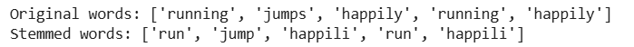  
Porter's Stemmer  
### 2. Snowball Stemmer  
The ++[Snowball Stemmer](https://www.geeksforgeeks.org/nlp/snowball-stemmer-nlp/)++ is an enhanced version of the Porter Stemmer which was introduced by Martin Porter as well. It is referred to as Porter2 and is faster and more aggressive than its predecessor. One of the key advantages of this is that it supports multiple languages, making it a multilingual stemmer.  
Example:  
* 'running' → 'run'  
* 'quickly' → 'quick'  
Advantages:  
* More efficient than Porter Stemmer.  
* Supports multiple languages.  
Limitations:  
* More aggressive which might lead to over-stemming.  
Now lets implement Snowball Stemmer in Python, here we will be using NLTK library.  
  
  
```
from nltk.stem import SnowballStemmer
​
stemmer = SnowballStemmer(language='english')
​
words_to_stem = ['running', 'jumped', 'happily', 'quickly', 'foxes']
​
stemmed_words = [stemmer.stem(word) for word in words_to_stem]
​
print("Original words:", words_to_stem)
print("Stemmed words:", stemmed_words)

```
  
Output:  
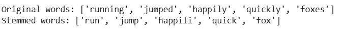  
Snowball Stemmer  
### 3. Lancaster Stemmer  
The++[ Lancaster Stemmer](https://www.geeksforgeeks.org/nlp/lancaster-stemming-technique-in-natural-language-processing/)++ is known for being more aggressive and faster than other stemmers. However, it’s also more destructive and may lead to excessively shortened stems. It uses a set of external rules that are applied in an iterative manner.  
Example:  
* 'running' → 'run'  
* 'happily' → 'happy'  
Advantages:  
* Very fast.  
* Good for smaller datasets or quick preprocessing.  
Limitations:  
* Aggressive which can result in over-stemming.  
* Less efficient than Snowball in larger datasets.  
Now lets implement Lancaster Stemmer in Python, here we will be using NLTK library.  
  
  
  
  
  
  
  
  
   
  
  
```
from nltk.stem import LancasterStemmer
​
stemmer = LancasterStemmer()
​
words_to_stem = ['running', 'jumped', 'happily', 'quickly', 'foxes']
​
stemmed_words = [stemmer.stem(word) for word in words_to_stem]
​
print("Original words:", words_to_stem)
print("Stemmed words:", stemmed_words)

```
  
Output:  
!['quickly, "foxes']](Attachments/054FD429-9BB4-468E-B2CF-7008B777CE14.png)  
Lancaster Stemmer  
### 4. Regexp Stemmer  
The Regexp Stemmer or Regular Expression Stemmer is a flexible stemming algorithm that allows users to define custom rules using ++[regular expressions (regex)](https://www.geeksforgeeks.org/dsa/write-regular-expressions/)++. This stemmer can be helpful for very specific tasks where predefined rules are necessary for stemming.  
Example:  
* 'running' → 'runn'  
* Custom rule: r'ing$' removes the suffix ing.  
Advantages:  
* Highly customizable using regular expressions.  
* Suitable for domain-specific tasks.  
Limitations:  
* Requires manual rule definition.  
* Can be computationally expensive for large datasets.  
Now let's implement Regexp Stemmer in Python, here we will be using NLTK library.  
  
  
  
  
  
  
  
  
   
  
  
```
from nltk.stem import RegexpStemmer
​
custom_rule = r'ing$'
regexp_stemmer = RegexpStemmer(custom_rule)
​
word = 'running'
stemmed_word = regexp_stemmer.stem(word)
​
print(f'Original Word: {word}')
print(f'Stemmed Word: {stemmed_word}')

```
  
Output:  
  
Regexp Stemmer  
### 5. Krovetz Stemmer   
  
  
The Krovetz Stemmer was developed by Robert Krovetz in 1993. It is designed to be more linguistically accurate and tends to preserve meaning more effectively than other stemmers. It includes steps like converting plural forms to singular and removing ing from past-tense verbs.  
Example:  
* 'children' → 'child'  
* 'running' → 'run'  
Advantages:  
* More accurate, as it preserves linguistic meaning.  
* Works well with both singular/plural and past/present tense conversions.  
Limitations:  
* May be inefficient with large corpora.  
* Slower compared to other stemmers.  
Note: The Krovetz Stemmer is not natively available in the NLTK library, unlike other stemmers such as Porter, Snowball or Lancaster.  
  
  
### Stemming vs. Lemmatization  
  
Let's see the tabular difference between Stemming and ++[Lemmatization ](https://www.geeksforgeeks.org/python/python-lemmatization-with-nltk/)++for better understanding: (Lemmatization as trie or dictionary look up)  

| Stemming | Lemmatization |
| -------------------------------------------------------------------- | ----------------------------------------------------------------- |
| Reduces words to their root form often resulting in non-valid words. | Reduces words to their base form (lemma) ensuring a valid word. |
| Based on simple rules or algorithms. | Considers the word's meaning and context to return the base form. |
| May not always produce a valid word. | Always produces a valid word. |
| Example: "Better" → "bet" | Example: "Better" → "good" |
| No context is considered. | Considers the context and part of speech. |
  
  
### Applications of Stemming  
  
Stemming plays an important role in many NLP tasks. Some of its key applications include:  
1. Information Retrieval: It is used in search engines to improve the accuracy of search results. By reducing words to their root form, it ensures that documents with different word forms like "run," "running," "runner" are grouped together.  
2. Text Classification: In text classification, it helps in reducing the feature space by consolidating variations of words into a single representation. This can improve the performance of machine learning algorithms.  
3. Document Clustering: It helps in grouping similar documents by normalizing word forms, making it easier to identify patterns across large text corpora.  
4. Sentiment Analysis: Before sentiment analysis, it is used to process reviews and comments. This allows the system to analyze sentiments based on root words which improves its ability to understand positive or negative sentiments despite word variations.  
  
### Challenges in Stemming  
While stemming is beneficial but also it has some challenges:  
1. Over-Stemming: When words are reduced too aggressively, leading to the loss of meaning. For example, "arguing" becomes "argu" making it harder to understand.  
2. Under-Stemming: Occurs when related words are not reduced to a common base form, causing inconsistencies. For example, "argument" and "arguing" might not be stemmed similarly.  
3. Loss of Meaning: Stemming ignores context which can result in incorrect interpretations in tasks like sentiment analysis.  
4. Choosing the Right Stemmer: Different stemmers may produce diffierent results which requires careful selection and testing for the best fit.  
These challenges can be solved by fine-tuning the stemming process or using lemmatization when necessary.  
Advantages of Stemming  
Stemming provides various benefits which are as follows:  
1. Text Normalization: By reducing words to their root form, it helps to normalize text which makes it easier to analyze and process.  
2. Improved Efficiency: It reduces the dimensionality of text data which can improve the performance of machine learning algorithms.  
3. Information Retrieval: It enhances search engine performance by ensuring that variations of the same word are treated as the same entity.  
4. Facilitates Language Processing: It simplifies the text by reducing variations of words which makes it easier to process and analyze large text datasets.  
  
  
```
import nltk
nltk.download('punkt_tab')
​
from stemming.paicehusk import stem
from nltk.tokenize import word_tokenize
​
text = "The cats are running swiftly."
words = word_tokenize(text)
stemmed_words = [stem(word) for word in words]
​
print("Original words:", words)
print("Stemmed words:", stemmed_words)

```
  
Output:  
Original words: ['The', 'cats', 'are', 'running', 'swiftly', '.']   
Stemmed words: ['Th', 'cat', 'ar', 'run', 'swiftli', '.']  
How the Lancaster Stemmer Works?  
The Lancaster Stemmer works by repeatedly applying a set of rules to remove endings from words until no more changes can be made. It simplifies words like "running" or "runner" into their root form, such as "run" or even "r" depending on how aggressively the algorithm applies its rules.  
Key Features and Benefits of Lancaster Stemmer  
* The Lancaster Stemmer is designed for speed, making it suitable for processing large datasets quickly.  
* It reduces the diversity of word forms by consolidating various forms into a single root, enhancing the efficiency of search operations.  
* Utilizing over 100 rules, it can handle complex word forms that might be overlooked by less comprehensive stemmers.  
* The stemmer is straightforward to implement in programming environments, making it accessible for beginners.  
Limitations of Lancaster Stemmer  
* The aggressive nature of the algorithm can result in stems that are not meaningful, such as reducing "university" and "universe" to "univers."  
* Primarily optimized for English, its performance may degrade with other languages.  
* Due to its aggressive stemming, it can conflate words with different meanings into the same stem, leading to potential ambiguity.  
Lancaster Stemmer  
4. Regexp Stemmer  
The Regexp Stemmer or Regular Expression Stemmer is a flexible stemming algorithm that allows users to define custom rules using ++[regular expressions (regex)](https://www.geeksforgeeks.org/dsa/write-regular-expressions/)++. This stemmer can be helpful for very specific tasks where predefined rules are necessary for stemming.  
Example:  
* 'running' → 'runn'  
* Custom rule: r'ing$' removes the suffix ing.  
Advantages:  
* Highly customizable using regular expressions.  
* Suitable for domain-specific tasks.  
Limitations:  
* Requires manual rule definition.  
* Can be computationally expensive for large datasets.  
Now let's implement Regexp Stemmer in Python, here we will be using NLTK library.  
  
  
  
  
  
  
  
  
  
  
   
  
  
```
from nltk.stem import RegexpStemmer
​
custom_rule = r'ing$'
regexp_stemmer = RegexpStemmer(custom_rule)
​
word = 'running'
stemmed_word = regexp_stemmer.stem(word)
​
print(f'Original Word: {word}')
print(f'Stemmed Word: {stemmed_word}')

```
  
Output:  
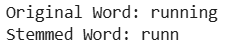  
Regexp Stemmer  
5. Krovetz Stemmer   
The Krovetz Stemmer was developed by Robert Krovetz in 1993. It is designed to be more linguistically accurate and tends to preserve meaning more effectively than other stemmers. It includes steps like converting plural forms to singular and removing ing from past-tense verbs.  
Example:  
* 'children' → 'child'  
* 'running' → 'run'  
Advantages:  
* More accurate, as it preserves linguistic meaning.  
* Works well with both singular/plural and past/present tense conversions.  
Limitations:  
* May be inefficient with large corpora.  
* Slower compared to other stemmers.  
Note: The Krovetz Stemmer is not natively available in the NLTK library, unlike other stemmers such as Porter, Snowball or Lancaster.  
Stemming vs. Lemmatization  
Let's see the tabular difference between Stemming and ++[Lemmatization ](https://www.geeksforgeeks.org/python/python-lemmatization-with-nltk/)++for better understanding:  

| Stemming | Lemmatization |
| -------------------------------------------------------------------- | ----------------------------------------------------------------- |
| Reduces words to their root form often resulting in non-valid words. | Reduces words to their base form (lemma) ensuring a valid word. |
| Based on simple rules or algorithms. | Considers the word's meaning and context to return the base form. |
| May not always produce a valid word. | Always produces a valid word. |
| Example: "Better" → "bet" | Example: "Better" → "good" |
| No context is considered. | Considers the context and part of speech. |
  
  
Applications of Stemming  
  
  
Stemming plays an important role in many NLP tasks. Some of its key applications include:  
1. Information Retrieval: It is used in search engines to improve the accuracy of search results. By reducing words to their root form, it ensures that documents with different word forms like "run," "running," "runner" are grouped together.  
2. Text Classification: In text classification, it helps in reducing the feature space by consolidating variations of words into a single representation. This can improve the performance of machine learning algorithms.  
3. Document Clustering: It helps in grouping similar documents by normalizing word forms, making it easier to identify patterns across large text corpora.  
4. Sentiment Analysis: Before sentiment analysis, it is used to process reviews and comments. This allows the system to analyze sentiments based on root words which improves its ability to understand positive or negative sentiments despite word variations.  
Challenges in Stemming  
While stemming is beneficial but also it has some challenges:  
1. Over-Stemming: When words are reduced too aggressively, leading to the loss of meaning. For example, "arguing" becomes "argu" making it harder to understand.  
2. Under-Stemming: Occurs when related words are not reduced to a common base form, causing inconsistencies. For example, "argument" and "arguing" might not be stemmed similarly.  
3. Loss of Meaning: Stemming ignores context which can result in incorrect interpretations in tasks like sentiment analysis.  
4. Choosing the Right Stemmer: Different stemmers may produce diffierent results which requires careful selection and testing for the best fit.  
These challenges can be solved by fine-tuning the stemming process or using lemmatization when necessary.  
Advantages of Stemming  
Stemming provides various benefits which are as follows:  
1. Text Normalization: By reducing words to their root form, it helps to normalize text which makes it easier to analyze and process.  
2. Improved Efficiency: It reduces the dimensionality of text data which can improve the performance of machine learning algorithms.  
3. Information Retrieval: It enhances search engine performance by ensuring that variations of the same word are treated as the same entity.  
4. Facilitates Language Processing: It simplifies the text by reducing variations of words which makes it easier to process and analyze large text datasets.  
  
Porter Stemmer-> his->hi  
Snowball -> his->his  
  
  
  
You’ve learn quite a few techniques in lexical preprocessing, namely:  
1. Plotting word frequencies and removing stopwords  
2. Tokenisation  
3. Stemming  
4. Lemmatization  
   
Now, let’s create the bag-of-words model, again, but this time, using stemming and lemmatization along with the other preprocessing steps. It will result in reducing the number of features by eliminating redundant features that we had created earlier. But more importantly, will lead to a more efficient representation. You can download the Jupyter notebook that the professor uses here:  
  
  
Download the spam messages dataset which is used in the notebook here:  
  
  
Final Bag of words with Stemming and Lemmatization  
  
You saw how stemming and lemmatization performed on the spam dataset. Lemmatization didn’t perform as good as it should have because of two reasons:  
1. Lemmatization expected the POS tag of the word to be passed along with the word. We didn’t pass the POS tag here.  
2. Lemmatization only works on correctly spelt words. Since there are a lot of misspelt words in the dataset, lemmatization makes no changes to them.  
   
In other words, the comparison of stemming and lemmatization wasn’t actually fair. You can redo this comparison when you learn to tag each word with it’s POS tag by going through this ++[link](https://www.geeksforgeeks.org/python-lemmatization-approaches-with-examples/)++. Then, you can automate the process of lemmatization by passing the word along with it’s POS tag. It will be fair to compare the process of stemming and lemmatization only then. The comparison here was just for demonstration purposes.  
   
In the next section, you’ll learn a new way to create matrix representation from a text corpus of documents.  
  
**Tf-IDF**  
  
The bag of words representation, while effective, is a very naive way of representing text. It relies on just the word frequencies of the words of a document. But don’t you think word representation shouldn’t solely rely on the word frequency? There is another way to represent documents in a matrix format which represents a word in a smarter way. It’s called the TF-IDF representation and it is the one that is often preferred by most data scientists.
 
The term TF stands for term frequency, and the term IDF stands for inverse document frequency. How is this different from bag-of-words representation? Professor Srinath explains the concept of TF-IDF below.  
The TF-IDF representation, also called the **TF-IDF model**, takes into the account the importance of each word. In the bag-of-words model, each word is assumed to be equally important, which is of course not correct.
 
The formula to calculate TF-IDF weight of a term in a document is:
term -T  
document->D  
 
 tf-> per document-> frequency of terms in document D/total number of documents  
idf->> log(total number of documents/number of documents with this term)
 
The log in the above formula is with base 10. Now, the tf-idf score for any term in a document is just the product of these two terms:
 
Higher weights are assigned to terms that are present frequently in a document and which are rare among all documents. On the other hand, a low score is assigned to terms which are common across all documents.
 
Now, attempt the following quiz. Questions 1-3 are based on the following set of documents:  
Document1: "Vapour, Bangalore has a really great terrace seating and an awesome view of the Bangalore skyline"  
Document2: "The beer at Vapour, Bangalore was amazing. My favourites are the wheat beer and the ale beer."  
Document3: "Vapour, Bangalore has the best view in Bangalore."  
  
  
  
## Lemmatization  
  
Lemmatization is an important text pre-processing technique in Natural Language Processing (NLP) that reduces words to their base form known as a "lemma." For example, the lemma of "running" is "run" and "better" becomes "good."  
Unlike ++[stemming](https://www.geeksforgeeks.org/machine-learning/introduction-to-stemming/)++ which simply removes prefixes or suffixes, it considers the word's meaning and ++[part of speech (POS)](https://www.geeksforgeeks.org/nlp/nlp-part-of-speech-default-tagging/)++ and ensures that the base form is a valid word. This makes lemmatization more accurate as it avoids generating non-dictionary words.  
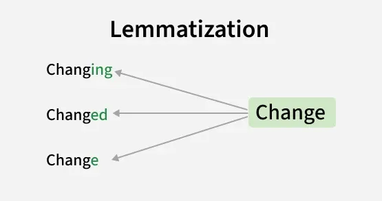  
Lemmatization  
It is used for:  
* Improves accuracy: It ensures words with similar meanings like "running" and "ran" are treated as the same.  
* Reduced Data Redundancy: By reducing words to their base forms, it reduces redundancy in the dataset. This leads to smaller datasets which makes it easier to handle and process large amounts of text for analysis or training machine learning models.  
* Better NLP Model Performance: By treating all similar word as same, it improves the performance of NLP models by making text more consistent. For example, treating "running," "ran" and "runs" as the same word improves the model's understanding of context and meaning.  
  
### Lemmatization Techniques  
  
  
There are different techniques to perform lemmatization each with its own advantages and use cases:  
  
  
1. Rule Based Lemmatization  
  
  
In rule-based lemmatization, predefined rules are applied to a word to remove suffixes and get the root form. This approach works well for regular words but may not handle irregularities well.  
For example:  
Rule: For regular verbs ending in "-ed," remove the "-ed" suffix.  
Example: "walked" -> "walk"  
While this method is simple and interpretable, it doesn't account for irregular word forms like "better" which should be lemmatized to "good".  
  
  
2. Dictionary-Based Lemmatization  
  
  
It uses a predefined dictionary or lexicon such as WordNet to look up the base form of a word. This method is more accurate than rule-based lemmatization because it accounts for exceptions and irregular words.  
For example:  
* 'running' -> 'run'  
* 'better' -> 'good'  
* 'went' -> 'go  
"I was running to become a better athlete and then I went home," -> "I was run to become a good athlete and then I go home."  
By using dictionaries like WordNet this method can handle a range of words effectively, especially in languages with well-established dictionaries.  
  
  
3. Machine Learning-Based Lemmatization  
  
  
It uses algorithms trained on large datasets to automatically identify the base form of words. This approach is highly flexible and can handle irregular words and linguistic nuances better than the rule-based and dictionary-based methods.  
For example:  
A trained model may deduce that “went” corresponds to “go” even though the suffix removal rule doesn’t apply. Similarly, for 'happier' the model deduces 'happy' as the lemma.   
Machine learning-based lemmatizers are more adaptive and can generalize across different word forms which makes them ideal for complex tasks involving diverse vocabularies.  
Implementation of Lemmatization in Python  
Lets see step by step how Lemmatization works in Python:  
Step 1: Installing NLTK and Downloading Necessary Resources  
In Python, the NLTK library provides an easy and efficient way to implement lemmatization. First, we need to install the NLTK library and download the necessary datasets like WordNet and the punkt tokenizer.  
  
```
!pip install nltk

```
Now lets import the library and download the necessary datasets.  
  
```
import nltk
nltk.download('punkt_tab')      
nltk.download('wordnet')    
nltk.download('omw-1.4') 
nltk.download('averaged_perceptron_tagger_eng') 

```
Step 2: Lemmatizing Text with NLTK  
Now we can tokenize the text and apply lemmatization using NLTK's WordNetLemmatizer.  
  
```
from nltk.tokenize import word_tokenize
from nltk.stem import WordNetLemmatizer

lemmatizer = WordNetLemmatizer()
text = "The cats were running faster than the dogs."
tokens = word_tokenize(text)
lemmatized_words = [lemmatizer.lemmatize(word) for word in tokens]

print(f"Original Text: {text}")
print(f"Lemmatized Words: {lemmatized_words}")

```
Output:   
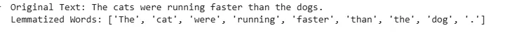  
Lemmatizing Text with NLTK  
In this output, we can see that:  
* "cats" is reduced to its lemma "cat" (noun).  
* "running" remains "running" (since no POS tag is provided, NLTK doesn't convert it to "run").  
  
  
  
### Spam Detection (Naive Bayes)  
  
You’ve learnt all the basic preprocessing steps required for most text analytics applications. In this section, you will learn how to apply these steps to build a **spam detector**.  
   
Until now, you had learnt how to use the scikit-learn library to train machine learning algorithms. Here, Krishna will demonstrate how to build a spam detector using NLTK library which is, as you might have already realised, is your go-to tool when you’re working with text.  
   
Now, it is not necessary for you to learn how to use NLTK’s machine learning functions. But it’s always nice to have knowledge of more than one tool. More importantly, he’ll demonstrate how to extract features from the raw text without using the scikit-learn package. So take this demonstration as a bonus as you'll learn how to preprocess text and build a classifier using NLTK. Before getting started, download the Jupyter notebook provided below to follow along:  
We’ve got an excellent accuracy of 98% on the test set. Although this is an excellent accuracy, you could further improve it by trying other models.  
   
Note that, Krishna has created a bag-of-words representation that’s created from scratch without using the CountVectorizer() function. He has used a binary representation instead of using the number of features to represent each word. In this bag-of-words table, ‘1’ means the word is present whereas ‘0’ means the absence of that word in that document. You can do this by setting the ‘binary’ parameter to ‘True’ in the CountVectorizer() function.  
   
You also saw that Krishna used the pickle library to save the model. After creating models, they are saved using the pickle library on the disk. This way, you can even send the models to be used on a different computer or platform.  
   
In the next video, Krishna explains what could we have done differently, in order to improve our detector even further.  
  
  
# Advanced Lexical Processing  
  
  
## Intro  
  
n the previous session, you had learnt all the basic lexical processing techniques such as removing stop words, tokenisation, stemming and lemmatization followed by creating bag-of-words and tf-idf models and finally building a spam detector. These preprocessing steps are applicable in almost every text analytics application.  
   
Even after going through all those preprocessing steps that you learnt in the previous session, a lot of noise is still present in the data. For example, **spelling mistakes** which happen by mistake as well as by choice (informal words such as 'lol', 'awsum' etc.). To handle such situations, you’ll learn how to identify and process incorrectly spelt words. Also, you’ll learn how to deal with spelling variations of a word that occur due to different pronunciations (e.g. Bangalore, Bengaluru).  
   
At the end of the session, you’ll also learn how to tokenise text efficiently. You’ve already learnt how to tokenise words, but one problem with the simple tokenisation approach is that it can’t detect terms that are made up of more than one word. Terms such as ‘Hong Kong’, ‘Calvin Klein’, ‘International Institute of Information Technology’, etc. are made of more than one word, whereas they represent the same 'token'. There is no reason why we should have ‘Hong’ and ‘Kong’ as separate tokens. You'll study techniques for building such intelligent tokenizers.  
   
In this session, you’ll learn:  
* Phonetic hashing and the Soundex algorithm to handle different pronunciations of a word  
* The minimum-edit-distance algorithm and building a spell corrector   
* Pointwise mutual information (PMI) score to preserve terms that comprise of more than one word  
   
  
## Canocolisation  
  
n the last session, you had learnt some techniques that help you reduce a word to its base form. Specifically, you had learnt the following techniques:  
1. Stemming  
2. Lemmatization  
   
It turns out that the above techniques are a part of what is known as **canonicalisation**. Simply put, canonicalisation means to reduce a word to its base form. Stemming and lemmatization were just specific instances of it. Stemming tries to reduce a word to its root form. Lemmatization tries to reduce a word to its lemma. The root and the lemma are nothing but the base forms of the inflected words.  
   
In the following lecture, professor Srinath explains the concept of canonicalisation.  
  
There are some cases that can’t be handled either by stemming nor lemmatization. You need another preprocessing method in order to stem or lemmatize the words efficiently.  
   
Suppose, you are working on a text corpus which contains misspelt words. Suppose, the corpus contains two misspelt versions of the word ‘disappearing’ - ‘dissappearng’  and ’disapearing’. After you stem these words, you’ll have two different stems - ‘dissappear’ and ‘disapear’. You still have the problem of redundant tokens. On the other hand, lemmatization won’t even work on these two words and will return the same words if it is applied because it only works on correct dictionary spelling.  
   
To deal with misspellings, you’ll need to canonicalise it by correcting the spelling of the word. Then you can perform either stemming or lemmatization. You’ll learn the concept of **edit distance** which can then be used to build a spell corrector to rectify the spelling errors in the text that you’re working with.  
   
A similar problem is that of pronunciation which has to do with different dialects present in the same language. For example, the word ‘colour’ is used in British English, while ‘color’ is used in American English. Both are correct spellings, but they have the exact same problem -  ‘colouring’ and ‘coloring’ will result in different stems and lemma.  
   
To deal with different spellings that occur due to different pronunciations, you’ll learn the concept of **phonetic hashing** which will help you canonicalise different versions of the same word to a base word.  
   
In the next section, you’ll learn about phonetic hashing and how to use it to canonicalise words that have different spellings due to different pronunciations.  
  
  
  
## 
Phonetic hashing Part 1  
  
There are certain words which have different pronunciations in different languages. As a result, they end up being spelt differently. Examples of such words include names of people, city names, names of dishes, etc. Take, for example, the capital of India - New Delhi. Delhi is also pronounced as Dilli in Hindi. Hence, it is not surprising to find both variants in an uncleaned text corpus. Similarly, the surname ‘Agrawal’ has various spellings and pronunciations. Performing stemming or lemmatization to these words will not help us as much because the problem of redundant tokens will still be present. Hence, we need to reduce all the variations of a particular word to a common word.  
   
To achieve this, you’ll need to know about what is called as the **phonetic hashing** technique.  
   
Phonetic hashing buckets all the similar phonemes (words with similar sound or pronunciation) into a single bucket and gives all these variations a single hash code. Hence, the word ‘Dilli’ and ‘Delhi’ will have the same code.  
  
  

Now, let’s arrive at the Soundex of the word ‘Mississippi’. To calculate the hash code, you’ll make changes to the same word, in-place, as follows:  
1. **Phonetic hashing is a four-letter code. The first letter of the code is the first letter of the input word. Hence it is retained as is. The first character of the phonetic hash is ‘M’. Now, we need to make changes to the rest of the letters of the word.**  
2. Now, we need to map all the consonant letters (except the first letter). All the vowels are written as is and ‘H’s, ‘Y’s and ‘W’s remain unencoded (unencoded means they are removed from the word). After mapping the consonants, the code becomes MI22I22I11I  
3. The third step is to remove all the vowels. ‘I’ is the only vowel. After removing all the ‘I’s, we get the code M222211. Now, you would need to merge all the consecutive duplicate numbers into a single unique number. All the ‘2’s are merged into a single ‘2’. Similarly, all the ‘1’s are merged into a single ‘1’. The code that we get is M21.  
4. The fourth step is to force the code to make it a four-letter code. You either need to pad it with zeroes in case it is less than four characters in length. Or you need to truncate it from the right side in case it is more than four characters in length. Since the code is less than four characters in length, you’ll pad it with one ‘0’ at the end. The final code is M210. **American Soundex is the most popular Soundex algorithm. It buckets British and American spellings of a word to a common code. It doesn't matter which language the input word comes from - as long as the words sound similar, they will get the same hash code.**  
5.   
6. 
 Up next, you’ll learn how to identify and measure the 'distance between words' using the concept of **edit distance **which will help you build your own spell corrector**.**  
  
## Edit Distance  
  
In the last section, you saw how to deal with different pronunciations of a particular word. Next, you’ll learn how to deal with misspellings. As already discussed, misspellings need to be corrected in order to stem or lemmatize efficiently. The problem of misspellings is so common these days, especially in text data from social media, that it makes working with text extremely difficult, if not dealt with.  
  
   
Now, to handle misspellings, you’ll learn how to make a **spell corrector**. All the misspelt words will be corrected to the correct spelling. In other words, all the misspelt words will be canonicalised to the base form, which is the correct spelling of that word. But to really understand how a spell corrector works, you’ll need to understand the concept of **edit distance**.  
   
An edit distance is a distance between two strings which is a non-negative integer number. Professor Srinath explains the concept of edit distance in the following lecture.  
  
As you just learnt, an edit distance is the number of edits that are needed to convert a source string to a target string.  
   
Now, the question that comes to the mind is - what’s an edit? An edit operation can be one of the following:  
1. **Insertion** of a letter in the source string. To convert ‘color’ to ‘colour’, you need to insert the letter ‘u’ in the source string.  
2. **Deletion** of a letter from the source string. To convert ‘Matt’ to ‘Mat’, you need to delete one of the ‘t’s from the source string.  
3. **Substitution** of a letter in the source string. To convert ‘Iran’ to ‘Iraq’, you need to substitute ‘n’ with ‘q’  
Now, it is easy to tell the edit distance between two relatively small strings. You can probably tell the number of edits that are needed in the string ‘applaud’ to ‘apple’. Did you guess how many? You need three edits. Substitution of ‘a’ to ‘e’ in a single edit. Then you require two deletions - deletion of the letters ‘u’ and ‘d’. Hence, you need a total of three edit operations in this case. But, this was a fairly simple example. It would become difficult when the two strings are relatively large and complex. Try calculating the edit distance between ‘deleterious’ and ‘deletion’. It’s not obvious in the first look. Hence, we need to learn how to calculate edit distance between any two given strings, however long and complex they might be.  
   
More importantly, we need an algorithm to compute the edit distance between two words. Professor Srinath explains such an algorithm in the following lecture.  
  
  
## Phonetic correction  
Our final technique for tolerant retrieval has to do with *phonetic* correction: misspellings that arise because the user types a query that sounds like the target term. Such algorithms are especially applicable to searches on the names of people. The main idea here is to generate, for each term, a ``phonetic hash'' so that similar-sounding terms hash to the same value. The idea owes its origins to work in international police departments from the early 20th century, seeking to match names for wanted criminals despite the names being spelled differently in different countries. It is mainly used to correct phonetic misspellings in proper nouns.
Algorithms for such phonetic hashing are commonly collectively known as *soundex* algorithms. However, there is an original soundex algorithm, with various variants, built on the following scheme:  
1. Turn every term to be indexed into a 4-character reduced form. Build an inverted index from these reduced forms to the original terms; call this the soundex index.  
2. Do the same with query terms.  
3. When the query calls for a soundex match, search this soundex index.
The variations in different soundex algorithms have to do with the conversion of terms to 4-character forms. A commonly used conversion results in a 4-character code, with the first character being a letter of the alphabet and the other three being digits between 0 and 9.  
4. Retain the first letter of the term.  
5. Change all occurrences of the following letters to '0' (zero): 'A', E', 'I', 'O', 'U', 'H', 'W', 'Y'.  
6. Change letters to digits as follows: B, F, P, V to 1. C, G, J, K, Q, S, X, Z to 2. D,T to 3. L to 4. M, N to 5. R to 6.  
7. Repeatedly remove one out of each pair of consecutive identical digits.  
8. Remove all zeros from the resulting string. Pad the resulting string with trailing zeros and return the first four positions, which will consist of a letter followed by three digits.
For an example of a soundex map, Hermann maps to H655. Given a query (say herman), we compute its soundex code and then retrieve all vocabulary terms matching this soundex code from the soundex index, before running the resulting query on the standard inverted index.
This algorithm rests on a few observations: (1) vowels are viewed as interchangeable, in transcribing names; (2) consonants with similar sounds (e.g., D and T) are put in equivalence classes. This leads to related names often having the same soundex codes. While these rules work for many cases, especially European languages, such rules tend to be writing system dependent. For example, Chinese names can be written in Wade-Giles or Pinyin transcription. While soundex works for some of the differences in the two transcriptions, for instance mapping both Wade-Giles hs and Pinyin x to 2, it fails in other cases, for example Wade-Giles j and Pinyin r are mapped differently.  
  
  
  
  
## Pointwise Mutual Information  
  
Till now you have learnt about reducing words to their base form. But there is another common scenario that you’ll encounter while working with text. Suppose there is an article titled “Higher Technical Education in India” which talks about the state of Indian education system in engineering space. Let’s say, it contains names of various Indian colleges such as ‘International Institute of Information Technology, Bangalore’, ‘Indian Institute of Technology, Mumbai’, ‘National Institute of Technology, Kurukshetra’ and many other colleges. Now, when you tokenise this document, all these college names will be broken into individual words such as ‘Indian’, ‘Institute’, ‘International’, ‘National’, ‘Technology’ and so on. But you don’t want this. You want an entire college name to be represented by one token.  
   
To solve this issue, you could either replace these college names by a single term. So, ‘International Institute of Information Technology, Bangalore’ could be replaced by ‘IIITB’. But this seems like a really manual process. To replace words in such manner, you would need to read the entire corpus and look for such terms.  
   
Turns out that there is a metric called the **pointwise mutual information**, also called the **PMI**. You can calculate the PMI score of each of these terms. PMI score of terms such as ‘International Institute of Information Technology, Bangalore’ will be much higher than other terms. If the PMI score is more than a certain threshold than you can choose to replace these terms with a single term such as ‘International_Institute_of_Information_Technology_Bangalore’.
   
Pointwise Mutual Information (PMI) is a measure used in information theory and natural language processing (NLP) to quantify the strength of association between two events x and y (often words or phrases), by comparing their joint probability to their independent probabilitie  
**Note:** At 1:44, the calculation of PMI(New Delhi) should be **log (P(New Delhi)/P(New)P(Delhi))**  
   
Till now, to calculate the probability of your word you chose words as the occurrence context. But you could also choose a sentence or even a paragraph as the occurrence context.  
   
If we choose **words** **as the occurrence context**, then the probability of a word is:  
P(w) = Number of times given word ‘w’ appears in the text corpus/ Total number of words in the corpus  
   
Similarly, if a **sentence** **is the occurrence context**, then the probability of a word is given by:  
P(w) = Number of sentences that contain ‘w’ / Total number of sentences in the corpus  
   
Similarly, you could calculate the probability of a word with paragraphs as occurrence context.  
   
Once you have the probabilities, you can simply plug in the values and have the PMI score.  
   
Now, you’re given the following corpus of text:  
   
“The Nobel Prize is a set of five annual international awards bestowed in several categories by Swedish and Norwegian institutions in recognition of academic, cultural, or scientific advances. In the 19th century, the Nobel family who were known for their innovations to the oil industry in Azerbaijan was the leading representative of foreign capital in Baku. The Nobel Prize was funded by personal fortune of Alfred Nobel. The Board of the Nobel Foundation decided that after this addition, it would allow no further new prize.”  

Consider the above corpus to answer the questions of the following exercise. Take each **sentence** of the corpus as the **occurrence context**, and attempt the following exercise.  
  
## N Gram Model  
n-gram approximation is a fundamental technique in Natural Language Processing (NLP) and statistical language modeling that approximates the probability of a word in a sequence based only on the n-1 preceding words, rather than the entire history of the sentence. This simplification is based on the**** Markov assumption****, which assumes that the future state depends only on the immediate past.   
  
  
In practical settings, calculating PMI for terms whose length is more than two is still very costly for any relatively large corpus of text. You can either go for calculating it only for a two-word term or choose to skip it if you know that there are only a few occurrences of such terms.  
  
   
After calculating the PMI score, you can compare it with a cutoff value and see if PMI is larger or smaller than the cutoff value. A good cutoff value is zero. Terms with PMI larger than zero are valid terms, i.e. they don’t need to be tokenised into different words. You can replace these terms with a single-word term that has an underscore present between different words of the term. For example, the term ‘New Delhi’ has a PMI greater than zero. It can be replaced with ‘New_Delhi’. This way, it won’t be tokenised while using the NLTK tokeniser.  
   
## Summary  
In this session, you learnt about how to deal with three scenarios:  
  
1. Handling differently spelt words due to different pronunciations  
2. Correcting spelling of misspelt words using edit distance  
3. Tokenising terms that comprise of multiple words  
   
To handle words that have different spellings due to different pronunciations, you learnt the concept of **phonetic hashing**. Phonetic hashing is used to bucket words with similar pronunciation to the same hash code. To hash words, you used the **Soundex** algorithm. The American Soundex algorithm maps the letters of a word in such a way that words are reduced to a four-character long code. Words with the same Soundex code can be replaced by a common spelling of the word. This way, you learnt how to get rid of different variations in spellings of a word.  
   
The next thing that you learnt about was the **Levenshtein edit distance **and spell corrector. You learnt that an edit distance is the number of edits that are needed to convert a source string to a target string. In a single edit operation, you can either insert, delete or substitute a letter. You also learnt a different variant of edit distance - the **Damerau–Levenshtein distance**. It lets you swap two adjacent letters in a single edit operation.  
   
With the help of the edit distance, you created a spell corrector. You could use that spell corrector to rectify the spelling of incorrect words in your corpus.  
   
Lastly, you learnt about the **pointwise mutual information (PMI) score**. You saw how you can calculate PMI of terms with two or more words. You learnt about the concept of **occurrence context**. After choosing the occurrence context, you can calculate the PMI of a term and choose whether it is a valid term or not based on the cutoff value. A good cutoff value is zero. Terms that have PMI higher than zero can be replaced by a single term by simply attaching the multiple words using an underscore.  
   
You can download the lecture notes for the module from the link below.  
  
# 2 Syntactic Processing  
  
Welcome to the module on ‘Syntactic Processing’. In the previous module on lexical processing, you learnt the following techniques:  
* Regular expressions  
* Tokenization, stemming, lemmatization  
* TF-IDF model  
* Phonetic hashing  
* Minimum edit distance algorithm  
You also learnt how to apply lexical processing techniques to build a classifier and how features can be created using the text data to build an ML model. Finally, you built a spam detector using a Naive Bayes classifier and also built a spell corrector.  
   
Before moving ahead with this module, let’s take a look at the topics that will be covered in this module. Note, we have a third session on Name Entity Recognition and Conditional Random Fields also, but in the next video, Sumit is talking about the first two sessions  
  
**Note: You will learn about Parsing in detail in the next session. In this module, you will also study Name Entity Recognition   (NER) and Conditional Random Fields (CRF).**  
   
In this module, you will learn about the algorithms and techniques that are used to analyse the syntax or the grammatical structure of sentences. In this module, you will learn about:  
* PoS tags and PoS tagging techniques, in which you will learn algorithms such as Hidden Markov Models (HMMs) to build PoS taggers,   
* Parsing techniques and the types of parsing such as constituency parsing and dependency parsing, and  
* Code demonstrations of PoS tagging and parsing techniques using the SpaCy library in Python.  
* Name Entity Recognition (NER) and custom NER using Conditional Random Fields (CRF) and its python demonstration.  
  
  
**In this session you will be introduced to the following topics:**  
* Syntax and syntactic processing  
* Parts of speech and PoS tagging  
* PoS tagging techniques: Rule-based and Hidden Markov Model  
* PoS tagging python code demonstration  
Let's start the session with understanding of the terms like syntactic processing and syntax. We all have learnt in our schools how a particular language is built based on the grammatical rules.   
   
Let’s take a look at the sentences given below.  
   
‘Is EdTech upGrad company an.’  
‘EdTech is an company upGrad.’  
‘**upGrad is an EdTech company.**’  
   
All of these sentences have the same set of words, but only the third one is syntactically or grammatically correct and comprehensible.   
   
One of the most important things that you need to understand here is that in lexical processing, all of the three sentences provided above are similar to analyse because all of them contain exactly the same tokens, and when you perform lexical processing steps such as stop words removal, stemming, lemmatization and TFIDF or countvectorizer creation, you get the same result for all of the three sentences. The basic lexical processing techniques would not be able to identify the difference between the three sentences. Therefore, more sophisticated syntactic processing techniques are required to understand the relationship between individual words in a sentence.  
   
Now, before understanding what syntactic processing is, let’s first understand what syntax is and then take a look at some of the interesting examples that make use of syntactic processing. Let’s watch the next video for the same.  
s discussed in this video, arrangement of words in a sentence plays a crucial role in better understanding the meaning of the sentence. These arrangements are governed by a set of rules that we refer to as ‘syntax’, and the process by which a machine understands the syntax is referred to as syntactic processing.  
   
**Syntax**: A set of rules that govern the arrangement of words and phrases to form a meaningful and well-formed sentence  
   
**Syntactic processing**: A subset of NLP that deals with the syntax of the language.  
   
In the video provided above, you also looked at some examples such as chatbots, speech recognition systems and grammar checking software that use syntactic processing to analyse and understand the meaning of the text.   
   
Now, let’s consider the following example.  
   
‘In Bangalore, it is better to have your own transport.’  
   
‘We use carpooling to transport ourselves from home to office and back.’  
   
What do you think about the word ‘**transport**’ in these two sentences?   
   
In the next segment, you will learn about parts of speech that show how different words function grammatically within a sentence and find out the meaning of the sentence.  
   
Before you proceed further, Spend some time answering the question next.  
  
  
## POS TAGGING  
  
Key Concepts in POS Tagging  
1. Parts of Speech: These are categories like nouns, verbs, adjectives, adverbs, etc that define the role of a word in a sentence. NOUN,VERB  
2. Tagging: The process of assigning a specific part-of-speech label to each word in a sentence. Pronunciation when we speak  Denoted by NNP, VBZ, NP, DT, JJ, NN   
3. Corpus: A large collection of text data used to train POS taggers.  
##   
### Overview  
  
Lexicon-based approach uses the following simple statistical algorithm: for each word, it assigns the  
POS tag that most frequently occurs for that word in some training corpus.  
For example, it will assign the tag "verb" to any occurrence of the word "run" if "run" is used as a  
verb more often than any other tag.  
• Rule-based taggers first assign the tag using the lexicon method and then apply predefined rules.  
Some examples of rules are: Change the tag to VBG for words ending with ‘-ing’, Changes the tag to  
VBD for words ending with ‘-ed’, etc.  
  
  
Let’s start with the first level of syntactic analysis: PoS (Parts of Speech) tagging. To understand PoS tagging, you first need to understand what parts of speech are.   

Let’s consider a simple example given below.  

‘You are learning NLP at upGrad.’  

From your knowledge of the English language, you are aware that in this sentence, ‘**NLP**’ and ‘**upGrad**’ are nouns, the word ‘**learning**’ is a verb and ‘**You**’ is a pronoun.   
  
These are called the parts of speech tags of the respective words in the sentence. A word can be tagged as a noun, verb, adjective, adverb, preposition, etc., depending upon its role in the sentence. These tags are called the PoS tags.   
**
Assigning the correct tag, such as noun, verb and adjective, is one of the most fundamental tasks in syntactic analysis.**  

Suppose you ask your smart home device the following question.   

‘Ok Google, where can I get the permit to work in Australia?’   

The word '**permit**' can potentially have two PoS tags: noun or a verb.   

In the phrase 'I need a work permit', the correct tag of '**permit**' is 'noun'.   

On the other hand, in the phrase* *'Please permit me to take the exam', the word '**permit**' is a 'verb'.  

In the following video, let’s hear from Sumit about part-of-speech tags in detail.  
  
  
  
A PoS tag can be classified in two ways: **open class and closed class**.  

Open class refers to tags that are evolving over time and where new words are being added for the PoS tag.  
* **Open class**  
    * Noun  
    * Verb  
    * Adjective  
    * Adverb  
    * Interjection  
Some useful examples of open class PoS tags are as follows:  
* Name of the person  
* Words that can be added or taken from another language such as words taken from the Sanskrit language such as ‘Yoga’ or ‘Karma’   
* Words that are nouns but can be used as verbs such as ‘Google’  
* Words that are formed by a combination of two words such as football, full moon and washing machine  
  
  
Closed class refers to tags that are fixed and do not change with time.  
* **Closed class**  
    * Prepositions  
    * Pronouns  
    * Conjunctions  
    * Articles  
    * Determiners  
    * Numerals  
Some examples of closed-class PoS tags are as follows:  
* Articles: a, an, the   
* Pronouns: you and I   
You can take a look at the universal tagsets used by the spaCy toolkit ++[here](https://universaldependencies.org/docs/u/pos/)++.  
   
**Note**: ++[spaCy ](https://spacy.io/)++is an open-source library used for advanced natural language processing, similar to NLTK, which you have used in lexical processing.  
   
In this module on syntactic processing, you are going to use the spaCy library to perform syntactical analysis.  
   
You do not need to remember all the PoS tags. You will pick up most of these tags as you work on the problems in the upcoming segments, but it is important to be aware of all the types of tags.  
   
You can also refer to the alphabetical list of 36 part-of-speech tags used in the ++[Penn Treebank Project](https://www.ling.upenn.edu/courses/Fall_2003/ling001/penn_treebank_pos.html)++, which is being used by the spaCy library.  
   
In the next segment, you will learn how PoS tagging is done for a sentence.  
  
Universal POS tags  
These tags mark the core part-of-speech categories. To distinguish additional lexical and grammatical properties of words, use the ++[universal features](https://universaldependencies.org/u/feat/index.html)++.  

| Open class words | Closed class words | Other |
| ---------------- | ------------------ | ----- |
| ADJ              | ADP                | PUNCT |
| ADV              | AUX                | SYM   |
| INTJ             | CCONJ              | X     |
| NOUN             | DET                |       |
| PROPN            | NUM                |       |
| VERB             | PART               |       |
|                  | PRON               |       |
|                  | SCONJ              |       |
  
Alphabetical listing  
* ++[ADJ](https://universaldependencies.org/u/pos/ADJ.html)++: adjective  
* ++[ADP](https://universaldependencies.org/u/pos/ADP.html)++: adposition  
* ++[ADV](https://universaldependencies.org/u/pos/ADV.html)++: adverb  
* ++[AUX](https://universaldependencies.org/u/pos/AUX_.html)++: auxiliary  
* ++[CCONJ](https://universaldependencies.org/u/pos/CCONJ.html)++: coordinating conjunction  
* ++[DET](https://universaldependencies.org/u/pos/DET.html)++: determiner  
* ++[INTJ](https://universaldependencies.org/u/pos/INTJ.html)++: interjection  
* ++[NOUN](https://universaldependencies.org/u/pos/NOUN.html)++: noun  
* ++[NUM](https://universaldependencies.org/u/pos/NUM.html)++: numeral  
* ++[PART](https://universaldependencies.org/u/pos/PART.html)++: particle  
* ++[PRON](https://universaldependencies.org/u/pos/PRON.html)++: pronoun  
* ++[PROPN](https://universaldependencies.org/u/pos/PROPN.html)++: proper noun  
* ++[PUNCT](https://universaldependencies.org/u/pos/PUNCT.html)++: punctuation  
* ++[SCONJ](https://universaldependencies.org/u/pos/SCONJ.html)++: subordinating conjunction  
* ++[SYM](https://universaldependencies.org/u/pos/SYM.html)++: symbol  
* ++[VERB](https://universaldependencies.org/u/pos/VERB.html)++: verb  
* ++[X](https://universaldependencies.org/u/pos/X.html)++: other  
© 2014–2024 ++[Universal Dependencies contributors](http://universaldependencies.org/introduction.html#contributors)++. Site powered by ++[Annodoc](http://spyysalo.github.io/annodoc)++ and ++[brat](http://brat.nlplab.org/)++  
  
  
  
  
## POS Tagger Model  
Lexicon-based approach uses the following simple statistical algorithm: for each word, it assigns the  
POS tag that most frequently occurs for that word in some training corpus.  
For example, it will assign the tag "verb" to any occurrence of the word "run" if "run" is used as a  
verb more often than any other tag.  
  
As discussed above, a PoS tagger is a model/algorithm that automatically assigns a PoS tag to each word of a sentence.  
   
  
   
   
In this example, the input is 'upGrad is teaching NLP.'. When you put this sentence into a model or tagger, it will result in the output with respective PoS tags assigned to each word of the sentence such as ‘**upGrad**’ (noun), ‘**is**’ (verb), ‘**teaching**’ (verb) and ‘**NLP**’ (noun).  
   
Let’s take a look at another example given below.  
   
**-   Tagger input**: ‘*She sells seashells on the seashore.*’  
**- Tagger output**: ‘She(PRON) sells (VERB) seashells(NOUN) on(SCONJ) the(DET) seashore(NOUN).’  

You can refer to the++[ universal PoS tag ](https://universaldependencies.org/docs/u/pos/index.html)++list for finding tags corresponding to their parts of speech and also refer to the alphabetical list of part-of-speech tags used in the ++[Penn Treebank](https://www.ling.upenn.edu/courses/Fall_2003/ling001/penn_treebank_pos.html)++ Project, which is being used by the SpaCy library.  
   
Now, let’s try to understand how one can build a simple rule-based PoS tagger to assign PoS tags to individual words in a sentence.   
   
Suppose you have been given a training dataset that comprises words and their respective PoS tags’ count. This is visually demonstrated in tabular format below.   
   
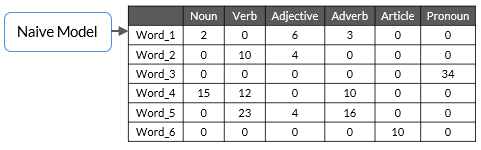  
   
In this table, the word ‘Word_1’ occurs as a noun two times, and as an adjective, it occurs six times and so on in the training dataset.  
   
The identification of PoS tags in the training dataset is done manually to predict the PoS tags of the test data.  
   
In the table provided above, ‘Word_1’ appears as a noun two times, and as an adjective, it appears three times and so on. Now, suppose, you are given the following sentence (S).  
   
S: “Word_4  Word_1  Word_3.”  
 	Noun Verb Pronoun  
  
  
What will be the PoS tags of each word in this sentence?  
  
In this video, you got the answer to the previous exercise, i.e., the PoS tags of the words of the sentence S will be as follows:  
   
Word_4: Noun
Word_1: Adjective
Word_3: Pronoun  
   
You assign the most frequent PoS tags that appear in the training data to the test dataset, and you realise that rule based tagger gives good results most of the time.  
   
But, sometimes, it does not give satisfactory results because it does not incorporate the context of the word.  
   
Let’s take the following example.  
   
Consider the word ‘race’ in both the sentences given below:  
1. ‘The tortoise won the race.’  
2. ‘Due to the injury, the horse will not be able to race today.’  
   
In the first sentence, the word ‘race’ is used as a noun, but, in the second sentence, it is used as a verb. However, using the simple frequency-based PoS tagger, you cannot distinguish its PoS tags in different situations.  
   
To improve this method of PoS tagging further, in the next segment, you will learn about how context information can be incorporated while building PoS taggers. You will understand how Hidden Markov model, a type of sequence labelling modelling technique, help us in doing exactly that.  
   
Before you proceed further, Spend some time answering the question next.  
  
  
  
## Hidden Markov Model Part 1  
  
### Overview  
  
**Probabilistic (or stochastic) techniques don't naively assign the highest frequency tag to each word,**  
**instead, they look at slightly longer parts of the sequence and often use the tag(s) and the word(s)**  
**appearing before the target word to be tagged. You learnt about the commonly used probabilistic**  
**algorithm for POS tagging - the Hidden Markov Model (HMM)**  
  
**HMM is defined by initial state, emission and transition probabilities..**  
  
In the previous segment, you learnt about PoS tagging based on the frequency of tags alone, which seems inefficient when words are used in different contexts. So, to improve this model, in this segment, you will learn about the Hidden Markov Model, which performs better and uses the context of the previous word to decide the PoS tag of the current word.  
   
Let’s consider the following example; what does your mind process when you see the blank space at the end of this sentence?  
   
'Rahul is driving to _____.' Noun..  
   
Don’t you think that the blank space should be the name of a place?  
   
How do you manage to identify that the blank space would be a name of the place?    
   
Try to analyse your thoughts after reading this statement, when you see the word ‘Rahul’ who is driving to some place and hence, you reach to a conclusion that the blank space should be the name of a place (noun).  
   
This means that you have sequentially looked at the entire sentence and concluded that the blank space should be the name of a place.   
   
Now, what if we build an algorithm that can work sequentially to identify the PoS tags of the words based on the PoS tag of the previous word? In the next video, Sumit will explain sequence labelling techniques, particularly Hidden Markov Models, in detail.  
  
  
  
Extension of Markov process->specify the probabiity of transition between states and emission of observation from states.. state is hidden..  
  
**Application-> Sequence Labelling**  
  
that a given sentence is nothing but a sequence of word, the task of predicting what is coming next in this sequence of word is known as the task of sequence labeling.So, sequence labeling is essentially the task of automatically assigning certain labels to each individual world in a given sequence.. state-> tags, observation->probability of next word..  
When we listen. We only observe the words when hearing to a sentence and not their tags, means tags->hidden..  
What our brain/model does is observe the state of the word or tag meaning label.. noun adjective etc..  
Sentence the sky is blue..  
First state->We her the word “the”(Observation/word) and our model/brain says it is an “article”(state)(tag/label)  
Markov Assumption  
  
Transition and Emission   
  
An HMM consists of two types of variables: hidden states and observations. The relationship between the hidden states and the observations is modeled using a probability distribution.   
The Hidden Markov Model (HMM) is the relationship between the hidden states and the observations using two sets of probabilities: the transition probabilities and the emission probabilities.  
  
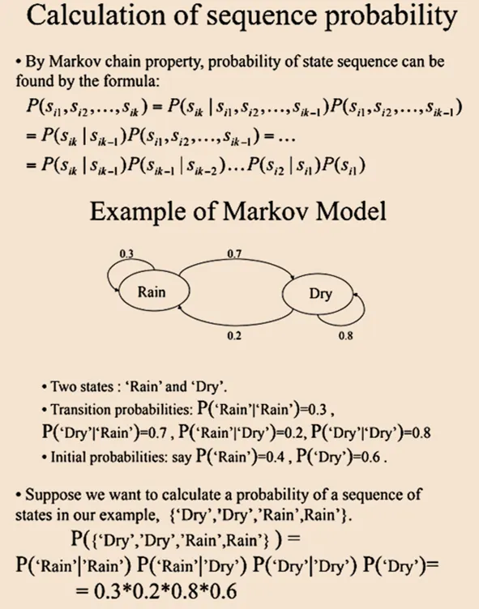  
  
  
Sequence labelling is the task of assigning the respective PoS tags of the words in the sentence using the PoS tag of the previous word in the sentence.  
   
Hidden Markov Model can be used to do sequence labelling, which means that it takes input of words in a sequence and assigns the PoS tags to each word based on the PoS tag of the previous word.   
   
In the video example ‘The tortoise won the race’, to decide the PoS tag of ‘race’, the model uses the PoS tag of the previous word, i.e., ‘the’, which is an article.   
   
Now, let’s take a look at the following points and try to understand why Hidden Markov Model is called ‘Hidden’:  
* When you observe (read/listen) a sentence, you only observe the words in the sentence and not their PoS tags; thus, PoS tags are hidden.  
* You must infer these hidden tags from your observations, and that's why Hidden Markov Model is called Hidden.  
   
There are majorly two assumptions that HMM follows, which are as follows:  
* The PoS tag of the next word is dependent only on the PoS tag of the current word.  
* The probability of the next word depends on the PoS tag of the next word.   

Before learning about HMM, you need to understand the two most important types of matrices, i.e., emission and transition matrices. In the next video, let’s take a look at an example of how you can build these matrices.  
  
  
  
  
When working with sequences of data, we often face situations where we can't directly see the important factors that influence the datasets. Hidden Markov Models (HMM) help solve this problem by predicting these hidden factors based on the observable data  
  
**Sequence labelling is the task of assigning the respective PoS tags of the words in the sentence using the PoS tag of the previous word in the sentence.**  
** **  
Hidden Markov Model can be used to do sequence labelling, which means that it takes input of words in a sequence and assigns the PoS tags to each word based on the PoS tag of the previous word.   
   
In the video example ‘The tortoise won the race’, to decide the PoS tag of ‘race’, the model uses the PoS tag of the previous word, i.e., ‘the’, which is an article.   
   
Now, let’s take a look at the following points and try to understand why Hidden Markov Model is called ‘Hidden’:  
* When you observe (read/listen) a sentence, you only observe the words in the sentence and not their PoS tags; thus, PoS tags are hidden.  
* You must infer these hidden tags from your observations, and that's why Hidden Markov Model is called Hidden.  
   
****There are majorly two assumptions that HMM follows, which are as follows:****  
* The PoS tag of the next word is dependent only on the PoS tag of the current word.  
* The probability of the next word depends on the PoS tag of the next word.   

Before learning about HMM, you need to understand the two most important types of matrices, i.e., emission and transition matrices. In the next video, let’s take a look at an example of how you can build these matrices.  
  
   
### Transition and Emission Matrices  
  
  
o build any machine learning model, you first need to train that model using some training data, and then, you need to use that model to predict the output on the test data.  
   
Here, the train data is the corpus of sentences, and you need to perform some manual tasks to assign the PoS tags to each word in the corpus. Once you manually assign the PoS tags to each word in the training corpus, you create two important matrices using the training dataset, which are as follows:  
* Emission matrix  
* Transition matrix  
   
**Note**: We have used only two PoS tags, i.e., noun and verb, as of now to understand the concept in a simpler manner.  
   
**Emission matrix: **This matrix contains all words of the corpus as row labels; the PoS tag is a column header, and the values are the conditional probability values.  
   
**Note**: Conditional probability is defined as the probability of occurrence of one event given that some other event has already happened. You will get more idea about this in the following example.  
   
Please note that the table shown in the previous video has mistake in numerical values, as the column wise sum of that table is exceeding the value 1. You can consider the following table instead of video one. Also, please consider the values in the table as a reference only to understand the concept, you only need to keep in mind that the column wise sum of Emission matrix will be 1.  
   
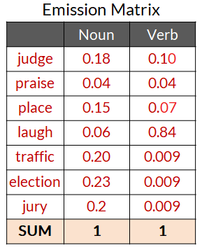  
   
For example, in the corpus that has been used in the video provided above, whenever a noun appears in the training corpus, there is an 18% chance that it will be the word ‘judge’. Similarly, whenever a verb appears in the training corpus, there is an 84% chance that it will be the word ‘laugh’.  
   
So, here, 0.18 is the probability of occurrence of the word ‘judge’ given that there will be a noun at that place. In a similar way, 0.10 is the probability of occurrence of the word ‘judge’ given that there will be a verb at that place.  
   
**Transition matrix**: This matrix contains PoS tags in the column and row headers. Let’s try to understand the conditional probability values that have been given in the following table.  
   
Let’s take a look at the first row of the table; it represents that 0.26 is the probability of occurrence of a noun at the start of the sentence in the training dataset. In the same way, 0.73 is the probability of occurrence of a verb at the start of the sentence in the training dataset.  
   
If you take a look at the second row, then you will see that 0.44 is the probability of occurrence of noun just after a noun in the training dataset, and similarly, 0.19 is the probability of occurrence of a verb just after a noun in the training dataset.  
   
  
Essentially, the transition matrix gives the information of the next PoS tag considering the current PoS tag of the word.  
   
Now that you have understood what transition and emission matrices are, in the next segment, you will get an intuitive understanding of HMM and understand how it calculates the scores or probability to identify the correct PoS tags in a sequential manner.  
   
Before you proceed further, Spend some time answering the question next.  
  
  
  
  
   
Please note that you will not be gaining an in-depth understanding of HMM in this module, you will only gain an intuitive understanding of how HMM works on sequence labelling of PoS tags.  
   
In the video provided above, Sumit took a basic example to understand the working of HMM. Suppose you have the following corpus of the training dataset.
   
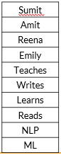  
   
The emission and transition matrices of this corpus are as follows:  
   
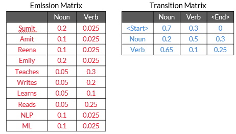  
   
Suppose you have been given the following test sentence to predict the correct PoS tags of the words.  
   
S: 'Sumit teaches NLP.'  
   
As of now, we are only considering the two PoS tags, i.e., noun (N) and verb (V).  
   
There are many combinations of PoS tags possible for the sentence ‘S’ such as NVN, NNN, VVV and VVN or NNV.  
   
If you calculate the total number of combinations for this example, then you will see that there are only noun and verb tags; hence, 2^3 will be the total number of combinations possible.  
   
Let’s consider the two sequences as of now, which are NNN and NVN.  
   
Calculate the score for the NNN sequence.  
   
**Score of NNN: 
[P(Start-Noun) * P(Sumit|Noun)] * [P(Noun-Noun)*P(teaches|Noun)] * [P(Noun-Noun) * P(NLP|Noun)]**  
(0.7*0.2) *  (0.2*0.05)  * (0.2*0.1) = 0.000028  
   
**Score of NVN:
[P(Start-Noun)*P(Sumit|Noun)] * [P(Noun-Verb)*P(teaches|Verb)] * [P(Verb-Noun) * P(NLP|Noun)]**  
   
(0.7*0.2) * (0.5*0.3) * (0.65*0.1) = 0.001365  
N        V          N  
Reena Learns ML  
V   N  V    
(.3*.025)*( .5*.025)*(.65*.025)‎ =   
(.3*.025)*(.5*.1)*(.025*.1)=  
P(Start-Verb)* P(Reena|Verb)]* [P(Verb-Noun)*P(learns|Noun)] * [P(Noun-Verb)*P(ML|Verb)] = (0.3*0.025)*(0.65*0.05)*(0.5*0.025) = 0.00000304687  
  
You get the maximum score for the NVN sequence; hence the model assigns the noun to ‘**Sumit**’, the verb to ‘**teaches**’ and another noun to ‘**NLP**’ in the test sentence.  
   
In practice, you do not have to calculate these scores from scratch. You will be using an already prepared toolkit to implement HMM, but it is important to be aware of the basic techniques used in PoS tagging.   
   
Although you are not going to implement these PoS tagging techniques in the real-life scenario, you are going to use the SpaCy library to tag the correct PoS tags that are based on the neural network models. It is important to have an intuitive understanding of these techniques, including the rule-based tagger and HMM, to understand how a PoS tagger works.  
   
With this, you have understood the theory part of PoS tagging. In the next segment, we will implement PoS tagging in Python.  
  
  
  
s Sumit mentioned in the video, we are not going to design and implement the rule-based tagger or a sequential tagger like HMM in the real world. However, it is good to have an intuitive understanding of how a PoS tagger can be built.  
   
For the implementation of PoS tagging, you are going to use a Python library, i.e., spaCy.   
   
Please note that it is not important to deep dive into the working of the spaCy library. The working of spaCy is based on neural networks which is out of the scope of this course. spaCy works well in different applications of NLP such as PoS tagging, parsing and lexical processing steps. You just need to learn how to use this library for various applications.   
   
Now, let’s learn how one can use PoS tagging in applications like Heteronyms identification using the spaCy library.  
   
Consider the following two sentences and pay attention to the pronunciation of word ‘**wind**’ while you read:  
* The doctor started to wind the bandage around my finger.  
* The strong wind knocked down the tree.  
   
You can listen to these sentences in the ++[Google Translator](https://www.google.com/search?q=google+translate&rlz=1C1CHBF_enIN868IN868&oq=google+tra&aqs=chrome.0.0i131i433j0j69i57j0i131i433j0i433j69i60l3.5141j0j7&sourceid=chrome&ie=UTF-8)++ application.   
   
As you might have noticed, the pronunciation of ‘**wind**’ is different in both the sentences, though its spelling is the same. Such words are known as **Heteronyms**.  
   
**Heteronyms **are words that have the same spelling but mean differently when pronounced differently.  
   
But how do machines like Alexa and Google Translator detect these heteronyms? To understand this, let’s hear from Sumit in the next video.  
   
You have been provided with the well-commented notebook in the below GitHub link to code along with the video. We strongly recommend you to write the code along with the video to have a better understanding of the concepts.  
   
++[Code Files and Data Github Repository](https://github.com/ContentUpgrad/Syntactic-Processing)++  
  
As you saw, Sumit took the following sentence:  
   
‘She wished she could desert him in the desert.’  
   
Google translator pronounces ‘desert’ differently based on its PoS tag. You can see that both the instances of the word ‘desert’ have different PoS tags, one is a verb and other one is a noun.  
   
In the next segment, you will see how PoS tagging can be done using the spaCy library.  
  
  
et’s try to understand each line of code one by one.  
   
```
model = spacy.load(“en_core_web_sm”)

```
   
* ‘**en**’ stands for English language, which means you are working specifically on English language using the spaCy library.  
* ‘**core**’ stands for core NLP tasks such as lemmatization or PoS tagging, which means you are loading the pre-built models which can perform some of the core NLP-related tasks.  
* ‘**web**’ is the pre-built model of the spaCy library which you will use for NLP tasks that are trained from web source content such as blogs, social media and comments.  
* ‘**sm**’ means small models which are faster and use smaller pipelines but are comparatively less accurate. As a complement to ‘sm’, you can use ‘**lg**’ or ‘**md**’ for larger pipelines which will be more accurate than ‘sm’.  
   
Visit this ++[link ](https://spacy.io/models/en#en_core_web_sm)++to know more about the spaCy package.  
   
### Part of Speech and Tag  
  
So, you have loaded the ‘en_core_web_sm’ model into the object ‘model’. Now, let’s apply the model on the input sentence, i.e., ‘She wished she could desert him in the desert’, using the following line of code.  
   
```
#Use the model to process the input sentence
tokens = model("She wished she could desert him in the desert.")

```
   
So, you get the words and its part of speech and tags in the variable ‘tokens’. Now, to print the tokens, part of speech and PoS tags, you need to apply a ‘for’ loop on this ‘tokens’ object as follows:  
   
```
# Print the tokens and their respective PoS tags.
for token in tokens:
    print(token.text, "--", token.pos_, "--", token.tag_)

```
   
 So, when you print ‘token.pos_’, it prints the part of speech and using ‘token.tag_’, it prints the PoS tags corresponding to each token in a given sentence. 
 
Please note that the ‘token.pos_’ gives you the part of speech which is defined in spaCy’s universal part of speech tags that you can get from this ++[link](https://universaldependencies.org/u/pos/)++. Moreover, to give the PoS tags using ‘token.tag_’, spaCy uses the PoS tags provided by the Penn treebank that you can get from this ++[link](https://www.ling.upenn.edu/courses/Fall_2003/ling001/penn_treebank_pos.html)++.  
   
When you get the PoS tags of each token of the sentence ‘She wished she could desert him in the desert’, then you will observe that the PoS tag of the word ‘desert’ is different in both of the instances. At one place, it is working as a verb and in another instance, it is working as a noun.   

**Word sense disambiguation (WSD)**: WSD is an open problem in computational linguistics concerned with **which sense of word** is used in a sentence. It is very difficult to fully solve the WSD problem. Google, however, has partially solved it.  
   
Let’s try to listen to the pronunciation of the word ‘bass’ in the following sentence in Google Translator.  
   
‘The bass swam around the bass drum on the ocean floor’.  
   
You will see in the upcoming videos that both the occurrences of the word ‘bass’ have the same PoS tags, but the pronunciation should be different. Even Google Translator is not able to pronounce it differently.  
   
However, as you have seen, the use of PoS tagging in heteronyms detection can be one of the prominent solutions to remove ambiguity in the sentence.   
   
Let’s take the example of  the following sentence:  
   
‘She wished she could desert (verb) him in the desert (noun)’.  
   
Here, the word ‘desert’ has two PoS tags based on its uses. At one place, it is working as a verb and at another place, it is working as a noun.  
   
But what if the heteronyms have the same PoS tag but different pronunciation?  
   
Let’s hear from Sumit to know more about it.  
  
As discussed earlier, PoS tagging works pretty accurately to detect heteronyms but fails to distinguish between the words having the same spelling and the same PoS tags. Let’s consider the following example:  
   
‘The bass swam around the bass drum on the ocean floor’.  
   
When you implement the model on this sentence, you get the list of PoS tags of each token in the sentence. As you noticed that the word ‘bass’ is working as a noun at both of the places, but it should have different pronunciation at both the instances.   
   
So, the problem when the system is not able to identify the correct pronunciation of the words which have the same PoS tag but different meanings in different contexts can be considered under the WSD problem.   
   
Please note that this is just one of the dimensions of WSD. WSD is altogether a broader area to discover and it is an open problem in computational linguistics concerned with identifying which sense of a word is used in a sentence.  
   
In the next segment, you will go through PoS tagging case study.  
   
Before you proceed further, Spend some time answering the question next.  
  
  
  
In the previous segment, you learnt to identify the PoS tags of each token in a given sentence using the Spacy library.   
   
Now, let’s come to a very interesting case study using PoS tagging. Here, we will provide you with the problem statement and some hints to produce output of each step involved to solve the case study. Once you are able to get the answer, we have solution videos which you can refer to after performing each step by yourself.  
   
Please note that this is not a graded case study, but we recommend you solve this as a business use case to learn more about PoS tagging.  
   
Let’s understand the problem statement first.  
   
You have used this feature of Amazon many times before buying any product from the website where you look into the reviews of the product category-wise. Let’s look at the following.  
   
   
  

The image is the Amazon page of Apple iPhone 12 Mini mobile phone. As you can see, there is categorisation of reviews into features based on the reviews’ text submitted by the users. These features can be **‘battery life’**, **‘value for money’**, **‘screen size’** and so on.   
   
It is interesting to know that these features have been created to categorise the reviews after looking into the reviews’ text given by multiple users. So, when you click on let’s say **‘battery life’**, you will get all the reviews related to the battery life of this phone.  
   
Please note that in this case study, we are not going to segregate or categorise the reviews, but we are going to find out the top product features that people are talking about in their reviews.  
   
The categorisation of reviews among the product features is just a task to assign each review to its category which can be done using simple coding steps once the main NLP steps are done.   
   
Can we find out the top product features that people are talking about in their reviews using the PoS tagging method? Let’s first listen to Gunnvant in the next video.  
  
  
  
  
  
  
So, you are now clear about what you need to do in this case study.   
   
Please note that as this use case is not a graded component and is designed to be solved as a case study, you have been provided with the data set and the well-commented codes to solve it.  
   
**We made this case study for your hands-on practice as you are well aware of Python now. Though it is not at all mandatory to solve each of the problems; you can watch the videos directly and then think about the questions.**   
   
You have been given the following Github link where you can find well-commented notebook to write your code:  
   
++[Code Files and Data Github Repository](https://github.com/ContentUpgrad/Syntactic-Processing)++  
   
**Task - 1**: Let’s first find out the PoS tags of each token in the following sentences and observe the PoS tags of the words ‘screen’, ‘battery’ and ‘speaker’.  
   
sent1 = "I loved the screen on this phone".
sent2 = "The battery life on this phone is great".
sent3 = "The speakers are pathetic".  
   
You have an understanding of getting the PoS tags from the previous segments and can write the code to get the PoS tag of each token for these three sentences. Now, based on the output that you get after having the PoS tags, please answer the following question.  
  
An important thing to note here is that suppose we are able to find the frequency count of all the nouns in our data set, then by looking at top-n nouns, we can find out what product features people are talking about.  
   
For the next steps, you have been given the commented notebooks in the Github repository and the data set on which you need to perform the certain steps:  
   
++[Code Files and Data Github Repository](https://github.com/ContentUpgrad/Syntactic-Processing)++  
   
You have been given a Samsung phone reviews data set with file name ‘Samsung.txt’ file. It contains the reviews about the phone. This data set is a txt file, and each review is in a new line. In the notebook, you have been given the code to load the data set into the notebook.   
   
**Task - 3**: In this task, you need to calculate the total number of reviews in the data set where each review is in a new line. Let’s solve the next question based on the defined task. You need to use the 'Samsung.txt' file to perform this task.  
   
In the next part, you need to check whether the hypothesis, i.e., the product features that we are trying to extract are acting as nouns in the real-life data set such as ‘Samsung.txt’. But before that, let’s first try to understand why lemmatization of words is needed before extracting the nouns from the data set.
   
**Task - 4**: In this task, you need to identify the right approach before extracting the nouns from the data set. You need to use the 'Samsung.txt' file to perform this task.  
   
So, you can see that there are many nouns in the review text but all of them are not at all relevant to identify the features. So, what should be the approach to get relevant nouns from the review text?  
   
Let’s follow the approach that first calculates the PoS tags of each token and then converts them into their lemma form so that each word turns into its root form. Now, once you find the lemma form of each token, you need to count the frequency of each word which is acting as a noun.  

**Task-5:**  You need to calculate the frequency of each noun after performing the lemmatization in the first review of the data set and arrange them in the descending order of their frequency of occurrence as a noun. You need to use the 'Samsung.txt' file to perform this task.  
   
So, as you can see, when you restrict yourself to the top occurring noun, you can get the desired result. Now, let’s calculate the frequency of occurrence of nouns for each token in the first 1,000 reviews of the data set.   
   
**Task - 6**: Let’s extract all the nouns from the reviews (first 1,000 reviews) and look at the top five most frequently lemmatised noun forms. You need to use the 'Samsung.txt' file to perform this task.  
   
Before you proceed further, Spend some time answering the question next.  
  
You learnt that the top frequently occurring noun PoS tags can work as product features.   
   
In the video, Gunnvant has used the ‘**tqdm**’ library to track the time of the processing of 1,000 reviews. You have seen that to process the first 1,000 reviews, it takes 17 seconds and, hence, to process the entire data set, it will take around 782 seconds which is approximately 13 minutes.  
   
In the next segment, you will learn to optimise this time and will create more features from the users’ reviews for the given product.  
  
  
You learnt that the top frequently occurring noun PoS tags can work as product features.   
   
In the video, Gunnvant has used the ‘**tqdm**’ library to track the time of the processing of 1,000 reviews. You have seen that to process the first 1,000 reviews, it takes 17 seconds and, hence, to process the entire data set, it will take around 782 seconds which is approximately 13 minutes.  
   
In the next segment, you will learn to optimise this time and will create more features from the users’ reviews for the given product.  
  
  
  
In the previous segment, you learnt that when you find the top frequently occurring token as a noun, you get the desired features of the product. Now, you have to perform the next task.  
   
You have been given the well-commented notebook in the below Github repository to code for moving ahead in the case study. Please refer to it.  

++[Code Files and Data Github Repository](https://github.com/ContentUpgrad/Syntactic-Processing)++  
   
**Task - 7**: You need to extract all the nouns from all of the reviews and look at the top 10 most frequently lemmatised noun forms. You are already aware that it will take too much time to process the entire data set (approximately 13 minutes that we calculated in the previous segment). To reduce the processing time, you can use the following line of code when you load the Spacy model.  You need to use the 'Samsung.txt' file to perform this task.  
   
# shorten the pipeline loading  
nlp=spacy.load('en_core_web_sm',disable=['parser','ner'])  
   
 In the upcoming video, you will have more clarity on this ‘disable’ function. However, for solving the next question, please use the aforementioned lines of code.  
   
Let’s look into the next video to understand the steps that you have performed in the previous section  
  
In the video, Gunnvant has used the following lines of code to reduce the processing time:  
   
```
# shorten the pipeline loading
nlp=spacy.load('en_core_web_sm',disable=['parser','ner'])

```
   
When you load the Spacy using ‘en-core_web_sm’, the system finds everything like PoS tags, parsing dependencies, pre-built NER, lemmatised forms and so on. When you disable the ‘parser’ and ‘ner’, you are actually telling the system to not perform these tasks which eventually reduces the time to process the data set. As you can see, the time to process the entire data set was calculated as approximately 13 minutes earlier. However, in this case, the total time to process the entire data set is 4.6 minutes only.  
   
Let’s summarise the video:  
* Now, we know that people mention battery, product, screen, etc. However, we still do not know in what context they mention these keywords.  
* The most frequently used lemmatized forms of nouns inform us about the product features people are talking about in product reviews.  
* In order to process the review data faster, Spacy allows us to use the idea of enabling parts of the model inference pipeline via the spacy.loads() command and the disable parameter.  
   
Now, let’s come to a very interesting exercise. You have been able to identify the keywords or features such as ‘battery’, ‘screen’ and ‘phone’. Now, let’s try to see in what context these keywords occur using the following examples:  
* Good battery life  
* Big screen size  
* Large screen protector  
* Long battery lasts  
   
In these examples, you can see that the keyword ‘battery’ occurs in the context of ‘good battery life’ or ‘screen’ occurs in the context of ‘big screen size’ and so on.  

Can we use Regex to find the context in which the keywords occur?  
   
Let's watch the next video and understand how you can separate out the prefixes and suffixes for a given keyword  
   
Please refer to the following Github link for well-commented notebooks for your reference:  
   
++[Code Files and Data Github Repository](https://github.com/ContentUpgrad/Syntactic-Processing)++  
  
So, you have learnt to get the most appropriate combination of keywords and its prefixes and suffixes after eliminating the stop words in the above video.   
   
You have now completed this case study. With this, you have also completed the session on PoS tagging.  
  
  
  
In this session, you learnt about the fundamentals of syntactic processing and PoS tagging. Let’s summarise the entire session:  
   
**Syntax and syntactic processing**: Syntax is a set of rules that govern the arrangement of words and phrases to form a meaningful and well-formed sentence. Syntactic processing is a subset of NLP that deals with the syntax of the language.  
   
**Parts of speech**: Parts of speech (PoS) are the groups or classes of words that have similar grammatical properties and play similar roles in a sentence. They are defined based on their relation to the neighbouring words.  
   
Assigning the correct PoS tags helps us better understand the intended meaning of a phrase or a sentence and is thus a crucial part of syntactic processing. In fact, all the subsequent parsing techniques (constituency parsing, dependency parsing, etc.) use the PoS tags to parse a sentence.   

A PoS tag can be classified in two classes – open class and closed class.
The open class refers to tags that are evolving over time and where new words are being added for the PoS tag.  
* Open class  
    * Noun  
    * Verb  
    * Adjective  
    * Adverb  
    * Interjection  
* Closed class  
    * Prepositions  
    * Pronouns  
    * Conjunctions  
    * Articles  
    * Determiners  
    * Numerals  
    You can take a look at the universal tag sets used by the SpaCy toolkit ++[here](https://universaldependencies.org/docs/u/pos/)++.  
   
**Note**: ++[Spacy ](https://spacy.io/)++is an open-source library used for advanced natural language processing, (similar to NLTK) which you have used in lexical processing.  
   
In this module, you are going to use the SpaCy library to perform syntactical analysis. You can also refer to the alphabetical list of 36 PoS tags used in the ++[Penn Treebank Project](https://www.ling.upenn.edu/courses/Fall_2003/ling001/penn_treebank_pos.html)++ which is being used by the SpaCy library.  
   
**PoS tagging: **A PoS tagger is a model/algorithm that automatically assigns a PoS tag to each word of a sentence.  
   
   
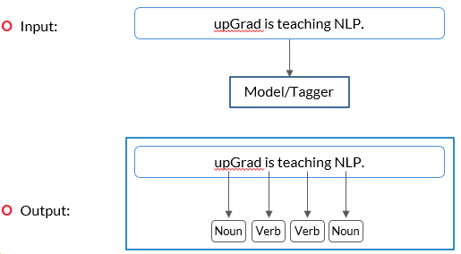  
   
   
You can refer to the ++[universal PoS tag](https://universaldependencies.org/docs/u/pos/index.html)++ list to find tags corresponding to their parts of speech and also refer to the alphabetical list of PoS tags used in the ++[Penn Treebank Project](https://www.ling.upenn.edu/courses/Fall_2003/ling001/penn_treebank_pos.html)++ which is being used by the SpaCy library.  
   
You have learnt the following two types of PoS taggers:  
* **Rule-based tagger:** Here, you assign the most frequent PoS tags that appear in the training data to the test data set. However, sometimes, it does not give satisfactory results because it does not incorporate the **context **of the word.  
* **Sequential tagger (Hidden Markov Model):** Sequence labelling is the task of assigning respective PoS tags of words in a sentence using the PoS tag of the previous word in that sentence.  
   
The Hidden Markov Model (HMM) can be used to perform sequence labelling, which means that it takes input of words in a sequence and assigns the PoS tags to each word based on the PoS tag of the previous word.   
   
Now, let’s take a look at the following points and try to understand why the Hidden Markov Model is called ‘hidden’:  
1. When you observe (read/listen) a sentence, you only observe the words in the sentence and not their PoS tags; thus, PoS tags are hidden.  
2. You must infer these hidden tags from your observations and that is why the Hidden Markov Model is called hidden.  
    
Before learning about HMM, you need to understand the two most important types of matrices, i.e., emission and transition matrices.  
* Emission matrix: This matrix contains all words of the corpus as row labels. The PoS tag is a column header and the values are the conditional probability values. This matrix contains the conditional probability that if a particular PoS tag is present at a given place in the training data set, then the value will be the probability that it will be a given word? The emission matrix looks like as follows:  
   
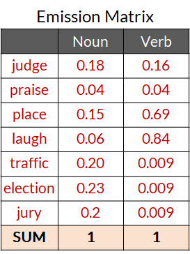  
   
For example, whenever a noun appears in the training corpus, there is an 18% chance that it will be the word ‘judge’. Similarly, whenever a verb appears in the training corpus, there is an 84% chance that it will be the word ‘laugh’.  
   
* **Transition matrix:** This matrix contains PoS tags in the column and row headers. Let’s try to understand the conditional probability values that have been given in the following table.  
   
Let’s take a look at the first row of the table. It represents that 0.26 is the probability of occurrence of a noun at the start of the sentence in the training data set. In the same way, 0.73 is the probability of occurrence of a verb at the start of the sentence in the training data set.  
   
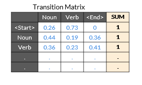  
   
Using these two matrices, you can calculate the probability of occurrence of PoS tags sequence in a given test sentence.  
   
**Python implementation**: After completing the theoretical part, you used the Spacy library to identify the PoS tag in a given sentence and completed two use cases:  
1. Heteronyms use case  
2. Feature extraction case study  
The important codes to correctly tag the tokens corresponding to their PoS tags is as follows:  
   
```
# Import SpaCy library
import spacy 

# Load pre-trained SpaCy model for performing basic 
# NLP tasks such as POS tagging, parsing, etc.
model = spacy.load("en_core_web_sm")

```
   
 Where,
**‘en’** stands for English language,
**‘core’ **stands for core NLP tasks such as lemmatization or PoS tagging,
**‘web’ **means a pre-built model of this library a trained from web source content such as blogs and social media comments, and
**‘sm’** means faster and smaller pipelines but less accurate. As a complement to ‘sm’, you can use ‘trf’ for larger and slower pipelines but are more accurate.  
```
#Use the model to process the input sentence
tokens = model("We all are learning NLP with Sumit.")

# Print the tokens and their respective PoS tags.
for token in tokens:
    print(token.text, "--", token.pos_, "--", token.tag_)

```
   
   
 Following is the link of Github repository to download all the code notebook that has been used in this session:  
   
++[Code Files and Data Github Repository](https://github.com/ContentUpgrad/Syntactic-Processing)++  
  
#diary over pain on top of shoulder.. just keep taking notes..finally no dizziness after iron tablet.. and realizing things..have taken 1/4th tablet.. take more to prepare well before exam.. cannot reschedule for another week.. physiotherapy more important.. move right shoulder less..  
  
Learn later.. when pain reduces.. listen..   
##   
##   
##   
  
  
why shallow parsing is not sufficient. Shallow parsing, as the name suggests, refers to  
fairly shallow levels of parsing such as POS tagging, chunking, etc.   
  
In the previous sessions, you learnt about the techniques of PoS tagging and explored some use cases of these techniques.  
   
In this session, you will learn about the following topics:  
* Parsing techniques such as :  
    * Dependency parsing  
    * Constituency parsing  
  
  
## Constituency Parsing  
  
  
By now, you learnt about PoS tagging in detail, which is, however, not enough for understanding the complex grammatical structures and ambiguities in sentences that most human languages consist of.  

A key task in syntactic processing is parsing. It means to break down a given sentence into its 'grammatical constituents'. Parsing is an important step in many applications that helps us better understand the linguistic structure of sentences.  

You need to learn techniques that can help you understand the grammatical structures of complex sentences. **Constituency parsing** and **dependency parsing** can help you achieve that.  

Let’s understand parsing through an example. Suppose you ask a question answering (QA) system, such as Amazon's Alexa or Apple's Siri, the following question.   

"Who won the FIFA World Cup in 2014?"  

The QA system can respond meaningfully only if it understands that the phrase **‘FIFA World Cup'** is related to the phrase **'in 2014'**. The phrase **'in 2014'** refers to a specific time frame and thus modifies the question significantly. Finding such dependencies or relations between the phrases of a sentence can be achieved using parsing techniques.  

Let's take another example sentence to understand how a parsed sentence looks like.   

"The quick brown fox jumps over the table."   

The figure given below shows the three main constituents of this sentence.   
   
   
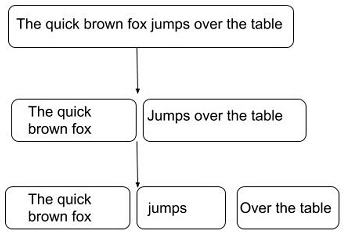  
   
   
This structure divides the sentence into the following three main constituents:  
* 'The quick brown fox', which is a noun phrase   
* 'jumps', which is a verb phrase  
* 'over the table', which is a prepositional phrase  
Let’s understand constituency parsing in detail in the next video.  
  
Constituents-> Grammatically meaningful Groups of words which together such as Noun Phrase(NP), a word or construction that is part of a larger construction.   
  
**Constituency parsing** is the process of identifying the constituents in a sentence and the relation between them.  
   
For example,* *“upGrad is a great platform.”  
   
Here, ‘upGrad’ is the noun phrase, and ‘is a great platform’ is the verb phrase.  
   
The figure shown below represents the parse tree that shows how parsers implement parsing based on grammar.  
   
   
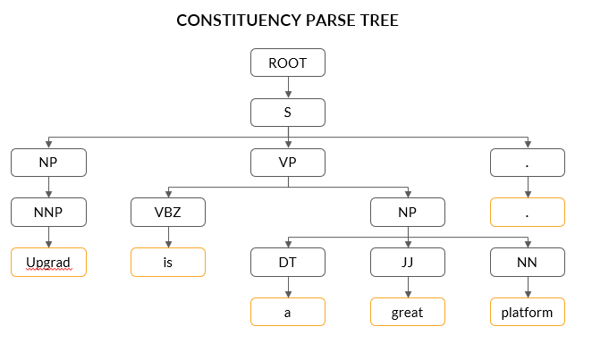  
   
To summarise the chart given above, a constituent parse tree can be divided into three levels, which are as follows:   
1. **Sentence constituent:**  
    * S (upGrad is a great platform)  
    * NP: Noun phrase (upGrad)   
    * VP: Verb phrase (is a great platform)   
2. **Sentence words:**  ‘upGrad’, ‘is’, ‘a’, ‘great’, ‘platform’  
3. **Part-of-speech tags**: NNP, VBZ, NP, DT, JJ, NN   
   
A constituency parse tree always contains the words of a sentence as its terminal nodes. Usually, each word has a parent node containing its part-of-speech tag (noun, adjective, verb, etc.).  

All the other non-terminal nodes represent the constituents of the sentence and are usually one of verb phrases, noun phrases or prepositional phrases (PP).  

In this example, at the first level below the root, the sentence has been split into a noun phrase, made up of the single word “upGrad” and a verb phrase “is a great platform”. This means that grammar contains a rule such as S -> NP VP, meaning that a sentence can be created with the concatenation of a noun phrase and a verb phrase.  

Similarly, the noun phrase is divided into a determiner, adjective and noun.  

To summarise, constituency parsing creates trees containing a syntactical representation of a sentence according to a context-free grammar rule. This representation is highly hierarchical and divides the sentences into its single phrasal constituents.  

In the next video, let’s hear from Sumit regarding where constituency parsing has been used and also take a look at some examples where constituency parsing does not provide sufficient interpretation of a sentence.  
  
As you saw in this video, constituency parsing has been used in word processing software, grammar checking software, question answering system, etc..   
   
In the video provided above, you also looked at the example ‘**We saw the Statue of Liberty flying over New York.**’ Although having the same arrangement of words, the sentence can be interpreted in the following two ways:  
1. Person saw that the ‘Statue of Liberty’ was flying.   
2. A person is flying over New York he/she saw ‘Statue of Liberty’ from the top.  
To understand ambiguity with a parse tree, let’s consider the following sentence.
         
 “Look at the man with one eye.”  
   
This sentence may have the following two meanings:   
1. Look at the man using only one of his eyes.  
2. Look at the man who has one eye.  
Their respective parse trees are shown in the figure given below.  
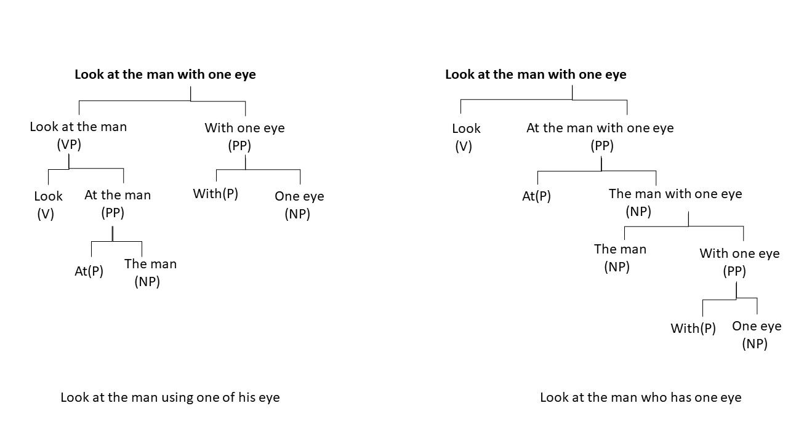  
   
   
There are two parse trees possible for this sentence; if we are able to identify the relationship among the words instead of looking at individual constituents or PoS tags, then understanding each word with other words will be easier, and the machine will be able to understand the syntax or meaning of the sentence better. This relationship structure can be drawn using the dependency parsing technique.  
   
In general, since natural languages are inherently ambiguous (at least for computers to understand), there are often cases where multiple parse trees are possible, such as those in the example provided above. So, to understand the relationship between different words, you need to use **dependency parsing**, which you will learn in the next segment.  
   
**Note**: You do not have to build these parse trees from scratch; there are various pre-trained models that you will use for your applications.  
   
In the next segment, you will learn about dependency parsing.  
   
Before you proceed further, Spend some time answering the question next.  
  
  
##   
## Dependency Parsing  
  
### Overview  
  
**Introduction to Dependency Parsing and Motivation**  
So after constituency passing, let us now focus our attention on another form of passing called dependency passing, and let us see how it differs from constituency passing.To understand the motivation behind dependency passing, let us recall our sentence from the previous slides.We saw Statue of Liberty flying over New York.We noted previously that this sentence could be interpreted in more than one way and hence could lead to ambiguity.Now let us rearrange the words in this sentence a little bit and see whether it can help us in resolving the ambiguity.So we rearrange the sentences like this.Flying over New York, we saw Statue of Liberty.So now this sentence is very precise and it has no ambiguity.So we noted that by rearranging the words in a sentence, ambiguity could be addressed or it could also be introduced.So the motivation for dependency passing comes from this observation.  
00:00:57 - 00:02:08  
**Understanding Dependency Parsing and Word Dependencies**  
In dependency passing, what we do is we don't worry about the order of the words or where a specific word is located in a given sentence.What we try to do is we try to uncover dependencies between individual pair of words in the given sentence.So for example, in this sentence, we'll try to figure out what is the dependence or what is the relation between the word flying and New York.It does not matter whether this phrase is in beginning of the sentence or end of the sentence.So if we can clearly define how flying is connected to New York, we can we can account for ambiguity in these different sentences.So as we discussed, dependency passing aims at uncovering the dependencies between individual pair of words in the given sentence and it does not depend on the order of these words in the sentence.So the phrases or the words can be in the beginning or in the end, it does not matter.What is important is how are these individual pairs of words are connected to each other or how they are dependent on each other.Now because of this, unlike constituency parsing, dependency parsing cannot help us in uncovering the overall structure and meaning of the complete sentence.  
00:02:11 - 00:03:10  
**Dependency Parse Tree Structure and Properties**  
Dependency parsing only identifies relations also known as dependencies between individual words in the sentence and as a result it produces a much concise representation of the information that is present in the sentence.So now we know what dependency parsing is trying to do.Now let us see how the output of dependency parsers is represented.Just like constituency parse trees, the output of dependency parsing is also organized in the form of a tree like structure which is known as a dependency parse tree.Now there are a couple of properties of these trees which we need to understand.First of all, in a dependency parse tree, each word is represented as a node in the parse tree.Next, there is only one node in the dependency parse tree that has no incoming arc or edge.Such a node is known as the root node of the dependency parse tree.Note that there can be only one root node in the dependency parse tree.  
00:03:10 - 00:05:17  
**Example of Dependency Parsing with Sentence Analysis**  
Now each non root node has exactly 1 incoming arc.Further there is a unique path from the root node to each of the non root nodes in the dependency parse tree.Now these definitions might look confusing.So let us now see an example to illustrate how a dependency parse tree looks like.So let us now understand the output of dependency parsing with the help of an example.So consider this sentence upgrade is a great platform.Now let us see how a dependency parser will analyze this sentence.So all the words in a sentence, they are mentioned along with the punctuation, which is the full stop here.So here we note that platform is the root node of the dependency pars tree.Also note that all these individual words, they'll have their associated part of speech text.So upgrade is a noun is a verb, a is a determiner, great is an adjective, and platform is a noun.Now what the dependency parser does is it says that platform is my root and it is connected to my punctuation by a relationship called punct which stands for punctuation.Then what it does it it says that the relationship of platform or the dependency of platform with the word great is specified by the tag called a which means an adjective modifier.That means great is an adjective which is modifying the property of the noun platform.So adjectives basically specify the properties of their associated nouns.For example, a beautiful car.So here beautiful is telling you the property of the noun word car.So likewise, in this sentence, the dependency parser is telling us that in the input sentence great is an adjective modifier denoted by the short form amod and it is associated with the noun platform in the input sentence.  
00:05:18 - 00:06:54  
**Dependency Parsing Tags and Universal Dependencies Project**  
So note that the parser is telling us that the adjective grade is not associated with the noun upgrade but only with the noun platform.Likewise, the parser tells us that the determiner A is again associated with the noun platform.Is is again associated with the platform.The connection or the dependency between the verb is and platform is denoted by a special class of tag called as cop which is the short form for copula.And then the parser tells us that the dependency between the noun upgrade and platform is mentioned by this relationship called nsubj which is subject.So essentially it is telling us that upgrade and platform are the subject of the sentences.Now as you have seen in this example, there are multiple tags that are used in the output of dependency parsers.So in many toolkits or in many off the shelf systems that you will find they are using the tags specified in the Universal Dependencies project.You can have a look at all the different tags that are used in the universal dependency set of tags for dependency parsing by going to the link that is mentioned in these slides.And you can see here that all the different tags such as N sub and subjective pass or D object or I object.There are different types of dependencies, there are different types of relationships that are specified.So you can browse through this documentation and go through the go through the definition and examples for each of the tags.  
  
  
### Detail  
  
Dependency parsing identifies the relation between words and produces a concise representation of these dependencies.   
   
In the example ‘upGrad is a great platform’, constituency parsing fails to explain how ‘great’ is related to the two nouns of the sentence ‘upGrad’ and ‘platform’. Is ‘great’ related more to ‘upGrad’ than to ‘platform’? Whereas, dependency parsing tells us that ‘great’ is a modifier of ‘platform’. Similarly for the two nouns, ‘upGrad’ is the subject of another noun ‘platform’.  
   
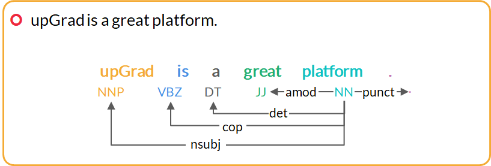  

You can take a look at the universal dependency tags ++[here ](https://universaldependencies.org/docs/en/dep/)++that spaCy uses.  

Now, let’s take another example of the dependency parse tree. It is as follows:  

Sentence: “Economic news had little effect on financial markets.”  

You can++[ visualise the dependency parse](https://explosion.ai/demos/displacy?text=Economic%20news%20had%20little%20effect%20on%20financial%20markets&model=en_core_web_sm&cpu=0&cph=0)++ of this sentence here. Also, in the diagram shown below, we have merged the phrases such as 'Economic news' and 'little effect'.
   
   
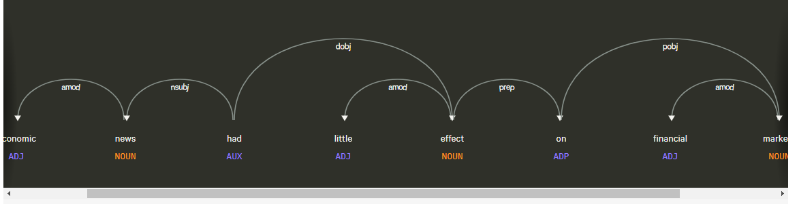  
   
   
Let’s identify the role of each word one by one, starting with the root verb.  
   
The word 'had' is the root.   
   
The phrase ‘Economic news’ is the nominal subject (nsubj).  
   
The phrase 'little effect' is the direct object (dobj) of the verb 'had'.  
   
The word 'on' is a preposition associated with 'little effect'.  
   
The noun phrase 'financial markets' is the object of 'on'.  
   

Now, let’s take a look at the role of each word in the parse.   
   
The word 'Economic' is the modifier of ‘news’.   
news -> amod -> economic  
   
The words ‘financial’ and ‘little’ modify the words 'markets' and 'effect', respectively.  
effect -> amod -> little
markets -> amod -> financial  
   
The two words ‘on’ and ‘markets’ have no incoming arcs. The word ‘on’ is dependent on the word ‘effect’ as a nominal modifier.  

effect -> prep -> on  
   
The word ‘markets’ is an object of the word ‘on’.
on -> pobj -> markets  
   
Moving further, you need to keep the following points in mind while understanding the dependency parse model:  
* Each word is a node in a parse tree.  
* There is exactly one node with no incoming arc (root).  
* Each non-root node has exactly one incoming arc.  
* There is a unique path from the root node to each non-root node.  
In this way, dependency parsers relate words to each other.  
   
**Note**: You do not have to build these parsers from scratch; there are various pre-trained models that you will use for your applications. However, it is important to be aware of how these parsers work.   
   
In the next segment, you will summarise all the learnings of PoS tagging, and constituency and dependency parsing.  
  
  
In the previous segments, you learnt about the basics of parsing which are the techniques that can help you understand the grammatical structures of complex sentences. Constituency parsing and dependency parsing can help you achieve that. Now, in this segment, you will learn about one of the applications of parsing in which you can use parsing to identify the active and passive sentences.  
   
Have you ever used the Grammarly or Hemingway applications to check grammar and spelling errors in your document or mail?   
   
Let’s look into the following snapshots of how these applications identify grammar and spelling errors.  
   
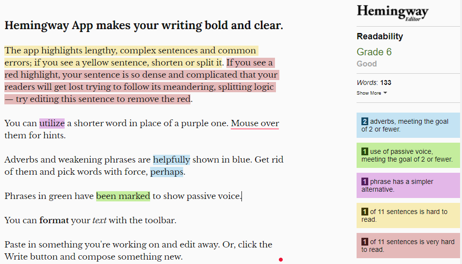  
   
Source:++[ https://hemingwayapp.com/](https://hemingwayapp.com/)++  
   
In the image, the Hemingway application identifies the various instances where the document needs to be corrected grammatically. You can also see that it suggests a better version of a sentence if that particular sentence is difficult to read (highlighted in pink). The green highlights tell us that the sentence is in a passive voice.  
   
The Grammarly application works in a similar manner. It is also a tool used to rectify grammar or spelling errors in a text corpus.   
   
   
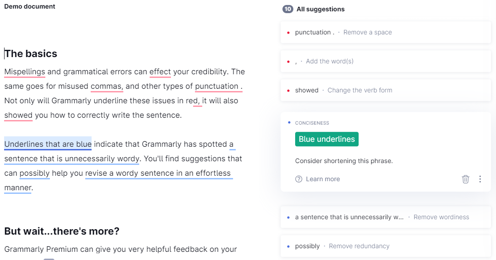  
   

Source: ++[https://app.grammarly.com/ddocs/677685883](https://app.grammarly.com/ddocs/677685883)++  
   
Now, it is always recommended to avoid using passive sentences in your text, document or email. So, here, you are going to design an application to identify whether a particular sentence is in active or passive voice.   
   
In the next couple of videos, you will use parsing as a technique to check whether a particular sentence is in active or passive voice.  
   
In the next video, Gunnvant will tell you how to create a dependency parse tree using SpaCy.  
   
You have been given the following Github link to download the well-commented notebook that has been used in the next video. We strongly recommend you to write the code along with the video so that you can have more hands-on practice.  
   
++[Code Files and Data Github Repository](https://github.com/ContentUpgrad/Syntactic-Processing)++  
  
  
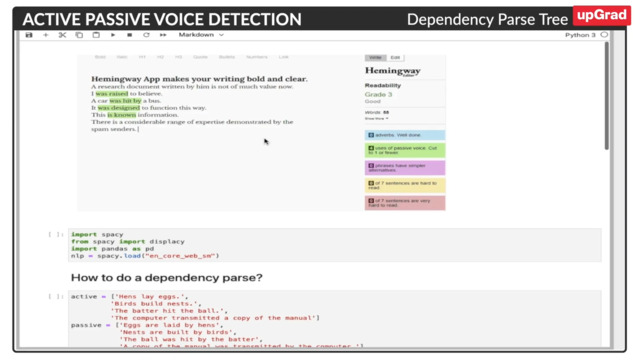  
  
  
Let’s try to understand the code one by one:  
**import** **spacy**  
**from** **spacy** **import** displacy  
**import** **pandas** **as** **pd**  
nlp = spacy.load("en_core_web_sm")  
   
In the very first step, you imported the spaCy library. Please note, the spaCy is an open-source library for advanced natural language processing. It helps you build applications that process and understand the text.  
   
You imported the ‘displacy’ library which is a modern syntactic dependency visualiser. You also saw the dependency parsing diagram in the previous segment for the following sentence.  
   
  
   
You can visualise the dependency parse tree as shown earlier using the ‘displacy’ library.  
After this, you loaded spacy.load("en_core_web_sm") in ‘nlp’. You can learn more about en_core_web_sm from this ++[link](https://spacy.io/models/en)++.  
   
After this, you defined some active and passive sentences as follows:  
active = ['Hens lay eggs.',  
         'Birds build nests.',  
         'The batter hit the ball.',  
         'The computer transmitted a copy of the manual']  
passive = ['Eggs are laid by hens',  
           'Nests are built by birds',  
           'The ball was hit by the batter',  
           'A copy of the manual was transmitted by the computer.']  
   
   
There are four active sentences and corresponding passive sentences. Now, let’s consider the very first sentence active[0] of the array ‘active’ and find its dependency tags using the following code lines.  
   
doc = nlp(active[0])  
for tok in doc:  
    print(tok.text,tok.dep_)  
   
So, you have parsed the ‘active[0]’ sentence through ‘en_core_web_sm’ and got the output as a list of tokens and their corresponding dependency tags.   

You can build its dependency tree structure using the ‘displacy’ as follows:  
   
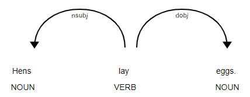  
   
Please note that to run the aforementioned code in Google Colab, you need to add  '***jupyter = True**** '*as follows:  
   
displacy.render(doc, style="dep" , jupyter=True)  

In the diagram, you can see that ‘Hens’ is related to ‘lay’ as ‘nsubj’ which means the nominal subject of the verb lay is ‘Hen’. In a similar manner, ‘eggs’ is related to the verb ‘lay’ as ‘dobj’ which means the direct object of the verb, i.e., ‘lay’ is ‘eggs’.  
   
In a similar way, you can create the dependency parse tree of all the sentences which are in ‘active’ and ‘passive’ arrays using the following lines of code.  
#Create the dependency parse tree of all the sentences in the ‘active’ array.  
**for** sent **in** active:  
    doc = nlp(sent)  
    displacy.render(doc, style="dep")  
   
#Create the dependency parse tree of all the sentences in the ‘passive’ array.  
**for** sent **in** passive:  
    doc = nlp(sent)  
    displacy.render(doc, style="dep")  
   
   
Let’s look into one of the dependency parse trees of a passive sentence.  
   
Sentence: ‘Nests are built by birds’.  
   
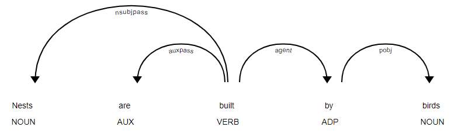  
   
You will notice that there is a ‘nsubjpass’ relation between a noun and a verb. In the sentence, ‘nests’ is the passive nominal subject of the verb ‘built’. You can read more about ‘nsubjpass’ in this ++[link ](https://universaldependencies.org/docs/en/dep/nsubjpass.html)++of universal dependencies tags.  
   
When you build the dependency parse tree of all the passive sentences, there is a presence of ‘nsubjpass’ dependency relation most of the time.   
   
Now, can we use this constraint to build a rule to identify a passive sentence? The answer is yes. You are going to build a rule to identify whether a particular sentence is passive or active in the next segment.  
   
**Please note that in other versions of SpaCy or Google Colab, you might observe that dependency tags and parse trees are slightly different.**  
   
Please note that the number of arrows emitting from a particular word of a sentence in the dependency parse tree are called the ‘**children**’ of that word. Suppose you have the following sentence:  
   
‘Nests are built by birds’.  
   
Then, the number of children for the word ‘built’ is three, which you can see in the dependency tree of this sentence. You can find the number of children using the following lines of code:  
import spacy
nlp = spacy.load("en_core_web_sm")
sent = "Nests are built by birds"
doc = nlp(sent)
len(list(doc[3].children))  
   
In a similar way, there is the concept of **parent**. In this sentence, the word ‘built’ is the parent of ‘nests’, ‘are’ and ‘by’ or the word ‘by’ is the parent of the word ‘birds’.  
  
In the previous segment, you learnt to create dependency parse trees using displacy to draw those parse trees. You have also seen that the parse tree for an active sentence is quite different from the parse tree of a passive sentence. The difference in the dependency parse tree of an active and a passive sentence can be used to create a rule to identify whether a particular sentence is active or a passive sentence.  
   
You have been given the following Github link to download the well-commented notebook that has been used in the next video. We strongly recommend you to write the code along with the video so that you can have more hands-on practice.  
   
++[Code Files and Data Github Repository](https://github.com/ContentUpgrad/Syntactic-Processing)++  
   
Let's watch Gunnvant in the next video describing how to create a rule to identify a passive sentence.  
  
So, let’s first create a rule to identify the NOUN PoS tag in a given sentence using ‘Matcher’ class as follows:  
doc = nlp(passive[**0**])##add passive[0] sentence to the variable doc  
  
rule = [{'POS':'NOUN'}]  
matcher = Matcher(nlp.vocab)  
matcher.add('Rule',[rule])  
   
   
Here, you have defined a dictionary object named ‘rule’ where the key to the dictionary is ‘POS’ and the value is NOUN corresponding to the key ‘PoS’. In the object ‘rule’, you have taken the NOUN as the value as you are trying to find out the nouns from the given sentence or ‘doc’.  
   
After you have created a dictionary, you will have to create an object named ‘matcher’ using Matcher class. The Matcher matches the sequences of tokens based on pattern rules. Similar to the example, you have defined a rule to identify the NOUN PoS tag then it will look into the sentence’s token and their PoS tags.   
   
Once you have defined the rule and created a ‘matcher’ object, you need to add this rule, i.e., ‘rule’ into the ‘matcher’ object.   
   
Now, you will have to apply the rule on the sentence using the following code to get the positions of the words in a sentence, i.e., ‘doc’ whose tag is NOUN which you have defined in the rule itself.  
   
matcher(doc)  
   
Let’s try to understand this line of code using the below sentence:  
   
‘Eggs are laid by hens’.  
   
There are two nouns ‘Eggs’ and ‘hens’ which are located at (0, 1) and (4, 5). This means that the word ‘eggs’ starts from index 0 and ends before index 1. In a similar way, the word ‘hens’ starts from index 4 and ends before index 5.  
   
So, once you get the position of the respective NOUN PoS tags, you can apply the following code to get the nouns:  
   
doc[0:1]  
doc[4:5]  

Similarly, let’s define the rules for passive voice using the following lines of code:  
   
passive_rule = [{'DEP':'nsubjpass'}]  
matcher = Matcher(nlp.vocab)  
matcher.add('Rule',[passive_rule])  
   
Here, you have defined a dictionary ‘passive_rule’ with the key value as ‘DEP’ and the value as ‘nsubjpass’. In the next step, you create an object ‘matcher’ from the ‘Matcher’ class. In the third line, you added the rule ‘passive_rule’ into this ‘matcher’ object to identify the word with ‘nsubjpass’ tag in the given sentence.  
   
Let’s apply this defined rule on ‘doc’ which is passive[0], i.e., ‘Eggs are laid by hens’, to get the location of those tokens whose dependency tag is ‘nsubjpass’ which you have defined in the rule.  
   
matcher(doc)  

The output of the code will be (0, 1).   
   
Let’s try to understand this output using an example. Consider the following sentence:  
‘Eggs are laid by hens’.  
   
In this sentence, only the word ‘Eggs’ has an ‘nsubjpass’ tag and it appears at the position of index value 0 and before the index value 1 in the ‘doc’.  
   
Now, let’s define a function to identify whether a function is passive or active.   
   
def is_passive(doc,matcher):  
    if len(matcher(doc))>0:  
        return True  
    else:  
        return False  
   
So, you have defined a very simple function which will return true if there is any value in the ‘matcher(doc)’.This means that this sentence, i.e., ‘doc’ is a passive sentence but it will return false if there are no values in ‘matcher(doc)’ which in turn means that ‘doc’ is an active sentence.   
   
Let’s first apply the defined function on all the active sentences which are present in the array ‘active’.  
**for** sent **in** active:  
    doc = nlp(sent)  
    print(is_passive(doc,matcher))  
   
   
As there will be no ‘nsubjpass’ tags in the active sentences, the ‘for’ loop will return all values as false for all four active sentences.   
   
Similarly, when you apply the function on all the passive sentences which are present in the array ‘passive’, you get all values as true for all four passive sentences as there will be a token at the location (0, 1) whose dependency tag will be ‘nsubjpass’.  
   
So, you have learnt how to identify whether a sentence is passive or active by implementing a simple rule.   
   
In the next segment, you will learn to implement the rule to identify the passive sentence in a given data set and will improvise that rule to get better results in most passive sentences.  
   
Let’s first look into the data set that Gunnvant has loaded in the dataframe named ‘active_passive’. 
   
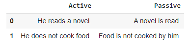  
   
As you can see in the image, there are two columns in the data set ‘Active’ and ‘Passive’. The ‘Active’ column contains around 40 sentences in active voice and the ‘Passive’ column contains the same sentences corresponding to the column ‘Active’ but in the passive voice.  
   
Let’s understand each step one by one.  
* Now, you divided the two columns into two separate data sets ‘active’ and ‘passive’ as follows:  
```
active = active_passive['Active']
passive = active_passive['Passive']

```
   
* Next, you created a rule to identify the passive sentences which you learnt in the previous segment.  
```
passive_rule = [{'DEP':'nsubjpass'}]
matcher = Matcher(nlp.vocab)
matcher.add('Rule',[passive_rule])

```
   
   
* Once you created the rule, next you created a function to check whether a sentence is in passive voice or not as follows:  
```
def is_passive(doc,matcher):
    if len(matcher(doc))>0:
        return True
    else:
        return False

```
   
   
* Let’s apply this rule to check whether a sentence is in active voice or not.  
   
```
cnt = 0
for sent in active:
    doc = nlp(sent)
    if not is_passive(doc,matcher):
        cnt += 1
print(cnt)

```
   
The output of these lines of code will be ‘40’, which means there are no passive sentences in the ‘active’ dataframe.  
   
Similarly, apply the rule to check whether a sentence is in passive voice or not. cnt = 0  
missed = []  
for sent in passive:  
    doc = nlp(sent)  
    if is_passive(doc,matcher):  
        cnt += 1  
    else:  
        missed.append(doc)  
print(cnt)  
   
missed[0]  
missed[1]  


  
   
The two sentences on which the rule was not valid or applicable are as follows:  
   
‘Is a table being bought by Ritika?’
‘Has apartment been left by them?’  
   
* When you visualise the dependency trees of these two sentences, you will find the following diagrams:  
   
```
for doc in missed:
    displacy.render(doc, style="dep")

```
   
   
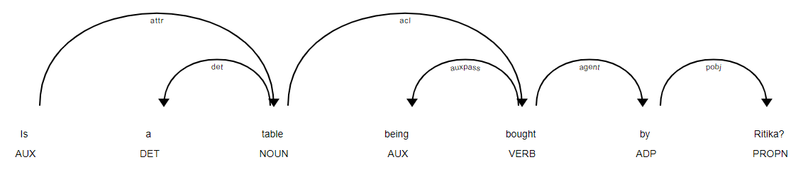  
   
   
   
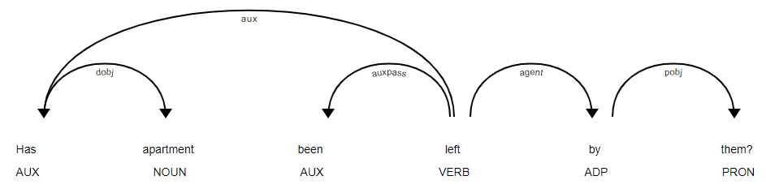  
   
As you can see in the diagram, these two sentences do not have the ‘nsubjpass’ tag. However, they have the ‘auxpass’ tag which can be used to create the rule to identify these sentences as passive sentences. You can refer to the universal dependencies tag in this ++[official link](https://universaldependencies.org/docs/en/dep/auxpass.html)++ to understand the ‘auxpass’ label. Therefore, we need to update the rule to incorporate these two sentences.  
   
Let’s define a new rule as follows:cnt = 0  
```
for sent in active:
    doc = nlp(sent)
    if not is_passive(doc,matcher):
        cnt += 1
print(cnt)




```
   
As you can see, a new condition called ‘auxpass’ has been incorporated in the rule.   
* Let’s once again check how many sentences have been identified correctly in ‘active’ and ‘passive’ dataframes.  
         Let’s check the ‘active’ sentences first using the following  lines of code:  
```
cnt = 0
for sent in active:
    doc = nlp(sent)
    if not is_passive(doc,matcher):
        cnt += 1
print(cnt)

```
   
The output of this code will be 40 which correctly identifies all the active sentences as non-passive.  
   
Let’s check the ‘passive’ sentences using the following lines of code:  
```
cnt = 0
missed = []
for sent in passive:
    doc = nlp(sent)
    if is_passive(doc,matcher):
        cnt += 1
    else:
        missed.append(doc)
print(cnt)

```
   
   
The output of this code will be 40, which correctly identifies all the passive sentences as passive.  
   
So, after improving the rule by adding a dependency tag ‘auxpass’, you get all the passive sentences correctly tagged.  
   
**Please note that in other versions of Spacy or Google Colab, you might observe that there is no need to apply the second rule, i.e., ‘nsubjpass’ and ‘auxpass’ and can identify the passive sentences even using the first rule, i.e., ‘nsubjpass’ only. Also, you can see that other versions of Spacy may result into different dependency parse trees structure.**  
   
Let’s summarise what you have learnt in this segment through the following points:  
* Always test your rules and heuristics on a larger corpus to see the effectiveness of the rules.  
* One can write intricate matching rules using ‘matcher’ objects.  
  
  
  
Summary:  
  
  
In this session, you learnt about commonly used parsing techniques which are constituency parsing and dependency parsing and its python implementation.  
   
* **Constituency parsing:** It is the process of identifying the constituents in a sentence and the relation between them.  
For example, ‘upGrad is a great platform’.  
   
Here, ‘**upGrad**’ is the noun phrase, and ‘**is a great platform**’ is the verb phrase.  
   
The following figure represents the parse tree that shows how parsers implement parsing based on grammar.  
   
  
   
To summarise this chart, a constituent parse tree can be divided into three levels, which are as follows:   

**1.  Sentence constituent:**
  S (upGrad is a great platform)
  NP: Noun phrase (upGrad) 
  VP: Verb phrase (is a great platform) 
**2.  Sentence words**: ‘upGrad’, ‘is’, ‘a’, ‘great’, ‘platform’
**3. Part-of-speech tags**: NNP, VBZ, NP, DT, JJ and NN    

Since natural languages are inherently ambiguous (at least for computers to understand), often, there are cases where multiple parse trees are possible such as those in the example provided earlier. So, to understand the relationship between different words, you need to use **dependency parsing**.  
   
* **Dependency parsing**: Dependency parsing identifies the relation between words and produces a concise representation of these dependencies.   
   
In the example ‘upGrad is a great platform’, constituency parsing fails to explain how ‘great’ is related to the two nouns ‘upGrad’ and ‘platform’. Is ‘great’ related more to ‘upGrad’ than to ‘platform’? On the other hand, dependency parsing tells us that ‘great’ is a modifier of ‘platform’. Similarly, for the two nouns, ‘upGrad’ is the subject of another noun ‘platform’.  
   
   
  
   
   
You can take a look at the universal dependency tags that SpaCy uses ++[here](https://universaldependencies.org/docs/en/dep/)++. You can++[ visualise the dependency parse of this sentence here.](https://explosion.ai/demos/displacy?text=Economic%20news%20had%20little%20effect%20on%20financial%20markets&model=en_core_web_sm&cpu=0&cph=0)++  
   
* **Python implementation:** In the last few segments, you learnt to implement dependency parsing using Spacy and implemented a use case to identify the passive sentences. You need to remember the following lines of code:# import libraries  
```
import spacy
from spacy import displacy
nlp = spacy.load("en_core_web_sm")
 
    #define a sentence,
sent = ‘Hens lay eggs.'
 
# Print the dependency tags and respective tokens of the sentence.
doc = nlp(sent)
for tok in doc:
    print(tok.text,tok.dep_)
 
# print the dependency diagram
displacy.render(doc, style="dep")



 

```
   
  
  
  
You have now completed the two sessions on the basics of syntactic processing, PoS tagging and parsing and their python implementation.  
   
Please download all the code notebooks from the Github link below for your reference.  
   
++[Code Files and Data Github Repository](https://github.com/ContentUpgrad/Syntactic-Processing)++  
   
In the next session you will be introduced to Name Entity Recognition (NER) and custom NER using Conditional Random Fields (CRF) model technique.  
  
  
  
  
## Information Extraction  
   
**Named Entity Recognition (NER) **enables you to easily identify the key elements in a piece of text, such as a person’s name, locations, brands, monetary values, dates and so on.   
   
Some example sentences with their named-entity recognition are as follows:  
   
Note that GPE is short for the geopolitical entity, ORG is short for organisation and PER is short for a person.  
   
S: ‘Why is Australia burning?’
**NER**:   ‘Why is Australia[GPE] burning?’  

S: ‘UK exits EU’
**NER**:  ‘UK[GPE] exits EU[ORG]’
 
S: ‘Joe Biden intends to create easier immigration systems to dismantle Trump's legacy’
**NER**: ‘Joe Biden[PER] intends to create easier immigration systems to dismantle Trump's[PER] legacy’
 
S: ‘First quarter GDP contracts by 23.9%’
**NER**: ‘First quarter[DATE] GDP contracts by 23.9%[PERCENT]’  
   
Let’s watch the next video to learn more about Named Entities.  
  
  
As you learnt in the video above, NER techniques are applied in various fields such as search engine, chatbot and mainly in entity extraction in the long texts such as reviews, books, blogs and comments.  
   
****Named Entity Recognition (NER) enables you to easily identify the key elements in a piece of text, such as a person’s name, locations, brands, monetary values, dates and so on. ****  
   
Some example sentences with their named-entity recognition are as follows:  
   
Note that GPE is short for the geopolitical entity, ORG is short for organisation and PER is short for a person.  
   
S: ‘Why is Australia burning?’
**NER**:   ‘Why is Australia[GPE] burning?’  

S: ‘UK exits EU’
**NER**:  ‘UK[GPE] exits EU[ORG]’
 
S: ‘Joe Biden intends to create easier immigration systems to dismantle Trump's legacy’
**NER**: ‘Joe Biden[PER] intends to create easier immigration systems to dismantle Trump's[PER] legacy’
 
S: ‘First quarter GDP contracts by 23.9%’
**NER**: ‘First quarter[DATE] GDP contracts by 23.9%[PERCENT]’  
   
  
  
  
  
  
Spacy is pretrained and may not be sufficient.. build our own model  
ome commonly used entity types are as follows:  
   
*  **PER**: Name of a person (John, James, Sachin Tendulkar)  
*  **GPE**: Geopolitical entity (Europe, India, China)  
*  **ORG**: Organisation (WHO, upGrad, Google)  
*  **LOC**: Location (River, forest, country name)  
   
In this course, we will be using the Spacy toolkit for NER tasks. Spacy contains predefined entity types and pretrained models, which makes our task easier. However, at times these, off-shelf toolkits may not be sufficient for some applications. So, to resolve this issue, you will also learn about some custom NER techniques to build your own NER tagger using the Conditional Random Fields (CRF) model.  
   
In the next segment, you will learn how the NER system works.  
   
Before you proceed further, Spend some time answering the question next.  
  
  
**Noun PoS tags:** Most entities are noun PoS tags. However, extracting noun PoS tags is not enough because in some cases, this technique provides ambiguous results.   
   
Let’s consider the following two sentences:  
   
S1: ‘Java is an Island in Indonesia.’  
   
S2: ‘Java is a programming language.’  
   
PoS tagging only identifies ‘Java’ as a noun in both these sentences and fails to indicate that in the first case, ‘Java’ signifies a location and in the second case, it signifies a programming language.  
   
A similar example can be ‘**Apple**’. PoS tagging fails to identify that ‘Apple’ could either be an organisation or a fruit.  
   
Let’s take a look at a simple rule-based NER tagger.  
   
**Simple rule-based NER tagger:** This is another approach to building an NER system. It involves defining simple rules such as identification of faculty entities by searching ‘PhD’ in the prefix of a person's name.  
   
However, such rules are not complete by themselves because they only work on selected use cases. There will always be some ambiguity in such rules.   
   
Therefore, to overcome these two issues, Machine Learning techniques can be used in detecting named entities in text.  
   
In the next segment, you will learn about the IOB format and how NER can be looked at as a sequence labeling task, which is the basis of machine learning in named entity recognition tasks.  
   
Before you proceed further, Spend some time answering the question next.  
  
  
As you learnt in the previous segment, machine learning can prove to be a helpful strategy in named entity recognition. So, before understanding how exactly ML is used in the NER system, you will learn about IOB labelling and sequence labelling related to the NER system.  
   
**IOB (inside-outside-beginning) labelling** is one of many popular formats in which the training data for creating a custom NER is stored. IOB labels are manually generated.  

This helps to identify entities that are made of a combination of words like ‘Indian Institute of Technology’, ‘New York’ and ‘Mohandas KaramChand Gandhi’.  
   
uppose you want your system to read words such as ‘Mohandas Karamchand Gandhi', ‘American Express’ and ‘New Delhi’ as single entities. For this, you need to identify each word of the entire name as the PER (person) entity type in the case of, say, ‘Mohandas Karamchand Gandhi'. However, since there are three words in this name, you will need to differentiate them using IOB tags.  

The IOB format tags each token in the sentence with one of the following three labels: I - inside (the entity), O - outside (the entity) and B - at the beginning (of entity). IOB labelling can be especially helpful when the entities contain multiple words.   

So, in the case of ‘Mohandas Karamchand Gandhi', the system will tag ‘Mohandas’ as B-PER, ‘Karamchand’ as I-PER and ‘Gandhi' as I-PER. Also, the words outside the entity ‘Mohandas Karamchand Gandhi' will be tagged as ‘O’.  
   
**Consider the following example for IOB labelling:**
Sentence: ‘Donald Trump visit New Delhi on February 25, 2020 ”  
   

| Donald | Trump | visit | New | Delhi | on | February | 25 | , | 2020 |
| -------- | -------- | ----- | ----- | ----- | -- | -------- | ------ | ------ | ------ |
| B-Person | I-Person | O | B-GPE | I-GPE | O | B-Date | I-Date | I-Date | I-Date |
  

In the example above, the first word of more than one-word entities starts with a B label, and the next words of that entity are labelled as I, and other words are labelled as O.  
   
**Note that you will not always find the IOB format only in all applications. You may encounter some other labelling methods as well. So, the type of labelling method to be used depends on the scenario. **Let's take a look at an example of a healthcare data set where the labelling contains 'D', 'T', and 'O', which stand for disease, treatment and others, respectively.  

S: ‘In[O] the[O] initial[O] stage[O], Cancer[D] can[O] be[O] treated[O] using[O] Chemotherapy[T]’  
   
In the next segment, you will learn about the pre-trained models for NER in Spacy using Python.  
  
  
Demonstration in python  
  
In previous segments, we covered the theory part of named entity recognition. You learnt about named entity types, the benefits of NER tagging over PoS tagging and IOB tags. Before we discuss how a machine learning model can be trained to do NER, let us first look at a practical application of NER.  
   
We will use the python library spacy, which comes pre-built with NER tagger.  
   
The well-commented notebook used in the next couple of videos which you can download from the below Github link. We strongly recommend you to write the code as you watch the videos for a better understanding.  
   
++[Code Files and Data Github Repository](https://github.com/ContentUpgrad/Syntactic-Processing)++  
  
  
As you saw in the video, to understand the query, a search engine first tries to find the named entity used in the query, and then corresponding to that entity, it displays the appropriate searches to the user. Named entity recognition is one of the aspects of the search engine mechanism.  
   
You obtained PoS tags of the following sentence:  
   
‘Sumit[PROPN] is[AUX] an[DET] adjunct[ADJ] faculty[NOUN] at[ADP] UpGrad[PROPN].’   
   
However, PoS tagging failed to distinguish between ‘Sumit’ and ‘UpGrad'.   
   
According to PoS tagging, both ‘Sumit’ and ‘UpGrad’ are proper nouns. In the next video, you will see how NER is able to differentiate between ‘Sumit’ and ‘UpGrad’.  
  
  
Note: At the timestamp 3:10, Sumit mistakenly says ‘Pronoun’ instead of ‘Proper noun’.  
   
Like PoS tagging, you can also find the named entities present in a sentence using the following code:  
**import** **spacy** # import spacy module  
model = spacy.load("en_core_web_sm") #load pre-trained model  
doc = "Any sentence"  
   
processed_doc = model(doc); #process input and perform NLP tasks  
**for** ent **in** processed_doc.ents:  
  print(ent.text, " -- ", ent.start_char, " -- ", ent.end_char, " -- ", ent.label_)  
 
After processing the model over ‘doc’, we got ‘processed_doc’, which contains an attribute called ‘ents’, which contains all the entities that identify with the Spacy NER system. So, the code above iterates over every token of the sentence and provides the corresponding entity associated with that token that was identified by the Spacy-trained model.
 
You might have also noticed that the entity types of ‘Sumit’ and Upgrad in the following two sentences are different
 
‘Sumit is an adjunct faculty of Upgrad[GPE].’
 
‘Dr. Sumit[PERSON] is an adjunct faculty of Upgrad[ORG]’
 
In the second sentence, the model successfully finds both the entities, but in the first sentence, it fails to identify ‘Sumit’. The reason for this could be that ‘Sumit’ is not present in the corpus on which the model was trained. However, adding ‘Dr’ as a prefix indicates the model that the next word is a person. Based on these observations, we can conclude that there are various situations where systems make errors  depending on the application.
 
Let’s now consider a practical application of NER systems.   

**Anonymisation of data and redacting personally-identifying information**  
In many scenarios, we would want to withhold sensitive and confidential information such as names of persons, dates and amounts.   

Suppose you are asked to write a program that can anonymise people’s names in many emails for confidential purposes.
For this task, we can use NER techniques to automatically identify PERSONS in the text and remove PERSON names from the text.
 
Let’s watch the next video to learn how this can be done based on your learnings so far. Note: we will take the example of emails from the Enron email data set for illustration in this demo.
 
- ++[Email source](http://www.enron-mail.com/email/lay-k/elizabeth/Christmas_in_Aspen_4.html)++
- ++[Complete Enron data](http://www.enron-mail.com/)++  
  
#todo CRF Conditional Random Field and revise yesterday..  
  
  
In this module, you have learnt the following three areas of syntactic processing:  
   
1. What is syntax and syntactic processing  
2. PoS tagging:  
3. Parsing  
4. Name Entity Recognition (NER)  
5. Custom NER and Conditional Random Fields (CRF)  
   
**Note**: ++[Spacy ](https://spacy.io/)++is an open-source library used for advanced natural language processing, (similar to NLTK) which you have used in lexical processing which you have used in the entire module.  
   
* **Syntax and syntactic processing**: Syntax is a set of rules that govern the arrangement of words and phrases to form a meaningful and well-formed sentence. Syntactic processing is a subset of NLP that deals with the syntax of the language.  
   
* **Parts of speech**: Parts of speech (PoS) are the groups or classes of words that have similar grammatical properties and play similar roles in a sentence. They are defined based on their relation to the neighbouring words. Assigning the correct PoS tags helps us better understand the intended meaning of a phrase or a sentence and is thus a crucial part of syntactic processing. In fact, all the subsequent parsing techniques (constituency parsing, dependency parsing, etc.) use the PoS tags to parse a sentence.   
   
* You have learnt the following two types of PoS taggers:  
1. **Rule-based tagger:** Here, you assign the most frequent PoS tags that appear in the training data to the test data set. However, sometimes, it does not give satisfactory results because it does not incorporate the **context **of the word.  
2. **Sequential tagger (Hidden Markov Model):** Sequence labelling is the task of assigning respective PoS tags of words in a sentence using the PoS tag of the previous word in that sentence. The Hidden Markov Model (HMM) can be used to perform sequence labelling, which means that it takes input of words in a sequence and assigns the PoS tags to each word based on the PoS tag of the previous word.  
   
* You can refer to the ++[universal PoS tag](https://universaldependencies.org/docs/u/pos/index.html)++ list to find tags corresponding to their parts of speech and also refer to the alphabetical list of PoS tags used in the ++[Penn Treebank Project](https://www.ling.upenn.edu/courses/Fall_2003/ling001/penn_treebank_pos.html)++ which is being used by the SpaCy library.  
   
* **Parsing**: There are two types of parsing technique:  
1. **Constituency parsing:** It is the process of identifying the constituents in a sentence and the relation between them.   
2. **Dependency parsing**: Dependency parsing identifies the relation between words and produces a concise representation of these dependencies.  Please have a look at the following dependency parsing diagram.  
   
  
   
* You can take a look at the universal dependency tags that SpaCy uses ++[here](https://universaldependencies.org/docs/en/dep/)++. You can++[ visualise the dependency parse of this sentence here.](https://explosion.ai/demos/displacy?text=Economic%20news%20had%20little%20effect%20on%20financial%20markets&model=en_core_web_sm&cpu=0&cph=0)++  
   
* **Name Entity Recognition:** NER is the technique to identify the entities in the corpus. It helps you easily identify the key elements in a text, such as a person’s names, location, brands, monetary values and dates.   
   
* **NER a Sequence Labelling Problem and IOB tags:** Instead of using nouns, verbs, etc., we will use the inside-outside-beginning (IOB) tags for entities that provide more relevant information about the text. Note that you will not always find the IOB format only in all applications. You may encounter some other labelling methods as well. So, the type of labelling method to be used depends on the scenario. Let's take a look at an example of a healthcare data set where the labelling contains 'D', 'T', and 'O', which stand for disease, treatment and others, respectively.
   
* **Conditional Random Field: **Please refer to the following image as an overview of the entire CRF model building process. CRF model is used in custom NER application where you define your own features and create your own NER tagger based on the application.  
   
   
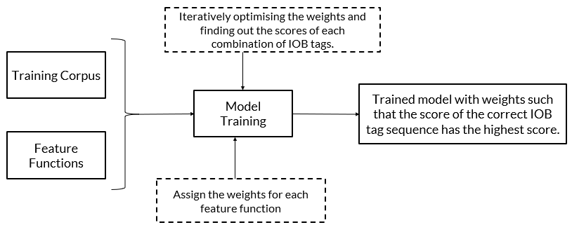  
   
   
   
For reference, please download the lecture notes of this module from below:  
  
  
  
**Introduction to POS Tagging and Session Overview**  
Hello Sir.Good morning.My name is Manish.I'll be the moderator for this session.In case you face any difficulties, you can reach out to me.I'm sharing my number in the chat.Sure.Am I audible?Yes Sir, you are audible.Request you to kindly confirm if you have received my number.Yeah.Hi Manish.Right here.Thank you, Sir.Thank you.Are we expecting few more learners?Shall we wait for 2-3 more minutes?I already see 8 learners.None.The hi, we'll just give one more minute while others join.Meanwhile, I'll just share my screen and keep it ready.Yeah.Good morning, Neeraj.Good morning, Priya.So you're able to see my screen, Please confirm.You should be able to see me and hear me as well.Yeah, perfect.Thanks for your confirmation.Yeah, we waited for a few minutes.Let's start.We have a good number of people already.I'm just giving one or two links which may be useful for you while we speak here.OK.Yeah, very good morning to you all.Doctor Sunil here who is agent faculty at Triple IT.So by profession, I work as a VPN head of AI in an organization.And then I have passion for teaching and that's the reason I am doing these or the weekends mainly to bridge the gap in terms of practical expectations and theory part.What we do, what we really see is in terms of your learning process.I'm sure you have a lot of content which is already shared to you in in the form of videos, in the form of articles, all that I'm sure you might have gone through.So the main purpose here for us is to see you have any specific questions which we need to address.That's why good amount of time in these two hours we will dedicate to your Q&A.  
00:23:16 - 00:25:01  
**Advances in NLP and POS Tagging with NLTK**  
Before that we will just talk about the conceptual understanding of this POS tagging today.OK, Audio, is there any issue?Let me just can you others confirm Misha has some issue, others were able to hear me right.Yeah, maybe you can rejoin and I'm sure.So that should be fine.Yeah, thank you.So what we are going to do in this today's session is in the part of NLP natural language processing.We see a lot of advances in the last five years, right.So this is kind of a standard topic for us, POS stacking parts of speech stacking point of it in understanding the grammar and all that.So how things are happening from a traditional way, how do you use the NLTK library?So let me go to the agenda and then I'll take a pause at the time after sharing with you what we are going to cover.So at the end of this, you should be able to install Analytic A, able to use the Analytic A for your parts of speech tagging.So we will cover all the WH question in terms of what is parts of speech tagging, why it is, why is it important where we are going to use it, how we are going to do that, all the WH questions along with the plus how right we will talk about.That's where the conceptual revision and we will start at the maybe a 10,000 feet level high, not just directly jumping into POS tagging point of it in terms of where it fits in the entire landscape of progress.What we talk about symmetactic analysis, lexical analysis, then pragmatic analysis.  
00:25:01 - 00:25:57  
**Conceptual Revision of POS Tagging**  
Some you might have heard, some we will talk about so that you will get a good understanding of what's the state-of-the-art as we speak now.And some of them are in terms of NLTK, parts of speech tagging kind of matured, right, So a couple of years ago itself.What more you can do using this is food for thought for us, right?So I will talk on that level.Then we will go into the internal details from a conceptual level.We're not talking too much of math.So we try to just do the balance in terms of understanding clearly on the conceptual point of it and the programming point of it.So we'll go line by line from a demo of an LTK.So I'll share the anyway the notebook at the end I can, it's not very big notebook value.If you want to do parallel with me also, you can do it or you can just follow line by line and then we'll have a separate out resolution towards them.But we don't really require wait till the end.  
00:25:57 - 00:27:03  
**NLP Pipeline and POS Tagging in Context**  
I will take at least 3-4 pauses during our session delivery itself.Then you can ask.It's not very big cohort, so we should be able to answer most of your questions.If it is taking time for any reason, maybe I will request, OK, let's finish the flow and then I will definitely answer towards the end.OK, so this is what we are planning for today.So anything else you are expecting in this session or are we good from the flow point of it?Once you confirm, we can just jump to the topic.Are we good with the flow?Sure.So then yeah, thanks for your responses.At least a lot of active people are there.So please keep flowing in when we are requesting for any answer point of it that will help me in terms of where are you.And then if you are very familiar with that particular point, then I will just skim through and then we have enough topics to cover there as well.  
00:27:03 - 00:28:36  
**Lexical Analysis and Parts of Speech Tagging**  
OK.So if you go further on that, OK, so this is what I was talking about before we go to the parts of speech tagging, let me give you a big landscape kind of a thing.So where even the parts of speech is also part of it, right?So if you see a statement here, a dog is chasing a boy on the playground.So you can see a imaginative picture kind of thing.Maybe if you give a dog is chasing a boy on the playground to your generative AI Kanva or any of them, it can beautifully have picturize with its imagination a park kind of or maybe a playground.Then a boy being chased by a dog, it can give a creative image also, right?With the keeping this as A tag.I'm sure you can.You might have tried creating a lot of generative images.OK, that is also good application of generative AI text to the image point of it.But what we are talking now is let let it be the text as is and we can do at least five different analysis.Some of them are matured, some of them are state-of-the-art as the research is going on South.If I go one by one on that 12345, let me put the numbering also so that you will be able to follow me.So first one itself is the lexical analysis.So what does that mean is parts of speech tagging, POS tagging, what does that mean?So each of them from a English grammatical point of it.  
00:28:36 - 00:30:27  
**POS Tagging and Grammar Understanding**  
If I ask any school kid as well who understand the English grammar point of it because it depends on the language and the grammar.So if it is English, yes, we will put it as yes.Determiner, then a noun, not very verb, noun prep.OK, so how many these different types are there?OK, I just pinged you one link.If you see that, maybe I will do one more time if you just open that.So we know already known at least some of the basic things we know.OK, suppose if I just open there are multiple things like this, but I'm just putting in the alphabetical order of parts of speech tagging from Penn Treebank project point of there are different people may give in a different style.So more or less we have around 36 here.So some other parts of speech tagging may have few more, right?But the basics things are covered here in terms of what you are already aware of article, then verb, proposition, conjunction or maybe the noun pronoun.So these are the common things, right?So what you can see here now maybe if you are able to see how many of them you were able to see in the link what I have given, how many POS taggings you can see there.I'm not showing that screen to you, but you can open in your screen itself and then confirm.Yeah, 36 you are able to see good.OK, so out of this 36 also if I ask you how many of them are verb related verb, so I can see at least a verb waste form past tense, then present participle, past participle, non third person, singular present, third person singular present.  
00:30:27 - 00:31:05  
**Tokenization and Preprocessing in NLP**  
How many of them you can see from the verb perspective, you can see six, right?So like that, even if I talk about noun, you can see noun singular armas or noun plural NN and NNS and a proper noun singular, proper noun plural like that, four of them.So like that it's not just only 7-8, what we typically use may be from the third party point of it, tense point of it, they have few more which can be helpful for the analysis point of it.Right.So any basic English grammar point of it we will be able to relate it to.  
00:31:05 - 00:32:11  
**Challenges in POS Tagging: Sarcasm and Ambiguity**  
But only thing is there are divisions.It is not just only noun within noun also we know noun also proper noun, then we know the common noun and proper noun kind of a thing, right?So like that we do have different types of singular floral kind of a thing as well, right?So adverb as well, we can see.So these are the typical things and then that's what it is called as lexical analysis, which is basis for us in terms of understanding what is the meaning of it, right?So this is the we are not just if you are stopping at the parts of speech tag and then you can challenge and just what is the so So what?Right, Yes, I'll identify this as a noun verb this and all So what, right.So we'll have identify object, predicate and subject all that.So now if you see there, the analysis is not stopping there if you see the screen, right?So that's the good starting point.On top of it, what we are doing, we are able to do specifically some more analysis in terms of let us say syntactic analysis, which is parsing.  
00:32:11 - 00:33:01  
**POS Tagging Methodologies: Rule-Based and Statistical**  
So something like a second level.Then third level we are going to do a pragmatic analysis, sorry.So third we will go with the semantic, then 4th we will go with the inference.The last one is little complicated.That is what the pragmatic analysis, OK, So the second syntactic analysis, what we are doing, we are passing that, OK?We are grouping some of them, OK, A dog, it can be a subject, OK, then and what are the noun phrases?We are able to combine that and then able to go till a sentence point of it here, right?That's what the syntactic analysis is.But when you go to the semantic analysis after doing this parts of speech tagging, then we are trying to identify who are all the nouns, OK, maybe dog and boy, then what, where they are, OK, maybe in the playground, what is the action happening?  
00:33:02 - 00:34:04  
**Neural Network Approaches in POS Tagging**  
Chasing, OK, so it is trying to interpret the meaning of it.That's where the semantic thing after that even 1st 123, I'll say it is a little mature as we speak now, but the last two steps in terms of four and five, the inference out of it, right?The inference out of that especially OK if chasing maybe there is a situation of scariness, OK or scared is can be an inference.Yes, it is good, but who is scared here?OK, Is it boy scared or because dog is scared it is chasing OK that we can leave it to the interpretation, but based on if you have some more context on that, then you can do much more better inference.But as of now also you can do with the limited information also scared.Then the last one is it is not stopping at an inference.It is trying to visualize just like in your generative image.If you are trying to visualize, it is trying to see who are the people saying this to whom.  
00:34:04 - 00:35:05  
**Hybrid Approaches in POS Tagging**  
Also there may be a little what you say confusion also in that.What does that mean?Maybe a third person is telling a dog owner that OK, see your dog is chasing a boy, or the third person is talking to the parent of a boy or a guardian of the boy that OK dog is chasing a boy on the playground.Or you can you can imagine little more as well on that right?A person saying this may be reminding another person to get the dog back OK or to save the boy, whichever is easy.So can you see the difference in terms of the complexity of it?One is straightforward in terms of parts of speech tagging.Then we are able to do the analysis of syntax.Then we are going ahead with the semantic thing.After that, the inference and pragmatic analysis point of it.It is subject to little creativity or maybe some more imagination or some more context can give you the analysis for you.  
00:35:05 - 00:35:58  
**Rule-Based POS Tagging: Steps and Evaluation**  
OK, so this is what the state of that when we talk about the NLP pipeline which is there from last few years, but we see a tremendous growth in terms of yeah 123 and slowly mature then four and five also.We see good input and this is becoming input to the Gen.AI also because the same thing if you just do the lexical analysis and do a creative drawing, it may not look good, right?So, but if you are able to do some kind of inference and then that can give you expressions that can give you little more edge in terms of not just drawing for the sake of it, little more liveliness will come into the image.So does it make sense what we are talking about?Any questions so far?Is the space OK?We're able to follow?Just a quick check.Perfect.  
00:36:11 - 00:37:02  
**Statistical POS Tagging: HMM and CRF**  
Got it.OK.So when we talk about this particular one and then next we'll go into the with that intro on where we are here, right from POS tagging point of it.So let's talk from the application what we already talked about, what is the definition and what is the purpose of it, right?So the POS parts of speech which is in the real world application, what happens, the starting point can be a text or it can be speech as the name indicates parts of speech point of it, it can be somebody's speech and it speech to text conversion is also much matured especially in English point of it, even the lot of languages including Indian languages.  
00:37:02 - 00:38:08  
**Applications of POS Tagging in NLP**  
Also there's a good number of research projects which are mature right now, right, which may be useful from the translation purpose or maybe conversational purpose.Now we are seeing a lot of chart bars.So this is the basis for all the activities what you are seeing as well in multiple languages.So when we talk about this parts of speech tagging, what it really assigns is a grammatical categories to the words.That's where the noun verb, what you are seeing, which aids the machines in understanding sentence structure and meaning, especially noun web kind of a thing.And you know, in terms of compared to an image, the sentence understanding sometimes is tricky because the statement, OK, if I say the sun rises in the east, it's very straightforward statement kind of a thing, right?But just like what I talked about, a dog is chasing, OK, now a boy on the playground.So or there may be some more.I went to a, a bank, OK, If I just mention that, which bank is it a river bank or a financial bank kind of a thing, right?  
00:38:08 - 00:39:07  
**Challenges in POS Tagging: Ambiguity and Idioms**  
So what you are seeing there is there is some kind of an ambiguity also possible in the NLP point of it.That's where this is sarcasm is also there.So sarcasm, hopefully you understand, right.So we are saying something in this line, but the internal meaning of it, it may be looking completely opposite.If you literally translate it may give you a meaning, but sarcasm point of it is still a open research problem.Do you need to identify whether it is really given in a sarcastic way?Is the true meaning of what it is there can be interpreted, right?So those kind of complexities still exist.But still we do have good amount of progress in terms of how we are able to identify the sentence structures.What are the applications?Yes, as we mentioned machine translation.So if you see the machine translation now, maybe in your real life examples, right, What are the things which you are using?  
00:39:07 - 00:40:04  
**POS Tagging Process: Tokenization to Evaluation**  
Maybe you were using earlier, now you are using.Are you happy with the translation as we speak now?At least I'm using from past 10 years.Initially I'm not happy with the results what we are getting.But if you're really using the translation now, are you happy or not with the present state-of-the-art?You may be using Google translator or any of your favorite kind of a thing.So is it?Are you seeing good maturity in the translation kind of applications if you're ever using that, right?So a lot of people are saying, yeah, Prius is very specifically I 80%, but they're definitely much mature than what we used to have let's say 780 years ago.So that time, even now the translation you can use Google translator, you can give any language, it is supporting at least 50-60 different languages, right?  
00:40:04 - 00:41:04  
**NLTK Library for POS Tagging**  
We can do from one language to another language as well any language to any language.Suppose if you want to do from let's say Hindi to Telugu for instance, or Hindi to Kannada kind of a thing or Kannada to Bengali.So you may not get corpus for each of them separately.Maybe there is an first, it may convert it into from let's say intermediate to English and from there also, right, there are maybe multi step process as well.But as we speak now, at least all of you are saying yes.And with 80 to 90% kind of a thing, that's good, right.So, but why I'm insisting on that thing is that research is happening at least from past 20 years.The machine translation point of it, what we are seeing now is the neural machine translation, OK, so which is backed up by sequence to sequence models and all this deep learning models.What we are talking about initially it used to be traditional way of machine learning with the POS tagging kind of a thing.But now what you are seeing there, yes, we do use all this POS tagging and all, but the way of approach is completely moved to the deep learning, not the traditional machine learning, right?  
00:41:04 - 00:42:00  
**NLTK Applications: Sentiment Analysis and Chatbots**  
We have huge amount of corpus and able to use it.Now we are using even Gen.AI even just before Gen.AI.Also we do have good attention models, Transformers kind of a thing which we are using there.OK, then sentiment analysis, so sediment analysis means if you give a review whether the positive, negative also those kind of activities then information retrieval by categorizing the words.So if you are able to retrieve.So even in the Gen.AI applications as well, when you ask a prompt, how are you interpreting it?And then how are you retrieving the right information from your database or document?The POS tagging is becoming a basis right to understand the intent of the user to understand what are the different maybe the real meaning of it from the next step of syntactic analysis point what are their involved in forms of the process.So it involves tokenization, processing and tagging.  
00:42:00 - 00:43:05  
**POS Tagging Demo with NLTK**  
So we we can use any of this PASI or NLTK.We will show you NLTK usage because these are all what is so special.We are not doing the training kind of a thing.Now the SPASI or maybe NLTK natural language toolkit or SPASI kind of libraries have done with a lot of corpus in terms of these are all pre trained models, right?So when I use the term tokenization preprocessing while we are doing this tagging, what do you mean by tokenization?Have you heard the term tokenization even in the Gen.AI or anywhere for that, not just specific to this POS tagging?Are tokens and words the same?Have you heard of the term any time?If you heard of it, what is that?What is tokenization?It is there even in Gen.AI as well.I was saying yes, good.But can you recollect in terms of or maybe in simple words if you not don't know the definition of it, that's all OK.  
00:43:06 - 00:44:06  
**Understanding POS Tags and Interpretation**  
Is the token and word same or anything different when we are doing tokenization of large sentences, paragraphs, articles, documents, Identification in terms of small memory, OK, identification in terms of small memory, not able to relate exactly.You may be understanding it, but it is not coming out in the way where we can understand, OK, to some extent words are considered tokens, OK, not exactly the same nickel.So let me tell you, if you see open AI, everybody, I am sure you are using open AI point of it, right?Not just part of the course, but in your regular thing as well.If you search there they will tell 1000 tokens are equal to in general around 7:50 tokens.I am I am writing here 1000 tokens is equal to roughly around 750 words.  
00:44:07 - 00:45:05  
**Sentence and Word Tokenization in NLTK**  
What does that mean?Is for instance tokenization itself, There is a tokenization OK, then maybe understanding, understand ING OK, meaning OK or pre trained, pre trained.Sometimes what happens, some of them it may split it up in terms of sometimes the sentences like machine translations, task support word, they all can be single, single words.Words and tokens may be same, but maybe categorizing OK are some of the preprocessing.Some places it may split the word.A group of characters can become a token.So for our this thousand tokens, 1750 words is maybe true for English point maybe for some other language, the tokens and number of tokens and words, how they are equal, maybe slightly different, right?So the tokenization is an important process in terms of making the split up of individually.  
00:45:05 - 00:46:02  
**Stemming and Lemmatization in NLTK**  
Are we talking about are we doing entire preprocessing or tagging or categorizing meaning So all this individually we are able to identify as a words or better thing is instead of the words may be let's do a tokenization and then we will apply the tagging for that, right.So that kind of an approach is typically followed.It may involve some kind of a preprocessing kind of a thing as well.OK, but what are all the challenges?It is not very simple.So even though I say matured, there are still some challenges, especially sarcasm, as I mentioned to you, or ambiguity related to the sarcasm.Only then idioms, some places idioms which you know in your own language.Also you may have some idioms.The meaning literal translation meaning is not which we want when someone says when our elders say CDMS kind of a thing, right?Similarly, the specific language challenges also it may have.So which will require some kind of further updates and tagging kind of.  
00:46:02 - 00:46:59  
**POS Tagging in Practice: Examples and Code**  
Otherwise the regular sentences or maybe regular type of paragraphs sentences it is able to handle well with the present state-of-the-art.So if you move further in terms of this POS tagging methodologies point of it, let's go.So we will talk about what is the historical evaluation point of it and then how we are able to you know, move forward and what's happening internally, how part also we will go into little more detail, OK?So we are talking about annotating each word in a sentence.Sometimes that word maybe bring it down to the tokens as well.OK, then lowest level of syntactic analysis.So we do you remember the analysis syntactic semantic inference fragment, you talk about all that.This is the first point.That's why we are calling it as the lowest level.OK, So what is this NNPVBDDTNNS?OK, now you have the reference link with you.  
00:47:00 - 00:48:04  
**Interview Questions on POS Tagging**  
Can you help me out?What is let's say NNP, you can see that reference no issues.NNP and PRP.I can see NNP, PRP and VPD.What is that?So what?How you can interpret that NNP, let's say PRP and VPD just for the sample three points.I'm talking about South NNP.You can see clearly it is proper noun, singular, perfect.Then PRP, we can see it as a personal pronoun, VBDS verb, something like past tense, right?Yeah, perfect.Some of your.So that's how we will be able to do it.In terms of the, this is the reference, we have given it to the system and then it is able to interpret and do it.So it is useful for subsequent syntactic parsing, semantic analysis, All that was sense, it is ambiguation, all that.This is a starting point, but how it is really happening there, right?  
00:48:04 - 02:17:30  
  
So that's what we will go into little more details.If you see here, the journey started with almost 1980s, now we are talking about 2025 and then 404045 years ago itself, OK, so that time it is more like a rule based tagging system.We know the grammatical rules, right?So based on that grammatical rules we will be able to identify that slowly maybe 10 years later we are talking about statistical methods.Can we do a statistical approach of tagging then we are able to combine statistical and rule based as well before we move it to the machine learning.OK, so I was telling about 20 years of research especially from the translation point of it, what we see in the active research.But some of this research date backs to 4045 years as well.OK.So in 2000s, so from where we really talk about the real value comes into picture where the first Google translation is also based on machine learning, not deep learning.In the initial part, maybe 10-15 years because they are doing research at least from past 20 years.Yeah, adoption of machine learning techniques for tagging is what we are doing at 2:00.But then we have initial good success compared to the traditional methods.But the deep learning thing, incorporation of neural networks, even though it was mentioned as 2005, I don't think 2005 point of it.We have real production grade systems yet.They are into the research.But we are able to see from 2000, maybe 10 years, last 10 years point of 2013, fourteen time frame onwards, we are able to see good production grade systems.Otherwise in research, it was there even 10 years before.Then we do have Stanford NLP then the public tools point of it all this NLT case lot of packages which are available in commercial offerings like Google translation.Yes.Then it has next level of speed up when you talk about Transformers especially the encoder only models like bot.OK so have you heard of the Transformers?Transformer is nothing but your GPT point of it in the pre prime transformer.The T translate to Transformers point of it.Have you heard of what is transformer and all that as part of your program or not yet?It is still on the way so but is nothing but one kind of transformer where we call it as bidirectional E for encoding representation from the Transformers point of it, right.It's going to represent that not yet as per the program, not yet.OK, so you will we'll be able to see that, but at least the relation point of it, I'm trying to connect the dots here.So the analysis, what we are doing, especially the deep learning thing is going to add value from the the value from even the present LLMS part of it as well.OK, so before we go into the architecture, let's see in terms of from a quick brown Jock jumps over the lazy dog.So exactly the same we talk about JJJJ translates to what is that JJ means JJ Somewhere I have seen that yeah, JJ is adjective.So brown fox, right?Yeah, naturally is an adjective.So what we are really referring there is, yes, we have individual word and then we have maybe in terms of POS tagging what we are really referring to, OK.So now when it comes to the different approaches, how do we do that?It's not just only one way, multiple ways are there, OK.But at least from an architecture point of it, how we will be able to do is we are doing giving an input and we talked about tokenization.Tokenization means split up of the word.So we will do that and practice as well.I can have a big paragraphs and then maybe I can do a sentence level tokenization.I can do a word level tokenization, right?So we will see the difference as well.From there we will apply to a classification like SVM and then output.So why classification?Because out of all the different 36 categories, what we have seen where it will fit it right?It should be one of them.OK.So what is happening for the time, this is what we are doing.That left part is what we are doing in an inference part.But to do that maybe NLTK helps us to have a pre trained model, right?But somebody might have trained that also.So that's where the main model, what you see here, there may be some kind of multiple iterations in terms of yes, they do have a lexical.And why we talk about lexical is more like a dictionary based, right?So when we talk about that, we try to identify the features within the corpus.Then we are able to have a model.It's not just a simple dictionary.Otherwise, it is very easy.Just go with the dictionary and then map it and then do it, right?But what we do is within the sentence point of it.Also the way of usage may be different because sometimes the same way bank, it may have two meanings, right?Based on the context, based on the corpus, it can understand whether it you need to tag it to 1 type versus the other, right?So that's what we do it.And then once the output is there, then if there is any feedback in terms of you may need to retrain some of them, it is not doing the correct sentence or tagging point of it.Then you can train the data manually as well.So this involves both inference what we are really, really referring, the green thing and the training and you can say kind if you are thinking of a deep learning kind of a model, DL OPS or ML OPS kind of a thing is what we are really referring it to from an architecture perspective.OK, yeah, let me take a pause before I go into the different approaches.Are we good so far?Yes.OK.Any, any open questions, can you please explain one more time this architecture?Yeah, let me talk about that.So first I'll talk about the training phase and inference phase.Changing the training phase, what happens somebody need to train.These are the say we have 36 categories, we should have enough data or a corpus.What do you mean by corpus?There's a huge amount of these text which is processed and then maybe we key data or lot of documents, articles which are all available.These are all available corpus for us.OK.On top of it, we do have a dictionary.Maybe they follow this as a Cambridge dictionary, Oxford Dictionary, whatever as a basis, right.So those two are inputs and the features are coming from from the point of yeah, we have an initial model.You can see there is it's going in iterative approach.So we'll get inputs from the dictionary.That means what if you remember the dictionary point of it?We used to have a board, whether that is what kind of verb or sometimes you can use as adjective versus adverb or a noun.Some clarity there is there.But we are not stopping at that level, right?We are trying to add the tense for that.We are trying to add whether it is a plural or singular.So only the dictionary may not be enough for us.So we are talking about even some of the features which helps us the from a feature engineering point of it from your corpus.OK.So this dictionary coupled with the corpus help us in terms of OK, some more improved model.When I take the model in the sense which is trying to identify not just only basic types of 10 noun verb proposition article read verb adjectives.But we do have along 36 kind of a thing if I take example of what I have shared with so along with the features and the dictionary point of it, we keep improving the model.If you get more corpus, yeah, maybe let's say you have an EDM explanation point of it as one more article, OK, that corpus, if you are able to try net, maybe we are able.There may be some ambiguity, but still you will be able to identify during the training phase, OK, these are kind of idioms.If I encounter this one, we may need to process little differently, right?So that way it goes in an iterative approach.And then finally a major model, an improved model is an input for us when it when we are ready with OK, in our case, what's happening in our example notebook, which we do after our break in.During that time, you will be able to see that I am do I am using the model as is OK, That means the box what you are seeing is the trained pre trained model.What does that mean?Pre trained model means somebody doing this kind of a lot of the hard work in terms of making the models along with the corpus dictionary availability.Train it and make it as a library available for us.Because we are doing not very specific to our domain, very general English point of it is what we are doing.Suppose the same thing you want to do in your domain.Let's say you are working in healthcare, telecom, retail.You will have lot of these sentences which are very specific to your products, your support.Then what will happen?Same pretend medal will not may not work.We need to do the transfer learning and able to train or get the features from your field point of it.That's where you will be able to again get the major model, the starting English sentences and all that on top of it.Your own sentences will be there and still in a traditional way, but if you are still thinking from a generative way.So what is the common term if you can recollect from Gen.AI also has a lot of pre trained models which we are using but we are not retraining them so easily.We are using prompt engineering or the RAG retrieval, augmented generation, fine tuning.We are using those terminology.But there is a specific term which we use for those pre trained models in Gen.AI terminology.Anybody can recollect we can use those models as well here.That's the reason I'm talking about.It may be over Click to use it, but you can use that.That's very common term which you see.You don't require to be a Gen.AI course to be covered.To get those terminology.I'll give you examples.All your GPTS or maybe lemma GPT what you call what what those are called as LLM correct?But LLM.Also there is a specific terminology for a pre trained models, something like foundational models.Have you heard the term foundational models?LLM's only yes.What does that mean is you can take an LLM Nikhil, you are able to take some Model 1 of you take GPT, another one has taken maybe Sonet from Anthropic OK, from Open AI, some of you have taken GPT 5 or GPT 4 or DeepSeek.These are all LLMS only, but these are called yeah, maybe base model may not be the right term.So typical term they use it as a yes, meaning of that is base model, but we use it as a foundational model as the term, OK.So why the term is exactly as Prudhri you mentioned?Sometimes they may not be able to solve directly our problems.Just in this case.Also let us say we have some Falcon or lemma or lemma 3 that may be a model which is giving us the features.The major model means we are not doing a retraining there but may be able to add some features from our domain point of it so that we do if rag or a fine tuning.We are not in that session.That is why I am not using lot of technical jargons there.But just for your information, you can think of not just only traditional pre trained models, you can think of even this deep sea kind of a thing also to do a POS tagging.But only thing is the small models are good enough.We don't really require a billion parameters.Not only billion, like it's almost like hundreds of billions or trillion billion parameters.Let me, let me be a overkill, OK?That's the kind of a training part.Once you have the trained part, right In this one, once you have the trained part, now what is happening in the real world?We'll be able to show it to you.Maybe we will import a model example of NLTK or some deep learning model or some Gen.AI model.Once you do that, then I am giving an input.Input means just let's say a dog is chasing a boy in the playground.Is that kind of input I'll give?Then there will be internal tokenization.If there is some preprocessing, it is able to do that.That's where the tokenization and may be some preprocessing.Then when we push it to the classification of SPM, it is going to spit out saying yes, these are the verb, this is JJ, this is NNP, this is VBD kind of thing.That's what the output you see and what I am saying when I say ML OPS kind of a thing may be if there is any mistake in its tagging point of it, somebody need to give that information back to the system, right, for their further training point of it or retraining point of it or if you are using the LLM maybe from a fine tuning point.That's what we do, train data manually, 3 steps in terms of training the model, then inference step on ML OP steps.That's what the architecture contains.Are you good, Priya?I think you are ask you asked that right, Yeah, good.So it follows typical structure of the MLA little more details is what we are gone through.OK.So now when we go into this kind of approaches, this is one of the key take away at this point after our first initial introduction and concepts point of it.I have individual slides as well for let's say rule based, then statistical based, some models are there.OK.So before we jump into the applications part, OK, then we will talk about application challenges, how it really works.Yeah, the demo we have good amount of information to digest, but this slide is very important from a summary point of it and then we'll go into the details.OK, one is rule based POS tag.What does that mean?Some hand crafted rules where we are able to tell OK, the rules, grammatical rules, you remember right subject then predicate object or the verb and the before noun we used to have may be an adjectives.Multiple adjectives may be there, it may be coupled with adverb.So just like we learned the gravatical rules, there will be some rules which are set that also helps us in terms of when the new sentence comes.So that's where the hand crafted rules is what we are really referring to.Maybe let me take a laser.OK, so then when we go into the high accuracy for specific context is becoming a advantage because if you have not a general corpus, it is specific to this maybe rule based is going to be good, but only thing is that rules how many will be able to do that, right.So it has limited scalability and adaptability.OK, so maybe some regex is a common algorithm.Regex is typically what we use the regular expressions kind of a thing, right?Regex, if you heard of the pattern that is common algorithm there.Yeah.If it is a small domain, some text preprocessing you want to do very specific thing, not using any of the pencils, then that will be a good choice, but limited application.I'll say then if you go to the statistical point, it utilizes statistical models, OK?A lot of statistical models are involved there and it is adaptable to various domains.It's not specific to one domain.Then large annotated data sets are required.What do you mean by annotated?Somebody need to give the labels kind of a thing to really work it out and it requires large annotated data sets as we talk about is the advantage.Sorry.It is advantage because it's demands large data sets and hidden Markov models or conditional random fields.Some of those are the specific algorithms which we will go a little more details as well now, OK.And a good applications of general NLP is what we see from statistical.So before jumping into the details of this, let's say the rule based and the HMM CRF, that's what we will see in the next 1520 minutes.We can use neural network approaches also, OK.So that's where the deep learning techniques come into picture.So where we can make it effective for if you have any complex context.But as you know, yes, it does good performance and all that, but it it relatively costly, right?Because we are talking about lot of infrastructure, big models, that's where all your LSTM things are Transformers, all that is coming into picture.OK.So that's what we are referring here and use cases or any large scale data or some translation, those examples, we can see it here.Then these three are individual ones, rule based statistics, neural network based, but you can make it hybrid as well.What does that mean?Why we need to choose either or depending on the context?Why can't I have an ensemble model is the next approach so we can combine, right?That means maybe if it is a generic one I will go with statistical or if it is very specific one, I will go to the rule based.That kind of flexibility also you can maintain but does not mean that all approaches we need to incorporate because it needs to be simple and maintainable as well, right?Too many is not really required, but if required, we can add some kind of hybridness to that.So that's what ensemble methods is what we are really referring to and some good NLP tasks.We have some ambiguity coming into picture.It's not really limited to one domain.So other domain also we need to take it.OK, we'll go into little more details of it.I'm just checking if you have any open questions.No, OK.So it's not the end of the thing.It's just given a bigger summary, but we'll go into little more details now.OK, so now from a rule based one, OK, rule based, how things are working, we told this narrow domain thing.It may be helpful to see all that.Then what we are doing is establish the grammatical and contextual tagging rules, OK?So just like we are learning, so I'll tell you at what step, I mean, it's a six steps process.So first step is grammatical and contextual tagging rules is what we are really starting with.OK, so when we talk really on that, what is really happening is we are trying to establish the grammatical rules, the tagging rules, then we are trying to pass the input.What does that mean is individual tokens we need to identify, right?That's what we are doing from a passing point we can talk call it as tokenization or passing.Then we are applying that parts of speech tags based on the rules.Then it's simple to place two step process, right?Firstly understand the rules based on the rules you tag it.But why we require other thing because we need an evaluation other we are doing the right thing.So otherwise you can talk about, yeah, we are done applying the tags, but we need to evaluate how good the tag rate.So maybe how do you evaluate?Maybe when we compare it against a ground truth point of it, we'll cover that.Then we need to refine the rules first.Maybe in this complex context, the standard object predicate subject may not be useful.There is a passive sentence active, active tense.Sorry, they used to be passive active kind of sentence forms later.So it may differ from the third person versus the maybe first person viewpoint of it.There are lot of those things.So we will identify those or refine those rules and then iterate the process.So this is more like a four 5-6 is main from a refinement point of it.Otherwise, the first three steps can help us to form the rule based one.If you go to the statistical based there we will be able to understand little more details.OK, so first let me get a high level view then we will talk further.OK, so I'll take a pause after covering high level these two.OK.We use probabilistic models when the statistical tagging point of it.Why?Why?Because we are talking about lot of such categories of the words which are available, OK, Where the main difference is in case of the rule based one, we are may be that rules are going to be hand crafted, rules are going to take the priority, OK.Whereas here they calculate the likelihood of A tag based on a word and its context.That means it's not just only word.So just sometimes what happens, OK, Sun Bank East West based on the word itself, we can have some idea in terms of it is a verb, it is a noun.But some of them are not very easy.It can be an adverb, it can be an adjective, the same term, right?So when we have that confusion, definitely we need to have not just only the word but its context as well, right?That is where we will resolve the ambiguities.Most of the cases what will happen if it is a straight forward sentence kind of a thing as sun rises in the east.And then I went for a path to to walk straight forward sentences.No complexity at all.You can use even rule based.But the point is wherever we have the complex sentences, ambiguity there, complex grammar, then we need to use some kind of hidden Markov models or conditional random fields type, OK.So we will go into the details of it in terms of how these are going to the details, OK.But at this stage, if I take a next pass, any further questions are we able to follow so far?Maybe because when we are in the mid of the journey, let's take as per the process and poll as well.That will help us to understand where you are.Feel free to fill it and then open for questions as well.If I summarize in the so far what we are talking about, we talked about what is postal speech tagging?Why is that analysis point of it?What is the state-of-the-art where people are trying to use it?Then we talked about what is the architecture.Then we are going into the details of how they are working, rule based, statistical based within statistics.Also we do have HMM and CRF.Then we have hybrid models and then numerical methods as well.So these are the state-of-the-art we are talking before deep dive into applications and 1 program.Half of the people are able to fill that, so others also just fill it and then ask questions as well.If you want me to go back to any slides so far, I'll be able to do that as well.We're in the mid of our journey.After clarifying your points, we will talk about these two methods.Then applications, challenges, we'll go double clicking.Yeah, then I'll take care and process.This is what we have for the second-half.The first slide, a quick revision, if you don't mind, Professor.Yeah, the first slide.I'll, I'll go there.Yes.I think you are talking about this one, Vishnu.Yeah.So here what I'm talking, we are double clicking in this particular session.The first part, the lexical analysis parts of speech tagging is what we are talking about, especially the one which I have given you the link in terms of 36 categories, right?How do you get to determine that noun, pronoun determiner, all that?So, but I'm trying to give you a bigger picture in this one.Now, talking about 5 different analysis points.First, yes, when we talk about this, a dog is chasing a boy on the playground.We are talking about the parts of speech tagging which is what we are talking about either rule based or statistical numerical based we'll get that.But we are not stopping there because we'll continue that combining some of these OK now sub phrases now then proposition phrases point of it will go till the sentence.So when we analyze or you can think of the sentence is being split into like this and then we do a tokenization and do a lowest level of parts of speech analysis is what we are referring here.So when we combine those two, we do that includes analysis of lexical analysis and syntactic analysis as well.So we are trying to parse it and able to analyze.So this was straightforward from the sentence point of it, but there are three more analysis people do it.Once you have this like parts of speech tagging, you'll be able to identify the important words from there to understand the semantic, you don't go by word by word kind of a thing.But the internal analysis says, yes, we do have dog, boy, playground, chasing as the main nouns and activities which is happening where it is happening, playground who are there, dog and boy, what is happening there?Dog is chasing.Why?So when you talk on that, that is giving you some semantic meaning which can be further extended to the inference as well.So why?What does that mean?Maybe somebody because somebody is chasing, maybe you can interpret or infer it as a scared kind of a situation.So the last one is this is all within the particular sentence.We are not considering any other context.But if you are thinking of some more create who make some actions on top of it or some suggestions, you need to think who is giving that statement to whom.That's where a person saying this may be reminding another person to get the dog back.Maybe the person is in this particular one and people are thinking of the person is talking to the dog owner.Or I can shout say that OK, to the guardian of the kid that yeah, a dog is staging a boy on the playground.Please take care of your boy or please take back your dog, OK?Or don't if it is a pet dog, right?Or street dog.So depending on the situation, right, those analysis, we need to have some more contextual information even to generate that kind of a thing.That's what we call it as pragmatic.So that's what we talked about, 5 levels of analysis.The basis for this is parts of speech.Any specific questions?Got it.So most of you have filled it.So then let me see how much you are able to follow so far.Yeah.So, yeah, out of around 16 people, only one is in the middle, OK, But rest of the people are able to follow.So why we do that quick check is if there is anything which we can add, maybe reducing the pace or adding some more information from the context, OK.If you give that information, we want to make everyone to be able to follow that, OK?Yeah.So maybe we can take a short break of 5 minutes and then continue the rest.I already given a glimpse in terms of what is available next for that, right?We'll just continue that we are here right now.Once if you are able to come early or if you are here, we just have a glance at this, we'll we'll discuss, OK.I'm just starting the clock.So once we are back, we'll cover it for maybe 1520 minutes or so.Then we will go back to notebook and then we will still have good amount of time for our discussion as well.Yeah, some of you already confirmed you are back.Yeah.So if you're able to follow so far, then we'll spend some more time on understanding little more details of this approach and then applications and then LTK library, OK.So what we are doing in a Markov model point of it, right.So I will give you the context and then we will see what is there in the hidden Markov models, right.So especially when we are working with a sequence modeling, so we do have why are we are using the hidden Markov models is not very specific to this model, this application, these are very standard whether it is a conditional random fields or whether we are talking about these hidden Markov model, these are very standard ones, right.But we are trying to see what is the application of that in our POS tagging point of it, OK.So we will try to give you the background of that and then we will see in terms of are we able to relate those applications?OK.So first let's understand what's happening in the Hidden Markov models point of it, right?So we try to see the most probable sequence of tags for a sentence where we need to see two things, one word tag likelihood and the likelihood of tag transitions.What does that mean is we are trying to see OK for the word there is a likelihood of yes, sometimes it is very clear it is a verb only or maybe 99% of the point it is very clear, but some places there is some not really ambiguity, but it is maybe it can be used as that word can be used as an adjective or adverb.Maybe 5050 chance to start with OK.Then we will talk about in terms of what are the things which we are able to see from A tag transitions point of it.Also why that is important because we are talking about we need accurate result when we are to the extent possible may be there are some complex ambiguous situations very rare, but rest of the things we are able to handle or not.So why we we are saying that is an important one is yeah, we use the statistics derived from the large annotated.So when we say annotated corpus corporate is more like a corpus, the data we are able to tag that in the IT is more like a supervised learning approach.OK, so then when you are talking about the simplest method is what OK, maybe each word most frequently occurring kind of A tag, we will try to assign maybe sometimes what happens grammatically incorrect tag sequence.Also it can produce because there are some things active tends or maybe passive or active kind of sentences, right?So that's where we are instead of using the statistics.Statistics means what?OK, for this tag, out of 100 times, maybe 90 times we used to tag it as an adjective.So let's go with the starting.Instead of that, we need some probabilistic method.OK, considering the tag sequences rather than individual word, so you understand the difference in case of statistics, what happens?Maybe the corpus says that particular word is being used 90 times as adjective, 10 times as adverb.Let's say one word.So naturally we will get we will get more priority to that 90% one.So because it is talking about only individual words.But the HMM models comes into picture because we are talking about a probabilistic model.Let it be only 10%.But from our context point of IT, only the 10% situation is coming into the picture.So we are able to not just only the tag word likelihood and likelihood of tag transition.That means we are trying to understand the tag sequence.It's not just only the individual words.That's where we are trying to add value beyond the statistics based taking the probability also into consideration.That's the main advantage of hidden Markov models point of it, right?So the likelihood of the word the tag sequence is considered in the HMM Hidden Markov model when you see the another method of conditional random field.So not sure if you heard of this conditional random.This is also similar to the Markov random field kind of method just like we have seen the Markov chain point of it.So what we will do is here also talking about some kind of probability distribution only.But let us see in specific to this application, what kind of CRF we are talking about.OK, so usually the conditional random fields are used for structured prediction task.That means you have some sequence and then what is the next prediction?Kind of The thing is typically people use, OK, so then maybe the same commonly structured prediction task is POS tagging.OK, then they're trying on what basis?They're trying using the maximum likelihood estimation.So what does that mean is we are trying to optimize the parameters of the model mainly to maximize the probability of the correct output sequence.So in the same way as we've seen in the HMM model, we are not dependent on the statistical properties only what is the maximum likelihood of this particular word based on the corpus historical data.To get the OK for this particular one, the maximum likelihood is to have NNP noun whatever the noun category kind of a thing, right?So then correct output sequence.This optimization problem is typically solved using an iterative algorithm like gradient descent kind of a thing.So what does that mean is if you see the other approach there from a greedy approach point of it or what is happening there, maybe another approach greedy descent or BFGS is what we are talking about, right?That BFGS is nothing.But that's also an optimization method.So you remember anything from your algorithm approaches something like a gradient descent optimization point of it.I'm sure you might have heard of that.Gradient descent in back propagation, even LBFGS is also limited.Memory body and feature is more like 4 people.That's OK, it's an optimization algorithm.Gradient descent if you understand is good enough.So have you heard of gradient descent?Yes, right.So especially in the back propagation point of it if you recollect the minimal.So what needs to come to your mind from a gradient descent is something like this.So maybe an Optima you are trying to get.So we have a curve like this, optimize yours.Maybe you are somewhere here or somewhere here you are trying to get apply the learning rate and get the Optima, OK.So this should come to your mind all the other principles in terms of OK, why we are calling as gradient descent because the gradient, the derivative what we will get to calculate at one point gives us the change of direction, right.So that's important for us to understand.That's where this kind of algorithms will be helpful for us.OK, So from a relation point of it, what is exactly happening in the conditional random fields point of it is we do have condition the probability distribution.So is what we have in terms of this is how the distribution of this particular parts of speech tagging and then we do approach yes, from an optimal point of it.The maximum likelihood estimation is what we are really talking about.So if you are trying to differentiate between CRF and HMM.So what you can think of is the CRF is also similar to that Markov random field, but only thing is from a Markov chain versus Markov random field, the difference point of it, you can think of this as main concentration on maximum likelihood of estimation.I will try to highlight that point so that it will be able to help you out that way to understand.So this is what we are talking about from the conditional random field.Whereas here we are talking about yeah, probabilistic model considering the tag sequences, we are not going by the statistics point of it because that is not the one which we are expecting there.OK.So we are taking about both word tag likelihood and the likelihood of the track transition.This is helping us to get the influence of this important factors or a hidden data point of it, right.So that's where the hidden Markov or Markov and then conditional random fields are helping us in terms of the approaches for us, OK, Anywhere else you remember the conditional random fields, hidden Markov methods in your learning journey you have used beyond what we talked about because these are common terminologies only, but we can use it in natural language processing, what we are talking about our computer vision, any of those.OK, got it.OK, so, so if you ask me in this one, yeah, can we people use?Yeah, both the methods, Yes, both the methods people are using.And then especially depending on the, if you have within that difference point of it.Also when you talk about maybe you can think of hmm as a generative model as well.And this can be a discriminative model.So then one of the difference point of both of them, yeah, one this is talking about maximum likelihood or the other one is talking about the no word we have word tag, right.So both are looking like a probabilistic models.OK.So that's what you can see one difference in terms of using it, right.So what else?What are the assumptions of the Markov assumptions?It may be limited by that.OK, yeah.Only thing is you remember the Markov chain, one of the common property is it depends only on the previous state.There may be a sequence of chain and all that.But the OK, if I'm talking about a step zero, it is yeah -1 or maybe step one, step 0.So those are the things typically it is dependent upon, OK?But the long range dependencies point of it, this conditional random fields can help us.OK.So yeah, those are the main case in terms of, but some labeling kind of a thing, it's a simple maybe if you ask me, HMM is a classical approach, maybe easy to train and all that.But this condition, if you really use it, it can outperform, especially the sequence labeling.Main difference is HMM point of it, it has dependency only on the previous state.OK, you remember the general Markov property marker?General Markov property itself says it is dependent only on the previous one state that depends itself on the previous one that is there.But that Markov chain kind of a thing, it makes it simple and efficient to implement.But from a complex cases point of it, you can think of conditional random fields.So these are the main differences what we talk about.So if you have any questions let me know.Otherwise, in terms of applications from a previous tagging point of it, yes, the text simplification we want to understand individually the tokenization and text.Then improved search because we are able to go at a token level that helps in terms of the tokenization in getting the retrieved good results from improved search.Then named entity recognition is also another thing named entity means in terms of the person number, right?These are, this is a place that kind of named entity recognition also is the next step as after the POS tagging, we do the sentiment analysis whether it is a positive reaction for the product or the negative or what features the people are creeping about all that.Then machine translation we talked about is a very good application in the beginning also.Then information retrieval, you can think of improved search information retrieval.Both are slightly related only.OK, So what are the advantages of this?Maybe we can do all this, Yeah, text simplification, yes, we can break down into complex sentences, into simple parts, OK, identifying the names and all that.So why it is important, maybe once you identify that names, places, organizations, maybe we can take an action whether we want to remove those, we want to extract those multiple applications on top of that.OK.As we talk about couple of challenges in this, yeah, we just talk started talking in the beginning of the session as well ambiguity.So what does that mean?What can have multiple meanings depending on the context, which can make the tagging difficult sometimes.But that's where what can help you is maybe the maximum likelihood, the context of that.That's where the HMM rule based kind of a thing is difficult, especially the HMM or maybe the CRF, maybe the condition can be the best option for this to get rid of that.Then idiomatic expressions, what does that mean is informal language or and idioms may be hard to tag correctly.Yeah, unless you train them specifically then it is difficult to interpret that, right?So, but they are limited.It's not like infinite number of idioms are there.Only thing is, is your corpus capturing all of that because it has a lot of cultural things also into that, right.So we need to maybe retrain that then out of vocabulary words when you talk about what you have seen, not seen, that is called scarcity sparsity kind of a problem, OK, can lead to the incorrect tagging as well.Sometimes what happen maybe it is not there.We will try to be hallucinate that OK, this is maybe related to this, it was never tried.So it can lead to incorrect and that's where if you remember the architecture, whenever there is an incorrect tagging comes, yes, it's not there.It's not the problem or we try to guess it when it is coming.So it is our duty to add it back to the corpus then give the input.That's where the manual training if you remember in the architecture is helping us.So mainly to address this kind of out of vocabulary words from a domain dependence point of IT models may not work well outside the specific language domain that are trained on is one of the challenge because you may not have enough corpus on that.If you have not trained on healthcare domain and then pushing it to healthcare, you need to be careful, right.So those kind of challenges you can see now if I summarize in terms of the working and then we go into the usage of NLTK in the last half an hour.So we talk about tokenization, yes, input is split it into the individual tokens it sometimes it is equal to words or sub tokens or sub words, sorry.Then we do the cleaning such as converting into lower case, removing special characters, all that because that kind of preprocessing will help us to do the improved accuracy.That means only meaningful sentences.Are there grammatical sentences corrected?Then loading a language model.OK, so then what happens is 1.One example I'll tell you especially when we are doing all this processing, maybe sometimes when you are giving with the spelling mistakes, suppose you are searching some item in Amazon or Big Basket, any of them you may give in your local language, you may give it in some wrong spelling also, but still it is trying to interpret from the available data and give you the right information.Have you seen that sometimes you may not give exactly the same spelling, right?So these are all how we are able to do that.If you do a simple rule based one and all that, it may not be.But when we are able to do a lot of these corpus point of yeah, people may wrongly interpret.So let me add that also to this, right.So sometimes it may be a or sometimes what will happen?You are able to search something, then maybe a spelling is so bad that it's not able to identify correctly.Then you give a correct spelling to that and then tried once, twice.So that entire data is being captured in the back end system, right?So that all can be, yeah, it's not like we are training a dictionary thing, right?But the common mistakes what the people are talking about or sometimes the actual name may be different, but may be common colloquial language point of it may be different.All that can you tag right?So in a correct way then loading a language model, now we are going to load the NLTK kind of a pre trained model.So where we are trying to understand the grammatical rules, all that.Then linguistic analysis is structural sentences analyzed to understand the role of each word in the context.What is the exact meaning of that, right?That's what the linguistic analysis, lexical analysis, not really the meaning.So what are that really tag point of it?How do I tag it?OK, that's where the real post tagging is coming.Each word is assigned with the parts of speech.Label what role it is playing.It is playing the role of verb, adverb or adjective, all that.Then we need to evaluate further accuracy.If there are any, they are corrected in the process of architecture as we have seen.So the same process will follow and show you one example in the demo point of it.So we will install and import, then tokenize the text sentence token, word token, then apply the tagging and then we'll interpret the results is what we'll be showing now.But before that, I'll be using some terminology and then I'll introduce even NLTK.Before I jump there, just let's go there.So maybe there is another term something like shallow parsing or chunking, not sure if you heard of, but I want to clarify.People may be using this that's also kind of a parsing in the world people use this term also chunking.So processing technique for analyzing structure of a sentence to breakdown into smallest part, right, That's small, small chunk set.What is the chunking strategy you are talking about?All I will follow with some overlap of 50%, sorry, 15% one 510% like that.So the chunking is also similar to the tokenization you can think of, right?But maybe breaking down into small constituents, group them together into higher level.So that also includes the POS tags is what we are talking about in that process.OK.So these are the terms.It's not just stopping with your traditional AI when you are talking about Gen.AI also these things will come.That's the reason I thought of connecting the dots there.Yeah.So what we do now is open the NLTK, that library point of it.So what is NLTK, right.So and what are its application?We will see before jumping into that example.So it's a library, Python library kind of a thing designed to simplify natural language processing point.OK, that includes all this tokenization, tagging, word frequency, all that.If you see here, we are trying to do from a step by step process point of it, maybe tokenize segment it, then POS is what we are doing it then calculate word frequencies point of it as because a lot of applications is not just only POS tag, There's just one part of the story which we'll be able to talk about.So what are the applications of NLTK?People are using it with the sentiment analysis, then chart bots, language learning and teaching.We can think of information extraction, we can think of machine translation.Also people do some of the text summarization.You may, you may have seen some synergies in applications of these as well.We do have some of the initial applications point of it, right.So even from POS tagging also we have seen these applications, right, machine translation, text summarization.Let me take a pause.So we do have, you know, some of these references from Stanford, then some slides on the pause tagging if you want to go a little more deeper so we can have some more questions, conceptual point what you have while I'm slowly transitioning to the notebook for you to run.If you have any questions, we'll be able to.Some of them may be clarified as part of the example running, but we can take a pause for your questions.Can you please share this notes?Yeah, yeah, we will do that, Priya.So I'll update including the notebook.I'll share it now.I already shared if I remember whether it reached you or not, but I'll insist I have the name of this person right, So Manish and someone we should be able to do that before shifting the gates.Is there any other slide which I need to go through?Clarify.Are we good?OK, if you are good so far then let me share that notebook as well.I'm sharing my screen here.Any virtual group that you can others can answer.So this was the one which I was showing to you in terms of parts of speech, tags, perspective.OK that you have seen already.I have given the link.This is the one we are talking from.You are able to see the notebook, right?Yeah.So collab link it is shared with, but you may not be able to access that, Is it?Or let me try that as well if you are able to, can I share it like that?But I don't have your e-mail IDs point of it.So I I can do while you are starting it is not.I will share it anyway.But this is not very big.So I keep giving it in this also while I'm doing it right so that you can also do along with me.OK, so just open a collab and then we will do one step by step point of it how things will go, OK, it may take some time for if an entire NLTK to download, OK But if it is already have then it may say already satisfied or something like that.But I'll give you step by step here also to you, OK.But you are able to see here what we are doing.We are importing NLTK then downloading all dependencies from there.It has pause tagging separately, tokenization separately, OK, we'll we'll see that.So most of the time it the internal data, which takes time.Otherwise basic and I'll take a package point of it should not take much time because it has a lot of corpus.All that that may take some time.But we will see that you can also do along with me.So there are things which I will help you out in terms of it's not very complex.So let me keep talking about this.This is the second step.So if I take line by line, we are talking about importing the things here.That's why it is taking some time.I'm able to do done downloading of collection all it may take some time for you as well.OK, so we just mainly we need these two but sometimes the data point of it if you don't download initially, I have only specifically tab that means this one.If it is taking time, you can do this also.I'll give you that as well.Maybe at least we need this, if not all, just remove the.OK.Yeah, Mamata, we can share it to the later point of it.I'll share it to your own team itself as of now, if you're able to follow, I'm able to share both the notebook and then the PPT to the people, right?But if you want to give any specific name as of now, I can share it to them as well individually.Just type it here.I can do that.If it is taking time from getting it to a from upgrade, I'm fine.Share me one or two mails here, I'll do that.So 1, is that OK?We're able to see this downloading part.Yeah.Now what we are doing is we are trying to apply the POS tagging.First we store the sentence and tokenize it into words.That's what the two steps, right?Then we apply POS tagging.Simple.So I have some text here.I told this NLTK is a powerful library for NLP natural language processing.We are testing POS in the demo session in the class.OK, so yes, we do have word tokenize printing the words, then the parts of speech POS tag words and then print that.So if you type that, yeah, it is much faster.So we are talking about NLTK is a powerful library for natural language processing.All that we are doing in the including the punctuations, all that in words when you talk about the POS tags we are doing yeah, NLT case and then PBBZDD all this one out of the 36 classification is what we are talking about, right.So this line also I think I have given you can try that.So another thing when you are trying to print the result, it doesn't look like we it is readable properly.So instead we can do this, right.Suppose we are doing in terms of your text, text we are printing, Yeah, this is what it is.Then the result point of it, yeah, I know the word each individual word we talk about then POS tag and all the POS tag, we just print it in this one.OK, MLTK VVP like this right in the more readable form.That's the only thing I was talking about.So if you see entire thing because it's a pre trained model, the training part of it may take time.Hardly how many lines of code to get that?Just 3-4 lines of code, I'll say are you getting that?So the point is interpretation point of it, it is not going to take much point.I have received some e-mail IDs, I'll do it right away.Got it.Please share the last line of codes.Yeah, that I have shared here, this also I'm sharing, yes, original text is this and then OK, POS tagging share somebody unmuted, Yeah, you're able to run, just see it in your notebook point of it.Hello Sir, sorry to interrupt you.Since we are towards the end of the session, can I launch the poll and collect the feedback from the learners?It will hardly take 30 seconds of your time.Maybe after 5 minutes you can do that.By the time we'll finish the we'll open.No problem.Just tell me when I have to launch.Yeah, Yeah.Thank you.You can do it.I already done the mid 1.So this let let them follow the thing what we are talking about.Then in 5 minutes we should be able to do after that.Anyway, we'll have time for only questions.Yeah.So already given access to that notebook for some of you.OK.You can share it with others.So otherwise anyway it's not very big.I have given it here also just three segments what we talk about.But let me see in terms of, yeah, another thing is we can do a help content as well.That means maybe there is a upen or this one which we are talking about.What does that VPC means every time we can't go here and all that, right.So that also will help us here something like this, right.So that also can help what does the JJ means and all that it will give something like this JJ is an adjective or numeral or ordinal third hill hill manner PR OK, so it is giving some explanation.What is that means?OK, but we are not stopping there.We are trying to see maybe within the to the next next thing is we want to do further processing, right?So now let's say how many NNS are there, I want to give library language processing, demo, session all that right?So in the POS tagging what we have from the range, whatever the length, if it is NN, so how many NN are there?You can see NN is library language processing session demo and class right now maybe class is not there because it is still now it should come because yeah, now I changed the sentence right?So now the class also will come.So another thing is from POS tag and word tokenize, the tokenized text I can give you and then POS tagging also I can give you separately.OK, so we are using the word tokenization, so summarize another.So if you take about another example, we don't require all others, but this is good enough.In terms of the tags, if we were talking about only POS tagging, this line is also good enough.That's what let's run it, OK?And I have mentioned to you, it's not just only the word tokenization.I can think of sentence tokenization as well, right?So that's what if you give the same sentence point of it, the word tokenization will give you generate VI creating all that.Whereas sentence tokenizer will give you the same these all one sentence, right?If I give another sentence you we are executing NLDK examples in the class.OK, If I am talking about that, you can see that.So this is all will go into the because there are two sentences sentence tokenization is giving me this is 1 token, this is another token.OK, So maybe you you know, the stemming limitization other things which may be familiar or it may be coming up for you those also that analytic can do in terms of let's say play playing plays played all that that is only one part of play.So similarly object of Port Stemmer point of communication commune is what we are basics word is so yeah.So if you have word net I can give you here as well.Tagging is what you have seen tag, tag PO tags, right?Yeah, this the last one.What I have done is this sentence tokenization point of it, OK.And if you have some Wordnet limitizer or stemming kind of thing, that's not exactly part of today's session, but you can do more things on those as well.So that's what mostly we have.Yeah.Now if you, you can launch the poll, Manish, or if you want me, I can also do that because OK, Sir, I'm launching the full poll from my end.Thank you.Sure.So let's see if you're able to follow the NLTK, what we are doing here.And there are two more IDs.I got it.I'll share it to you as well, Manish.You can share the deck which you already shared to the team earlier.So if you have not received it, let me know.And even the file, also the IPV NB file also, I'll tell you to whom I shared it.One second POS thing, right?So I don't know, I don't think you are there.So the Simran then Manish, you were also there on Manish Tiwari, right?Manish one dot tiwa.So on 27th you can see there is a presentation and the tagging NLTK IP went with the same file.What I used loop.Please share it with the learners.OK, Sir.I'll do that.Thank you, Sir.Yeah.So you will receive that from Manish, all the learners.So let's use for any of the open doubts point of it.If you want me to go back to any of this NLTK kind of a thing, let me know.So it's not just only those 10 lines of code, what we need to emphasize, you need to understand the real value of it, why are we doing it, what kind of applications people are really using it for, right.So that's where we spend good amount of time in terms of conceptual understanding of POS tagging and the related context as well.Otherwise implementation point of it, it looks simple because you are not starting from scratch.OK.If you don't have specific questions, I will use the time to give you some important interview kind of a question.So let's see how much you can recollect and add on top of it.Also, you can ask any questions.OK, so one way to look at is the working of it.So when I give you a sentence directly, are you trying to apply the POS tagging directly or what are the one or two steps which you are doing before applying POS tagging?Let me repeat my question.When I given you a couple of sentences, are you directly applying POS tagging on that or you are doing 2 steps?Maybe we have done one.One step.Very clearly other step is also there as an optional.What are the 2 steps which you can think of before applying this POS tagging tokenization?Very good for you.One more up, one more we have not done in the excess.It is not very common.But there is another thing also if you recollect some preprocessing if you want to remove the punctuation or all lower cases those things also talks about.But you are right the tokenization point of it.Then if I ask you what are all the POS tag approaches, There are 4 approaches we talked about.So what are can you recollect those?So what are all the approaches of POS tagging from methodology's point of it?If you think of 1234, in the second approach, I might have talked about two A to B also, so that also you can think of 12A2B3 and four actually 4 methods we discussed.Let's see how much you can recollect.So PO is tagging.What are all the different approaches?That's what the key learning for you today.I even mentioned in a table what is related to advantages, disadvantages, all that.So I'm that's the clue I'm giving you.You start attempting.If you are not able to, then I will recollect anyway just before the break and even after the break also we talked about.Is it fresh in your mind?Yeah, Vibo says not role based, rule based, Yeah, yeah, correct.Statistical deep learning and hybrid perfect.In the statistical also we talked about two approaches to A to B, not exactly termed as to A to B I'm just giving you 2 methods within statistical.OK, we agreed the pure statistics may not work.The probably probabilistic approaches we will take, there are two methods which we popularly use it.One will depend only on the previous state, the other one can depend on long state.Yeah.Conditional random field is 1 Priya.One more is last.HMM.HMM.It's not happy birthday.HMM.Yeah.So hidden Markov chain, right?When to use what?There also if you recollect HMM is mostly the IT is efficient and then easy to train classical model with previous state dependency only.Whereas conditional random fields can have long dependencies as well, right?And then that's where there's some complex situations you can do the simple ones.You can go with HMM, 1 little complex you can think of conditional random fields is what we agreed on.So that kind of interpretation is also important because one is knowing the things just for the understanding purpose.But what is the main value we can bring when you are coming from the organization's point of it is when to use what?Yes, there are 4 methods including the tab.I can say there are 5 methods.When you are going to use what?OK, So that situation is very important just to yeah, the complex situation, the rule based may not be what rule based is good for a small context is what we talked about.Otherwise, we go with this HMM, or conditional random fields is 111 definite.And then with the latest advances, people are going with the neural network based as well, right?So these are the things which we typically like.If you don't want to have too much of complex where you want to have more control still you can have this probabilistic models.OK, conditional random fields are HMM, these are the standard ones.So these are the things which we can people can think through in terms of the POS tagging.And then you know, yeah, there are some 36 tags and then NNP, all that.But nobody will ask you, OK, in terms of, we don't expect you to remember what is VBJ or NNP, You, you should know at least if you're given a NLTK package, what kind of tagging.And then within the tagging, you should know in terms of interpretation.So how much, OK, if you are taking about some actions on all NNS, yeah, we can talk about we'll identify all NNS and then we are just printing here.But there will be some actions for each of them, right.So those are the things which we were talking about.Any further questions?So this is not independent.I think it's in the flow of your lecture.So this is also adding value and then you can link it that NLTK with your timing limitization and going forward with some more analysis of syntactic and semantic analysis also it should be useful.Yeah, we shared the references as well.Then if you don't have further questions, yeah, feel free to drop off and then I'll be happy to take any of your questions on this, on this session or even beyond.Yeah, thank you, Priya.So make sure, Manish, these people will get today itself the deck and notebook so that you just practice one more time and then see whatever the questions you have.So we should be able to clarify and I'll just drop my LinkedIn coordinator should be there, but I'll just drop it if you want to connect any time.Yeah, yeah, I'm available for a few more minutes if you have any questions beyond this session as well.Otherwise, feel free to drop off.I drop my coordinates.If you want to connect or have any questions, feel free to reach out.Yeah.If there are no further questions, thank you very much.Hope I added some value in your learning journey.We'll be in touch.Thank you.Yeah.Thank you.  
  
  
  
  
  
  
  
  
  
  
  
  
  
  
  
  
  
  
  
  
  
  
  
  
  
  
  
  
  
  
  
  
  
  
  
  
  
  
  
  
  
  
  
  
  
  
  
  
  
  
  
  
  
  
  
  
  
  
  
  
  
  
  
  
  
  
  
  
  
  
  
  
  
  
  
  
  
  
  
  
  
  
  
  
  
  
  
  
  
  
  
  
  
  
  
  
  
  
  
  
  
  
**Alphabetical list of part-of-speech tags used in the Penn Treebank Project:**  

| Number | Tag  | Description                              |
| ------ | ---- | ---------------------------------------- |
| 1.     | CC   | Coordinating conjunction                 |
| 2.     | CD   | Cardinal number                          |
| 3.     | DT   | Determiner                               |
| 4.     | EX   | Existential there                        |
| 5.     | FW   | Foreign word                             |
| 6.     | IN   | Preposition or subordinating conjunction |
| 7.     | JJ   | Adjective                                |
| 8.     | JJR  | Adjective, comparative                   |
| 9.     | JJS  | Adjective, superlative                   |
| 10.    | LS   | List item marker                         |
| 11.    | MD   | Modal                                    |
| 12.    | NN   | Noun, singular or mass                   |
| 13.    | NNS  | Noun, plural                             |
| 14.    | NNP  | Proper noun, singular                    |
| 15.    | NNPS | Proper noun, plural                      |
| 16.    | PDT  | Predeterminer                            |
| 17.    | POS  | Possessive ending                        |
| 18.    | PRP  | Personal pronoun                         |
| 19.    | PRP$ | Possessive pronoun                       |
| 20.    | RB   | Adverb                                   |
| 21.    | RBR  | Adverb, comparative                      |
| 22.    | RBS  | Adverb, superlative                      |
| 23.    | RP   | Particle                                 |
| 24.    | SYM  | Symbol                                   |
| 25.    | TO   | to                                       |
| 26.    | UH   | Interjection                             |
| 27.    | VB   | Verb, base form                          |
| 28.    | VBD  | Verb, past tense                         |
| 29.    | VBG  | Verb, gerund or present participle       |
| 30.    | VBN  | Verb, past participle                    |
| 31.    | VBP  | Verb, non-3rd person singular present    |
| 32.    | VBZ  | Verb, 3rd person singular present        |
| 33.    | WDT  | Wh-determiner                            |
| 34.    | WP   | Wh-pronoun                               |
| 35.    | WP$  | Possessive wh-pronoun                    |
| 36.    | WRB  | Wh-adverb                                |
  
  
  
  
  
  
  
  
### Step 3: Improving Lemmatization with Part of Speech (POS) Tagging  
  
Part of Speech->   
  
To improve the accuracy of lemmatization, it’s important to specify the correct Part of Speech (POS) for each word. By default, NLTK assumes that words are nouns when no POS tag is provided. However, it can be more accurate if we specify the correct POS tag for each word.  
For example:  
* "running" (as a verb) should be lemmatized to "run".  
* "better" (as an adjective) should be lemmatized to "good".  
  
```
from nltk.tokenize import word_tokenize
from nltk import pos_tag
from nltk.stem import WordNetLemmatizer
lemmatizer = WordNetLemmatizer()
sentence = "The children are running towards a better place."
tokens = word_tokenize(sentence)
tagged_tokens = pos_tag(tokens)


def get_wordnet_pos(tag):
    if tag.startswith('J'):
        return 'a'
    elif tag.startswith('V'):
        return 'v'
    elif tag.startswith('N'):
        return 'n'
    elif tag.startswith('R'):
        return 'r'
    else:
        return 'n'


lemmatized_sentence = []
for word, tag in tagged_tokens:
    if word.lower() == 'are' or word.lower() in ['is', 'am']:
        lemmatized_sentence.append(word)
    else:
        lemmatized_sentence.append(
            lemmatizer.lemmatize(word, get_wordnet_pos(tag)))
print("Original Sentence: ", sentence)
print("Lemmatized Sentence: ", ' '.join(lemmatized_sentence))

```
Output:   
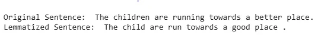  
Improving Lemmatization with POS Tagging  
In this improved version:  
* "children" is lemmatized to "child" (noun).  
* "running" is lemmatized to "run" (verb).  
* "better" is lemmatized to "good" (adjective).  
Advantages  
Lets see some key advantages:  
* Efficient Data Processing: It reduces the number of unique words by grouping similar variations together. This reduction helps to process large datasets more efficiently, conserving both memory and computational resources.  
* Enhanced Search and Retrieval: In tasks like search and information retrieval, it improves results by making it easier to match different forms of a word like "run," "running," "ran" to the same base form increasing the relevance of search queries.  
* Consistency in NLP Models: Standardizing words to their base form improves the consistency of input data which enhances the performance of NLP models. With consistent data, models are more likely to make accurate predictions and understand the underlying context of the text.  
Disadvantages  
* Time-consuming: It can be slower compared to other techniques such as stemming because it involves parsing the text and performing dictionary lookups or morphological analysis.  
* Not Ideal for Real-Time Applications: Due to its time-consuming nature, it may not be well-suited for real-time applications where fast processing is important.  
* Risk of Ambiguity: It may sometimes produce ambiguous results, when a word has multiple meanings based on its context. For example, the word "lead" can refer to both the noun (a type of metal) and a verb (to guide). Without context, the lemmatizer might not always resolve these ambiguities correctly.  
Related Articles:  
* ++[Python - Lemmatization Approaches with Examples   ](https://www.geeksforgeeks.org/machine-learning/python-lemmatization-approaches-with-examples/)++   
* ++[Python | Named Entity Recognition (NER) using spaCy](https://www.geeksforgeeks.org/python/python-named-entity-recognition-ner-using-spacy/)++  
* ++[Python | PoS Tagging and Lemmatization using spaCy](https://www.geeksforgeeks.org/machine-learning/python-pos-tagging-and-lemmatization-using-spacy/)++  
* ++[Removing stop words with NLTK in Python](https://www.geeksforgeeks.org/nlp/removing-stop-words-nltk-python/)++  
  
  
  
  
  
## 
Hidden Markov Model in Machine Learning  
  
  
It is a ++[statistical model](https://www.geeksforgeeks.org/machine-learning/difference-between-statistical-model-and-machine-learning/)++ that is used to describe the probabilistic relationship between a sequence of observations and a sequence of hidden states. Iike it is often used in situations where the underlying system or process that generates the observations is unknown or hidden, hence it has the name "Hidden Markov Model." 
An HMM consists of two types of variables: hidden states and observations.  
* The hidden states are the underlying variables that generate the observed data, but they are not directly observable.  
* The observations are the variables that are measured and observed. 
The relationship between the hidden states and the observations is modeled using a probability distribution. The Hidden Markov Model (HMM) is the relationship between the hidden states and the observations using two sets of probabilities: the transition probabilities and the emission probabilities.   
* The transition probabilities describe the probability of transitioning from one hidden state to another.  
* The emission probabilities describe the probability of observing an output given a hidden state.
Hidden Markov Model  Algorithm
The Hidden Markov Model (HMM) algorithm can be implemented using the following steps:  
* Step 1: Define the state space and observation space: The state space is the set of all possible hidden states, and the observation space is the set of all possible observations.  
* Step 2++:++ Define the initial state distribution: This is the probability distribution over the initial state.  
* Step 3: Define the state transition probabilities: These are the probabilities of transitioning from one state to another. This forms the transition matrix, which describes the probability of moving from one state to another.  
* Step 4: Define the observation likelihoods: These are the probabilities of generating each observation from each state. This forms the emission matrix, which describes the probability of generating each observation from each state.  
* Step 5: Train the model: The parameters of the state transition probabilities and the observation likelihoods are estimated using the Baum-Welch algorithm, or the forward-backward algorithm. This is done by iteratively updating the parameters until convergence.  
* Step 6: Decode the most likely sequence of hidden states: Given the observed data, the Viterbi algorithm is used to compute the most likely sequence of hidden states. This can be used to predict future observations, classify sequences, or detect patterns in sequential data.  
* Step 7: Evaluate the model: The performance of the HMM can be evaluated using various metrics, such as accuracy, precision, recall, or F1 score.
To summarise, the HMM algorithm involves defining the state space, observation space, and the parameters of the state transition probabilities and observation likelihoods, training the model using the Baum-Welch algorithm or the forward-backward algorithm, decoding the most likely sequence of hidden states using the Viterbi algorithm, and evaluating the performance of the model.
Implementation of HMM in python
Till now we have covered the essential steps of HMM and now lets move towards the hands on code implementation of the following
Key steps in the Python implementation of a simple ++[Hidden Markov Model](https://www.geeksforgeeks.org/nlp/markov-chains-in-nlp/)++ (HMM) using the hmmlearn library.
Example 1. Weather Prediction
Problem statement: Given the historical data on weather conditions, the task is to predict the weather for the next day based on the current day's weather.
Step 1: Import the required libraries
The code imports the ++[NumPy](https://www.geeksforgeeks.org/numpy/python-numpy/)++,++[matplotlib](https://www.geeksforgeeks.org/python/python-introduction-matplotlib/)++, ++[seaborn](https://www.geeksforgeeks.org/python/introduction-to-seaborn-python/)++, and the hmmlearn library.  
```


```
```


```
```
import numpy as np
import matplotlib.pyplot as plt
import seaborn as sns
from hmmlearn import hmm


```
Step 2: Define the model parameters
In this example, The state space is defined as a state which is a list of two possible weather conditions: "Sunny" and "Rainy". The observation space is defined as observations which is a list of two possible observations: "Dry" and "Wet". The number of hidden states and the number of observations are defined as constants.   
```


```
```


```
```
states = ["Sunny", "Rainy"]
n_states = len(states)
print('Number of hidden states :',n_states)

observations = ["Dry", "Wet"]
n_observations = len(observations)
print('Number of observations  :',n_observations)


```
Output:  
```


```
```


```
```
Number of hidden states : 2
Number of observations  : 2


```
The start probabilities, transition probabilities, and emission probabilities are defined as arrays. The start probabilities represent the probabilities of starting in each of the hidden states, the transition probabilities represent the probabilities of transitioning from one hidden state to another, and the emission probabilities represent the probabilities of observing each of the outputs given a hidden state.
The initial state distribution is defined as state_probability, which is an array of probabilities that represent the probability of the first state being "Sunny" or "Rainy". The state transition probabilities are defined as transition_probability, which is a 2x2 array representing the probability of transitioning from one state to another. The observation likelihoods are defined as emission_probability, which is a 2x2 array representing the probability of generating each observation from each state.  
```


```
```


```
```
state_probability = np.array([0.6, 0.4])
print("State probability: ", state_probability)

transition_probability = np.array([[0.7, 0.3],
                                   [0.3, 0.7]])
print("\nTransition probability:\n", transition_probability)
emission_probability= np.array([[0.9, 0.1],
                                 [0.2, 0.8]])
print("\nEmission probability:\n", emission_probability)


```
Output:  
```


```
```


```
```
State probability:  [0.6 0.4]
Transition probability:
 [[0.7 0.3]
 [0.3 0.7]]
Emission probability:
 [[0.9 0.1]
 [0.2 0.8]]


```
Step 3: Create an instance of the HMM model and Set the model parameters
The HMM model is defined using the hmm.CategoricalHMM class from the hmmlearn library. An instance of the CategoricalHMM class is created with the number of hidden states set to n_hidden_states and the parameters of the model are set using the startprob_, transmat_, and emissionprob_ attributes to the state probabilities, transition probabilities, and emission probabilities respectively.  
```


```
```


```
```
model = hmm.CategoricalHMM(n_components=n_states)
model.startprob_ = state_probability
model.transmat_ = transition_probability
model.emissionprob_ = emission_probability


```
Step 4: Define an observation sequence
A sequence of observations is defined as a one-dimensional NumPy array.
The observed data is defined as observations_sequence which is a sequence of integers, representing the corresponding observation in the observations list.  
```


```
```


```
```
observations_sequence = np.array([0, 1, 0, 1, 0, 0]).reshape(-1, 1)
observations_sequence


```
Output:  
```


```
```


```
```
array([[0],
       [1],
       [0],
       [1],
       [0],
       [0]])


```
Step 5: Predict the most likely sequence of hidden states
 The most likely sequence of hidden states is computed using the prediction method of the HMM model.  
```


```
```


```
```
# Predict the most likely sequence of hidden states
hidden_states = model.predict(observations_sequence)
print("Most likely hidden states:", hidden_states)


```
Output:  
```


```
```


```
```
Most likely hidden states: [0 1 1 1 0 0]


```
Step 6: Decoding the observation sequence
The ++[Viterbi algorithm](https://www.geeksforgeeks.org/dsa/need-of-data-structures-and-algorithms-for-deep-learning-and-machine-learning/)++ is used to calculate the most likely sequence of hidden states that generated the observations using the decode method of the model. The method returns the log probability of the most likely sequence of hidden states and the sequence of hidden states itself.  
```


```
```


```
```
log_probability, hidden_states = model.decode(observations_sequence,
                                              lengths = len(observations_sequence),
                                              algorithm ='viterbi' )

print('Log Probability :',log_probability)
print("Most likely hidden states:", hidden_states)


```
Output:  
```


```
```


```
```
Log Probability : -6.360602626270058
Most likely hidden states: [0 1 1 1 0 0]


```
This is a simple algo of how to implement a basic HMM and use it to decode an observation sequence. The hmmlearn library provides a more advanced and flexible implementation of HMMs with additional functionality such as parameter estimation and training.
Step 7: Plot the results  
```


```
```


```
```
sns.set_style("whitegrid")
plt.plot(hidden_states, '-o', label="Hidden State")
plt.xlabel('Time step')
plt.ylabel('Most Likely Hidden State')
plt.title("Sunny or Rainy")
plt.legend()
plt.show()


```
Output:
  
  

Sunny or Rainy
Finally, the results are plotted using the matplotlib library, where the x-axis represents the time steps, and the y-axis represents the hidden state. The plot shows that the model predicts that the weather is mostly sunny, with a few rainy days mixed in.
Example 2: Speech recognition using HMM
  
  
**++Problem statement:++ Given a dataset of audio recordings, the task is to recognize the words spoken in the recordings.**
In this example, the state space is defined as states, which is a list of 4 possible states representing silence or the presence of one of 3 different words. The observation space is defined as observations, which is a list of 2 possible observations, representing the volume of the speech. The initial state distribution is defined as start_probability, which is an array of probabilities of length 4 representing the probability of each state being the initial state.
The state transition probabilities are defined as transition_probability, which is a 4x4 matrix representing the probability of transitioning from one state to another. The observation likelihoods are defined as emission_probability, which is a 4x2 matrix representing the probability of emitting an observation for each state.
The model is defined using the++[ MultinomialHMM ](https://www.geeksforgeeks.org/python/how-to-find-probability-distribution-in-python/)++class from hmmlearn library and is fit using the startprob_, transmat_, and emissionprob_ attributes. The sequence of observations is defined as observations_sequence and is an array of length 8, representing the volume of the speech in 8 different time steps.
The predict method of the model object is used to predict the most likely hidden states, given the observations. The result is stored in the hidden_states variable, which is an array of length 8, representing the most likely state for each time step.  
```


```
```


```
```
import numpy as np
import matplotlib.pyplot as plt
import seaborn as sns
from hmmlearn import hmm


states = ["Silence", "Word1", "Word2", "Word3"]
n_states = len(states)

observations = ["Loud", "Soft"]
n_observations = len(observations)

start_probability = np.array([0.8, 0.1, 0.1, 0.0])

transition_probability = np.array([[0.7, 0.2, 0.1, 0.0],
                                    [0.0, 0.6, 0.4, 0.0],
                                    [0.0, 0.0, 0.6, 0.4],
                                    [0.0, 0.0, 0.0, 1.0]])

emission_probability = np.array([[0.7, 0.3],
                                  [0.4, 0.6],
                                  [0.6, 0.4],
                                  [0.3, 0.7]])

model = hmm.CategoricalHMM(n_components=n_states)
model.startprob_ = start_probability
model.transmat_ = transition_probability
model.emissionprob_ = emission_probability

observations_sequence = np.array([0, 1, 0, 0, 1, 1, 0, 1]).reshape(-1, 1)

hidden_states = model.predict(observations_sequence)
print("Most likely hidden states:", hidden_states)

sns.set_style("darkgrid")
plt.plot(hidden_states, '-o', label="Hidden State")
plt.legend()
plt.show()


```
Output:  
```


```
```


```
```
Most likely hidden states: [0 1 2 2 3 3 3 3]


```
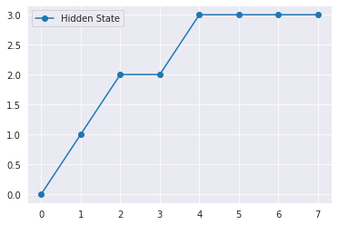  

Speech Recognition
Other Applications of Hidden Markov Model
HMMs are widely used in a variety of applications such as speech recognition, natural language processing, computational biology, and finance. In speech recognition, for example, an HMM can be used to model the underlying sounds or phonemes that generate the speech signal, and the observations could be the features extracted from the speech signal. In computational biology, an HMM can be used to model the evolution of a protein or DNA sequence, and the observations could be the sequence of amino acids or nucleotides.
Conclusion
In conlclusion, HMMs are a powerful tool for modeling sequential data, and their implementation through libraries such as hmmlearn makes them accessible and useful for a variety of applications.  
  
  
  
  
  
  
  
  
  
  
**Semantic Processing**  
**Knowledge Graph**  
The different types of knowledge graphs are as follows:  
* ++[WordNet:](https://wordnet.princeton.edu/)++ This is a lexical database of semantic relations between words. It is developed by Princeton University.  
* ++[ConceptNet](https://conceptnet.io/)++: This is a freely available semantic network that is designed to help computers understand the meanings of words that people use. It is developed by MIT.
The graph that describes the conceptnet is given below.
 
  
*   
* 
 
Both WordNet and ConceptNet are used for natural language understanding. At the end of this session, we will use WordNet to solve a use of Word Sense Disambiguation.
 
Another type of knowledge graph is UMLS.   
* Unified Medical Language System (UMLS): It is a set of files and software that brings together many health and biomedical vocabularies and standards to enable interoperability between computer systems.
Suppose you need to understand the text data that is related to the medical field. If you use WordNet or ConceptNet, you will have words that do not have relevance, and the results will be inaccurate. Hence, you require domain-specific knowledge graphs.
We know the famous knowledge graph called Google Search.
Although these are openly available knowledge graphs, many companies create their own knowledge graphs according to their company requirements.  
* Microsoft uses knowledge graphs for the Bing search engine, LinkedIn data and academics.  
* Facebook develops connections between people, events and ideas, focusing mainly on news, people and events related to the social network.  
* IBM provides a framework for other companies and/or industries to develop internal knowledge graphs.  
* eBay is currently developing a knowledge graph that functions to provide connections between users and the products present on the website.
 
Fun Exploration:
Watson is a question answering computer system that can answer questions posed in natural language. It is based on knowledge graphs. You can watch Watson winning the famous game of jeopardy ++[here](https://www.youtube.com/watch?v=P18EdAKuC1U)++. 
 
Now that you have gone through different types of knowledge graphs, in the next segment, you will gain a detailed understanding of one of the widely used knowledge graphs: ‘WordNet’.  
In the previous segment, you learnt about different types of knowledge graphs.
In this segment, you will gain a detailed understanding of the WordNet knowledge graph. 
WordNet is a part of NLTK, and you will use it later in this module to identify the 'correct' sense of a word (i.e., for word sense disambiguation).
WordNet® is a large lexical database of English words developed by Princeton University. It can be accessed ++[here](http://wordnet.princeton.edu/)++.  
Let us understand what we learnt in the above video.
The diagram below is a screenshot from the WordNet website:
  
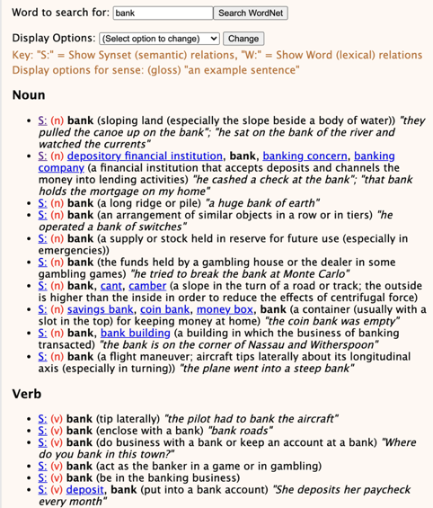  

 
In the diagram given above, each word sense of the word bank is grouped into its nouns and verbs. A set of all these senses is called a synset.
Each sense of the word has a gloss or meaning of the word and an example as in the dictionary.
For example, the first verb sense of the word has a gloss or a meaning as ‘tip literally’ and the example sentence as ‘the pilot had to bank the aircraft’.
Similarly, each word sense contains a gloss and an example sentence.

If meanings are available in the dictionary as well, what makes WordNet unique?
Each of these senses of the words is related to other senses through some relations.   
The types of relationship between different words can be grouped as follows:  
1. Synonym: A relation between two similar concepts
Example: Large is a synonym of big.  
2. Antonym: A relation between two opposite concepts
Example: Small is an antonym of big.  
3. Hypernym: A relation between a concept and its superordinate
 A superordinate is all-encompassing.
Example: Fruits is the hypernym of mango.  
4. Hyponym: A relation between a concept and its subordinate
Example: Apple is the hyponym of fruits.
You can refer to the diagram given below to understand hyponyms and hypernyms. Any word that is connected with its hypernyms has an ‘is a’ relationship
 
 
  
5. 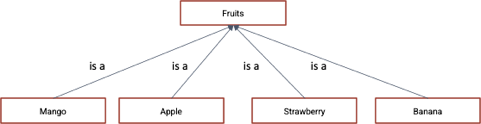  
6. 
   
7. Holonym: A relation between a whole and its parts
Example: Face is the holonym of eyes.  
8. Meronym: A relation between a part and its whole.
Example: Eyes is the meronym of human body
You can refer to the diagram given below to gain an understanding of holonyms and meronyms. Any word is connected with its holonym by a ‘has part’ relationship. 
 
  
9. 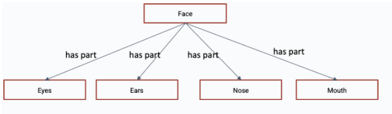  
10. 
 
Based on your learnings so far, attempt the following questions.
 
Apart from these, can you think of some other examples of hypernyms, hyponyms, meronyms, holonyms, synonyms and antonyms?
To summarise, Wordnet contains word senses for each word, and these senses are related through different relations.
 
In the next segment, you will understand the different functions of WordNet using NLTK.  
  
You learnt how to get the synsets of a word and the definition of each sense of the word. 
 
  
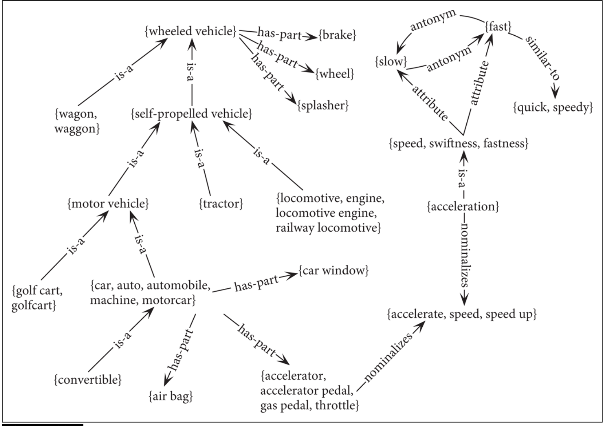  

 
++[Source](https://web.stanford.edu/~jurafsky/slp3/18.pdf)++
 
We started from the tractor and traversed the graph upwards using the hypernyms function in WordNet until we reached the wheeled vehicle. 
Then, we used the meronyms function to traverse the ‘has part’ relation.
   
**Word Sense Disambiguation
 **  
Homonymy is when a word has multiple (entirely different) meanings. For example, consider the word ‘pupil’. It can either refer to students or eye pupils depending on the context in which it is used. 
 
Suppose you are searching for the word ‘pupil’. The search engines sometimes give data relevant to the context and sometimes give irrelevant data. Such things happen because the query may contain words whose meaning is ambiguous or those having several possible meanings.
 
To solve this ambiguity problem, the Lesk algorithm is used.
 
In the previous segment, we understood different functions in WordNet. In the next video, you will learn how WordNet can be used to disambiguate words.  
You can consider the definitions corresponding to the different senses of the ambiguous word and determine the definition that overlaps the maximum with the neighbouring words of the ambiguous word. The sense that has the maximum overlap with the surrounding words is then chosen as the ‘correct sense’.
 
“She booked the **flight tickets** to Delhi in **advance**”  

|  |                                  |
| - | -------------------------------- |
|  | "reserve me a seat on a flight"; |
  
"The agent booked tickets to the show for the whole family"; "please hold a table at Maxim's" | | | | | | |  

|  |  |
| --------------------------------------------------------------------------------------- | --------------------------------------------------------------- |
|  |  |
| Gloss 1 |  |
|  | arrange for and reserve (something for someone else) in advance |
| Examples 1 |  |
| Gloss 2 |  |
| a written work or composition that has been published (printed on pages bound together) |  |
|  |  |
  
 
In this example, you will notice that the gloss or meaning 1 has more overlap than gloss 2. Hence, we consider gloss 1 as the correct sense.
 
Although we have shown only two senses, a lesk algorithm parses through all the word senses and outputs the gloss that has the maximum overlap.
 
In the next segment, you will learn how to understand how to use WordNet to code the Lesk algorithm in NLTK.
 
Source: ++[https://wordnet.princeton.edu](https://wordnet.princeton.edu/)++ .  
**Distributional Semantic Processing**  
**Geometric Representation of words**  
What do you do first when you come across a word you are unfamiliar with? 
 
The dictionary definitions are not quite straightforward. Understanding a definition refers to understanding all the words within the definition of the word. However, we do not rely on a dictionary every time we don’t understand the meaning of a word.
You understand the meaning of the word from the overall context of the surrounding words. For example, let us assume that one does not know the meaning of the word ‘credit”. 
 
After reading the sentence ‘The money was credited to my bank account’, one can easily infer that the word ‘credit’ is related to the exchange of currency. The words ‘money’ and ‘account’ set a context to the sentence that implies the predicted meaning. Through intelligent predictions such as this one, the meaning of words in a sentence becomes quite intuitive.
 
Hence, it was rightly said by the English linguist John Firth in 1957 -
 “You shall know a word by the company it keeps.”
Distributional semantics creates word vectors such that the word’s meaning is captured from its context.  
  
Now, let’s try to capture the meaning of a word using geometry. Let’s consider two dimensions, speciality and femininity, to represent the meaning of the word. A classic example of this would be plotting the words King, Queen, Man and Woman on a plot of Speciality vs Femininity. 
 
A King and Queen are equally special; however, a Queen is more feminine than a King. Similarly, a man is as special as a woman, but a woman is more feminine than a man. Interestingly, a man/woman is not as special as a king/queen. With all this in mind, the plot would look something like this.
 
  
  

 
Note that the meaning of the word is restricted to only two features; hence, this is not the complete picture. However, this gives an intuitive understanding of how the meaning of words are represented in geometry.  
  
  
  
  
  
  
