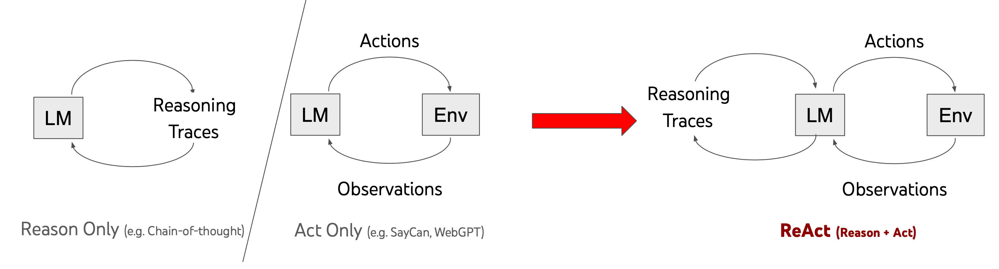
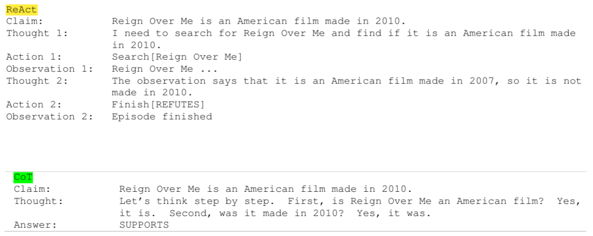
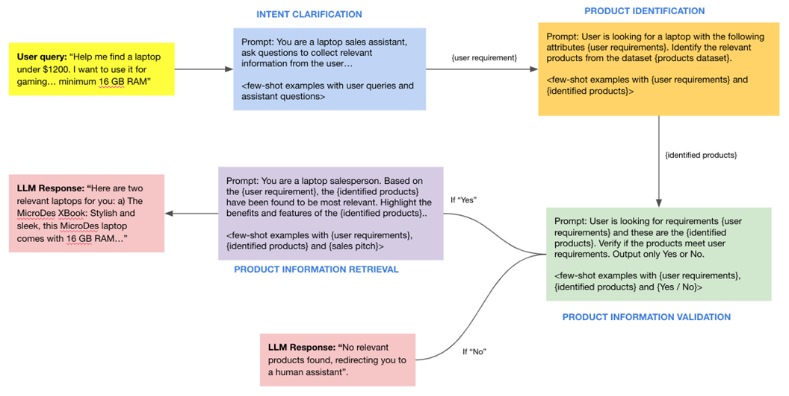
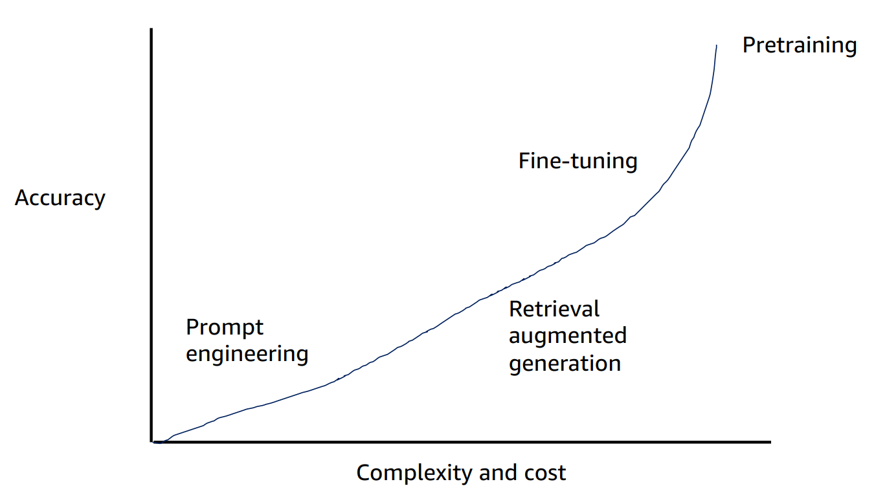
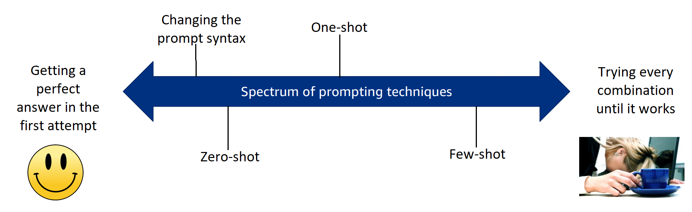

# Advanced Prompting  
  
In the module, you will be introduced to the basics of designing Large Language Model (LLM)- based systems and the best practices to ensure a safe and reliable AI system. This session on LLM system design will cover the following topics:  
* Advanced Prompting for Designing AI Systems  
    * Self-consistency prompting  
    * ReAct prompting  
* Designing Safe AI Systems  
    *  Detecting unsafe information  
    * Prompt injection  
    * Detecting prompt injection attacks  
    * Moderation API  
* Beyond Advanced Prompting  
    * Fine-tuning LLMs  
    * Integrating large data sets with LLMs
  
In the upcoming segments, we will cover the factors to consider when working with language models. The prompts and examples demonstrated in this session have been tested on ChatGPT. It should be noted that the concepts covered in this session can be applied to any large language model available in the market, whether it is an open-source language model or an enterprise model.  
  
  
  
##  React Prompting  
  
  
The ReAct framework is a groundbreaking technique that has immense potential in knowledge-intensive reasoning tasks and decision-making scenarios. The method can be considered an off-shoot of the chain-of-thought technique we explored in the previous module, where we induce the language model to think in a series of steps to arrive at a conclusion. The ReAct technique goes one step further and incorporates ‘reasoning’ and ‘performing actions’ based on its reasoning. This helps improve the model’s performance (i.e., in terms of correct response) and also deals with the pitfalls that such models usually face.  
  
Language models are susceptible to a common issue known as ‘hallucinations’. The term ‘hallucination’ refers to the phenomenon where the model generates text that is incorrect, nonsensical or not real. LLMs are trained on vast amounts of data to predict the most probable next word in a sequence. Although they are very efficient at predicting the correct token predictors for a preceding token, they are not quite good at understanding if the predicted token is, in fact, correct or incorrect. Additionally, the models are known to suffer from biases and reasoning errors.  
  
ReAct aims to overcome these issues by enabling LLMs to perform in-context learning using few-shot learning techniques. ReAct-based prompts include examples with interleaved thoughts, actions and observations, imitating how humans think and act when solving problems or performing task-specific actions, which allows LLMs to take text actions and receive text observations. The image below from the original research paper illustrates the ReAct framework for LLMs.  
  
The following ++[image](https://react-lm.github.io/)++ from the original paper illustrates the performance of ReAct for the following question: Aside from the Apple Remote, what other device can control the program Apple Remote was originally designed to interact with?  By dividing the tasks into ‘Thoughts’, ‘Actions’ and ‘Observations’, the ReAct framework effectively generates both verbal reasoning traces and text actions in an interleaved manner. In this ++[example](https://chat.openai.com/share/78423531-fcb6-43a3-963a-6bfe48443cb9)++, ReAct demonstrates it is able to reason correctly and propose the correct course of action for a complex scenario.   
  
In the following example from ++[Google’s Research blog](https://ai.googleblog.com/2022/11/react-synergizing-reasoning-and-acting.html?m=1)++, the ReAct technique is able to arrive at the correct answer while CoT gives a hallucinated output.   
  
As we can observe above, a distinguishing factor of ReAct is its ability to tackle hallucinations effectively, which has been a major challenge in large language models. By allowing the model to interact with the environment and gather information through actions, ReAct minimises the risk of generating incorrect or fictitious answers. When the model comes across a question that cannot be answered using its knowledge base, ReAct allows the model to interact with external sources (news articles, financial reports, internet) to gather more information and arrive at the correct answer.  
  
ReAct represents a significant step towards achieving artificial general intelligence (AGI) and embodied language models, bringing robots closer to thinking and acting like humans. This revolutionary prompt engineering approach opens the doors to a future where LLMs can act as intelligent agents in various domains, leveraging their ability to reason and interact with environments. In the SemanticSpotter project, we will explore new LLM frameworks, such as LangChain, that ++[integrate ReAct](https://python.langchain.com/docs/modules/agents/agent_types/react)++ within their ecosystem, which reduces the scope for LLM hallucinations and enables the model to use external tools such as search engines and plug-ins to perform a given task.  
  
In the video, Kshitj introduced the problem - which is to build a chatbot that can recommend laptops to users in an e-commerce domain and suggest the correct laptop based on their preferences. Building a product recommendation system is a complex machine learning problem that involves understanding the user requirements correctly and suggesting the right products. Let’s break down the steps involved in solving the problem:  
* The chatbot should converse normally with the user and identify their purpose for buying a laptop. The chatbot should ask clarifying questions to capture the user’s intent for buying the laptop and surmise the intended use of the laptop from its conversation with the user.  
* Once the chatbot has gained enough context and information from the user, it should generate laptop features that can be easily used to identify the laptop from the database. Additionally, the features should closely match the existing schema of the given laptop databases. For example, if the user is aiming to buy a computer with a high-performance GPU, the model should correctly extract this feature and appropriately tagged as <gpu>:<high_performance>/<high> etc. This tagging enables the model to extract the relevant products from the database, ensuring that the product meets the user’s expectations.   
* If the chatbot has found a laptop/laptops, it should display these results to the user.   
* If the chatbot is unable to find a laptop as per the user’s requirement, it should redirect them to a human operator.   
  
Each step described in the process is a complex set of instructions that usually requires extensive coding, testing and evaluation before being eventually deployed in a production environment. As you learned in the previous segments and modules, language models are capable of performing reasoning and logical operations and can perform complex tasks once they are provided with instructions clearly specified through prompts.  
  
In the upcoming video. Kshitij will describe one of the ways in which a complex system, such as a laptop recommendation system, can be built using a language model such as ChatGPT.  
  
**Additional Reading:**  
* In this ++[paper](https://arxiv.org/pdf/2210.03629.pdf)++, the author introduces the ReAct prompting framework  
* This ++[article](https://www.promptingguide.ai/techniques/react)++ summarises the essential concepts of ReAct prompting.  
* This ++[article](https://medium.com/@bryan.mckenney/teaching-llms-to-think-and-act-react-prompt-engineering-eef278555a2e)++ details the basics of ReAct prompting and its performance for various tasks.  
* In this ++[paper](https://www.arxiv-vanity.com/papers/2212.10403/)++, the authors explore the various reasoning frameworks that LLMs employ.  
  
  
# ShopAssist  
  
The objective of the overall system is to recommend laptops based on the user’s profile.  
  
  
  
  
  
  
The salient components of this system are described below:  
* **User query:** In this component, the user inputs the requirement to the model. It can include the possible use cases where they intend to use the laptop, such as gaming, professional use or academic research. The language model must capture the user’s requirements from this conversation and accordingly parse it to find the right laptop recommendations for the user based on their needs. This is handled by the next layer.  
* **Intent clarification:** This layer is tasked with extracting the exact requirements of the user based on their input prompt, converting them into a set of features that can eventually be used to narrow down the laptops from the laptop database.  
* **Product identification:** This layer evaluates the products from the product database based on the user requirements collected in the previous chain and identifies the relevant products.  
* **Product information validation:** This layer validates if relevant product information is present in the database and meets the user's requirements. If it is not present, this layer will connect the user to a human assistant.  
* **Product information retrieval:** The ‘sales’ layer communicates the product features in a friendly, persuasive manner.  
  
**Additional Reading:**  
* In this ++[article](https://huyenchip.com/2023/04/11/llm-engineering.html)++, the author describes the various challenges of creating LLM applications.  
* This ++[article](https://a16z.com/2023/06/20/emerging-architectures-for-llm-applications/)++ shows the emerging system architectures for LLM applications.  
  
In the video above, Kshitj illustrated some safety concerns while integrating AI solutions into a product. Large language models are highly stochastic and can produce widely varied outputs based on the user’s input; hence, safety and privacy are important aspects to be considered when building such solutions. Here are some of the common points that must be considered:  
* **Detecting unsafe information**. It is important to ensure that the AI system does not generate or share unsafe information, such as hate speech, misinformation or harmful content. This can be achieved through content moderation and filtering mechanisms.  
* **Detecting prompt injections and prompt injection attacks**. Prompt injection is a vulnerability in LLMs that can be exploited by attackers to manipulate their output responses.  
* **Detecting information that may be considered sensitive, racist or discriminatory**. Large language models like ChatGPT have the potential to generate sensitive information, such as personal data or confidential information. This can be prevented by designing prompts carefully and implementing privacy and security measures to protect any sensitive information that may be generated.  
  
Creating a safe AI system with a large language model like ChatGPT requires careful consideration of the points mentioned above to ensure that the system is secure, reliable and trustworthy. OpenAI has released an API called the Moderation API, which can detect any unsafe information from the user’s text and flag them before the language model can act on the user’s input. The ++[Moderation API](https://platform.openai.com/docs/guides/moderation)++ currently can correctly classify the following categories of unsafe texts:  
* hate  
* hate/threatening  
* harassment  
* harassment/threatening  
* self-harm  
* self-harm/intent  
* self-harm/instructions  
* sexual  
* sexual/minors  
* violence  
* violence/graphic  
We urge you to read OpenAI’s documentation to understand what each of these categories represents. The Moderation API is currently free to use when monitoring the inputs and outputs of OpenAI APIs and supports only English text. Now let’s hear from the SME on how to deal with prompt injections in the video below.  
  
  
  
In the video, Kshitij discussed prompt injection and how prompt injection sequences can be detected. Prompt injection attacks can be used to manipulate the output of an AI system in harmful ways. These attacks can be prevented by designing the input prompts carefully and monitoring the system for any signs of manipulation. To tackle this issue, Kshitij discussed adding a separate layer that can perform the necessary checks to detect and classify unsafe pieces of text and prompt injections. By using a moderation layer that analyses and validates the user input before it reaches the language model, the system can detect and catch some prompt injection attempts. This involves checking for specific language patterns, tokens or encoding mechanisms that may indicate a prompt injection attack.  
  
Additionally, to detect prompt injections and prompt injection attacks in a large language model like ChatGPT, the following approaches can help safeguard your LLM application:  
* **Implement security controls**: Adding layers of security controls can make prompt injection attacks more difficult to exploit. This can include measures such as access controls, authentication mechanisms and input validation to ensure that only authorised and safe inputs are processed by the language model.  
* **Monitor and log interactions**: By monitoring and logging the interactions between the language model and users, potential prompt injection attempts can be detected and analysed. This involves keeping track of the input prompts and examining them for any signs of manipulation or malicious intent.  
* **Reduce the impact of attack**: LLMs are increasingly becoming valuable tools for organisations, enabling them to extract insights from their proprietary data by creating ++[data moats](https://www.forbes.com/sites/lutzfinger/2023/04/04/what-is-the-competitive-advantage-of-llms-like-chatgpt-for-your-business-three-takeaways/?sh=1709c1715751)++. By implementing robust security measures and limiting the model's access to sensitive data and resources, you can reduce the potential impact on your organisation if an attack were to be successful.  
  
Detecting prompt injections and prompt injection attacks can be challenging, as language input is inherently complex and attackers are always on the lookout for new vulnerabilities to bypass security controls. However, by implementing the abovementioned strategies and staying vigilant, the risks can be minimised and the language model applications can be made more secure. Prompt injection attacks are a new vulnerability, and researchers are actively working on developing countermeasures. One must stay updated with the latest research and security practices to mitigate the risks associated with prompt injections.  
  
**Additional Reading:**  
* This ++[blog post](https://research.nccgroup.com/2022/12/05/exploring-prompt-injection-attacks/)++ explores prompt injection patterns in large language models in great depth.  
* This ++[article ](https://medium.com/@ppaudyal/the-illusion-of-proprietary-data-as-a-moat-in-the-age-of-large-language-models-9d64a8c81a44)++explores the technical challenges involved in creating LLM applications.  
  
  
n this video, Kshitij discussed a few additional techniques that need to be considered once you have evaluated prompt engineering techniques for your LLM application. These include the following:  
* Designing better prompts  
* Providing additional data  
* LLM fine-tuning  
The choice of these techniques depends on the nature of the task, complexity or costs associated with the technique and availability of resources.   
  
In the graph given below, the accuracy has been plotted against the complexity and cost for different regimens in a large language model. (**Source**: ++[AWS](https://github.com/aws-samples/sagemaker-distributed-training-workshop/blob/main/slides/Generative%20AI%20Foundations%20Technical%20Deep%20Dive/1%20-%20Intro%20to%20FMs.pdf.zip)++, Slide 7)  
  
  
  
  
As seen in the graph, while prompt engineering is the least complex and cost-efficient method, it may not always produce the most accurate response.  
  
  
  
  
**eyond Advanced Prompting: Integrating Data**  
  
  
  
  
  
  
  
V  
In the video, Kshitij mentions a key issue encountered when working with large data sets. Data sets with millions of rows or enterprise documents that may often range from a few terabytes to petabytes of data are difficult to directly input into the large language model. Large language models are also limited by the context window, which is the length of the longest sequence that it can use to generate a token, and the high costs typically associated with using large input tokens. Hence, it is not possible to build a scalable system with only a large language model. For dealing with these issues, Kshitij discussed how this limitation can be resolved. One way to achieve this is by creating vector embeddings. Vector embeddings are representations of words, phrases or sentences as dense numerical vectors in a high-dimensional space. For example, OpenAI’s embeddings have ++[1536 dimensions](https://openai.com/blog/new-and-improved-embedding-model#:~:text=The%20new%20embeddings%20have%20only%201536%20dimensions%2C)++, whereas the open-source BERT-BASE model generates ++[768-length embedding vectors](https://tech.target.com/blog/bert-model)++.  
  
  
  
These embeddings are used to capture the semantic meaning and contextual relationships between different elements of language. The concept is a fundamental component of many natural language processing (NLP) tasks and has significantly contributed to the success of large language models such as ChatGPT. Once the vector representations of the corpus in the input document has been created, these can be stored in a dedicated database that specialises in storing these vector inputs. With the explosion of large language models, many vector embeddings and vector database solutions are available in the market. A few popular ones include ++[Pinecone](https://www.pinecone.io/)++, ++[Redis](https://redis.io/)++, ++[Weaviate](https://weaviate.io/)++, ++[Chroma ](https://www.trychroma.com/)++and ++[FAISS](https://faiss.ai/index.html)++. You will learn more about embeddings and vector databases in the HelpMate AI project, but if you are curious now, you can refer to this link for more information on ++[word embeddings](https://www.turing.com/kb/guide-on-word-embeddings-in-nlp)++.
  
Word Embeddings in NLP is a technique where individual words are represented as real-valued vectors in a lower-dimensional space and captures inter-word semantics. Each word is represented by a real-valued vector with tens or hundreds of dimensions.  
  
Kshitj also illustrated a typical solution involving vector embeddings in an LLM-based system by considering the example of the laptop recommendation system discussed in the previous segment. When a user presents a query to the LLM system, the model first converts the query into its embeddings. The user’s query in the embedding form is then compared with the embeddings of the entire corpus using metrics such as ++[cosine similarity](https://en.wikipedia.org/wiki/Cosine_similarity)++ to obtain the closest matching output to retrieve the relevant output for the query. The system then parses the embeddings back to a human-readable text format.
  
This technique is called **Retrieval Augmented Generation** (as visible in the graph given above the video). Retrieval Augmented Generation (RAG) is a novel technique that is usually employed for information extraction tasks, typically those involving enterprise data. Language models have a cut-off date beyond which they cannot produce a correct output or may even produce ‘hallucinations’. This technique leverages the strengths of retrieval-based models and generative models to enhance the quality and relevance of the generated text in natural language processing tasks and reduce ++[LLM hallucinations](https://cobusgreyling.medium.com/retrieval-augmented-generation-rag-safeguards-against-llm-hallucination-2d24639aff65)++. Applications of RAG include enterprise question answering systems in which the retrieval-based model can find relevant information to answer user queries as well as knowledge-intensive tasks that require generating text based on the retrieved information. We will discuss this technique in more detail in the upcoming modules.  
  
  
  
In the video, Kshitij mentions a key issue encountered when working with large data sets. Data sets with millions of rows or enterprise documents that may often range from a few terabytes to petabytes of data are difficult to directly input into the large language model. Large language models are also limited by the context window, which is the length of the longest sequence that it can use to generate a token, and the high costs typically associated with using large input tokens. Hence, it is not possible to build a scalable system with only a large language model. For dealing with these issues, Kshitij discussed how this limitation can be resolved. One way to achieve this is by creating vector embeddings. Vector embeddings are representations of words, phrases or sentences as dense numerical vectors in a high-dimensional space. For example, OpenAI’s embeddings have ++[1536 dimensions](https://openai.com/blog/new-and-improved-embedding-model#:~:text=The%20new%20embeddings%20have%20only%201536%20dimensions%2C)++, whereas the open-source BERT-BASE model generates ++[768-length embedding vectors](https://tech.target.com/blog/bert-model)++.  
  
  
  
These embeddings are used to capture the semantic meaning and contextual relationships between different elements of language. The concept is a fundamental component of many natural language processing (NLP) tasks and has significantly contributed to the success of large language models such as ChatGPT. Once the vector representations of the corpus in the input document has been created, these can be stored in a dedicated database that specialises in storing these vector inputs. With the explosion of large language models, many vector embeddings and vector database solutions are available in the market. A few popular ones include ++[Pinecone](https://www.pinecone.io/)++, ++[Redis](https://redis.io/)++, ++[Weaviate](https://weaviate.io/)++, ++[Chroma ](https://www.trychroma.com/)++and ++[FAISS](https://faiss.ai/index.html)++. You will learn more about embeddings and vector databases in the HelpMate AI project, but if you are curious now, you can refer to this link for more information on ++[word embeddings](https://www.turing.com/kb/guide-on-word-embeddings-in-nlp)++.
  
Kshitj also illustrated a typical solution involving vector embeddings in an LLM-based system by considering the example of the laptop recommendation system discussed in the previous segment. When a user presents a query to the LLM system, the model first converts the query into its embeddings. The user’s query in the embedding form is then compared with the embeddings of the entire corpus using metrics such as ++[cosine similarity](https://en.wikipedia.org/wiki/Cosine_similarity)++ to obtain the closest matching output to retrieve the relevant output for the query. The system then parses the embeddings back to a human-readable text format.
  
This technique is called **Retrieval Augmented Generation** (as visible in the graph given above the video). Retrieval Augmented Generation (RAG) is a novel technique that is usually employed for information extraction tasks, typically those involving enterprise data. Language models have a cut-off date beyond which they cannot produce a correct output or may even produce ‘hallucinations’. This technique leverages the strengths of retrieval-based models and generative models to enhance the quality and relevance of the generated text in natural language processing tasks and reduce ++[LLM hallucinations](https://cobusgreyling.medium.com/retrieval-augmented-generation-rag-safeguards-against-llm-hallucination-2d24639aff65)++. Applications of RAG include enterprise question answering systems in which the retrieval-based model can find relevant information to answer user queries as well as knowledge-intensive tasks that require generating text based on the retrieved information. We will discuss this technique in more detail in the upcoming modules.  
  
  
  
  
**LLM Fine-Tuning**  
In this segment, we will explore the concept of fine-tuning in the context of a large language model. Fine-tuning is a machine learning concept that is commonly applied in machine learning to optimise and adapt a model’s weights to the examples provided to it. This results in a model that performs better than what would be possible without fine-tuning. OpenAI allows you to fine-tune its models on specific data to ensure that the output responses are in line with your domain or use cases. Let's hear from Kshitij in the video below.  
  
  
  
Fine-tuning is a technique used in deep learning for optimising a pre-trained model on new data. The weights of the neural networks in the pre-trained model are updated after training on new data (either on the entire neural network or on only a subset of its layers). Fine-tuning can be a powerful training technique, as it adapts an already capable model to perform a particular task.  

In the earlier video, Kshitij explained the advantages of fine-tuning a large language model. There are various reasons why LLMs need to be fine-tuned:  
* **Model’s performance**: Fine-tuned language models perform better than generic language models since they have been trained on additional data from the domain.  
* **Output quality**: By leveraging the language model’s ability to deal with natural language tasks owing to pretraining and additional fine-tuning on the custom data, the model can produce a more accurate, relevant and context-aware response than that generated by a normal language model.  
* **Hallucinations**: By fine-tuning the LLM on carefully curated domain-specific data sets, the language model can learn how to generate more accurate and relevant responses to tasks pertaining to the domain. Along with human feedback and constant training, the problem of hallucinations can be reduced to a large extent.   
* **Safety**: The model can be explicitly trained in scenarios that may lead to security concerns. This ensures that the model does not return malicious or discriminatory content.  
As described in the video, the training examples can be structured in the following JSON format.  
```
{"prompt": "", "completion": ""}
{"prompt": "", "completion": ""}
{"prompt": "", "completion": ""}

```
  
You can refer to OpenAI’s official ++[link ](https://platform.openai.com/docs/guides/fine-tuning)++for more information on fine-tuning using GPT models.
  
Fine-tuning a model involves additional computing costs for updating the model weights, which may range from a ++[couple of dollars](https://www.databricks.com/blog/2023/04/12/dolly-first-open-commercially-viable-instruction-tuned-llm)++ to ++[millions of dollars](https://www.pcguide.com/apps/gpt-3-cost/)++. Ultimately, the choice of fine-tuning or prompt engineering is based on the accuracy of the language model for the given task against the complexity and cost involved in the process.   
  
Prompt engineering remains the simplest and easiest approach for generating the model’s response. It involves an iterative process of refining and evaluating the model’s response to generate the intended response. The typical process involved in prompt engineering has been illustrated below. (**Source**: ++[AWS](https://github.com/aws-samples/sagemaker-distributed-training-workshop/blob/main/slides/Generative%20AI%20Foundations%20Technical%20Deep%20Dive/3-%20Using%20pretrained%20FMs.pdf.zip)++, Slide 5)  
  
As shown in the image and covered in the previous segments, we have covered various prompt engineering techniques that have been proven to give useful and correct output responses for various NLP tasks. Let’s recap the general workflow involved in prompt engineering:   
1. The general strategy taken while using prompt engineering techniques is to start with a generic prompt template and make slight adjustments to evaluate the model responses. Such zero-shot prompts generally give good responses if the model has seen information regarding the user prompt during pretraining. Typically, this works well for LLMs with large parameters (>100B parameters), such as ChatGPT, Bard and LLaMA, that have been trained on a large text corpus but fail to perform adequately for smaller parameter models.  
2. If the zero-shot technique fails, you can add examples to the prompt to mimic the type of responses you want to achieve. The number of responses depends on how well the model can generalise from the examples provided to it, and you get single-shot or one-shot and few-shot prompt techniques.  
3. You can then iteratively improve the prompt until you have achieved the perfect output response from the model.  
4. After performing steps 1–3, if you do not receive a sufficiently good output, you can consider augmenting the model using relevant domain data or performing fine-tuning with sufficient examples. These are more advanced techniques that you will implement in the later projects of the program.  
  
As you can surmise, prompt engineering is an iterative process, and you should be aware of the language model’s capabilities and general prompting principles to elicit a good output. As researchers explore various prompting paradigms, the more capable these models seem to become in solving specific tasks, especially the tasks containing logical and reasoning steps. Though time is required to engineer the 'correct prompt’ for your use case, the final response from the model is always subject to the model’s capability and updates. Enterprise models are constantly updated and aligned using techniques such as Reinforcement Learning through Human Feedback (RLHF), which updates the model’s capabilities constantly.  
  
Additionally, prompts also vary from one language model to another. A prompt used in a language model with large parameters (i.e., parameters >100B or 100 Billion), such as ChatGPT (175B parameters), may not necessarily work in a different language model (i.e., Google FLAN-T5 XXL, which contains 11B parameters).   
  
Another training regimen for large language models is model pretraining. This refers to training a language model from scratch on various data sets. Pre-training is the process of training a language model on a large amount of unlabelled text data. The goal of pre-training is to teach the model basic language tasks and functions, such as predicting the next word in a sentence, so that it can better understand and generate natural language. This training regimen is employed by companies such as OpenAI, Meta and Google to build ‘foundation models’ (such as ChatGPT, Bard and LLaMA) using various transformer architectures, training techniques, data sets, etc. These models are then fine-tuned using techniques such as ++[instruction-fine-tuning](https://cameronrwolfe.substack.com/p/language-models-gpt-and-gpt-2)++ on a specific task, for example, text classification. For large enterprises, pre-training can be especially useful when a language model needs to be fine-tuned on proprietary data sets, which can be very vast and diverse compared to the ++[research data sets](https://magazine.sebastianraschka.com/p/ahead-of-ai-8-the-latest-open-source)++ used for the usual pre-training of a language model. A few examples of such models include ones that have been covered in the module titled ‘Introduction to Generative AI’, such as BloombergGPT and Einstein GPT, which use proprietary data sets for pre-training. Additionally, pre-training a foundation model can also reduce LLM hallucinations and ensure the privacy of proprietary data.  
  
Ultimately, the deciding factor for fine-tuning is taken by judging the language model’s capabilities, its performance with prompt techniques (such as few-shot technique), the type of application being developed and the overall cost of building the model. To obtain a model that performs better, you will need to fine-tune it using a few hundred to a couple of thousand examples, which will incur additional costs.   
  
Foundation models are being constantly developed at a breakneck speed with new improvements, training techniques and data sets. Keeping yourself updated with the latest technologies and model offerings is crucial while working with generative technologies and creating applications with LLMs. The ++[Open LLM Leaderboard](https://huggingface.co/spaces/HuggingFaceH4/open_llm_leaderboard)++ is one such initiative by HuggingFace to evaluate and rank open-source LLMs and chatbots.  
  
  
  
  
  
**Additional Reading:**  
* In this ++[paper](https://aclanthology.org/2021.naacl-main.208.pdf)++, the authors compared the efficiency of using simple prompt engineering techniques with that of using fine-tuning methods on large language models  
* This ++[article ](https://mlops.community/fine-tuning-vs-prompt-engineering-llms/)++explores the benefits of fine-tuning and prompt engineering in LLMs  
* These links provide additional information on LLM fine-tuning:  
    * ++[LLM Fine Tuning Guide for Enterprises in 2023](https://research.aimultiple.com/llm-fine-tuning/)++  
    * ++[The Complete Guide to LLM Fine-Tuning](https://bdtechtalks.com/2023/07/10/llm-fine-tuning/)++  
* This ++[article ](https://cameronrwolfe.substack.com/p/language-model-scaling-laws-and-gpt)++explores the various parameters and the scaling law to be considered while pre-training LLMs such as the GPT models  
  
  
  
In this session, we covered the important concepts involved in designing LLM-based systems.  

We started the session by discussing a few advanced prompting techniques, such as self-consistency and ReAct, along with their use cases.  
  
Then, you learnt how to design LLM applications with the help of the example of the AI Tutor application. We decomposed the task into its components and used prompt chaining to create the AI tutor system.  
  
We then explored the safety aspects of LLM applications, such as:  
* Detecting unsafe/sensitive information  
* Detecting prompt injection  
 
We covered OpenAI’s Moderation API, which can be used for detecting unsafe information and its various categories such as hate, violence, etc.  
  
Prompt injections and prompt injection attacks are carried out to reveal confidential or sensitive information from language models by exploiting various vulnerabilities. We then discussed how LLMs can be protected against such attacks by:  
* Implementing security controls  
* Monitoring and logging user interactions with the model  
* Creating data moats  
  
We then explored a few concepts that can create better LLM-based applications such as the following:  
* Prompt engineering  
* Integrating large data sets  
* Fine-tuning  
  
