**Vector Database and RAG**  
  
**Vector Store**  
  
  
**Architecture**  
In the previous sessions,you learnt in detail about vector embeddings and their representations for various types of unstructured data,including textual data.And in the previous session,we built a semantic search application and stored the vector embeddings locally using a Pandas dataframe.While easy,retrieving and storing vector embeddings locally,such as in a dataframe,is quite time-consuming when the operation is scaled to include multiple documents.This can give rise to latency issues in our semantic search application,especially when real-time search and retrieval are required.To cater to such low-latency requirements,developers are increasingly using vector stores to store vector embeddings once documents are ingested and chunked.In the video below,Aditya will explain the various aspects of vector stores.  
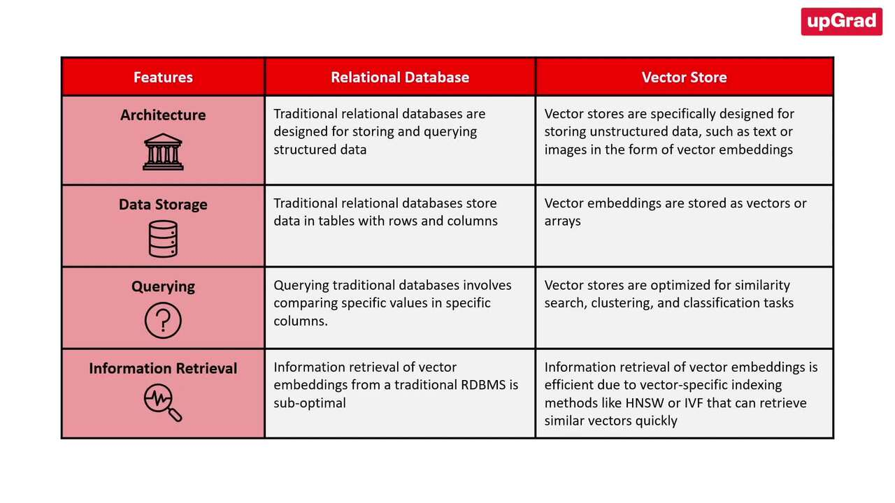  
As mentioned in the video,a vector store is a data storage system that is specially designed to store,index and retrieve high-dimensional vectors quickly.They can store and retrieve vectors much faster than traditional relational databases(RDBMS)and local storage options such as dataframes or flat files(.csv,.xlsx etc.).The image below illustrates some of the key differences between relational databases and vector stores.  
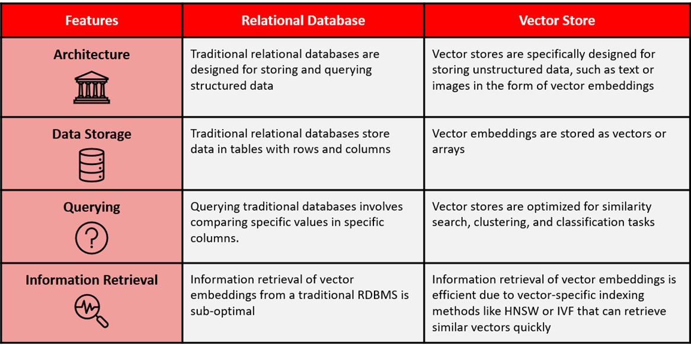  
They offer fast and accurate similarity search and data retrieval based on their vector distance or other similarity metrics.Vector stores consist of various components that work together to provide efficient storage,indexing and querying capabilities for high-dimensional vectors.Some of its key features include data management,metadata storage and filtering,and approximate nearest-neighbour(ANN)search algorithms.  
* **Data management**: Vector databases offer features for easy data storage, insertion, deletion and updating, making it convenient to manage and maintain vector data.  
* **Metadata storage and filtering**: These databases can store metadata associated with each vector entry, allowing users to query the database using additional metadata filters for more precise queries.  
* **Approximate nearest-neighbour (ANN) search algorithms**: Vector databases use a combination of algorithms to optimise similarity search, such as hashing, quantisation or graph-based search.  
The main advantages of using vector stores for storing and querying high-dimensional vectors are as follows:  
* **Fast and accurate similarity search**: Vector stores excel at finding the most similar or relevant data based on the underlying semantic or contextual meaning of various texts which enables efficient retrieval of information. These can return query results faster than the traditional methods of search, such as keyword-based search or k-Nearest Neighbour-based searching methods.  
* **Flexibility**: Vector stores can be used with various types of high-dimensional vectors, ranging from tens to thousands of dimensions, depending on the complexity and granularity of the data.  
  
  
The popularity of vector stores is augmented by the availability of indexing strategies that can retrieve embeddings faster than traditional lookup-based approaches.Indexing in vector stores involves breaking down a document or website into smaller segments and converting these segments into vectors that can be stored in a vector database.The indexing process maps the vectors to a data structure that can be traversed quickly.  
As mentioned in the video,vector stores use indexing strategies to efficiently query vectors by computing the proximity of a query to the vector embeddings.The indexing algorithms used in vector databases vary depending on the specific application.Recently,however,approximate nearest-neighbours(ANN)methods such as product quantisation,Hierarchical Navigable Small World(HNSW)and Locative Sensitive Hashing(LSH)have garnered significant attention from developers and researchers alike.As the name suggests,ANN methods involve an approximation of the usual nearest-neighbour methods.You might already be familiar with some of the common methods of the nearest-neighbour algorithm called the k-nearest neighbour(kNN)method.  
As discussed already,semantic search involves comparing the vector representations of a query and document by generating the vector embeddings and comparing the embeddings using a distance metric such as cosine similarity.Exact nearest neighbours,such as the kNN algorithm,can often help narrow down the retrieval process and produce accurate search results.But this accuracy comes at the expense of increased retrieval time.On the other hand,ANN methods sacrifice accuracy for speed.  
  
ANN->Same as L1 or L2 distance in 1d or 2d and  
  
  
Now,as mentioned in the previous session,such an exact search often results in an O(N)time complexity;however,ANN techniques result in a sub-linear time complexity O(log(N)).This is achieved with the help of special indexing techniques that make retrieval faster compared to traditional lookup-based methods.Indexing is like sorting a guest list by a certain characteristic,such as the first letter of their names or their closeness to you,so you can find your friends faster.Searching in vector stores involves querying the vector database to retrieve the most similar or relevant data based on their vector distance or similarity.The vector store compares the indexed query vector to the indexed vectors in a data set to find the nearest neighbours by applying a similarity metric of the indexed vectors.  
In summary,indexing is the process of organising vectors in a way that allows for efficient similarity search,while searching is the process of querying a vector database to retrieve the most similar or relevant data based on their vector distance or similarity.Some of the common approximate nearest-neighbour algorithms are as follows:  
* Tree-based algorithms such as ++[ANNOY](https://github.com/spotify/annoy)++, which was created by Spotify  
* Graph-based algorithms such as the Hierarchical Navigable Small World (HNSW) algorithm; popular C++ implementation of this algorithm available ++[here](https://github.com/nmslib/hnswlib)++  
* Cluster-based algorithms such as the ++[Facebook AI Similarity Search (FAISS)](https://github.com/facebookresearch/faiss)++ and ++[Product Quantisation](https://www.pinecone.io/learn/series/faiss/product-quantization/#:~:text=Product%20quantization%20(PQ)%20is%20a,x%20faster%20in%20our%20tests.)++(PQ)  
* Hash-based algorithms such as ++[Locality Sensitive Hashing](https://www.pinecone.io/learn/series/faiss/locality-sensitive-hashing/)++ (LSH).  
Each algorithm mentioned above finds applications in various use cases and comes with its own advantages and disadvantages.In the video above,Aditya explained the popular algorithm HNSW,which is a popular method of conducting approximate nearest-neighbour searches.  
  
  
**Hierarchical Navigable Small World (HNSW)**The Hierarchical Navigable Small World(HNSW)algorithm is a popular graph-based method that combines the principles of Navigable Small World and proximity graphs.It is a fully graph-based solution that constructs a multi-layered graph with fewer connections in the top layers and more dense regions in the bottom layers as shown in the image below.The search starts from the highest layer and moves one level below every time the local nearest neighbour is found greedily among the layer nodes.Ultimately,the nearest neighbour found in the lowest layer is the answer to the query.Nodes in HNSW are inserted sequentially one by one,and every node is randomly assigned an integer indicating the maximum layer at which the node can be present in the graph.  
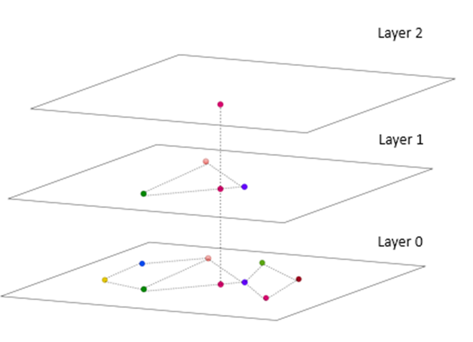  
The HNSW greedy search algorithm is sublinear,which means it has a complexity close to log(N),where N is the number of vectors in the graph.This makes it an efficient algorithm for approximate nearest-neighbour search.HNSW is used in various vector databases and libraries,including Pinecone,Faiss and ChromaDB.  
In the next segment,we will go over the various types of vector stores that are commonly available,namely vector libraries and vector databases.  
**Additional Readings:**  
* This ++[article](https://www.pinecone.io/learn/vector-database/#:~:text=a%20vector%20database.-,Algorithms,-Several%20algorithms%20can)++ goes into depth about the various vector indexing algorithms.  
* This ++[article](https://www.pinecone.io/learn/series/faiss/hnsw/)++ by Pinecone explains the workings behind the HNSW algorithm in detail.  
* This ++[article](https://abishek21.medium.com/building-your-favourite-tv-series-search-engine-information-retrieval-using-bm25-ranking-8e8c54bcdb38)++ demonstrates the BM25 indexing strategy for information retrieval.  
* In this ++[article](https://medium.com/swlh/demystifying-a-web-search-problem-using-inverted-index-c6df8236291)++, the author goes into detail about the use of the Inverted File Index (IVF) indexing strategy.  
**Generative Search**  
In the previous session,you were introduced to the key elements of semantic search.You dived into the technicalities of the semantic search pipeline and also learned how to augment the performance of the semantic search pipeline with the help of vector databases.Semantic search is a type of search that goes beyond traditional keyword matching to understand the meaning of a query and return results that are relevant to the user's intent.You were also introduced to the term‘generative search’,which refers to the type of search that uses artificial intelligence to generate new content in response to a user's query.This content can include text,images,code and creative content.Let's hear more about it in the video given below.  
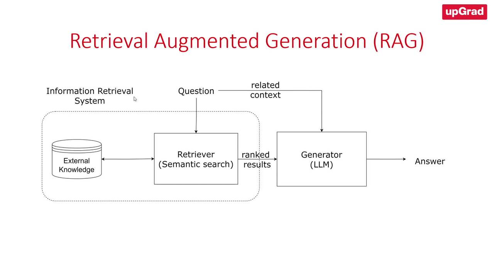  
As explained in the video,the main distinction between semantic search and generative search is that semantic search is primarily focused on retrieving relevant information,whereas generative search is focused on generating new content.However,the two technologies can be used together to improve the performance of a variety of tasks,such as question answering,summarisation,and machine translation.For example,a question-answering system can use semantic search to retrieve relevant documents from a knowledge base and then use generative search to generate a comprehensive and informative answer to the user's question.The differences between semantic search and generative search are elaborated in the table below.  
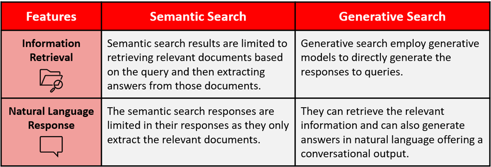  
Overall,semantic search and generative search are two powerful technologies that can be used to improve the performance of various AI tasks.Using these technologies together,we can create AI systems that are more accurate,informative and helpful.  
Retrieval augmented generation(RAG)is a special type of generative search that combines the strengths of semantic search and large language models to generate more accurate responses to user queries.This is a new search paradigm that combines the strengths of both retrieval-based models and generative foundation models to enhance the quality and relevance of the generated text.RAG retrieves relevant information from an external knowledge base to supplement the LLM's internal representation of information,which allows for fine-tuning and adjustments to the LLM's internal knowledge,making it more accurate and up-to-date.RAG has several applications,including question-answering systems,chatbots,and industry-specific LLMs.RAG can reduce hallucinations and repetition while improving specificity and factual grounding compared with conversation without retrieval.RAG can also provide more contextually appropriate answers to prompts as well as base those answers on the latest data.  
**RAG Pipeline**  
* Embedding Layer  
* Search and Rank Layer  
* Generation Layer  
* 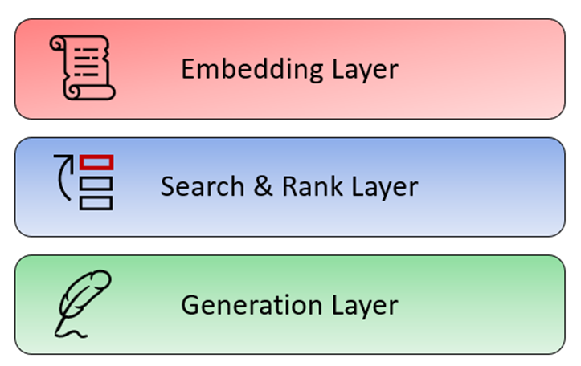  
Now,let’s discuss each of these layers in detail.  
**Embedding Layer**  
You are already familiar with the embedding layer,as it was covered in the previous sessions on semantic search.The embedding layer is typically the first layer of a RAG model,and it typically contains an embedding model that is trained on a massive data set of text and code.This data set is used to learn the relationships between words and phrases and to create embeddings that represent these relationships.The embedding layer is an important part of RAG models because it allows your system to understand the meaning of the text that it is processing and understand its semantic relationship to the query.The embedding layer generates embeddings for your text corpus and allows the RAG model to understand the meaning of the query and to generate a relevant and informative response.This is essential for a variety of tasks,such as question answering,summarisation and machine translation.  
**Search and Rank Layer**  
The next layer is the search and rank or the re-rank layer.The search and re-rank layer is a crucial component that is responsible for retrieving the relevant information from an external knowledge base,ranking it based on its relevance to the input query and presenting it to the generation layer for further processing.The search and re-rank layer is an essential component of RAG,as it ensures that the retrieved text is accurate,relevant and contextually appropriate.The search and re-rank layer typically consists of two components:  
* A search component that uses various techniques to retrieve relevant documents from the knowledge base  
* A re-rank component that uses a variety of techniques to re-rank the retrieved documents to produce the most relevant results  
The search component typically uses a technique called semantic similarity.As discussed in the previous session,semantic similarity is a measure of how similar two pieces of text are in terms of their meaning.The search component uses semantic similarity to retrieve documents from a knowledge base that are relevant to the user's query.  
The re-rank component of the search typically uses a variety of techniques to re-rank the retrieved documents.These techniques can include the following:  
* Ranking by relevance: The re-rank component can rank the retrieved documents based on how relevant they are to the user's query.  
* Ranking by popularity: The re-rank component can rank the retrieved documents based on how popular they are, such as by measuring the number of times they have been viewed or shared.  
* Ranking by freshness: The re-rank component can rank the retrieved documents based on how recent they are, such as by measuring the date on which they were published.  
The search and re-rank layer is an important part of RAG models because it allows the model to retrieve and re-rank relevant documents from a knowledge base.This is essential for numerous tasks,such as question answering,summarisation and machine translation.The search and re-rank layer is a powerful tool that can be used to improve the performance of a variety of AI tasks.It is an essential part of RAG models,and it plays a key role in helping these models retrieve and re-rank relevant information.The retrieval-based model is used to find relevant information from existing information sources.The re-rank layer is used to rank the retrieved information based on its relevance to the input query.  
**Generation Layer**  
The generation layer is typically the last layer of a RAG model which consists of a foundation large language model that is trained on a massive data set of text and code.As the name suggests,the generation layer allows the model to generate new text in response to a user's query.The generative model takes the retrieved information,synthesises all the data and shapes it into a coherent and contextually appropriate response.This is essential for many tasks,such as question answering,summarisation machine translation and also generative search specifically RAG.In the context of search,this layer excels in providing context and natural language capabilities for generative search.  
Aditya then explained the various stages of the RAG pipeline as shown in the image below.These are given below:  
1. **Step 1:**Build the vector store  
2. **Step 2:**Embed the query and perform semantic search  
3. **Step 3:**Pass the prompt with the query and the relevant documents to a Large Language Model (LLM)**NOTE**: In this project, we will be using GPT-3.5 as the Large Language Model for building the generative search application.  
4. 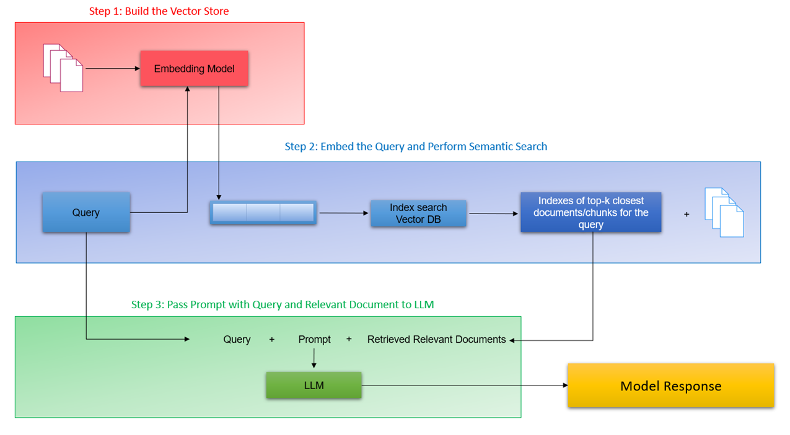  
5. Let’s go over each of these steps in detail.**Step 1: Build the vector store:**The first step is to build a vector store that can store documents along with metadata. A vector store is a database that stores embeddings of text data in a vector space. The documents are converted to raw text and then split into chunks. Each chunk is then represented as a vector using an embedding model. The vector store is then populated with these vectors.  
**Step 2:Embed the query and perform semantic search:**The next step is to embed the user query into the same vector space as the documents in the vector store.This is done using an embedding model.Once the query is embedded,a semantic search is performed to find the closest embedding from the vector store.The entries with the highest semantic overlap with the query are retrieved.  
**Step 3:Pass the prompt with the query and the relevant documents to the LLM:**The final step is to pass the prompt,which is a concatenation of the query and the retrieved documents,to the LLM.The LLM generates a response based on the context of the query,the system prompt and the relevant documents passed from the search layer.The retrieved documents serve as the knowledge bank and provide the necessary context for the query to the LLM,which helps it generate a more accurate and relevant response.  
In the first step,we process the documents(in this case,the documents pertain to the insurance domain)to extract the text,split it into smaller chunks and then pass them to the embedding model.  
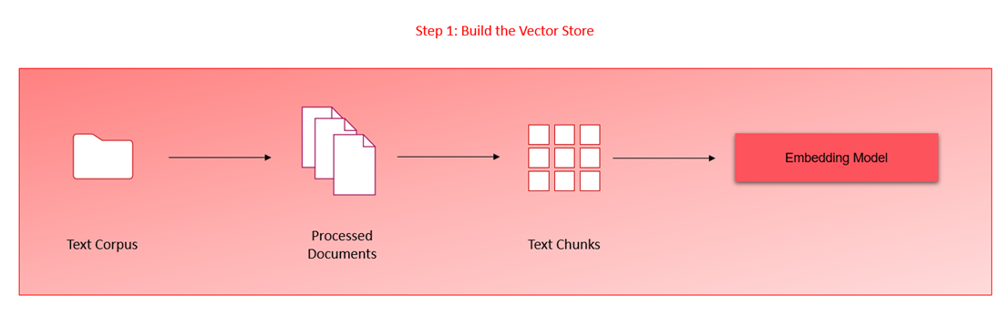  
As you saw in the video,the++[PDFPlumber library](https://pypi.org/project/pdfplumber/)++is very efficient in extracting the text contents of multiple PDF documents.The library can also represent a table in a neat list of lists format that preserves the original hierarchical structure of the document.The library also supports visual debugging of almost any type of machine-generated PDFs;you can read more about it in the documentation link provided above.  
**System Design HelpMate AI:**  
**Overview**  
In the previous segment,we looked at step 1 of the RAG pipeline.We ingested the documents,processed the text and tables and generated the embeddings using a text embedding model.Once the embeddings have been generated,we then store the embeddings in a vector database such as ChromaDB.  
As with any good system design,we need to consider a scenario when the application is scaled-suppose the number of documents increases or multiple users are using the application.Such a scenario opens up multiple concerns about the system’s performance  
* How will the system handle multiple queries simultaneously?  
* Is there scope to improve the system’s overall performance in search and retrieval?  
The first concern can be solved by using vector databases and scaling up the compute units(clusters/server)for the application.For the second concern,an improvement to the overall system design is required which can be achieved by implementing a cache collection in the vector database that stores previous queries and their results in the vector database.Let’s hear more on this from Akshay in the video below.  
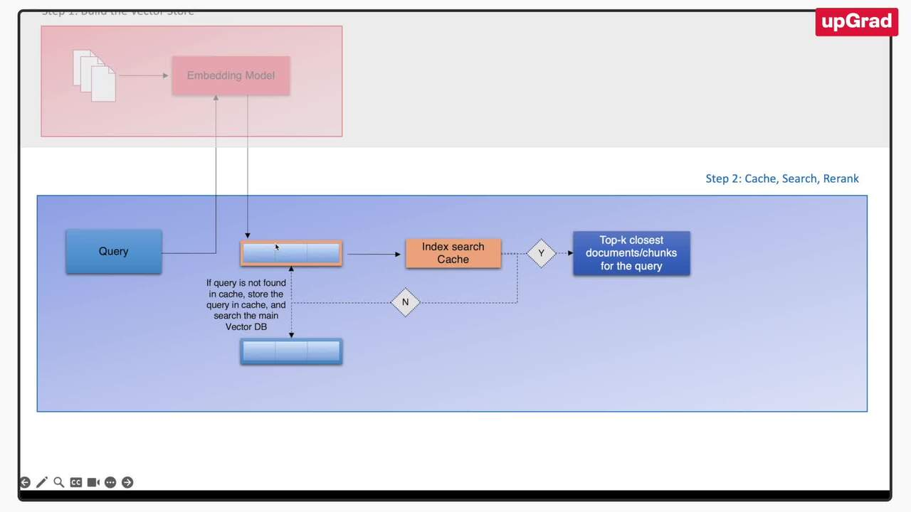  
As mentioned in the video,we create a cache collection within the vector database that will try to cache the queries coming in and the corresponding responses.Creating a cache is important to preserve the scalability of the RAG system,particularly when documents span in the range of 1,000 or more and multiple users are using this application concurrently.With this additional layer,when a query is first input,the system first searches within the cache collection instead of the bigger collection.Cache implementation results in an improved response time from the system since a semantic similarity search need not be performed for a query that the system has already seen.The image below shows the system design with a cache layer.It should be noted that the diagram also includes a re-ranking layer that we will discuss in the next segment.  
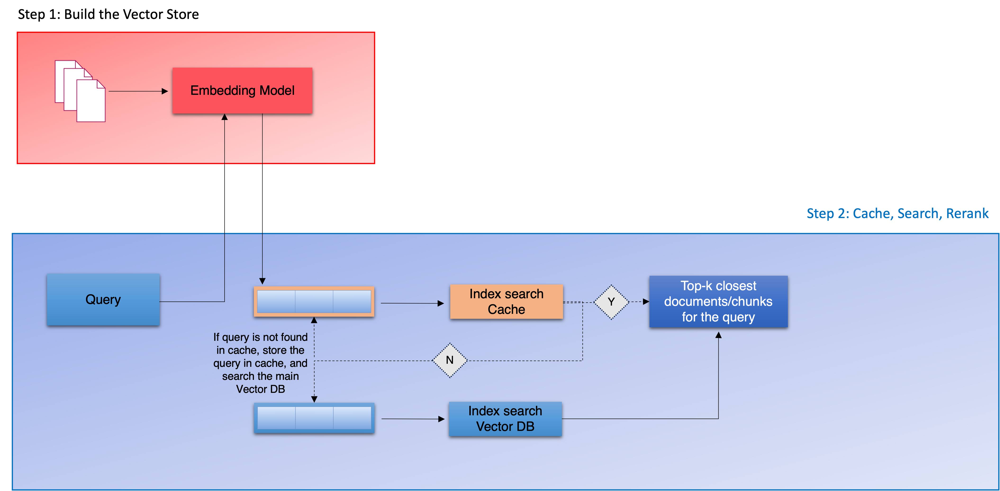  
A semantic cache stores the meaning of a query or request instead of only the raw data along with the responses.This can reduce the number of queries the database needs to process by recalling previous queries and their results.The cache system can now circumvent the semantic search layer,which has been the bottleneck of the system,and directly provide responses for the queries that have already been generated before and stored in the cache collection.Now,when the query is passed to the application,its vector representation is generated and then searched in the cache collection first.If the query is not found in the cache collection,the system queries the main collection and finds the top k closest documents or chunks for the query.The results are then returned to the user and,simultaneously,are stored in the cache along with the query.Customising and monitoring the cache's performance can also make it more efficient.Since the cache stores previous queries and results,it can quickly provide the results of a query without processing it.As a result,response times can be faster,and users can experience better application performance.  
RAG Demo-Part 2.2:Re-RankingSo far,you have learned how to implement the semantic search layer with cache.In this segment,we will look at another crucial element to improve the performance of the semantic search layer-re-ranking.Let’s learn more about this from the video below.  
As discussed in the video,the re-ranking stage is the next step in building the semantic search pipeline.So far,in our semantic search application,the system returns the top K documents that contain information relevant to the user’s query.The quality and accuracy of the information contained in these chunks or documents may vary-the system might retrieve documents that are not quite relevant to the search query.The purpose of the re-ranking layer is to sift through these top K results,verify the accuracy of the results in terms of the query and rank them or assign an importance score to these results for the query.Here are some of the benefits of using re-ranking in generative search:  
* Improved accuracy and relevance of the generated results  
* Reduced amount of irrelevant or inaccurate information presented to the user  
* More personalised and informative search results  
* Ability to tailor the search results to specific tasks or domains  
Traditionally,many methods of re-rank methods have been used in search such as Reciprocal Rank Fusion(RRF),hybrid search methods and cross-encoder models.For this project,we will focus on the popular method of using cross-encoders for our re-ranking task.The image below illustrates the re-ranking component once the search results have been collected by the semantic search layer.  
As mentioned in the video,cross-encoder models are transformer models that can be used to learn the semantic similarity between two text sequences.They are trained on a large data set of text pairs,where each pair is labelled with a score indicating how similar the two sequences are.Once trained,cross-encoder models can be used to compute the similarity between any two text sequences,even if they have never been seen before.The image below illustrates the function of a cross-encoder model.  
  
There are a number of advantages of using cross-encoder models for re-ranking.First,these models can learn the semantic similarity between text sequences,which is a more accurate measure of relevance than traditional methods,such as keyword matching.Second,cross-encoder models can capture long-range dependencies in text,which can be important for understanding the meaning of a sentence or paragraph.Third,the models can be used to re-rank documents from any domain,without the need for any domain-specific knowledge.  
So far,we have covered the semantic search system of our application.The application seems to be performing quite well for the queries that we have passed so far.However,the inherent limitation of our application is that while it returns the top references for our query,the application is not a full-fledged generative system yet.The below diagram represents our system design so far.  
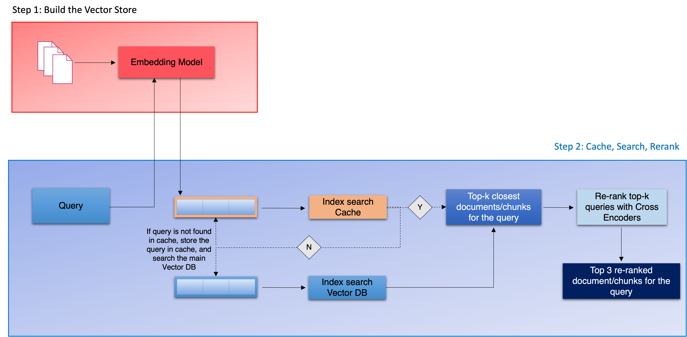  
The final step in our semantic search application is to include a generative AI model capable of generating content in response to the results or contexts passed to it.  
As mentioned in the video,cross-encoder models are transformer models that can be used to learn the semantic similarity between two text sequences.They are trained on a large data set of text pairs,where each pair is labelled with a score indicating how similar the two sequences are.Once trained,cross-encoder models can be used to compute the similarity between any two text sequences,even if they have never been seen before.The image below illustrates the function of a cross-encoder model.  
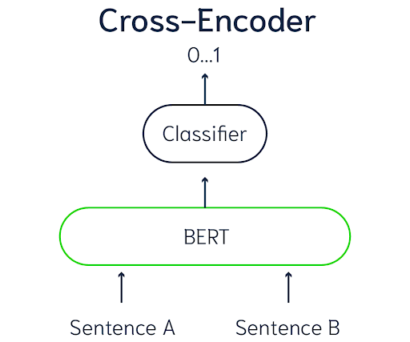  
There are a number of advantages of using cross-encoder models for re-ranking.First,these models can learn the semantic similarity between text sequences,which is a more accurate measure of relevance than traditional methods,such as keyword matching.Second,cross-encoder models can capture long-range dependencies in text,which can be important for understanding the meaning of a sentence or paragraph.Third,the models can be used to re-rank documents from any domain,without the need for any domain-specific knowledge.  
So far,we have covered the semantic search system of our application.The application seems to be performing quite well for the queries that we have passed so far.However,the inherent limitation of our application is that while it returns the top references for our query,the application is not a full-fledged generative system yet.The below diagram represents our system design so far.Generation Layer  
  
The final step in our semantic search application is to include a generative AI model capable of generating content in response to the results or contexts passed to it.  
  
**Generation Layer**  
In the previous segments,we explored the first two steps in our semantic search application.The next stage of the generative search application is the generation layer.This layer uses the generation capabilities of a large language model(LLM)to augment the system’s output.  
As mentioned in the video,the semantic search layer of our application performs the retrieval process or the information retrieval task and returns the top k documents for the user’s query.These top k results,along with the user’s query and the system prompt,are then passed to the LLM model to generate a model response that best answers the user’s query.The LLM is provided with three inputs-query,prompt and top retrieved documents-as shown in the image below.  
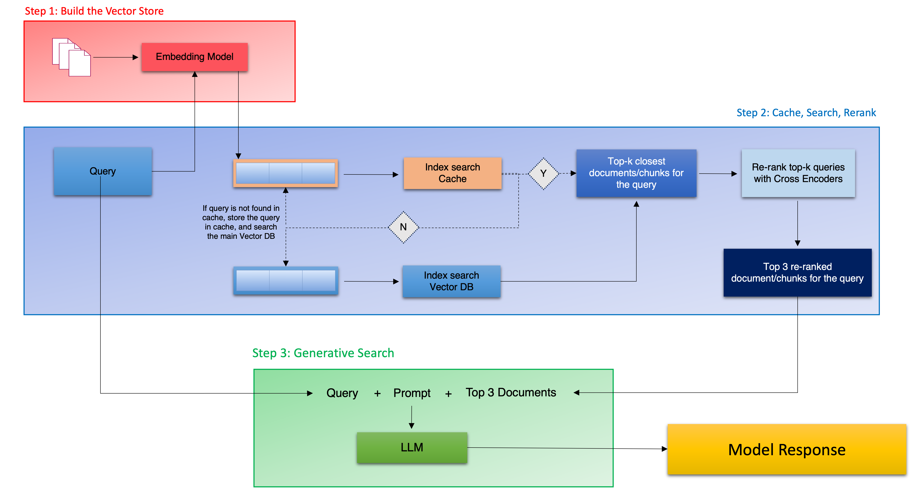  
The retrieval system retrieves the top K results from the knowledge base for the user’s query,which are then passed to the LLM for generating the response.The LLM is provided with the system prompt that condenses the information from the top K results and generates a unique response to the query.As discussed in the video,the system prompt is shown below.  
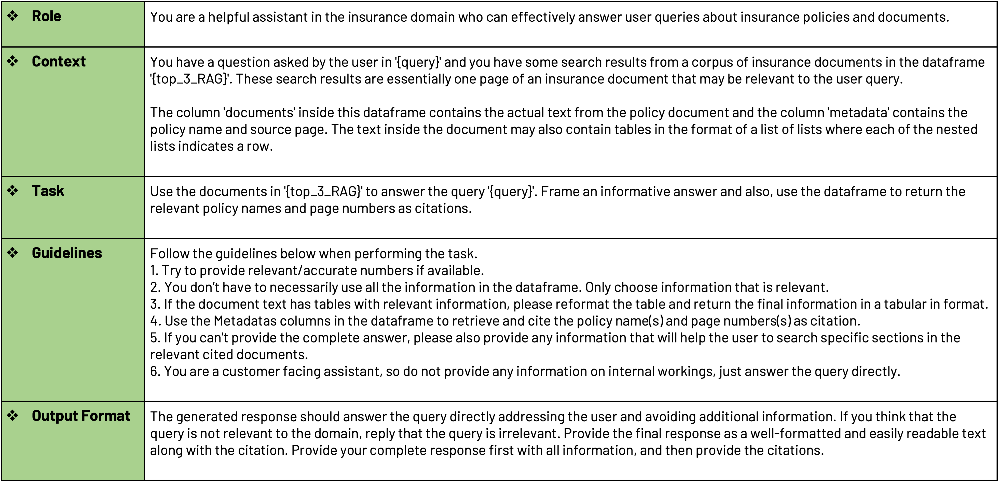  
The system prompt can vary depending on the nature of the application.For generating responses for the documents pertaining to the insurance domain,the prompt above has generated results with reasonable performance.Depending on the domain and documents,the system prompt can be modified to generate responses accordingly.  
**Summary**  
Let’s summarise the essential concepts covered in this session.  
The RAG pipeline consists of three steps as illustrated in this image:  
1. Step 1: Build the Vector Store  
2. Step 2: Embed the Query and Perform Semantic Search  
3. Step 3: Pass the Prompt with the Query and the relevant documents to the Large Language Model (LLM)  
4. 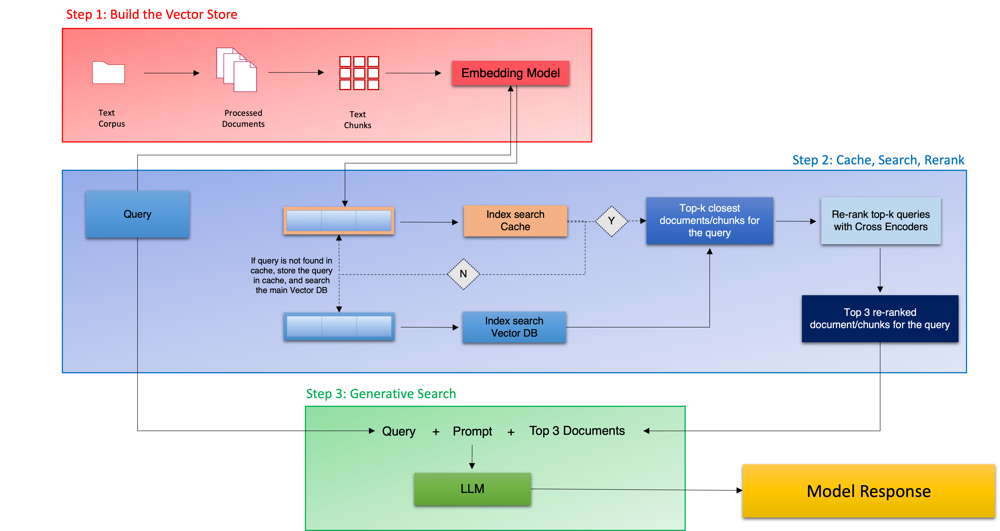  
5. The first step in the pipeline is to build a vector store that can store documents along with metadata. The typical process involves ingesting the documents, converting the raw text in the documents and then splitting them into chunks based on various chunking strategies. Each chunk is then represented as a vector using an appropriate text embedding model, which is then stored in the vector database.  
The next step is to embed the user query into the same vector space as the documents in the vector store with the embedding model.Once the query is embedded,a semantic search is performed to find the closest embedding from the vector store.The top K entries(chunks or documents)that have the highest semantic overlap with the query are retrieved using various search and indexing strategies that are available in vector databases.  
In addition to the semantic search layers for retrieving the top K relevant documents,we also discussed two major strategies to improve the overall performance and responsiveness of the semantic search system:  
* Cache mechanism  
* Re-ranking layer  
Once the top entries for the query have been retrieved and re-ranked,the next stage is to pass the results to the generative search step.In this final step,the prompt,along with the query,and the relevant documents are passed to the LLM to generate a unique response to the user’s query.The retrieved documents provide context to the LLM,which helps it generate a more accurate response.  
Overall,retrieval augmented generation combines the strengths of semantic search and large language models to generate more accurate responses to user queries.  
