# CNN  
  
## Intro  

* Template Matching-> Same input as image as filter-> same output  
*   
* Shared Weights->Ssparse-connected layer  
* with **parameter sharing (Parameters of weights)**
* 
* We make assumption that if one filter extracts a feature at some spatial position (x,y), then it should also be useful to compute the same  
* feature at a different position (x1,y1).  
*   
* **Receptive Field->**  **neuron** is basically a filter whose weights are learnt during training. For example, a (3, 3, 3) filter (or neuron) has 27 weights. Each neuron looks at a particular region in the input (i.e. its 'receptive field').  
*   
* Tramslational Equivarance-> Same input at one location-> Same output..  
* 
  
  
think understand CNN now.. control anxiety.. and watch this lecture to exactly see meaning of feature maps-> is channels of RGB.. and how to use..  
  
extracted features-> feature maps.. embeddings..  
after every layer-> output is called number of feature maps..  
extract bunch of feature maps-> features  
  
Let's dig a little deeper into CNN architectures now. In this segment, we will analyse the architecture of a popular CNN called **VGGNet.** Observing the VGGNet architecture will give you a high-level overview of the common types of CNN layers before you study each one of them in detail.  
  
To summarise, there are three main concepts you will study in CNNs:  
* Convolution, and why it 'shrinks' the size of the input image  
* Pooling layers  
* Feature maps  
   
The VGGNet architecture is shown below.  
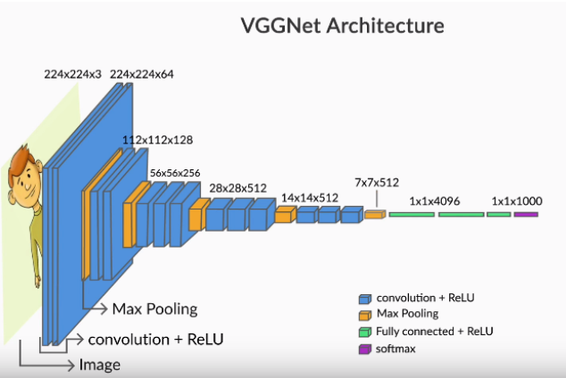  
The VGGNet was specially designed for the ImageNet challenge which is a classification task with 1000 categories. Thus, the softmax layer at the end has 1000 categories. The blue layers are the **convolutional layers **while the yellow ones are **pooling layers. **You will study each one of them shortly.  
   
Finally, the green layer is a **fully connected layer** with 4096 neurons, the output from which is a vector of size 4096.  
   
The most important point to notice is that the **network acts as a feature extractor** for images. For example, the CNN above extracts a **4096-dimensional feature vector** representing each input image. In this case, the feature vector is fed to a softmax layer for classification, but you can use the feature vector to do other tasks as well (such as video analysis, object detection, image segmentation etc.).  
   
Next, you will see how one can do **video analysis **using the feature vector extracted by the network.  
   
   
   
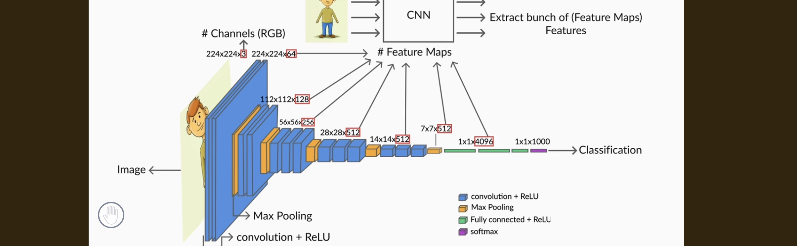  
Output  
  
Input-> 224*224*3  
W1-> 224*224*64-> (64)-> feature maps  
same for all..  
  
  
  
# Channels (RGB)  
个  
224x224x3  
W1-> 224x224x64  
W2->112x112x128  
W3->56x56×256  
W4-> 28x28x512  
convolution + ReLU  
W5->7x7x512  
→ Max Pooling convolution + ReLU  
	14x14x512  
Fully connected + ReLU  
	1x1x4096-> Features→ 4096 features  
Classification -> softmax  
	1x1x1000-> output  
  
Extract bunch of (Feature Maps)  
Features# Feature Maps  
  
Sequence of CNN Layers-> Feature Extractor-> (Feature Learning)-> More precise..  
  
Max Pooling-> Summarizes strongest response by taking a statistical aggregate.. maximum value 
  
  
The VGGNet was specially designed for the ImageNet challenge which is a classification task with 1000 categories. Thus, the softmax layer at the end has 1000 categories. The blue layers are the **convolutional layers **while the yellow ones are **pooling layers. **You will study each one of them shortly.  
   
Finally, the green layer is a **fully connected layer** with 4096 neurons, the output from which is a vector of size 4096.  
   
The most important point to notice is that the **network acts as a feature extractor** for images. For example, the CNN above extracts a **4096-dimensional feature vector** representing each input image. In this case, the feature vector is fed to a softmax layer for classification, but you can use the feature vector to do other tasks as well (such as video analysis, object detection, image segmentation etc.).  
   
Next, you will see how one can do **video analysis **using the feature vector extracted by the network.  
   
**Introduction to VGG Net as a CNN Architecture**  
Let us start by looking at one of the popular CNN architectures.This is called the VGG net.This was one of the very successful architectures that gave stunning results on the visual recognition challenge and it actually reveals a lot about how CNN's are constructed.And unlike many of the other architectures like Elexnet, for example, and say Resnet, they are extensions of CNN.There are some additional elements.So for someone who is getting introduced to CNN, these additional elements can be a little confusing.But VGG Net is almost a pure CNN network, so it is very convenient to use this as an example to illustrate all the key elements of a a standard CNN architecture.And once you understand this well, I am sure you will have no difficulty extending this understanding to the other variants like Alexnet and Resnet and any other architecture that you could create yourself based on these ideas.  
00:01:24 - 00:03:27  
**Structure and Layers of VGG Net**  
So you can see that this is a fairly deep architecture, deep in the sense there are lots and lots of layers here.Each slab here represents a layer.This is the input image.And then you can see that there are CNN layers.You can see that the black ones are the CNN layers.So there are CNN layers here and these CNL layers are of the same size as the original image.And then you have Max pooling layer and this kind of repeats, right?So you have some CNL layers followed by a pooling layer, few other CNL layers followed by another pooling, and then you have CNL layers, you have pooling, CNN pooling, CNN pooling and finally you have a soft Max which does the classification.Please remember that this was originally constructed for the Visual Recognition challenge, which means I am given an image and I am trying to classify it into one of 1000 categories as it says here.So the the output layer is a soft Max with a fan out of 1000 and each each of the 1000 outputs represents the probability of this image belonging to one of those 1000 classes.So that is the overall architecture of the the VGG net.So you can see that this is almost plain one CNN, there is really nothing else here.  
00:03:27 - 00:05:19  
**Understanding CNN Layers and Image Scaling**  
You have CNN's Max pooling, CNN's Max pooling.And so you can also see that the the first CNN layers as I mentioned are of the same size as the original image and then the size keeps shrinking, right.And finally you have only 14 by 14 whereas you started with 224 by 224.So there is a scale down of the image and you see these additional numbers.This 3 is the number of channels.So in this case it is simply RGB.Each of these numbers here, 542, five, 12312, all of these are the number of feature maps.So I am introducing some terms here.We will drill deeper into each of those terms as we go along.So the terms that we need to discuss specifically are the convolution.So what does it mean to convolve an image?And that is the genesis of this term, convolutional neural network.So what exactly is this convolution and why does that convolution result in a shrinkage of the image and so on.South, that is the first thing that we will discuss.Then we will look at the pooling layers.  
00:05:21 - 00:06:12  
**Introduction to Convolution, Pooling, and Feature Maps**  
We will also look at feature maps.What exactly are feature maps?What role do they play?And so on and so forth.So these three together would constitute more or less everything about CNN's otherwise.I mean, once you have this basic CNN pack which consists of feature maps, convolution and pooling, then the way it has been done here, you can stack them up, You can have as many such stacks as you want.  
00:06:13 - 00:07:25  
**Stacking CNN Layers for Classification or Regression**  
And finally, you c**ould either do a classification or a regression or anything else that you want to do with this image.If you are doing video analysis, let us say, right?So you could have a bunch of CNN layers which could as well be something like VGG net, right?So here is CNN.So I am writing CNN as a shorthand for any CNN based architecture.It could involve multiple convolution, pooling and feature maps.And So what is happening here is that I have this image and through a series of convolutional layers, convolutional pooling and feature maps, I have actually extracted bunch of features for each image.**  
00:07:27 - 00:09:04  
**Feature Extraction and Multiclass Classification with CNNs**  
So you can see that you effectively have 49 six features with every image.So you have a vector pretty much of size 49 six.And this vector is a representation of the image that has been created.So this is your feature vector and all you are doing here is your traditional classification.You have a multiclass classification here.This is in fact just a multiclass logistic regression.That is precisely what a soft Max is.So you have a feature vector of size 49 six and then you are pushing it through multi class logistic regression to then come up with the probability that this image belongs to anyone of these classes, right?So you could now think of this sequence of CNN layers as a feature extractor.OK, So what the CNN layers are basically trying to do is to extract a bunch of features for every image that that is given as an input to this CNN network**.And I could then use the features that I am extracting for any other purpose.**  
  
  
To summarize:  
* Images are made up of **pixels**.  
* A number between 0-255 represents the **colour intensity** of each pixel.  
* Each pixel in a **colour image** is an array representing the intensities of red, blue and green. The red, blue and green layers are called **channels**.  
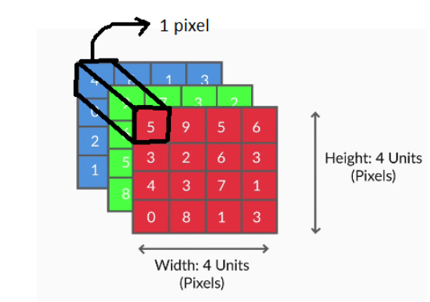  
   
* In a **grayscale image** (a 'black and white' image), only one number is required to represent the **intensity of white**. Thus, grayscale images have **only one channel.  **  
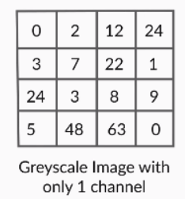  
   
Now that you know that images can be represented as numbers, let’s see an example of how one would read images into Python.  
   
You can download the notebook at this ++[link](https://github.com/ContentUpgrad/Convolutional-Neural-Networks)++.   
   
 Images-> Numbers-> CNN is an architecture of some kind when only sparse connections are needed and not all features are important.. spatial locality,  
   
any input to neural network is numeric-> so convert it to nd arrays..  
#todo early stopping..  
  
  
**Striding and Padding**  
  
In the previous segment, while doing convolutions, each time we computed the element-wise product of the filter with the image, we had moved the filter by exactly one pixel (both horizontally and vertically). But that is not the only way to do convolutions - you can move the filter by an arbitrary number of pixels. This is the concept of **stride**.  
   
Let's study strides in a little more detail. The notion of strides will also introduce us to another important concept - **padding.**  
  
You saw that there is nothing sacrosanct about the stride length 1. If you think that you do not need many fine-grained features for your task, you can use a higher stride length (2 or more).  
   
You also saw that you cannot convolve all images with just any combination of filter and stride length. For example, you cannot convolve a (4, 4) image with a (3, 3) filter using a stride of 2. Similarly, you cannot convolve a (5, 5) image with a (2, 2) filter and a stride of 2 (try and convince yourself).   
   
To solve this problem, you use the concept of **padding.**  
   
**Padding**  
The following are the two most common ways to do padding:  
* Populating the dummy row/columns with the pixel values at the edges  
* Populating the dummy row/columns with zeros (zero-padding)  
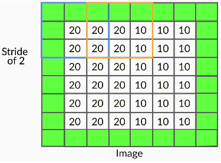  
**Notation:**  
**Padding of 'x' means that 'x units' of rows/columns are added all around the image. token-> padding non zero in text..transformers..dummy-> to keep size same**  
   
An alternate (less commonly used) way to do convolution is to shrink the filter size as you hit the edges.   
   
You may have noticed that when you convolve an image **without padding** (using any filter size), the **output size is smaller **than the image (i.e. the output '**shrinks'**). For example. when you convolve a (6, 6) image with a (3, 3) filter and stride of 1, you get an output of (4, 4).   
   
If you want to **maintain the same size**, you can use padding. Let's see how padding maintains the image size.  
  
You saw that doing convolutions without padding **reduces the output size**. It is important to note that** only the width and height decrease (not the depth) **when you convolve without padding.** ** The depth of the output depends on the number of filters used -  we will discuss this in a later segment.  
   
**Why Padding is Necessary?**  
You saw that doing convolutions without padding will 'shrink' the output. For example, convolving a (6, 6) image with a (3, 3) filter and stride of 1 gives a (4, 4) output. Further, convolving the (4, 4) output with a (3, 3) filter will give a (2, 2) output. The size has reduced from (6, 6) to (2, 2) in just two convolutions. Large CNNs have tens (or even hundreds) of such convolutional layers (recall VGGNet), so we will be incurring massive 'information loss' as we build deeper networks!  
   
**This is one of the main reasons padding is important - it helps maintain the size of the output arrays and avoid information loss.** Of course, in many layers, you actually want to shrink the output (as shown below), but in many others, you maintain the size of the output.  
  
   
Until now, you have been computing the output size (using the input image size, padding and stride length) manually. In the next segment, you will learn generic formulas which will help reduce some of the manual work that you have been doing.  
   
Before you proceed further, Spend some time answering the question next.  
  
Formulas  
  
In this segment, you will go through useful formulas for calculating the output size using the input size, filter size, padding and stride length.   
   
**Fun Challenge**  
Before moving on to the lecture, you may want to try solving this problem yourself first: Given an image of size (n, n), a (k, k) filter, padding of p pixels on either side of the image, and stride length of S,  derive a general formula for computing the output size after convolution.  
  
* Image  - n x n  
* Filter - k x k  
* Padding - P  
* Stride - S  
   
After padding, we get an image of size (n + 2P) x (n+2P). After we convolve this padded image with the filter, we get:  
 Size of convolved image =  
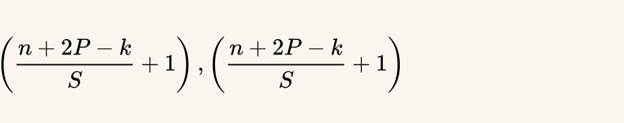  
  
  
## Weights and Biases  
  
So far, we have been doing convolutions only on 2D arrays (images), say of size 6x6. But most real images are coloured (RGB) images and are 3D arrays of size m x n x 3. Generally, we represent an image as a 3D matrix of size** height x width x channels.**  
   
  
To convolve such images, we simply use **3D filters**. The basic idea of convolution is still the same - we take the element-wise product and sum up the values. The only difference is that now the filters will be 3-dimensional, For example: 3 x 3 x 3, or 5 x 5 x 3 (the last '3' represents the fact that the filter has as many channels as the image).   
   
Let's now see how convolutions are performed on 3D arrays and what it is that a CNN 'learns' during **training**.  
  
To summarise, you learnt the following:  
* We use **3D filters** to perform convolution on 3D images. For example: if we have an image of size (224, 224, 3), we can use filters of sizes (3, 3, 3), (5, 5, 3), (7, 7, 3) etc. (with appropriate padding etc.). We can use a filter of any size as long as the number of channels in the filter is the same as that in the input image.  
* The** filters are learnt** during training (i.e. during** **backpropagation). Hence, the individual values of the filters are often called **the weights of a CNN.**  
**Comprehension - weights and biases **  
In the discussion so far, we have talked about only weights, but convolutional layers (i.e. filters) also have **biases**. Let's see an example to understand this concretely.  
Suppose we have an RGB image and a (2, 2, 3) filter as shown below. The filter has three channels, and each channel of the filter convolves the corresponding channel of the image. Thus, each step** **in the convolution involves the element-wise multiplication of 12 pairs of numbers and adding the resultant products to get a **single scalar output**.  
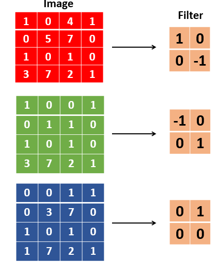  
The GIF below shows the convolution operation - note that in each step, a single scalar number is generated, and at the end of the convolution, a 2D array is generated:  
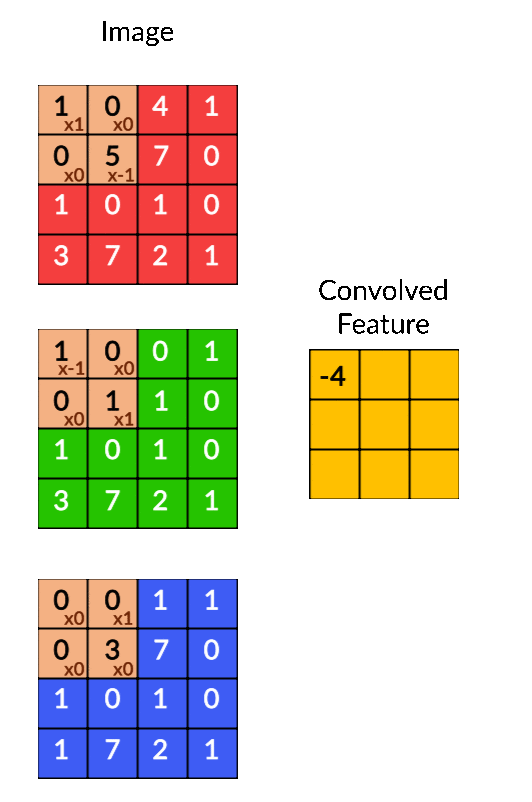  
You can express the convolution operation as a **dot product** between the weights and the input image. If you treat the (2, 2, 3) filter as a **vector** w of length 12, and the 12 corresponding elements of the input image as the vector  p (i.e. both unrolled to a 1D vector), each step of the convolution is simply the **dot product** of   
W† and p. The dot product is computed at every patch to get a (3, 3) output array, as shown above.  
Apart from the weights, **each filter** can also have a **bias**. In this case, the output of the convolutional operation is a (3, 3) array (or a vector of length 9). So, the bias will be a vector of length 9. However, a common practice in CNNs is that all the individual elements in the bias vector have the same value (called **tied biases**). For example, a tied bias for the filter shown above can be represented as: allowing each channel dot product sum(or W†P)->Patch P-> for all channels->  
                        
                   
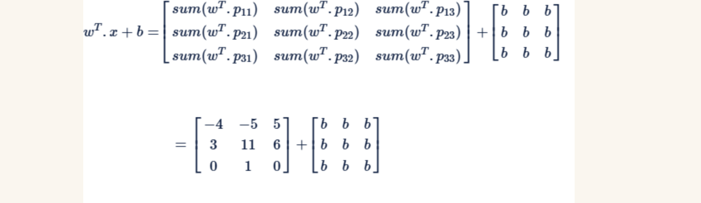  
The other way is to use **untied biases **where all the elements in the bias vector are different,  
but that is much less common than using tied biases.  
In the next segment, we will study **feature maps. **  
output of a patch is termed feature map after applying the non linear fn.. relu generally..å(w†x+b)-> each patch in a layer..   
share weights because in same layer..  
## Feature Maps  
  
From the previous segment, you know that the values of the filters, or the weights, are learnt during training. Let's now understand how multiple filters are used to detect various features in images. In this lecture, you will study **neurons** and **feature maps.**  
  
Let's summarise the important concepts and terms discussed above:   
* A **neuron **is basically a filter whose weights are learnt during training. For example, a (3, 3, 3) filter (or neuron) has 27 weights. Each neuron looks at a particular region in the input (i.e. its 'receptive field').  
* A **feature map** is a collection of multiple **neurons** each of which** **looks at **different regions** of the input with the **same weights**. All neurons in a feature map extract the same feature (but from different regions of the input). It is called a 'feature map' because it is a mapping of where a certain feature is found in the image.   
   
The figure below shows two neurons in a feature map (the right slab) along with the regions in the input from which the neurons extract features.   
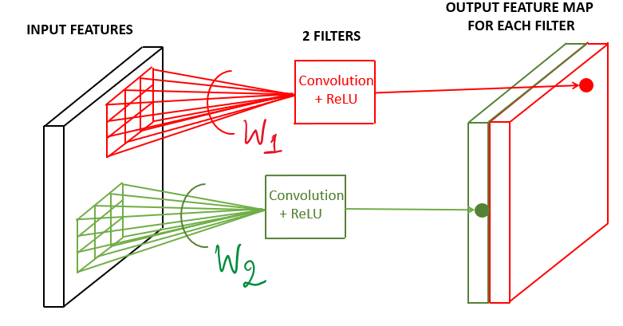  
   
In the figure above, the two neurons produce two feature maps. You can have multiple such neurons convolve an image, each having a different set of weights, and each produces a feature map.  
   
**Comprehension - Feature Maps**  
Consider the VGGNet architecture shown below. The first convolutional layer takes the input image of size (224, 224, 3), uses a (3, 3, 3) filter (with some padding), and produces an output of (224, 224). This (224, 224) output is then fed to a **ReLU** to generate a (224, 224) **feature map**. Note that the term 'feature map' refers to the (non-linear) **output of the activation function**, not what goes into the activation function (i.e. the output of the convolution).  
   
Similarly, multiple other (224, 224) feature maps are generated using different (3, 3, 3) filters. In the case of VGGNet, 64 feature maps of size (224, 224) are generated, which are denoted in the figure below as the tensor 224 x 224 x 64. Each of the 64 feature maps try to identify certain features (such as edges, textures etc.) in the (224, 224, 3) input image.  
  
   
The (224, 224, 64) tensor is the output of the **first convolutional layer. ** In other words, the first convolutional layer consists of 64 (3, 3, 3) filters, and hence contains 64 x 27 trainable weights (assuming there are no biases).  
   
The 64 feature maps, or the (224, 224, 64) tensor, is then fed to a **pooling layer**. You will study the pooling layer in the next segment.  
  
  
Left is Operation GlobalPoolingAverage-> average pooling??  
  
## Pooling  
  
In our earlier discussion on the experiments by Hubel and Wiesel, we had observed the following statement:  
* The strength of the response** **(of the retinal neurons) is proportional** **to the **summation **over the excitatory region.   
After extracting features (as feature maps), CNN's typically **aggregate these features **using the **pooling layer. **Let's see how the pooling layer works and how it is useful in extracting higher-level features.  
  
  
  
  
  
Pooling tries to figure out whether a particular region in the image has the feature we are interested in or not. It essentially looks at larger regions (having multiple patches) of the image and captures an **aggregate statistic** (max, average etc.) of each region. In other words, it makes the network **invariant to local transformations.**  
   
The two most popular aggregate functions used in pooling are 'max' and 'average'. The intuition behind these are as follows:  
* **Max pooling**: If any one of the patches says something strongly about the presence of a certain feature, then the pooling layer counts that feature as 'detected'.  
* **Average pooling**: If one patch says something very firmly but the other ones disagree,  the pooling layer takes the average to find out. called?  
  
Let's now look at an example of max pooling and understand some potential drawbacks of the pooling operation.  
  
Let's summarise the example of pooling used in the lecture:  
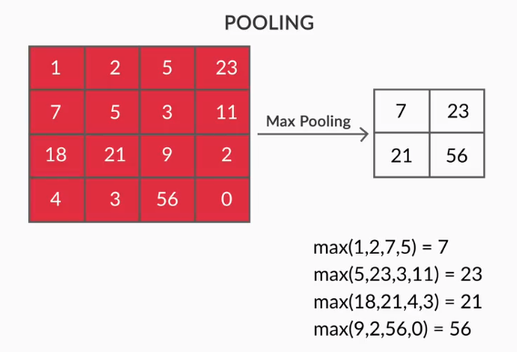  
In the above figure, you can observe that only the width and height of the input reduces. Let's extend this pooling operation to multiple feature maps:  
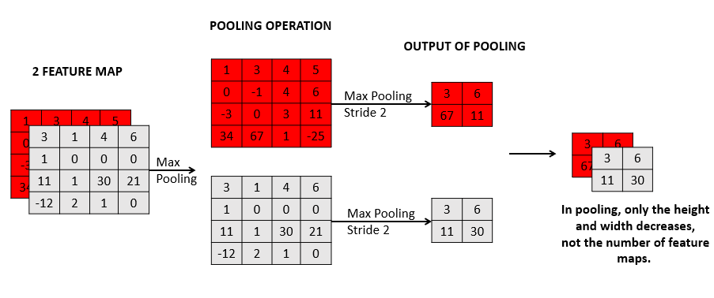  
You can observe that pooling operates on each feature map independently. It reduces the size (width and height) of each feature map, but the number of feature maps remains constant.   
   
Pooling has the advantage of making the representation** **more compact by** reducing the spatial size** (height and width) of the feature maps, thereby reducing the number of parameters to be learnt. On the other hand, it also **loses a lot of information**, which is often considered a potential disadvantage. Having said that, pooling has empirically proven to improve the performance of most deep CNNs.  
   
Can we design a network without pooling? **Capsule networks** were designed to address some of these potential drawbacks of the conventional CNN architecture. The paper on Capsule networks  is provided below.  
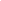  
In the next segment, we will summarise all the concepts discussed till now.  
   
**Additional reading**  
1. The paper on ++['Capsule Networks'](http://arxiv.org/pdf/1710.09829.pdf)++.   
   
Before you proceed further, Spend some time answering the question next.  
  
**Understanding Model Summary**  
It is a good practice to spend some time staring at the model summary above and verify the number of parameteres, output sizes etc. Let's do some calculations to verify that we understand the model deeply enough.  
* Layer-1 (Conv2D): We have used 32 kernels of size (3, 3), and each kernel has a single bias, so we have 32 x 3 x 3 (weights) + 32 (biases) = 320 parameters (all trainable). Note that the kernels have only one channel since the input images are 2D (grayscale). By default, a convolutional layer uses stride of 1 and no padding, so the output from this layer is of shape 26 x 26 x 32, as shown in the summary above (the first element None is for the batch size).   
* Layer-2 (Conv2D): We have used 64 kernels of size (3, 3), but this time, each kernel has to convolve a tensor of size (26, 26, 32) from the previous layer. Thus, the kernels will also have 32 channels, and so the shape of each kernel is (3, 3, 32) (and we have 64 of them). So we have 64 x 3 x 3 x 32 (weights) + 64 (biases) = 18496 parameters (all trainable). The output shape is (24, 24, 64) since each kernel produces a (24, 24) feature map.   
* Max pooling: The pooling layer gets the (24, 24, 64) input from the previous conv layer and produces a (12, 12, 64) output (the default pooling uses stride of 2). There are no trainable parameters in the pooling layer.   
* The Dropout layer does not alter the output shape and has no trainable parameters.   
* The Flatten layer simply takes in the (12, 12, 64) output from the previous layer and 'flattens' it into a vector of length 12 x 12 x 64 = 9216.   
* The Dense layer is a plain fully connected layer with 128 neurons. It takes the 9216-dimensional output vector from the previous layer (layer l-1) as the input and has 128 x 9216 (weights) + 128 (biases) = 1179776 trainable parameters. The output of this layer is a 128-dimensional vector.   
* The Dropout layer simply drops a few neurons.   
* Finally, we have a Dense softmax layer with 10 neurons which takes the 128-dimensional vector from the previous layer as input. It has 128 x 10 (weights) + 10 (biases) = 1290 trainable parameters.   
Thus, the total number of parameters are 1,199,882 all of which are trainable.  
  
  
  
