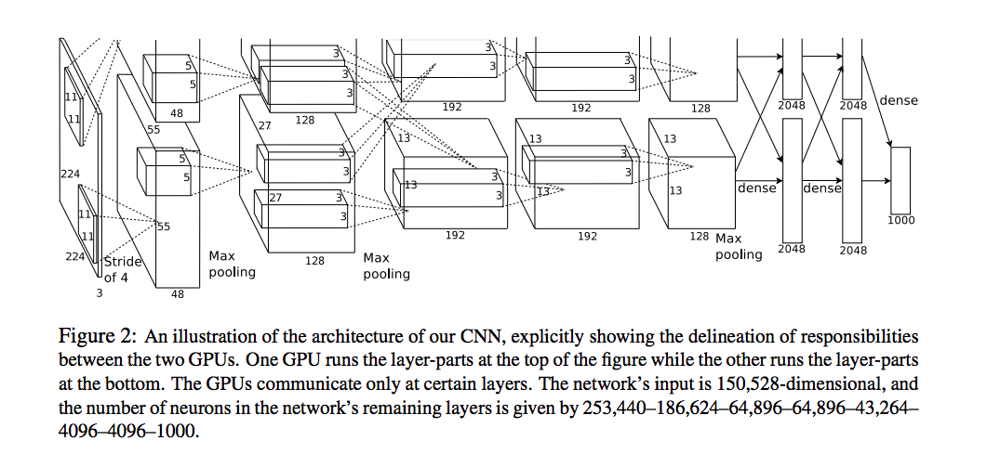
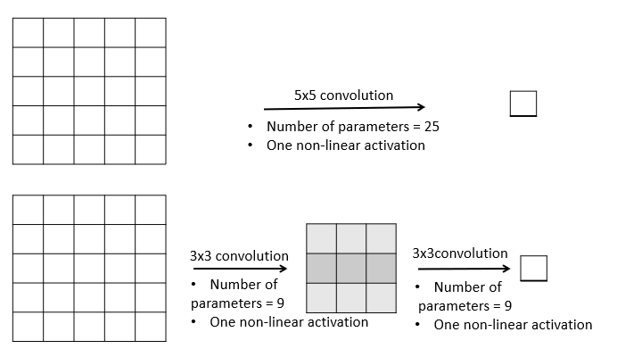
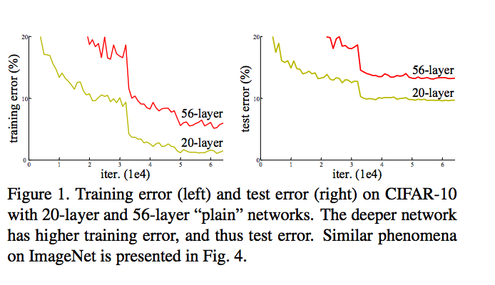
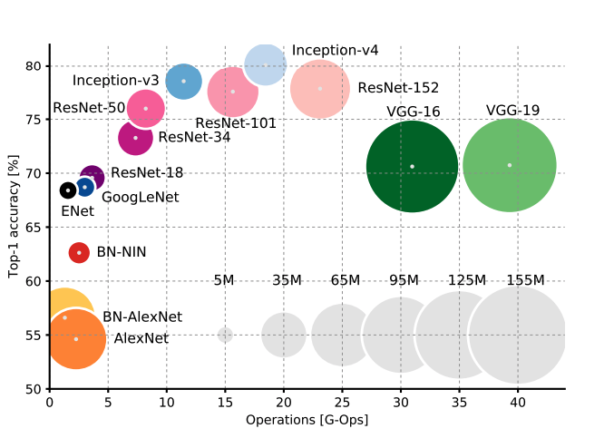
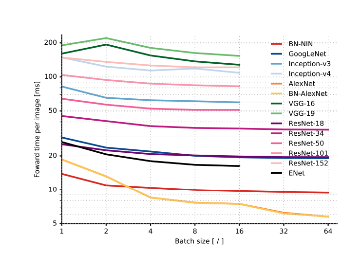
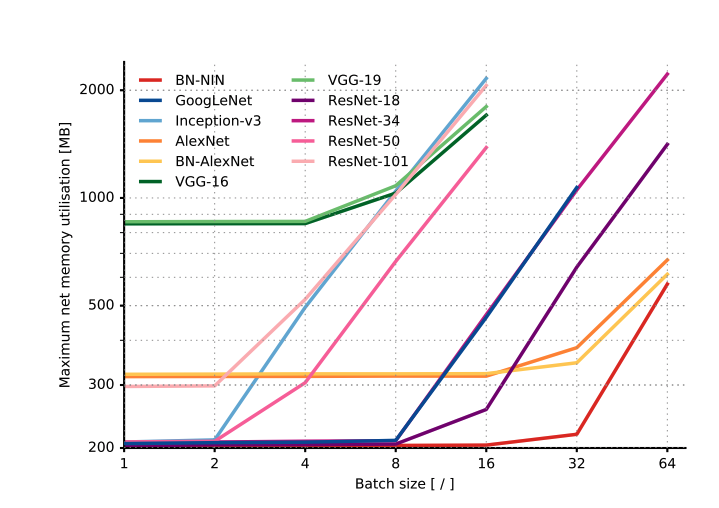

#   
# Transfer Learning  
  
In this session, we will take an overview of some of the most popular CNN architectures which have set the benchmark for state-of-the-art results in computer vision tasks. The acid test for almost CNN-based architectures has been the ++[ImageNet Large Scale Visual Recognition Competition](http://www.image-net.org/challenges/LSVRC/)++(**ImageNet)**. The dataset contains roughly 1.2 million training images, 50,000 validation images, and 150,000 testing images of about 1000 classes.  
   
We will discuss the following architectures in this session:  
* AlexNet  
* VGGNet  
* GoogleNet  
* ResNet  
  
  
To summarise the important points:  
* The **depth** of the state-of-the-art neural networks has been** steadily increasing** (from AlexNet with 8 layers to ResNet with 152 layers).  
* The developments in neural net architectures were made possible by **significant advancements in infrastructure**. For example, many of these networks were trained on multi GPUs in a distributed manner.  
* Since these networks have been trained on millions of images, they are good at **extracting generic features** from a large variety of images. Thus, they are now commonly being used as commodities by deep learning practitioners around the world.  
   
You will learn to use large pre-trained networks in the next section on **transfer learning**. In the next segment, we will study the architectures of AlexNet, VGGNet and GoogleNet.  
  
  
In this session, we will briefly look into the architectures of **AlexNet and VGGNet.**  
   
The **AlexNet** was one of the very first architectures to achieve extraordinary results in the ImageNet competition (with about a 17% error rate). It had used **8 layers** (5 convolutional and 3 fully connected). One distinct feature of AlexNet was that it had used various **kernels of large sizes** such as (11, 11), (5, 5), etc. Also, AlexNet was the first to use dropouts, which were quite recent back then.  
   
You are already familiar with **VGGNet** from the previous session. Recollect that the VGGNet has used **all filters of the same size** (3, 3) and had more layers (The VGG-16 had 16 layers with trainable weights, VGG-19 had 19** **layers etc.).   
   
The VGGNet had succeeded AlexNet in the ImageNet challenge by reducing the error rate from about 17% to less than 8%. Let's compare the architectures of both the nets.  
  
  
here are some other important points to note about AlexNet which are summarised below. We highly ++[recommend you to go through the AlexNet paper](https://papers.nips.cc/paper/4824-imagenet-classification-with-deep-convolutional-neural-networks.pdf)++ (you should be able to read most CNN papers comfortably now).   
   
Because of the lack of good computing hardware, it was trained on **smaller GPUs** (with only 3 GB of RAM). Thus, the training was **distributed across two GPUs** in parallel (figure shown below). AlexNet was also the first architecture to use the ReLU activation heavily.  
  
**Comprehension - Effective Receptive Field**  
The key idea in moving from AlexNet to VGGNet was to **increase the depth** of the network by using **smaller filters. **Let's understand what happens when we use a smaller filter of size (3, 3) instead of larger ones such as (5, 5) or (7, 7).  
   
Consider the example below. Say we have a 5 x 5 image, and in two different convolution experiments, we use two different filters of size (5, 5) and (3, 3) respectively.  
   
  
In the first convolution, the (5, 5) filter produces a feature map with a single element (note that the convolution is followed by a non-linear function as well). This filter has 25 parameters.  
   
In the second case with the (3, 3) filter, two successive convolutions (with stride=1, no padding) produce a feature map with one element.  
   
We say that the stack of two (3, 3) filters has the same **effective receptive field **as that of one (5, 5) filter.  This is because both these convolutions produce the same output (of size 1 x1 here) whose receptive field is the same 5 x 5 image.  
   
Notice that with a smaller (3, 3) filter, we can make a deeper network with **more non-linearities **and** fewer parameters**. In the above case:  
* The (5, 5) filter has 25 parameters and one non-linearity  
* The (3, 3) filter has 18 (9+9) parameters and two non-linearities.  
   
Since VGGNet had used smaller filters (all of 3 x 3) compared to AlexNet (which had used 11 x 11 and 5 x 5 filters), it was able to use a higher number of non-linear activations with a reduced number of parameters.  
   
In the next segment, we will briefly study **GoogleNet **which had outperformed VGGNet.  
   
**Additional readings**  
We strongly recommend you to read the AlexNet and VGGNet papers provided below. Now you should be able to read many CNN-based papers comfortably.  
1. ++[The VGGNet paper, Karen Simonyan et. al.](https://arxiv.org/pdf/1409.1556.pdf)++  
  
  
  
  
  
#todo sleep and get mac checked, and look at filter size with units.. did not understand..  
  
After VGGNet, the next big innovation was the **GoogleNet **which** **had won the ILSVRC’14 challenge with an error rate of about 6.7%.  
   
Unlike the previous innovations, which had tried to increase the model capacity by adding more layers, reducing the filter size etc. (such as from AlexNet to VGGNet), GoogleNet had increased the depth using a new type of convolution technique using the **Inception module.**  
The module derives its name from a previous paper by Lin et al and this meme popular in the deep learning community:  
  
Let's study the key features of GoogleNet architecture.  
  
To summarise, some important features of the GoogleNet architecture are as follows:  
* Inception modules stacked on top of each other, total 22 layers  
* Use of 1 x 1 convolutions in the modules  
* Parallel convolutions by multiple filters (1x1, 3x3, 5x5)  
* Pooling operation of size (3x3)  
* No FC layer, except for the last softmax layer for classification  
* Number of parameters reduced from 60 million (AlexNet) to 4 million  
   
The details on why the GoogleNet and the inception module work well are beyond the scope of this course, though you are encouraged to read the GoogleNet paper (provided below).   
   
In the next segment, we will look at the architecture of **ResNet**.  
   
**Additional reading**  
1. ++[The GoogleNet, Christian Szegedy et al](https://arxiv.org/pdf/1409.4842.pdf)++ - A detailed study and representation of Google net architecture and the convolution layers used in it.  
   
   
  
  
  
  
Until about 2014 (when the GoogleNet was introduced), the most significant improvements in deep learning had appeared in the form of **increased network depth** - from the AlexNet (8 layers) to GoogleNet (22 layers). Some other networks with around 30 layers were also introduced around that time.   
   
Driven by the significance of depth, a team of researchers asked the question: **Is learning better networks as easy as stacking more layers? **  
   
The team experimented with substantially deeper networks (with hundreds of layers) and found some counterintuitive results (shown below). In one of the experiments, they found that a 56-layered convolutional net had a higher training (and test) error than a 20-layered net on the CIFAR-10 dataset.   
  
Analyse the results in the plot above and list down at least 1-2 possible explanations for them.  
   
The team found that the results are *not because of overfitting. *If that were the case, the deeper net would have achieved much lower training error rate, while the test error would have been high.  
   
What could then explain these results? Let's find out.  
   
  
Thus, the **key motivator** for the ResNet architecture was the observation that, empirically, adding more layers was not improving the results monotonically.  This was counterintuitive because a network with n + 1 layers should be able to learn *at least* what a network with n layers could learn, plus something more.  
   
The ResNet team ++[(Kaiming He et al) came up with a novel architecture ](https://arxiv.org/pdf/1512.03385.pdf)++with **skip connections **which enabled them to train networks as deep as **152 layers**. The ResNet achieved groundbreaking results across several competitions - a 3.57% error rate on the ImageNet and the first position in many other ILSVRC and ++[COCO object detection](http://cocodataset.org/#home)++ competitions.  
   
  
Let's look at the basic mechanism, the **skip connections** or** residual connections,** which enabled the training of very deep networks.  
  
  
  
Thus, the **skip connection mechanism** was the key feature of the ResNet which enabled the training of very deep networks. Some other key features of the ResNet are summarised below. You are also encouraged to read the detailed results in the ResNet paper provided at the bottom of this page:  
  
* ILSVRC’15 classification winner (3.57% top 5 error)  
* 152 layer model for ImageNet  
* Has other variants also (with 35, 50, 101 layers)  
* Every 'residual block' has two 3x3 convolution layers  
* No FC layer, except one last 1000 FC softmax layer for classification  
* Global average pooling layer after the last convolution  
* Batch Normalization after every convolution layer  
* SGD + momentum (0.9)  
* No dropout used  
   
In the next few segments, you will learn how to use these large pre-trained networks to solve your own deep learning problems using the principles of **transfer learning.**  
  
  
## Introduction to transfer learning  
  
So far, we have discussed multiple CNN based networks which were trained on millions of images of various classes. The ImageNet dataset itself has about 1.2 million images of 1000 classes.  
   
However, what these models have 'learnt' is not confined to the ImageNet dataset (or a classification problem). In an earlier session, we had discussed that CNNs are basically **feature-extractors, **i.e. the convolutional layers learn a representation of an image, which can then be used for any task such as classification, object detection, etc.  
   
**This implies that the models trained on the ImageNet challenge have learnt to extract features from a wide range of images. Can we then transfer this knowledge to solve some other problems as well?**   
  
  
  
Thus, **transfer learning** is the practice of reusing the skills learnt from solving one problem to learn to solve a new, related problem.  Before diving into how to do transfer learning, let's first look at some practical reasons to do transfer learning in the first place.  
  
  
  
  
  
  
  
  
  
  
To summarise, some practical reasons to use transfer learning are as follows:  
* Data abundance in one task and data crunch in another related task,  
* Enough data available for training, but lack of computational resources.  
   
An example of the first case is this - say you want to build a model (to be used in a driverless car to be driven in India) to classify 'objects' such as a pedestrian, a tree, a traffic signal, etc. Now, let's say you don't have enough labelled training data from Indian roads, but you can find a similar dataset from an American city. You can try training the model on the American dataset, take those learned weights, and then train further on the smaller Indian dataset.  
   
Examples of the second use case are more common - say you want to train a model to classify 1000 classes, but don't have the infrastructure required. You can simply pick up a trained VGG or ResNet and train it a little more on your limited infrastructure. You will implement such a task in Keras shortly.  
   
In the next segment, we will see some other use cases where we can use transfer learning.  
  
Let's continue our discussion on use cases of transfer learning using some examples from **natural language processing**.  
  
  
Let’s revisit the example of **document summarisation**. If you want to do document summarisation in some other language, such as Hindi, you can take the following steps:  
  
* Use word embeddings in English to train a document summarisation model (assuming a significant amount of data in English is available)  
* Use word embeddings of another language such as Hindi (where you have a data crunch) to tune the English summarisation model  
   
Let's now summarise the main idea of transfer learning.  
  
Unlearning somethings from trained model, then relearn for another task.. Summary, why only final layer?  
  
  
### Layers in Deep Learning  
  
Thus, the initial layers of a network extract the basic features, the latter layers extract more abstract features, while the last few layers are simply discriminating between images.   
  
   
In other words, the initial few layers are able to **extract generic representations of an image** and thus can be used for any general image-based task. Let's see some examples of tasks we can use transfer learning for.  
  
  
  
  
  
## Practical Implementation  
  
here are two main ways of using pre-trained nets for transfer learning:  
* Freeze the (weights of) initial few layers and training only a few latter layers  
* Retrain the entire network (all the weights) initialising from the learned weights  
   
Let's look at these two techniques in detail.  
  
  
  
  
  
Thus, you have the following two ways of training a pre-trained network:  
1. ‘**Freeze**’ the initial layers, i.e. use the same weights and biases that the network has learnt from some other task, remove the few last layers of the pre-trained model, add your own new layer(s) at the end and **train only the newly added layer(s).**  
2. **Retrain** all the weights **starting (initialising) from the weights and biases** that the net has already learnt. Since you don't want to unlearn a large fraction of what the pre-trained layers have learnt. So, for the initial layers, we will choose a low learning rate.  
   
**When you implement transfer learning practically, you will need to take some decisions such as how many layers of the pre-trained network to throw away and train yourself. Let's see how one can answer these questions. **  
  
Can be any network, own network, not just images..  
Optimization of features by visualization is article on this only how neural network actually learns.. First few layers generate higher and higher level of abstraction, by generating more examples and last few discriminate/learn for that task.. Generator discriminator concept is in neural network only..This->up..  
  
  
To summarise:  
* If the task is a lot similar to that of the pre-trained model had learnt from, you can use most of the layers except the last few layers which you can retrain   
* If you think there is less similarity in the tasks, you can use only a few initial trained weights for your task.  
* More layers you have to retrain depends on the task.. and more computationally expensive obviously more layers more training simple..  
   
In the next segment, you will see a demonstration of Transfer Learning in Python + Keras.   
  
  
  
In this segment, you will learn to implement transfer learning in Python. For this implementation, we will use the ++[flower recognition dataset](https://www.kaggle.com/alxmamaev/flowers-recognition)++ from Kaggle. This dataset has around 4000 images from 5 different classes, namely daisy, dandelion, rose, sunflower and tulip.   
   
**Getting started with Google Colab**  
Google Colab is a free cloud service and provides free GPU access. You can ++[learn how to get started with Google Colab here](https://medium.com/deep-learning-turkey/google-colab-free-gpu-tutorial-e113627b9f5d)++. We recommend that you use a GPU to run the CIFAR-10 notebooks (running each notebook locally will take 2-3 hours, on a GPU it will take 8-10 minutes).   
You can download the notebook from ++[this Github repository](https://github.com/ContentUpgrad/dl_content/tree/main/Upgrad%20DL/Transfer%20Learning)++  
  
  
  
To summarise, we conducted two transfer learning experiments. In the first experiment, we removed the last fully connected layers of ResNet (which had learnt how to classify the 1000 ImageNet images). Instead, we added our own pooling, fully connected and a 5-softmax layer and trained only those. Notice that we got very good accuracy in just a few epochs. In case we weren't satisfied with the results, we could modify this network further (add an FC layer, modify the learning rate, replace the global average pooling layer with max pool, etc.).  
   
In the second experiment, we froze the first 140 layers of the model (i.e. used the pre-trained ResNet weights from layers 1-140) and trained the rest of the layers. Note that while updating the pre-trained weights, we should use a** small learning rate**. This is because we do not expect the weights to change drastically (we expect them to have learnt some generic patterns, and want to tune them only a little to accommodate for the new task).   
   
In the next two segments, you will go through an interesting recent paper which compares various CNN architectures from an efficiency and deployment point of view.  
  
## Analysis of Deep Learning Models  
  
In the past few years, the performance of CNN based architectures such as AlexNet, VGGNet, ResNet etc. has been steadily improving. But while **deploying deep learning models** in practice, you usually have to consider multiple other parameters apart from just accuracy.   
   
For example, say you've built a mobile app which uses a conv net for real-time face detection. Since it will be deployed on smartphones, some of which may have low memory etc., you might be more worried about it working 'fast enough', rather than the accuracy.    
   
In the next two segments, we will discuss a recent paper that appeared in 2017 - '**++[An Analysis of Deep Neural Network Models for Practical Applications](https://arxiv.org/pdf/1605.07678.pdf)++'**. This paper compares the popular architectures on multiple metrics related to **resource utilisation** such as accuracy, memory footprint, number of parameters, operations count, inference time and power consumption.**  **  
  
  
An important point to notice here is that although the VGGNet (VGG-16 and VGG-19) is used widely, it is by far the most expensive architecture — both in terms of the number of operations (and thus **computational time**) and the number of parameters (and thus **memory requirement**).   
   
  
  
In the next lecture, we will continue to discuss some other results.   
  
  
  
To summarise, some key points we have discussed are:  
* Architectures in a particular cluster, such as **GoogleNet, ResNet-18 and ENet,** are very attractive since they have **small footprints **(both memory and time) as well as pretty good accuracies. Because of low-memory footprints, they can be used on **mobile devices, **and because the number of operations is small, they can also be used in **real time inference**.  
* In some ResNet variants (ResNet-34,50,101,152) and Inception models (Inception-v3,v4), there is a **trade-off** between model accuracy and efficiency, i.e. the inference time and memory requirement.   
  
   
* There is a **marginal decrease** in the (forward) inference time per image with the batch size. Thus, it might not be a bad idea to use a large batch size if you need to.   
  
   
* Up to a certain batch size, most architectures use a constant memory, after which the consumption increases linearly with the batch size.  
  
   
In the next segment, we will continue our discussion of the paper.  
   
  
  
  
  
  
  
  
  
  
  
  
  
  
  
  
  
  
