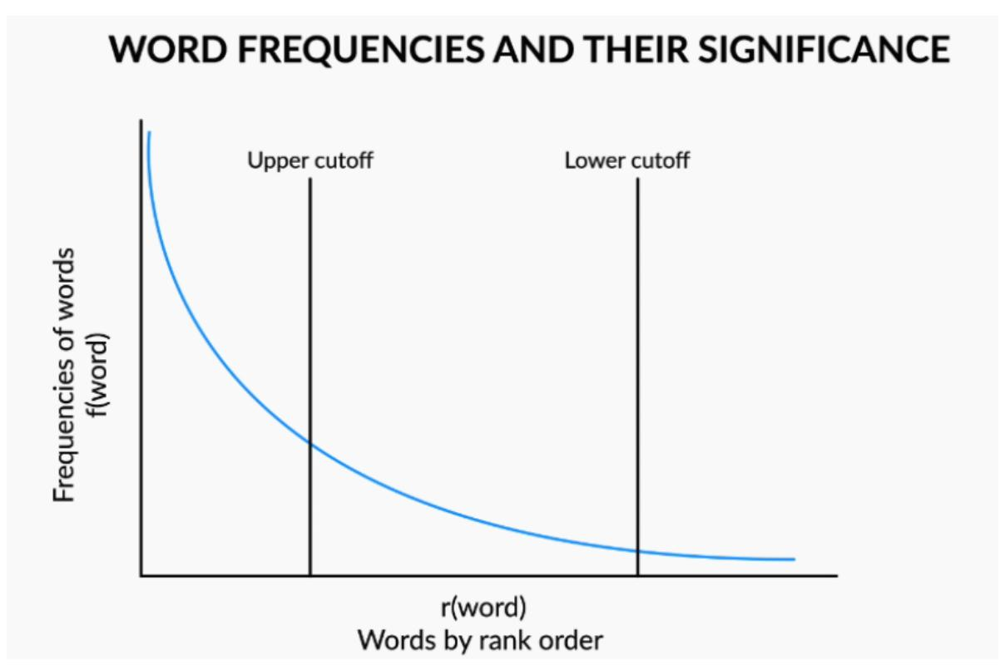
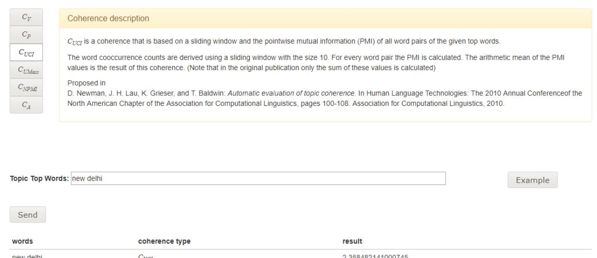

# Lecture Notes

# Lexical Processing

In this session, you learnt about the different areas where text analytics is applied such as healthcare, ecommerce, retail, financial and various other industries. Then you learnt about the stack that is generally followed to extract insights from the text and to build various applications of natural language processing. You learn there are three stages in text analytics:

- 1. Lexical processing: In this stage, you will be required to do text preprocessing and text cleaning steps such as tokenisation, stemming, lemmatization, correcting spellings, etc.
- 2. Syntactic processing: In this step, you will be required to extract more meaning from the sentence, by using its syntax this time. Instead of just blindly looking at what the words are, you'll look at the syntactic structures, i.e., the grammar of the language to understand what the meaning is.
- 3. Semantic processing: Lexical and syntactic processing do not suffice when it comes to building advanced NLP applications such as language translation, chatbots etc. The machine, after the two steps given above, will still be incapable of understanding the meaning of each word. Here, you will try and extract the hidden meaning behind the words which is also the most difficult part for computers. Semantic processing helps you to build advanced applications such as chatbots and language translators.

Then you learnt about text encoding and its various types such as ASCII and Unicode. You learnt how to change between different types of Unicode encodings in Python.

## **Regular Expressions**

Next, you looked at the regular expressions. Regular expressions help you immensely in the text preprocessing stage. You looked at various characters that have special meaning in the regular expressions' engine. Here is a list of all the special characters and their meaning.

| Sr. no | Character | Meaning                                                      |
|--------|-----------|--------------------------------------------------------------|
| 1      | *         | Matches the preceding character or character set zero or     |
|        |           | more times.                                                  |
| 2      | +         | Matches the preceding character or character set one or      |
|        |           | more times.                                                  |
| 3      | ?         | Matches the preceding character or character set zero or one |
|        |           | time.                                                        |
| 4      | {m, n}    | Matches the preceding character or character set if it is    |
|        |           | present from 'm' times to 'n' times.                         |

| ^        | Marks the start of a string. If used inside a character set, acts |
|----------|----------------------------------------------------------------------|
|          | as negation set.                                                     |
|          | Marks the end of a string.                                           |
|          | The wildcard character (used to match any character)                 |
| [a-z0-9] | Character set. Matches the character that are present inside      |
|          | the set.                                                             |
| \w       | Meta-sequence used to match all the alphanumeric   |
|          | characters                                                           |
| \W       | Meta-sequence used to match all the characters except the            |
|          | alphanumeric characters                                              |
| \d       | Meta-sequence used to match all the numeric digits.                  |
| \D       | Meta-sequence used to match all the characters except the            |
|          | numeric digits.                                                      |
| \s       | Meta-sequence used to match all the whitespace characters.           |
| \S       | Meta-sequence used to match all the characters except the            |
|          | whitespace characters.                                               |
| *?       | Non-greedy search. Search stops as soon as the pattern is         |
|          | found. '?' can be used after any of the quantifiers to make          |
|          | the search non-greedy.                                               |
|          | Used as an OR operator inside character sets or groups               |
| ()       | Used to group parts of regex to extract separately.                  |
|          | \$                                                                   |

When you use regex in Python, you need to know about some functions. The most useful functions are listed below:

| Sr. no. | Function                        | Meaning                                                    |  |  |  |
|---------|---------------------------------|------------------------------------------------------------|--|--|--|
| 1       | re.match(pattern ,string)       | Tries to look for the pattern in the string from the very  |  |  |  |
|         |                                 | beginning. Returns None if match not found at the start    |  |  |  |
|         |                                 | of the string.                                             |  |  |  |
| 2       | re.search(pattern, string)      | Tries to look for the pattern in the given string. Returns |  |  |  |
|         |                                 | None if match not found in the entire string.              |  |  |  |
| 3       | re.finall(pattern, string)      | Tries to look for each occurrence of the pattern in the    |  |  |  |
|         |                                 | string and returns all of them in a list. Returns None if  |  |  |  |
|         |                                 | match not found.                                           |  |  |  |
| 4       | re.finditer(pattern, string)    | Similar to re.findall() but iterated over the matches one  |  |  |  |
|         |                                 | by one.                                                    |  |  |  |
| 5       | re.sub(pattern, replacement, | Tries to look for each occurrence of the pattern in the    |  |  |  |
|         | string)                         | string and replaces all of them by the replacement         |  |  |  |
|         |                                 | string. Returns the same original if match not found.      |  |  |  |

Regular expressions are very powerful when it comes to text manipulation.

### **Word Frequencies and Stop Words**

When you plot any text document that is large enough (say, a hundred thousand words), you will notice that the word frequencies follow Zipf distribution as shown in the following image:

Figure 1: Word frequencies and their significance

Broadly, there are three kinds of words present in any text corpus:

- Highly frequent words called as **stop words**, such as 'is', 'an', 'the', etc.
- Significant words, which are very helpful for any analysis.
- Rarely occurring words.

Stop words are removed from the text because of two reasons:

- 1. They provide no useful information in most of the applications.
- 2. They use a lot of memory because of such high frequency in which they are present.

To remove stop words in Python, you can use the following piece of code:

Figure 2: Stop word removal in Python

Before you move ahead with any kind of lexical processing, you need to break the text corpus into different words or sentences or paragraphs according to the end application in mind. The NLTK library has various tokenisers:

- 1. Word tokeniser: Use this tokeniser to break your text corpus into a list of words.
- 2. Sentence tokeniser: Use this tokeniser to break your text into different sentences.
- 3. Tweet tokeniser: Use this tokeniser to tokenise text into different words. This also tokenises social media elements such as emojis and hashtags correctly unlike the word tokeniser.
- 4. Regexp Tokeniser: Use this to tokenise the text using a regular expression.

To tokenise words, you can use the following code:

Figure 3: Tokenisation in Python

### **Stemming and Lemmatization**

After tokenising the documents and removing the stop words, the next step is to reduce words to their base form. This results in getting rid of redundant information by only having unique tokens. You learnt two techniques to reduce words to their base form – stemming and lemmatization. Let's look at each of them:

- **1. Stemming**: It's a rule-based technique that just chops off the suffix of a word to get its root form which is called the '**stem'**. For example, if you use stemmer to stem words of the string - 'The driver is racing in his boss' car', the words 'driver' and 'racing' will be converted to their root form by just chopping off the suffixes 'er' and 'ing'. So, 'driver' will be converted to 'driv' and 'racing' will be converted to 'rac'. Now, you might think that the root forms (or stems) don't resemble the root words - 'drive' and 'race'. You don't have to worry about this because the stemmer will convert all the variants of 'drive' and 'racing' to those root forms only. So, it will convert 'drive', 'driving', etc. to 'driv', and 'race', 'racer', etc. to 'rac'.
- **2. Lemmatization**: This is a more sophisticated technique that is more intelligent in the sense that it doesn't just chop off the suffix of a word. Instead, it takes an input word and searches for its base word by going recursively through all the variations of dictionary words. The base word, in this case, is called the '**lemma'**. Words such as 'feet', 'drove', 'arose', 'bought', etc. can't be reduced to their correct base form using a stemmer. But a lemmatizer can reduce them to their correct base form. The most popular lemmatizer is the WordNet lemmatizer created by a team of professors at Princeton University.

A stemmer is much faster but gives you inaccurate results in many instances where the variant word is not of the form 'root word + suffix'. On the other hand, a lemmatizer gives you accurate results, but it is much slower than a stemmer. Also, you need to pass the POS tag of the word along with the word to be lemmatized.

Then you looked at the Python code to stem and tokenise words which is shown below:

Figure 4: Stemming and lemmatization in Python

### **Bag-of-Words Representation**

After learning all the preprocessing steps such as tokenisation, removal of stop words, stemming and lemmatization, the next thing that you learnt is changing the text from a textual form to a tabular form. You learnt that this could be done using the bag-of-words representation, also called a bag-of-words model, where each row of the table represents each document. And the columns represent the vocabulary of the text.

While learning how to create a bag-of-words model, you looked at the following example:

|   | actors | great | depends | gangs | movie | movies | new | performance | releasing | success | wasseypur | week |
|---|--------|-------|---------|-------|-------|--------|-----|-------------|-----------|---------|-----------|------|
| 1 | 0      | 1     | 0       | 1     | 1     | 0      | 0   | 0           | 0         | 0       | 1         | 0    |
| 2 | 1      | 0     | 1       | 0     | 1     | 0      | 0   | 1           | 0         | 1       | 0         | 0    |
| 3 | 0      | 0     | 0       | 0     | 0     | 1      | 1   | 0           | 1         | 0       | 0         | 1    |

Figure 5: Bag-of-words model

In the above model, all the stop words have been removed. The values in the cell represent the number of times a term 't' is present in the document 'd', that is, the values represent the term frequencies. For

example, the term 'actors' is has occurred a single time in document two whereas the term 'great' is absent in the second document.

You can also create a matrix with binary values – 0 and one where 0 signifies absence and 1 signifies the presence of the term in a document.

To create a bag-of-words model in Python, refer to the code shown in the following image.

Figure 6: Creating bag-of-words model in Python

### **TF-IDF Representation**

After learning he bag-of-words model, you learnt about a more sophisticated technique called the tf-idf model. Instead of just having the word frequencies in the table that you created for the bag-of-words model, you could have something that represents the word importance in a more meaningful way.

To calculate the tf-idf representation or tf-idf model, you need to calculate a tf-idf score for each word in each document. The tf-idf score comprises of two terms – the 'tf' (term frequency), and the 'idf' (inverse document frequency). The formula of tf-idf is shown in the following image:

$$tf_{t,d} = rac{frequency\ of\ term\ 't'\ in\ document\ 'd'}{total\ terms\ in\ document\ 'd'}$$

$$idf_t = log rac{total\ number\ of\ documents}{total\ documents\ that\ have\ the\ term\ 't'}$$

$$tf - idf = tf_{t,d} * idf_t$$

Figure 7: tf-idf formula

To create a tf-idf model, refer to the code shown in the following image:

Figure 8: Creating tf-idf model in Python

### **Spam Detector**

After learning all the above techniques, you created a spam detector using the Naïve Bayes classifier of the NLTK library. First, you tokenised all the messages, removed the stop words from them. Then you stemmed each word and removed words that were less than or equal to two characters long. You implemented it by creating the bag-of-words model from scratch in Python. Finally, you used to Naïve Bayes classifier to build the spam detector on top of the bag-of-words model. You got a really good accuracy of 98% on the test set.

Finally, you also learnt about how you could improve the classifier even further by considering the following steps:

- 1. Look for phone numbers in the messages. This is because a lot of spam messages ask you to dial a phone number.
- 2. Look for capitalised words at the start of each message. This is because a lot of spam messages have capitalised words such as "WINNER" at the very beginning of the message.
- 3. Look for multiple special characters such as exclamation marks. This is because most spam messages have multiple exclamation marks present in them, especially after words such as 'winner', 'congratulations', etc.

### **Canonicalisation**

Canonicalisation refers to the process of reducing any given word to its base word. Stemming and lemmatization were both techniques to canonicalise words to their base forms. You learn two more techniques to canonicalise words:

- 1. Phonetic hashing
- 2. Spell corrector

### **Phonetic Hashing**

There are certain words which have different pronunciations in different languages. As a result, they end up being spelt differently. Examples of such words include names of people, city names, names of dishes, etc. Take, for example, the capital of India - New Delhi. Delhi is also pronounced as Dilli in Hindi. Performing stemming or lemmatization to these words will not help us as much because the problem of redundant tokens will still be present. Hence, we need to reduce all the variations of a particular word to a common word. For this, you learn an algorithm called Soundex.

Using Soundex, you can reduce all the words to a four-digit code. All the words that have the same Soundex can then be mapped to a common word. For example, the Soundex of Bengaluru and Bangalore is B524.

The American Soundex algorithm is provided below:

Figure 9: Algorithm for the American Soundex

Now, let's arrive at the Soundex of the word 'Mississippi'. To calculate the hash code, you'll make changes to the same word, in-place, as follows:

- 1. Phonetic hashing is a four-letter code. The first letter of the code is the first letter of the input word. Hence it is retained as is. The first character of the phonetic hash is 'M'. Now, we need to make changes to the rest of the letters of the word.
- 2. Now, we need to map all the consonant letters (except the first letter). All the vowels are written as is and 'H's, 'Y's and 'W's remain unencoded (unencoded means they are removed from the word). After mapping the consonants, the code becomes MI22I22I11I.
- 3. The third step is to remove all the vowels. 'I' is the only vowel. After removing all the 'I's, we get the code M222211. Now, you would need to merge all the consecutive duplicate numbers into a single unique number. All the '2's are merged into a single '2'. Similarly, all the '1's are merged into a single '1'. The code that we get is M21.
- 4. The fourth step is to force the code to make it a four-letter code. You either need to pad it with zeroes in case it is less than four characters in length. Or you need to truncate it from the right side

in case it is more than four characters in length. Since the code is less than four characters in length, you'll pad it with one '0' at the end. The final code is M210.

The next thing that you learnt in canonicalization is building a spelling corrector to correct the misspellings. To build a spell corrector, you learnt about the concept of **edit distance**. An edit distance is the number of edits that are needed to convert a source string to a target string. You learnt that there are three edit operations allowed in the Levenshtein edit distance:

- 1. Insertion of a letter
- 2. Deletion of a letter
- 3. Substitution of a letter with another letter

Along with the above three edit operations, you can also do a transpose operation where you can swap two adjacent letters. This operation is allowed in the Damerau-Levenshtein edit distance.

You saw an example of calculating the edit distance between the strings "acquire" and "aquire". The example is shown below.

|   | EDIT DISTANCE |   |   |   |   |   |   |   |  |  |
|---|---------------|---|---|---|---|---|---|---|--|--|
|   |               | а | С | q | u | i | r | е |  |  |
| • | 0             | 1 | 2 | 3 | 4 | 5 | 6 | 7 |  |  |
| а | 1             | 0 | 1 | 2 | 3 | 4 | 5 | 6 |  |  |
| q | 2             | 1 | 1 | 1 | 2 | 3 | 4 | 5 |  |  |
| u | 3             | 2 | 2 | 2 | 1 | 2 | 3 | 4 |  |  |
| i | 4             | 3 | 3 | 3 | 2 | 1 | 2 | 3 |  |  |
| r | 5             | 4 | 4 | 4 | 3 | 2 | 1 | 2 |  |  |
| е | 6             | 5 | 5 | 5 | 4 | 3 | 2 | 1 |  |  |

Figure 10: Calculating edit distance

The final edit distance is the number that you get in the lower right corner of the matrix. To calculate the edit distance, you need to fill the entire matrix from right-to-left and top-to-bottom. While filling each cell:

- 1. You looked if the character that you were comparing are the same or not. If they are the same, then you copied the diagonal value (value present in the top-left cell) to the current cell.
- 2. If the characters are not the same, you looked at the least value (in the top cell, left the cell and the top-left cell) and added one to this value and filled the current cell with this value.

Using this edit distance, you can build a spell corrector. To calculate edit distance between two stings you can use the following code:

Figure 10: Calculating edit distance in Python

Figure 10: Calculating edit distance in Python

### **Spell Corrector**

At last, the final technique to canonicalize words was correcting the spellings of the incorrect words. You learnt about the edit distance calculation between two strings. You'll use the concept of edit distance while building the spell corrector. You learnt how to build the famous Norvig's spell corrector. You need a seed document which can be any large corpus of text with correct spellings. The seed document will also act as a dictionary lookup for our spell corrector. There were four main functions that you used to find the correct spelling of the word:

- 1. edits\_one(): It created all the possible words that are one edit distance away from the input word.
- 2. edits\_two(): Similar to edits\_one(), this function is used to return all the possible spellings that are two edit distance away from the input word.
- 3. known(): This function takes a list of words and output only the valid English words.
- 4. possible\_corrections(): This function takes the input word and uses all of the above three functions to return possible correct spellings for the given input word. First, it looks as if the spelling is correct or not. If it is correct, it returns the input word. If the spelling is not correct, it looks for all the dictionary words that are one edit away from it and returns them. If there are no dictionary words that are one edit distance away from the given word, then it looks for all the dictionary words that are two edits away and returns them. If there are no such words that are two edits away, the original word is retuned which means no correct spelling was found.
- 5. prob(): The probability function takes multiple words and returns the word that is most frequent among the input words in the seed document. The word returned by this is the correct spelling.

### **Pointwise Mutual Information**

Till now you have learnt about reducing words to their base form. But there is another common scenario that you'll encounter while working with text. Suppose there is an article titled "Higher Technical Education in India" which talks about the state of Indian education system in engineering space. Let's say, it contains names of various Indian colleges such as 'International Institute of Information Technology, Bangalore', 'Indian Institute of Technology, Mumbai', 'National Institute of Technology, Kurukshetra' and many other colleges. Now, when you tokenise this document, all these college names will be broken into individual words such as 'Indian', 'Institute', 'International', 'National', 'Technology' and so on. But we don't want this. We want an entire college name to be represented by one token.

To represent terms that are made up of multiple words, you need to calculate the PMI value of a term. Based on the PMI value, you decide whether this term should be represented by a single token or not. So, if you calculate the PMI value of terms such as 'International Institute of Information Technology, Bangalore', their PMI value will be much higher than other terms such as 'is are'. The following table shows some phrases with the highest and lowest PMI values:

| word 1 | word 2    | count word 1 | count word 2 | count of co-occurrences | PMI            |
|--------|-----------|--------------|--------------|-------------------------|----------------|
| puerto | rico      | 1938         | 1311         | 1159                    | 10.0349081703  |
| hong   | kong      | 2438         | 2694         | 2205                    | 9.72831972408  |
| los    | angeles   | 3501         | 2808         | 2791                    | 9.56067615065  |
| carbon | dioxide   | 4265         | 1353         | 1032                    | 9.09852946116  |
| prize  | laureate  | 5131         | 1676         | 1210                    | 8.85870710382  |
| san    | francisco | 5237         | 2477         | 1779                    | 8.83305176711  |
| nobel  | prize     | 4098         | 5131         | 2498                    | 8.68948811416  |
| ice    | hockey    | 5607         | 3002         | 1933                    | 8.6555759741   |
| star   | trek      | 8264         | 1594         | 1489                    | 8.63974676575  |
| car    | driver    | 5578         | 2749         | 1384                    | 8.41470768304  |
| it     | the       | 283891       | 3293296      | 3347                    | -1.72037278119 |
| are    | of        | 234458       | 1761436      | 1019                    | -2.09254205335 |
| this   | the       | 199882       | 3293296      | 1211                    | -2.38612756961 |
| is     | of        | 565679       | 1761436      | 1562                    | -2.54614706831 |
| and    | of        | 1375396      | 1761436      | 2949                    | -2.79911817902 |
| а      | and       | 984442       | 1375396      | 1457                    | -2.92239510038 |
| in     | and       | 1187652      | 1375396      | 1537                    | -3.05660070757 |
| to     | and       | 1025659      | 1375396      | 1286                    | -3.08825363041 |
| to     | in        | 1025659      | 1187652      | 1066                    | -3.12911348956 |

Figure 11: PMI values of some phrases

You learnt how to calculate PMI of a two-word term. You can calculate it using the following formula:

pmi (x;y) = log 
$$\frac{p(x,y)}{p(x) p(y)}$$

Figure 12: PMI of a two-word term

Here, p(x,y) is the joint probability where as p(x) and p(y) are the marginal probabilities of the words 'x' and 'y'.

Then you learnt about what is an occurrence context. An occurrence context is the size of the window that you consider when you calculate the probability of each word. There can be various choices for occurrence context – a word, a sentence, a paragraph or even an entire document.

Then you looked at the following example where you calculated PMI of 'New Delhi' by using each sentence as the occurrence context.

$$p (New Delhi) = \frac{2}{3}$$

$$p (New) = \frac{2}{3}$$

$$p (Delhi) = \frac{3}{3}$$

$$pmi (New Delhi) = \frac{p (New Delhi)}{p (New) p (Delhi)}$$

Figure 13: Calculating PMI of a two-word term using each sentence as occurrence context

Now, for terms that comprise of more than two words, you need to calculate the **bigram approximation** from the chain rule. Without the bigram approximation, the calculations for PMI become pretty timeconsuming. Look at the following formula which is used to calculate PMI of a three-word term.

$$p m i (z,y,x) = log \left(\frac{p(z|y,x)p(y|x)}{p(y)p(z)}\right)$$

Figure 14: PMI calculation of a three-word term

As you can see, to calculate p(z|x,y), you need the joint probability of the words 'x' and 'y'. And the complexity will become more complex if you try to calculate PMI for longer terms. Hence, you can use **bigram approximation** using the n-gram model to calculate the PMI. An example of bigram approximation is shown below:

Figure 15: Bigram approximation using n-gram models

As you can see, with the bigram approximation, you only need to look at the previous word, not the entire set of words that have occurred before the current word. This makes computation very fast, and the results are almost the same. Now, instead of calculating p(z|x,y), you can calculate p(z|y) in the example that was used to calculate PMI for a three-word term.

Finally, you looked at an [online tool](http://palmetto.aksw.org/palmetto-webapp/) that was used to calculate PMI of any term. You can use that tool directly instead of calculating PMI values for terms that are present in your corpus and then decide if the term should be represented by a single token or not.

Figure 16: PMI calculation tool

A good cutoff is zero. If PMI value is greater than zero, then the term should be represented by a single token. Finally, after you've decided that a term has to be represented by a single token instead of multiple ones, you can replace the space between them by an underscore. For example, you can replace 'New Delhi' with 'New\_Delhi' to prevent it from being tokenised.