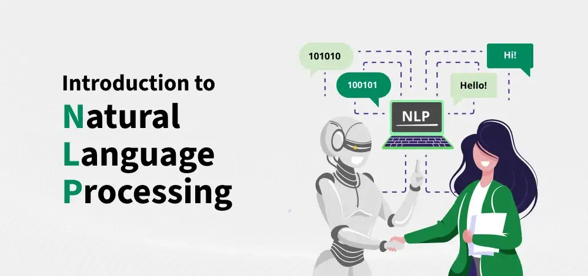
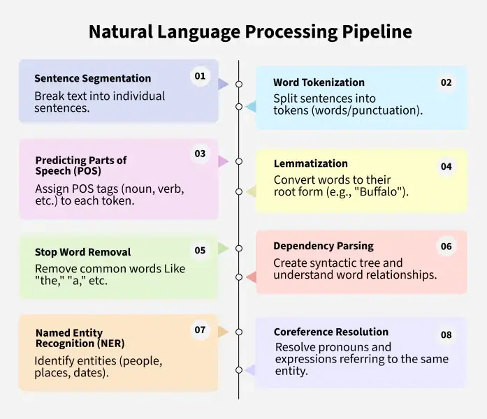
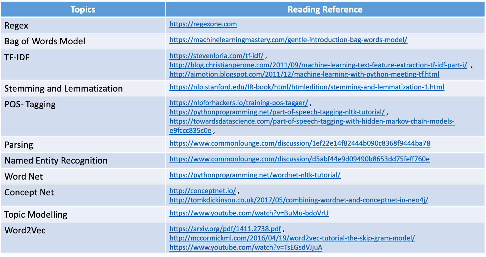
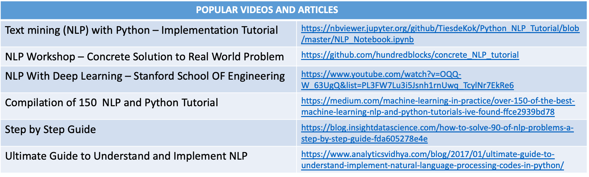
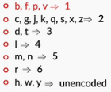
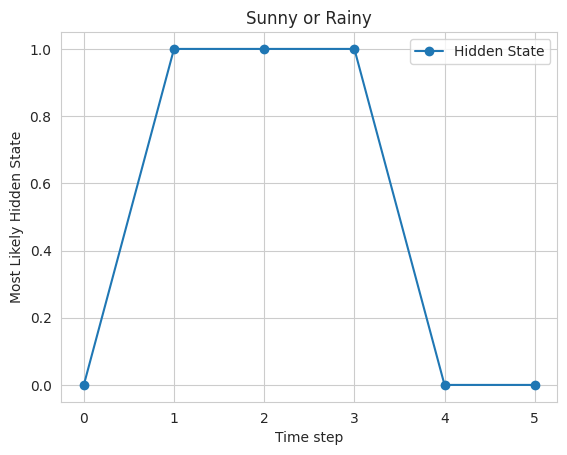
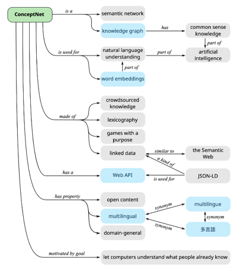
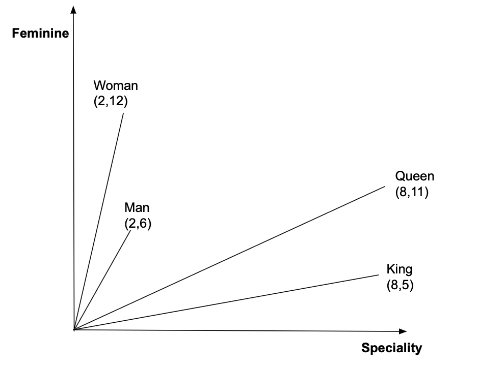

# Intro to Natural Language Processing (NLP)  
Natural Language Processing (NLP) enables computers to understand and interpret human language. While computers excel at processing structured data, such as spreadsheets or databases, natural language in its unstructured form (text, speech, etc.) presents a unique challenge. NLP bridges this gap by allowing machines to process and understand human languages, making it an essential tool in modern AI systems.
Let's learn more about Natural Language Processing in this article.
  
  
## Need for Natural Language Processing
The growing amount of unstructured natural language data in the world makes it increasingly important for machines to comprehend and analyze it effectively. By training NLP models, we can equip computers to process language data in a variety of forms, from written text to voice input. With centuries of human-written literature and massive data available, it’s vital to teach computers to interpret that wealth of information. However, this task comes with significant challenges, such as resolving ambiguities in meaning, Named-Entity Recognition (NER), and coreference resolution.
While NLP systems are improving, they still face difficulties in understanding the exact meaning of sentences.
For example, consider the phrase: "The boy radiated fire-like vibes." Does it refer to a motivating personality or imply something literal? Such ambiguities make text analysis complex for computers.
To solve these challenges, NLP breaks down language understanding into smaller, manageable components. This approach, known as the NLP pipeline, involves several stages that collectively enable machines to interpret human language effectivel
Key Steps in Natural Language Processing (NLP) Pipeline
  
  
**1. Sentence Segmentation**  
Sentence segmentation is the first step in NLP, which involves breaking text into individual sentences. This helps the computer understand the structure of the text.
Example Input: San Pedro is a town on the southern part of Ambergris Caye in Belize. According to estimates, it has a population of 16,444.
Output:  
* Sentence 1: San Pedro is a town on the southern part of Ambergris Caye in Belize.  
* Sentence 2: According to estimates, it has a population of 16,444.  
**2. Word Tokenization**  
Word tokenization divides sentences into smaller components called tokens (words or punctuation). These tokens are crucial for understanding how a sentence is structured.
Example Input: San Pedro is a town in Belize.
Output: Tokens: ['San', 'Pedro', 'is', 'a', 'town', 'in', 'Belize']  
**3. Predicting Parts of Speech (POS)**  
POS tagging involves identifying the function of each word in a sentence, such as whether it's a noun, verb, or adjective. This helps determine the role each word plays in the context of the sentence.
Example Input: San Pedro is a town.
Output: 'San Pedro' - Noun, 'is' - Verb, 'a' - Article, 'town' - Noun  
**4. Lemmatization**  
Lemmatization converts words to their root forms. For example, "Buffalo" and "Buffaloes" are both lemmatized to "Buffalo," ensuring that variations of the same word are treated identically.
Example Input: There are Buffaloes grazing in the field.
Output: Buffalo (root word)  
**5. Stop Word Removal**  
Stop words (e.g., "a," "the," "and") are common words that provide minimal meaning. Removing them helps reduce noise and improve the efficiency of NLP models.  
Prefix Tree-> /Users/deven/Developer/Machine_Learning_Algorithms/6_101/Week8/student_code/lab.py (autocomplete, autocorrect, not autosuggest)  
**6. Dependency Parsing**  
Dependency parsing identifies relationships between words, creating a syntactic tree. This helps understand the grammatical structure of a sentence and the roles of each word.
Example Input: San Pedro is an island in Belize.
Output: Parse Tree: ‘San Pedro’ (subject) → ‘is’ (verb) → ‘island’ (object)
Noun phrases group related words to represent a specific concept. In the sentence "The second-largest town in the Belize District," we can extract the noun phrase "second-largest town."  
**7. Named Entity Recognition (NER)**  
NER identifies and categorizes entities such as people, places, or dates in text.
Example Input: San Pedro is a town on the southern part of the island of Ambergris Caye in the Belize District of the nation of Belize, in Central America.
Output:  
* San Pedro: Geographic Entity  
* Ambergris Caye: Geographic Entity  
* Belize: Geographic Entity  
* Central America: Geographic Entity  
**8. Coreference Resolution**  
Coreference resolution identifies when two or more expressions in a text refer to the same entity. For example, the word "it" might refer to a specific person or thing earlier in the sentence.
Example Input: San Pedro is a town on the southern part of the island of Ambergris Caye. According to 2015 mid-year estimates, the town has a population of about 16,444. It is the second-largest town in the Belize District.
Output: "It" refers to "San Pedro."  
**Techniques Used in NLP**  
NLP techniques can be broadly categorized into two approaches:  
1. Rule-based Methods: These involve manually created rules and heuristics to process language data. For example, defining patterns in language to extract meaning.  
2. Machine Learning (ML) and Deep Learning (DL): These involve using algorithms to automatically learn from data and improve over time. ML models such as ++[decision trees](https://www.geeksforgeeks.org/machine-learning/decision-tree/)++, ++[support vector machines](https://www.geeksforgeeks.org/machine-learning/support-vector-machine-algorithm/)++, and deep learning models like ++[recurrent neural networks (RNNs) ](https://www.geeksforgeeks.org/machine-learning/introduction-to-recurrent-neural-network/)++and ++[transformers](https://www.geeksforgeeks.org/machine-learning/getting-started-with-transformers/)++ are commonly used in modern NLP.
One of the most prominent breakthroughs in NLP in recent years has been the use of transformers, a type of deep learning architecture that powers models like++[ BERT](https://www.geeksforgeeks.org/nlp/explanation-of-bert-model-nlp/)++ and ++[GPT](https://www.geeksforgeeks.org/artificial-intelligence/introduction-to-generative-pre-trained-transformer-gpt/)++. These models excel at tasks like language understanding and generation, enabling applications like chatbots and automated content creation.  
**Applications of NLP**  
1. Speech Recognition: Converting spoken language into text, which powers voice assistants like Siri and Alexa.  
2. Language Translation: Automatically translating text from one language to another (e.g., Google Translate).  
3. Chatbots and Virtual Assistants: Understanding and responding to user queries in natural language (e.g., customer support).  
4. Text Summarization: Condensing long documents into shorter summaries without losing important information.  
5. Sentiment Analysis: Understanding opinions expressed in text, which is useful in social media monitoring, product reviews, and customer feedback analysis.  
6. Information Retrieval: Enhancing search engines by interpreting and matching search queries with relevant documents.  
  

  
  
##   
##   
# Lexical Processing  
**Stemming**  
It is a **rule-based** technique that just chops off the suffix of a word to get its root form, which is called the ‘stem’. For example, if you use a stemmer to stem the words of the string - "The driver is racing in his boss’ car", the words ‘driver’ and ‘racing’ will be converted to their root form by just chopping of the suffixes ‘er’ and ‘ing’. So, ‘driver’ will be converted to ‘driv’ and ‘racing’ will be converted to ‘rac’.
 
You might think that the root forms (or stems) don’t resemble the root words - ‘drive’ and ‘race’. You don’t have to worry about this because the stemmer will convert all the variants of ‘drive’ and ‘racing’ to those root forms only. So, it will convert ‘drive’, ‘driving’, etc. to ‘driv’, and ‘race’, ‘racer’, etc. to ‘rac’. This gives us satisfactory results in most cases.
 
There are two popular stemmers:  
* **Porter stemmer**: This was developed in 1980 and works only on English words. You can find all the detailed rules of this stemmer ++[here](http://snowball.tartarus.org/algorithms/porter/stemmer.html)++.  
* **Snowball stemmer**: This is a more versatile stemmer that not only works on English words but also on words of other languages such as French, German, Italian, Finnish, Russian, and many more languages. You can learn more about this stemmer ++[here](http://snowball.tartarus.org/)++.
   
**Lemmatization**  
This is a more sophisticated technique (and perhaps more 'intelligent') in the sense that it doesn’t just chop off the suffix of a word. Instead, it takes an input word and searches for its base word by going recursively through all the variations of dictionary words. The base word in this case is called the **lemma**. Words such as ‘feet’, ‘drove’, ‘arose’, ‘bought’, etc. can’t be reduced to their correct base form using a stemmer. But a lemmatizer can reduce them to their correct base form. The most popular lemmatizer is the **WordNet lemmatizer** created by a team of researchers at the Princeton university. You can read more about it ++[here](https://wordnet.princeton.edu/)++.
 
Nevertheless, you may sometimes find yourself confused in whether to use a stemmer or a lemmatizer in your application. The following points might help you make the decision:  
1. A stemmer is a rule based technique, and hence, it is much faster than the lemmatizer (which searches the dictionary to look for the lemma of a word). On the other hand, a stemmer typically gives less accurate results than a lemmatizer.  
2. A lemmatizer is slower because of the dictionary lookup but gives better results than a stemmer. Now, as a side note, it is important to know that for a lemmatizer to perform accurately, you need to provide the **part-of-speech tag** of the input word (noun, verb, adjective etc.). You’ll see learn POS tagging in the next session - but it would suffice to know that there are often cases when the POS tagger itself is quite inaccurate on your text, and that will worsen the performance of the lemmatiser as well. In short, you may want to consider a stemmer rather than a lemmatiser if you notice that POS tagging is inaccurate.
 
In general, you can try both and see if its worth using a lemmatizer over a stemmer. If a stemmer is giving you almost same results with increased efficiency than choose a stemmer, otherwise use a lemmatizer.  
### Tf-IDF  
The bag of words representation, while effective, is a very naive way of representing text. It relies on just the word frequencies of the words of a document. But don’t you think word representation shouldn’t solely rely on the word frequency? There is another way to represent documents in a matrix format which represents a word in a smarter way. It’s called the TF-IDF representation and it is the one that is often preferred by most data scientists.
 
The term TF stands for term frequency, and the term IDF stands for inverse document frequency. How is this different from bag-of-words representation? Professor Srinath explains the concept of TF-IDF below.  
  
The TF-IDF representation, also called the **TF-IDF model**, takes into the account the importance of each word. In the bag-of-words model, each word is assumed to be equally important, which is of course not correct.
 
The formula to calculate TF-IDF weight of a term in a document is:
   
 
 
The log in the above formula is with base 10. Now, the tf-idf score for any term in a document is just the product of these two terms:  
 
Higher weights are assigned to terms that are present frequently in a document and which are rare among all documents. On the other hand, a low score is assigned to terms which are common across all documents.
 
Now, attempt the following quiz. Questions 1-3 are based on the following set of documents:
Document1: "Vapour, Bangalore has a really great terrace seating and an awesome view of the Bangalore skyline"
Document2: "The beer at Vapour, Bangalore was amazing. My favourites are the wheat beer and the ale beer."
Document3: "Vapour, Bangalore has the best view in Bangalore."  
**Phonetic hashing**  
  
**is done using the Soundex algorithm. American Soundex is the most popular Soundex algorithm. It buckets British and American spellings of a word to a common code. It doesn't matter which language the input word comes from - as long as the words sound similar, they will get the same hash code.**  
 
Now, let’s arrive at the Soundex of the word ‘Mississippi’. To calculate the hash code, you’ll make changes to the same word, in-place, as follows:  
1. Phonetic hashing is a four-letter code. The first letter of the code is the first letter of the input word. Hence it is retained as is. The first character of the phonetic hash is ‘M’. Now, we need to make changes to the rest of the letters of the word.  
2. Now, we need to map all the consonant letters (except the first letter). All the vowels are written as is and ‘H’s, ‘Y’s and ‘W’s remain unencoded (unencoded means they are removed from the word). After mapping the consonants, the code becomes MI22I22I11I.
 
  
3.   
4. 

   
5. The third step is to remove all the vowels. ‘I’ is the only vowel. After removing all the ‘I’s, we get the code M222211. Now, you would need to merge all the consecutive duplicate numbers into a single unique number. All the ‘2’s are merged into a single ‘2’. Similarly, all the ‘1’s are merged into a single ‘1’. The code that we get is M21.  
6. The fourth step is to force the code to make it a four-letter code. You either need to pad it with zeroes in case it is less than four characters in length. Or you need to truncate it from the right side in case it is more than four characters in length. Since the code is less than four characters in length, you’ll pad it with one ‘0’ at the end. The final code is M210.  
### Phonetic correction  
Our final technique for tolerant retrieval has to do with *phonetic* correction: misspellings that arise because the user types a query that sounds like the target term. Such algorithms are especially applicable to searches on the names of people. The main idea here is to generate, for each term, a ``phonetic hash'' so that similar-sounding terms hash to the same value. The idea owes its origins to work in international police departments from the early 20th century, seeking to match names for wanted criminals despite the names being spelled differently in different countries. It is mainly used to correct phonetic misspellings in proper nouns.
Algorithms for such phonetic hashing are commonly collectively known as *soundex* algorithms. However, there is an original soundex algorithm, with various variants, built on the following scheme:  
1. Turn every term to be indexed into a 4-character reduced form. Build an inverted index from these reduced forms to the original terms; call this the soundex index.  
2. Do the same with query terms.  
3. When the query calls for a soundex match, search this soundex index.
The variations in different soundex algorithms have to do with the conversion of terms to 4-character forms. A commonly used conversion results in a 4-character code, with the first character being a letter of the alphabet and the other three being digits between 0 and 9.  
4. Retain the first letter of the term.  
5. Change all occurrences of the following letters to '0' (zero): 'A', E', 'I', 'O', 'U', 'H', 'W', 'Y'.  
6. Change letters to digits as follows: B, F, P, V to 1. C, G, J, K, Q, S, X, Z to 2. D,T to 3. L to 4. M, N to 5. R to 6.  
7. Repeatedly remove one out of each pair of consecutive identical digits.  
8. Remove all zeros from the resulting string. Pad the resulting string with trailing zeros and return the first four positions, which will consist of a letter followed by three digits.
For an example of a soundex map, Hermann maps to H655. Given a query (say herman), we compute its soundex code and then retrieve all vocabulary terms matching this soundex code from the soundex index, before running the resulting query on the standard inverted index.
This algorithm rests on a few observations: (1) vowels are viewed as interchangeable, in transcribing names; (2) consonants with similar sounds (e.g., D and T) are put in equivalence classes. This leads to related names often having the same soundex codes. While these rules work for many cases, especially European languages, such rules tend to be writing system dependent. For example, Chinese names can be written in Wade-Giles or Pinyin transcription. While soundex works for some of the differences in the two transcriptions, for instance mapping both Wade-Giles hs and Pinyin x to 2, it fails in other cases, for example Wade-Giles j and Pinyin r are mapped differently.  
##   
# Syntactic Processing  
  
## Hidden Markov Model  
  
When working with sequences of data, we often face situations where we can't directly see the important factors that influence the datasets. Hidden Markov Models (HMM) help solve this problem by predicting these hidden factors based on the observable data  
Hidden Markov Model in Machine Learning  
  
  
It is a ++[statistical model](https://www.geeksforgeeks.org/machine-learning/difference-between-statistical-model-and-machine-learning/)++ that is used to describe the probabilistic relationship between a sequence of observations and a sequence of hidden states. Iike it is often used in situations where the underlying system or process that generates the observations is unknown or hidden, hence it has the name "Hidden Markov Model."   
An HMM consists of two types of variables: hidden states and observations.  
* The hidden states are the underlying variables that generate the observed data, but they are not directly observable.  
* The observations are the variables that are measured and observed.   
The relationship between the hidden states and the observations is modeled using a probability distribution. The Hidden Markov Model (HMM) is the relationship between the hidden states and the observations using two sets of probabilities: the transition probabilities and the emission probabilities.   
* The transition probabilities describe the probability of transitioning from one hidden state to another.  
* The emission probabilities describe the probability of observing an output given a hidden state.  
Hidden Markov Model  Algorithm  
The Hidden Markov Model (HMM) algorithm can be implemented using the following steps:  
* Step 1: Define the state space and observation space: The state space is the set of all possible hidden states, and the observation space is the set of all possible observations.  
* Step 2++:++ Define the initial state distribution: This is the probability distribution over the initial state.  
* Step 3: Define the state transition probabilities: These are the probabilities of transitioning from one state to another. This forms the transition matrix, which describes the probability of moving from one state to another.  
* Step 4: Define the observation likelihoods: These are the probabilities of generating each observation from each state. This forms the emission matrix, which describes the probability of generating each observation from each state.  
* Step 5: Train the model: The parameters of the state transition probabilities and the observation likelihoods are estimated using the Baum-Welch algorithm, or the forward-backward algorithm. This is done by iteratively updating the parameters until convergence.  
* Step 6: Decode the most likely sequence of hidden states: Given the observed data, the Viterbi algorithm is used to compute the most likely sequence of hidden states. This can be used to predict future observations, classify sequences, or detect patterns in sequential data.  
* Step 7: Evaluate the model: The performance of the HMM can be evaluated using various metrics, such as accuracy, precision, recall, or F1 score.  
To summarise, the HMM algorithm involves defining the state space, observation space, and the parameters of the state transition probabilities and observation likelihoods, training the model using the Baum-Welch algorithm or the forward-backward algorithm, decoding the most likely sequence of hidden states using the Viterbi algorithm, and evaluating the performance of the model.  
Implementation of HMM in python  
Till now we have covered the essential steps of HMM and now lets move towards the hands on code implementation of the following  
Key steps in the Python implementation of a simple ++[Hidden Markov Model](https://www.geeksforgeeks.org/nlp/markov-chains-in-nlp/)++ (HMM) using the hmmlearn library.  
Example 1. Weather Prediction  
Problem statement: Given the historical data on weather conditions, the task is to predict the weather for the next day based on the current day's weather.  
Step 1: Import the required libraries  
The code imports the ++[NumPy](https://www.geeksforgeeks.org/numpy/python-numpy/)++,++[matplotlib](https://www.geeksforgeeks.org/python/python-introduction-matplotlib/)++, ++[seaborn](https://www.geeksforgeeks.org/python/introduction-to-seaborn-python/)++, and the hmmlearn library.  
  
```
import numpy as np
import matplotlib.pyplot as plt
import seaborn as sns
from hmmlearn import hmm

```
Step 2: Define the model parameters  
In this example, The state space is defined as a state which is a list of two possible weather conditions: "Sunny" and "Rainy". The observation space is defined as observations which is a list of two possible observations: "Dry" and "Wet". The number of hidden states and the number of observations are defined as constants.   
  
```
states = ["Sunny", "Rainy"]
n_states = len(states)
print('Number of hidden states :',n_states)

observations = ["Dry", "Wet"]
n_observations = len(observations)
print('Number of observations  :',n_observations)

```
Output:  
```
Number of hidden states : 2
Number of observations  : 2

```
The start probabilities, transition probabilities, and emission probabilities are defined as arrays. The start probabilities represent the probabilities of starting in each of the hidden states, the transition probabilities represent the probabilities of transitioning from one hidden state to another, and the emission probabilities represent the probabilities of observing each of the outputs given a hidden state.  
The initial state distribution is defined as state_probability, which is an array of probabilities that represent the probability of the first state being "Sunny" or "Rainy". The state transition probabilities are defined as transition_probability, which is a 2x2 array representing the probability of transitioning from one state to another. The observation likelihoods are defined as emission_probability, which is a 2x2 array representing the probability of generating each observation from each state.  
  
```
state_probability = np.array([0.6, 0.4])
print("State probability: ", state_probability)

transition_probability = np.array([[0.7, 0.3],
                                   [0.3, 0.7]])
print("\nTransition probability:\n", transition_probability)
emission_probability= np.array([[0.9, 0.1],
                                 [0.2, 0.8]])
print("\nEmission probability:\n", emission_probability)

```
Output:  
```
State probability:  [0.6 0.4]
Transition probability:
 [[0.7 0.3]
 [0.3 0.7]]
Emission probability:
 [[0.9 0.1]
 [0.2 0.8]]

```
Step 3: Create an instance of the HMM model and Set the model parameters  
The HMM model is defined using the hmm.CategoricalHMM class from the hmmlearn library. An instance of the CategoricalHMM class is created with the number of hidden states set to n_hidden_states and the parameters of the model are set using the startprob_, transmat_, and emissionprob_ attributes to the state probabilities, transition probabilities, and emission probabilities respectively.  
  
```
model = hmm.CategoricalHMM(n_components=n_states)
model.startprob_ = state_probability
model.transmat_ = transition_probability
model.emissionprob_ = emission_probability

```
Step 4: Define an observation sequence  
A sequence of observations is defined as a one-dimensional NumPy array.  
The observed data is defined as observations_sequence which is a sequence of integers, representing the corresponding observation in the observations list.  
  
```
observations_sequence = np.array([0, 1, 0, 1, 0, 0]).reshape(-1, 1)
observations_sequence

```
Output:  
```
array([[0],
       [1],
       [0],
       [1],
       [0],
       [0]])

```
Step 5: Predict the most likely sequence of hidden states  
 The most likely sequence of hidden states is computed using the prediction method of the HMM model.  
  
```
# Predict the most likely sequence of hidden states
hidden_states = model.predict(observations_sequence)
print("Most likely hidden states:", hidden_states)

```
Output:  
```
Most likely hidden states: [0 1 1 1 0 0]

```
Step 6: Decoding the observation sequence  
The ++[Viterbi algorithm](https://www.geeksforgeeks.org/dsa/need-of-data-structures-and-algorithms-for-deep-learning-and-machine-learning/)++ is used to calculate the most likely sequence of hidden states that generated the observations using the decode method of the model. The method returns the log probability of the most likely sequence of hidden states and the sequence of hidden states itself.  
  
```
log_probability, hidden_states = model.decode(observations_sequence,
                                              lengths = len(observations_sequence),
                                              algorithm ='viterbi' )

print('Log Probability :',log_probability)
print("Most likely hidden states:", hidden_states)

```
Output:  
```
Log Probability : -6.360602626270058
Most likely hidden states: [0 1 1 1 0 0]

```
This is a simple algo of how to implement a basic HMM and use it to decode an observation sequence. The hmmlearn library provides a more advanced and flexible implementation of HMMs with additional functionality such as parameter estimation and training.  
Step 7: Plot the results  
  
```
sns.set_style("whitegrid")
plt.plot(hidden_states, '-o', label="Hidden State")
plt.xlabel('Time step')
plt.ylabel('Most Likely Hidden State')
plt.title("Sunny or Rainy")
plt.legend()
plt.show()

```
Output:  
  
Sunny or Rainy  
Finally, the results are plotted using the matplotlib library, where the x-axis represents the time steps, and the y-axis represents the hidden state. The plot shows that the model predicts that the weather is mostly sunny, with a few rainy days mixed in.  
Example 2: Speech recognition using HMM  
++Problem statement:++ Given a dataset of audio recordings, the task is to recognize the words spoken in the recordings.  
In this example, the state space is defined as states, which is a list of 4 possible states representing silence or the presence of one of 3 different words. The observation space is defined as observations, which is a list of 2 possible observations, representing the volume of the speech. The initial state distribution is defined as start_probability, which is an array of probabilities of length 4 representing the probability of each state being the initial state.  
The state transition probabilities are defined as transition_probability, which is a 4x4 matrix representing the probability of transitioning from one state to another. The observation likelihoods are defined as emission_probability, which is a 4x2 matrix representing the probability of emitting an observation for each state.  
The model is defined using the++[ MultinomialHMM ](https://www.geeksforgeeks.org/python/how-to-find-probability-distribution-in-python/)++class from hmmlearn library and is fit using the startprob_, transmat_, and emissionprob_ attributes. The sequence of observations is defined as observations_sequence and is an array of length 8, representing the volume of the speech in 8 different time steps.  
The predict method of the model object is used to predict the most likely hidden states, given the observations. The result is stored in the hidden_states variable, which is an array of length 8, representing the most likely state for each time step.  
  
```
import numpy as np
import matplotlib.pyplot as plt
import seaborn as sns
from hmmlearn import hmm


states = ["Silence", "Word1", "Word2", "Word3"]
n_states = len(states)

observations = ["Loud", "Soft"]
n_observations = len(observations)

start_probability = np.array([0.8, 0.1, 0.1, 0.0])

transition_probability = np.array([[0.7, 0.2, 0.1, 0.0],
                                    [0.0, 0.6, 0.4, 0.0],
                                    [0.0, 0.0, 0.6, 0.4],
                                    [0.0, 0.0, 0.0, 1.0]])

emission_probability = np.array([[0.7, 0.3],
                                  [0.4, 0.6],
                                  [0.6, 0.4],
                                  [0.3, 0.7]])

model = hmm.CategoricalHMM(n_components=n_states)
model.startprob_ = start_probability
model.transmat_ = transition_probability
model.emissionprob_ = emission_probability

observations_sequence = np.array([0, 1, 0, 0, 1, 1, 0, 1]).reshape(-1, 1)

hidden_states = model.predict(observations_sequence)
print("Most likely hidden states:", hidden_states)

sns.set_style("darkgrid")
plt.plot(hidden_states, '-o', label="Hidden State")
plt.legend()
plt.show()

```
Output:  
```
Most likely hidden states: [0 1 2 2 3 3 3 3]

```
  
Speech Recognition  
Other Applications of Hidden Markov Model  
HMMs are widely used in a variety of applications such as speech recognition, natural language processing, computational biology, and finance. In speech recognition, for example, an HMM can be used to model the underlying sounds or phonemes that generate the speech signal, and the observations could be the features extracted from the speech signal. In computational biology, an HMM can be used to model the evolution of a protein or DNA sequence, and the observations could be the sequence of amino acids or nucleotides.  
Conclusion  
In conlclusion, HMMs are a powerful tool for modeling sequential data, and their implementation through libraries such as hmmlearn makes them accessible and useful for a variety of applications.  
  
  
# Semantic Processing  
  
## Knowledge Graph  
The different types of knowledge graphs are as follows:  
* ++[WordNet:](https://wordnet.princeton.edu/)++ This is a lexical database of semantic relations between words. It is developed by Princeton University.  
* ++[ConceptNet](https://conceptnet.io/)++: This is a freely available semantic network that is designed to help computers understand the meanings of words that people use. It is developed by MIT.  
The graph that describes the conceptnet is given below.  
   
  
   
Both WordNet and ConceptNet are used for natural language understanding. At the end of this session, we will use WordNet to solve a use of Word Sense Disambiguation.  
   
Another type of knowledge graph is UMLS.   
* Unified Medical Language System (UMLS): It is a set of files and software that brings together many health and biomedical vocabularies and standards to enable interoperability between computer systems.  
Suppose you need to understand the text data that is related to the medical field. If you use WordNet or ConceptNet, you will have words that do not have relevance, and the results will be inaccurate. Hence, you require domain-specific knowledge graphs.  
We know the famous knowledge graph called Google Search.  
Although these are openly available knowledge graphs, many companies create their own knowledge graphs according to their company requirements.  
* Microsoft uses knowledge graphs for the Bing search engine, LinkedIn data and academics.  
* Facebook develops connections between people, events and ideas, focusing mainly on news, people and events related to the social network.  
* IBM provides a framework for other companies and/or industries to develop internal knowledge graphs.  
* eBay is currently developing a knowledge graph that functions to provide connections between users and the products present on the website.  
   
Fun Exploration:  
Watson is a question answering computer system that can answer questions posed in natural language. It is based on knowledge graphs. You can watch Watson winning the famous game of jeopardy ++[here](https://www.youtube.com/watch?v=P18EdAKuC1U)++.   
   
Now that you have gone through different types of knowledge graphs, in the next segment, you will gain a detailed understanding of one of the widely used knowledge graphs: ‘WordNet’.  
  
In the previous segment, you learnt about different types of knowledge graphs.  
In this segment, you will gain a detailed understanding of the WordNet knowledge graph.   
WordNet is a part of NLTK, and you will use it later in this module to identify the 'correct' sense of a word (i.e., for word sense disambiguation).  
WordNet® is a large lexical database of English words developed by Princeton University. It can be accessed ++[here](http://wordnet.princeton.edu/)++.  
  
  
  
  
Let us understand what we learnt in the above video.  
The diagram below is a screenshot from the WordNet website:  
  
   
In the diagram given above, each word sense of the word bank is grouped into its nouns and verbs. A set of all these senses is called a synset.  
Each sense of the word has a gloss or meaning of the word and an example as in the dictionary.  
For example, the first verb sense of the word has a gloss or a meaning as ‘tip literally’ and the example sentence as ‘the pilot had to bank the aircraft’.  
Similarly, each word sense contains a gloss and an example sentence.  

If meanings are available in the dictionary as well, what makes WordNet unique?  
Each of these senses of the words is related to other senses through some relations.   
  
The types of relationship between different words can be grouped as follows:  
1. Synonym: A relation between two similar concepts  
Example: Large is a synonym of big.  
1. Antonym: A relation between two opposite concepts  
Example: Small is an antonym of big.  
1. Hypernym: A relation between a concept and its superordinate  
 A superordinate is all-encompassing.  
Example: Fruits is the hypernym of mango.  
1. Hyponym: A relation between a concept and its subordinate  
Example: Apple is the hyponym of fruits.  
You can refer to the diagram given below to understand hyponyms and hypernyms. Any word that is connected with its hypernyms has an ‘is a’ relationship  
   
   
  
   
1. Holonym: A relation between a whole and its parts  
Example: Face is the holonym of eyes.  
1. Meronym: A relation between a part and its whole.  
Example: Eyes is the meronym of human body  
You can refer to the diagram given below to gain an understanding of holonyms and meronyms. Any word is connected with its holonym by a ‘has part’ relationship.   
   
  
   
Based on your learnings so far, attempt the following questions.  
   
Apart from these, can you think of some other examples of hypernyms, hyponyms, meronyms, holonyms, synonyms and antonyms?  
To summarise, Wordnet contains word senses for each word, and these senses are related through different relations.  
   
In the next segment, you will understand the different functions of WordNet using NLTK.  
###   
  
You learnt how to get the synsets of a word and the definition of each sense of the word.   
   
  
   
++[Source](https://web.stanford.edu/~jurafsky/slp3/18.pdf)++  
   
We started from the tractor and traversed the graph upwards using the hypernyms function in WordNet until we reached the wheeled vehicle.   
Then, we used the meronyms function to traverse the ‘has part’ relation.  
   
## Word Sense Disambiguation
   
Homonymy is when a word has multiple (entirely different) meanings. For example, consider the word ‘pupil’. It can either refer to students or eye pupils depending on the context in which it is used.   
   
Suppose you are searching for the word ‘pupil’. The search engines sometimes give data relevant to the context and sometimes give irrelevant data. Such things happen because the query may contain words whose meaning is ambiguous or those having several possible meanings.  
   
To solve this ambiguity problem, the Lesk algorithm is used.  
   
In the previous segment, we understood different functions in WordNet. In the next video, you will learn how WordNet can be used to disambiguate words.  
  
  
  
You can consider the definitions corresponding to the different senses of the ambiguous word and determine the definition that overlaps the maximum with the neighbouring words of the ambiguous word. The sense that has the maximum overlap with the surrounding words is then chosen as the ‘correct sense’.  
   
“She booked the **flight tickets** to Delhi in **advance**”  

|  |  |
| - | ------------------------------------------------------------------------------------------------------------------------------ |
|  | "reserve me a seat on a flight";
"The agent booked tickets to the show for the whole family";
"please hold a table at Maxim's" |
|  |  |
|  |  |
  

| Gloss 1 |  |
| ------- | - |
  

|  | arrange for and reserve (something for someone else) in advance |
| - | --------------------------------------------------------------- |
  

| Examples 1 |  |
| ---------- | - |
  

| Gloss 2 |  |
| ------- | - |
  

| a written work or composition that has been published (printed on pages bound together) |
| --------------------------------------------------------------------------------------- |
|  |
  

| Examples 2 |  |
| ---------- | - |
  

| "I am reading a good book on economics” |
| --------------------------------------- |
  
   
In this example, you will notice that the gloss or meaning 1 has more overlap than gloss 2. Hence, we consider gloss 1 as the correct sense.  
   
Although we have shown only two senses, a lesk algorithm parses through all the word senses and outputs the gloss that has the maximum overlap.  
   
In the next segment, you will learn how to understand how to use WordNet to code the Lesk algorithm in NLTK.  
   
Source: ++[https://wordnet.princeton.edu](https://wordnet.princeton.edu/)++ .  
  
## Distributional Semantic Processing  
  
  
### Geometric Representation of words  
What do you do first when you come across a word you are unfamiliar with?   
   
The dictionary definitions are not quite straightforward. Understanding a definition refers to understanding all the words within the definition of the word. However, we do not rely on a dictionary every time we don’t understand the meaning of a word.  
You understand the meaning of the word from the overall context of the surrounding words. For example, let us assume that one does not know the meaning of the word ‘credit”.   
   
After reading the sentence ‘The money was credited to my bank account’, one can easily infer that the word ‘credit’ is related to the exchange of currency. The words ‘money’ and ‘account’ set a context to the sentence that implies the predicted meaning. Through intelligent predictions such as this one, the meaning of words in a sentence becomes quite intuitive.  
   
Hence, it was rightly said by the English linguist John Firth in 1957 -  
 “You shall know a word by the company it keeps.”  
Distributional semantics creates word vectors such that the word’s meaning is captured from its context.  
  
  
###   
  
  
Now, let’s try to capture the meaning of a word using geometry. Let’s consider two dimensions, speciality and femininity, to represent the meaning of the word. A classic example of this would be plotting the words King, Queen, Man and Woman on a plot of Speciality vs Femininity.   
   
A King and Queen are equally special; however, a Queen is more feminine than a King. Similarly, a man is as special as a woman, but a woman is more feminine than a man. Interestingly, a man/woman is not as special as a king/queen. With all this in mind, the plot would look something like this.  
   
  
   
Note that the meaning of the word is restricted to only two features; hence, this is not the complete picture. However, this gives an intuitive understanding of how the meaning of words are represented in geometry.  
  
  
  
